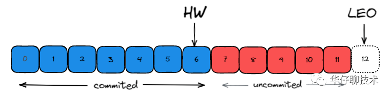

## controller

Kafka 是**依赖 Zookeeper** 来维护集群成员的信息：

- Kafka 使用 Zookeeper 的**临时节点来选举 Controller**。
- Zookeeper 在 Broker **加入/退出集群时通知 Controller**。
- Controller 负责在 Broker **加入/离开集群时**进行**分区 Leader 选举**。

## controller(控制器)作用

### Topic 管理

帮助我们完成**对topic的创建、删除以及分区增加**的操作，

### 分区重分配

**新的 broker**刚加入集群时**不会自动地分担己有 topic 的负载**，它**只对后续新增的 topic 生效**。
**除了broker 扩容导致的不均衡**外，再均衡还能用于处理**broker 存储负载不均衡**的情况，在单个或多个 broke之间的日志目录之间重新分配分区。用于解决多个代理之间的存储负载不平衡。

### Leader 选举

**触发分区 leader 选举场景**：
Offline：创建**新分区或分区失去**现有 leader
Reassign：用户执行**重分配**操作
PreferredReplica： 将 leader **迁移回首选副本**
ControlledShutdown：分区的现有 **leader 即将下线**

**过程**:
Controller **遍历所有相关的主题分区**并为其**指定新的Leader**。
然后向这些**主题分区的 Broker 发送更新请求**，其中包含了**最新的 Leader 与 Follower 副本分配信息**。
**更新完后**，新 Leader 会开始**处理**来自生产者和消费者的请求，而 **Follower** 开始**从新 Leader 那里复制消息**。

### 提供数据服务

控制器上保存了**最全的集群元数据信息**，其他所有 Broker 会**定期接收控制器发来的元数据更新请求**，从而**更新**其**内存中的缓存数据**。

**存储的大概有3大类：**
**所有topic信息**。包括具体的分区信息，比如 **Leader** 副本是谁，**ISR** 集合中有哪些副本等。
**所有 Broker 信息**。包括当前都有哪些**运行中的 Broker**，哪些正在**关闭中的 Broker** 等。
涉及**运维任务的副本分区**。包括当前正在**进行 Preferred Leader选举**以及**分区重分配的分区列表**等。

## 控制器故障转移

## Kafka Broker 之 HW（High Watermark，高水位标记） 和 LEO （Log End Offset，日志末尾偏移量）机制

Follower 是先从 Leader 同步然后再写入磁盘的，所以Follower磁盘上面的数据肯定会比 Leader 的那块少一些。

**日志复制中的一些重要偏移 （offset） 概念：**
**起始**位移base offset： 副本中所含**第一条**消息的 offset。

**高水位**high watermark：副本**最新一条己提交(commited 状态)**消息的 offset。
**标识**分区下的哪些消息是**可被消费的消息**。
协助 Kafka 完成**副本数据同步**。

**日志末端**位移log end offset：副本中**下一条待写入的 offset**。
如果 **Follower 和 Leader** 的 LEO 数据同步了，那么 **HW 就可以更新**了。

## HW 和 LEO 更新机制

在 Leader 副本所在的 Broker 上，还保存了同分区其他 Follower 副本的 LEO 值。

注意, 更新时, 图中红色(follower的高水位), 不会更新.
Leader Partition 就会**记录这些 Follower 同步过来的LEO**，然后**取最小的 LEO 值作为HW 值**。

**更新过程:**

## Kafka Broker 之 LeaderEpoch 机制

Follower 副本的 HW 更新需要一轮额外的拉取请求才能实现. 
如果把上一小节图中例子**扩展到更多个 Follower 副本**，需要更多轮拉取请求。所以, **Leader/Follower 副本 HW 更新**在时间上是**存在错配**的。(拉消息**涉及多个node**, **不保证一致性**). 
这种错配是很多“数据丢失”或“数据不一致”问题的根源。

**Leader Epoch, 年代数, 版本. 由2部分组成.**
**Epoch**：一个**单调递增的版本号**。每当副本**Leader 权发生变更**时，都会增加该版本号。小版本号的Leader 被认为是过期Leader，不能再行使Leader 权力。
**起始位移（Start Offset）**：Leader 副本在该 Epoch值上写入的**首条消息的位移**。

解决Broker 端参数 min.insync.replicas 设置为1场景下, 数据的丢失的例子, 具体看, https://articles.zsxq.com/id_v013euqkznz3.html
总结, 通过 Leader Epoch, 避免未更新的HW的消息丢失.

## Kafka Broker 之延迟任务时间轮机制

TimerTaskList是一个环形的双向链表，链表中的每个元素TimerTaskEntry封装了一个真正的定时任务TimerTask。

问题又来了，如果一个新的定时任务远远超过了当前的总体时间范围，比如350ms，那怎么办呢？
为此，kafka引入了**层级时间轮**的概念，当任务到期时间远远超过当前时间轮所表示的时间范围时，就会尝试添加到上层时间轮中。

