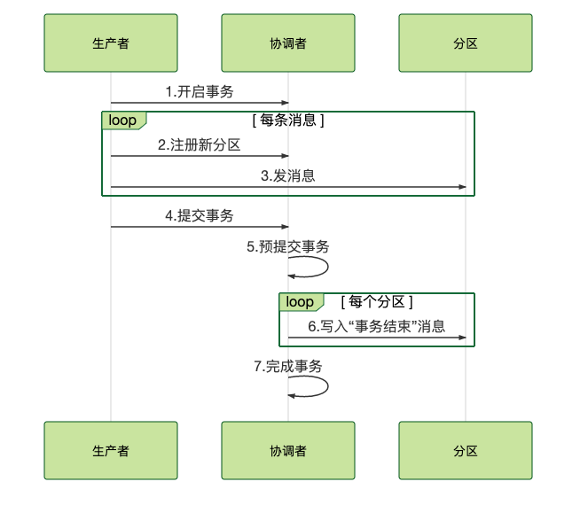

## 简述

**2阶段提交:**

- **1阶段:** 生产者给协调者发送**开启事务**的请求，协调者在事务日志中**记录下事务ID**;
- 然后 先发送消息**告知协调者, 消息在哪个主题和分区**, 再**给分区发送事务消息**;
- **2阶段:** 生产者根据事务的**所有消息**自己的**执行的状态**, **对协调者**进行事务的**提交/回滚**
- 协调者设置事务的状态为PrepareCommit/PrepareAbort，写入到事务日志中；
- 协调者在每个分区中写入事务结束/回滚的标识, **如果是commit**, 把之前过滤的未提交的事务消息**放行给消费端**进行消费; **如果是回滚**, **丢弃未提交的事务消息**;