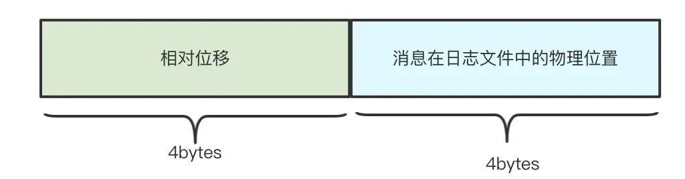
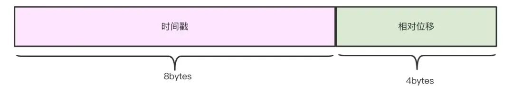
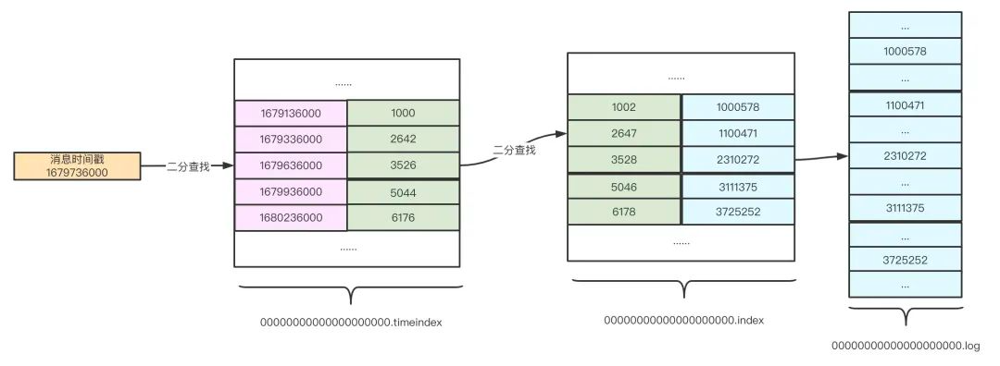

## 稀疏索引

存储日志的.log 文件, 位移索引文件.index, 时间戳索引文件.timeindex 文件.

Kafka 的索引文件是按照**稀疏索引(不会为每个记录都保存索引)的思想进行设计**的。
是写入一定的记录之后才会增加一个索引值，具体这个间隔有多大则通过**Logindex.interval.bytes** 控制，默认大小为4KB，表示**至少写入4KB 消息数据**之后，才会在索引文件中增加一个索引项。可见，**单条消息大小会影响Kakfa 索引的插入频率**.

## 位移索引文件.index

**位移索引文件的索引项结构:**

相对位移是指**文件名表示的初始位置**的相对位移

文件物理位置：**消息在 log 文件中保存的位置**. 

### 检索方式

假设 Kafka 要找位移为3550 的消息，那么 Kafka 首先会使用**二分查找**算法找到**小于 3550 的最大索引项**：［3528, 2310272］，然后**根据该索引项的文件物理位置**在 log 文件中从位置 2310272 开始**顺序查找**，直至找到位移为 3550 的消息记录为止。

## 时间戳索引文件.timeindex

0.10.0.0 以后的版本, 消息中增加了时间戳信息, 增加了时间戳索引文件，

**时间戳索引文件的索引项结构**:

**和位移索引文件一样, 2分查找, 再顺序查找.**

