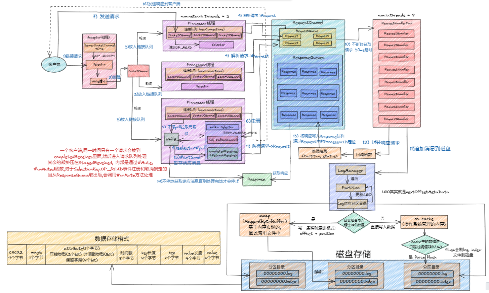

## Producer 之初始化

**Kafka Producer 初始化流程如下：**

## Producer 拉取元数据过程

**Kafka Producer 拉取元数据流程如下：**

## Kafka Producer 之发送流程

**Kafka Producer 发送消息流程如下：**

## Producer 内存池设计

### 申请内存的过程

### 释放内存

如果释放的是一个**批次的大小（16K）**，则直接加到**已分配内存**(这里的已分配是指创建好的buffer)里面；内存放到可用内存里面，
如果不是，则把这部分内存等待虚拟机（JVM）垃圾回收。**因为1M太大, 不适合之前定义的batch大小/时间发送条件.**

## Kafka Producer 之网络存储架构

