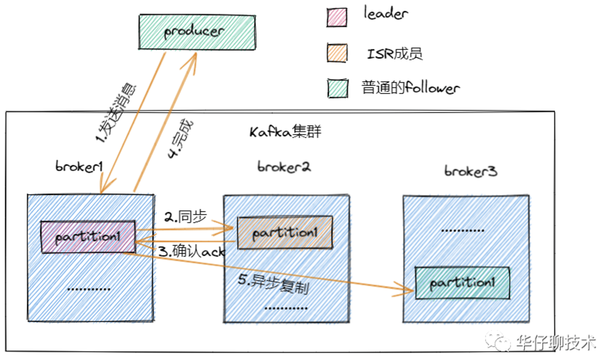
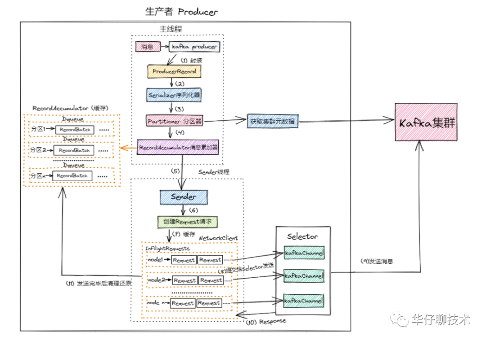
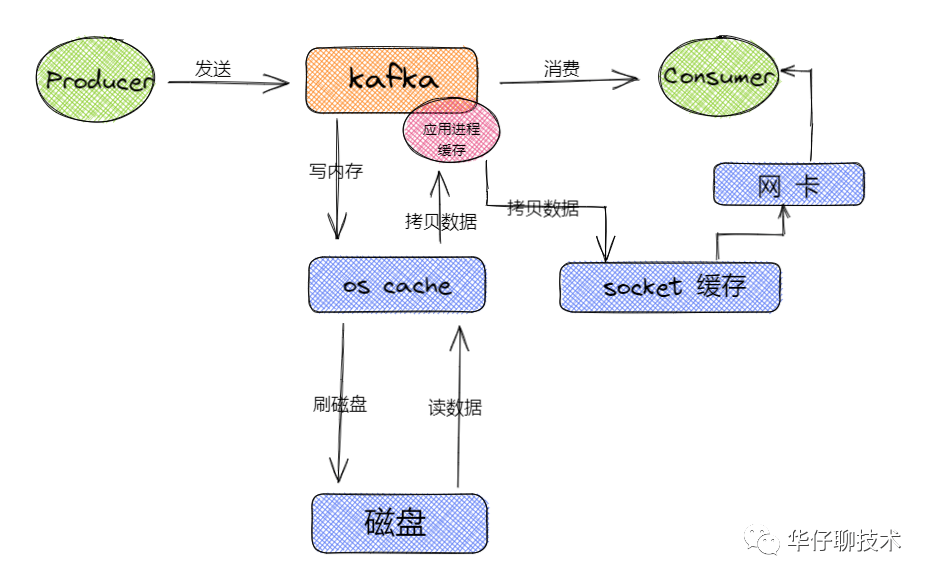
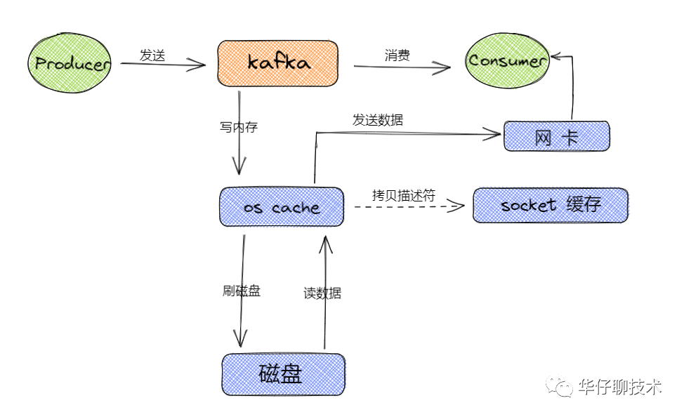
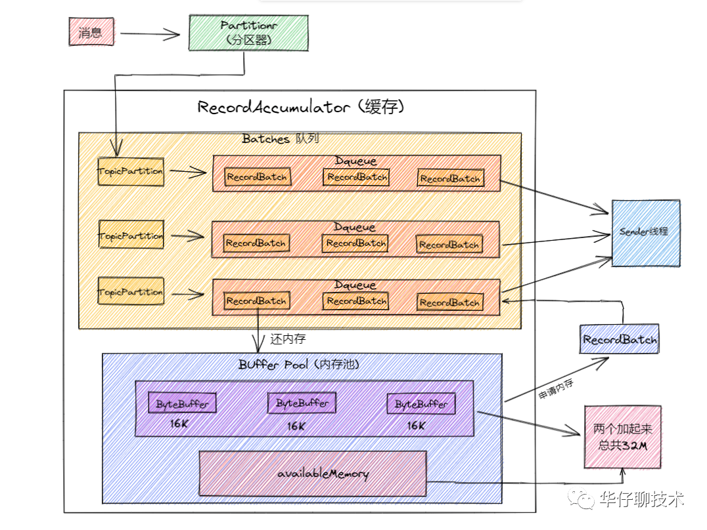

[toc]

## 概述

一个Topic 有多个 分区(Partition), 
每个分区(Partition)可以配置多个副本(Replica),

## Kafka 控制器

它除了具有一般 Broker 的功能外, 还具有**选出分区Leader节点**的功能,
启动 Kafka 系统时候，其中一个 Broker 会被选举为控制器，负责管理主题分区和副本的状态，还会执行**重分配的任务**。

**成为控制器过程**: 第一个启动的节点，会在 Zookeeper 系统里面**创建一个临时节点 /controller**，并**写入该节点的注册信息**，使该
节点成为控制器。
其他的节点在陆续启动时，也会尝试在 Zookeeper 系统中创建 /controller 节点，**/controller 节点已经存在**, 所以放弃创建/controller 节点，这样就**确保了** Kafka **集群控制器的唯一性**。

**其他节点**，也会**在控制器上注册相应的监听器**，

## 副本机制

Kafka **使用 Zookeeper 来维护集群 Brokers 的信息**，每个 Broker 都有一个唯一的标识broker.id，用于标识
自己在集群中的身份。Brokers 会通过 Zookeeper 选举出一个叫**Controller Broker节点**，它除了具备其它
Brokers的功能外，还负责管理主题分区及其副本的状态。

在 Kafka 中 **Topic 被分为多个分区（Partition）**，分区是 Kafka **最基本的存储单位**。用**replication-factor**参数**指定**分区的**副本个数**。分区副本总会有一个 Leader 副本，所有的消息都直接发送给Leader 副本，其它副本都需要通过复制 Leader 中的数据来保证数据一致。

## ISR(in-sync Replica) 机制

每个分区都有一个 ISR（in-sync Replica） 列表，用于维护所有同步的、可用的副本。
leader也是同步副本，所以列表包含leader,
对于 **Follower 同步副本**, 需要满足: 1. 必须**定时向 Zookeeper 发送心跳**；2. 在**规定的时间(`replica.lag.time.max.ms`)内从 Leader 副本“低延迟"地获取过消息**。
不满足上面条件的话，就会被从ISR 列表中移除, 直到满足条件才会被再次加入.

ISR的管理信息在 Zookeeper节点: `/brokers/topics/[topic]/partitions/[partition]/state`
有两个地方会对这个Zookeeper的节点进行维护:

1. Kafka 集群中的其中一个 Broker 会被选举出的Controller.
2. Controller 下的 LeaderSelector 选举出的  Leader.

## ACK 机制

有4种常见的值可以设置，分别是：**0、1和 all, min.insync.replicas**。
0，Producer 不会等待 Broker 反馈。
1,  Leader 节点会将记录先写入本地日志，在所有 Follower 节点反馈之前就先确认成功。
all, 等待所有同步中的LSR副本确认之后再确认完成.
min.insync.replicas, 写入生产者数据所需要的**最少ISR个数**.

## Reactor 多路复用模型

## 生产消息流程

1. 首先来一条消息后，生产者源码里面会对消息进行**封装成 ProducerRecord对象**。
2. 封装成对象后会对该**对象序列化**［涉及网络传输］，调用Serializer组件进行序列化，序列化后进行发送。
3. 在**发送前要确定，到底要把这条消息发送到哪个主题的哪个分区**，这个时候就需要**通过 Partitioner 分区器从 Kafka Broker集群中获取集群元数据**，获取到元数据后就可以进行发送了。
4. 在0.8版本之前，这个时候来了一条消息就会封装成一个请求发送到Broker，这种情况下，性能是非常差的，在**0.8版本之后**，进行简单的改进，性能得到了指数级上升，即来了一条消息后**不会立马发送**出去，而是**先写入一个缓存（RecordAccumulator）队列**中，**封装成一个个批次（RecordBatch）**。
5. 这个时候会有一个**sender线程**会将**多个批次封装**成一个请求（Request），然后进行发送，这样会减少很多请求，提高吞吐量。这个时候有个问题，一条消息过来后没有立即发送出去，而是封装成了批次，这样会不会有延迟的问题，**默认batch.size是16K，写满会立即发送**，**如果写不满**，也会**在规定的时间进行发送（linger.ms = 500ms）**
6. 发送的时候 每个Request请求对应多路复用器（Selector）中的每个kafka channel 然后将数据发送给Broker集群
7. 在封装Batch批次和Request请求的过程中，还涉及一个重要的设计理念即内存池方案，在后面的服务端内存池部分进行详细说明。

## 顺序写磁盘 + OS Cache

通过**基于操作系统的页缓存(page cache)**来实现文件写入的。
page cache是在内存里的缓存，我们也可以称之为 os cache, **操作系统自己管理的缓存**. **os决定什么时候把 os cache 里的数据真的刷入到磁盘中**，这样大大提高写入效率和性能。

kafka 写数据是**磁盘顺序写**, 磁盘顺序写的性能基本可以跟写内存的性能差不多的。

## 零拷贝技术（zero-copy）

整个过程有两次没必要的拷贝操作, 还发生了**好几次上下文的切换**，所以相对来说是比较消耗性能的。

1. 从操作系统的 **os cache** 拷贝数据到**应用程序进程缓存**。
2. 接着又从**应用程序缓存**里拷贝到操作系统的socket缓存中。

Socket缓存中仅仅会拷贝一个描述符过去，不会拷贝数据到Socket缓存。如下图所示：

## 压缩传输

**默认**Kafka 生产者中不启用压缩 Compression, 
**不压缩**可以更快地从生产者传输到代理，还可以在复制过程中进行更快的传输。
**压缩**有助于提高吞吐量，降低延迟并提高磁盘利用率。

发生在, Producer 端压缩，Broker 端保持，Consumer 端解压缩。

## 服务端内存池设计

1. 这里简化下流程，来一条消息会先进行封装然后序列化最后会计算出分区号，并**把这个消息存储到服务端缓存里面**
2. 这个**缓存**里面也是有设计的 **即批次队列**，那么这个批次队列是使用什么策略存储呢？**一个分区对应一个队列**，这里有个重要的数据结构：**Batches**，这个数据结构是Key-value形式，**key是消息主题的分区**，**value是一个队列，里面存储的发送到对应分区的批次**
3. 那么假设这个时候 我们有个2个topic，每个topic有2个分区，那么是不是总共有4个的分区即4个队列，每个队列里
   面都有一个个批次，这个时候消息算出来分区后就会**写入队列的最新一个批次**
4. 服务端**Sender线程**就会**检测**这个批次（Batch）**是否已经写满**，或者**时间是否到达**，如果满足Sender线程就会取出封装成
   Request就会**发送**
5. **封装批次会用到内存**，Sender**发送完**毕内存会进行**回收**，在Java中如果**频繁操作内存和回收**，会遇到头疼的**FuIIGC**的问题，工作线程的性能就会降低，整个生产者的性能就会受到影响，Kafka的**解决方案**就是内存池，对内存块的使用跟数据库的连接池一样
6. 整个**Buffer Poll 内存池大小是32M**，内存池**分两个部分**，一个部分是**内存队列**，队列**里面有一个个内存块（16K），另外一部分是可用内存**，一条消息过来后会**向内存池申请内存块**，申请完后**封装批次并写入数据**，**sender**线程就会**发送并响应**，然后清空内存**放回内存池**里面进行反复使用，这样就大大减少了GC的频率，保证了生产者的稳定和高效，性能会大大提高。

## Kafka 高并发设计

1. 客户端发送请求过来，在Kafka 服务端会有个**Acceptor线程**，这个线程上面绑定了**OP_ACCEPT事件**，用来监听发送过来的请求，下面有个while死循环会源源不断的监听Selector是否有请求发送过来，接收到请求链接后封装成socketchannel，然后将socketChannel发送给网络第一层架构中。
2. 在**第一层架构**中有**3个一模一样的Processor线程**，这个线程的里面**都有一个连接队列**，里面**存放socketchannel**，存放规则为轮询存放，随着请求的不断增加，连接队列里面就会有很多个socketchannel，这个时候socketchannel就会在每个**selector上面注册OP_READ**事件，参考上图第一层的第三个Processor线程，即**每个线程里面还有一个**while循环会遍历每个socketchannel，监听到事件后就会接收到客户端发送过来的请求，这个时候**Processor**线程会**对请求进行解析**（发送过来的请求是二进制的，上面已经说过，跨网络传输需要进行序列化），并解析封装成Request对象发送到上图所示的网络第二层架构中。
3. 在第二层架构中会有**两个队列**，一个**RequestQueue**（请求队列），一个是**ResponseQueue**（返回队列），在请求队列中会存放一个个Request请求，起到缓冲的作用，这个时候就到了网络第三层架构中。
4. 在第三层架构中有个**RequestHandler线程池**，里面默认有8个RequestHandler线程，这8个线程启动后会不断的从第二层的**RequestQueue队列中获取请求**，**解析**请求体里面的数据，通过内置工具类**将数据写入到磁盘**。
5. **写入成功后**还要响应客户端，这个时候会**封装一个Response对象**，会将**返回结果存放**到第二层的**ResponseQueue队列**中，此时**默认有3个小的Response队列**，这里面的个数是**同**第一层架构中的**Processor线程一一对应**的。
6. 这个时候第一层的Processor线程中while循环就会**遍历Response请求**，遍历完成后就会在selector上**注册OP_WRITE**事件，这个时候就会将响应请求**发送回客户端**。
7. 在整个过程中涉及到2个参数：**num.network.threads = 3 和 num.io.threads = 8** 如果感觉默认参数性能不够好的话，可以对这2个**参数进行优化**，比如将num.network.threads = 9， num.io.threads = 32（**和CPU个数要一致**），每个RequestHandler线程可以处理2000QPS， 2000* 8 =1.6万QPS，扩容后可以支撑6.4万QPS，通过扩容后Kafka可以支撑6万QPS，可以看出通过上面的架构讲解，kafka是可以支撑高并发的请求的。
