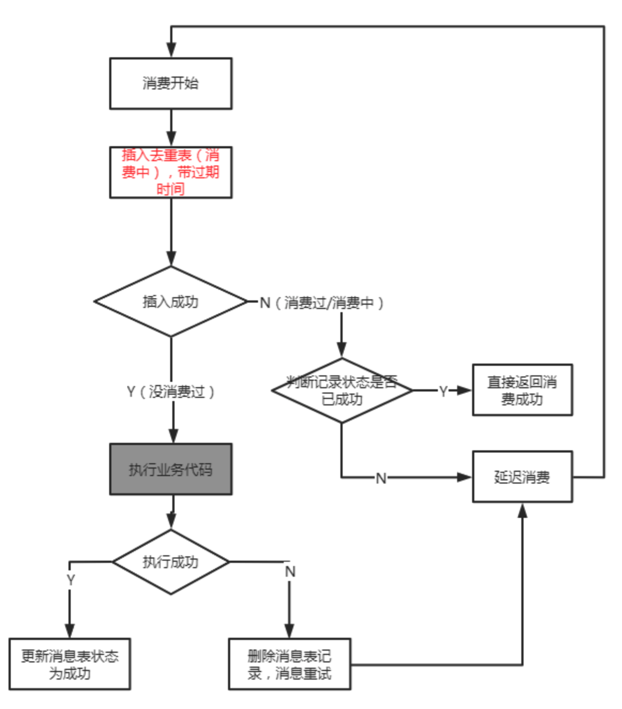

[toc]

## 出现问题

### 未成功消费

### 成功消费, 但没来得及回报MQ

## 原则

基于消息的投递可靠（消息不丢）是优先级更高的,
消息不重的任务转移到应用程序自我实现.

## 背后的逻辑

**不丢和不重是矛盾的**（在分布式场景下），但消息重复是有解决方案的，而消息丢失是很麻烦的。

## 简述

### select ... for update(需要关系型数据库事务支持)

可以先用 select ... for update 来加行锁. 来达到去重效果.

### 开启事务后insert(需要关系型数据库事务支持)

1. 开启事务
2. 插入消息表（处理好主键冲突的问题）
3. 更新订单表（原消费逻辑）
4. 提交事务

### 非事务消息幂等(更通用)

1. 检查库存（RPC）
2. 锁库存（RPC）
3. 开启事务，插入订单表（MySQL）
4. 调用某些其他下游服务（RPC）
5. 更新订单状态
6. commit 事务（MySQL）

因为, 有可能第一条消息消费卡住, 导致后续所有重试的消息都失败, 最后导致死信, **所以插入去重表时, 需要加上消费超时时间**

## 参考

[消息幂等（去重）通用解决方案，RocketMQ](https://jaskey.github.io/blog/2020/06/08/rocketmq-message-dedup/) 1. 利用关系数据库事务特性实现, 2. 不利用事务, 但是需要额外的幂等操作要求.

