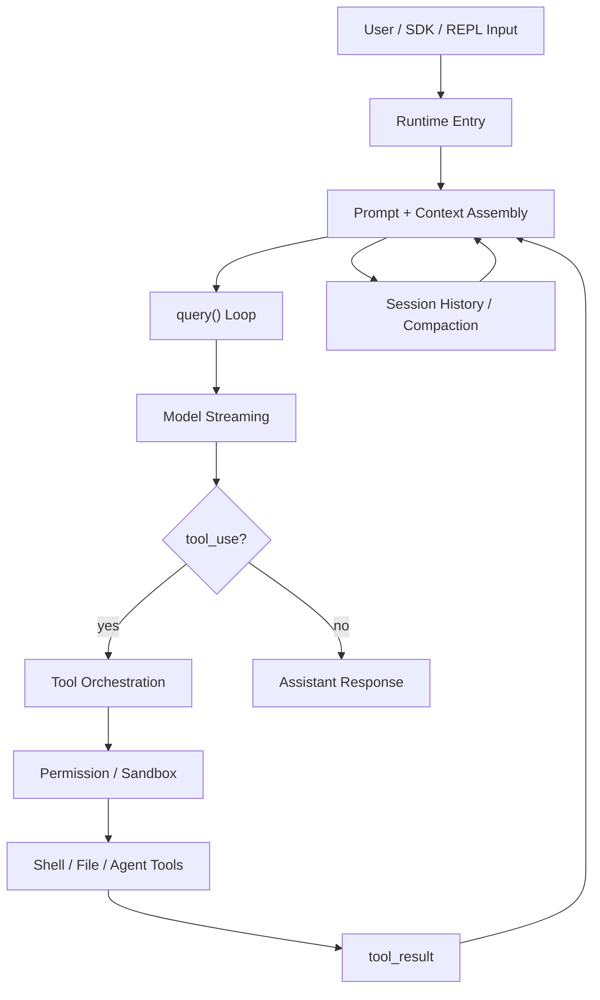

# 00 - Coding Agent 总览

## 面试式回答

Claude Code 不是“带命令行界面的聊天机器人”，而是一个 coding agent runtime：它把用户输入、系统提示词、项目上下文、历史 transcript 和工具定义组装成模型请求；模型流式返回自然语言或 `tool_use`；runtime 再负责权限判断、沙箱约束、工具执行、`tool_result` 回填，并进入下一轮循环。

一句话回答可以这样讲：

> Coding agent 的核心是一个围绕 model + tools + state 运转的闭环。模型负责提出意图，runtime 负责把意图安全地转换成本地机器上的可控效果，再把结果写回上下文，让模型继续决策。

## Coding Agent 要解决什么问题

普通 chatbot 的主要输出是文本。Coding agent 的输出不只是文本，还包括对工作区的真实影响：读文件、改文件、跑命令、调用子代理、管理会话历史，甚至在权限允许时触发外部工具。

这带来三个实现问题：

- 模型看不到完整本地机器，只能通过 messages 和 tools 间接理解世界。
- 模型输出的 `tool_use` 只是意图，不能直接等同于执行。
- 本地执行有风险，runtime 必须在权限、沙箱、取消、日志和 transcript 层面兜住副作用。

所以 Claude Code 的关键不是“模型会不会写代码”，而是 runtime 如何把模型的推理、工具执行和会话状态串成稳定闭环。

## Claude Code 的 runtime 大图

从 runtime 角度看，Claude Code 主要做四件事：

1. 接收输入：来自用户、SDK、REPL 或继续会话的输入都会进入 runtime entry。
2. 组装上下文：系统提示词、工具 schema、项目状态、附件、历史消息、压缩摘要共同形成 prompt/context。
3. 驱动 query loop：模型流式输出，runtime 解析 assistant message、`tool_use` 和最终回答。
4. 管理本地效果：工具执行前经过权限与沙箱，执行后把 `tool_result` 写回消息流，继续下一轮。

这也是后续章节的组织方式。`01` 到 `07` 讲主执行链路，`08` 到 `11` 讲会话状态、压缩、恢复、中断和 subagent，`12` 开始进入 MCP/plugin/bridge 与源码地图。

## 核心闭环

闭环可以拆成下面几个对象：

- messages：模型真正消费的对话载体，包含 user、assistant、tool_result 等消息。
- system prompt：runtime 注入的行为边界，说明 Claude Code 是什么、能用哪些工具、如何处理任务。
- tools：模型可选择的动作接口；模型只发出 `tool_use`，执行仍由 runtime 控制。
- permission：把模型意图和本地副作用隔开，决定是否允许读写文件、跑命令、联网或调用更高风险能力。
- transcript：会话的可追溯记录，既服务 resume，也服务后续压缩和调试。
- compaction：当上下文过长时，把历史压缩成可继续推理的摘要，避免无限增长。
- subagent：把一段任务交给隔离的 agent loop，让主循环用更高层的 `tool_result` 接收结果。

这些概念组合起来，形成的是“模型提议、runtime 执行、状态回填、模型继续”的闭环，而不是一次性请求响应。

## 和普通 Chatbot 的区别

普通 chatbot 更像：

```text
user message -> model -> assistant text
```

Coding agent 更像：

```text
user input -> context assembly -> model -> tool_use -> local effect -> tool_result -> model -> ...
```

差异主要在三点：

- 有工具：回答可以变成本地操作，而不是只停留在建议。
- 有状态：runtime 要维护 transcript、会话历史、压缩摘要、任务进度和工具结果。
- 有边界：权限、沙箱、中断和错误处理是核心逻辑，不是外围功能。

因此面试里讲 Claude Code，重点应放在“runtime 如何协调模型意图和机器效果”，而不是只讲 prompt 写得好不好。

## Mermaid 图



这张图里最重要的是回边：`tool_result` 会重新进入 prompt/context assembly，而不是在工具执行后直接结束。Session history / compaction 也不是挂在旁边的输出；transcript 会被持续写入，会话变长后压缩成摘要，再作为下一轮 prompt/context 的一部分回到循环。Coding agent 的智能来自多轮闭环：每次工具执行和历史更新都让模型获得新的观察结果，然后继续规划下一步。

## 学习路线

读源码时建议抓住三层：

- 第一层看主链路：入口在哪里，怎么进入 `query()`，模型流如何变成 assistant response 或 tool execution。
- 第二层看安全边界：工具执行前后哪些地方做权限、沙箱、取消、错误包装和结果回填。
- 第三层看长任务能力：transcript 怎么保存，compaction 怎么续上下文，subagent 怎么把复杂任务拆成局部闭环。

后续章节会分别展开这些点。本章只建立大图，不深入每个工具的参数和每条分支的源码细节。

## 一句话总结

Claude Code 的本质是一个把模型意图、安全工具执行和可持续会话状态连接起来的 coding agent runtime；理解它，要从闭环看起，而不是从单次聊天请求看起。
