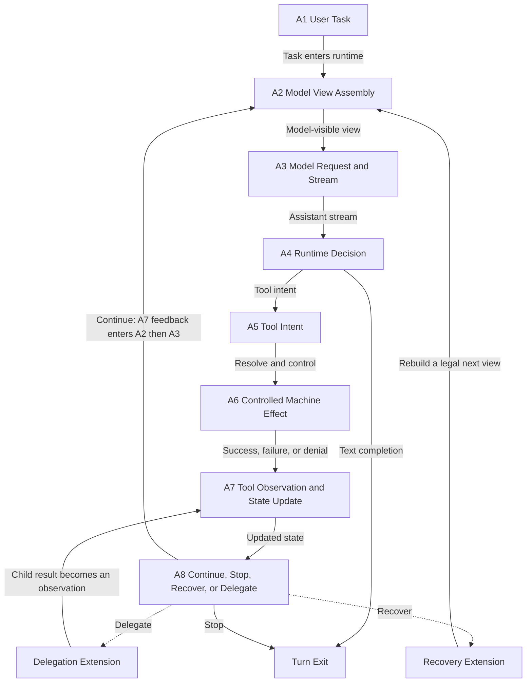

# 00：一次完整的 Agent Turn

> 用户输入一句任务后，Claude Code 如何把它变成可控的机器效果，并决定继续还是结束？

**[Architectural interpretation]** 一个 coding agent 的核心不是“一次 prompt 调一次工具”，而是一个**有状态反馈回路**：runtime 先构造模型可见视图，模型提出下一步内容或机器操作意图，runtime 控制真实效果，再把观察写入可继续使用的状态与持久化记录；只要目标尚未闭合，这个连接模型可见视图、runtime 控制效果和持久化状态的回路就会再次请求模型。

## 本章的证据分类约定

紧跟二级标题的标签适用于该节全部结论，除非段落另有更具体的标签：

- **[Architectural interpretation]**：为理解 Claude Code 而综合出的机制模型或行为解释；它组织因果关系，但不冒充单一源码位置直接证明的事实。
- **[General principle]**：适用于同类 tool-using coding agent 的可迁移协议、安全或状态约束，不依赖 Claude Code 的某个实现细节。
- **[Source-confirmed]**：只用于附有 `snapshot commit + repository-relative path + symbol` 的直接源码结论。

本章负责先建立全景模型，因此不把任何结论标成 **[Source-confirmed]**；后续部分会在放大具体节点时，把该标签和完整三段式源码证据放在对应结论旁。

## 1. 权威全景图：A1–A8

**[Architectural interpretation]** 本节给出后续章节共用的综合机制模型，不声称图中的每条边都由一个单独源码 symbol 实现。



### 1.1 每个节点负责什么

**A1 User Task** 接收用户的目标、约束和当前输入。它描述“要完成什么”，还不是一条机器命令。

**A2 Model View Assembly** 由 runtime 选择本轮要发送的 Messages、指令、工具定义和必要上下文，组装成模型可见视图。完整 session 状态不会自动全部进入这个视图。

**A3 Model Request and Stream** 把视图序列化成一次模型请求，并接收流式 assistant 输出。流中的文本和结构化片段仍是模型输出，不是机器效果。

**A4 Runtime Decision** 解释已形成的协议输出。如果得到 text completion，runtime 可以退出当前 turn；如果得到 tool intent，则转入受控执行路径。这个分支属于 runtime 的循环控制。

**A5 Tool Intent** 是带有关联 ID、工具名和输入的结构化提议。它告诉 runtime“模型希望发生什么”，但它既不是实际 Tool runtime，也没有自行执行的能力。

**A6 Controlled Machine Effect** 由 runtime 查找实际工具，准备并校验输入，经过授权判断和执行环境约束后，才可能读取文件、修改文件或启动进程。拒绝和失败也是这一阶段的合法结果。

**A7 Tool Observation and State Update** 把成功、失败、拒绝或中断整理成能关联原 tool intent 的 observation，并更新协议 Messages、runtime turn state 与 durable transcript。机器世界由此重新变成模型下一轮可理解的信息。

**A8 Continue, Stop, Recover, or Delegate** 根据协议是否闭合、任务状态和控制信号选择下一条边：继续请求模型、停止、重建可继续状态，或把一个有边界的任务委派给 child loop。

A5–A7 的 canonical 名称和边仍以本图为准；它们怎样从 inert Tool Intent 经过 runtime control 变成 same-ID Tool Observation，由 [02：Controlled Effects 总览](02-controlled-effects/README.md) 沿 E1–E8 深入展开。

### 1.2 每条箭头表达什么

| 箭头 | 因果含义 |
| --- | --- |
| A1 → A2 | 用户目标成为组装本轮模型视图的输入。 |
| A2 → A3 | 只有选入模型可见视图的内容才进入请求。 |
| A3 → A4 | runtime 消费 assistant stream，形成可以判别的协议输出。 |
| A4 → Turn Exit | text completion 没有待执行的工具意图，本次 turn 可以退出。 |
| A4 → A5 | tool intent 被识别为结构化提议，进入工具路径。 |
| A5 → A6 | 提议必须先由 runtime 解析和控制，才能触碰机器。 |
| A6 → A7 | 任何执行结局都要转换成 observation，而不只是成功输出。 |
| A7 → A8 | 状态写回后，runtime 才拥有决定下一步所需的闭合事实。 |
| A7 → A8 → A2 → A3 | 选择 Continue 时，observation 反馈进下一轮视图和模型请求；这是主反馈边。 |
| A8 → Turn Exit | 停止条件成立时，runtime 不再发起下一轮。 |
| A8 → Recovery → A2 | 恢复先重建合法的下一轮视图，而不是复活旧调用栈。 |
| A8 → Delegation → A7 | child loop 通过显式结果边界返回，结果作为 parent 的 observation 重新入环。 |

这张图故意只保留因果骨架：先建立唯一的 canonical loop，再在后续部分放大模型上下文、工具控制、跨时间恢复和委派等局部机制。

## 2. 核心对象：谁看见、谁拥有、活多久

**[Architectural interpretation]** 下表用统一对象语言解释所有权和可见性，不代表 Claude Code 的物理存储 schema。

| object | visible to model? | owned by | lifetime | why it exists |
| --- | --- | --- | --- | --- |
| Model Request | 是；模型接收其序列化内容 | runtime 组装，模型服务消费 | 一次请求 | 固定本轮可见输入、工具协议和生成参数 |
| Messages | 有条件；只有被选入 request 的部分可见 | runtime 维护，模型协议定义形状 | 可跨多个请求，内容可被选择或重写 | 保持 user、assistant、tool 之间的协议上下文 |
| Tool Definition | 是；模型看到的是名称、说明和输入 schema | runtime/Tool System 提供协议投影 | 通常随一个 request | 告诉模型可以提出哪些结构化意图 |
| Tool Intent | 是；由模型生成，并可进入后续 Messages | 模型提出，runtime 管理其生命周期 | 从 assistant 输出到 observation 闭合 | 表达“希望调用什么”并提供关联 ID |
| Tool Observation | 是；当它被写入后续 Messages | Tool runtime 产生事实，runtime 规范化 | 从执行结局到后续请求，且可留在 session | 把机器结果、错误、拒绝或中断反馈给模型 |
| Runtime Turn State | 否 | runtime | 一个 turn，必要部分可衍生下一 turn 状态 | 跟踪阶段、待处理调用、排序、停止与中断 |
| Durable Transcript | 不直接可见；只有选出的内容可回到 request | session persistence | 跨 turn，直到会话记录被清理 | 保存可恢复、可审计的历史事实 |
| Child Task State | 不直接共享；child 只看到显式构造的视图 | parent/child runtimes 各自拥有边界内状态 | 一个委派任务，可跨多个 child turn | 隔离子循环，同时让 parent 能追踪和接收结果 |

这里的“visible”描述协议边界：内容只有进入某次 Model Request 才被模型看到。一个对象存在于 runtime 或 transcript 中，不等于它自动存在于当前模型上下文中。

## 3. 四个状态平面不能混成一个“上下文”

**[Architectural interpretation]** 四平面是对职责、可见性和生命周期的分析性分层，用来解释 Claude Code 行为而不是复刻源码目录。

### 3.1 模型协议平面（model protocol plane）

它承载 Model Request、Messages、Tool Definition、Tool Intent 与 Tool Observation，约束什么内容能被模型读写，以及 tool intent 和 observation 如何关联。它不负责真的打开文件或启动进程。

### 3.2 runtime 控制平面（runtime control plane）

它承载当前循环阶段、流式事件、pending intent、执行顺序、中断和继续决定。它负责把协议对象路由到正确阶段，但 runtime-only 状态不会因为存在就自动暴露给模型。

### 3.3 机器效果/安全平面（machine effect/security plane）

它负责授权判断、执行环境约束以及最终文件、进程和网络等效果。这里要同时回答两个不同问题：是否允许这项意图，以及即使允许后最多能影响什么。

### 3.4 持久化会话平面（durable session plane）

它保存 Durable Transcript 和恢复所需事实，使任务能跨 turn、进程事件或上下文窗口继续。它的目标是保留历史，不是保证所有历史始终进入模型请求。

同一次工具调用会在四个平面留下不同投影：协议平面有 intent/observation，runtime 控制平面有 pending/completed 状态，机器效果平面有真实执行结局，持久化会话平面有可恢复记录。把这些投影称为同一个“消息”会丢失所有权和安全边界。

## 4. 六条 canonical 不变量

**[General principle]** 以下约束适用于采用结构化 tool intent/observation 协议的 coding agent；它们规定合法闭环，而不是断言 Claude Code 的具体函数布局。

### 4.1 模型只能提出效果，不能直接执行效果

模型输出 Tool Intent；runtime 才能把它解析为某个实际工具调用，并在校验、授权和环境约束后执行。这样模型生成不可信或错误输入时，控制边界仍然存在。如果把“模型说要执行”和“机器已经执行”视为同一事件，A5 与 A6 就失去意义。

### 4.2 协议可见的 Tool Intent 必须得到可关联的 Observation

只要一个 tool intent 已成为 assistant 协议内容，后续就必须有相同关联关系的 observation，结局可以是成功、失败、拒绝或中断。否则模型既不知道该意图发生了什么，下一次 request 也可能处于未闭合的非法协议状态。关联 ID 连接的是意图与事实，不只是两段日志文本。

### 4.3 授权与 containment 是两个门

授权回答“这项操作是否可以尝试”，containment 回答“获准后仍被限制在什么能力和资源范围内”。授权通过不等于没有 sandbox 约束，sandbox 存在也不等于用户已经授权。两者分开，才能说明一次调用究竟因策略被拒绝、因环境被限制，还是在允许范围内执行失败。

### 4.4 当前模型上下文不等于 Transcript

Transcript 面向持久化和恢复，可以保留比当前 Model Request 更多的历史；模型上下文则是 A2 为某次请求选择和构造的视图。上下文压力可以迫使视图缩减或改写，但不能据此宣称历史事实从 durable session 中必然消失。

### 4.5 中断后仍要能形成合法的下一次 Model Request

中断可以阻止正在发生或尚未发生的效果，却不能把协议永久留在“有 tool intent、没有结局”的半截状态。runtime 必须保留或生成足以闭合关联关系的事实，再决定停止或重建 A2。恢复的成功边界不是旧调用栈复活，而是下一次 request 合法且知道此前发生了什么。

### 4.6 Child loop 必须跨越显式的上下文与结果边界

委派不是把 parent 的所有内存自动共享给另一个模型循环。parent 要构造 child 可见的任务和上下文，child 在自己的 turn state 中运行，再把结果或失败转换成 parent 可关联的 observation。边界让隔离、取消、审计和结果归属都能被说明；具体是否使用另一个 OS process 只是实现选择。

## 5. 贯穿案例：定位并修复一个失败测试

**[Architectural interpretation]** 这是把 A1–A8 应用于一个连续任务的概念走查，不是某次 Claude Code 执行日志或逐函数 trace。

```text
User: locate and fix a failing test.
```

下面始终是同一个任务。search、read、edit、test 不是四个互不相关的示例，而是同一反馈回路在获得新事实后依次提出的意图。

### 5.1 A1：任务进入 runtime

- **输入：** 用户目标 `locate and fix a failing test`，以及当前工作区和会话约束。
- **决策：** 把它记录为待完成的 user task，而不是直接翻译成 shell 命令。
- **状态变更：** Messages 获得 user 内容；Durable Transcript 记录任务进入事件；runtime turn state 进入组装阶段。
- **输出：** A2 可以消费的目标与约束。

### 5.2 A2：组装第一次模型视图

- **输入：** user message、适用指令、可用工具定义，以及 runtime 选中的必要上下文。
- **决策：** 只选择本轮解决问题所需、且允许模型看到的内容。
- **状态变更：** runtime 形成一个 request candidate；Transcript 本身不被改造成“全部模型上下文”。
- **输出：** 第一次 Model Request 的模型可见视图。

#### 状态快照 1：第一次模型请求前

以下快照只表示概念边界，不是产品的磁盘 schema。

```yaml
model_visible_messages:
  - { role: user, content: "locate and fix a failing test" }
model_visible_tool_definitions: [Search, Read, Edit, Test]
runtime_only_state:
  phase: request_ready
  pending_tool_intents: []
  interrupted: false
durable_transcript:
  events: [user_task_recorded]
```

### 5.3 A3：发出请求并接收 stream

- **输入：** A2 的 request candidate。
- **决策：** runtime 发出一次模型请求，并累积足以形成 assistant 协议内容的 stream 事件。
- **状态变更：** runtime turn state 从 `request_ready` 进入 `streaming`；尚未产生机器效果。
- **输出：** 例如一段说明文字，加上“先搜索失败测试位置”的结构化片段。

### 5.4 A4：区分文本完成与工具意图

- **输入：** 已形成的 assistant 输出。
- **决策：** 这次输出包含 Tool Intent，因此不能把说明文字当成 turn 已完成；若只有 text completion，则走退出边。
- **状态变更：** runtime 把结构化片段登记为待处理 intent，并保留 assistant 协议内容。
- **输出：** 进入 A5 的第一个 Search intent。

### 5.5 A5：让每个意图跨过协议边界

- **输入：** 带 `call_id`、工具名和参数的 Search intent。
- **决策：** runtime 只把结构合法、可以关联结果的提议交给 A6；它还没有把 schema 当成实际工具执行。
- **状态变更：** pending set 加入 `search-1`；Messages/Transcript 记录 assistant tool intent。
- **输出：** 等待受控执行的 Search 调用。之后每次 A8 选择 Continue，Read、Edit、Test intents 都以同样方式依次跨过 A5。

#### 状态快照 2：assistant 产生 Tool Intent 后

`model_visible_messages` 表示下一次 request 可以序列化的协议历史；模型不会即时读取 runtime 的内存变化。

```yaml
model_visible_messages:
  - { role: user, content: "locate and fix a failing test" }
  - role: assistant
    tool_intent: { call_id: search-1, tool: Search, input: "failing test evidence" }
runtime_only_state:
  phase: tool_pending
  pending_tool_intents: [search-1]
durable_transcript:
  events: [user_task_recorded, assistant_tool_intent(search-1)]
```

此时 `search-1` 尚未得到 observation，因此不能把这组 Messages 当成一个已闭合、可以任意继续的模型请求。

### 5.6 A6：产生受控机器效果

- **输入：** `search-1` 及其工具参数。
- **决策：** runtime 解析实际 Tool，准备和校验输入，分别经过授权与 containment 边界，再决定执行、拒绝或返回错误。
- **状态变更：** runtime 记录调用阶段；机器效果平面只在控制条件成立时读取工作区。
- **输出：** 搜索命中、空结果、错误或拒绝中的一个确定结局，而不是未经解释的副作用。

### 5.7 A7：把结局变回模型可理解的事实

- **输入：** Search 的真实结局及 `call_id: search-1`。
- **决策：** 将结局规范化成关联 `search-1` 的 Tool Observation；成功和失败都走同一闭环责任。
- **状态变更：** pending set 移除 `search-1`；Messages 追加 observation；Transcript 持久化完整事件；runtime 进入下一步判定阶段。
- **输出：** 模型下一轮可以看到的搜索事实。

#### 状态快照 3：对应的 Tool Observation 写回后

```yaml
model_visible_messages:
  - { role: user, content: "locate and fix a failing test" }
  - role: assistant
    tool_intent: { call_id: search-1, tool: Search, input: "failing test evidence" }
  - role: tool
    tool_observation: { call_id: search-1, status: ok, summary: "candidate test found" }
runtime_only_state:
  phase: decide_next
  pending_tool_intents: []
durable_transcript:
  events:
    - user_task_recorded
    - assistant_tool_intent(search-1)
    - tool_observation(search-1, full_result_and_metadata)
```

### 5.8 A8：继续到验证闭环，或选择其他合法出口

- **输入：** 已闭合的 Messages、最新 observation、任务目标与 runtime 控制信号。
- **决策：** 在这个普通场景中先选择 Continue：让模型根据搜索事实提出 Read，再根据读取内容提出 Edit，最后提出 Test。若 Test 仍失败，就带着失败 observation 再次继续；Test 通过后，再请求模型形成 text completion，并在 A4 退出。
- **状态变更：** runtime 将下一动作设为 `continue`，为 A2 准备新的模型视图。只有发生中断、无法继续或任务需要有边界的并行委派时，才分别选择 Stop、Recover 或 Delegate。
- **输出：** 主路径回到 A2→A3；其他选择进入图中的明确扩展边，而不会绕过状态闭合。

#### 状态快照 4：下一次模型请求前

```yaml
model_visible_messages:
  selected:
    - user_task
    - assistant_tool_intent(search-1)
    - associated_tool_observation(search-1)
runtime_only_state:
  phase: request_ready
  next_action: continue
  pending_tool_intents: []
durable_transcript:
  events:
    - user_task_recorded
    - assistant_tool_intent(search-1)
    - tool_observation(search-1, full_result_and_metadata)
    - runtime_transition(decide_next -> request_ready)
```

这个快照里，Model Request 只会得到 `selected` 内容；Durable Transcript 仍可保留更完整的结果和 runtime 事件。随后 Read、Edit、Test 各自重复 A3→A8，直到测试事实支持模型给出最终文本。一个连续案例因此覆盖了“意图 → 效果 → 观察 → 再决策”，而不是把工具调用误写成单向流水线。

本章只建立这些因果边界。`allow / ask / deny` 等 permission modes、具体 compaction 算法，以及 foreground/background subagent lifecycle 都留给相应部分在其 canonical 节点上展开。

## 6. 五个常见错误心智模型

**[Architectural interpretation] / [General principle]** 下表用前述综合模型纠正边界混淆，并用可迁移不变量解释为什么这些混淆不成立。

| 错误模型 | 正确边界 |
| --- | --- |
| 模型直接运行工具 | 模型只产生 A5 Tool Intent；runtime 才控制 A6 的实际效果。 |
| Tool schema 与实际 Tool runtime 是同一个对象 | schema 是模型协议可见的定义；实际 Tool runtime 还拥有解析、校验和执行能力。 |
| permission 与 sandbox 是同一道门 | permission 判断是否获准，sandbox/containment 限制获准后能影响的范围。 |
| Transcript 就是当前模型上下文 | Transcript 是持久化历史；当前上下文是 A2 为一次 request 选择和构造的视图。 |
| subagent 必然是另一个 OS process | subagent 的本质是有显式上下文与结果边界的 child loop；进程形态只是实现选择。 |

## 7. 交给下一部分的问题

现在已经有一条不依赖源码函数名的完整主链：模型看到视图，提出意图；runtime 控制效果，写回观察；状态闭合后，系统才能继续、停止、恢复或委派。后续章节只放大这些节点，不另造一套 agent 心智模型。

[← 返回学习轨道 README](README.md) · [下一篇：Model Turn 总览](01-model-turn/README.md)

这张全景图成立后，下一步先建立 A2–A5/A7 的 Model Turn 局部全景，再进入 A2 的 Context Assembly 与 Query Loop 细节；当 Query Loop 交出完整 Tool Intent 时，[Controlled Effects](02-controlled-effects/README.md) 再接住 A5–A7，而不另造一条主线。
