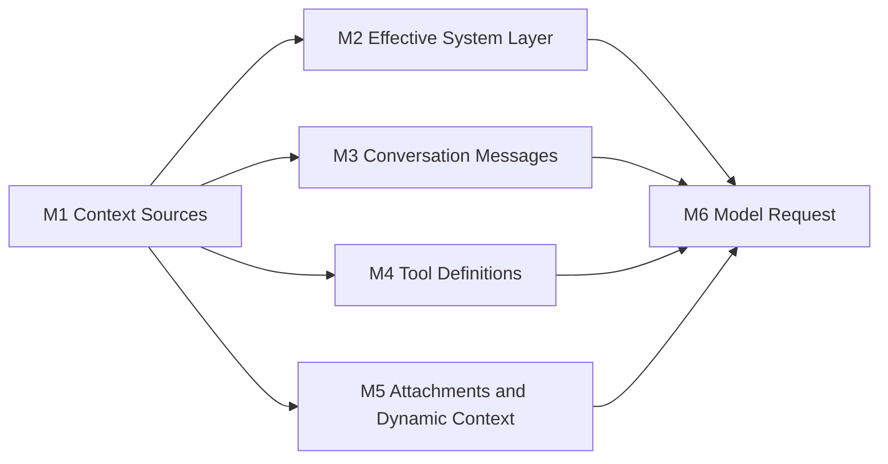

# 01：Context Assembly——模型在一次决策前看见什么

[← 上一篇：Model Turn 总览](README.md) · [下一篇：Query Loop 与 Streaming](02-query-loop-and-streaming.md)

> 模型发起一次决策前，Claude Code 如何决定它此刻能看到什么？

**[Architectural interpretation]** 模型输入不是一段 prompt 字符串，而是 runtime 根据稳定规则组装出的模型视图；这个视图与 runtime 自己持有的控制状态并不相同。

本文沿用全轨道的三类证据标签：**源码确认**对应 **[Source-confirmed]**，**架构解释**对应 **[Architectural interpretation]**，**通用原理**对应 **[General principle]**。每条 **[Source-confirmed]** 结论都在原地给出 `snapshot commit + repository-relative path + symbol`，而不是用行号组织正文。

## 1. 先把 Context Assembly 放回 A1–A8

**[Architectural interpretation]** 本章放大 [A2 Model View Assembly](../00-one-agent-turn.md#1-权威全景图a1a8)：它消费 A1 的当前任务，也可能消费 A7 已经闭合的 Tool Intent / Tool Observation 历史；它的输出交给 A3，而不是直接产生机器效果。

局部流程只有六个节点。M2–M5 不是四套独立上下文，它们都是 M1 来源经过不同协议投影后，在 M6 汇合成一次请求。



| 节点 | 当前问题 | 产物 |
| --- | --- | --- |
| M1 Context Sources | 这一轮有哪些候选事实和控制状态？ | 用户任务、会话 Messages、默认/自定义指令、Tools、MCP、cwd、memory、队列与文件状态等候选输入 |
| M2 Effective System Layer | 哪一层 system instructions 生效？ | 有明确优先级的 `system` 段落数组 |
| M3 Conversation Messages | 哪些协议历史进入当前窗口？ | 规范化前的 user/assistant/tool feedback 消息视图 |
| M4 Tool Definitions | 模型能提出哪些结构化 Tool Intent？ | `name + description + input_schema` 等 API tool schemas |
| M5 Attachments and Dynamic Context | 哪些条件事实只在此刻需要注入？ | file/image/memory/queued input/MCP delta 等 attachment messages |
| M6 Model Request | 以上投影怎样成为一次模型调用？ | `system + messages + tools + request_options` |

这里最重要的箭头不是“调用了哪个 helper”，而是**状态形状发生了什么变化**：runtime-owned sources 经过选择和转换，才变成 model-visible request。没被投影的状态即使存在，也不在模型眼前。

### 1.1 先分清两只时钟

**[Architectural interpretation]** “一次 agent turn”和“一次 model request”不是同一个生命周期。一个用户任务进入 `query` 后，可以经历多次模型决策、Tool Intent / Observation 与 feedback request。为避免源码注释中的 `turn` 与本文的 agent turn 互相污染，后文固定用两只时钟：

| 时钟 | 何时发生 | 主要工作 | 在同一 `query` 内是否可变 |
| --- | --- | --- | --- |
| **Agent-turn / query-entry clock** | REPL 或 SDK 接收一次新任务，准备进入 `query` | 捕获初始 Messages、Tools/MCP、user/system context 与 entry options；选定 effective system | effective system 和该次 entry 捕获的 user/system context 供内部请求复用 |
| **Model-request / feedback-iteration clock** | 首次模型决策，或一批 Tool Observation 闭合后准备继续 | 投影并规范化当前 Messages，从当前 tool pool 构造 schemas，把适用的 attachment 带入相关请求 | Messages、attachments 和 tools 可变；进入下一 feedback iteration 前可运行 `refreshTools` |

**[Source-confirmed]** 快照 `712b24f22a63eb6d1a2f86697bf6dbbaa39ae3cf` 中，`src/screens/REPL.tsx` / `REPL` 内的 `onQueryImpl` 在单次 `query` 调用前选定 effective system，而 `getToolUseContext` 同时放入初始 `tools: computeTools()` 和 `refreshTools: computeTools`；`src/query.ts` / `queryLoop` 在收集 feedback attachments 后、构造下一 iteration state 前可以替换 `options.tools`。因此，这里是“entry 捕获 + 明确刷新点”，不是整个 agent turn 的不变快照。

## 2. 标准路径：失败测试任务在模型眼中长什么样

**[Architectural interpretation]** 继续使用全景章的同一个任务：

```text
User: locate and fix a failing test.
```

第一次决策前没有旧的 Tool Intent / Observation；搜索完成后的下一次决策则必须带上已经闭合的 intent/observation 对。两者共享同一个 Model View 结构，只是 M3/M5 的实际内容不同。

### 2.1 第一次请求：先获得任务和行动能力

```yaml
ModelView:
  system:
    - stable Claude Code instructions
    - applicable environment, memory, and project guidance
  messages:
    - role: user
      isMeta: true
      content: relevant user context
    - role: user
      content: "locate and fix a failing test"
    - type: attachment          # only when applicable at this stage
      attachment:
        type: file | image | queued_command | memory | mcp_instructions_delta
        content: relevant dynamic observation
  tools:
    - { name: Search, description: "...", input_schema: "..." }
    - { name: Read,   description: "...", input_schema: "..." }
    - { name: Edit,   description: "...", input_schema: "..." }
    - { name: Test,   description: "...", input_schema: "..." }
  request_options:
    model: selected model
    thinking: selected thinking mode

RuntimeCallControls:
  abort_signal: runtime-owned
```

这个快照体现了两个边界。第一，非空 `userContext` 由 `prependUserContext` 放在当前 conversation projection 之前；它不和 attachment 合并成同一条 meta message。第二，attachment 的精确位置由触发阶段决定：user-input-triggered attachment 可能已在 entry messages 中；Tool feedback 之后才到达的 queued/MCP/memory 观察，则追加到下一 iteration 的历史。图中只声明“若当前阶段适用，它是独立 attachment message”，不声明所有路径都有一个固定全局次序。

`abort_signal` 则被刻意标为 runtime-owned：它影响请求能否继续，却不是一段给模型阅读的自然语言内容。类似地，permission callbacks、文件读取缓存、UI setters 和队列管理器也不因为参与组装就全部发送给模型。

### 2.2 Feedback 请求：带着已经发生的事实继续

假设第一次模型决策产生 `Search` Tool Intent，runtime 返回搜索结果，下一次模型视图至少需要保持这段因果链：

```yaml
messages:
  - { role: user, content: "locate and fix a failing test" }
  - role: assistant
    content:
      - type: tool_use
        id: search-1
        name: Search
        input: { query: "failing test" }
  - role: user
    content:
      - type: tool_result
        tool_use_id: search-1
        content: "candidate test found"
```

**[Source-confirmed]** 在快照 `712b24f22a63eb6d1a2f86697bf6dbbaa39ae3cf` 中，`src/query.ts` / `queryLoop` 把当前 `messagesForQuery`、本次完成的 `assistantMessages` 与规范化后的 `toolResults` 拼成下一轮 state；这直接支持“前一轮 Tool Intent 与对应 Tool Observation 会进入下一轮候选消息视图”，但具体 Tool 执行过程属于后续 Controlled Effects。

### 2.3 六类必要内容的来源、形态与缺失后果

**[Architectural interpretation]** 下表把多个源码 symbol 汇总成一个可读的标准请求；它描述的是机制角色，不声称每一行都由单一函数独立完成。

| 组件 | source | transformed by | model-visible form | lifetime | omission consequence |
| --- | --- | --- | --- | --- | --- |
| effective system instructions | 默认 prompt、entry 参数、agent 定义、append/override 选项 | M2 的 precedence 选择与 system block 构造 | `system[]` 文本块 | 每次 query entry 选定，在其内部 model requests 中复用；部分前缀追求 session-stable | 模型失去身份、行为约束或当前环境规则 |
| current user task | 当前 user message / 入口处理后的内容 | 输入处理、M3 消息投影与 API normalization | user message/content blocks | 当前任务及其仍被选中的后续轮次 | 模型不知道当前要解决什么 |
| prior Tool Intent + Observation | 旧 assistant `tool_use` 与 user `tool_result` | Query Loop 写回、message normalization、pair repair | 带相同关联 ID 的 assistant/user blocks | 只要仍在当前投影视图内 | 模型无法把机器事实关联到自己的前一步意图；协议可能不闭合 |
| model-visible tool schemas | runtime 的 resolved `Tool` objects | `toolToAPISchema` 与 API request tool filtering | `name + description + input_schema`，以及适用的协议字段 | 一次请求；稳定 base 可跨请求复用 | 模型不能合法提出对应结构化 Tool Intent，或会使用错误 schema |
| relevant file/image/queued attachments | `@` 文件、pasted content、IDE/queue/task notifications 等条件源 | attachment collectors 与 `createAttachmentMessage` | meta user/attachment message content blocks | 触发它的当前或后续请求 | 模型缺少刚被引用、排队或异步到达的事实；不应相关的内容若常驻则浪费窗口 |
| cwd/project memory when applicable | cwd/env、eager memory、路径触发的 nested memory | default prompt assembly、user/system context、nested-memory attachments | system text、meta context 或 attachment message | eager 部分可跨 turn；nested 部分按路径触发并去重 | 模型可能忽略项目规则、工作目录或适用的局部指令 |

**[Source-confirmed]** 快照 `712b24f22a63eb6d1a2f86697bf6dbbaa39ae3cf` 的 `src/services/api/claude.ts` / `queryModel` 最终把规范化 `messages`、构造后的 `system` 与 `allTools` 放入请求参数；因此“模型可见视图”的实现边界是序列化后的请求字段，而不是上游任意一个 context 对象。

## 3. 三种状态必须分开

**[Architectural interpretation]** “上下文”一词最容易把三个不同生命周期混成一个。判断一个字段属于哪里，要问：模型是否直接接收、谁能修改、何时失效、是否能跨会话恢复。

| 状态类别 | 典型内容 | 模型是否直接可见 | owner | lifetime |
| --- | --- | --- | --- | --- |
| model-visible request content | `system`、selected/normalized `messages`、tool schemas、可序列化生成参数 | 是，或作为 API 行为参数影响生成 | runtime 组装，模型服务消费 | 一次模型请求 |
| runtime-only loop/session state | `ToolUseContext`、`AbortController`、permission callback、pending tool queue、file-read cache、already-loaded path set、UI callbacks | 否；只有经过显式转换的值才可能产生 model-visible 投影 | Claude Code runtime | 可分别属于 query entry、feedback iteration、session 或某个 runtime subsystem |
| durable transcript state | user/assistant/tool/attachment/compact 等可持久化记录 | 不自动可见；只能被选取、压缩、修复后投影回 request | session persistence | 跨 turn，必要时跨进程恢复 |

**[Source-confirmed]** 快照 `712b24f22a63eb6d1a2f86697bf6dbbaa39ae3cf` 的 `src/Tool.ts` / `ToolUseContext` 同时持有 tools、MCP clients、abort controller、permission/app-state callbacks、read-file state、nested-memory trigger/dedup sets 与 messages 等 runtime 字段；而 `src/services/api/claude.ts` / `queryModel` 只把经过构造的 request fields 发给 API。这直接证明 `ToolUseContext` 不是一个会被整体序列化给模型的“超级 prompt”。

### 3.1 四个必须立即否定的等式

| 错误等式 | 为什么不成立 |
| --- | --- |
| system prompt = whole request | `system` 只是 Model View 的一部分；当前任务、历史 feedback、attachments 与 tools 走其他字段或消息形态。 |
| tools = natural-language prompt text only | Tool description 是 schema 的一部分，但模型还收到结构化 `input_schema`；实际 runtime Tool 更不等于这段描述。 |
| `ToolUseContext` = fully model-visible | 它包含 AbortController、callbacks、permission/file/session control state；只有显式投影才可见。 |
| transcript = active model window | transcript 面向持久化；active window 是一次请求前经过 boundary、压缩/筛选与 normalization 的投影。 |

**[General principle]** 一个安全的 agent runtime 必须让“用于控制模型调用的状态”和“允许模型读取的内容”成为两个显式集合；否则取消令牌、权限状态、密钥、内部缓存或过量历史都可能被误当成 prompt 内容。

## 4. 按因果顺序拆解组装过程

这一节只走 canonical interactive main-agent path。每一步先看输入和状态变换，再看它为何必须发生；SDK/headless、MCP delta 与 nested memory 等变体统一放到下一节。

**[Architectural interpretation]** 六步是读者理解 state transformation 的因果顺序，不要求独立分支按同样顺序串行计算；M3 messages 与 M4 tools 只需要在 M6 前汇合。**[Source-confirmed]** 快照 `712b24f22a63eb6d1a2f86697bf6dbbaa39ae3cf` 的 `src/services/api/claude.ts` / `queryModel` 实际先构造 tool schemas、再规范化 messages，这个物理顺序不会改变二者的协议边界。

### 4.1 第一步：收集稳定来源与动态来源（M1）

**输入：** 当前 Messages、新 user input、query entry 当下的 resolved tools/MCP clients、entry options、cwd/project state 与 runtime state。

**决策：** query entry 先捕获一组一致的起点，但这不是 turn-wide freeze。入口选定的 effective system 与 user/system context 保留给该 `query`；Messages 会随 feedback 增长，attachments 按触发时机加入，tool pool 则留有显式刷新点。

**[Source-confirmed]** 在快照 `712b24f22a63eb6d1a2f86697bf6dbbaa39ae3cf` 中，`src/screens/REPL.tsx` / `REPL` 内的 `onQueryImpl` 先从 store 取得入口时的 MCP clients/tools，构造 `ToolUseContext`，再并行获取 default system prompt、user context 与 system context，最后才调用 `buildEffectiveSystemPrompt` 和 `query`；同文件 `getToolUseContext` 把 `computeTools` 同时作为初始 tools 来源与 `refreshTools` callback。`src/query.ts` / `queryLoop` 在 Tool feedback 与 attachments 已处理后调用该 callback，必要时替换下一 iteration 的 `options.tools`。

**状态变换：**

```text
Before
  messages + live app/session state + entry options

After
  QueryEntrySources {
    initial_messages,
    default_prompt_candidate,
    user_context,
    system_context,
    initial_tools,
    initial_mcp_clients,
    tool_use_context { // runtime-only
      tools: initial_tools,
      refreshTools?
    }
  }
```

这一阶段的输出仍然只是入口候选来源。`initial_tools` 不等于之后所有 model requests 的永久 tool list；`ToolUseContext` 也不会作为整体字段进入 M6。

### 4.2 第二步：选择 effective system layer（M2）

**输入：** default prompt、main-thread agent definition、custom、append，以及某些调用方才会提供的 override。

**决策：** 在 query-entry clock 按 entry/mode 选择一个 base system layer，再在允许的分支追加 append。决定的是“这次 `query` 哪套指令生效”，不是在每个 `queryModel` 请求前重选，也不是把所有候选文本拼在一起。

**[Source-confirmed]** 快照 `712b24f22a63eb6d1a2f86697bf6dbbaa39ae3cf` 的 `src/utils/systemPrompt.ts` / `buildEffectiveSystemPrompt` 依次处理 override、coordinator、agent-specific、custom、default 与 append；普通非 proactive 分支中 agent-specific 优先于 custom，custom 优先于 default，而 override 直接返回。`src/screens/REPL.tsx` / `REPL` 内的 `onQueryImpl` 在调用 `query` 之前只做一次该选择；`src/query.ts` / `queryLoop` 内部的 feedback iterations 继续消费这个已选 `systemPrompt`。

**状态变换：**

```text
Before
  SystemCandidates {
    default: string[],
    agent?: string,
    custom?: string,
    append?: string,
    override?: string
  }

After
  EffectiveSystemPrompt: string[]
```

没有这一层，调用方之间会出现“custom 到底是替换还是追加”“agent 指令和 default 是否同时存在”等隐式差异，模型收到的规则也就无法预测。

### 4.3 第三步：构造并规范化 conversation messages（M3）

**输入：** 当前 feedback iteration 的 Messages、current user task、上轮已闭合的 Tool Intent / Observation、query-entry user context，以及可能存在的 compact/collapse projection。

**决策：** 每次 model request 都从当前 loop state 形成 message projection，把 `userContext` 变成置前的 meta user message；真正进入 API 前，还要删除 runtime-only/virtual 形态、规范化 content blocks，并修复不合法的 tool-use/result 配对。

**[Source-confirmed]** 快照 `712b24f22a63eb6d1a2f86697bf6dbbaa39ae3cf` 的 `src/utils/api.ts` / `prependUserContext` 把非空 `userContext` 编码成 `isMeta: true` 的 user message 并置于消息前部；`src/services/api/claude.ts` / `queryModel` 随后调用 `src/utils/messages.ts` / `normalizeMessagesForAPI` 与 `ensureToolResultPairing` 生成合法 API message view。

**状态变换：**

```text
Before
  RuntimeMessages = transcript-derived messages
                  + runtime-only message variants
                  + current user task

After
  ModelMessages = [meta user context]
                + selected user/assistant/tool protocol history
                - virtual/UI-only blocks
                ± pairing repair blocks
```

这一步也解释了为什么 transcript 不能直接等同于 active model window：同一段 durable history 在不同请求中可以得到不同 projection，但它仍然是同一任务的因果历史。

### 4.4 第四步：把 resolved Tools 转成 model-visible schemas（M4）

**输入：** 当前 feedback iteration 的 tool pool，其中每个 runtime `Tool` object 具有 `inputSchema`、prompt/description、执行与权限能力；另有当前 model/provider/tool-search options。

**决策：** 只选择本次 model request 要暴露的工具，并把每个 runtime Tool 投影成 API schema。稳定 base 可从 session cache 复用；`defer_loading` 与 cache control 等 request overlays 仍在每次调用构造。执行函数、permission flow、filesystem state 与 callbacks 保持 runtime-only。

**[Source-confirmed]** 快照 `712b24f22a63eb6d1a2f86697bf6dbbaa39ae3cf` 的 `src/services/api/claude.ts` / `queryModel` 对本次 `filteredTools` 调用 `src/utils/api.ts` / `toolToAPISchema`；后者只在 schema-cache miss 时计算 `name`、`description`、`input_schema` 与稳定 capability fields，然后每次从 cached base 复制 schema 并叠加适用的 `defer_loading`、cache control 或 kill-switch 处理。

**状态变换：**

```text
Before
  RuntimeTool {
    inputSchema,
    prompt(),
    isConcurrencySafe(),
    call(),
    permission/runtime dependencies
  }

After
  APIToolSchema {
    name,
    description,
    input_schema,
    protocol_overlays?
  }
```

模型因此只获得“可以提出什么结构化意图”的能力说明；它没有得到 Tool runtime，也不能借 schema 绕过 A6 的授权、调度与 containment。

### 4.5 第五步：注入适用的 attachments 与动态观察（M5）

**输入：** user input、IDE/file selection、queued commands、pending agent messages、MCP clients、nested-memory triggers、messages 与 thread identity。

**决策：** 只运行适用于当前输入、线程和 feature mode 的 collectors，最后把非空结果变成独立 attachment messages。不同阶段的顺序不强行统一：entry 处理可以先产生 user-input-triggered attachments；Query Loop 则在当批 Tool results 完成后，收集 queued/MCP/memory 等 observations，使其进入下一 feedback iteration。

**[Source-confirmed]** 快照 `712b24f22a63eb6d1a2f86697bf6dbbaa39ae3cf` 的 `src/utils/attachments.ts` / `getAttachments` 先等待 user-input-triggered sources，再分别收集 all-thread 与 main-thread-only attachments；`src/utils/attachments.ts` / `getAttachmentMessages` 只在结果非空时逐个调用 `createAttachmentMessage` 并 yield。

**状态变换：**

```text
Before
  Runtime observations {
    mentioned_files,
    pasted_images,
    queue,
    mcp_delta,
    memory_triggers,
    thread_id,
    ...
  }

After
  ModelMessages += applicable AttachmentMessage[]
  RuntimeState   += consumed/deduplicated markers
```

Attachment 不是“system prompt 的另一种叫法”。它通常作为有来源、有时机的消息观察进入协议历史；对应 queue drain、trigger clear、dedup set 等副作用仍留在 runtime。

### 4.6 第六步：形成模型边界消费的 request（M6）

**输入：** effective system prompt、model messages、API tool schemas、selected model/thinking/config，以及 runtime abort/permission callbacks。

**决策：** system context 追加到 system array，user context 已进入 messages；API service 再构造 system blocks、cache markers、normalized messages 和 tools，形成 transport request parameters。

**[Source-confirmed]** 快照 `712b24f22a63eb6d1a2f86697bf6dbbaa39ae3cf` 的 `src/query.ts` / `queryLoop` 用 `appendSystemContext` 形成 full system prompt，并以 `prependUserContext(messagesForQuery, userContext)`、tools、thinking config、signal 与 options 调用 model boundary；`src/services/api/claude.ts` / `queryModel` 的 request params 最终包含 `model`、`messages`、`system`、`tools` 与生成选项。

**状态变换：**

```text
Before
  independent projections:
    effective_system
    model_messages
    api_tool_schemas
    request_controls

After
  ModelView {
    system,
    messages,
    tools,
    request_options
  }
```

至此 Context Assembly 的成功边界成立：不是“所有 helper 都运行过”，而是 runtime 已得到一份边界明确、协议合法、可被模型服务消费的 request view。

## 5. 把变体挂回发生分叉的节点

标准路径成立后，变体才容易理解：它们不另造一套 Context Assembly，只是在 M2 或 M5 改变选择规则，或由不同 entry 负责提供同一组 M6 输入。

### 5.1 M2 变体：system prompt precedence 不是“全部追加”

**[Source-confirmed]** 下表由快照 `712b24f22a63eb6d1a2f86697bf6dbbaa39ae3cf` 的 `src/utils/systemPrompt.ts` / `buildEffectiveSystemPrompt` 直接支持；“canonical REPL 是否传入该参数”的适用范围同时由 `src/screens/REPL.tsx` / `REPL` 内的 `onQueryImpl` 调用点确认。

| 分支 | 触发条件 | effective system layer | append 行为 | 适用边界 |
| --- | --- | --- | --- | --- |
| override | 调用方提供 truthy `overrideSystemPrompt` | 只使用 override | 不追加；函数立即返回 | selector 支持的特殊调用方；canonical REPL `onQueryImpl` 没有传该参数 |
| coordinator | coordinator feature/env 生效，且没有 main-thread agent definition | coordinator prompt | 追加 append | coordinator mode 变体 |
| agent-specific（普通） | 有 main-thread agent definition，且不走 proactive 特例 | agent system prompt | 追加 append | `agent > custom > default`；agent 取代其余 base candidates |
| agent-specific（proactive/Kairos） | 有 agent prompt，且对应 mode active | default prompt + custom agent instructions | 追加 append | agent 在该模式下扩展 default，而非取代 default |
| custom | 无 agent，提供 `customSystemPrompt` | custom prompt | 追加 append | 普通 selector 分支；不等于 override |
| default | 以上都不成立 | default prompt array | 追加 append | canonical interactive main-agent 默认路径 |

两条容易在面试中说错的边界：第一，`custom` 是 base layer 的替代候选，`append` 才是后缀；第二，override 的 early return 意味着“append 永远最后加入”并不成立。

### 5.2 M1/M2 变体：interactive REPL 与 SDK/headless

**[Architectural interpretation]** 两个入口最后都要给公共 Query Loop 提供 `messages + systemPrompt + userContext + systemContext + tools + ToolUseContext`，但它们的来源收集与 custom prompt 语义并不完全相同。

| 维度 | interactive REPL canonical path | SDK/headless `QueryEngine` path |
| --- | --- | --- |
| 入口 symbol | `src/screens/REPL.tsx` / `REPL` 内的 `onQueryImpl` | `src/QueryEngine.ts` / `QueryEngine.submitMessage` |
| tool/MCP freshness | query entry 从 store 取初始 tools/MCP clients；`refreshTools: computeTools` 允许 feedback iteration 前刷新 tool pool | 使用 QueryEngine/submit options 中已解析的 tools/MCP clients |
| prompt/context collection | 直接并行调用 `getSystemPrompt`、`getUserContext`、`getSystemContext` | 调用 `fetchSystemPromptParts` |
| effective prompt | 调 `buildEffectiveSystemPrompt`，可以考虑 main-thread agent/custom/append | 直接组装 custom 或 default，可选 memory-mechanics prompt，再 append |
| custom prompt 对 context 的影响 | 替换 base system layer，但该入口仍单独收集 user/system context | `fetchSystemPromptParts` 在 custom 存在时跳过 default system 与 system context；user context 仍收集 |
| common boundary | `querySource: repl_main_thread...` 进入 `query` | `querySource: sdk` 进入 `query` |

**[Source-confirmed]** 快照 `712b24f22a63eb6d1a2f86697bf6dbbaa39ae3cf` 的 `src/utils/queryContext.ts` / `fetchSystemPromptParts` 在 `customSystemPrompt !== undefined` 时令 `defaultSystemPrompt=[]`、`systemContext={}`，但仍调用 `getUserContext()`；`src/QueryEngine.ts` / `QueryEngine.submitMessage` 再把 custom/default、可选 memory-mechanics prompt 与 append 组装成 system prompt。

因此不能只背一句“custom prompt replaces default”就结束：还要说清**在哪个 entry、替换哪一层、其他 context projection 是否仍发生**。

### 5.3 M2/M5 变体：MCP instructions delta

MCP server 可能在 session 中途连接。如果每次重建 query-entry system 都把全部 server instructions 重新塞进稳定前缀，动态变化会降低缓存价值。

**[Source-confirmed]** 快照 `712b24f22a63eb6d1a2f86697bf6dbbaa39ae3cf` 的 `src/constants/prompts.ts` / `getSystemPrompt` 在 MCP-instructions-delta mode 生效时不把 MCP instructions 放入 default prompt；`src/utils/attachments.ts` / `getMcpInstructionsDeltaAttachment` 比较 clients/messages，只在存在 delta 时返回 `mcp_instructions_delta` attachment。

```text
M2 without delta mode
  full MCP instructions -> system prompt

M2 + M5 with delta mode
  cache-stable system prompt
  + only changed MCP instructions -> persisted attachment message
```

这个变体改变的是同一事实的承载位置和更新时机，不是让 MCP instructions 变成 runtime-only；实际 delta 仍会进入模型可见 Messages。

### 5.4 M5 变体：nested memory 与 already-loaded path tracking

Nested `CLAUDE.md`/rules 不应无条件扫描并注入。它们只在某个相关文件路径触发后才需要进入模型视图，而且同一路径不应因 LRU eviction 反复注入。

**[Source-confirmed]** 快照 `712b24f22a63eb6d1a2f86697bf6dbbaa39ae3cf` 的 `src/utils/attachments.ts` / `getNestedMemoryAttachments` 在 trigger set 为空时直接返回；`getNestedMemoryAttachmentsForFile` 先检查 allowed working path，再按 managed/user rules、CWD→target nested directories、root→CWD conditional rules 的顺序处理；`memoryFilesToAttachments` 同时检查 `ToolUseContext.loadedNestedMemoryPaths` 与 `readFileState`，注入后更新两者。相关 runtime fields 定义在 `src/Tool.ts` / `ToolUseContext`。

```text
runtime-only:
  nestedMemoryAttachmentTriggers: paths that may require instructions
  loadedNestedMemoryPaths: non-evicting session dedup set
  readFileState: file-state/cache and edit-safety knowledge

model-visible only when applicable:
  AttachmentMessage(type = nested_memory, path, content)
```

这里的关键不是目录遍历细节，而是两个不变量：只能为允许且相关的路径投影规则；“曾经加载过”必须由不会随普通 cache eviction 丢失的状态记录。

### 5.5 M5 变体：queued command 与 pending agent message

**[Source-confirmed]** 快照 `712b24f22a63eb6d1a2f86697bf6dbbaa39ae3cf` 的 `src/utils/attachments.ts` / `getQueuedCommandAttachments` 只保留 inline notification modes，且把 pasted images 转成 content blocks；`src/query.ts` / `queryLoop` 在调用 attachment collector 前按 main-thread/agent identity 过滤 process-global queue。

**[Source-confirmed]** 快照 `712b24f22a63eb6d1a2f86697bf6dbbaa39ae3cf` 的 `src/utils/attachments.ts` / `getAgentPendingMessageAttachments` 在 `ToolUseContext.agentId` 不存在时返回空数组；只有 subagent 才 drain 自己的 pending messages，并把它们投影成 coordinator-origin、`isMeta: true` 的 queued-command attachments。

因此二者的适用范围不同：

- queued command 是被 Query Loop 先做 thread scope 的通用条件源；
- agent pending message 是 `agentId` 明确存在时才启用的 child-loop mailbox 投影；
- 两者都不能被概括为“每轮把全局队列内容放进 prompt”。

## 6. 先用伪代码固定机制

**[Architectural interpretation]** 下列伪代码压缩了多个 entry 与 service symbol，目的是固定 state transformation；它不是源码函数签名，也省略了由其他章节负责的 compaction、permission 与 Tool execution 算法。

```text
function enterQuery(entry, runtimeState): QueryContext {
  sources = entry.collectInitialSources(runtimeState)
  // initial messages/tools/MCP, prompt candidates,
  // user/system context, runtime control state

  effectiveSystem = selectEffectiveSystemLayer(
    sources.defaultSystem,
    sources.agentSystem,
    entry.customSystem,
    entry.appendSystem,
    entry.overrideSystem,
    entry.mode,
  )

  toolUseContext = createToolUseContext({
    tools: sources.initialTools,
    mcpClients: sources.initialMcpClients,
    refreshTools: entry.refreshTools,
    runtimeControls: sources.runtimeControls,
  })

  return QueryContext {
    effectiveSystem,
    userContext: sources.userContext,
    systemContext: sources.systemContext,
    initialMessages: sources.initialMessages,
    toolUseContext,
  }
}

function buildModelView(queryContext, loopState): ModelView {
  messages = projectCurrentConversation(loopState.messages)
  messages = prependUserContext(messages, queryContext.userContext)
  messages = normalizeAndRepairForModelProtocol(messages)

  tools = loopState.toolUseContext.options.tools
    .filter(tool => visibleInThisRequest(tool, loopState))
    .map(tool => toolToAPISchema(tool, loopState.requestOptions))

  system = appendSystemContext(
    queryContext.effectiveSystem,
    queryContext.systemContext,
  )

  runtimeCallControls = {
    abort_signal: loopState.toolUseContext.abortController.signal,
    permission_context_supplier:
      loopState.requestOptions.getToolPermissionContext,
  }

  return ModelView {
    system,
    messages,
    tools,
    request_options: {
      model: loopState.model,
      thinking: loopState.thinking,
      cache_and_provider_options: loopState.requestOptions,
    },
  }
}

function advanceAfterToolFeedback(queryContext, loopState, assistant, results) {
  // entry-stage attachments are already present in initialMessages;
  // these are the observations that became applicable after tool feedback.
  feedbackAttachments = collectApplicableAttachmentMessages(
    loopState,
    assistant,
    results,
  )

  nextTools = loopState.toolUseContext.options.tools
  if (loopState.toolUseContext.options.refreshTools) {
    nextTools = loopState.toolUseContext.options.refreshTools()
  }

  return NextLoopState {
    messages: loopState.messages + assistant + results + feedbackAttachments,
    toolUseContext: withTools(loopState.toolUseContext, nextTools),
  }
}
```

`enterQuery` 固定 query-entry clock，`buildModelView` 与 `advanceAfterToolFeedback` 固定 request/feedback clock。`ModelView` 不是 session 的权威存储，也不是 Tool runtime 的容器；调用方会把它和 `runtimeCallControls` 一起交给 model boundary，但 signal/callbacks 不属于 Model View。

## 7. 再用三组决定性源码验证

前面的机制不依赖读者打开源码。现在只看三处会改变 Model View 形状的 lens：选择哪套 system instructions、把 Tool 变成什么 schema、何时把 queued input 变成 attachment。

下面的代码块是**按源码顺序裁剪的控制流片段**，不是重排后的伪代码。每一处裁剪都用 `[省略：……]` 标出；未标记的语句保留对应 symbol 的源码顺序与分支关系。

### 7.1 源码 lens 1：effective system precedence

**[Source-confirmed]** 证据：snapshot `712b24f22a63eb6d1a2f86697bf6dbbaa39ae3cf` + `src/utils/systemPrompt.ts` + `buildEffectiveSystemPrompt`。

```ts
// [省略：函数签名、参数类型与 destructuring]
if (overrideSystemPrompt) {
  return asSystemPrompt([overrideSystemPrompt])
}

// [省略：coordinator 分支上方的解释性注释]
if (
  feature('COORDINATOR_MODE') &&
  isEnvTruthy(process.env.CLAUDE_CODE_COORDINATOR_MODE) &&
  !mainThreadAgentDefinition
) {
  const { getCoordinatorSystemPrompt } =
    // [省略：lazy require 的 eslint 注释]
    require('../coordinator/coordinatorMode.js') as typeof import('../coordinator/coordinatorMode.js')
  return asSystemPrompt([
    getCoordinatorSystemPrompt(),
    ...(appendSystemPrompt ? [appendSystemPrompt] : []),
  ])
}

const agentSystemPrompt = mainThreadAgentDefinition
  ? isBuiltInAgent(mainThreadAgentDefinition)
    ? mainThreadAgentDefinition.getSystemPrompt({
        toolUseContext: { options: toolUseContext.options },
      })
    : mainThreadAgentDefinition.getSystemPrompt()
  : undefined

// [省略：只写 telemetry、不改变 prompt 选择的 agent-memory 分支]
if (
  agentSystemPrompt &&
  (feature('PROACTIVE') || feature('KAIROS')) &&
  isProactiveActive_SAFE_TO_CALL_ANYWHERE()
) {
  return asSystemPrompt([
    ...defaultSystemPrompt,
    `\n# Custom Agent Instructions\n${agentSystemPrompt}`,
    ...(appendSystemPrompt ? [appendSystemPrompt] : []),
  ])
}

return asSystemPrompt([
  ...(agentSystemPrompt
    ? [agentSystemPrompt]
    : customSystemPrompt
      ? [customSystemPrompt]
      : defaultSystemPrompt),
  ...(appendSystemPrompt ? [appendSystemPrompt] : []),
])
}
```

- **input：** agent/custom/default/append/override candidates 与当前 mode 所需选项。
- **branch：** override 先截断；coordinator 在计算 agent prompt 前 early return；之后才是 proactive early return 和普通 agent → custom → default 选择。
- **state/output：** 返回新的 `SystemPrompt` array，不修改 conversation messages。
- **why it matters：** 同一批候选文本并不会全部进入模型；错误理解 precedence 会直接改变模型遵循的规则，也会误判 cache prefix。

### 7.2 源码 lens 2：runtime Tool 到 API schema

**[Source-confirmed]** 证据：snapshot `712b24f22a63eb6d1a2f86697bf6dbbaa39ae3cf` + `src/utils/api.ts` + `toolToAPISchema`。

```ts
// [省略：函数签名与 schema-cache rationale 注释]
const cacheKey =
  'inputJSONSchema' in tool && tool.inputJSONSchema
    ? `${tool.name}:${jsonStringify(tool.inputJSONSchema)}`
    : tool.name
const cache = getToolSchemaCache()
let base = cache.get(cacheKey)
if (!base) {
  const strictToolsEnabled =
    checkStatsigFeatureGate_CACHED_MAY_BE_STALE('tengu_tool_pear')
  let input_schema = (
    'inputJSONSchema' in tool && tool.inputJSONSchema
      ? tool.inputJSONSchema
      : zodToJsonSchema(tool.inputSchema)
  ) as Anthropic.Tool.InputSchema

  if (!isAgentSwarmsEnabled()) {
    input_schema = filterSwarmFieldsFromSchema(tool.name, input_schema)
  }

  base = {
    name: tool.name,
    description: await tool.prompt({
      getToolPermissionContext: options.getToolPermissionContext,
      tools: options.tools,
      agents: options.agents,
      allowedAgentTypes: options.allowedAgentTypes,
    }),
    input_schema,
  }

  // [省略：基于 strictToolsEnabled 与 provider flags 填充稳定 base 的分支]
  cache.set(cacheKey, base)
}

const schema: BetaToolWithExtras = {
  name: base.name,
  description: base.description,
  input_schema: base.input_schema,
  ...(base.strict && { strict: true }),
  ...(base.eager_input_streaming && { eager_input_streaming: true }),
}

// [省略：本次 options 的 defer_loading/cache_control 与 provider kill switch]

return schema as BetaTool
}
```

- **input：** runtime Tool、当前 tools/agents/permission context supplier 与 model/provider options。
- **branch：** cache hit 直接复用 base；只有 cache miss 才选择/clean input schema、调用 `tool.prompt()` 并计算稳定 capability fields。每次调用都从 base 复制 schema，再处理 request-specific overlays。
- **state/output：** runtime object 被投影成可序列化 schema；`call()`、execution state 与 permission implementation 没有被复制进去。
- **why it matters：** 模型看到的是 Tool Intent contract，机器效果仍只能由 runtime Tool 实现；这正是 M4 与后续 A6 的边界。

### 7.3 源码 lens 3：queued input 的条件投影

**[Source-confirmed]** 证据：snapshot `712b24f22a63eb6d1a2f86697bf6dbbaa39ae3cf` + `src/utils/attachments.ts` + `getQueuedCommandAttachments`。

```ts
// [省略：函数签名与参数类型]
if (!queuedCommands) {
  return []
}

const filtered = queuedCommands.filter(_ =>
  INLINE_NOTIFICATION_MODES.has(_.mode),
)

return Promise.all(
  filtered.map(async _ => {
    const imageBlocks = await buildImageContentBlocks(_.pastedContents)
    let prompt: string | Array<ContentBlockParam> = _.value
    if (imageBlocks.length > 0) {
      const textValue =
        typeof _.value === 'string'
          ? _.value
          : extractTextContent(_.value, '\n')
      prompt = [{ type: 'text' as const, text: textValue }, ...imageBlocks]
    }

    return {
      type: 'queued_command' as const,
      prompt,
      source_uuid: _.uuid,
      imagePasteIds: getImagePasteIds(_.pastedContents),
      commandMode: _.mode,
      origin: _.origin,
      isMeta: _.isMeta,
    }
  }),
)
}
```

- **input：** 已由上游按目标 thread 取出的 queued commands。
- **branch：** 只保留允许 inline 注入的 command modes；有 pasted images 时构造 text + image content blocks。
- **state/output：** queue item 变成 typed attachment candidate，并保留 source UUID、origin 与 meta 属性。
- **why it matters：** 队列是 runtime scheduling state；模型只看到经过 scope/filter/encoding 后的当前观察，不能把“存在于队列”误当成“已经进入 prompt”。

## 8. 不变量、边界与设计取舍

### 8.1 五条组装不变量

**[Architectural interpretation] / [General principle]**

1. **可见性由 request projection 决定。** 某个值存在于 AppState、ToolUseContext 或 transcript，不代表模型能看到它。
2. **effective system 必须只有可解释的 precedence。** custom、agent、override、append 不能靠“最后字符串拼接结果看起来对”来定义语义。
3. **Tool schema 不是 Tool runtime。** schema 赋予模型提出结构化意图的语言，不赋予执行能力。
4. **dynamic context 必须有 applicability 与 lifetime。** attachment 要说明何时触发、对哪个 thread 生效、如何消费或去重。
5. **feedback request 必须保持 Tool Intent / Observation 关联。** Context Assembly 不能为了缩小窗口制造有 intent、无结果的非法协议片段。

### 8.2 Cache-stable prefix 与 dynamic context

**[Source-confirmed]** 快照 `712b24f22a63eb6d1a2f86697bf6dbbaa39ae3cf` 的 `src/constants/prompts.ts` / `getSystemPrompt` 把 default prompt 分为 static cacheable content 与 registry-managed dynamic sections；`src/utils/api.ts` / `toolToAPISchema` 缓存 session-stable schema base，再叠加 per-request overlays。

取舍不是“缓存优先还是正确性优先”，而是把变化放在正确的 suffix/delta：稳定身份与工具 contract 尽量保持字节稳定；cwd、memory、MCP changes、queued observations 等事实仍要在适用时进入视图。为了缓存而隐藏必要事实会破坏正确性；为了方便而每轮重写稳定大前缀则增加成本并降低 cache hit。

### 8.3 Explicit Model View 与 all-in-one runtime context

把所有东西塞进一个 context object 对函数传参很方便，但对安全与解释很危险。`ToolUseContext` 适合作为 runtime capability/state carrier；真正请求必须再显式挑出 system/messages/tools/options。代价是多一层 mapping，收益是可以审计“模型究竟看到了什么”，也能阻止 permission callbacks、abort state、内部 caches 等误入 prompt。

### 8.4 为什么 more context 不总是 better

**[General principle]** 更多 token 会同时带来四类风险：稀释当前任务信号、引入过期或冲突规则、增加请求成本/延迟、挤占后续 Tool Observation 与回答空间。因此正确问题不是“还能塞什么”，而是“这个事实是否改变当前节点的决策；若省略，模型会犯什么具体错误”。这也是 attachments 采用条件注入、nested memory 采用 path trigger/dedup、active window 不等于 transcript 的共同原因。

### 8.5 为什么 custom prompt 语义必须 entry-specific

REPL 的 builder 把 custom 当作 base system candidate，但仍从独立路径收集 user/system context；QueryEngine 的 `fetchSystemPromptParts` 则会在 custom 存在时跳过 default system 与 system context，再由 SDK 路径额外处理 memory mechanics/append。若文档只写“custom replaces system prompt”，读者无法预测 memory、env 与 context 是否仍出现。

### 8.6 本章不拥有的细节

- Tool schema 之后怎样查找实际 Tool、验证输入、授权与执行：由 Controlled Effects 负责。
- Messages 怎样持久化、压缩、Continue/Resume：由 Session Continuity 负责。
- pending agent message 的 child lifecycle 与 mailbox：由 Subagent Delegation 负责。
- 本章只声明它们进入/离开 Model View 的局部 contract，不在这里重写其内部算法。

## 9. 面试表达：从结论到深入追问

### 9.1 30 秒回答

> Claude Code 在调用模型前不会只拼一段 prompt，而是构造一个显式 Model View。要分两只时钟：query entry 捕获初始 Tools/MCP 与 context，选定一次 effective system；内部每次 model request 再投影和规范化当前 Messages，把当前 Tools 转成 schemas，并注入该阶段适用的 attachments。Tool feedback 后还可显式刷新 tool pool。最终只有 system、messages、tools 与 request options 进入模型视图；ToolUseContext、权限回调、AbortController 与完整 transcript 仍由 runtime 持有。

### 9.2 3 分钟完整回答

> 我会先把它放在一次 agent turn 的 A2：输入来自当前 user task，也可能包含前一轮已经闭合的 Tool Intent/Observation；输出是 A3 能消费的模型请求。
>
> 组装有六步，但分布在两只时钟上。query entry 先收集初始 Messages、tools/MCP、prompt candidates、user/system context 和 ToolUseContext，然后按明确 precedence 选定 effective system；普通路径是 agent-specific、custom、default 三选一再 append，override/coordinator/proactive 是有适用范围的变体。这个 effective system 在该 `query` 内部复用。每次 model request 再从当前 loop state 得到消息窗口，把 user context 编成置前 meta user message，在 API 边界规范化并修复 tool-use/result pairing；同时把当前 runtime Tools 投影为 schemas。file/image、queued command、MCP delta 或 nested memory 按各自触发阶段成为独立 attachment messages；Tool feedback 闭合后，runtime 还可在下一 iteration 前刷新 tools。最后 system、已规范化 messages、tool schemas 与 model/thinking options 汇合成当次请求。
>
> 最关键的边界有三个：model-visible request 只活一次调用；ToolUseContext/取消/权限/缓存属于 runtime-only；durable transcript 可以比当前模型窗口更完整，只有被选择和规范化的部分才回到请求。设计上会让 system/tool prefix 尽量稳定以利用 prompt cache，把真正动态的事实放到 suffix 或 delta，但不会为了 cache 隐藏必要上下文。不同 entry 的 custom prompt 语义必须分别说明，不能从 SDK 推导 REPL。

### 9.3 常见追问的落点

| 追问 | 回答落点 |
| --- | --- |
| system prompt 是否就是模型全部输入？ | 否；它只是 M2，M3 messages、M4 tools、M5 attachments 也进入 M6。 |
| 模型是否看得到 permission state？ | 不直接看到；permission callback/state 属于 runtime-only，只有显式生成的提示或结果才可见。 |
| 为什么 Tool Definition 不直接用 Tool object？ | Tool object 含执行与 runtime capabilities；模型只需要可序列化的 intent contract。 |
| 为什么不把所有 CLAUDE.md 都常驻？ | nested memory 以相关路径触发并去重，避免无关/重复规则消耗窗口和制造冲突。 |
| custom prompt 是否在所有入口都一样？ | 不一样；要分别说明 REPL builder 与 QueryEngine/fetchSystemPromptParts 的替换边界。 |
| prompt cache 会不会导致动态信息过期？ | 正确设计把稳定 base 与动态 suffix/delta 分开；动态事实仍在适用时注入。 |

## 10. 当前系统状态与下一问

现在 runtime 已经得到一份可发送的 `ModelView`：system precedence 已在 query entry 确定，Messages 已在 API 边界完成 normalization 与 Tool Intent / Observation pairing repair，当前 Tool runtime 已转换为 schema，该阶段适用的 attachments 已进入消息视图；AbortController、permission state、queue bookkeeping 与 durable transcript 仍由各自 owner 持有。

模型视图已经构造完成；下一步是 runtime 如何消费模型 stream，并决定继续、执行工具还是结束。

[← 上一篇：Model Turn 总览](README.md) · [下一篇：Query Loop 与 Streaming](02-query-loop-and-streaming.md)
