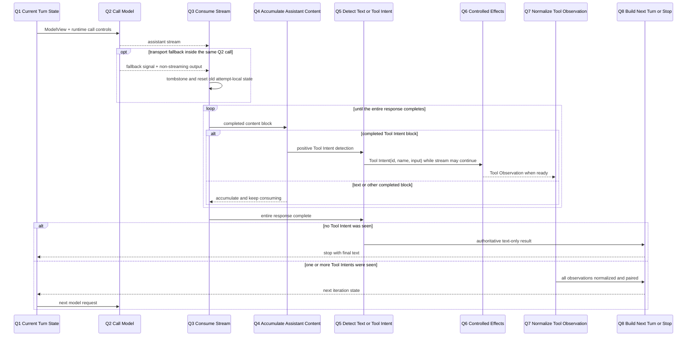
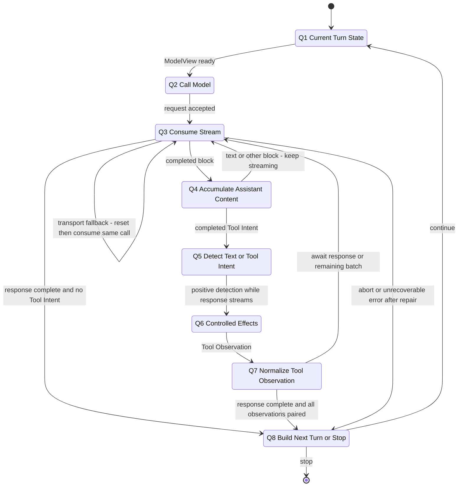

# 02：Query Loop 与 Streaming——一次模型输出怎样变成下一步

[← 上一篇：Context Assembly](01-context-assembly.md) · 下一篇：Controlled Effects（下一部分）

> 模型视图准备好后，runtime 如何把一次模型输出推进成最终回答或下一轮决策？

**[Architectural interpretation]** Query Loop 把一次 `ModelView` 交给模型边界：完成的 Tool Intent block 可以立即越过 Q6，但只有整个 model response 结束且始终未见 Tool Intent，text-only completion 才成立；随后 runtime 才以最终文本或闭合的 Tool Intent / Tool Observation 对推进到停止或下一次 model-request / feedback iteration。

## 1. 先把 Query Loop 放回 A3、A4 与 A7

**[Architectural interpretation]** 本章放大 [A3 Model Request and Stream、A4 Runtime Decision 与 A7 Tool Observation and State Update](../00-one-agent-turn.md#1-权威全景图a1a8)。它消费上一篇已经构造完成的 `ModelView { system, messages, tools, request_options }`，在本地只把 Q6 Controlled Effects 看成一个不透明边界：输入是 Tool Intent，输出是可关联的 Tool Observation；权限、执行、sandbox 与文件安全算法都由下一部分负责。

这里继续沿用上一篇的两只时钟：一次 **agent-turn / query-entry** 可以包含多次 **model-request / feedback iteration**。下图中的 Q1→Q8 描述一次 iteration；只有 Q8 选择 Continue，才会在同一个 `query` 内回到新的 Q1→Q2。





| 节点 | 输入 | 决定或状态变化 | 输出 |
| --- | --- | --- | --- |
| Q1 Current Turn State | 当前 Messages、`ModelView` 与 runtime-only controls | 固定本次 model-request / feedback iteration 的起点 | 可发送的请求与本地 loop state |
| Q2 Call Model | `system + messages + tools + request_options` | 发起一次模型请求；这不是新的 agent turn | stream 或明确的请求失败 |
| Q3 Consume Stream | transport stream | 消费增量，发出 completed blocks，并持续到整个 response / model-boundary generator 完成 | partial deltas、completed blocks 与 response-complete boundary |
| Q4 Accumulate Assistant Content | completed blocks | 累积可进入协议历史的 assistant messages；完成的 text block 仍不能证明后面没有 Tool Intent | text/other candidates，或可被立即识别的完整 Tool Intent |
| Q5 Detect Text or Tool Intent | completed blocks 与 response-complete signal | 看到完整 `tool_use` 就正向判定并可提前越过 Q6；只有 response 完成且从未见 intent，negative text-only 才权威 | early Tool Intent 集合，或 response-complete 后的 text-only 结论 |
| Q6 Controlled Effects | `id + tool name + input` | 不透明边界；本章不展开授权与机器执行 | 成功、失败、拒绝或中断的原始 Tool Observation |
| Q7 Normalize Tool Observation | Tool Observation 与原 Tool Intent | 转成模型协议可见的 `tool_result`，保持关联 ID 与顺序 | 可与 assistant intent 配对的 user-side result message |
| Q8 Build Next Turn or Stop | response-complete 状态、assistant messages、normalized results 与控制信号 | response 完成且无 intent 时终止；response 完成且 feedback 已闭合时构造下一 iteration；异常时修复或显式终止 | terminal result 或新的 Q1 state |

## 2. 标准路径一：一次连续的 text-only iteration

先走最短路径。假设上一篇构造出的 Model View 已经包含足够事实，模型不需要再读取文件，也没有提出 Tool Intent。

### 2.1 Q1→Q2：Model View 进入本次 request

Q1 的输入不是整个 session，而是当前 iteration 已选定的视图和 runtime controls：

```yaml
ModelView:
  system: [effective instructions]
  messages:
    - { role: user, content: "locate and fix a failing test" }
    - { role: user, content: "the test now passes; summarize the change" }
  tools: [Grep, Read, Edit, Bash]
  request_options:
    model: selected-model

RuntimeOnly:
  abort_signal: active
  turn_count: 4
  pending_tools: []
```

**输入：** 当前 `messages`、query-entry 已选定的 system、当前 tool schemas 与 signal/options。

**决策：** Q2 发起的是这个 `query` 内的一次 model request，不是重新收集用户任务，也不是开启新的 agent turn。

**状态变化：** runtime 从 `request_ready` 进入 `streaming`；request 的输入视图在本次调用期间已经固定，但 runtime 仍持有取消与循环控制状态。

**[Source-confirmed]** 快照 `712b24f22a63eb6d1a2f86697bf6dbbaa39ae3cf` 的 `src/query.ts` / `queryLoop` 在每个 loop iteration 用当前 `messagesForQuery`、query-entry 的 full system、当前 tools、abort signal 与 options 调用 model boundary；同一个 `queryLoop` 的 `State` 保存跨 feedback iterations 的 Messages、turn count、recovery guards 与 transition reason。

### 2.2 Q3→Q4：增量可被展示，完成块才能成为协议内容

模型可能把回答拆成许多 stream deltas。Q3 可以把这些增量继续 yield 给 UI/SDK，但 Q4 不把半个 text block 或半段 Tool JSON 当成已经形成的 assistant protocol message。某个 content block 完成并被规范化后，runtime 才得到可累积的 assistant content；然而**完成一个 text block 仍然不能断言 text-only**，因为同一 response 后面还可能完成 `tool_use` block。

```text
partial stream state
  "I fixed the fa"
  └─ 可用于低延迟展示；不是独立的下一轮 Message

completed assistant content
  "I fixed the failing assertion and the targeted test now passes."
  └─ 可以进入 assistantMessages；仍要继续消费 response

entire response complete
  no tool_use was seen across every completed block
  └─ 此时 negative "no Tool Intent" 才成为权威结论
```

**[Source-confirmed]** 快照 `712b24f22a63eb6d1a2f86697bf6dbbaa39ae3cf` 的 `src/services/api/claude.ts` / `queryModel` 先把 deltas 累积进 `contentBlocks`；到 `content_block_stop` 才用完成块构造并 yield `AssistantMessage`。随后 `message_delta` 把最终 usage 与 `stop_reason` 写回最后一个已 yield message 所持有的对象。

因此需要区分正向和负向知识：完整 Tool Intent block 一出现，Q5 就已经拥有正向事实并可让它提前越过 Q6；text block 完成只提供内容候选，直到整个 response 结束且 `needsFollowUp` 始终为 false，Q5 才知道这真是 text-only。整个 response 的 usage 与 stop metadata 还要等后续 message delta 才成为最终权威值。

### 2.3 Q3→Q5→Q8：整个 response 完成后，未见 Tool Intent 才结束

Q5 检查已形成的 assistant content：

```yaml
assistant_content:
  - type: text
    text: "I fixed the failing assertion and the targeted test now passes."

response_complete: true
detected_tool_intents_across_response: []
```

`for await` 已经消费完整个 model-boundary generator，且所有 completed blocks 中都没有 `tool_use`，所以 `needsFollowUp` 最终保持 false。先忽略 stop hook、token budget continuation 与错误恢复等附加控制后，Q8 才返回最终 text，不再构造下一次 feedback request；若在更晚的 block 才出现 Tool Intent，这条 negative 分支就不会成立。

**[Source-confirmed]** 快照 `712b24f22a63eb6d1a2f86697bf6dbbaa39ae3cf` 的 `src/query.ts` / `queryLoop` 在 `for await (const message of deps.callModel(...))` 内从每个完成的 assistant message 提取实际 `tool_use` blocks，并即时设置 `needsFollowUp`；只有该 `for await` 完成后，代码才检查 `if (!needsFollowUp)` 并在没有 recovery/hook continuation 时返回 `reason: 'completed'`。因此 positive intent knowledge 是 block-local，negative no-intent knowledge 是 response-complete；源码也明确说明不能只依赖 `stop_reason === 'tool_use'`。

### 2.4 yield、runtime state 与 durable record 不是同一件事

**[Architectural interpretation]** 本章只声明 Query Loop 的本地输出边界；“何时 flush 到磁盘、如何恢复或压缩”由 Session Continuity 负责。

| 产物 | Query Loop 在本地做什么 | UI / SDK 能否消费 | 是否已经等于 durable transcript |
| --- | --- | --- | --- |
| raw `stream_event` | 随 generator yield，提供低延迟增量 | 能；可更新 streaming UI 或 SDK event consumer | 否；它本身不等于一条闭合的协议 Message |
| completed `AssistantMessage` | 在 Q4 累积，同时向下游 yield | 能；可展示完整 block，也可交给 transcript consumer | 不自动等于；它是可记录的协议事实，durable write/flush 的 owner 在本章之外 |
| `assistantMessages`、`needsFollowUp`、`State.transition` | 只在 runtime 内辅助决定继续、恢复或停止 | 不作为 Model View 整体暴露 | 否；这些是 runtime-only loop state |
| terminal result | generator return，例如 `completed` | 调用方能观察结束原因 | 它描述控制流出口，不替代已经 yield 的 transcript messages |

这一区分也说明为什么 `handleMessageFromStream` 不应成为本章主机制：它可以把既有 stream/message 投影到 REPL 展示状态，却不拥有 Q5 的 Tool Intent 判定或 Q8 的 continuation state。

## 3. 标准路径二：失败测试任务经过 Grep / Read feedback

现在回到贯穿全文的任务：

```text
User: locate and fix a failing test.
```

这一条路径只比 text-only 多一个闭环：模型先提出 `Grep` Tool Intent；Q6 返回与它可关联的 Tool Observation；Q7 规范化后，Q8 才能让同一个 `query` 发起下一次 model request。下一次模型根据搜索命中提出 `Read`，也会重复同一个协议闭环。

### 3.1 Q1→Q5：先记录模型提出的意图

第一次 request 前，Messages 只有任务与适用的上下文，没有虚构的工具结果：

```yaml
# Before: first model request
messages:
  - role: user
    content: "locate and fix a failing test"
pending_tools: []
```

模型完成一个 `tool_use` content block 后，Q4/Q5 得到：

```yaml
# After Q5: intent exists, observation does not
messages_candidate:
  - role: user
    content: "locate and fix a failing test"
  - role: assistant
    content:
      - type: tool_use
        id: grep-1
        name: Grep
        input:
          pattern: "failing|expected|assert"
          path: "test"

runtime_turn_state:
  phase: streaming_with_tool_pending
  response_complete: false | unknown
  pending_tools: [grep-1]
```

此时 assistant intent 可以被 yield 和记录，而且即使同一个 model response 仍在 streaming，它也已经可以提前越过 Q6；但下一次 Model View 还不合法：response 尚未确认完成，`grep-1` 也尚未被对应 observation 闭合。模型在更早或更晚 block 写出的说明文字都不能把该 iteration 当成 text-only completion。

**[Source-confirmed]** 快照 `712b24f22a63eb6d1a2f86697bf6dbbaa39ae3cf` 的 `src/query.ts` / `queryLoop` 把每个完成的 `AssistantMessage` 加入 `assistantMessages`，从其 content 中收集 `ToolUseBlock[]`，并在数组非空时设置 `needsFollowUp = true`。这证明 continuation 依据实际 intent content，而不是“回答里是否也有文字”。

### 3.2 Q6：本章只穿过一个不透明 contract

```text
input to Q6
  Tool Intent { id: grep-1, name: Grep, input: ... }

Q6 internals
  [owned by Controlled Effects; intentionally opaque here]

output from Q6
  Tool Observation {
    id: grep-1,
    status: ok | error | denied | interrupted,
    content: ...
  }
```

本章不解释 `Grep` 如何查找实际 Tool、怎样校验参数、是否需要授权、在什么 sandbox 中运行，也不解释文件安全；这里只要求 Q6 对每个已接受的 intent 返回可关联结局，并且结果不能越过前面的 intent 排序。Q6 可以与剩余 response streaming 重叠，但 Q8 仍要同时等到 response complete 与当前 batch closure。

### 3.3 Q7：把机器结局变成 user-side `tool_result`

假设 Grep 找到失败测试，Q7 把原始结局规范化为模型协议能读取的 observation：

```yaml
normalized_observation:
  role: user
  content:
    - type: tool_result
      tool_use_id: grep-1
      is_error: false
      content: "test/calculator.test.ts:42: expected 3, received 2"
```

`role: user` 不表示这段文本由人重新输入；它是 Anthropic message protocol 中承载 client tool result 的一侧。因果身份由 `tool_use_id: grep-1` 保持，而不是靠“这两条消息看起来相邻”猜测。

**[Source-confirmed]** 快照 `712b24f22a63eb6d1a2f86697bf6dbbaa39ae3cf` 的 `src/query.ts` / `queryLoop` 对 Q6 返回的每个 update 调用 `src/utils/messages.ts` / `normalizeMessagesForAPI`，只把规范化后的 user messages 加入 `toolResults`；这一步把 runtime update 投影成下一次模型调用所需的 Tool Observation 形态。

### 3.4 Q8：闭合后才能构造下一次 feedback request

整个 model response 完成，且 Q8 得到全部 assistant intents 与 normalized observations 后，下一次 state 的核心 Messages 才变成：

```yaml
# After Q7/Q8: next model-request / feedback iteration
messages:
  - role: user
    content: "locate and fix a failing test"
  - role: assistant
    content:
      - type: tool_use
        id: grep-1
        name: Grep
        input:
          pattern: "failing|expected|assert"
          path: "test"
  - role: user
    content:
      - type: tool_result
        tool_use_id: grep-1
        content: "test/calculator.test.ts:42: expected 3, received 2"
```

下一次模型看到的不是“Grep 已经执行”这个 runtime 布尔值，而是完整的因果历史：原任务、assistant 自己提出的 `grep-1`、与它同 ID 的 observation。模型据此可以提出：

```yaml
next_assistant_intent:
  type: tool_use
  id: read-1
  name: Read
  input:
    file_path: test/calculator.test.ts
    offset: 35
    limit: 20
```

`read-1` 会重新走 Q5→Q6→Q7→Q8；它不能复用 `grep-1` 的 ID，也不能让 Grep 的 result 充当 Read 的 observation。一个 query 因而可以有 Grep、Read、Edit、Test 等多次 model-request / feedback iterations，而仍属于同一个 agent turn。

**[Source-confirmed]** 快照 `712b24f22a63eb6d1a2f86697bf6dbbaa39ae3cf` 的 `src/query.ts` / `queryLoop` 在工具 batch 与适用 attachments 完成后，将 `messagesForQuery + assistantMessages + toolResults` 写入下一份 `State.messages`，增加内部 turn count，再回到 loop 顶部发起下一次 model request。

### 3.5 ID pairing 是协议不变量，不是最佳实践建议

**[Architectural interpretation]** 对 client-side Tool Intent，下一次合法的模型视图必须满足：

```text
for every assistant tool_use(id = X)
  exactly one associated user tool_result(tool_use_id = X)
  appears in the immediately following feedback batch

and
  no tool_result references an absent tool_use
  no tool_use ID or tool_result ID is duplicated
  result order cannot leap over an earlier ordering barrier
```

如果 `tool_use(grep-1)` 已经被 yield，但 stream、执行或进程控制在 result 到达前中断，runtime 不能简单删掉“难处理的半边”然后假装历史合法。它必须生成带同 ID 的 error observation、修复投影，或明确 tombstone/舍弃整个未采用 attempt；具体走哪条边取决于失败发生的位置。

**[Source-confirmed]** 快照 `712b24f22a63eb6d1a2f86697bf6dbbaa39ae3cf` 的 `src/utils/messages.ts` / `ensureToolResultPairing` 检查重复 Tool Intent ID、missing result、orphan result 与 duplicate result；宽松模式会为 missing IDs 插入 synthetic error `tool_result` 并剔除 orphan/duplicate blocks，strict mode 则拒绝修复并抛错。`src/query.ts` / `yieldMissingToolResultBlocks` 还会在中断或异常路径上为已经 emitted 的每个 `tool_use` 产生同 ID 的 error result。

### 3.6 这一轮到底改变了四类什么状态

**[Architectural interpretation]** Durable Transcript 一列描述 Query Loop yield 给持久化消费者的事实；本章不承诺磁盘 flush 时点。

| 时点 | 当前 Model View | runtime turn state | durable transcript candidate | pending tools |
| --- | --- | --- | --- | --- |
| Q1 首次 request 前 | user task + schemas/context | `request_ready` | user task 已由入口记录或可记录 | `[]` |
| Q5 检出 `grep-1` | 当前 request 可能仍在 streaming；下一 view 尚未闭合 | `streaming_with_tool_pending` | assistant `tool_use(grep-1)` 已 yield | `[grep-1]` |
| Q6 返回结局 | 模型尚未看到 result；response 也可能仍在 streaming | `observation_received` | raw execution metadata 是否持久化由 owner 决定 | `[grep-1]`，等待 normalization/ordering closure |
| Q7 规范化后 | intent + result 是 next-view candidate，但不能绕过 response-complete boundary | `feedback_candidate` | user `tool_result(grep-1)` 已 yield | `[]`，仍等待 response/batch 最终 closure |
| Q8 Continue | response 已完成，全部 pairs 已闭合，新 Model View 可投影 | `request_ready` for next iteration | 无需伪造新的协议事件；已有 pair 足以继续 | `[]` |

## 4. Streaming 只在改变正确性时才值得展开

本章不枚举所有 event type、spinner mode、UI callback 或 telemetry。对 Query Loop 来说，streaming 只有在改变**状态何时成立、结果能否提前处理、顺序是否仍合法、失败 attempt 怎样隔离**时才进入主线。

### 4.1 Partial、completed block、final metadata 与 response complete 是四层 authority

```text
partial delta
  -> 只更新 runtime accumulator / 低延迟 consumer
  -> 不足以成为下一轮 assistant Message

completed content block
  -> 形成一个 AssistantMessage
  -> 完整 Tool Intent 可被 Q5 正向识别
  -> 完整 text block 仍不能证明后面没有 Tool Intent

final message delta
  -> 给出最终 usage 与 stop_reason
  -> 修正已经 yield 的 message metadata

model-boundary generator complete
  -> 整个 response 不会再出现新 content block
  -> 若此前从未见 Tool Intent，negative text-only 才权威
```

**[Source-confirmed]** 快照 `712b24f22a63eb6d1a2f86697bf6dbbaa39ae3cf` 的 `src/services/api/claude.ts` / `queryModel` 在 `content_block_start` 初始化 immutable accumulator，在 `content_block_delta` 追加 text 或 Tool JSON，在 block stop 时调用 `normalizeContentFromAPI` 并构造 `AssistantMessage`；之后到达的 message delta 才把最终 usage 与 `stop_reason` 写回最后一条 message。

这四层不能压成“stream 一边来一边就是最终消息”。Tool Intent 的 `input` 在 JSON delta 尚未闭合时不能安全进入 Q6；一旦 block 完成，整个 response 尚未结束也不妨碍它被 Q5 正向识别。反过来，完成 text block 只说明“目前有文本”，不能说明“后面没有 Tool Intent”；negative 结论必须等 model-boundary generator 完成。

### 4.2 早执行优化重叠了等待时间，却没有移动 Q5/Q6 边界

**[Architectural interpretation]** 当 streaming Tool execution 开启时，runtime 可以在模型继续生成后续 blocks 的同时，把已经完整的 Tool Intent 交给 Q6。它优化的是等待重叠：

```text
without early execution
  finish whole model response
    -> start Tool A
    -> wait Tool A

with early execution
  Tool A block completes
    -> cross Q6 boundary for Tool A
  model keeps streaming later blocks  ||  Tool A is pending/running
```

它不允许三件事：不能用半段 `input_json_delta` 启动 Tool，不能把 runtime execution status 伪装成模型已经看见的 observation，也不能在 Tool Observation 尚未形成时构造下一次 model request。

**[Source-confirmed]** 快照 `712b24f22a63eb6d1a2f86697bf6dbbaa39ae3cf` 的 `src/query.ts` / `queryLoop` 只从已经 yield 的 `AssistantMessage` 提取 `tool_use` blocks，再调用 `src/services/tools/StreamingToolExecutor.ts` / `StreamingToolExecutor.addTool`；`addTool` 把完整 block 加入队列并立即尝试推进。Tool 的解析、授权与执行仍属于 Q6，本章只引用这个“完成 intent 可以提前越界”的时机。

### 4.3 并发完成不等于可以任意改写 observation 顺序

多个 Tool Intent 可能并发安全，完成时间也可能不同。local ordering contract 是：

- result 必须保留原 `tool_use_id`，不能因先完成就改绑到另一个 intent；
- concurrency-safe work 可以在不跨越必要 barrier 时提前产出；
- 遇到仍在执行的 non-concurrency-safe Tool，它构成顺序 barrier，后面的 completed result 不能越过去；
- Q8 构造下一次 model request 前，要 drain 仍未完成的当前 batch，使每个被采用的 intent 都有 observation 或 error closure。

**[Source-confirmed]** 快照 `712b24f22a63eb6d1a2f86697bf6dbbaa39ae3cf` 的 `src/services/tools/StreamingToolExecutor.ts` / `StreamingToolExecutor.getCompletedResults` 按 tracked tools 顺序检查结果，遇到仍 executing 且 non-concurrency-safe 的项就停止向后 yield；`StreamingToolExecutor.getRemainingResults` 则持续推进队列、等待执行或 progress，并在退出前再次 yield completed results。该证据只支持本地等待/顺序 contract，不展开 Q6 的调度算法。

### 4.4 Positive intent 看 block，negative no-intent 看 response complete

message delta 到达前，block-stop 时构造的 assistant message 可能仍带 `stop_reason: null` 和初始 usage。最终 metadata 到达后，runtime 要更新同一个 message object，避免 UI、SDK 或延迟 transcript writer 保留过时 usage。

但 `stop_reason` 的权威性只适用于 response metadata，不意味着它单独拥有 Q5 的语义分支。Tool continuation 仍以实际完成的 `tool_use` blocks 为准：有 intent 时可以立即登记并越过 Q6；只有 model-boundary generator 已完成，`needsFollowUp` 仍为 false，才进入 text completion / recovery checks。

**[Source-confirmed]** 快照 `712b24f22a63eb6d1a2f86697bf6dbbaa39ae3cf` 的 `src/services/api/claude.ts` / `queryModel` 在 message delta 直接更新最后一条已 yield message 的 usage/stop reason；`src/query.ts` / `queryLoop` 明确从 content 中提取 Tool Intent，并注明 `stop_reason === 'tool_use'` 并非可靠的唯一信号。

### 4.5 Fallback 必须隔离 abandoned attempt

stream 可能已 yield text、thinking 或 Tool Intent，随后 model boundary 决定从 streaming transport 改走 non-streaming transport。此时 fallback response 不是旧 stream 的后半段，而是**同一 Q2 model-boundary call 内、针对同一 request 输入的另一次 transport attempt**。若把两者直接拼接，会出现：

- assistant content 重复或签名无效；
- 旧 `tool_use_id` 的 result 泄漏到新 attempt；
- `needsFollowUp` 被旧 intent 污染；
- 早启动的 Tool 在 fallback 又出现同一 intent 时产生重复效果风险。

`queryModel` 在自己的 generator 内调用 fallback callback，随后内部执行 non-streaming request，并从**同一个 generator 调用** yield fallback response。Query Loop 的 callback 只把 `streamingFallbackOccurred` 设为 true；当 `for await` 收到 fallback output 时，它先 tombstone 已采用的旧 assistant messages，清空旧 assistant/result/intent buffers 与 `needsFollowUp`，discard 旧 executor 并建立新的 attempt-local executor，然后继续处理当前 fallback message。这里没有 Q8→Q1，也没有重新调用外层 model boundary。

**[Source-confirmed]** 快照 `712b24f22a63eb6d1a2f86697bf6dbbaa39ae3cf` 的 `src/services/api/claude.ts` / `queryModel` 在 streaming error 允许 fallback 时调用 `options.onStreamingFallback`，随后在该 generator 内调用 `executeNonStreamingRequest` 并 yield 构造出的 fallback `AssistantMessage`；`src/query.ts` / `queryLoop` 的同一个 `for await (const message of deps.callModel(...))` 在 callback flag 成立时，对既有 assistant messages yield tombstones，清空 `assistantMessages`、`toolResults`、`toolUseBlocks` 和 `needsFollowUp`，discard/reset `StreamingToolExecutor`，然后继续处理 generator 当前 yield 的 fallback message。

这里有两个重要边界。第一，discard 可以阻止**旧 protocol results**继续进入 fallback attempt，却不能一般性回滚已经发生的机器效果；源码因此也提供禁用 mid-stream non-streaming fallback 的分支，以避免 early execution 与 transport retry 组合造成 double execution。第二，`queryLoop` 里另有 `FallbackTriggeredError` 对应的 model-switch outer retry，它会切换 model 并重跑 request；那是不同的恢复路径，不能用来解释这里的 streaming-to-non-streaming transport fallback。

## 5. Continuation、termination 与 repair 的统一机制

前面的标准路径可以压缩成一个不对称决策：completed Tool Intent block 可以在 response streaming 期间提前进入 Q6；只有整个 model-boundary generator 完成后，runtime 才能断言“没有 Tool Intent”。此后，无 intent 才结束或进入显式 recovery；有 intent 则必须取得并规范化全部 observations，且 response 与 batch 都闭合后才构造下一份 state。

### 5.1 机制伪代码

**[Architectural interpretation]** 下面的伪代码固定状态与所有权，不是源码函数签名；Q6 保持不透明，compaction、queue persistence 与 transcript flush 均只表现为 owner contract。

```text
function runQuery(initialState): Terminal {
  state = initialState

  while true {
    modelView = projectModelView(state.messages, state.currentTools)
    transportFallbackSignaled = false
    fallbackCleanupApplied = false
    assistant = []
    intents = []
    observations = []

    modelCall = callModelBoundary(modelView, {
      signal: state.abortSignal,
      onStreamingFallback: () => transportFallbackSignaled = true,
    })

    for message in modelCall {
      if transportFallbackSignaled and not fallbackCleanupApplied {
        yield tombstones(assistant)
        clear(assistant, intents, observations)
        resetAttemptLocalToolExecutor()
        fallbackCleanupApplied = true
        // Do not outer-continue: queryModel already switched transport.
        // The current message is fallback output from this same generator.
      }

      if message is completed AssistantMessage {
        assistant += message
        newIntents = collectCompletedToolIntents(message)
        intents += newIntents
        for intent in newIntents {
          beginControlledEffectsEarly(intent)  // Q6 remains opaque
        }
      }

      observations += normalizeCompletedObservationsWithoutBlocking()
    }

    // Only here is the entire response complete. Therefore only here can
    // intents.isEmpty() become authoritative negative knowledge.
    if state.abortSignal.aborted {
      yield closeOrDrainPendingIntents(intents, observations)
      return Terminal(aborted_streaming)
    }

    if intents.isEmpty() {
      if recoverableRequestFailure(assistant) {
        state = requestRecoveryOwnerForLegalNextProjection(state, assistant)
        if state.canRetry then continue
      }
      return finalizeTextOrExplicitError(assistant)
    }

    rawObservations = drainControlledEffects(intents)  // Q6 is opaque here.
    observations += normalizeAndPair(rawObservations, intents)

    if state.abortSignal.aborted {
      yield closeOrDrainPendingIntents(intents, observations)
      return Terminal(aborted_tools)
    }

    feedbackAttachments = collectApplicableFeedbackAttachmentsAfterToolBatch()

    if exceedsMaxTurns(state.turnCount + 1) {
      yield MaxTurnsReached
      return Terminal(max_turns)
    }

    state = NextState {
      messages:
        state.messages + assistant + observations + feedbackAttachments,
      pendingTools: [],
      turnCount: state.turnCount + 1,
      transition: next_turn,
    }
  }
}
```

Transport fallback 不执行这段 `while` 的 outer `continue`：它在同一个 `modelCall` generator 内清理旧 transport attempt 后继续消费 fallback output。只有 feedback iteration、prompt recovery，或另一个独立的 model-switch retry 才会重新发起 model-boundary call。正常 `continue` 的成功边界不是“Tool function resolve 了”，而是 response 已完成，下一份 `State.messages` 也已拥有顺序合法、ID 配对闭合的 assistant intent 与 user-side observation；`stop` 则必须等 response-complete 后才可能依据 negative no-intent 成立。

### 5.2 每条 transition 改变谁的状态

**[Architectural interpretation]** “durable-record boundary”表示 Query Loop yield 了可由 transcript owner 记录的 Message/Tombstone；它不声明物理 flush 已完成。

| transition | current model view | runtime loop state | durable-record boundary | pending tool execution |
| --- | --- | --- | --- | --- |
| Q1→Q2 request | 当前 `ModelView` 被消费；内容不再中途追加 | `request_ready → streaming` | 通常没有新协议事实；可有 request-start signal | 无，或上一 iteration 已在进入 Q1 前清空 |
| Q3→Q4 completed assistant block | 当前 request 仍可能 streaming；只形成 next-view candidate | accumulator 产生 `AssistantMessage` | completed assistant message 被 yield；raw delta 不等同 durable Message | 若 block 是 Tool Intent，Q5 后可立即登记/越界；text block 不产生 negative 结论 |
| Q4→Q5→Q6 positive Tool Intent | 下一 view 暂时不合法，因为 response/result 可能未完成 | `streaming → streaming_with_tool_pending` | assistant `tool_use(id)` 已 yield | intent IDs 可在 response 继续时进入 pending/queued/running 集合 |
| Q3→Q5→Q8 negative text completion | 整个 response 已完成且从未见 intent，不再构造 feedback view | `response_complete → terminal` | final assistant 已 yield；terminal reason 单独返回 | 必须为空 |
| Q6→Q7 observation | 模型尚未读取 raw result；response 也可能仍 streaming | `tool_pending → feedback_candidate` | raw progress/metadata 的持久化由 owner 决定 | completed intent 等待 paired result yield；未完成者仍 pending |
| Q7→Q8 feedback ready | response complete 且 intent + observation 全部闭合 | `feedback_candidate → feedback_ready` | normalized `tool_result(id)` 被 yield | batch 结束时应为空 |
| Q8→Q1 continue | 下一次 projection 消费累积 Messages | 新 `State.messages`、turn count 与 transition 生效 | 不必另造“continue”协议消息；适用 attachments 可能已 yield | 空；新的 Tool Intent 只能由下一 request 产生 |
| streaming transport fallback inside Q2/Q3 | Model View 与外层 model-boundary call 不变；同一 generator 改用 non-streaming output | fallback output 到达时清零 old attempt buffers、reset executor，然后继续当前 `for await` | 旧 assistant messages yield tombstone；fallback message 由同一 generator 接着 yield | 旧 attempt results 被 discard；已发生外部效果不能由此回滚；不经过 Q8→Q1 |
| abort/error repair | 不再把半闭合 history 当普通 next view | 进入 explicit terminal 或 clean retry | 对 emitted intents yield error results；必要时 interruption/error message | drain、synthetic close 或 discard，不能静默遗留 |

## 6. 把失败挂到 Q2–Q8 的准确分叉点

失败不是附录里的 error list；每一种失败都必须说明它在哪个节点使原有 transition 不再成立，以及 runtime 怎样恢复协议合法性或显式终止。

| 节点 | 失败或边界 | 为什么标准边失效 | 本地 repair / terminal transition | 不在本章展开的 owner |
| --- | --- | --- | --- | --- |
| **Q2 前** | pre-request prompt-too-long blocking check | request 尚未发送，当前 view 已超过允许的 blocking boundary | yield synthetic API error，返回 `blocking_limit`；若自动 recovery owner 明确接管，则允许真实 request 产生可恢复信号 | 如何 compact/collapse history 属于 Session Continuity |
| **Q2→Q3** | API 返回 prompt-too-long | request 已发送，但模型没有产生有效普通回答 | 把 recoverable error 暂时 withheld；请求 owner 给出合法的更小 projection 后 retry，恢复失败则 yield error 并返回 `prompt_too_long` | compaction/collapse 的选择与算法属于 Session Continuity |
| **Q2/Q3 内部** | streaming-to-non-streaming transport fallback | 同一 model-boundary call 的旧 transport output 不能与 fallback output 混合 | `queryModel` callback 后在内部执行并 yield non-streaming response；Query Loop 在 fallback output 到达时 tombstone + reset old attempt-local state，再继续同一个 `for await`，不走 Q8→Q1 | transport retry policy 不改变 Tool protocol owner；独立 model-switch retry 不是这条边 |
| **Q3→Q4** | abort while streaming | 可能已经 yield Tool Intent，却没有 result；socket 结束不代表协议闭合 | 有 streaming executor 时 drain 它生成的 closure；否则为每个 emitted intent synthetic error result，然后返回 `aborted_streaming` | 取消信号来源与 session queue lifecycle 在别处拥有 |
| **Q4/Q5** | fallback output 在旧 assistant content 已部分采用后到达，或发生不可恢复异常 | `assistantMessages`、`needsFollowUp` 与 intent IDs 属于旧 transport attempt | transport fallback 在同一 `for await` 内先 tombstone/reset 再处理当前 fallback message；不可恢复异常则 error-close 后 terminal | UI 如何移除 tombstone 不是 continuation 语义 |
| **Q6→Q7** | abort during Tool execution | 已接受 intent，但 observation batch 可能只完成一部分 | drain/生成剩余 error observations，必要时 yield interruption，返回 `aborted_tools`；不能直接跳到 text completion | Tool 如何停止进程、释放资源属于 Controlled Effects |
| **Q7** | missing、orphan 或 duplicate Tool Observation | 下一 request 会违反 `tool_use` / `tool_result` ID pairing | 宽松模式 synthetic-close missing IDs 并剔除 orphan/duplicate；strict mode 抛错；异常路径可调用 `yieldMissingToolResultBlocks` | transcript 为什么损坏、怎样跨会话恢复属于 Session Continuity |
| **Q7→Q8** | mid-turn queued input 到达 | regular user content 不能插进尚未闭合的 Tool result batch | 等当前 Tool batch 完成后取得 thread-scoped queue snapshot，过滤不适用项，转成 attachments，随后与 results 一起进入 next state | queue 的存储、优先级与 Continue/Resume 语义属于 Session Continuity |
| **Q8** | max-turn boundary | feedback 已闭合，但继续发新 request 会超过调用方上限 | yield `max_turns_reached` attachment，返回 `max_turns`；不创建下一 Q1 request | 上层怎样向用户呈现或恢复由入口/session owner 决定 |

### 6.1 Prompt too long 有“请求前”和“请求后”两条不同边

**[Source-confirmed]** 快照 `712b24f22a63eb6d1a2f86697bf6dbbaa39ae3cf` 的 `src/query.ts` / `queryLoop` 在特定 recovery owner 未接管时先用 token warning state 做 blocking-limit check，命中便在 model call 前返回；同一 symbol 也会在真实 request 后识别被 withheld 的 prompt-too-long API message，请 recovery subsystem 生成新的 state，或在无法恢复时 yield 错误并显式终止。

两者的关键区别是：pre-request 分支没有模型 attempt，不能声称“streaming 失败”；post-request 分支已经有 request attempt，但没有可交给普通 stop hooks 的有效 assistant answer。这里仅记录 Query Loop 要求“得到合法 next projection 或终止”的 contract，不解释 projection 如何压缩。

### 6.2 Abort 必须先闭合已采用的 intent

**[Source-confirmed]** 快照 `712b24f22a63eb6d1a2f86697bf6dbbaa39ae3cf` 的 `src/query.ts` / `queryLoop` 在 stream 后首先检查 abort：有 `StreamingToolExecutor` 时消费其 remaining results，否则调用 `yieldMissingToolResultBlocks`，然后返回 `aborted_streaming`；若 abort 发生在 Tool batch 中，则在 batch update 处理后返回 `aborted_tools`。`src/query.ts` / `yieldMissingToolResultBlocks` 为每个 assistant `tool_use` 创建同 ID、`is_error: true` 的 user-side result。

### 6.3 Queued input 只能在 pairing boundary 之后注入

**[Source-confirmed]** 快照 `712b24f22a63eb6d1a2f86697bf6dbbaa39ae3cf` 的 `src/query.ts` / `queryLoop` 在 Tool updates 全部处理后才取得 queued-command snapshot，排除 slash commands 并按 main thread / agent identity 过滤，再通过 attachment collector 把适用项加入 `toolResults`；源码特别说明不能把普通 user messages 插到 Tool result messages 中间，否则 API protocol 会报错。

所以“用户在 agent 工作时又输入一句话”并不意味着键盘事件立刻改写正在 flight 的 Model View。对当前局部路径，它只会在闭合 Tool feedback 后成为下一 iteration 的 attachment candidate；队列何时持久化、Continue/Resume 如何重建，则留给 Session Continuity。

## 7. 再用决定性源码验证因果链

到这里，读者不看源码也应该能讲清 Q1–Q8。下面只选择会改变 continuation、Message shape、ordering 或 repair 结果的分支，不按文件行号重走 `queryLoop`。

以下 TypeScript 代码块都是**按同一 symbol 的源码顺序裁剪**的切片。插入的 `// [省略：……]` 是本文唯一新增内容，用来明确标出不连续位置；其余语句保持源码顺序，不把伪代码伪装成 excerpt。

### 7.1 源码 lens 1：累积真实 Tool Intent，再决定继续或结束

**[Source-confirmed]** 证据：snapshot `712b24f22a63eb6d1a2f86697bf6dbbaa39ae3cf` + `src/query.ts` + `queryLoop`。

```ts
const assistantMessages: AssistantMessage[] = []
const toolResults: (UserMessage | AttachmentMessage)[] = []
// @see https://docs.claude.com/en/docs/build-with-claude/tool-use
// Note: stop_reason === 'tool_use' is unreliable -- it's not always set correctly.
// Set during streaming whenever a tool_use block arrives — the sole
// loop-exit signal. If false after streaming, we're done (modulo stop-hook retry).
const toolUseBlocks: ToolUseBlock[] = []
let needsFollowUp = false

// [省略：request 参数构造、stream fallback 清理和非 assistant event 处理]

if (message.type === 'assistant') {
  assistantMessages.push(message)

  const msgToolUseBlocks = message.message.content.filter(
    content => content.type === 'tool_use',
  ) as ToolUseBlock[]
  if (msgToolUseBlocks.length > 0) {
    toolUseBlocks.push(...msgToolUseBlocks)
    needsFollowUp = true
  }

  if (
    streamingToolExecutor &&
    !toolUseContext.abortController.signal.aborted
  ) {
    for (const toolBlock of msgToolUseBlocks) {
      streamingToolExecutor.addTool(toolBlock, message)
    }
  }
}

// [省略：completed result 的非阻塞收集、stream 结束与 abort repair]

if (!needsFollowUp) {
  const lastMessage = assistantMessages.at(-1)

  // [省略：prompt-too-long、max-output、stop-hook 与 token-budget 分支]

  return { reason: 'completed' }
}
```

- **input：** 当前 model request yield 的 completed assistant messages。
- **decision：** 从 content 中提取实际 `tool_use`，而不是把 text presence 或 `stop_reason` 当作唯一控制信号；positive intent 在 block 到达时成立，negative no-intent 要等外层 stream loop 完成。
- **state mutation：** `assistantMessages` 保存被采用的协议内容；`toolUseBlocks` 与 `needsFollowUp` 保存 runtime-only continuation state。
- **output：** 存在 Tool Intent 时可以在 response 继续 streaming 的同时越过 Q6；只有 `for await` 已结束且仍没有 Tool Intent，才进入 completion。

这个 lens 因果上重要，因为它把“模型写了什么”与“runtime 下一步做什么”分开：assistant text 可以与 Tool Intent 共存，完成 text block 不能提前结束 feedback loop；完整 intent 则无需等 response 结束才开始 Q6。

### 7.2 源码 lens 2：Observation 规范化后才构造 next state

**[Source-confirmed]** 证据：snapshot `712b24f22a63eb6d1a2f86697bf6dbbaa39ae3cf` + `src/query.ts` + `queryLoop`。

```ts
const toolUpdates = streamingToolExecutor
  ? streamingToolExecutor.getRemainingResults()
  : runTools(toolUseBlocks, assistantMessages, canUseTool, toolUseContext)

for await (const update of toolUpdates) {
  if (update.message) {
    yield update.message

    if (
      update.message.type === 'attachment' &&
      update.message.attachment.type === 'hook_stopped_continuation'
    ) {
      shouldPreventContinuation = true
    }

    toolResults.push(
      ...normalizeMessagesForAPI(
        [update.message],
        toolUseContext.options.tools,
      ).filter(_ => _.type === 'user'),
    )
  }
  if (update.newContext) {
    updatedToolUseContext = {
      ...update.newContext,
      queryTracking,
    }
  }
}

// [省略：tool-use summary、abort/hook terminal、feedback attachments 与 tool refresh]

const nextTurnCount = turnCount + 1

// [省略：background summary；maxTurns 分支在 next state 前显式终止]

const next: State = {
  messages: [...messagesForQuery, ...assistantMessages, ...toolResults],
  toolUseContext: toolUseContextWithQueryTracking,
  autoCompactTracking: tracking,
  turnCount: nextTurnCount,
  maxOutputTokensRecoveryCount: 0,
  hasAttemptedReactiveCompact: false,
  pendingToolUseSummary: nextPendingToolUseSummary,
  maxOutputTokensOverride: undefined,
  stopHookActive,
  transition: { reason: 'next_turn' },
}
state = next
```

- **input：** Q6 返回的 message updates 与可能更新的 runtime context。
- **decision：** 只有规范化后属于 user-side protocol messages 的结果进入 `toolResults`；hook stop 与 abort/max-turn 可以在 next state 前截断。
- **state mutation：** 下一 state 以 `previous messages + assistant intent + normalized results` 为核心，并清零当前 batch 的临时 continuation guards。
- **output：** 回到 Q1 的合法 feedback state，而不是直接递归调用模型并丢失中间历史。

这个 lens 也固定了 Q6 的边界：`runTools` 或 executor 怎样产生 update 不在这里解释；Query Loop 只消费 `message/newContext` contract，并负责把它变成下一次模型可见因果历史。

### 7.3 源码 lens 3：abort 先修复 pairing，再退出

**[Source-confirmed]** 证据：snapshot `712b24f22a63eb6d1a2f86697bf6dbbaa39ae3cf` + `src/query.ts` + `queryLoop` 与 `yieldMissingToolResultBlocks`。

```ts
if (toolUseContext.abortController.signal.aborted) {
  if (streamingToolExecutor) {
    // Consume remaining results - executor generates synthetic tool_results for
    // aborted tools since it checks the abort signal in executeTool()
    for await (const update of streamingToolExecutor.getRemainingResults()) {
      if (update.message) {
        yield update.message
      }
    }
  } else {
    yield* yieldMissingToolResultBlocks(
      assistantMessages,
      'Interrupted by user',
    )
  }

  // [省略：特定 runtime cleanup 与 interruption-message 选择]

  return { reason: 'aborted_streaming' }
}
```

被调用的 repair helper 本身很小，下面完整保留其函数体；只省略上方 imports 与相邻 symbols：

```ts
// [省略：imports、feature-gated module setup 与相邻 helpers]
function* yieldMissingToolResultBlocks(
  assistantMessages: AssistantMessage[],
  errorMessage: string,
) {
  for (const assistantMessage of assistantMessages) {
    // Extract all tool use blocks from this assistant message
    const toolUseBlocks = assistantMessage.message.content.filter(
      content => content.type === 'tool_use',
    ) as ToolUseBlock[]

    // Emit an interruption message for each tool use
    for (const toolUse of toolUseBlocks) {
      yield createUserMessage({
        content: [
          {
            type: 'tool_result',
            content: errorMessage,
            is_error: true,
            tool_use_id: toolUse.id,
          },
        ],
        toolUseResult: errorMessage,
        sourceToolAssistantUUID: assistantMessage.uuid,
      })
    }
  }
}
// [省略：后续 query-loop state 定义]
```

- **input：** 已经成为 assistant protocol fact 的 Tool Intents，以及 abort reason。
- **decision：** executor path drain 自己的 remaining observations；无 executor 时为每个 intent 合成 error result。
- **state/output：** 每个 synthetic result 复制原 `toolUse.id` 到 `tool_use_id`，随后才返回 explicit `aborted_streaming` terminal。
- **why it matters：** 中断改变的是“正常 observation”到“error observation”，不是取消 runtime 对协议闭合的责任。

### 7.4 源码 lens 4：ordering barrier 不妨碍安全的早完成

**[Source-confirmed]** 证据：snapshot `712b24f22a63eb6d1a2f86697bf6dbbaa39ae3cf` + `src/services/tools/StreamingToolExecutor.ts` + `StreamingToolExecutor.getCompletedResults`。

```ts
*getCompletedResults(): Generator<MessageUpdate, void> {
  if (this.discarded) {
    return
  }

  for (const tool of this.tools) {
    // Always yield pending progress messages immediately, regardless of tool status
    while (tool.pendingProgress.length > 0) {
      const progressMessage = tool.pendingProgress.shift()!
      yield { message: progressMessage, newContext: this.toolUseContext }
    }

    if (tool.status === 'yielded') {
      continue
    }

    if (tool.status === 'completed' && tool.results) {
      tool.status = 'yielded'

      for (const message of tool.results) {
        yield { message, newContext: this.toolUseContext }
      }

      markToolUseAsComplete(this.toolUseContext, tool.id)
    } else if (tool.status === 'executing' && !tool.isConcurrencySafe) {
      break
    }
  }
}
// [省略：progress/status helpers 与 getRemainingResults]
```

这里引用的不是 Tool 执行算法，而是 Query Loop 消费 results 时必须理解的 ordering contract：completed result 可被提前 yield，但一个仍 executing 的 unsafe item 会阻止扫描越过它；下一 request 前还要由 `getRemainingResults` drain batch。

## 8. 不变量、边界与设计取舍

### 8.1 六条 Query Loop 不变量

**[Architectural interpretation] / [General principle]**

1. **Partial stream 不等于 protocol Message。** 只有完成并规范化的 assistant content 才能进入 Q4；其中完整 Tool Intent 可进入 Q5，完整 text 仍不是 no-intent 证明。
2. **Positive 与 negative knowledge 的时钟不同。** `tool_use` block 一完成就是 intent 事实；“没有 Tool Intent”必须等整个 response 完成，`stop_reason` 也不是唯一 branch oracle。
3. **采用的 intent 必须闭合。** 每个 client `tool_use(id)` 都要得到同 ID 的 `tool_result`、synthetic error，或随整个 attempt 被明确 tombstone/discard。
4. **Attempt 之间不能串线，也不能混淆 retry owner。** transport fallback 在同一 model-boundary generator 内隔离 old/new outputs；独立 model-switch retry 才重跑外层 request。
5. **Q8 只能消费闭合 batch。** queued input、attachments 与 next state 都不能插进尚未完成的 Tool result pairing 中间。
6. **Runtime state 不自动成为模型历史。** pending queue、abort signal、transition reason 与 executor status 只在经过 Message projection 时才可能被模型读取。

### 8.2 Message history 作为 loop state，还是单独的 workflow state machine

Claude Code 让 `State.messages` 承载主要因果历史，同时用 `turnCount`、recovery guards、pending summary 与 `transition.reason` 保存少量显式控制状态。

优点是下一次模型调用直接消费同一套协议历史，Tool Intent / Observation 不需要再从另一套 workflow DB 反向翻译；yield 的 Messages 也天然可供 UI、SDK 与 transcript owner 使用。代价是所有 continuation 分支都必须维护合法的 role ordering、ID pairing、attempt isolation 与 history projection；如果把纯控制信号硬塞成 Messages，又会污染模型上下文。

单独的 workflow state machine 会让阶段与 retry 更显式，也更容易做 exactly-once orchestration；但必须定义 workflow state 与 model-visible Messages 的双向一致性。当前实现选择“Messages 是主要 loop data，显式 `State` 补足 control metadata”，而不是假装 Messages 已经包含全部 runtime 状态。

### 8.3 Streaming latency 与 ordering complexity

早执行把 Tool latency 藏在模型继续 streaming 的时间里，对多个慢 Tool 尤其有价值；代价是 runtime 同时面对 partial assistant output、completed intents、正在执行/已完成 results、abort 与 fallback attempt。它还制造了不对称 authority：看到 intent 可以立即行动，没看到 intent 却必须继续读到 response 结束。只要开启早执行，transport fallback 也不再只是换一种读取方式：旧 attempt 的相同 intent 可能已经触发机器效果。

因此正确性成本包括完整 block gate、concurrency classification、ordering barrier、batch drain、abort synthetic results、fallback executor reset，以及在无法保证安全时禁用 mid-stream fallback。低延迟不是“更快 yield 所有东西”，而是尽早推进**已经满足协议前置条件**的状态。

### 8.4 Protocol repair 与直接丢弃 interrupted work

直接丢掉缺 result 的 assistant Tool Intent 看似简单，却会让 UI、SDK、transcript 与下一次 Model View 对“模型刚才提出过什么”产生不同历史；只保留 intent 又会让 API payload 非法。Repair 的收益是保住因果闭环并允许任务继续，代价是 synthetic error 不是机器世界的原始成功结果，必须明确标成 error，不能伪装执行成功。

Strict pairing mode 代表另一种取舍：检测到损坏就拒绝投影，避免自动 synthetic context 掩盖根因，但会牺牲自动恢复。两种模式都比静默 orphan 更可解释，因为它们给出了明确 authority：要么合法修复，要么显式失败。

### 8.5 Tool execution 为什么是 runtime concern，不是 model concern

模型只产生 `id + name + input` 的 Tool Intent。它不知道 runtime Tool object、permission state、process containment、file freshness 或真实执行结局，也不能通过输出一个 `tool_use` block 宣称机器效果已经发生。

把执行留给 runtime 有两个直接结果：第一，Q5 可以把模型输出当作不可信提议，Q6 再施加控制；第二，无论成功、失败、拒绝还是中断，都能统一返回同 ID 的 Q7 Observation。若模型既是意图提出者又是执行 authority，A5→A6 的安全边界与 A6→A7 的事实反馈都会消失。

### 8.6 本章只拥有局部 contract

- Q6 的 Tool lookup、input validation、调度、allow/ask/deny、sandbox 与文件安全由 Controlled Effects 负责。
- Durable Transcript 的 write/flush、Compaction、Interrupt queue、Continue 与 Resume 由 Session Continuity 负责；本章只说明哪些 Message/Tombstone 被 yield，以及 next model projection 需要什么闭合历史。
- child-loop 的 mailbox、独立 context 与 task lifecycle 由 Subagent Delegation 负责。
- `handleMessageFromStream` 等 UI callbacks 只消费本章产物，不拥有 continuation protocol。

### 8.7 六个常见误解

| 误解 | 正确边界 |
| --- | --- |
| 每个 stream delta 都是一条 assistant Message | delta 先进入 accumulator；completed block 才形成 protocol message。 |
| 一个 text block 完成就能判定 text-only | 后续 block 仍可能是 Tool Intent；只有整个 response 完成且从未见 intent，negative 结论才成立。 |
| `stop_reason=tool_use` 才需要继续 | runtime 以实际 `tool_use` blocks 为准；stop reason 不可靠时不能漏掉 intent。 |
| Tool result 谁先完成就可以随意插到哪里 | concurrency-safe completion 可提前，但 ID pairing、unsafe barrier 与 batch closure 仍约束顺序。 |
| transport fallback 会让 Query Loop 回到 Q1 再调一次模型 | `queryModel` 在同一 generator 内执行/yield non-streaming fallback；Query Loop 只在 fallback output 到达时清理 old attempt-local state。 |
| abort 就是什么都不记录 | 已采用的 intent 仍要 error-close、drain 或随 attempt tombstone，随后返回明确 terminal。 |

## 9. 面试表达：先讲循环，再讲 streaming 的正确性成本

### 9.1 30 秒回答

> Claude Code 的 Query Loop 会在同一个 agent turn 内运行多次 model-request / feedback iterations。每次先把当前 Model View 发给模型，stream delta 只做增量累积；completed assistant blocks 才进入协议历史。完整 `tool_use` 一出现就能提前越过受控执行边界，但完成 text block 不能证明 text-only，必须等整个 response 完成且始终没见 intent 才能结束。有 intent 时，runtime 把同 ID 的 `tool_result` 规范化进 Messages，等 response 与 feedback batch 都闭合后构造下一次 state。Streaming 还必须维护 ordering、abort repair 与同一 model-boundary call 内的 transport-fallback isolation。

### 9.2 3 分钟完整回答

> 我会先把它定位在全景图的 A3、A4 与 A7。上一篇已经交付 `ModelView { system, messages, tools, request_options }`；Query Loop 负责把它发出去、消费 stream、判定 text completion 或 Tool Intent，再把 Tool Observation 写回成下一次模型能读的 history。这里要坚持两只时钟：一个 query 是一次 agent turn 的主循环，里面可以有 Grep、Read、Edit、Test 等多次 model requests。
>
> 本地可以分成 Q1 到 Q8。Q1 保存当前 Messages 与 runtime controls；Q2 调模型；Q3 持续消费 stream 直到整个 response 完成；Q4 把 completed content block 变成 AssistantMessage。Q5 的判断是不对称的：完整 `tool_use` 是立即成立的 positive fact，可以在 response 继续 streaming 时交给 Q6；完成 text block 不是 negative proof，只有 Q3 报告 response complete 且从未见 intent，才是 text-only。Q6 只接收 `id/name/input` 并返回 observation，执行和权限细节属于 runtime 的 Controlled Effects。Q7 把结果规范化成 user-side `tool_result(tool_use_id=id)`；Q8 在 response 与整批 intent 都闭合、queued attachments 也放在合法边界后，才用 `previous + assistant + results` 构造 next state。
>
> Streaming 的收益是 completed Tool Intent 可以在模型继续生成时提前执行，隐藏 latency；但 correctness 成本是 partial JSON 不能启动 Tool、completed text 不能提前终止、unsafe execution 会形成 ordering barrier、下一 request 前必须 drain batch。最终 usage/stop reason 到 message delta 才权威，但 Tool feedback 看真实 content，negative no-intent 看 response completion。Abort 不能静默留下 orphan intent：executor 要 drain，或 runtime 为每个 emitted ID 合成 error result。Streaming-to-non-streaming fallback 则发生在同一次 `queryModel` generator 调用内：它先 callback，内部执行并 yield non-streaming response；Query Loop 在 fallback output 到达时 tombstone/reset old attempt-local state，然后继续同一个 `for await`，不会回到 Q1。这个清理仍不能回滚已发生机器效果，必要时应禁用该 fallback。
>
> 状态上还要分三层：Model View 是一次 request 的投影；`needsFollowUp`、pending tools、abort、transition reason 是 runtime-only；completed assistant/tool-result Messages 与 tombstones只是 durable owner 可以记录的边界，真正的 transcript flush、Compaction、Continue/Resume 在 Session 章节。核心不变量是：每个被采用的 `tool_use` 必须同 ID 闭合，attempt 不能串线，Q8 不能在未闭合 batch 上继续。

### 9.3 常见追问的落点

| 追问 | 回答落点 |
| --- | --- |
| 为什么不用 `stop_reason` 直接分支？ | 它是 response metadata，源码明确认为 tool-use stop reason 不总可靠；实际 `tool_use` content 才是 intent 事实。 |
| Tool 什么时候可以在 streaming 中开始？ | 完整 Tool Intent block 形成并通过 Q5 后；不是 `input_json_delta` 尚未闭合时。 |
| 为什么 result 要和 intent 同 ID？ | 模型要知道哪条机器事实回应了哪项提议，API 也要求合法 pairing；否则下一 view 因果不明或直接被拒绝。 |
| transport fallback 为什么危险，它会不会重开 Q1？ | 旧 stream attempt 可能已 yield intent甚至触发效果，fallback output 会产生新 message/IDs；但它由同一个 `queryModel` generator 内部 yield，Query Loop reset old state 后继续当前 call，不重开 Q1。 |
| queued input 为什么不立即插入？ | regular user content 不能切断当前 Tool result batch；它要在 feedback closure 后作为下一 iteration attachment。 |
| Query Loop 是否直接持久化 session？ | 本章只看到 generator yield 的 Message/Tombstone 边界；durable write、恢复与 compaction 由 Session owner 负责。 |

## 10. 当前系统状态与下一问

现在 runtime 已经消费一次或多次 model responses：partial deltas 没有被误当成协议历史，completed Tool Intent blocks 可以在 response streaming 期间提前越过 Q6，而 text-only 只有在整个 response 完成且从未见 intent 后才成为 terminal。Tool 路径保留了 assistant intents，并把同 ID 的 observations 规范化为 user-side results；当前 batch 若选择 Continue，response 与 pairings 都已闭合，`State.messages` 包含 `previous messages + assistant intents + observations + applicable feedback attachments`。Transport fallback 若发生，也已在同一次 model-boundary generator 内隔离 old attempt，而没有伪造新的 Q1 iteration；runtime-only abort/transition/executor state 仍未被当成 Model View，durable transcript 的物理写入与恢复也仍由其 owner 负责。

Query Loop 已经得到 Tool Intent；下一部分要回答它如何被解析、调度、授权并转化为机器效果。

[← 上一篇：Context Assembly](01-context-assembly.md) · 下一篇：Controlled Effects（下一部分）
