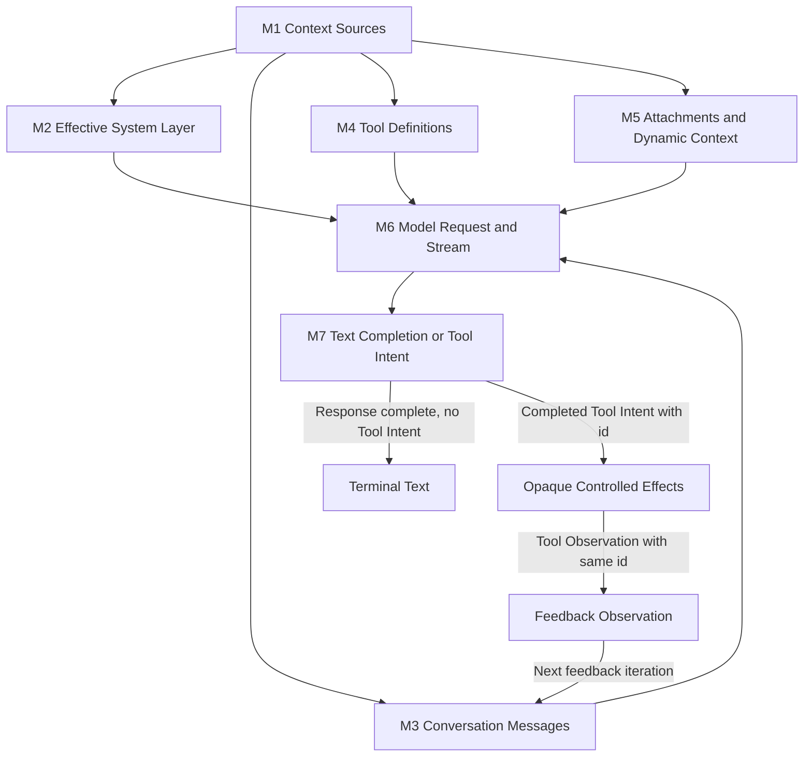

# 01：Model Turn——模型怎样看见、决策并获得反馈

[← 上一篇：一次完整的 Agent Turn](../00-one-agent-turn.md) · [下一篇：Context Assembly](01-context-assembly.md)

> 从模型视图组装开始，到最终文本或下一轮工具反馈为止，一次 Model Turn 究竟怎样闭合？

**[Architectural interpretation]** Model Turn 不是“一段 prompt 对应一次回答”，而是 runtime 先投影出模型此刻可见的世界，再消费一次模型 response；若模型只给出最终文本，本轮结束，若模型给出结构化 Tool Intent，runtime 就穿过不透明的机器效果边界取得同 ID 的 Tool Observation，把它放回下一次模型视图，并在同一个 agent turn 内继续决策。

## 1. 它在 A1–A8 的什么位置

本章放大 [00 的权威 A1–A8 全景图](../00-one-agent-turn.md#1-权威全景图a1a8)，不再画第二张全轨道图：M1–M5 展开 A2 Model View Assembly，M6 对应 A3 Model Request and Stream，M7 覆盖 A4 Runtime Decision 与 A5 Tool Intent；A7 返回的 Tool Observation 则成为下一次 M3 Conversation Messages 的候选事实。

[A6 Controlled Machine Effect](../02-controlled-effects/README.md) 在这里始终是不透明边界。本章只规定它接收什么 Tool Intent、返回什么 Tool Observation；工具查找、授权、执行环境和文件安全不属于 Model Turn。

## 2. M1–M7：先看完整因果链

| ID | 节点定义 | 它改变了什么 |
| --- | --- | --- |
| **M1 Context Sources** | 收集当前任务、已有协议历史、指令候选、Tools、cwd/project facts 与条件性动态信息。 | 得到 runtime 可以选择的候选来源；它们尚未全部对模型可见。 |
| **M2 Effective System Layer** | 按当前入口的规则选定实际生效的 system instructions。 | 多组候选指令变成一组有明确 precedence 的 system layer。 |
| **M3 Conversation Messages** | 选择并规范化当前 user、assistant Tool Intent 与 Tool Observation 历史。 | durable/runtime facts 被投影成当前请求可用的协议 Messages。 |
| **M4 Tool Definitions** | 把当前 runtime Tools 投影成模型可见的名称、说明与输入 schema。 | 模型获得提出结构化 Tool Intent 的语言，而不是执行能力。 |
| **M5 Attachments and Dynamic Context** | 注入当前阶段适用的文件、图片、memory、MCP delta 或 queued observations。 | 只在相关时刻需要的事实进入当前视图。 |
| **M6 Model Request and Stream** | 将 system、messages、tools 与 request options 发到模型边界，并持续消费 response stream。 | 一次静态 Model View 变成逐步到达的 assistant 输出；partial delta 还不是闭合协议事实。 |
| **M7 Text Completion or Tool Intent** | 从完成的 content blocks 中识别 Tool Intent；若整个 response 完成后仍没有 intent，才确认 text-only。 | 决定终止为最终文本，或把完整的 `id + name + input` 交给不透明的 Controlled Effects。 |

图中的 feedback 回边是整个机制的核心：Tool Observation 不会直接“进入模型内存”，而是先成为 M3 的候选协议历史，再与下一轮适用的 M2、M4、M5 投影一起汇合到新的 M6 request。

## 3. 贯穿案例：定位并修复一个失败测试

仍然使用同一个任务：`locate and fix a failing test`。下面的 Grep、Read、Edit、Bash（运行 targeted test）不是四个独立 turn，而是同一个 agent turn 内可能连续发生的 model-request / feedback iterations。

### 3.1 第一次 Model View

M1 收集用户任务、适用指令、当前工具与必要的项目事实；M2–M5 把它们投影成一份明确的 Model View：

| request 部分 | 第一次决策前的内容 |
| --- | --- |
| system | 生效的 Claude Code 与项目指令 |
| messages | user task：`locate and fix a failing test` |
| tools | Grep、Read、Edit、Bash 等模型可见 schemas |
| attachments | 仅当前阶段适用的文件、图片、memory 或 queued facts |

permission callback、abort signal、pending queue 与完整 transcript 不会因为参与 runtime 控制就自动出现在这份视图里。

### 3.2 Request、stream 与完整 Tool Intent

M6 发出请求并消费 stream。文字或 Tool JSON 的 partial delta 可以用于低延迟展示和累积，但不能单独成为下一轮协议历史。假设一个完整 content block 最终形成：

| 字段 | 值 |
| --- | --- |
| type | `tool_use` |
| id | `grep-1` |
| name | `Grep` |
| input | 搜索失败测试线索 |

M7 此时已经拥有一条正向事实：完整 Tool Intent `grep-1` 存在，因此可以把它交给 Controlled Effects；即使同一 response 仍在 streaming，也不能因为同时出现了文字就提前宣布 terminal text。反过来，“没有 Tool Intent”只有在整个 response 完成后才成立。

### 3.3 穿过不透明的 Controlled Effects 边界

Model Turn 只看见这段 contract：输入是 `Tool Intent(id=grep-1, name=Grep, input=...)`，输出是成功、失败、拒绝或中断之一的 `Tool Observation`。机器效果怎样实现不在本章展开。

假设返回的 observation 表明找到了候选测试，runtime 将它规范化为 `tool_result(tool_use_id=grep-1)`。这里的 ID 不是日志装饰，而是“哪项意图得到哪条机器事实”的因果关联。

### 3.4 同 ID Observation 进入下一次 feedback iteration

下一次 M3 至少保留以下顺序：

1. 原 user task；
2. assistant 的 `tool_use(id=grep-1)`；
3. user-side 的 `tool_result(tool_use_id=grep-1)`。

这组已闭合历史与当时适用的 Tools、attachments 再次汇合到 M6。模型据此可能依次提出 `Read`、`Edit`、`Bash`（运行 targeted test），每一项都用自己的 ID 重复“Intent → opaque effect → same-ID Observation → feedback”闭环。若测试仍失败，失败 observation 进入下一次 iteration；若模型最终只生成文本，则 runtime 必须等整个 response 完成并确认没有任何 Tool Intent，才从 M7 走向 Terminal Text。

## 4. 三个所有权与可见性平面

“上下文”不能把三类状态混在一起：

| 平面 | 典型内容 | 模型可见性 | 生命周期与 owner |
| --- | --- | --- | --- |
| **model-visible request projection** | 当次 `system + messages + tool schemas`；model/thinking 等 call options 影响调用，但不是普通协议消息 | 前三类作为协议输入可见；call options 只影响生成行为 | 一次 model request；由 runtime 组装，模型服务消费 |
| **runtime-only loop/control state** | accumulator、pending intents、abort signal、ordering、continuation reason | 不直接可见；必须先显式投影成消息或结果 | 一个 query 或 iteration；由 runtime 控制 |
| **durable facts** | 可持久化的 user/assistant/tool facts 与恢复所需记录 | 不自动可见；未来可以被选择、压缩或修复后重新投影 | 跨 turn；由 Session Continuity 的 durable owner 管理 |

因此，当前 Model View 不等于 runtime 全部状态，也不等于 Durable Transcript。某条事实被记录下来，只表示未来可能重新选入请求；不表示模型当前已经看见它。

## 5. 一个 pairing 不变量与两只时钟

### 5.1 Tool Intent / Observation pairing

只要 assistant 的 `tool_use(id=X)` 已被当前 attempt 采用，runtime 就必须让它得到可关联的 `tool_result(tool_use_id=X)`；结局可以是成功、失败、拒绝或中断。若整个 attempt 被明确舍弃，则 intent 与其结果必须一起隔离，不能把半边泄漏进下一份 Model View。

这个不变量保证下一次请求能回答两个问题：模型此前提出了哪项操作，以及机器世界对此返回了什么事实。没有同 ID pairing，就不能安全地把 feedback batch 当作合法历史继续。

### 5.2 Agent turn 与 model request 不是一只钟

| 时钟 | 起点与终点 | 在失败测试案例中的数量 |
| --- | --- | --- |
| **agent-turn / query-entry clock** | 一次用户任务进入 query，到最终文本或显式终止 | 通常只有一个 |
| **model-request / feedback-iteration clock** | 一份 Model View 发出，到 text-only 或当前 intent/observation batch 闭合 | 可以有多次：Grep、Read、Edit、Bash（运行 targeted test）反馈后都可能再请求模型 |

所以“一个 agent turn 调一次模型”是错误心智模型。M2 的 effective system 可以在 query entry 选定后复用，但 M3 Messages、M4 Tools 与 M5 动态观察会在明确的 iteration 边界上随新事实重新投影。

## 6. Canonical 行为与本章边界

可以把标准路径压缩成五句：

1. runtime 从候选来源构造显式 Model View，而不是把全部运行状态塞给模型；
2. model boundary 消费这份视图并流回 assistant content，partial delta 先累积；
3. 完整 Tool Intent 可以被正向识别，text-only 则要等整个 response 完成才成立；
4. Intent 穿过不透明的 Controlled Effects，Observation 以同 ID 写回下一次候选 Messages；
5. 闭合 feedback 触发下一次 iteration，最终无 intent 的完整 response 才结束这次 agent turn。

Concept ownership 到这里保持清楚：

- 本 README 拥有完整 Model Turn 故事与阅读路由；
- Context Assembly 拥有 Model View 的组成、precedence 与 projection；
- Query Loop / Streaming 拥有 completed-block detection、pairing contract、continuation 与 termination；
- [Controlled Effects](../02-controlled-effects/README.md) 拥有 Tool 解析、调度、授权和机器效果，但在本章保持不透明；
- Session Continuity 拥有 durable persistence、recovery 与 compaction；
- Subagent Delegation 拥有 child lifecycle 与 delegation internals。

本部分 M1–M7 / Q1–Q8 的 claim-oriented 证据表见 [Source Evidence Index](../appendices/source-evidence-index.md#2-model-turnm1m7--q1q8)。

## 7. 面试时的压缩回答

> Claude Code 的 Model Turn 是一个可重复的 request/feedback loop。runtime 先把 system、selected messages、tool schemas 和动态 attachments 投影成当次 Model View，再调用模型并消费 stream。完整 Tool Intent 一形成就能进入受控效果边界，但 text-only 必须等整个 response 完成且没有 intent 才成立。每个已采用的 Tool Intent 都要由同 ID Tool Observation 闭合，闭合结果再进入下一份 Model View；因此一次用户任务对应的 agent turn 可以包含多次模型请求。runtime-only 控制状态和 Durable Transcript 都不等于模型当前可见窗口。

## 8. 继续阅读

两篇详情是对同一条 M1–M7 主链的连续放大：

1. [Context Assembly：模型在一次决策前看见什么](01-context-assembly.md)——放大 M1–M5 以及 M6 的 request 输入，解释 Model View 的 composition 与 projection。
2. [Query Loop 与 Streaming：一次模型输出怎样变成下一步](02-query-loop-and-streaming.md)——从 M6 继续到 M7，解释 completed blocks、Tool Intent / Observation pairing、feedback continuation 与 terminal text。

读完第二篇后，下一问是：已经得到的 Tool Intent 如何被解析、调度、授权并转化为机器效果？继续阅读 [02：Controlled Effects 总览](../02-controlled-effects/README.md)。它会放大 A5–A7；本章的 Q6 仍保持 opaque，不在 Model Turn 内复制 effect 细节。

[← 上一篇：一次完整的 Agent Turn](../00-one-agent-turn.md) · [下一篇：Context Assembly](01-context-assembly.md)
