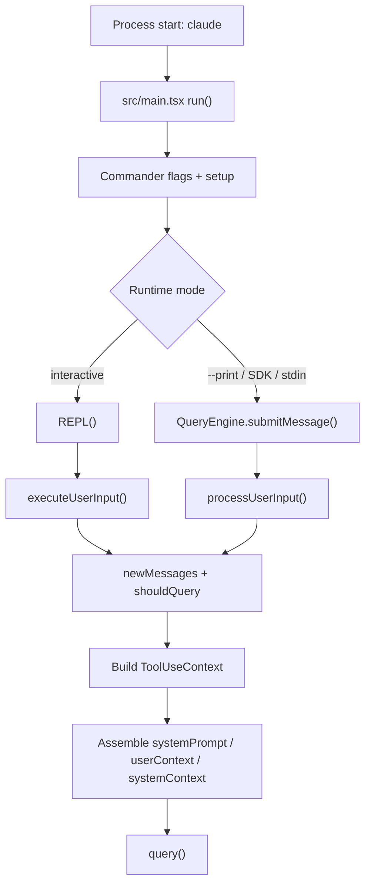

# 01 - Runtime Entry

## 面试式回答

Claude Code 的 runtime entry 可以分成两层：第一层是 CLI command setup，负责把 `claude` 进程的参数、配置、权限模式、MCP、模型、system prompt 选项解析成运行时配置；第二层才是 runtime execution，负责把交互式输入、`--print` 非交互输入、SDK/stdin 输入转换成 messages，并调用统一的 query loop。

源码上，顶层入口在 `src/main.tsx` 的 `run()`：它创建 Commander command、注册 flags，并在 action handler 中决定进入交互式 REPL 还是 print/SDK 路径。stdin 的特殊处理在 `src/main.tsx` 的 `getInputPrompt()`：非 TTY 且不是 MCP 子命令时，文本输入会被拼到 prompt 后面，`stream-json` 输入则保留为 stdin stream。交互式路径进入 `src/screens/REPL.tsx` 的 `REPL()`，由 `src/utils/handlePromptSubmit.ts` 的 `executeUserInput()` 把输入加工成 messages，再进入 `REPL()` 内部的 `onQueryImpl()` 调 `query()`。非交互/SDK 路径进入 `src/QueryEngine.ts` 的 `QueryEngine.submitMessage()`，同样在加工 prompt 后调用 `query()`。

所以面试里可以这样说：CLI 入口不直接“问模型”，它先把用户意图和运行模式规整成 runtime 所需的 prompt、messages、tools、system prompt 和 `ToolUseContext`；真正的 agent 行为从 `query()` 开始。

## 这一章解决什么问题

本章回答“用户敲下 `claude` 或通过 SDK/stdin 提交 prompt 后，什么时候才进入 agent loop”。它不展开 UI 如何渲染，也不展开 slash command catalog 的每个命令细节；这些属于后续 UI 和命令章节。

本章关注四个边界：

- 进程启动与 Commander 参数解析的边界。
- interactive REPL、print/non-interactive、SDK、stdin 输入如何统一成 prompt/messages。
- `systemPrompt`、`toolUseContext`、model/thinking/fallback 等模型选项在哪里进入 runtime。
- message creation 到 `query()` 调用之间的最短主路径。

## 心智模型

可以把 runtime entry 想成“入口适配层”，而不是 agent 本身：

- CLI setup 负责检查 flag 组合、读配置、初始化 settings/MCP/hooks、确认权限模式。
- 输入处理负责把命令行 prompt、stdin、交互输入、queued command、SDK payload 转成统一的 message 形态。
- runtime context 负责携带 `ToolUseContext`：工具列表、模型、权限、AbortController、app state、文件读取缓存等运行时状态。
- `query()` 才负责模型请求、流式响应、工具执行、下一轮 follow-up。

这个分层让 CLI 可以有很多入口形态，但 agent loop 不需要关心用户到底来自 TTY、管道、SDK 还是 REPL。

## 实现逻辑

主路径可以按“输入来源 -> CLI/REPL 处理 -> message creation -> query loop invocation”理解。

1. `src/main.tsx` 的 `run()` 创建 Commander program，并注册 `--print`、`--input-format`、`--output-format`、`--system-prompt`、`--append-system-prompt`、`--model`、`--agent`、`--mcp-config`、`--max-turns` 等选项。这里是 command setup：它负责解释用户的运行意图，但还没有进入模型循环。

2. `src/main.tsx` 的 action handler 处理模式差异。`--system-prompt-file` 与 `--system-prompt` 互斥，`--append-system-prompt-file` 与 `--append-system-prompt` 互斥；SDK URL 会自动倾向 `stream-json` 输入输出并开启 print 模式；`--bare` 会设置简化环境。模型、权限、MCP、agent、session/resume 等也在这里变成后续 runtime 配置。

3. stdin 由 `getInputPrompt()` 归一化：普通 text 管道会读取 stdin，和命令行 prompt 用换行拼接；`stream-json` 则把 `process.stdin` 作为 async iterable 保留下去。这意味着 stdin 不是单独的 agent 模式，而是非交互输入的一种来源。

4. 交互式模式渲染 `src/screens/REPL.tsx` 的 `REPL()`。用户输入先进入 `src/utils/handlePromptSubmit.ts` 的 `executeUserInput()`，它创建新的 AbortController，调用 `processUserInput()` 解析 prompt、slash command、附件、IDE selection、pasted content，并产出 `newMessages`、`shouldQuery`、临时 allowed tools、model override 和 effort override。

5. `executeUserInput()` 调 `onQuery()`；`REPL()` 内部的 `onQuery()` 把 `newMessages` 写入当前会话状态，再进入 `onQueryImpl()`。`onQueryImpl()` 构造本轮 `ToolUseContext`，读取 fresh tools/MCP clients，调用 `getSystemPrompt()` 和 `buildEffectiveSystemPrompt()` 得到实际 system prompt，最后 `for await` 消费 `query({ messages, systemPrompt, userContext, systemContext, canUseTool, toolUseContext, querySource })`。

6. print/SDK 路径由 `src/QueryEngine.ts` 的 `QueryEngine.submitMessage()` 承接。它设置 cwd，构建 headless 版本的 `ProcessUserInputContext`/`ToolUseContext`，调用 `fetchSystemPromptParts()` 获取默认 prompt、user context 和 system context，再调用 `processUserInput()` 产出 messages。若 `shouldQuery` 为 true，它同样 `for await` 消费 `query()`；若只是本地命令输出，则直接返回结果，不进入模型。

7. `systemPrompt` 不是在 CLI 一开始就固定死。REPL 会在每 turn 的 `onQueryImpl()` 中基于 fresh tools/MCP clients 和当前 agent definition 重新组装；SDK/print 会在 `submitMessage()` 中按 headless 配置组装。`toolUseContext` 则是每 turn 的 runtime 状态包，`query()` 后续用它访问 tools、permissions、AbortController、app state、file cache、MCP、agent definitions、thinking config 等。

## 源码入口

- `src/main.tsx` / `run()`：Commander setup 和默认 action handler，是 CLI 参数进入 runtime 的主入口。
- `src/main.tsx` / `getInputPrompt()`：stdin 与 prompt 的合流点，区分 text 和 `stream-json`。
- `src/screens/REPL.tsx` / `REPL()`：交互式 runtime 容器，持有 messages、loading、AbortController、工具 UI 状态，并创建 `ToolUseContext`。
- `src/screens/REPL.tsx` / `onQuery()`、`onQueryImpl()`：交互式输入进入 `query()` 的直接调用点。
- `src/utils/handlePromptSubmit.ts` / `executeUserInput()`：把 queued commands 或 prompt 输入加工成 `newMessages`，再触发 `onQuery()`。
- `src/QueryEngine.ts` / `QueryEngine.submitMessage()`：print/SDK/headless 模式的消息提交与 `query()` 调用入口。
- `src/utils/queryContext.ts` / `fetchSystemPromptParts()`：headless/SDK 路径获取 system prompt、user context、system context 的共享 helper。
- `src/Tool.ts` / `ToolUseContext`：runtime 传入 query loop 和工具执行层的核心上下文类型。

## 关键数据结构与状态

- `ToolUseContext`：定义在 `src/Tool.ts`。它包含 `options.tools`、`options.mainLoopModel`、`options.thinkingConfig`、`options.mcpClients`、`options.customSystemPrompt`、`options.appendSystemPrompt`、`abortController`、`readFileState`、`getAppState`、`setAppState`、`messages`、`agentId`、`requestPrompt`、`setInProgressToolUseIDs` 等。它是 query loop 和 tool runner 的运行时背包。
- `Message[]`：runtime 的统一对话历史。用户 prompt、附件、本地命令输出、assistant 流式块、tool result、compact boundary 最终都围绕 messages 追加或裁剪。
- `ProcessUserInputContext`：输入处理阶段使用的上下文，连接 commands、tools、MCP、权限、文件缓存和 app state。
- `systemPrompt` / `userContext` / `systemContext`：模型请求的 cache-key 前缀和系统上下文来源。REPL 每 turn 组装，SDK/print 在 `submitMessage()` 中组装。
- `AbortController`：每次用户输入创建新的 controller，贯穿 model streaming 和 tool execution，用于 Ctrl+C、后台化、submit interrupt 等中断。
- `querySource`：标记入口来源，例如 REPL main thread 或 SDK，用于日志、策略和队列 drain 判断。

## 正常路径

交互式正常路径：

1. 用户在 REPL 输入 prompt。
2. `executeUserInput()` 解析输入，生成 `newMessages`。
3. `REPL.onQuery()` 把 `newMessages` 追加进会话状态，并进入 `onQueryImpl()`。
4. `onQueryImpl()` 构造 `ToolUseContext`，加载 `getSystemPrompt()`、`getUserContext()`、`getSystemContext()`，再通过 `buildEffectiveSystemPrompt()` 得到本轮 system prompt。
5. `onQueryImpl()` 调用 `query()` 并逐条处理 stream event，更新 messages/UI。

非交互/SDK 正常路径：

1. `main.tsx` 根据 `--print`、SDK URL、stdin 格式决定进入 headless path。
2. `getInputPrompt()` 合并命令行 prompt 和 stdin，或保留 `stream-json` 输入流。
3. `QueryEngine.submitMessage()` 调 `processUserInput()` 生成 messages。
4. `QueryEngine.submitMessage()` 构造 system prompt 和 `ToolUseContext`。
5. `QueryEngine.submitMessage()` 调 `query()`，把 query 产出的 assistant/user/progress/attachment 等事件转换成 SDK 输出。

## 失败、边界与中断

- flag 互斥会在 `main.tsx` action handler 直接失败，例如同时传 `--system-prompt` 和 `--system-prompt-file`。
- stdin text 模式会等待最多约 3 秒探测数据；如果没有数据，会警告并只使用 prompt，避免继承管道导致无限等待。
- `shouldQuery=false` 的输入不会进入模型，例如某些本地 slash command 只产生本地输出。
- 并发输入由 REPL 的 query guard 保护；已有 query 运行时，新用户输入会被排队，避免两个 query 同时写同一段会话状态。
- Ctrl+C、后台化、远端取消等通过 AbortController 传播。entry 层只发出中断信号，具体如何补齐 tool_result 或生成中断消息由 `query()` 和工具执行层处理。
- SDK/print 的 session persistence 会在进入 query loop 前先记录用户消息，避免进程在模型响应前被杀导致无法 resume。

## Mermaid 图

## 设计取舍

- CLI setup 和 agent loop 分离：Commander 可以不断增加 flag、subcommand、SDK 适配，而 `query()` 仍接收稳定的 messages/context/tools。
- REPL 每 turn 重建 prompt/context：代价是多一次上下文加载，收益是 MCP tools、agent definition、权限模式、cwd/env 等动态变化能及时进入下一次请求。
- SDK/print 使用 `QueryEngine`：它避免依赖 Ink UI 状态，但复用 `processUserInput()` 和 `query()`，使 headless 与 interactive 的 agent 行为尽量一致。
- stdin 被当作 prompt 来源而不是新架构：降低模式数量，但要求 `getInputPrompt()` 清楚地区分 text 与 `stream-json`。
- `ToolUseContext` 偏大：它把 runtime-only state 和 tool/query 所需能力集中传递，降低参数穿透成本；代价是阅读时必须分清哪些字段会进模型，哪些只在 runtime 使用。

## 面试追问

1. 为什么 CLI action handler 不直接调用模型？
   因为它还要先解析模式、权限、MCP、system prompt、模型、stdin/SDK 等入口差异。统一成 messages 和 `ToolUseContext` 后再进入 `query()`，可以让 agent loop 复用。

2. interactive 和 SDK 最大的共同点是什么？
   都会调用 `processUserInput()` 把输入转成 messages，并最终调用 `query()`；差异主要在 UI 状态、输出格式、session persistence 和 prompt/context 组装位置。

3. `ToolUseContext` 为什么不等于 model context？
   `ToolUseContext` 包含 AbortController、setState、permission callbacks、UI handlers、file cache 等 runtime-only 能力；只有 system prompt、messages、tools schema、部分 user/system context 会进入模型请求。

4. stdin 在哪里变成 prompt？
   `src/main.tsx` 的 `getInputPrompt()`。text 模式会读取 stdin 并拼接 prompt，`stream-json` 模式返回 stdin stream。

## 一句话总结

Runtime entry 的核心职责不是生成回答，而是把多种入口形态规整成 messages、system prompt、tools 和 `ToolUseContext`，再把控制权交给统一的 `query()` agent loop。
