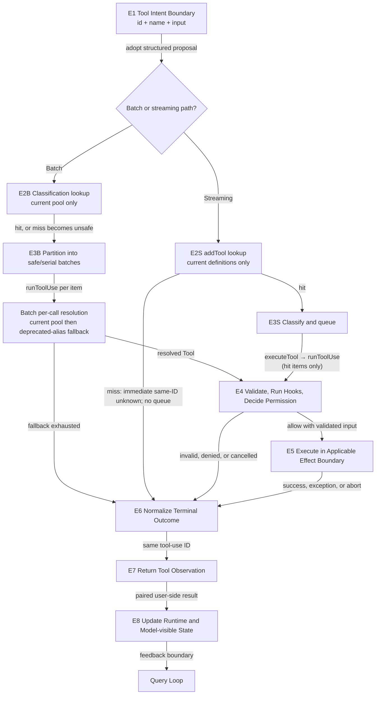
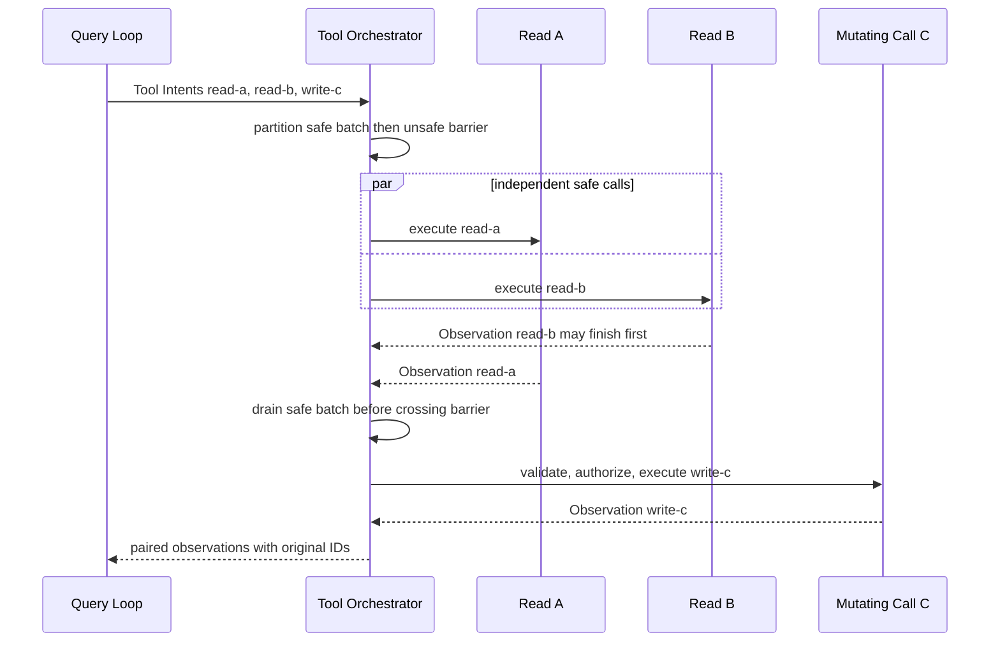

# 01：Tool Contract 与 Orchestration——意图怎样成为可配对的机器观察

[← 上一篇：Controlled Effects 总览](README.md) · [下一篇：Permission Decision](02-permission-decision.md)

> 模型只产生了结构化 Tool Intent；Claude Code 如何把它可靠地变成机器效果，并把结果送回模型？

**[Architectural interpretation]** Tool 系统不是一组可以直接调用的函数，而是一层协议适配与执行控制：它解析意图、选择 Tool、维护顺序、执行每次调用的检查，并把所有终态归一化成可配对的 Tool Observation。

## 1. 先把 Controlled Effects 放回 A5–A7

[总览](README.md) 已经从 Query Loop 接住完整 Tool Intent，并画出 E1–E8。本章先放大 [A5 Tool Intent、A6 Controlled Machine Effect 与 A7 Tool Observation and State Update](../00-one-agent-turn.md#1-权威全景图a1a8) 的共同 Tool contract，只回答一条局部主线：

```text
Tool Intent { id, name, input }
  -> runtime Tool contract
  -> validated and authorized effect attempt
  -> Tool Observation { tool_use_id, content, is_error? }
```

这里最重要的边界是：`tool_use` 只是模型提出的协议数据。它既不是 JavaScript 函数引用，也没有权限绕过 runtime 直接读取文件、修改文件或启动进程。只有 E1→E5 的前置条件全部成立，机器效果才可能发生；无论是否发生，E6→E8 都要给该 intent 一个可关联终态。



图里故意压扁了五类后续 owner：Permission 决定是否授权；Bash analysis 判断命令语义；Sandbox 限制已经获准的进程；File Editing Safety 约束直接文件修改；AgentTool 的 child lifecycle 属于 Subagent Delegation。它们会改变 E4 或 E5 内部结果，却不改变本章的共同入口和共同出口。

### 1.1 E1–E8 各自改变什么

| 节点 | 输入 | 决定或状态变化 | 输出 |
| --- | --- | --- | --- |
| E1 Tool Intent Boundary | 已完成的 `tool_use { id, name, input }` 与所属 assistant message | runtime 采用一条结构化提议；尚未执行任何 Tool | 保留原 ID 的 intent candidate |
| E2 Path-local Lookup and Prepare Input | intent name、raw input、current Tool definitions | Batch classification 只查 current pool；miss 先记为 unsafe，稍后 `runToolUse` 才做 current lookup → bounded deprecated-alias fallback。Streaming `addTool` 只查 current `toolDefinitions`；miss 立即产生 same-ID unknown result 并 return | Batch classification state / resolved per-call Tool；或 streaming immediate unknown Observation |
| E3 Choose Execution Order | E2 的 branch-local lookup 结果、local `inputSchema` 与 concurrency classification | Batch 对 current miss 保守形成 serial batch，仍会进入 `runToolUse`；streaming 只对 E2S hit 项 parse/classify、入队并维护 barrier | Batch safe/serial plan，或 streaming queued/running hit item |
| E4 Validate, Run Hooks, Decide Permission | resolved Tool、input、`ToolUseContext`、abort signal | common wrapper 用 local `inputSchema` validation，再做 Tool-specific validation、PreToolUse hooks 与 permission decision；输入可能被合法替换 | authorized call input，或 validation/denial/cancel outcome |
| E5 Execute in Applicable Effect Boundary | authorized input、runtime context、progress callback | 调用 `Tool.call`；Tool-specific effect、Bash/Sandbox/file/child internals在各自 owner 中展开 | raw `ToolResult`、progress、exception 或 abort |
| E6 Normalize Terminal Outcome | success data、unknown/invalid/denied/cancelled/error outcome 与原 ID | success 走 Tool-specific result mapper；其他终态构造 error/cancel result | `tool_result(tool_use_id=id, ...)` |
| E7 Return Tool Observation | normalized result、可能的 context modifier | 按安全边界 yield ready results，并在结束/中断时 drain 未闭合 batch | 可关联的 user-side Tool Observation |
| E8 Update Runtime and Model-visible State | observations 与 runtime-only context updates | 本地应用 context modifier；把协议 result 交还 Query Loop | 合法 feedback state candidate |

**[Source-confirmed]** 快照 `712b24f22a63eb6d1a2f86697bf6dbbaa39ae3cf` 中，`src/services/tools/toolOrchestration.ts` / `partitionToolCalls` 只用 current `options.tools` 做 batch classification，miss 因 optional parse 失败而归为 unsafe，之后 serial runner 仍调用 `runToolUse`；`src/services/tools/toolExecution.ts` / `runToolUse` 才在 batch per-call 阶段做 current lookup → 一次 `getAllBaseTools()` lookup → 只接受 declared alias。相反，`src/services/tools/StreamingToolExecutor.ts` / `addTool` 对 current `toolDefinitions` miss 直接存入带原 `block.id` 的 completed unknown result 并 return，因而不会入 queued state，也不会到 `executeTool` / `runToolUse`。

## 2. 一个 Tool contract，有两种投影

“模型知道 Tool”与“runtime 能执行 Tool”不是同一件事。Claude Code 从一个 runtime Tool 产生两种不同投影。

### 2.1 Model-visible projection：告诉模型可以提什么

模型请求里只需要协议能力：

```yaml
model_visible_tool:
  name: Read
  description: Read a file from the local filesystem
  input_schema:
    type: object
    properties:
      file_path: { type: string }
      offset: { type: number }
      limit: { type: number }
```

它帮助模型生成 `name + input`，却不会暴露 `Tool.call`、文件句柄、permission callback、abort controller 或应用状态。

**[Source-confirmed]** 快照 `712b24f22a63eb6d1a2f86697bf6dbbaa39ae3cf` 的 `src/utils/api.ts` / `toolToAPISchema` 从 runtime `Tool` 读取 `name` 与 `prompt(...)`；输入投影优先采用 optional `inputJSONSchema`，没有 override 时才把 Zod `inputSchema` 转成 JSON Schema，最终构造 API 的 `name + description + input_schema`。这个函数没有把 `inputJSONSchema` 接进 common execution wrapper 的 local validation。

### 2.2 Runtime projection：决定是否、何时、怎样执行

runtime Tool 还携带模型看不到的行为合同：input validation、`ToolUseContext`、permission check、concurrency classification、`call`、progress、result mapping、context mutation 与 cancellation。

| contract field / capability | 模型可见？ | runtime 消费？ | 为什么存在 | 违反后的结果 |
| --- | --- | --- | --- | --- |
| `name` | 是 | 是 | 连接 model schema 与 branch-local runtime lookup | Batch 在 `runToolUse` 的 current lookup 与 deprecated-alias fallback 都失败后闭合；streaming 在 `addTool` current miss 当场以 same-ID unknown 闭合 |
| `prompt()` / description | 是，序列化后 | 是，生成 schema 时 | 告诉模型能力与输入语义 | 模型更容易生成错误调用；不会因此获得执行权 |
| `inputSchema` | 间接：没有 override 时转成 API JSON Schema | 是：classification、common wrapper `safeParse` 与本地 typed contract | 定义 runtime 实际接收的本地输入类型；也可成为默认模型投影来源 | 不满足它的 input 在 local effect 前变成 error Observation |
| optional `inputJSONSchema` | 是：存在时覆盖 API `input_schema` | 在本文主线中由 API projection/cache 消费；common wrapper 不用它做 local validation | 让动态或外部 Tool 直接声明模型/API 所见的 JSON Schema | 若与 `inputSchema` 强度不同，模型承诺与本地 gate 会分离，错误可能后移 |
| `isConcurrencySafe(input)` | 否 | 是 | 判断独立调用能否重叠 | 解析失败或分类异常时保守进入 serial barrier |
| `validateInput(input, context)` | 否 | 是 | 执行 Tool-specific value/safety precondition | validation error；`Tool.call` 不运行 |
| `checkPermissions(input, context)` | 否 | 是 | 提供 Tool-specific permission evidence | allow/ask/deny/passthrough，交给 Permission pipeline |
| `call(input, context, canUseTool, parent, progress)` | 否 | 是 | 唯一共同机器效果入口 | success、exception 或 abort |
| `mapToolResultToToolResultBlockParam(data, id)` | 否 | 是 | 把不同 Tool 输出变成共同协议 result | mapping/result error 显式闭合，不能留下 orphan intent |
| `ToolUseContext` | 否 | 是 | 提供 abort、app state、Tool pool、file state、progress 与 local updates | runtime state 不能被伪装成模型输入 |

**[Source-confirmed]** 快照 `712b24f22a63eb6d1a2f86697bf6dbbaa39ae3cf` 的 `src/Tool.ts` / `Tool` 与 `ToolUseContext` 把必需的 `inputSchema`、optional `inputJSONSchema`、`call`、`isConcurrencySafe`、optional `validateInput`、`checkPermissions`、progress、result mapping 和 abort/app/file state 放在 runtime object。`inputSchema` 提供本地 typed contract；`inputJSONSchema` 的源码注释把它定义为可直接指定 JSON Schema 的 optional 字段，而不是第二个 local parser。

因此这两个 schema 字段不能合并成一格“同一种 schema”。对通常的 built-in Tool，模型 schema 由 `inputSchema` 转换而来，model projection 与 local validation 共享来源；一旦 Tool 提供 `inputJSONSchema` override，模型所见 schema 与 common wrapper 实际解析的 `inputSchema` 就是两项独立事实。

因此同一个 Tool 有两个事实：模型看见“可以提出一个 Read intent”，runtime 则拥有“如何验证、授权、执行并规范化 Read”的实际对象。Tool Intent 只能携带前者允许的协议字段，不能注入后者的函数实现。

## 3. 一次 Read Tool Intent 怎样走完 E1–E8

用最短但完整的 built-in 路径建立直觉。假设模型已经完成以下 block：

```yaml
AssistantMessage:
  role: assistant
  content:
    - type: tool_use
      id: read-1
      name: Read
      input:
        file_path: src/query.ts
        offset: 1
        limit: 80

RuntimeOnly:
  tools: [Read, Grep, Edit, Bash, ...]
  abort_signal: active
  in_progress_tool_use_ids: []
```

此时已经发生的是协议事实：模型提出了 `read-1`。尚未发生的是文件读取。

### 3.1 E1→E2：Read 都命中 current pool，但 lookup timing 不同

对这个正常 `Read`，两条路径最后都得到 current pool 中已注册的 `FileReadTool`，而不是一段要 `eval` 的源码；但不能据此把 lookup 写成一套共同顺序：

- Batch 先由 `partitionToolCalls` 在 current `options.tools` 中查一次，用于 classification；稍后 batch runner 才把 intent 交给 `runToolUse` 做 per-call resolution。
- Streaming 先由 `addTool` 在 current `toolDefinitions` 中查。`Read` 命中后才能 parse/classify、进入 queue；被调度的 hit item 才由 `executeTool` 交给 `runToolUse`。

```text
before path-local E2
  intent = { id: read-1, name: Read, input: {...} }
  runtimeTool = none

after Batch classification lookup
  classificationTool = FileReadTool from current options.tools
  runToolUse_resolution = pending

after Streaming addTool lookup
  admissionTool = FileReadTool from current toolDefinitions
  queue_status = eligible for classification
```

deprecated alias 的兼容只属于 Batch 能到达的 `runToolUse` resolution。若 Batch classification current miss，该项先保守成为 unsafe/serial；运行到它时，`runToolUse` 才对 `getAllBaseTools()` 做一次 bounded lookup，并且只有查询名确实出现在 candidate 的 `aliases` 中才采用。这让旧 transcript 中的 deprecated name 可以在 Batch path 落到已重命名 Tool，同时不会用 base Tool 主名称重新启用一个不在 current pool 的能力。

Streaming 没有这个 compatibility branch：`addTool` current miss 会立即记录 completed `tool_result(tool_use_id=read-1, is_error=true)` 并 return，不入队，也不调用 `executeTool` / `runToolUse`。因此同一个 deprecated name 可能在 Batch 被 fallback 接住，却在 Streaming admission 当场成为 unknown。

若模型写成不存在的 `ReadEverything`，两条路径最终都给同 ID unknown，但失败时点不同：Batch 先 serial classification，再由 `runToolUse` 在 fallback exhausted 后返回；Streaming 则在 `addTool` current miss 时直接返回。

**[Source-confirmed]** 快照 `712b24f22a63eb6d1a2f86697bf6dbbaa39ae3cf` 的 `src/Tool.ts` / `findToolByName` 在传入列表内匹配主名称或 aliases；`src/services/tools/toolExecution.ts` / `runToolUse` 实现 current lookup 与 declared-alias-only base fallback。`src/services/tools/StreamingToolExecutor.ts` / `addTool` 只把 current `toolDefinitions` 传给 `findToolByName`，miss branch 直接 push `status: 'completed'`、same-ID unknown result 并 return；只有下方 hit branch 才 push `status: 'queued'` 并调用 `processQueue`。

### 3.2 E2→E3：先分类顺序，不等于已经通过 validation

`Read` 命中 current definitions，local `inputSchema` 能解析，且 `FileReadTool.isConcurrencySafe()` 返回 true：Batch 把它放进 consecutive safe batch；Streaming 把它作为 safe queued item。这里的 classification 只回答“是否允许与独立调用重叠”，不替代 E4 的完整 local validation 与 permission。

```text
after E3
  queue_item:
    id: read-1
    concurrency_safe: true
    status: queued or eligible
  effect: not started
```

如果 current Tool 已命中、但 `inputSchema` parsing 在 classification 时失败，两条路径都保守标为 unsafe；稍后 E4 才生成正式 validation error。Tool lookup miss 则不同：Batch 的 optional parse 同样落为 unsafe，仍继续到 serial `runToolUse`；Streaming 已在 E2S 返回 unknown，根本不会进入 classification queue。

**[Source-confirmed]** 快照 `712b24f22a63eb6d1a2f86697bf6dbbaa39ae3cf` 的 `src/tools/FileReadTool/FileReadTool.ts` / `FileReadTool` 声明 `isConcurrencySafe() = true`；`src/services/tools/toolOrchestration.ts` / `partitionToolCalls` 对 current lookup 的 optional `tool?.inputSchema.safeParse` 失败统一归为 serial。`src/services/tools/StreamingToolExecutor.ts` / `addTool` 则在 current lookup miss branch 之前就 return；仅 hit branch 才执行 `toolDefinition.inputSchema.safeParse`、计算 safety、push queued item 并 `processQueue()`。

### 3.3 E3→E4：通用检查必须在 effect 前闭合

E4 先用 local `inputSchema` 解析 raw input，再运行 Tool-specific `validateInput`。对 Read 而言，page range、deny path、binary extension 与 blocking device path 等前置条件可在真正读取前失败。随后 PreToolUse hooks 与 permission pipeline 可能：

- 保持 input 不变；
- 产生合法的 updated input；
- stop / deny / cancel；
- 给出 allow，允许进入 E5。

```text
before E4
  raw_input = { file_path: src/query.ts, offset: 1, limit: 80 }

after E4 allow
  call_input = validated and permission-approved input
  permission = allow

after E4 terminal alternative
  observation = validation / hook / denial / cancellation result
  effect = not started
```

这就是“No Tool crosses into machine effect merely because the model emitted it”的实际含义。Permission 的 rule priority、mode 与交互决策属于下一篇；本章只要求它在 `Tool.call` 之前返回明确结果。

**[Source-confirmed]** 快照 `712b24f22a63eb6d1a2f86697bf6dbbaa39ae3cf` 的 `src/services/tools/toolExecution.ts` / `checkPermissionsAndCallTool` 依次执行 `tool.inputSchema.safeParse`、optional `tool.validateInput`、PreToolUse hooks 与 `resolveHookPermissionDecision`；permission behavior 不是 allow 时先构造 error `tool_result` 并 return，只有 allow 分支才到 `tool.call`。

### 3.4 E4→E5：只有这里才进入 FileReadTool.call

获准后的 wrapper 把 call input、扩展后的 `ToolUseContext`、permission callback、parent assistant message 与 progress callback 传给 `FileReadTool.call`。Read 可能命中 unchanged dedup，也可能读取文本、图片、PDF 或 notebook；这些是 Tool-specific behavior，而不是模型直接执行的语句。

```text
E5 running
  in_progress_tool_use_ids: [read-1]
  effect_owner: FileReadTool.call
  model_visibility: unchanged
```

如果此时抛出 file-not-found 或 abort，E5 没有“跳出协议”；exception 会进入 E6。

**[Source-confirmed]** 快照 `712b24f22a63eb6d1a2f86697bf6dbbaa39ae3cf` 的 `src/tools/FileReadTool/FileReadTool.ts` / `FileReadTool.call` 在通用 wrapper 获准后才展开 path、dedup 与实际读取，并以 typed data 返回或抛错；`src/services/tools/toolExecution.ts` / `checkPermissionsAndCallTool` 统一包围该调用。

### 3.5 E5→E6→E7：Tool-specific data 变成同 ID Observation

成功时，`FileReadTool.mapToolResultToToolResultBlockParam` 根据 text/image/PDF/notebook 等 output 类型产生 API `tool_result`。异常、拒绝与取消使用另一条 normalization branch，但都复制 `read-1`。

```yaml
UserMessage:
  role: user
  content:
    - type: tool_result
      tool_use_id: read-1
      content: "...formatted lines from src/query.ts..."

RuntimeOnly:
  in_progress_tool_use_ids: []
  effect_status: completed
```

这个 user role 是工具协议的 result carrier，不代表键盘上又输入了一条用户消息。真正的因果关系由 `tool_use_id: read-1` 建立。

**[Source-confirmed]** 快照 `712b24f22a63eb6d1a2f86697bf6dbbaa39ae3cf` 的 `src/tools/FileReadTool/FileReadTool.ts` / `mapToolResultToToolResultBlockParam` 对每种成功数据形态都返回带 `tool_use_id` 的 `tool_result`；`src/services/tools/toolExecution.ts` / `addToolResult` 把该 block 放进 user-side message，异常 catch 也以同 ID 产生 `is_error: true` result。

### 3.6 E7→E8：runtime update 与 model-visible feedback 分开

E8 可能同时拿到两种输出：

- normalized user message：以后可以进入下一次 Model View；
- context modifier / progress / in-progress bookkeeping：留在 runtime，除非另行投影，否则模型看不见。

Query Loop 会在整个 response 和 Tool batch 都闭合后，把 assistant intent 与 user-side result 交给下一次 feedback iteration。持久化何时 flush、怎样 Resume 或 Compact 仍属于 Session Continuity。

## 4. Orchestration 的本质：允许重叠，但不破坏 barrier 与 pairing

现在把单个 Read 扩展成同一个 assistant response 中的三个 intents：

```text
read-a: Read src/a.ts        concurrency-safe
read-b: Read src/b.ts        concurrency-safe
write-c: Write src/out.ts    mutating / unsafe barrier
```



这张图表达三个不变量，而不是承诺一个不存在的 total order：

1. 两个 independent safe calls 可以重叠，`read-b` 也可以先完成。
2. mutating call C 不能越过前面的 safe batch barrier；要等该 batch drain 后才开始。
3. observation 即使按到达顺序出现，也必须分别带 `read-a`、`read-b`、`write-c` 的原 ID；下一次 feedback request 前整批必须闭合。

### 4.1 Batch path：先分 batch，再逐个跨 barrier

`partitionToolCalls` 按原 intent 序列扫描：相邻 concurrency-safe calls 合并；unsafe call 单独成 batch。`runTools` 对 safe batch 使用 concurrent generator，对 unsafe batch使用 serial generator，并且 outer loop 只有在当前 batch generator 完成后才进入下一 batch。

这里 classification lookup 只读 current `options.tools`。name miss 时 `tool?.inputSchema.safeParse` 没有 success，于是该 intent 保守进入 serial batch；这不是 unknown terminal。serial runner 随后仍调用 `runToolUse`，deprecated-alias fallback 和最终 unknown 都发生在那里。

batch concurrent helper 使用“values as they come in”的合并方式。因此 safe batch 内不是强制 intent-order completion；正确性依赖 ID pairing 和 batch barrier，而不是把并发伪装成串行。

**[Source-confirmed]** 快照 `712b24f22a63eb6d1a2f86697bf6dbbaa39ae3cf` 的 `src/services/tools/toolOrchestration.ts` / `partitionToolCalls`、`runTools`、`runToolsConcurrently` 把 consecutive safe calls 合并并在 batch 完成后才跨到后续 serial branch；`src/utils/generators.ts` / `all` 通过 `Promise.race` 按 update 到达顺序 yield concurrency-safe generators。

### 4.2 Streaming path：改变启动时机，不改变终态责任

上一篇说明完整 Tool Intent block 可以在 response 仍 streaming 时提前越过执行边界。Streaming executor 的职责是：

- `addTool` 只接收已经完成的 intent block；
- 它先且只在 current `toolDefinitions` 查 name；current miss 时直接追加 `status: 'completed'` 的 same-ID unknown result 并 return，不入 queue；
- 只有 current hit 才做 schema parse 与 `isConcurrencySafe`；parse/分类异常时保守标为 unsafe，然后追加 queued item并触发 `processQueue`；
- 没有 executing call 时任何 item 都可开始；已有 executing items 时，只有 safe item 且所有 executing items 都 safe 才能重叠；
- 遇到不能开始的 unsafe item就停止继续扫 queue，防止后项越界；
- non-blocking `getCompletedResults` 可以先 yield 后完成的 safe item，但遇到仍 executing 的 unsafe item必须 break；
- response 结束或取消时，`getRemainingResults` 等待并 drain remaining results。

**[Source-confirmed]** 快照 `712b24f22a63eb6d1a2f86697bf6dbbaa39ae3cf` 的 `src/services/tools/StreamingToolExecutor.ts` / `addTool` 在 current miss 时构造 same-ID unknown result、标记 completed 并 return；只有 current hit 才到 queued push 与 `processQueue`。`canExecuteTool` / `processQueue` 只调度这些 hit items，`executeTool` 才把被调度项交给 `runToolUse`；因此 streaming miss 不会借后者获得 base fallback。`getCompletedResults` 与 `getRemainingResults` 再负责 barrier/drain。

### 4.3 Batch 与 streaming 不能硬说成一套逐行顺序

| 问题 | Batch path | Streaming path | 共同不变量 |
| --- | --- | --- | --- |
| 何时知道整批 intents | 整个列表已提供给 `runTools` | content blocks 完成一个就可 `addTool` | 半段 input JSON 都不能执行 |
| current Tool lookup miss | classification 保守 unsafe/serial；随后 `runToolUse` 可尝试 declared deprecated alias fallback | `addTool` 立即 same-ID unknown 并 return；不 queue、不进 `executeTool` / `runToolUse` | 都不猜测相近 Tool；terminal result 保留原 ID |
| safe work 何时开始 | partition 后启动 safe batch | queue 条件满足就可在 response 未结束时启动 | 只重叠 classified safe work |
| safe result 顺序 | concurrent updates 按到达顺序 | 扫 tracked items；可越过仍 executing 的 safe item | 每项都保留原 ID |
| unsafe barrier | outer batch drain 后才进入下一 serial batch | unsafe item不能与 executing items 重叠；其执行中阻止后续 result 越过 | mutation boundary 不被并发优化穿透 |
| end/abort | 当前 generators 必须闭合 | `getRemainingResults` drain 或产生 synthetic closure | next feedback 前不能留下 adopted orphan intent |
| context modifier | safe batch 先收集，再按 block 顺序应用；serial 逐项应用 | 当前只对 non-safe item应用 modifiers | runtime update 不等于模型 observation |

“Streaming 更快”的准确表达是：它把**已被 `addTool` current lookup 接纳**的 independent work 提前启动。它没有把 validation、permission、same-ID pairing 或 drain boundary 变成可选项；但它对 current miss 的 admission policy 确实不同于 Batch，不应拿共同终态合同掩盖这项差异。

## 5. MCP 与 AgentTool 都只是 common contract 的 adapter

### 5.1 MCP：external capability 先变成 runtime Tool

MCP 在本章只有一条短路径：

```text
MCP tools/list capability
  -> sanitize + runtime Tool adapter
  -> merge into common Tool pool
  -> toolToAPISchema
  -> model-visible Tool definition
  -> branch-local Batch/Streaming E2–E3 admission
  -> common E4–E8 path only after resolution/admission
```

adapter 把 server/tool name、description、input JSON Schema、read-only/destructive annotations、permission behavior、remote `call` 与 result content 填进 common Tool shape。这里两个 schema 字段承担不同职责：server 声明的具体 JSON Schema 放进 `inputJSONSchema`，作为 `toolToAPISchema` 的模型/API projection override；adapter 继承的 local `inputSchema` 则是 permissive `z.object({}).passthrough()`，供 common wrapper 的 classification 与 `safeParse`。

**[Source-confirmed]** 快照 `712b24f22a63eb6d1a2f86697bf6dbbaa39ae3cf` 的 `src/services/mcp/client.ts` / `fetchToolsForClient` 读取 `tools/list`，清理 server data，并把 `tool.inputSchema` 存为 adapter 的 `inputJSONSchema`；`src/tools/MCPTool/MCPTool.ts` / `MCPTool.inputSchema` 则返回 `z.object({}).passthrough()`。`src/utils/api.ts` / `toolToAPISchema` 优先把前者投影成 API `input_schema`，而 `src/services/tools/toolExecution.ts` / `checkPermissionsAndCallTool` 仍只调用后者的 `safeParse`。

所以，模型可以看到 MCP server 声明的具体字段类型，但 common local wrapper 只保证输入是可透传的 object；某个字段类型即使违反 `inputJSONSchema`，仍可能通过 local E3/E4，直到 E5 remote call / server validation 才被拒绝并回到共同 E6 error normalization。这是 adapter 的 validation boundary，不需要展开 MCP transport architecture。

这里不展开 MCP transport negotiation、重连、Plugin 安装、Bridge 或远端 server lifecycle；那些不会改变“adapter 进入 common contract”这个局部结论。

### 5.2 AgentTool：common entry，child-loop exit

AgentTool 同样声明 name、input schema、concurrency classification、permission check、`call` 与 result mapper，所以在 E1–E4 看起来仍是一项 Tool。差异从 E5 的 `AgentTool.call` 内部开始：它跨进 child-loop adapter。

**[Source-confirmed]** 快照 `712b24f22a63eb6d1a2f86697bf6dbbaa39ae3cf` 的 `src/tools/AgentTool/AgentTool.tsx` / `AgentTool` 通过 common Tool definition 暴露 schema、`isConcurrencySafe`、`checkPermissions`、`call` 与 `mapToolResultToToolResultBlockParam`；该证据只证明 adapter 边界，不把 child context、mailbox、task lifecycle 或 parent/child recovery 拉进本章。

因此 AgentTool 不是“绕过 Tool runtime 的另一条 agent 通道”。它先走共同 Tool contract；child lifecycle 则在 Part 04 Subagent Delegation 解释。

## 6. 用一段机制伪代码收束主线

**[Architectural interpretation]** 下面固定 ownership 与 invariant，不复刻源码签名，也不展开 Permission、Sandbox 或 child internals。

```text
function projectToolForModel(tool): APIInputSchema {
  return tool.inputJSONSchema
    ?? convertZodToJSONSchema(tool.inputSchema)
}

function executeToolBatch(toolIntents, context): orderedObservations {
  // partition lookup is current-pool-only; miss => unsafe, not terminal.
  batches = partitionBatchConservatively(toolIntents, context.currentTools)
  observations = []

  for batch in batches {
    if batch.isConcurrencySafe {
      updates = runConcurrentlyAsReady(batch, runBatchIntent)
      for update in updates {
        applyRuntimeProgress(update.progress)
        observations += update.pairedObservation
        queueContextModifierByIntentID(update.contextModifier)
      }
      applyQueuedModifiersAtBatchBoundary(batch.intentOrder)
    } else {
      for intent in batch.intents {
        observations += runBatchIntent(intent, context)
        applySerialContextModifier()
      }
    }
  }

  assert everyAdoptedIntentHasOneTerminalObservation()
  assert noUnsafeBarrierWasCrossed()
  return observations
}

function runBatchIntent(intent, context): ToolObservation {
  // This models runToolUse reached by Batch after partitioning.
  tool = findToolByName(context.currentTools, intent.name)
  if tool is missing:
    candidate = findToolByName(getAllBaseTools(), intent.name)
    if candidate exists and candidate.aliases includes intent.name:
      tool = candidate
  if tool is missing:
    return errorObservation(intent.id, unknownTool)

  return executeResolvedIntent(tool, intent, context)
}

function streamingAdd(intent, executor): void {
  // This models StreamingToolExecutor.addTool admission.
  tool = findToolByName(executor.currentToolDefinitions, intent.name)
  if tool is missing:
    executor.trackCompleted(
      errorObservation(intent.id, unknownTool),
    )
    return  // no queue, executeTool, runToolUse, or base fallback

  parsedForClassification = tool.inputSchema.safeParse(intent.input)
  safety = parsedForClassification.success
    ? classifyConservatively(tool, parsedForClassification.data)
    : unsafe
  executor.enqueue(intent, safety)
  executor.processQueue()
}

function executeQueuedStreamingHit(item, executor): void {
  assert itemPassedCurrentDefinitionLookupAtAddTool()
  executor.executeTool(item)  // then runToolUse; only admitted hits reach it
}

function executeResolvedIntent(tool, intent, context): ToolObservation {

  // Common local validation never consults inputJSONSchema.
  parsed = tool.inputSchema.safeParse(intent.input)
  if parsed failed:
    return errorObservation(intent.id, malformedInput)

  validation = tool.validateInput?(parsed.data, context)
  if validation rejected:
    return errorObservation(intent.id, validation.message)

  hookState = runPreToolUseHooks(tool, parsed.data, context)
  decision = decidePermission(hookState.input, context)
  if decision is not allow:
    return terminalObservation(intent.id, decision)

  try:
    raw = tool.call(decision.input, context, progressCallback)
    if tool is MCP adapter:
      hookOutput = runPostToolUseHooksThatMayReplaceMcpOutput(raw)
      return tool.mapResult(hookOutput, intent.id)
    else:
      observation = tool.mapResult(raw, intent.id)
      hookUpdates = runPostToolUseHooks(raw)
      return observation + hookUpdates
  catch error:
    return errorOrCancelObservation(intent.id, error)
}
```

两条路径只在 Tool 已进入 `runToolUse` 后共享 E4–E7 per-call contract。Batch 的每个 partitioned intent 都会进入 `runToolUse`，因此 current miss 还有 deprecated-alias fallback；Streaming 则先由 `addTool` admission 截断 current miss，只有 hit 后 queued/selected 的 item 才经 `executeTool → runToolUse`。它们共享 validation、permission、call 与 normalization，不共享所有 name-resolution 分支。

这里也没有假装所有 adapter 的 post-hook 顺序完全相同：普通 Tool 先缓存/加入 mapped result，再运行 PostToolUse hooks；MCP adapter 允许 hook 替换 remote output，所以等 hook 后再做最终 `addToolResult`。两条分支最终仍交付相同的 same-ID Observation contract。

**[Source-confirmed]** 快照 `712b24f22a63eb6d1a2f86697bf6dbbaa39ae3cf` 的 `src/services/tools/toolExecution.ts` / `checkPermissionsAndCallTool` 对 non-MCP Tool 先调用 `addToolResult(toolOutput, mappedToolResultBlock)` 再消费 PostToolUse hooks；MCP branch 则先接受 hook 的 `updatedMCPToolOutput`，随后调用 `addToolResult(toolOutput)`，说明共同终态合同不要求所有 adapter 具有完全相同的内部时序。

## 7. 决定性源码 lens：只证明会改变因果的分支

前面已经先讲完机制。下面四个 lenses 分别证明 branch-local resolution、partition、per-call wrapper 与 final normalization；Lens 1 用两个最小 excerpt 对照 Batch 与 Streaming，其余各用一个。所有省略都用显式 marker 标出，不用行号组织阅读。

本章 E1–E8 的 claim-oriented 证据表见 [Source Evidence Index](../appendices/source-evidence-index.md#31-e1e8-controlled-effect-spine)。

### 7.1 Lens 1：Batch 有 bounded fallback，Streaming miss 在 admission 闭合

**[Source-confirmed]** 证据：snapshot `712b24f22a63eb6d1a2f86697bf6dbbaa39ae3cf` + `src/services/tools/toolExecution.ts` + `runToolUse`；`src/services/tools/StreamingToolExecutor.ts` + `addTool`；`src/Tool.ts` + `findToolByName`。

Batch item 已从 partition runner 进入 `runToolUse`：

```ts
const toolName = toolUse.name
// First try to find in the available tools (what the model sees)
let tool = findToolByName(toolUseContext.options.tools, toolName)

// If not found, check if it's a deprecated tool being called by alias
// (e.g., old transcripts calling "KillShell" which is now an alias for "TaskStop")
// Only fall back for tools where the name matches an alias, not the primary name
if (!tool) {
  const fallbackTool = findToolByName(getAllBaseTools(), toolName)
  // Only use fallback if the tool was found via alias (deprecated name)
  if (fallbackTool && fallbackTool.aliases?.includes(toolName)) {
    tool = fallbackTool
  }
}

// [省略：message/request 与 MCP analytics metadata]

// Check if the tool exists
if (!tool) {
  // [省略：unknown-tool logging 与 analytics]
  yield {
    message: createUserMessage({
      content: [
        {
          type: 'tool_result',
          content: `<tool_use_error>Error: No such tool available: ${toolName}</tool_use_error>`,
          is_error: true,
          tool_use_id: toolUse.id,
        },
      ],
      // [省略：toolUseResult 与 sourceToolAssistantUUID]
    }),
  }
  return
}
```

Streaming intent 刚进入 `addTool` admission：

```ts
const toolDefinition = findToolByName(this.toolDefinitions, block.name)
if (!toolDefinition) {
  this.tools.push({
    id: block.id,
    block,
    assistantMessage,
    status: 'completed',
    isConcurrencySafe: true,
    pendingProgress: [],
    results: [
      createUserMessage({
        content: [
          {
            type: 'tool_result',
            content: `<tool_use_error>Error: No such tool available: ${block.name}</tool_use_error>`,
            is_error: true,
            tool_use_id: block.id,
          },
        ],
        toolUseResult: `Error: No such tool available: ${block.name}`,
        sourceToolAssistantUUID: assistantMessage.uuid,
      }),
    ],
  })
  return
}
```

- **Batch input / branch：** `runToolUse` 收到 name 与 current runtime pool；current miss 才读一次 base-tools compatibility set，并只接受 candidate 显式声明的 deprecated alias。
- **Streaming input / branch：** `addTool` 只读 current `toolDefinitions`；miss 直接 push completed result 并 return。queued push 与 `processQueue` 位于该 return 之后，因此本项不会到 `executeTool` / `runToolUse`。
- **output：** Batch 得到 current/fallback Tool 或 same-ID unknown；Streaming miss 只得到 same-ID completed unknown。
- **invariant：** “存在于 all base tools”不等于对所有 path 可调用。bounded alias compatibility 是 Batch per-call branch，不是 streaming admission 的共同能力。

### 7.2 Lens 2：classification 失败时宁可串行

**[Source-confirmed]** 证据：snapshot `712b24f22a63eb6d1a2f86697bf6dbbaa39ae3cf` + `src/services/tools/toolOrchestration.ts` + `partitionToolCalls`。

```ts
function partitionToolCalls(
  toolUseMessages: ToolUseBlock[],
  toolUseContext: ToolUseContext,
): Batch[] {
  return toolUseMessages.reduce((acc: Batch[], toolUse) => {
    const tool = findToolByName(toolUseContext.options.tools, toolUse.name)
    const parsedInput = tool?.inputSchema.safeParse(toolUse.input)
    const isConcurrencySafe = parsedInput?.success
      ? (() => {
          try {
            return Boolean(tool?.isConcurrencySafe(parsedInput.data))
          } catch {
            // If isConcurrencySafe throws (e.g., due to shell-quote parse failure),
            // treat as not concurrency-safe to be conservative
            return false
          }
        })()
      : false
    if (isConcurrencySafe && acc[acc.length - 1]?.isConcurrencySafe) {
      acc[acc.length - 1]!.blocks.push(toolUse)
    } else {
      acc.push({ isConcurrencySafe, blocks: [toolUse] })
    }
    return acc
  }, [])
}
```

- **input：** ordered intents 与当前 Tools。
- **branch：** parse + classification 成功才是 safe；异常/invalid 一律 false；相邻 safe 才合并。
- **output：** safe batches 与 single unsafe barriers。
- **invariant：** concurrency 是显式 opt-in，不是“多个 calls 默认并发”。

### 7.3 Lens 3：per-call wrapper 先检查，最后才 call

**[Source-confirmed]** 证据：snapshot `712b24f22a63eb6d1a2f86697bf6dbbaa39ae3cf` + `src/services/tools/toolExecution.ts` + `checkPermissionsAndCallTool`。

```ts
const parsedInput = tool.inputSchema.safeParse(input)
if (!parsedInput.success) {
  let errorContent = formatZodValidationError(tool.name, parsedInput.error)

  // [省略：schema hint、debug 与 analytics]

  return [
    {
      message: createUserMessage({
        content: [
          {
            type: 'tool_result',
            content: `<tool_use_error>InputValidationError: ${errorContent}</tool_use_error>`,
            is_error: true,
            tool_use_id: toolUseID,
          },
        ],
        toolUseResult: `InputValidationError: ${parsedInput.error.message}`,
        sourceToolAssistantUUID: assistantMessage.uuid,
      }),
    },
  ]
}

// [省略：Tool-specific validation 与 observable input preparation]

for await (const result of runPreToolUseHooks(
  toolUseContext,
  tool,
  processedInput,
  // [省略：Tool ID、message/request 与 MCP identity 参数]
)) {
  // [省略：hook messages、updated input、stop 与 context cases]
}

// [省略：permission timing metadata]

const resolved = await resolveHookPermissionDecision(
  hookPermissionResult,
  tool,
  processedInput,
  // [省略：context、permission callback、assistant 与 Tool ID]
)
const permissionDecision = resolved.decision
processedInput = resolved.input

// [省略：permission logging]

if (permissionDecision.behavior !== 'allow') {
  // [省略：构造同 ID denial result 与 denial hooks]
  return resultingMessages
}

// [省略：allowed input preparation]

const result = await tool.call(
  callInput,
  {
    ...toolUseContext,
    toolUseId: toolUseID,
    userModified: permissionDecision.userModified ?? false,
  },
  canUseTool,
  assistantMessage,
  // [省略：progress callback]
)
```

- **input：** resolved Tool、raw input、context、original ID。
- **branch：** malformed input、Tool validation、hooks 与 permission 都能在 call 前终止或更新 input。
- **output：** 只有 allow branch 得到 raw `ToolResult`；其他分支先形成同 ID terminal result。
- **invariant：** emitting Tool Intent 与 crossing machine-effect boundary 是两个事件。

### 7.4 Lens 4：success 与 exception 都归一化为 Tool Observation

**[Source-confirmed]** 证据：snapshot `712b24f22a63eb6d1a2f86697bf6dbbaa39ae3cf` + `src/services/tools/toolExecution.ts` + `checkPermissionsAndCallTool` 内的 `addToolResult` 与 error branch。

```ts
const mappedToolResultBlock = tool.mapToolResultToToolResultBlockParam(
  result.data,
  toolUseID,
)

// [省略：result metrics 与 PostToolUse preparation]

async function addToolResult(
  toolUseResult: unknown,
  preMappedBlock?: ToolResultBlockParam,
) {
  const toolResultBlock = preMappedBlock
    ? await processPreMappedToolResultBlock(
        preMappedBlock,
        tool.name,
        tool.maxResultSizeChars,
      )
    : await processToolResultBlock(tool, toolUseResult, toolUseID)

  const contentBlocks: ContentBlockParam[] = [toolResultBlock]

  // [省略：permission feedback 与 image blocks]

  resultingMessages.push({
    message: createUserMessage({
      content: contentBlocks,
      // [省略：image IDs、runtime-only raw result 与 MCP metadata]
      sourceToolAssistantUUID: assistantMessage.uuid,
    }),
    // [省略：独立的 context modifier]
  })
}

// [省略：success hooks 与 return]

const content = formatError(error)

// [省略：failure hooks]

return [
  {
    message: createUserMessage({
      content: [
        {
          type: 'tool_result',
          content,
          is_error: true,
          tool_use_id: toolUseID,
        },
      ],
      toolUseResult: `Error: ${content}`,
      // [省略：conditional MCP error metadata]
      sourceToolAssistantUUID: assistantMessage.uuid,
    }),
  },
  ...hookMessages,
]
```

- **input：** success data 或 caught exception，与 original Tool ID。
- **branch：** success 使用 Tool-specific mapper；exception 使用统一 error formatter；MCP metadata 是附加信息，不替代 result。
- **output：** user-side result message，以及独立的 runtime context modifier/hook messages。
- **invariant：** success 与 failure shape 不同，但都承担同 ID closure；模型不能靠日志猜调用结局。

## 8. Failure 必须挂在拥有它的 E 节点

| E node | failure / branch | effect 是否可能已发生 | terminal behavior | 后续 owner |
| --- | --- | --- | --- | --- |
| E2B→E3B | Batch classification current miss | 否 | 非终态；保守归为 unsafe/serial，随后仍进入 `runToolUse` | Batch orchestration |
| E2B→E6 | Batch `runToolUse` current miss，且 base-tools candidate 没有显式声明该 deprecated alias | 否 | bounded fallback exhausted 后返回 same-ID unknown-tool `is_error` Observation | Batch per-call resolution |
| E2S→E6 | Streaming `addTool` current `toolDefinitions` miss | 否 | 立即 push completed same-ID unknown result并 return；不 queue、不进 `executeTool` / `runToolUse` | Streaming admission |
| E3 | current Tool 已命中，但 local `inputSchema` 无法用于 classification，或 `isConcurrencySafe` 抛错 | 否 | 保守归为 unsafe；E4 再给 local validation 结论 | orchestration |
| E4 | input 不满足 local `inputSchema` | 否 | `InputValidationError` result | common wrapper |
| E4 | Tool-specific validation failure | 否 | validation message + same-ID error result | specialized Tool chapter may explain rule |
| E4 | PreToolUse hook stop / input transformation | stop 时否；transform 后仍未执行 | stop result，或用 updated input 继续 permission | hooks/Permission detail later |
| E4→E6 | Permission deny、ask 未获批准、cancel | 否 | explicit denial/cancel Observation | Permission Decision |
| E5→E6 | Tool exception | 可能发生了部分外部效果 | caught error + same-ID `is_error` result；不承诺机器回滚 | specialized effect owner |
| E3/E5→E6 | abort while queued/running | queued 时否；running 时可能部分发生 | drain existing terminal result，或 synthetic cancel/error closure | orchestration + Tool cancellation |
| E7 | safe results out of completion order | 可能，各自独立 | 允许 arrival order，但 ID 不得错绑，不能跨 unsafe barrier | orchestration |
| E7→E8 | missing、duplicate 或 orphan Observation | 效果状态不能仅由 protocol 推断 | 当前 batch 不可普通 continue；repair/strict rejection 由 Query Loop contract处理 | Model Turn / Session recovery |
| MCP adapter | 字段违反模型所见 `inputJSONSchema`，但 object 通过 permissive local `inputSchema` | remote call 前否；随后可能已进入远端边界 | 具体拒绝可后移到 remote call/server validation，再走 common E6 error normalization | MCP schema adapter boundary，不扩展 transport |
| AgentTool adapter | child start/run/result failure | child side 可能已有工作 | common Tool result 关闭 parent intent | Subagent Delegation |

一个很重要的非承诺是：Tool exception 被转成 error Observation，不等于 runtime 能回滚已经发生的机器效果。协议 closure 解决“模型下一轮知道什么”；事务性/幂等性要由具体 effect owner 提供。

## 9. 六条不变量与设计取舍

### 9.1 六条不变量

**[Architectural interpretation] / [General principle]**

1. **Tool Intent 是 inert protocol data。** `id + name + input` 不是可执行函数，也不是授权证明。
2. **进入机器效果前必须经过 path-local runtime admission。** Batch classification/per-call resolution 与 Streaming `addTool` admission 顺序不同，但都不允许模型跳过 runtime lookup、validation 与 hook/permission gate。
3. **每个 adopted intent 都要 terminal closure。** success、error、denial 或 cancellation 都保留原 `tool_use_id`。
4. **Concurrency 是显式 opt-in。** classification 无法证明安全时回到 serial；优化不能穿过 unsafe barrier。
5. **Streaming 只为 current-definition hit item 移动 start time。** current miss 在 `addTool` 当场闭合；只有 admitted hit 才能 early start，并且不能移动 complete input、validation、permission、pairing 与 drain boundary。
6. **Runtime state 与 model feedback 是两种投影。** progress、abort、context modifiers 与 queue status 不会自动成为 Tool Observation。

### 9.2 Uniform contract 与 specialized behavior

共同合同让 Read、Bash、MCP、AgentTool 都能进入同一个 Query Loop：统一的 intent shape、终态 result、ID pairing 和 error boundary。共同合同不意味着 admission/resolution 完全相同；Batch 允许 `runToolUse` 的 deprecated-alias compatibility，Streaming current miss 则提前闭合。对已进入 per-call wrapper 的项，它仍要容纳 Tool-specific validation、hooks、permission input replacement、progress、post hooks、MCP metadata 与 context modifiers。

正确的抽象不是假装所有 Tool 内部相同，而是固定它们**必须共同遵守的入口和出口**，把不同机器语义留给各 owner。

### 9.3 Latency 与 ordering complexity

并发 safe reads 和 streaming early start 能隐藏等待时间；复杂度则转移到 classification、barrier、arrival-order results、drain、sibling abort 与 context update。若系统只说“并发更快”却不说明 barrier 和 closure，它就没有解释正确性成本。

### 9.4 Model schema 与 runtime contract 分离

只给模型 `name + description + input_schema`，缩小了模型可操控的表面，也允许 runtime 在不改变协议形状的情况下维护 abort、permission 与 effect context。默认路径把 `inputSchema` 转为 API JSON Schema，因此模型投影与 local typed contract 共享来源；optional `inputJSONSchema` override 则有意把两者拆开。

代价是 schema drift 的失败位置会改变：override 可能比 local `inputSchema` 更严格或只是不同。MCP 就明确选择“具体 `inputJSONSchema` 给模型、permissive `inputSchema` 给本地 wrapper”，所以 local validation 不能证明 server-specific 字段类型正确；adapter 必须允许 downstream/server validation 拒绝，并把拒绝重新归一化。不能把 `inputJSONSchema` 写成 common wrapper 已执行过的第二次 validation。

### 9.5 Permission 与 Sandbox 必须分开

Permission 回答“这项 effect 是否允许尝试”；Sandbox 回答“获准进程最多能触碰什么”。Sandbox 存在不自动等于 allow，allow 也不等于没有 containment。本文只把它们标在 E4/E5，避免把后续细节揉成一个模糊的“安全检查”。

### 9.6 为什么 denial/cancel 也是 Observation

模型下一轮需要知道机器世界没有按 intent 成功改变，以及原因属于 invalid、denied、cancelled 还是 execution error。静默丢掉 intent 会留下 orphan；伪装成 success 又会让模型基于不存在的事实继续。负面终态不是异常旁注，而是 protocol 的一等结果。

## 10. 面试表达：先说合同，再说编排优化

### 10.1 30 秒回答

> Claude Code 不会把模型的 `tool_use` 直接当函数执行。Batch classification 只查 current pool，miss 先按 unsafe/serial，随后 `runToolUse` 才允许一次 declared deprecated-alias fallback；Streaming `addTool` current miss 则立即返回 same-ID unknown，不入队也不到 `runToolUse`。已解析或 admitted 的项再经过 local `inputSchema`、Tool validation、hooks、permission 与 `Tool.call`。两条路径都保持 same-ID closure 和 unsafe barrier，但 resolution 时点并不相同。

### 10.2 3 分钟回答

> 我会把 Controlled Effects 定位在全景图 A5–A7，并拆成 E1–E8，但 E2/E3 不是跨 orchestration path 的一条固定直线。Batch 的 `partitionToolCalls` 只在 current pool lookup：miss 不终止，而是保守分进 serial batch；真正运行时 `runToolUse` 再查 current pool，miss 后只查一次 `getAllBaseTools()`，并只接受 candidate 显式声明的 deprecated alias。Streaming 的 `addTool` 只查 current `toolDefinitions`：miss 立即存成 same-ID completed unknown 并 return，不 queue、不进 `executeTool` / `runToolUse`；只有 hit item 才 parse/classify、入队并最终 `executeTool → runToolUse`。
>
> E3 管 execution order。Batch 把 consecutive concurrency-safe calls 合成并发 batch，把 unsafe 或 current-miss classification 变成 serial barrier；safe updates 可按到达顺序出现，但 outer loop drain 后才进入 mutation。Streaming 只对 `addTool` current-hit items排队，只有 executing items 全 safe 时才重叠；unsafe item阻塞启动和 result crossing，结束或 abort 时 drain。不存在“所有结果严格按 intent 顺序完成”的承诺，真正不变量是 same-ID pairing、unsafe barrier 和 full closure。
>
> 进入 `runToolUse` 后，E4 才是共享 per-call gate：local `inputSchema` parse、Tool validation、PreToolUse hooks 和 permission decision都在 effect 前。E5 才调用 `Tool.call`；E6–E8 把 raw result、exception、deny 和 cancel 变成 same-ID observation，并分开 model-visible result 与 runtime-only modifier。Tool 的 `inputSchema` 是 local typed contract，也可转换成默认 API schema；optional `inputJSONSchema` 只覆盖模型/API projection，不进入 common local validation。
>
> MCP 也不是第二套 runtime：`tools/list` 的具体 schema 进入 `inputJSONSchema` 给模型看，本地 `inputSchema` 则是 permissive object wrapper，因此 server-specific 类型错误可能到 remote/server validation 才失败；它仍经 common result normalization 返回。AgentTool 也先走 common contract，只把 child lifecycle 留给 Subagent Delegation。这个设计把模型提议、授权、机器效果和模型可见事实分开，同时允许 safe work 做 latency optimization。

### 10.3 常见追问

| 追问 | 回答落点 |
| --- | --- |
| 模型为什么不能直接调用函数？ | 它只生成协议数据；runtime Tool object、context、permission 与 call capability 从未交给模型。 |
| current Tool pool 找不到就一定 unknown 吗？ | 取决于 path。Batch classification 先按 unsafe，之后 `runToolUse` 可尝试一次 declared deprecated-alias fallback；Streaming `addTool` current miss 当场就是 same-ID unknown，没有 fallback。 |
| malformed input 在哪里失败？ | 对受 local `inputSchema` 约束的 input，E3 classification 保守按 unsafe，E4 给同-ID error；MCP 的 server-specific 类型约束只在 `inputJSONSchema`，可能通过 permissive local wrapper，到 remote/server validation 才失败。 |
| `inputJSONSchema` 会再做一次本地 validation 吗？ | 不会。它只覆盖模型/API projection；common wrapper 的 `safeParse` 与 classification 都读取 `inputSchema`。 |
| 两个 Read 为什么能并发？ | Tool 对有效 input显式声明 concurrency-safe；独立 reads 可重叠，但仍各自走 E4–E7。 |
| 并发结果必须按 intent 原序吗？ | safe results 可按到达顺序；必须保持原 ID、不能跨 unsafe barrier，并在 next feedback 前 drain。 |
| streaming 是否绕过 permission？ | current miss 在 admission 已闭合，不涉及 permission；只有 `addTool` hit 后排队的项才经 `executeTool → runToolUse` 进入同一个 E4 permission gate。 |
| deny 后为什么还要 tool_result？ | adopted intent 必须闭合；模型需要明确知道 effect 未获授权，而不是看到 orphan call。 |
| MCP 为什么不是独立执行系统？ | capability 先适配为 common Tool；它服从所在 Batch/Streaming path 的不同 lookup，再对已进入 per-call wrapper 的项复用 permission、call 与 normalization contract。 |
| AgentTool 为什么本章不讲 child loop？ | 本章只拥有 common Tool adapter；child context、mailbox、task lifecycle 属于 Subagent Delegation。 |
| Permission 与 Sandbox 有什么差别？ | Permission 决定能否尝试；Sandbox 约束获准进程的能力范围。 |

## 11. 当前系统状态与下一问

现在一个 adopted Tool Intent 已经拥有完整局部闭环，但闭环入口是 branch-local 的：Batch current miss 先 serial，`runToolUse` 才有 declared deprecated-alias fallback；Streaming `addTool` current miss 立即 same-ID unknown，只有 current-hit queued item 才到 `executeTool → runToolUse`。进入 per-call gate 后，两者才共同经过 local validation、hooks、permission、Tool-specific effect 与 result normalization。MCP 与 AgentTool 仍只是 adapter；success、error、denial 与 cancellation 仍保留原 ID。

下一问不再是“Tool contract 有没有 permission gate”，而是：面对一个结构合法、准备执行的 Tool 调用，谁根据哪些规则、模式与交互状态给出 allow、ask 或 deny？这由下一篇 Permission Decision 回答。

[← 上一篇：Controlled Effects 总览](README.md) · [下一篇：Permission Decision](02-permission-decision.md)
