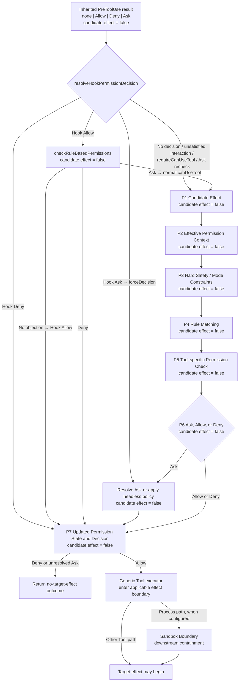

# 02：Permission Decision——候选副作用怎样变成 Allow、Ask 或 Deny

[← 上一篇：Tool Contract 与 Orchestration](01-tool-contract-and-orchestration.md) · 下一篇：Bash Security Analysis

Permission 不是“弹一个确认框”，而是一条发生在**目标 Tool effect** 之前的授权决策流水线。它把一个已经解析、尚未执行的 Tool 候选，与 PreToolUse decision、当前 mode、规则、Tool-specific 分析和交互能力合并，返回 typed `Allow | Ask | Deny`。

先固定本文里 `candidate effect` 的含义：它只指**这次目标 Tool invocation 想产生的效果**，例如读取目标文件、写入目标内容或启动目标命令。`candidate effect = false` 表示目标 Tool 尚未进入 `Tool.call`，不表示控制面什么都没做；Permission 期间仍可能运行 PreToolUse / PermissionRequest hooks、调用 feature-gated classifier、记录日志，或持久化 permission rule。

最重要的边界只有两条：

1. `Allow` 只是“generic Tool executor 可以继续尝试”，不是“机器效果已经成功”。
2. 对适用的进程路径，Sandbox 是 Allow 之后的另一层 containment；它不等于 Permission，也不会把 Permission Deny 改写成 Allow。

**[Source-confirmed]** 本文固定在快照 `712b24f22a63eb6d1a2f86697bf6dbbaa39ae3cf`。`src/services/tools/toolHooks.ts` / `resolveHookPermissionDecision` 先路由 PreToolUse decision；没有 forced decision 时，`src/utils/permissions/permissions.ts` / `hasPermissionsToUseToolInner` 与 `hasPermissionsToUseTool` 负责 normal policy route；`src/hooks/useCanUseTool.tsx` / `useCanUseTool` 消费 normal 或 forced decision，但不执行目标 Tool effect。

## 1. 一张图看完 P1–P7



图的最上方是从上一篇继承来的入口路由，而不是新的 Hook 教程：PreToolUse 可以没有 decision，也可以返回 Allow、Deny 或 Ask；更早的 stop 分支和 input transformation 仍由上一篇负责。只有 `updatedInput` 而没有 decisive decision 时，更新后的 candidate 进入 normal route。`resolveHookPermissionDecision` 再决定是否进入 normal P1–P7：Hook Deny 直接闭合；Hook Ask 作为 `forceDecision` 进入 Ask resolution，不会先重跑 `hasPermissionsToUseTool`；Hook Allow 仍要过 `checkRuleBasedPermissions`，只有没有 rule/safety objection 时才直接保留 Allow。Tool 要求交互但 Hook 没有用 `updatedInput` 满足它、`requireCanUseTool` 为真，或 rule recheck 得到 Ask 时，才回到 normal `canUseTool` route。

因此 P1–P7 是 **normal / no-forced-decision route** 的 ownership map，不是假装源码恰好按七个函数逐行排列。真正的 winning order 要到 P6 看实际 `return` branch；尤其 Tool-wide rule、Tool-specific content rule、safety check 与 mode 会在源码里交错。这个图先固定每层回答的问题：

| 节点 | 输入 | 本层回答 | 输出 | 目标 candidate effect 发生了吗？ |
| --- | --- | --- | --- | --- |
| P1 Candidate Effect | resolved Tool、input、`ToolUseContext` | “哪项能力准备被尝试？” | 候选 effect 描述 | **没有** |
| P2 Effective Permission Context | CLI/settings/disk rules、session mode、working dirs | “这次检查实际看到什么授权状态？” | `ToolPermissionContext` | **没有** |
| P3 Hard Safety / Mode Constraints | mode、prompt capability、Tool safety facts | “哪些约束不能被普通便利规则吞掉？” | 待路由约束 | **没有** |
| P4 Rule Matching | allow/deny/ask rules 与候选 Tool | “Tool 整体或内容 scope 命中了什么？” | rule evidence 或 no match | **没有** |
| P5 Tool-specific Permission Check | parsed input、live context | “这个 Tool 如何理解 path、command 或自有输入？” | `PermissionResult` | **没有** |
| P6 Ask, Allow, or Deny | P2–P5 evidence | “哪个实际 branch 获胜？” | typed decision | **没有** |
| P7 Updated State and Decision | 用户/Hook 响应、optional updates | “是否改 input、rule、mode、directory state；最终返回什么？” | final decision 与 optional state update | **没有** |

只有入口路由或 normal route 最终在 P7 返回 Allow，generic executor 才可能进入下一道边界。即便如此，Sandbox、Tool execution、OS error 与 result normalization 仍可能让目标效果失败。

## 2. 先定义状态，再谈优先级

### 2.1 Session permission mode

该快照的 external modes 是：

| mode | 本文中的准确含义 |
| --- | --- |
| `default` | 没有 blanket mode Allow；rule 与 Tool-specific result 决定，剩余 `passthrough` 变 Ask |
| `acceptEdits` | constrained convenience mode；只在具体 Tool 分支满足 scope 与先行安全条件时 Allow |
| `dontAsk` | outer router 把仍需 Ask 的结果转换为 Deny |
| `plan` | 保留进入前 mode ancestry；不能在 Permission router 中粗暴等同为“所有写操作统一 Deny” |
| `bypassPermissions` | 显式危险模式；仍晚于源码明确保护的 Tool-specific deny、content ask、interaction ask 与 safety ask |

`auto` 是 feature-gated internal mode；`bubble` 存在于 exhaustive type union，但不在 user-addressable runtime set。不要把源码里所有 mode 名字都当成同一类用户配置项。

**[Source-confirmed]** 快照 `712b24f22a63eb6d1a2f86697bf6dbbaa39ae3cf` 的 [`src/types/permissions.ts:16`](https://github.com/buoylee/Claude-Code-true/blob/712b24f22a63eb6d1a2f86697bf6dbbaa39ae3cf/src/types/permissions.ts#L16-L38) / `EXTERNAL_PERMISSION_MODES`、`InternalPermissionMode` 明确区分 external 与 internal mode。

### 2.2 Allow、Deny、Ask rule 从哪里来

`PermissionRule` 不是一个裸字符串，而是：

```text
PermissionRule = {
  source: userSettings | projectSettings | localSettings |
          flagSettings | policySettings | cliArg | command | session
  ruleBehavior: allow | deny | ask
  ruleValue: { toolName, ruleContent? }
}
```

`initializeToolPermissionContext` 先放入 CLI allow/deny rules，再载入 disk rules，并保留 `alwaysAllowRules`、`alwaysDenyRules`、`alwaysAskRules` 三张按 source 分组的 map。额外工作目录也属于 effective context，因为它会改变 File Tool 的 path scope。

这里有两个不能省略的区分：

- **Tool-wide rule**：只靠 Tool identity 就能决定，例如整个 Tool 被 deny。
- **content-specific rule**：必须由 Tool 理解 `ruleContent` 与 input，例如文件路径或 Bash 命令。generic router 不拥有一套适用于所有 Tool 的 content grammar。

### 2.3 Tool-specific inputs 与 scope

generic router 会先用该 Tool 的 `inputSchema.parse(input)` 得到 typed input，再调用 `tool.checkPermissions(parsedInput, context)`。不同 Tool 的 contract 相同，scope 语义不同：

- FileRead 把 input 交给 read path checker；
- FileEdit 把 input 交给 write path checker；
- Bash 把 input 交给 Bash permission analysis；
- 其他 Tool 可以返回 allow、deny、ask 或 passthrough。

因此“所有 Tool 都共享 Bash 的规则语法”从类型和调用关系上都不成立。

**[Source-confirmed]** 快照 `712b24f22a63eb6d1a2f86697bf6dbbaa39ae3cf` 的 [`src/Tool.ts:494`](https://github.com/buoylee/Claude-Code-true/blob/712b24f22a63eb6d1a2f86697bf6dbbaa39ae3cf/src/Tool.ts#L494-L503) / `Tool.checkPermissions` 把它定义为 validate 后调用的 Tool-specific logic，并返回 `Promise<PermissionResult>`；generic logic 的 owner 明确指向 `permissions.ts`。

### 2.4 交互能力也是状态

Ask 只是 decision，不保证一定出现本地 dialog：

- inherited PreToolUse Hook 的 Ask 会以 `forceDecision` 进入 Ask consumer，而不是先重跑 normal policy route；
- 普通 interactive main session 可以把 Ask 交给 confirmation handler；
- `dontAsk` 把 **normal router 仍返回的 Ask** 转成 Deny；forced Hook Ask 没有先经过这段 outer transformation；
- `shouldAvoidPermissionPrompts` 为真时，PermissionRequest hooks 先得到一次决策机会；没有 hook decision 就 Deny；
- requires-user-interaction Tool 的 Ask 不应被普通 convenience mode 静默吞掉。

这里有两类不同的 Hook：PreToolUse decision 位于入口路由，PermissionRequest Hook 则尝试解决 normal route 已经产生、但本地不能 prompt 的 Ask。二者不能揉成同一个“Hook 会批准”。所以“能否 prompt”不是 UI 细节，而是 P6 的策略输入；dialog 的布局、queue 与 remote relay 才是 UI/transport 细节。

### 2.5 Decision state 不等于机器 state

`PermissionDecision` 可以携带 `updatedInput`；Ask 还可以携带 `suggestions: PermissionUpdate[]`。`PermissionUpdate` 可以：

- add / replace / remove rules；
- set mode；
- add / remove directories。

但 **Allow 本身不会自动新增 rule**。只有用户或 Hook 的响应真的带回 updates，`PermissionContext.persistPermissions` 才会：

1. 对支持 persistence 的 destination 写入持久配置；
2. 用最新 app state 把全部 updates 应用到 live `ToolPermissionContext`；
3. 返回“这次是否接受了 permanent update”供 logging 使用。

这仍是 permission control-plane effect，不是这次目标 Tool 的 candidate effect。

## 3. 三个状态快照

下面故意让三个候选停在 P7。每一行的**目标 candidate effect** 都仍是 false；这不排除 permission state、Hook 或 classifier 已发生控制面活动。

| 候选 | P2 effective state | P3–P5 evidence | P6 | P7 | target candidate effect |
| --- | --- | --- | --- | --- | --- |
| harmless read：读取 allowed working directory 内的 `README.md` | `default`，无 read deny/ask | FileRead 的 path checker 先过 explicit read rules，再命中 working-directory allow | Allow | 返回 `updatedInput`；无 rule update | **false** |
| scope 外 edit：写 `/tmp/outside.md` | `default`，无 matching allow | FileEdit 的 write checker 未命中 allow，且 path 不在 allowed working path，返回 Ask + suggestions | Ask | allow-once 可不更新 rule；选择 suggestion 才应用 updates | **false** |
| dangerous Bash candidate：`rm -rf /` | 普通 interactive mode，不假定有 broad allow | Bash `checkPermissions` 拥有 command parse、content rule 与 risk evidence；generic router不提前伪造结论 | 取决于 Tool-specific deny/ask/allow，再套 generic precedence | 非 Allow 不进入 executor；Allow 也只交给下一层 | **false** |

第三行不是回避结论，而是在守 ownership：本篇证明 Permission 怎样消费 Bash evidence；下一篇 Bash Security Analysis 才证明这条命令如何拆解、怎样产生 rule candidate 与安全结论。

## 4. 一次 canonical decision：scope 外 FileEdit

下面走的是 **normal / no-forced-decision variant**：假设 PreToolUse 没有给出 decisive result，或入口 router 因 required interaction 尚未被 Hook `updatedInput` 满足、`requireCanUseTool` / ask recheck 而选择了 normal `canUseTool` route。

假设 candidate 是：

```text
FileEdit({
  file_path: "/tmp/outside.md",
  old_string: "before",
  new_string: "after"
})
```

当前 session 是 `default`，没有匹配这个路径的 allow/deny/ask rule。

1. **P1 Candidate Effect：** generic Tool gate 收到 resolved `FileEditTool` 与 input。它只是候选写入。**candidate effect = false**。
2. **P2 Effective Permission Context：** initializer 已把 mode、三类 rule maps 与 working directories 合并；本次读到 `default` 和当前 allowed paths。**candidate effect = false**。
3. **P3 Hard Safety / Mode Constraints：** 记录 abort、path safety、prompt capability 与 mode facts；没有任何条件允许直接跳到 `Tool.call`。**candidate effect = false**。
4. **P4 Rule Matching：** generic router 先检查 entire-Tool deny/ask；本例均未命中。路径 rule 不能在这里靠通用字符串比较完成。**candidate effect = false**。
5. **P5 Tool-specific Permission Check：** `FileEditTool.checkPermissions` 委托 `checkWritePermissionForTool`。它检查 path deny、internal editable path、safety、path ask、acceptEdits scoped allow、path allow；最后因 scope 外且无 allow 返回 Ask 与 `PermissionUpdate[]` suggestions。**candidate effect = false**。
6. **P6 Ask, Allow, or Deny：** inner router保留这个 Ask；`default` interactive outer router不把它改为 Allow 或 Deny。**candidate effect = false**。
7. **P7 Updated Permission State and Decision：**
   - allow once：`permissionUpdates = []`，得到 Allow，但不新增 future rule；
   - allow with a selected suggestion：先让支持 persistence 的 destination 持久化，再从 latest app state 把全部 updates 应用到 live context，然后返回 Allow；
   - reject / abort：返回 no-target-effect rejection/cancel outcome。源码内部可能用 Ask-shaped result 携带拒绝反馈，因此不要把“用户点拒绝”机械等同于 rule-based Deny。
   无论哪条分支，在 P7 内 **candidate effect = false**；P7 可能已经改变 permission state。

只有 final Allow 被交回 generic executor 后，才可能进入 Sandbox boundary 与 `Tool.call`。如果返回 Deny、未解决的 Ask、reject 或 cancel，generic wrapper直接产生 no-target-effect result。

## 5. Precedence：只写源码真的建立的 branch

下面不是 universal truth table。前三行是进入 P1–P7 之前的 PreToolUse decision router；其余行是它选择 normal / no-forced-decision route 后的 precedence。表格只陈述 pinned source 中确实存在的竞争关系；Tool-specific rule grammar 仍由各 Tool 自己证明。

| condition | competing rules / modes | winning decision | can prompt? | state update | evidence |
| --- | --- | --- | --- | --- | --- |
| PreToolUse Hook 返回 deny | 后续 normal policy route | Hook Deny 直接闭合 | 否 | 无 | `toolHooks.ts:403` / `resolveHookPermissionDecision` |
| PreToolUse Hook 返回 ask | normal `hasPermissionsToUseTool` | Ask 作为 `forceDecision` 交给 `canUseTool`，不先跑 normal router | 视 context | response 可带 updates | `toolHooks.ts:412`、`useCanUseTool.tsx:37` |
| PreToolUse Hook 返回 allow | Hook Allow 与 rule/safety objections | required interaction 尚未由 Hook `updatedInput` 满足，或 `requireCanUseTool` 时回 normal route；否则 `checkRuleBasedPermissions` 的 Deny/Ask 优先，无 objection 才保留 Hook Allow | Ask recheck 可以 | 取决于最终 response | `toolHooks.ts:354` / `resolveHookPermissionDecision` |
| entire Tool 命中 deny | 后续 ask、allow、mode | Deny | 否 | 无 | `permissions.ts:1171` / `hasPermissionsToUseToolInner` |
| entire Tool 命中 ask | 后续 Tool check、allow、mode | Ask；只有显式 sandboxed-Bash auto-allow 配置会 fall through 给 Bash 再判 | 视 context | 响应前无 | `permissions.ts:1184` |
| Tool-specific result 是 deny | bypass、Tool-wide allow | Deny | 否 | 无 | `permissions.ts:1225` |
| interaction-required Tool 返回 ask | bypass / auto convenience | Ask | 可交互才可批准 | 响应可带 updates | `permissions.ts:1230` |
| content-specific ask rule | bypass、Tool-wide allow | Ask | 视 context | 响应可带 updates | `permissions.ts:1238` |
| safetyCheck ask | bypass、ordinary allow | Ask | 视 context；无法 prompt 时可能 Deny | 响应可带 updates | `permissions.ts:1252` |
| `bypassPermissions`，或带 bypass ancestry 的 `plan` | 尚未决的 Tool result、Tool-wide allow | Allow，但只在上述 Tool-specific guards 之后 | 否 | 只带 updatedInput，不自动加 rule | `permissions.ts:1262` |
| entire Tool 命中 allow | 剩余 passthrough / ordinary ask | Allow | 否 | 不自动加 rule | `permissions.ts:1283` |
| Tool-specific passthrough | 没有 decisive rule / mode | Ask | 视 context | 可附 suggestions | `permissions.ts:1299` |
| final Ask 且 mode 是 `dontAsk` | Ask 与 no-dialog mode | Deny | 否 | 无 | `permissions.ts:495` / `hasPermissionsToUseTool` |
| final Ask 且应避免 prompts | Ask 与 headless context | PermissionRequest hook 先决；否则 Deny | 无本地 prompt | hook Allow 才可能带 updates | `permissions.ts:928` |
| explicit read deny/ask 与“edit access implies read”竞争 | implicit read allow | read deny 先，read ask 次之 | Ask 分支可以 | 响应前无 | `filesystem.ts:1081` / `checkReadPermissionForTool` |
| File edit 在 `acceptEdits` 且位于 working path | deny、safety、ask 与 convenience mode | 先行 deny/safety/ask 优先；否则 Allow | 先行 Ask 可 prompt | mode Allow 不加 rule | `filesystem.ts:1328`、`filesystem.ts:1360` |

入口 router 选中 normal route 后，从 `hasPermissionsToUseToolInner` 看，关键主线是：

```text
Tool-wide deny
→ Tool-wide ask（一个显式 Bash/Sandbox 例外）
→ Tool-specific check
→ Tool-specific deny / interaction ask / content ask / safety ask
→ bypass mode
→ Tool-wide allow
→ passthrough becomes ask
```

然后 `hasPermissionsToUseTool` 才对仍然存在的 Ask 应用 `dontAsk`、headless 与 feature-gated auto policy。forced Hook Ask 不经过这段 normal router，而是由 `useCanUseTool` 直接消费后进入 Ask handler。把整条路径压缩成一句“deny > ask > allow”会丢掉 entry routing、Tool delegation、mode 位置与 outer transformation。

## 6. Modes 与危险边界

### 6.1 Normal interactive / default

`default` 不提供 blanket Allow。没有 rule 或 Tool-specific Allow 时，`passthrough` 会被升级成 Ask；interactive consumer 才可能展示确认入口。用户本次批准可以是 allow-once，也可以选择某个 `PermissionUpdate`。二者的 future scope 不同。

### 6.2 acceptEdits 是 constrained convenience

`acceptEdits` 不是“允许全部 edit”。以 FileEdit 为例，源码顺序是：

1. path deny；
2. internal-path 与 protected-path safety；
3. path ask；
4. 只有在 allowed working path 内才由 `acceptEdits` Allow；
5. 再检查 ordinary allow；
6. 最后 Ask。

Bash 也有自己的 mode validation，但它只对 Bash 自己识别的 command category 生效。generic pipeline不能据此声称每个 Tool 都共享同一 convenience scope。

### 6.3 plan 不能在这里简化成 universal read-only Deny

`transitionPermissionMode` / `prepareContextForPlanMode` 会记录 `prePlanMode`，并处理从 auto 或 bypass ancestry 进入 plan 的状态。generic router还明确允许“plan 且 `isBypassPermissionsModeAvailable`”进入 bypass branch；feature-gated auto active 时，plan也可能走 classifier policy。

因此准确说法是：plan 的 read-only posture 由当时 exposed Tool set、Tool 的 `isReadOnly` / `checkPermissions`、plan instructions 与 mode ancestry共同形成；`hasPermissionsToUseToolInner` 本身没有一个“plan 时所有 write 一律 Deny”的 universal branch。面试中若把 plan 说成一条全局 deny rule，会与源码冲突。

### 6.4 dontAsk 与 non-interactive 都没有 dialog 保证

- `dontAsk`：normal route 的 final Ask 直接变 Deny；forced Hook Ask 已由入口 router 选成另一条路径。
- `shouldAvoidPermissionPrompts`：先执行 PermissionRequest hooks；没有明确 hook decision 就 Deny。

所以 Permission 的安全默认不是“无 UI 就卡死等待”，而是把无法完成的 Ask 收口为 no-target-effect denial。

### 6.5 dangerously-skip 的激活边界

`initialPermissionModeFromCLI` 把 `dangerouslySkipPermissions` 请求放在 ordered modes 最前，但组织 feature gate 或 settings kill switch 可以禁用 `bypassPermissions`，此时跳过它并选择下一有效 mode，最终至少回到 `default`。

即便 bypass 激活，它也不是普通 Permission success：

- decision reason 是 mode，而不是某条 matched allow rule；
- Tool-specific deny、explicit content ask、requires-user-interaction ask、safetyCheck ask 在它之前返回；
- 它必须经显式危险入口请求，且可能被 policy/settings 整体禁用；
- 它不证明 Sandbox 已启用，更不证明获准进程拥有 unrestricted access。

**[Source-confirmed]** 快照 `712b24f22a63eb6d1a2f86697bf6dbbaa39ae3cf` 的 [`src/utils/permissions/permissionSetup.ts:689`](https://github.com/buoylee/Claude-Code-true/blob/712b24f22a63eb6d1a2f86697bf6dbbaa39ae3cf/src/utils/permissions/permissionSetup.ts#L689-L811) / `initialPermissionModeFromCLI` 先收集 dangerous flag、CLI mode、settings mode，再跳过被 kill switch 禁用的 bypass；[`src/utils/permissions/permissionSetup.ts:597`](https://github.com/buoylee/Claude-Code-true/blob/712b24f22a63eb6d1a2f86697bf6dbbaa39ae3cf/src/utils/permissions/permissionSetup.ts#L597-L646) / `transitionPermissionMode` 保留 plan/auto transition state。

### 6.6 Sandbox 仍是另一条边界

源码有一个**很窄的 policy exception**：当 Bash sandbox auto-allow 显式启用、Sandbox 可用且该 input 会使用 Sandbox 时，Tool-wide ask 可以 fall through，让 Bash `checkPermissions` 做 command-specific 判断。它只能证明 Permission 在这个 branch 会读取一个 Sandbox fact。

它不能推出：

- Sandbox 等于 Permission Allow；
- 所有 Ask 都能被 Sandbox 跳过；
- Sandbox 会补偿 bypass 的风险；
- Permission Deny 与 Sandbox Deny 是同一种 error。

在适用的进程路径上，final Allow 之后仍单独经过 Sandbox boundary；非进程 Tool 不必硬套 Sandbox，但两层的 owner 与失败语义始终保持分离。

## 7. 机制伪代码

**[Architectural interpretation]** 这段伪代码固定 ownership 与 actual branch shape，不复刻 feature flags、UI race 或 Bash grammar。

```text
PermissionDecision =
    Allow(updatedInput, reason)
  | Deny(reason, message)
  | Ask(prompt, suggestedRule[])

function authorizeCandidate(candidate, preToolUseResult, effectiveContext):
    assert candidate.targetEffectHappened == false

    # Inherited entry router: choose forced, direct, or normal route
    if preToolUseResult is Deny:
        return preToolUseResult

    if preToolUseResult is Ask:
        return canUseTool(candidate, forceDecision = preToolUseResult)

    if preToolUseResult is Allow:
        interactionSatisfied =
            candidate.tool.requiresUserInteraction
            and preToolUseResult.updatedInput is not undefined
        if (candidate.tool.requiresUserInteraction and not interactionSatisfied)
           or context.requireCanUseTool:
            return decidePermissionNormalRoute(candidate, effectiveContext)

        objection = checkRuleBasedPermissions(candidate, effectiveContext)
        if objection is Deny:
            return objection
        if objection is Ask:
            return decidePermissionNormalRoute(candidate, effectiveContext)
        return preToolUseResult

    return decidePermissionNormalRoute(candidate, effectiveContext)

function decidePermissionNormalRoute(candidate, effectiveContext):
    assert candidate.targetEffectHappened == false

    # Tool-wide rules
    if matchesWholeToolDeny(candidate.tool, effectiveContext):
        return Deny(ruleReason, "tool denied")

    if matchesWholeToolAsk(candidate.tool, effectiveContext)
       and not explicitSandboxedBashFallthrough(candidate):
        return Ask("confirm tool", [])

    # Tool owns content/path/command grammar
    parsedInput = candidate.tool.inputSchema.parse(candidate.input)
    toolResult = candidate.tool.checkPermissions(parsedInput, liveContext)

    # Hard Tool-specific guards before bypass/allow
    if toolResult is Deny:
        return toolResult
    if candidate.tool.requiresUserInteraction and toolResult is Ask:
        return toolResult
    if toolResult is Ask causedBy explicitContentAskRule:
        return toolResult
    if toolResult is Ask causedBy safetyCheck:
        return toolResult

    # Mode and whole-Tool allow branches
    if modeIsBypass(effectiveContext)
       or planRetainsBypassAvailability(effectiveContext):
        return Allow(toolResult.updatedInput ?? candidate.input, modeReason)

    if matchesWholeToolAllow(candidate.tool, effectiveContext):
        return Allow(toolResult.updatedInput ?? candidate.input, ruleReason)

    innerDecision =
        toolResult is Passthrough
          ? Ask(toolResult.message, toolResult.suggestions)
          : toolResult

    # Outer policy transforms remaining Ask
    if innerDecision is Ask and effectiveContext.mode == dontAsk:
        return Deny(modeReason, "asking disabled")

    if innerDecision is Ask and promptsUnavailable(effectiveContext):
        hookDecision = runPermissionRequestHooks()
        return hookDecision ?? Deny(headlessReason, "prompt unavailable")

    assert candidate.targetEffectHappened == false
    return innerDecision

function resolveAsk(ask, response, effectiveContext):
    assert candidate.targetEffectHappened == false

    if response.rejectsOrAborts:
        return NoEffectRejectionOrCancel(response.feedback)

    if response.allows:
        updates = response.permissionUpdates
        if updates is not empty:
            persistSupportedDestinations(updates)
            effectiveContext = applyToLatestLiveContext(updates)
        return Allow(response.updatedInput, ask.reason)

    assert candidate.targetEffectHappened == false
```

这段伪代码刻意没有 `execute()`。Permission 的出口是 decision；generic executor 收到 Allow 后才拥有进入 Sandbox 和目标 Tool effect 的资格。伪代码中的 hooks、classifier、logging 或 permission-state persistence 属于 control plane，不违反 `targetEffectHappened == false`。

## 8. 决定性源码 lenses

前面已经讲完机制，下面只放会改变因果的短 excerpt。所有 tuple 都包含 snapshot、repository-relative path 与 symbol。

### 8.1 Lens 1：PreToolUse decision 先选择入口路径

**[Source-confirmed]** 证据零：snapshot `712b24f22a63eb6d1a2f86697bf6dbbaa39ae3cf` + [`src/services/tools/toolExecution.ts:795`](https://github.com/buoylee/Claude-Code-true/blob/712b24f22a63eb6d1a2f86697bf6dbbaa39ae3cf/src/services/tools/toolExecution.ts#L795-L931) + `checkPermissionsAndCallTool`，先收集 PreToolUse result，再调用入口 router。证据一：同一 snapshot + [`src/services/tools/toolHooks.ts:332`](https://github.com/buoylee/Claude-Code-true/blob/712b24f22a63eb6d1a2f86697bf6dbbaa39ae3cf/src/services/tools/toolHooks.ts#L332-L433) + `resolveHookPermissionDecision`。证据二：同一 snapshot + [`src/hooks/useCanUseTool.tsx:28`](https://github.com/buoylee/Claude-Code-true/blob/712b24f22a63eb6d1a2f86697bf6dbbaa39ae3cf/src/hooks/useCanUseTool.tsx#L28-L42) + `useCanUseTool` 的 `forceDecision` branch。证据三：同一 snapshot + [`src/utils/permissions/permissions.ts:1071`](https://github.com/buoylee/Claude-Code-true/blob/712b24f22a63eb6d1a2f86697bf6dbbaa39ae3cf/src/utils/permissions/permissions.ts#L1071-L1156) + `checkRuleBasedPermissions`。

```ts
if (hookPermissionResult?.behavior === 'allow') {
  if ((requiresInteraction && !interactionSatisfied) || requireCanUseTool) {
    return { decision: await canUseTool(/* normal route */), input: hookInput }
  }

  const ruleCheck = await checkRuleBasedPermissions(tool, hookInput, toolUseContext)
  if (ruleCheck === null) return { decision: hookPermissionResult, input: hookInput }
  if (ruleCheck.behavior === 'deny') return { decision: ruleCheck, input: hookInput }
  return { decision: await canUseTool(/* normal route */), input: hookInput }
}

if (hookPermissionResult?.behavior === 'deny') {
  return { decision: hookPermissionResult, input }
}

const forceDecision =
  hookPermissionResult?.behavior === 'ask' ? hookPermissionResult : undefined
return {
  decision: await canUseTool(
    tool, askInput, toolUseContext, assistantMessage, toolUseID, forceDecision,
  ),
  input: askInput,
}
```

`useCanUseTool` 随后选择 `forceDecision !== undefined ? Promise.resolve(forceDecision) : hasPermissionsToUseTool(...)`。所以 normal router 很重要，但不是唯一入口：Hook Ask 直接进入 Ask consumer；Hook Deny 直接闭合；Hook Allow 也不会无条件跳过 rule/safety objections。

### 8.2 Lens 2：effective context 不是单一 mode

**[Source-confirmed]** 证据：snapshot `712b24f22a63eb6d1a2f86697bf6dbbaa39ae3cf` + [`src/utils/permissions/permissionSetup.ts:978`](https://github.com/buoylee/Claude-Code-true/blob/712b24f22a63eb6d1a2f86697bf6dbbaa39ae3cf/src/utils/permissions/permissionSetup.ts#L978-L991) + `initializeToolPermissionContext`。

```ts
let toolPermissionContext = applyPermissionRulesToPermissionContext(
  {
    mode: permissionMode,
    additionalWorkingDirectories,
    alwaysAllowRules: { cliArg: parsedAllowedToolsCli },
    alwaysDenyRules: { cliArg: parsedDisallowedToolsCli },
    alwaysAskRules: {},
    isBypassPermissionsModeAvailable,
  },
  rulesFromDisk,
)
```

输入是 CLI rules、disk rules、mode、working directories 与 bypass availability；输出是本次检查的 effective context。这里没有目标 Tool effect。

### 8.3 Lens 3：normal route 把 Tool-specific check 放在 mode Allow 前

**[Source-confirmed]** 证据：snapshot `712b24f22a63eb6d1a2f86697bf6dbbaa39ae3cf` + [`src/utils/permissions/permissions.ts:1208`](https://github.com/buoylee/Claude-Code-true/blob/712b24f22a63eb6d1a2f86697bf6dbbaa39ae3cf/src/utils/permissions/permissions.ts#L1208-L1280) + `hasPermissionsToUseToolInner`。

```ts
const parsedInput = tool.inputSchema.parse(input)
toolPermissionResult = await tool.checkPermissions(parsedInput, context)

if (toolPermissionResult?.behavior === 'deny') {
  return toolPermissionResult
}

if (
  toolPermissionResult?.behavior === 'ask' &&
  toolPermissionResult.decisionReason?.type === 'safetyCheck'
) {
  return toolPermissionResult
}

const shouldBypassPermissions =
  appState.toolPermissionContext.mode === 'bypassPermissions' ||
  (appState.toolPermissionContext.mode === 'plan' &&
    appState.toolPermissionContext.isBypassPermissionsModeAvailable)

if (shouldBypassPermissions) {
  return {
    behavior: 'allow',
    updatedInput: getUpdatedInputOrFallback(toolPermissionResult, input),
    decisionReason: { type: 'mode', mode: appState.toolPermissionContext.mode },
  }
}
```

这个 excerpt 只证明三件事：Tool input 先解析并委托；Tool-specific deny/safety ask 可以先返回；bypass 是之后的 mode branch。它不证明所有 Tool 有相同内部 rule grammar。

### 8.4 Lens 4：一条真实 precedence——read deny/ask 压过 implicit read allow

**[Source-confirmed]** 证据：snapshot `712b24f22a63eb6d1a2f86697bf6dbbaa39ae3cf` + [`src/utils/permissions/filesystem.ts:1081`](https://github.com/buoylee/Claude-Code-true/blob/712b24f22a63eb6d1a2f86697bf6dbbaa39ae3cf/src/utils/permissions/filesystem.ts#L1081-L1133) + `checkReadPermissionForTool`。

```ts
const denyRule = matchingRuleForInput(
  pathToCheck,
  toolPermissionContext,
  'read',
  'deny',
)
if (denyRule) return denyDecision

const askRule = matchingRuleForInput(
  pathToCheck,
  toolPermissionContext,
  'read',
  'ask',
)
if (askRule) return askDecision

const editResult = checkWritePermissionForTool(
  tool,
  input,
  toolPermissionContext,
  pathsToCheck,
)
if (editResult.behavior === 'allow') return editResult
```

这是“read-specific deny → read-specific ask → edit access implies read”的 source-confirmed ordering。它是 File permission 的一个具体 branch，不应扩张成所有 Tool 的 universal matrix。

### 8.5 Lens 5：Ask response 才是 rule/state update owner

**[Source-confirmed]** 证据：snapshot `712b24f22a63eb6d1a2f86697bf6dbbaa39ae3cf` + [`src/hooks/toolPermission/PermissionContext.ts:139`](https://github.com/buoylee/Claude-Code-true/blob/712b24f22a63eb6d1a2f86697bf6dbbaa39ae3cf/src/hooks/toolPermission/PermissionContext.ts#L139-L147) 与 [`src/hooks/toolPermission/PermissionContext.ts:291`](https://github.com/buoylee/Claude-Code-true/blob/712b24f22a63eb6d1a2f86697bf6dbbaa39ae3cf/src/hooks/toolPermission/PermissionContext.ts#L291-L317) + `createPermissionContext.persistPermissions`、`handleUserAllow`。

```ts
async persistPermissions(updates: PermissionUpdate[]) {
  if (updates.length === 0) return false
  persistPermissionUpdates(updates)
  const appState = toolUseContext.getAppState()
  setToolPermissionContext(
    applyPermissionUpdates(appState.toolPermissionContext, updates),
  )
  return updates.some(update => supportsPersistence(update.destination))
}

async handleUserAllow(updatedInput, permissionUpdates, feedback) {
  const acceptedPermanentUpdates =
    await this.persistPermissions(permissionUpdates)
  // [省略：decision logging 与 feedback normalization]
  return this.buildAllow(updatedInput)
}
```

`updates.length === 0` 直接返回，证明“用户 Allow”与“新增 future permission”是两件事；destination 是否支持 persistence 又与 live apply 分开。

### 8.6 Lens 6：UI-only consumer 消费 normal 或 forced decision

**[Source-confirmed, UI-only]** 证据：snapshot `712b24f22a63eb6d1a2f86697bf6dbbaa39ae3cf` + [`src/hooks/useCanUseTool.tsx:37`](https://github.com/buoylee/Claude-Code-true/blob/712b24f22a63eb6d1a2f86697bf6dbbaa39ae3cf/src/hooks/useCanUseTool.tsx#L37-L95) + `useCanUseTool`；[`src/hooks/toolPermission/handlers/interactiveHandler.ts:57`](https://github.com/buoylee/Claude-Code-true/blob/712b24f22a63eb6d1a2f86697bf6dbbaa39ae3cf/src/hooks/toolPermission/handlers/interactiveHandler.ts#L57-L183) + `handleInteractivePermission`。

`useCanUseTool` 在没有 `forceDecision` 时等待 `hasPermissionsToUseTool`，有 forced Hook Ask 时则直接采用它；之后 Allow 直接 build result，Deny 直接 resolve，只有 Ask 才进入 coordinator/swarm/interactive handler。interactive handler 的 `onAllow` 把 `updatedInput + PermissionUpdate[]` 交给 `handleUserAllow`。这证明 UI 消费 decision 并采集 response；normal generic precedence 仍属于前面的 policy functions，入口选择则属于 `resolveHookPermissionDecision`。

## 9. Failure cases：先问目标 candidate effect 是否发生

| failure / no-target-effect outcome | owner | Permission 输出 | target candidate effect |
| --- | --- | --- | --- |
| entire Tool 被 deny rule 命中 | generic rule router | Deny | **没有** |
| Tool-specific path/command/content 被 deny | Tool `checkPermissions` | Deny | **没有** |
| normal route 需要 Ask，但 `dontAsk` 或 headless 无 prompt | outer policy | Deny | **没有** |
| 用户 reject 或 abort | response consumer | rejection/cancel result | **没有** |
| dangerous bypass 被 org/settings 禁用 | mode initialization | 选择下一有效 mode；本次 candidate 仍重走 policy | **没有** |
| Permission Allow 后 Sandbox 拒绝 | Sandbox | Permission 已 Allow；Sandbox 单独失败 | 目标 effect **仍可能没有** |
| Permission Allow、Sandbox 放行、Tool.call 抛错 | Tool execution | Permission 不是 execution result | 取决于 Tool 在异常前是否产生部分效果 |

最后两行说明为什么 Permission 不能承担“执行成功”的语义。它只关闭 authorization question；Hook、classifier、logging 与 permission-state mutation 等 control-plane effects 另算，不应伪装成目标 Tool effect。

## 10. 五个常见误解

### 10.1 “Permission 就是每次弹 UI dialog”

错。allow/deny rule、mode、Tool check、Hook、`dontAsk` 与 headless policy 都可能在没有 dialog 的情况下闭合 decision。Ask 也只表示需要外部决策，不保证本地 UI 可用。

### 10.2 “Allow 就是 unrestricted process access”

错。Allow 只让 generic executor继续尝试；Sandbox、OS credentials、filesystem permissions、network policy 与 Tool 自身仍可限制或拒绝。

### 10.3 “Sandbox denial 与 Permission denial 是同一种 error”

错。Permission denial 发生在授权层，目标 Tool effect尚未开始；Sandbox denial 发生在已获准候选进入 containment 后。两者的 owner、时点与诊断都不同。

### 10.4 “每个 Tool 都共享 Bash rule grammar”

错。generic contract 只有 `checkPermissions(input, context) -> PermissionResult`；File Tool 匹配 path，Bash 匹配 command，其他 Tool 可以有自己的 content scope。

### 10.5 “之前 Allow 过，未来所有 input 都会自动 Allow”

错。allow-once 可以没有 `PermissionUpdate`；即使更新了 rule，也只覆盖该 rule 的 Tool、content scope、source/destination 与 lifetime。未来 input 仍要重新走匹配和 Tool-specific analysis。

## 11. 设计取舍

### 11.1 Generic policy 与 Tool specialization

统一 typed decision 让 generic executor只面对 Allow/Ask/Deny；把 path、command、MCP input 等 grammar 留给 Tool，避免一个中央函数理解所有能力。代价是 precedence 不能只看一张全局矩阵，必须同时读 generic branch 与目标 Tool branch。

### 11.2 Convenience 与 hard boundaries

`acceptEdits`、auto 与 bypass 可以减少 prompts，但必须放在具体 safety/content branches之后。便利 mode 越强，activation、kill switch、audit reason 与 scope 就越需要显式。

### 11.3 Interactive UX 与 headless determinism

interactive Ask 给用户控制权；headless 场景不能无限等待。源码选择先给 PermissionRequest hook 机会，再 fail closed 为 Deny。代价是同一个 candidate 在不同 prompt capability 下可能得到不同终态，但 effect-before-authorization invariant 不变。

### 11.4 Live state 与 durable state

`PermissionUpdate` 同时服务当前 session 与可持久 destination；`supportsPersistence` 把“live apply”与“永久接受”分开。这样 allow-once 不会被误写成永久规则，但实现必须始终从 latest app state apply，避免覆盖并发更新。

### 11.5 Permission 与 Sandbox 解耦

Permission 回答“是否授权尝试”，Sandbox 回答“获准能力最多能触碰什么”。解耦能给出更准确的失败诊断，也允许非进程 Tool 使用 Permission 而不硬套 Sandbox 模型。

## 12. 面试表达

### 12.1 30 秒回答

> Claude Code 的 Permission 是目标 candidate effect 前的 policy pipeline，不是 UI dialog。继承的 PreToolUse decision 先由 `resolveHookPermissionDecision` 分流：Hook Deny 直接闭合，Hook Ask 作为 `forceDecision` 进入 Ask consumer，Hook Allow 仍受 rule/safety recheck；没有 forced decision 才走 normal route。normal route先处理 whole-Tool deny/ask，再委托 Tool-specific `checkPermissions`，随后才看 bypass、whole-Tool allow，并把剩余 passthrough变 Ask。只有 final Allow 才回到 generic executor；规则更新只在响应真的带 PermissionUpdate 时发生，Sandbox仍是下游独立边界。

### 12.2 3 分钟回答

> 我会先画入口，再用 P1–P7 讲 normal route。PreToolUse result 先由 `resolveHookPermissionDecision` 选择 direct Deny、forced Ask、rule-checked Hook Allow 或 normal `canUseTool`。进入 normal route 后，P1 是尚未执行的 target candidate effect；P2 构造包含 mode、allow/deny/ask rule maps、working dirs和 prompt flags 的 ToolPermissionContext；P3/P4 收集 hard constraints 与 rule evidence；P5 通过 Tool 自己的 inputSchema 和 checkPermissions 解释 path、command或其他 content；P6 按源码 branch 返回 typed Allow、Ask或Deny；P7 才解释用户/Hook response，并按 PermissionUpdate 先处理 durable destination、再 apply latest live state。P1–P7 全部 `candidate effect=false`，但 control plane 可以运行 Hook/classifier并更新 permission state。
>
> normal-route precedence不能说成 universal deny/ask/allow matrix。pinned source 先查 entire-Tool deny、entire-Tool ask，再调用 Tool check；Tool-specific deny、requires-interaction ask、content ask和safety ask都在 bypass前返回。之后才是 bypass mode、entire-Tool allow与 passthrough-to-ask。outer function再把 dontAsk 的 Ask变 Deny；headless先跑 PermissionRequest hooks，无决策则 Deny。FileRead还有自己的 read deny→read ask→edit-implies-read顺序；FileEdit则在 deny/safety/ask之后才让 acceptEdits对 working-path写入放行。
>
> 最后，Allow不是执行成功，也不是 unrestricted access。它只是 generic executor可以继续；Sandbox、Tool.call与OS仍可能失败。用户一次 Allow也不必然覆盖未来 input：没有 PermissionUpdate就是 allow-once，有 update也只覆盖其 Tool/content/destination/lifetime。

### 12.3 常见追问

| 追问 | 回答落点 |
| --- | --- |
| PreToolUse Hook Allow 是否跳过 Permission？ | 不会无条件跳过。required interaction 未被 Hook `updatedInput` 满足，或 `requireCanUseTool` 为真时会走 normal route；否则仍跑 `checkRuleBasedPermissions`，Deny/Ask objection 可压过 Hook Allow。 |
| deny 是否永远高于一切？ | 只能按具体 branch说。whole-Tool deny最先；Tool-specific deny也在 bypass/allow前，但不同 Tool 内部还有自己的顺序。 |
| ask 为什么不是 deny？ | Ask 表示需要外部决策；interactive可批准或拒绝，normal route 的 dontAsk/headless transformation 才可能把它收口成 Deny。 |
| plan 是否就是全局 read-only rule？ | 不是 generic router 的一条 universal branch；要结合 Tool exposure、Tool-specific check 与 prePlan mode ancestry。 |
| bypass 是否跳过所有安全检查？ | 不是。pinned source 明确让 Tool-specific deny、content ask、interaction ask与safety ask先返回。 |
| Allow 后为何还会失败？ | Permission只授权尝试；Sandbox、OS与 Tool execution仍是后续 owner。 |
| 用户点击“允许”会写 settings 吗？ | 不一定。只有响应带 updates，且 destination支持 persistence时才持久化；live apply与durable update也分开。 |

## 13. 当前系统状态与 Bash handoff

现在 authorization question 已闭合：PreToolUse entry router先选择 direct、forced 或 normal route；normal P1–P7 接收尚未执行的目标 candidate effect，构造 effective context，消费 hard/mode facts、rule evidence 与 Tool-specific result，返回 Allow、Ask 或 Deny，并在响应明确携带 updates 时更新 permission state。到 P7 为止，**目标 Tool effect** 仍未发生；control-plane effects 可能已经发生。

若结果不是 Allow，generic executor返回 no-target-effect outcome。若结果是 Allow，它只把候选交给下一道边界；对 Bash 而言，下一问是：

```text
Bash Security Analysis handoff

Input:
  a Bash candidate that Permission permits to continue

Next owner:
  Bash-specific parsing, compound-command decomposition,
  command/rule-candidate derivation, read-only and danger analysis

Invariant:
  Permission Allow is not proof that the command is harmless,
  and it is not proof that the command has executed.
```

[← 上一篇：Tool Contract 与 Orchestration](01-tool-contract-and-orchestration.md) · 下一篇：Bash Security Analysis
