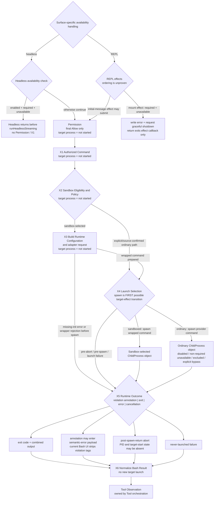

# 04：Sandbox Runtime——获准命令怎样进入 containment 与结果边界

[← 上一篇：Bash Security Analysis](03-bash-security-analysis.md) · 下一篇：File Editing Safety（尚未创建）

结论先行：Sandbox Runtime 不是第二套 Permission，也不是“Allow 的另一种写法”。Permission 已经回答“这条候选命令能否继续尝试”；Sandbox Runtime 才回答“这次获准的进程是否适用 containment、要把什么 policy/config 交给 runtime、最后从哪条路径启动”。

两层必须分开：

1. **authorization** 决定候选 effect 有没有资格进入执行边界；Deny 不会被 Sandbox 改成 Allow。
2. **containment** 只约束适用的已获准进程；Permission Allow 不保证一定使用 Sandbox，也不保证进程成功启动或执行成功。

本文把 `target effect` 精确限定为**这次目标 Bash command 的进程执行**。manager 初始化、settings 转换、config refresh、debug logging 等属于 control plane；它们可能在 X1–X3 发生，但目标进程尚未启动。第一次可能启动目标进程的位置是 X4 的 `spawn`。

**[Source-confirmed]** 本文固定在 Claude Code 快照 `712b24f22a63eb6d1a2f86697bf6dbbaa39ae3cf`。X1–X6 是教学模型，不是源码 enum。源码仓库没有可验证的 `@anthropic-ai/sandbox-runtime` manifest/lock、vendored source 或精确 commit mapping，因此本文只证明 Claude Code 的 selection、configuration、adapter call、launch 与 result contract；外部 package 的 OS-level enforcement internals 一律标为 delegated / unproven。

## 1. 一张图看完 Permission → X1–X6 → Tool Observation



这张图有五个刻意保留的细节：

- **只有headless**证明了hard gate：required + unavailable时，`runHeadless` 请求shutdown并在进入 `runHeadlessStreaming` 前return，因此不会进入本文Permission/X1链。
- REPL的相同检查位于mount `useEffect`；它写error并请求graceful shutdown，但return只退出effect callback。另一个initial-message effect可以提交prompt，固定源码没有证明二者的执行顺序或pre-X1 guard。
- Permission 位于 X1 之前；本文不重跑 Bash AST、rule matching 或 Ask UI。
- X1–X3 的目标进程都没有启动；adapter 返回 wrapped command string 也不是目标 effect。
- sandboxed 与ordinary两条路径最终汇合在同一个 `spawn` site；ordinary覆盖disabled、non-required unavailable、excluded与policy-permitted explicit bypass。**X4 才是 effect transition**，X5/X6 只观察和转换已有执行证据。

| 节点 | 输入 | 本层拥有的问题 | 输出 | 目标进程状态 |
| --- | --- | --- | --- | --- |
| Headless availability gate | effective availability、`failIfUnavailable` | “headless能否进入streaming/Permission链？” | required + unavailable时shutdown request + return；否则继续 | hard-return branch **不进入X1** |
| REPL mount effect | 相同availability state | “REPL mount时怎样报告/请求shutdown？” | error + `gracefulShutdownSync`，或warning notification | 与initial-message effect的顺序**未证明** |
| X1 Authorized Command | final Allow 后的 typed Bash input、Tool context | “哪个已获准 command 准备执行？” | launch candidate、abort/timeout/progress context | **未启动** |
| X2 Eligibility and Policy | command、effective sandbox state、override | “这次authorized command是否走 adapter containment？” | sandboxed / ordinary branch | **未启动** |
| X3 Runtime Configuration | merged settings、working paths、network/path rules | “Claude Code 向 external manager 传什么？” | runtime config 与 wrapped-command request，或 pre-spawn error | **未启动** |
| X4 Launch Selection | provider-built或adapter-wrapped command、cwd/env/stdio | “用哪份 command 调 `spawn`？” | child-backed `ShellCommand` 或 no-child failure | **这里才可能启动** |
| X5 Runtime Outcome | child events、AbortSignal、combined output、adapter evidence | “是 exit、abort、annotation 还是没启动？” | `ExecResult` 或 thrown failure | ChildProcess object / maybe started / ended / killed-status / never launched |
| X6 Bash Result Normalization | runtime evidence | “怎样变成 Bash-facing output/error？” | `Out` 或 generic error handoff | **不产生新启动** |

## 2. 先划 ownership，再读机制

### 2.1 五种表示不是同一个对象

| 表示 | 精确定义 | 不能拿它证明什么 |
| --- | --- | --- |
| authorized command | Permission 已返回 final Allow 的 `BashToolInput`；仍只是一次获准尝试 | 不能证明已 sandboxed、已 spawn 或成功 |
| sandbox context / policy / config | settings、Permission rules 与 runtime settings 派生出的 network/filesystem/ignore/weaker/ripgrep fields | 字段名不能证明 OS 怎样 enforce |
| adapter launch request | `wrapWithSandbox(command, binShell, customConfig, abortSignal)` | 返回 string 不是 child process，也不是成功执行 |
| runtime outcome | `ExecResult`、pre-spawn error、adapter rejection，或 adapter 注入的 violation evidence | 不能把所有 failure 压成一个 exit code |
| normalized Bash result | `BashTool.call` 的 `Out`，或抛给 generic Tool error route 的异常 | 不等于 generic Tool Observation 的全部 orchestration contract |

### 2.2 Repository evidence boundary

| claim | Claude Code source proves | external sandbox-runtime source required | platform-dependent |
| --- | --- | --- | --- |
| sandbox selection / bypass | `shouldUseSandbox` 的 enablement、policy-permitted override、empty input、excluded command顺序 | 只有 delegated support/dependency predicate internals需要 | 是 |
| configuration fields | Claude Code怎样构造并传入 domains、paths、flags、proxy/ripgrep config | **怎样 enforce** 需要 | 是 |
| filesystem containment | adapter inputs与post-command cleanup调用 | **需要** | **是** |
| network containment | adapter inputs、managed-domain callback与manager calls | **需要** | **是** |
| process launch | wrapped与ordinary command最终都由 `Shell.exec` 调 Node `spawn` | wrapper command如何建立containment需要 | 是 |
| cancellation | Claude Code的pre-abort、AbortSignal handler、tree-kill与result bit | wrapper内部的signal/platform行为可能需要 | 是 |
| violation normalization | facade转发annotation/store；semantic-error payload消费annotated string；当前Bash result UI删除tags并只渲染cleaned stderr | violation检测、store写入、tag生产与universal code关系需要 | 可能 |

### 2.3 外部 package 在本文为什么只能停在 contract

本地证据顺序是：先查固定源码树的 manifest/lock，再查 tracked vendor / package source，再查本机 npm/pnpm global source。结果是：

- 固定源码树没有 `package.json`、lockfile、tracked `node_modules`、`.yarn` 或 `vendor` package copy；
- npm / pnpm global roots没有独立 `@anthropic-ai/sandbox-runtime`；
- 本机 global Claude Code package也没有可用于精确 mapping 的 package source；
- 因此连“这个 snapshot 选择了哪个 exact version”都不能从本地 lock证明，更不能证明 package internals。

历史线索 `0.0.56` / `12a3cc172cf343c33a0af6b3e0e98426f9b16139` 不是本文事实。即使未来找到 lock，它也只证明 dependency selection；还要有 exact package source 与 commit mapping，才能把 external implementation写进 source-confirmed结论。

## 3. Canonical sandboxed path：从 final Allow 到 `spawn`

使用 source-compatible atomic command：

```bash
git status --short
```

这个例子只固定 command shape，不假设所有环境都同样选择 Sandbox。canonical path 额外假设：Permission 已 final Allow；sandbox setting打开；platform/dependency/enabled-platform checks都通过；没有 `dangerouslyDisableSandbox`；command不命中 `excludedCommands`。

### X1：接住的是 final Allow，不是再授权一次

generic executor进入 `BashTool.call` 后，process variant跳过 `_simulatedSedEdit`，构造 `runShellCommand` generator，并传入：

```text
AuthorizedBash = {
  input: BashToolInput,
  abortController,
  setAppState / progress callbacks,
  main-thread / cwd-change facts
}
```

这里没有 child。`runShellCommand` 只是把 command、timeout、AbortSignal和 `shouldUseSandbox(input)` 交给 `Shell.exec`。

### X2：`shouldUseSandbox` 是 launch selection，不是 authorization

源码 branch order 是：

```text
effective sandboxing disabled                 → false
explicit override AND policy allows ordinary → false
missing command                               → false
contains excluded command                    → false
otherwise                                    → true
```

canonical command错过全部 false branch，所以返回 true。这个 boolean 只决定 `Shell.exec` 是否请求 adapter wrap；它既不推翻 final Allow，也不保证 adapter成功。

`effective sandboxing disabled` 本身又是一个合取：

```text
supported platform
AND dependency check has no errors
AND current platform is in enabledPlatforms
AND sandbox.enabled
```

其中 supported-platform 与 dependency predicate由 external manager提供；Claude Code 只证明它会消费结果。

### X3：先建 config，再请求 wrapper

session initialization 会把 Claude Code settings转换成 `SandboxRuntimeConfig`。重要字段按 owner分组如下：

| config area | Claude Code传入的字段 / 来源 | 本文可证明的边界 |
| --- | --- | --- |
| network | `allowedDomains`、`deniedDomains`、Unix socket/local binding flags、HTTP/SOCKS proxy ports | 证明映射与传参；不证明proxy/OS enforcement |
| filesystem | `allowRead`、`denyRead`、`allowWrite`、`denyWrite` | 证明path收集与解析；不证明mount/ACL实现 |
| protected inputs | settings paths、managed settings、skills paths等被加入 deny-write inputs | 证明输入数组；不把注释里的external mechanics当本地实现事实 |
| runtime options | `ignoreViolations`、weaker nested/network flags | 证明field forwarding；不从名字推导效果 |
| tooling | ripgrep command/args/argv0 | 证明adapter config |

`initialize` 的 control-plane顺序是：检测worktree main repo path → 转换settings → `BaseSandboxManager.initialize(config, callback)` → 订阅settings变更并 `updateConfig`。这些步骤没有启动 `git status --short`。

per-command path 到 `wrapWithSandbox` 时：

1. 若 effective sandboxing仍开启，等待 `initializationPromise`；
2. 没有 promise 就抛 `Sandbox failed to initialize.`；
3. 否则委托 `BaseSandboxManager.wrapWithSandbox(command, binShell, customConfig, abortSignal)`；
4. 得到一条 wrapped command string。

最后一步仍没有 child。external manager怎样把 config变成platform-specific containment，不在当前本地证据边界内。

### X4：adapter不直接启动；`Shell.exec` 的 `spawn` 才启动

`Shell.exec` 先让 shell provider构造 command、确认cwd、处理already-aborted signal，再按 selection分支：

```text
sandbox-selected:
  commandString = await SandboxManager.wrapWithSandbox(...)

ordinary:
  commandString = provider-built command

both:
  resolve spawn binary / args / env / stdio
  childProcess = spawn(...)
```

因此更准确的说法不是“adapter自己launch process”，而是：**Claude Code 先让 adapter准备 sandbox-wrapped launch string，然后在同一个 X4 `spawn` site启动。** ordinary path跳过wrap，也从这里启动。

### X5：child result先保持runtime evidence

`ShellCommandImpl` 把 child的 `exit` / `error` event、timeout、AbortSignal与output组合成：

```text
ExecResult = {
  code,
  stdout,
  stderr,
  interrupted,
  backgroundTaskId?,
  outputFilePath?,
  preSpawnError?
}
```

Bash file mode把 child stdout与stderr两个fd写入同一个 output file，因此 normal Bash result里的 `result.stdout` 实际承载 combined process output。`ExecResult` 类型仍保留两个字段，但不能据此声称 Bash UI始终保有两个独立stream。

随后 `BashTool.call` 做三件不同的事：

1. `interpretCommandResult(command, code, combinedOutput, '')` 判断该 command semantic 是否是 error；不是简单把所有 non-zero统一处理。
2. 调用 `SandboxManager.annotateStderrWithSandboxFailures(command, combinedOutput)`；这是 external facade contract。
3. `preSpawnError` 直接抛普通 Error；semantic error且不是special interrupt route时抛 `ShellError`，并使用annotated output。

这里不能反推“violation必然等于某个 exit code”。tag怎样产生、store怎样记录、哪些OS拒绝被认作violation都需要external implementation。

### X6：Bash result与generic Tool Observation仍有最后一道边界

成功 path把 combined output处理成 `Out`，保留 interrupt/background/bypass等facts；`mapToolResultToToolResultBlockParam` 再组装 model-facing `tool_result`。如果它收到 `interrupted=true`，会追加：

```text
<error>Command was aborted before completion</error>
```

并设置 `is_error=true`。semantic `ShellError`、adapter rejection等 thrown failure则交给 generic Tool error route；本文只标出handoff，不重开上一篇的Tool orchestration。

## 4. Ordinary、bypass、unavailable 与 failure 不是一个“fallback”

### 4.1 Explicit unsandboxed execution：policy-permitted override

假设 final Allow 对应的 input是：

```text
{
  command: "git status --short",
  dangerouslyDisableSandbox: true
}
```

同时 `sandbox.allowUnsandboxedCommands = true`。X2 返回 false，X3 adapter path被跳过，X4直接spawn provider-built command。这才是 source-confirmed **explicit bypass / ordinary launch**。

它与 Permission 的关系不能省略：whole-Bash Ask rule只有在 sandbox enabled、auto-allow enabled、且 `shouldUseSandbox(input)` 为 true 时才允许fall through给Bash-specific auto-allow。explicit bypass令这个predicate为 false，所以不能借sandbox auto-allow跳过ordinary Permission handling。本文从 X1 开始时，仍要求它已经取得final Allow。

反过来，如果policy把 `allowUnsandboxedCommands` 设为 false，flag不会产生error，也不会自动ordinary launch；`shouldUseSandbox`忽略这个override并继续检查，最后可能仍返回 true。准确语义是“bypass没有被选择”，不是“Sandbox替Permission Deny”。

### 4.2 Excluded command：compatibility escape，不是security proof

`containsExcludedCommand` 支持 user-configured exact/prefix/wildcard patterns，并检查compound subcommands及有限env/wrapper variants。命中后，`shouldUseSandbox` 返回 false，X4走ordinary launch。

源码注释明确把 `excludedCommands` 称为 user-facing convenience，而不是security boundary。因此：

- 命中只表示“这条command不走sandbox adapter”；
- 它仍要经过Permission；whole-Bash Ask也不能借sandbox auto-allow exception跳过；
- 不能把“incompatible/excluded”说成Sandbox拒绝执行。

### 4.3 Disabled：直接ordinary，不等于unavailable

如果 `sandbox.enabled` 为 false，`getSandboxUnavailableReason` 返回 `undefined`；`isSandboxingEnabled` 为 false，获准command之后走ordinary path。这是配置选择，不是dependency failure，也没有“required sandbox”诊断。

### 4.4 Unavailable：headless hard gate 与 REPL shutdown request不是同一保证

当用户显式enabled，但出现以下source-confirmed class之一：

- external manager报告platform unsupported；
- current platform不在 `enabledPlatforms`；
- external dependency check有errors；

`getSandboxUnavailableReason` 会产生diagnostic。后续保证必须按源码surface拆开：

| surface / policy | source-confirmed behavior | 能否证明在Permission/X1前闭合？ |
| --- | --- | --- |
| headless + `failIfUnavailable=true` | 写error，调用 `gracefulShutdownSync(1)`，随后从 `runHeadless` return；没有进入后面的 `runHeadlessStreaming` | **能** |
| REPL + `failIfUnavailable=true` | mount `useEffect`写error，调用 `gracefulShutdownSync(1, 'other')`，return只退出effect callback | **不能**；另一个initial-message effect可调用 `onSubmit` / `onQuery`，源码无ordering或shutdown guard证明 |
| headless + non-required unavailable | 写warning后继续；effective sandboxing为false | later final-Allow Bash可走ordinary X4 |
| REPL + non-required unavailable | debug log + warning notification；不请求shutdown | later final-Allow Bash可走ordinary X4 |

因此不能把“required unavailable”写成跨surface的universal pre-X1 startup refusal。本文只把headless hard return画成STOP；REPL只记录error与graceful-shutdown request，不推断异步shutdown完成前的Permission/X1顺序。其他surface不在当前tuple中。

### 4.5 Platform capability：只说源码真的证明的边界

Claude Code的diagnostic text把supported target描述为macOS、Linux或WSL2，并把WSL1单独列为unsupported；Linux缺依赖时还会给bubblewrap/socat提示。但实际 `isSupportedPlatform()` 与 `checkDependencies()` 都委托 `BaseSandboxManager`。

所以本文可以证明：Claude Code有platform gate、enabled-platform filter和dependency gate；不能证明macOS/Linux分别用了什么kernel primitive，也不能从config字段名推导seatbelt、namespace、seccomp或socket proxy的具体语义。

### 4.6 Initialization failure：没有证据支持silent ordinary retry

`initialize` catch会：

```text
clear initializationPromise
log debug error
do not rethrow from initialize
```

这只是“启动阶段graceful logging”，不是一个rejected Bash result。三个后续状态必须拆开：

1. **initialize catch：** 当前初始化promise内部吞掉error、清共享promise并写debug；已经进入 `await initializationPromise` 的wrapper会在promise settle后继续到Base wrapper。
2. **later missing promise：** 后续enabled wrapper进入时若已没有promise，会抛本地 `Sandbox failed to initialize.`。
3. **Base wrapper rejection：** 已经调用delegated `BaseSandboxManager.wrapWithSandbox` 后若promise reject，rejection向上传播。

三者发生时target都尚未在X4启动，但只有后两者是这条command path上的no-launch thrown failure。

源码没有在这个per-command path写“adapter失败后自动重试ordinary command”。把init failure描述成ordinary fallback会越过证据。

### 4.7 Adapter failure、cwd failure、spawn failure也不同

| branch | source behavior | target launched? |
| --- | --- | --- |
| initialization catch | 清共享promise、写debug、不rethrow；已经await该promise的wrapper可继续到Base wrapper | **没有**；这一步本身不是command failure result |
| later missing-init promise | `wrapWithSandbox` 抛本地 `Sandbox failed to initialize.` | **没有** |
| delegated Base wrapper rejection | `Shell.exec` 在launch try之前await wrapper；rejection向上传播 | **没有** |
| current cwd与original cwd都不存在 | `createFailedCommand(preSpawnError)`；`BashTool.call`随后抛这个error | **没有** |
| signal在spawn前已aborted | `createAbortedCommand()`，不调用spawn | **没有** |
| `spawn`/launch setup同步抛错 | launch catch构造code 126 + error text的aborted command | **没有成功launch** |
| `spawn`返回child后触发异步 `error` event | `ShellCommandImpl.#errorHandler`把result code归一为1 | child object已创建；target process未必成功开始 |
| child正常创建后退出non-zero | 普通runtime exit evidence，再由command semantic判断 | **已经launch** |

## 5. Exit、output、violation 与 cancellation 的真实语义

### 5.1 正常exit与non-zero exit

`ShellCommandImpl` 的 `exit` handler选择numeric code，读取output并完成 `ExecResult`。`BashTool.call` 再委托 `getCommandSemantic` 解释结果，因此准确顺序是：

```text
OS / child event → numeric code + output
→ command-specific semantic interpretation
→ success Out OR ShellError
```

“code 0一定包含有用output”不成立；“non-zero永远同一错误”也不成立。Bash还会为silent command记录 `noOutputExpected`。

### 5.2 stdout / stderr：type分开，Bash file mode合流

对本文canonical Bash path，`Shell.exec` 把两个child fd指向同一个file descriptor，目的是保留chronological interleaving；`BashTool.call` 明确按“stderr is interleaved in stdout”消费。

因此：

- `result.stdout` 是combined process output；
- 调用violation annotation时也传combined output；
- successful `Out.stderr` 在这条路径主要承载cwd reset message；
- 不能用最终两个string字段复原原始stream provenance。

### 5.3 Policy violation：只能证明annotation contract

Claude Code adapter把这两个external facade暴露出来：

```text
getSandboxViolationStore()
annotateStderrWithSandboxFailures(command, stderr)
```

`BashTool.call` 会计算annotated string；在semantic error branch，它把该string交给 `ShellError`。这证明semantic-error payload**可以携带**external annotation，不等于当前Bash result UI会展示独立violation内容。

当前 `BashToolResultMessage` 的消费顺序是：

```text
ShellError stderr with possible <sandbox_violations> tags
  → extractSandboxViolations(stderr)
  → only cleanedStderr is returned
  → removeSandboxViolationTags deletes the tagged block
  → UI renders cleaned stderr, with no separate violation payload/state
```

但当前没有exact external tuple，所以以下结论都必须保持unproven：

- 哪个OS event一定进入store；
- 是否每个denied filesystem/network operation都有tag；
- tag与exit code是否一一对应；
- violation时target是否从未开始；
- macOS/Linux是否返回同一message。

换句话说，tagged annotation在UI normalization之前可能存在于semantic-error payload；当前Bash result UI会识别并移除tagged block，只渲染cleaned stderr，**不会展示或返回独立violation content**。“evidence怎样被生产”仍不属于Claude Code adapter源码的证明范围。

### 5.4 Abort不是一个branch

至少要分三种：

1. **pre-abort：** `Shell.exec` 在spawn前看到 `abortSignal.aborted`，直接返回aborted command；target未启动。
2. **post-spawn-return non-`interrupt` abort：** 此时只证明 `spawn` 已返回 `ChildProcess` object。handler调用kill path；`#doKill`仅在object有PID时请求tree-kill，但无论PID是否存在都会resolve kill-derived code，随后形成 `interrupted` result。target可能已经开始，也可能尚未开始；只有实际执行并写出内容后才可能有partial output。
3. **reason = `interrupt`：** handler明确不kill；注释说明由caller把process background。不能把“用户新消息”写成universal process cancellation。

timeout又是另一条路径：若允许auto-background且callback存在，就background；否则kill并给result添加timeout text。`backgroundTaskId` 表示process可能仍在运行，不是exit success。

### 5.5 Result matrix

| runtime situation | X5 evidence | X6 Bash-facing route | target state |
| --- | --- | --- | --- |
| semantic success | code + combined output | return `Out`，再map `tool_result` | ended |
| semantic error | code + combined output + optional external annotation | throw `ShellError`给generic error route | ended |
| tagged annotation on semantic error | `ShellError` stderr may carry adapter annotation | current Bash UI只取cleaned stderr并移除tags；不暴露独立violation content | target may or may not have started |
| pre-abort | code 145、`interrupted=true`、no process output | `tool_result`标记error并附加aborted marker | never launched |
| post-spawn-return non-`interrupt` abort | ChildProcess object；有PID才请求tree-kill；无论PID均resolve kill-derived code；partial output仅在实际执行后可能存在 | interrupted result或error route，取决于result/semantic | target may or may not have started |
| initialization catch | debug evidence、共享promise被清；不产生rejected `ExecResult` | 已在等待的wrapper继续到Base wrapper | not launched at this step |
| later missing-init promise | local thrown error | generic thrown-error route | never launched |
| delegated Base wrapper rejection | thrown promise rejection | generic thrown-error route | never launched |
| invalid cwd | `preSpawnError` | throw ordinary Error | never launched |
| synchronous launch/setup throw | code 126 helper result + error text | Bash/generic error handling；不是violation同义词 | no successful launch |
| asynchronous child `error` event | `ShellCommandImpl` result code 1 | command-semantic/Bash error handling | child object exists；target may not have started |
| background | `backgroundTaskId` + output path | background information | may still be running |

## 6. 机制伪代码：先选择containment，再launch，再normalize

**[Architectural interpretation]** 下面的函数名来自任务模型，不是源码symbol。它把多个source-confirmed function压成ownership-preserving pseudocode；external enforcement保持opaque。

```text
runAuthorizedBash(command, permissionResult, sandboxContext)
    -> BashExecutionResult:
  assert permissionResult is final Allow
  assert targetProcessStarted == false

  input = permissionResult.updatedInput ?? command

  useSandbox = shouldUseSandbox(input)
    # enabled/support/deps/platform-list
    # → policy-permitted explicit override
    # → command exists
    # → excluded command

  providerCommand = shellProvider.buildExecCommand(
    input.command,
    useSandbox = useSandbox,
  )

  if cwd is unusable and original cwd is unusable:
    return PreSpawnFailure(error)                       # no target launch

  if sandboxContext.abortSignal.alreadyAborted:
    return AbortedBeforeSpawn                           # no target launch

  launchCommand = providerCommand
  if useSandbox:
    # Session init/config is control plane. Adapter internals stay opaque.
    launchCommand = await SandboxManager.wrapWithSandbox(
      providerCommand,
      shellPath,
      customConfig = undefined,
      abortSignal,
    )                                                   # still no target launch

  try:
    child = spawn(launchCommand, cwd, env, stdio)        # X4: first possible effect
                                                        # return proves object, not target start
  catch synchronousLaunchOrSetupError:
    return LaunchFailure(code = 126, error = synchronousLaunchOrSetupError)

  runtime = await observeChild(child, abortSignal, timeout)
    # code, combined output, interrupted/background/pre-spawn facts
    # an asynchronous child error event resolves code = 1
    # post-return non-interrupt abort: tree-kill only with PID;
    # kill-derived result resolves even when target start is unknown

  semantic = interpretCommandResult(
    input.command,
    runtime.code,
    runtime.combinedOutput,
    "",
  )
  annotated = SandboxManager.annotateStderrWithSandboxFailures(
    input.command,
    runtime.combinedOutput,
  )

  if runtime.preSpawnError:
    throw Error(runtime.preSpawnError)

  if semantic.isError and not sourceSpecialInterruptCase(runtime):
    throw ShellError(annotated, runtime.code, runtime.interrupted)

  return normalizeBashOut(runtime, semantic)
```

伪代码里没有 `if Permission Deny then sandbox`，也没有 `catch adapter error then ordinary retry`。这两条不存在于source-confirmed process path。

## 7. 决定性源码 lenses

前面先解释机制，下面只保留会改变因果的短excerpt。每个tuple都包含snapshot、repository-relative path与symbol。

### Lens A：selection有四个具体false branch

**[Source-confirmed tuple]** `(712b24f22a63eb6d1a2f86697bf6dbbaa39ae3cf, src/tools/BashTool/shouldUseSandbox.ts, shouldUseSandbox / containsExcludedCommand)`

[`src/tools/BashTool/shouldUseSandbox.ts:130`](https://github.com/buoylee/Claude-Code-true/blob/712b24f22a63eb6d1a2f86697bf6dbbaa39ae3cf/src/tools/BashTool/shouldUseSandbox.ts#L130-L153)

```ts
if (!SandboxManager.isSandboxingEnabled()) return false
if (
  input.dangerouslyDisableSandbox &&
  SandboxManager.areUnsandboxedCommandsAllowed()
) return false
if (!input.command) return false
if (containsExcludedCommand(input.command)) return false
return true
```

这个lens证明“not sandboxed”包含多个原因；它没有返回Allow/Deny，也没有启动process。

### Lens B：Claude Code只拥有config mapping

**[Source-confirmed tuple]** `(712b24f22a63eb6d1a2f86697bf6dbbaa39ae3cf, src/utils/sandbox/sandbox-adapter.ts, convertToSandboxRuntimeConfig / initialize)`

[`convertToSandboxRuntimeConfig`](https://github.com/buoylee/Claude-Code-true/blob/712b24f22a63eb6d1a2f86697bf6dbbaa39ae3cf/src/utils/sandbox/sandbox-adapter.ts#L172-L381) · [`initialize`](https://github.com/buoylee/Claude-Code-true/blob/712b24f22a63eb6d1a2f86697bf6dbbaa39ae3cf/src/utils/sandbox/sandbox-adapter.ts#L730-L792)

```ts
return {
  network: { allowedDomains, deniedDomains, /* forwarded fields */ },
  filesystem: { denyRead, allowRead, allowWrite, denyWrite },
  ignoreViolations: settings.sandbox?.ignoreViolations,
  enableWeakerNestedSandbox: settings.sandbox?.enableWeakerNestedSandbox,
  enableWeakerNetworkIsolation:
    settings.sandbox?.enableWeakerNetworkIsolation,
  ripgrep: ripgrepConfig,
}
```

`initialize` 随后把这份config交给 `BaseSandboxManager.initialize`，settings变化时调用 `updateConfig`。字段如何被external runtime enforce不在这个excerpt里。

### Lens C：wrapper准备string，X4 `spawn` 才是effect transition

**[Source-confirmed tuple]** `(712b24f22a63eb6d1a2f86697bf6dbbaa39ae3cf, src/utils/sandbox/sandbox-adapter.ts, wrapWithSandbox)`；`(712b24f22a63eb6d1a2f86697bf6dbbaa39ae3cf, src/utils/Shell.ts, exec)`

[`wrapWithSandbox`](https://github.com/buoylee/Claude-Code-true/blob/712b24f22a63eb6d1a2f86697bf6dbbaa39ae3cf/src/utils/sandbox/sandbox-adapter.ts#L704-L725) · [`Shell.exec`](https://github.com/buoylee/Claude-Code-true/blob/712b24f22a63eb6d1a2f86697bf6dbbaa39ae3cf/src/utils/Shell.ts#L181-L442)

```ts
if (shouldUseSandbox) {
  commandString = await SandboxManager.wrapWithSandbox(
    commandString, sandboxBinShell, undefined, abortSignal,
  )
}

const childProcess = spawn(spawnBinary, shellArgs, {
  env: { /* ... */ },
  cwd,
  stdio: /* ... */,
})
```

`await wrap` 在 `spawn` 之前，也在spawn catch block之前。因此adapter rejection是no-launch thrown failure；ordinary path则跳过wrap后到同一spawn。

### Lens D：abort、exit与output先成为 `ExecResult`

**[Source-confirmed tuple]** `(712b24f22a63eb6d1a2f86697bf6dbbaa39ae3cf, src/utils/ShellCommand.ts, ExecResult / ShellCommandImpl / createAbortedCommand / createFailedCommand)`

[`ExecResult`](https://github.com/buoylee/Claude-Code-true/blob/712b24f22a63eb6d1a2f86697bf6dbbaa39ae3cf/src/utils/ShellCommand.ts#L13-L30) · [`ShellCommandImpl`](https://github.com/buoylee/Claude-Code-true/blob/712b24f22a63eb6d1a2f86697bf6dbbaa39ae3cf/src/utils/ShellCommand.ts#L114-L382) · [`createAbortedCommand / createFailedCommand`](https://github.com/buoylee/Claude-Code-true/blob/712b24f22a63eb6d1a2f86697bf6dbbaa39ae3cf/src/utils/ShellCommand.ts#L390-L465)

```ts
#abortHandler(): void {
  if (this.#abortSignal.reason === 'interrupt') return
  this.kill()
}

#doKill(code?: number): void {
  if (this.#childProcess.pid) {
    treeKill(this.#childProcess.pid, 'SIGKILL')
  }
  this.#resolveExitCode(code ?? SIGKILL)
}

const result: ExecResult = {
  code,
  stdout,
  stderr: this.taskOutput.getStderr(),
  interrupted: code === SIGKILL,
  backgroundTaskId: this.#backgroundTaskId,
}

#errorHandler(): void {
  this.#resolveExitCode(1)
}
```

这里证明non-`interrupt` abort进入kill path，但tree-kill以PID存在为条件；kill-derived result不以PID或target-start proof为条件。它也把child的异步 `error` event与同步launch catch的code 126分开。pre-abort和invalid-cwd helper则由同一tuple中的 `createAbortedCommand` / `createFailedCommand`固定形状。

### Lens E：semantic-error annotation 与 Bash UI stripping是相邻但不同的步骤

**[Source-confirmed tuple]** `(712b24f22a63eb6d1a2f86697bf6dbbaa39ae3cf, src/tools/BashTool/BashTool.tsx, BashTool.call)`；`(712b24f22a63eb6d1a2f86697bf6dbbaa39ae3cf, src/tools/BashTool/commandSemantics.ts, interpretCommandResult)`；`(712b24f22a63eb6d1a2f86697bf6dbbaa39ae3cf, src/tools/BashTool/BashToolResultMessage.tsx, BashToolResultMessage / extractSandboxViolations / extractCwdResetWarning)`；`(712b24f22a63eb6d1a2f86697bf6dbbaa39ae3cf, src/utils/sandbox/sandbox-ui-utils.ts, removeSandboxViolationTags)`

[`BashTool.call`](https://github.com/buoylee/Claude-Code-true/blob/712b24f22a63eb6d1a2f86697bf6dbbaa39ae3cf/src/tools/BashTool/BashTool.tsx#L624-L820) · [`interpretCommandResult`](https://github.com/buoylee/Claude-Code-true/blob/712b24f22a63eb6d1a2f86697bf6dbbaa39ae3cf/src/tools/BashTool/commandSemantics.ts#L124-L140) · [`extractSandboxViolations`](https://github.com/buoylee/Claude-Code-true/blob/712b24f22a63eb6d1a2f86697bf6dbbaa39ae3cf/src/tools/BashTool/BashToolResultMessage.tsx#L24-L39) · [`BashToolResultMessage`](https://github.com/buoylee/Claude-Code-true/blob/712b24f22a63eb6d1a2f86697bf6dbbaa39ae3cf/src/tools/BashTool/BashToolResultMessage.tsx#L90-L122) · [`removeSandboxViolationTags`](https://github.com/buoylee/Claude-Code-true/blob/712b24f22a63eb6d1a2f86697bf6dbbaa39ae3cf/src/utils/sandbox/sandbox-ui-utils.ts#L10-L12)

```ts
const outputWithSbFailures =
  SandboxManager.annotateStderrWithSandboxFailures(
    input.command,
    result.stdout || '',
  )
if (result.preSpawnError) throw new Error(result.preSpawnError)
if (interpretationResult.isError && !isInterrupt) {
  throw new ShellError('', outputWithSbFailures, result.code, result.interrupted)
}

const { cleanedStderr: stderrWithoutViolations } =
  extractSandboxViolations(stdErrWithViolations)
const { cleanedStderr: stderr } = extractCwdResetWarning(
  stderrWithoutViolations,
)
const errorLine = stderr.trim() !== ''
  ? <OutputLine content={stderr} isError={true} />
  : null

function removeSandboxViolationTags(text: string): string {
  return text.replace(/<sandbox_violations>[\s\S]*?<\/sandbox_violations>/g, '')
}
```

Claude Code证明“annotation可进入semantic-error payload”，也证明当前Bash result UI只消费cleaned stderr并删除tags。它没有证明external manager何时、为何写入annotation，也没有source-confirmed独立violation UI content。

### Lens F：generic Ask exception只适用于真的sandbox-selected command

**[Source-confirmed tuple]** `(712b24f22a63eb6d1a2f86697bf6dbbaa39ae3cf, src/utils/permissions/permissions.ts, hasPermissionsToUseToolInner)`

[`src/utils/permissions/permissions.ts:1183`](https://github.com/buoylee/Claude-Code-true/blob/712b24f22a63eb6d1a2f86697bf6dbbaa39ae3cf/src/utils/permissions/permissions.ts#L1183-L1206)

```ts
const canSandboxAutoAllow =
  tool.name === BASH_TOOL_NAME &&
  SandboxManager.isSandboxingEnabled() &&
  SandboxManager.isAutoAllowBashIfSandboxedEnabled() &&
  shouldUseSandbox(input)

if (!canSandboxAutoAllow) return askDecision
```

这只证明一个narrow relationship：explicit bypass与excluded command不会借sandbox auto-allow跳过whole-Tool Ask。它不是“Sandbox本身授权”。

### Lens G：availability handling是surface-specific，不是一个universal startup gate

**[Source-confirmed tuple]** `(712b24f22a63eb6d1a2f86697bf6dbbaa39ae3cf, src/utils/sandbox/sandbox-adapter.ts, isSandboxingEnabled / getSandboxUnavailableReason / isSandboxRequired)`；`(712b24f22a63eb6d1a2f86697bf6dbbaa39ae3cf, src/cli/print.ts, runHeadless)`；`(712b24f22a63eb6d1a2f86697bf6dbbaa39ae3cf, src/screens/REPL.tsx, REPL [availability mount effect / initial-message effect])`；`(712b24f22a63eb6d1a2f86697bf6dbbaa39ae3cf, src/utils/gracefulShutdown.ts, gracefulShutdownSync)`

[`isSandboxingEnabled`](https://github.com/buoylee/Claude-Code-true/blob/712b24f22a63eb6d1a2f86697bf6dbbaa39ae3cf/src/utils/sandbox/sandbox-adapter.ts#L532-L547) · [`getSandboxUnavailableReason`](https://github.com/buoylee/Claude-Code-true/blob/712b24f22a63eb6d1a2f86697bf6dbbaa39ae3cf/src/utils/sandbox/sandbox-adapter.ts#L562-L592) · [`isSandboxRequired`](https://github.com/buoylee/Claude-Code-true/blob/712b24f22a63eb6d1a2f86697bf6dbbaa39ae3cf/src/utils/sandbox/sandbox-adapter.ts#L479-L485) · [`runHeadless`](https://github.com/buoylee/Claude-Code-true/blob/712b24f22a63eb6d1a2f86697bf6dbbaa39ae3cf/src/cli/print.ts#L595-L620) · [`REPL availability mount effect`](https://github.com/buoylee/Claude-Code-true/blob/712b24f22a63eb6d1a2f86697bf6dbbaa39ae3cf/src/screens/REPL.tsx#L2312-L2340) · [`gracefulShutdownSync`](https://github.com/buoylee/Claude-Code-true/blob/712b24f22a63eb6d1a2f86697bf6dbbaa39ae3cf/src/utils/gracefulShutdown.ts#L336-L359) · [`REPL initial-message effect`](https://github.com/buoylee/Claude-Code-true/blob/712b24f22a63eb6d1a2f86697bf6dbbaa39ae3cf/src/screens/REPL.tsx#L3028-L3141)

这组tuple只为headless建立hard gate：required + unavailable时，`runHeadless`在streaming前request shutdown并return。REPL检查位于mount effect；`gracefulShutdownSync`设置exit code并启动async graceful shutdown，effect中的return不退出component。另一个initial-message effect能调用 `onSubmit` / `onQuery`且没有对应shutdown guard，因此固定源码不足以证明REPL在Permission/X1前闭合。non-required unavailable时，effective enablement为false，later final-Allow Bash走ordinary path。

## 8. 设计取舍

### 8.1 Defense in depth，而不是replacement authorization

Permission可以覆盖所有Tool的policy contract；Sandbox只适合process containment。分层让Deny在effect前闭合，又能让final Allow的process继续受更窄能力边界约束。代价是诊断必须保留owner：Permission denial、adapter failure与OS denial不能只显示成“没权限”。

### 8.2 Compatibility 与 containment

`excludedCommands` 和policy-permitted override保留兼容escape hatch；代价是“authorized Bash”不再等于“sandboxed Bash”。实现用ordinary Permission handling与显式output flag保留可见性，但配置越宽，containment coverage越小。

### 8.3 Platform abstraction 与leaky OS semantics

adapter统一config与manager interface，降低Claude Code core对platform细节的耦合；但platform support、dependency availability、path semantics、diagnostic仍会泄漏。正确文档策略是把共同contract写在adapter层，把OS结论留给exact external/platform tuple。

### 8.4 为什么external dependency必须version-pin

本文中的关键能力——support/dependency predicate、wrapper generation、violation annotation、actual filesystem/network enforcement——都跨package boundary。若没有exact version与source commit mapping，相同API name也可能对应不同实现；lock只证明selection，不能证明internals。

### 8.5 Permission Allow为什么仍可能失败

Allow之后仍有config/init、adapter wrap、cwd、pre-abort、spawn、runtime exit、OS credential与containment denial。把Allow当success会同时丢失“从未launch”“launch后失败”“violation evidence”三种完全不同的状态。

## 9. 七个常见误解

### 9.1 “final Allow就一定sandboxed”

错。disabled、non-required unavailable、excluded command和policy-permitted explicit override都会走ordinary launch。

### 9.2 “`shouldUseSandbox=false` 就是拒绝执行”

错。这个boolean只选launch path；多数false branch仍在X4 ordinary spawn。required unavailable在headless是pre-X1 hard return；在REPL只是mount effect发error并request graceful shutdown，源码没有证明它先于initial-message Permission/X1。

### 9.3 “Sandbox config里有denyWrite，所以源码已经证明OS写不进去”

错。Claude Code只证明把path放进config；actual enforcement需要external source与platform evidence。

### 9.4 “Sandbox init失败会自动unsandboxed重试”

错。initialize catch只清promise并写debug；它没有选择ordinary command。后续missing-init会抛本地error，Base wrapper rejection也会在spawn前向上传播；pinned path都没有“失败后ordinary retry”。

### 9.5 “Policy violation都有相同exit code和stderr”

错。Claude Code只证明external annotation可进入semantic-error payload；当前Bash result UI还会移除violation tags，只渲染cleaned stderr。universal code/message/launch state与独立violation display都没有本地证据。

### 9.6 “Abort总会杀掉process”

错。pre-abort根本不spawn；post-spawn-return non-`interrupt` abort进入kill path，但仅在ChildProcess object有PID时请求tree-kill，无PID也会resolve kill-derived result。target是否已经开始仍未知；reason为`interrupt`时该handler明确不kill。

### 9.7 “adapter调用就是target process已经启动”

错。adapter返回launch string；X4 `spawn` 才是第一次可能产生target effect。

## 10. 面试表达

### 10.1 30 秒回答

> Claude Code 的 Sandbox Runtime 是 Permission Allow 之后的process-containment boundary，不负责授权。required + unavailable只在headless被证明为进入streaming/Permission前的hard return；REPL只是mount effect发error并请求graceful shutdown，与initial-message effect的顺序未证明。能进入X1的command才由 `shouldUseSandbox` 选择wrapped或ordinary path，两条路径在 `Shell.exec` 的同一个 `spawn` site汇合；spawn是target effect第一次可能发生的位置，但返回ChildProcess object不证明target已开始。运行后先保留code、combined output与abort facts，再做semantic error与annotation handoff；当前Bash UI会剥除violation tags。external package没有精确version/commit tuple，所以OS enforcement保持delegated。

### 10.2 3 分钟回答

> 我会先分authorization和containment。Permission返回final Allow，只代表candidate可以继续；Sandbox不能改写Deny。然后用X1–X6：X1接typed Bash input，X2的 `shouldUseSandbox`做eligibility/path selection，X3把Claude settings转成 `SandboxRuntimeConfig`并调用external manager准备wrapped command，X4在 `Shell.exec` 里选择wrapped或ordinary command后调用 `spawn`，这是target process第一次可能开始；X5观察exit、output、abort、pre-spawn error或external violation evidence，X6才转成Bash Out或generic Tool error handoff。
>
> selection不是一个布尔安全结论。sandbox disabled会ordinary launch；user enabled但platform/deps unavailable且 `failIfUnavailable=true` 时，headless在streaming前request shutdown并return，REPL mount effect则request graceful shutdown但没有source-proven pre-X1 ordering。non-required unavailable会warning/notification，later final-Allow command走ordinary path。`dangerouslyDisableSandbox`只有policy允许才选择ordinary path，而且不能借sandbox auto-allow跳过whole-Bash Ask；excluded command也是compatibility convenience。initialize catch只清promise与写debug；later missing-init error和Base wrapper rejection没有ordinary retry。
>
> result语义也要分层。Bash file mode把stdout/stderr合流；post-spawn-return abort只有PID存在时才请求tree-kill，但无PID仍resolve kill-derived result，所以target start未知，partial output只可能来自实际执行。`interpretCommandResult`再判断semantic error，external annotation可进入error payload；当前Bash UI只返回cleaned stderr并移除violation tags。exact tag生产和OS机制不在Claude Code repo，没有version/commit mapping时不能猜具体实现。

### 10.3 常见追问

| 追问 | 回答落点 |
| --- | --- |
| Sandbox会不会批准Permission拒绝的command？ | 不会。本文X1只接final Allow；Deny在上游闭合。 |
| explicit bypass是否完全跳过权限？ | 不会。它令 `shouldUseSandbox=false`，还因此不能使用sandbox auto-allow的Ask exception；final Allow仍由Permission拥有。 |
| unavailable是否fail closed？ | surface-specific：headless required-unavailable在streaming/Permission前return；REPL只由mount effect请求graceful shutdown，和initial-message effect的顺序未证明。non-required时effective sandboxing关闭，later final-Allow command可ordinary launch。 |
| X3调用external manager算不算command effect？ | 不算本文定义的target command effect；它是control-plane/launch preparation。X4 spawn才可能开始。 |
| violation与non-zero exit怎样区分？ | numeric exit先存在，semantic-error payload可携external annotation；但当前Bash UI会剥除tags且不返回独立violation content。exact检测/code关系仍没有external tuple。 |
| stdout/stderr为什么看起来混在一起？ | canonical Bash file mode把两个child fd写同一file，BashTool按combined output消费。 |
| 为什么不能直接讲macOS/Linux sandbox原理？ | adapter的support/check/wrap/enforcement大部分在external package；没有exact version+commit mapping就越过source boundary。 |

## 11. 当前系统状态与 File Editing Safety handoff

现在process-effect链条已经闭合：Permission在X1前完成authorization；X1–X3选择containment并准备config/string，目标进程仍未启动；X4的sandboxed与ordinary路径在 `spawn` 汇合，target effect第一次可能发生，但ChildProcess object不证明target已经开始；X5保留exit、combined output、abort、optional annotated payload或no-launch failure；X6做Bash result normalization，当前Bash UI还会移除violation tags，再交给Tool Observation owner。

下一篇不再讨论process containment，而是切换到direct file effects：FileEdit / FileWrite不需要先启动shell process，却必须保证目标path、旧内容前提、写入方式与并发变化之间的安全关系。

```text
File Editing Safety handoff

Input:
  an authorized direct file mutation candidate

Next owner:
  FileEdit / FileWrite validation and mutation safety

Boundary:
  Sandbox-selected process containment does not itself prove
  that a direct file edit is scoped, conflict-free, or atomic.
```

[← 上一篇：Bash Security Analysis](03-bash-security-analysis.md) · 下一篇：File Editing Safety（尚未创建）
