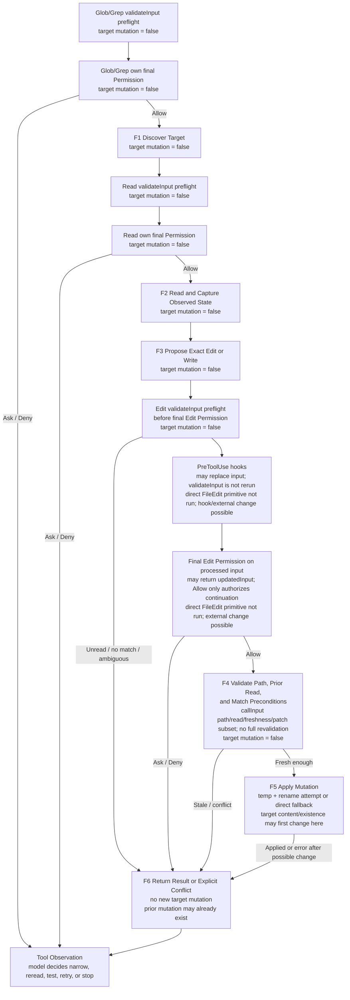

# 05：File Editing Safety——Read 之后，为什么仍然可能写错文件

[← 上一篇：Sandbox Runtime](04-sandbox-runtime.md) · [下一部分：Session Continuity](../03-session-continuity/README.md)

一个 FileEdit 已经得到 Permission Allow，仍然可能不安全：路径可能不是模型以为的目标；模型看过的内容可能已经过期；`old_string` 可能不存在或出现多次；写入可能在替换完成后、结果返回前失败。

所以 File Editing Safety 不是一句“先 Read 再 Write”，而是六层不同证据组成的 optimistic protocol：

1. 选到正确候选；
2. 记录模型实际观察到的内容，以及 runtime 保存的 freshness state；
3. 表达窄而明确的变更；
4. 在真实源码顺序中完成 preflight、Permission 与 call-time recheck；
5. 通过具体 filesystem primitive 尝试 mutation；
6. 把 applied、rejected、conflict 或 post-mutation error 交回 Tool Observation。

先固定两个 owner 边界：

- Permission 回答“这项 direct file mutation candidate 是否获准继续”，不证明文件语义、freshness、match uniqueness 或写入成功。
- Sandbox Runtime 负责适用的 process containment。FileEdit / FileWrite 是 direct file effects；不能把 Bash sandbox 当成它们的 mutation safety owner。

**[Source-confirmed]** 本文固定在源码快照 `712b24f22a63eb6d1a2f86697bf6dbbaa39ae3cf`。真正的 mutation 主线属于 `src/tools/FileEditTool/FileEditTool.ts`、`src/tools/FileWriteTool/FileWriteTool.ts`、`src/utils/file.ts` 与 shared `FileState`；generic Tool executor 仍拥有 validation、Permission、result/error handoff。

## 1. 一张图看完 F1–F6



图顶端的 Permission 不是“一次 Allow 覆盖整条链”。Glob、Grep、Read 与 Edit 各自是 Tool invocation，各自经过自己的授权入口。对最终 Edit invocation，源码还有一个不能藏掉的顺序：

```text
schema parse
→ FileEdit.validateInput preflight
→ PreToolUse hooks, possibly hookUpdatedInput
→ final Edit Permission on processed input, possibly updatedInput
→ FileEdit.call on final callInput, without rerunning validateInput
→ call-time reread and freshness recheck
→ mutation
→ result mapping
```

因此 F1–F6 是跨 Tool 与 helper 的 **[Architectural interpretation]**，不是源码 enum，也不是一个函数逐行对应六个 stage。`PRE` 特意画在 final Edit Permission 前；F4 则只表示 Allow 后、mutation 前的 call-time recheck。计划里的 “atomic-enough” 只可拆成源码实际证明的 in-process no-await critical section 与 atomic rename attempt，不能当作 F5 的保证；因为同一 helper 明确存在 external race 与 non-atomic fallback。

图与下表的 effect-state 只回答“本次 direct File Tool 的 target primitive 是否已改变 target content/existence”，不是“全局 disk 是否完全不变”。PreToolUse hook 是外部可执行 effect，Permission 等待期间 external actor 也可改同一 target；这正是 call-time recheck 的理由。call 在 recheck 前还可能创建 parent directory、写 file-history backup，F5 在替换 target 前也先写 temp file。因此 F5 是 target content/existence 的 first possible change，不是 first filesystem side effect。

这里还不能把 preflight evidence 无条件搬到 F4：PreToolUse hook 可以给出 `hookUpdatedInput`，Permission resolution 也可以返回 `updatedInput`。最终 Permission 会对 processed input 重做 authorization，`tool.call` 使用最后选出的 `callInput`，但 generic executor **不会对它重跑 `FileEdit.validateInput`**。call 只重做 final path 展开、live reread/freshness、actual string、patch/no-change 等子集。原 input 的整套 Tool-specific facts——包括 secret、same-string、size、notebook、create-vs-existing、settings validation，以及最关键的 match cardinality——都不能自动当作 final input 的证据。

**[Source-confirmed tuple]** `(712b24f22a63eb6d1a2f86697bf6dbbaa39ae3cf, src/services/tools/toolExecution.ts, checkPermissionsAndCallTool)`。参见 [hook input replacement](https://github.com/buoylee/Claude-Code-true/blob/712b24f22a63eb6d1a2f86697bf6dbbaa39ae3cf/src/services/tools/toolExecution.ts#L761-L837)、[Permission resolution](https://github.com/buoylee/Claude-Code-true/blob/712b24f22a63eb6d1a2f86697bf6dbbaa39ae3cf/src/services/tools/toolExecution.ts#L921-L932) 与 [final input / call selection](https://github.com/buoylee/Claude-Code-true/blob/712b24f22a63eb6d1a2f86697bf6dbbaa39ae3cf/src/services/tools/toolExecution.ts#L1128-L1207)。

| 节点 | 主要输入 | 输出证据 | 本次 direct File Tool primitive 改变 target content/existence 吗？ |
| --- | --- | --- | --- |
| F1 Discover Target | query、pattern、search root | bounded candidate paths / matches | **没有**；discovery read effects 另算 |
| F2 Read and Capture Observed State | selected path、range | model-facing content + runtime `FileState` | **没有** |
| F3 Propose Exact Edit or Write | observed text、intended change | Edit 或 Write proposal | **没有** |
| F4 Revalidate Preconditions | cache、live bytes/mtime、possibly old-input preflight facts | authorized call candidate 或 conflict；不是完整 revalidation | **没有** |
| F5 Apply Mutation | updated content、encoding、line-ending policy | renamed target、fallback write，或 thrown failure | **第一次可能改变 target content/existence**；temp 等 side effect 可更早发生 |
| F6 Return Result or Conflict | preflight/call error，或 mutation 后 data | Tool-specific result / generic error handoff | **不新增 mutation**；但 target 可能已在 F5 改变 |

## 2. 先定义状态，再谈“读过”

### 2.1 六种 representation

本文中的名词严格分开：

| representation | 含义 | 不等于 |
| --- | --- | --- |
| discovered path | Glob/Grep 返回的候选路径 | intended target |
| observed content | 模型在 Read Tool Observation 里看到的编号文本 | cache 中的原始 normalized content |
| observed state | runtime 为路径保存的 `FileState` | hash、transaction version、open file descriptor |
| edit proposal | `file_path + old_string + new_string + replace_all` | 已验证 patch |
| validated candidate | preflight 对当时 input、final Permission 对 processed input、call-time check 对最终 `callInput` 的证据 | 全程是同一 input；完整 revalidation；atomic compare-and-swap |
| mutation result | target bytes、structured patch / create-update data | tests passed 或 session 已持久化 |

### 2.2 Read 实际记录什么

`FileState` 的准确形状是：

```text
{
  content: string,
  timestamp: number,
  offset: number | undefined,
  limit: number | undefined,
  isPartialView?: boolean
}
```

对普通 text Read：

- model-facing observation 会加 line numbers，也可能加 reminder；
- cache 中的 `content` 是未编号、CRLF 已 normalize 成 LF 的内容；
- `timestamp` 是 `Math.floor(mtimeMs)`；
- `offset` 与 `limit` 记录这次 Read range；默认 `offset=1`；
- `isPartialView` 不是“普通 range Read”的标记。它专门表示 auto-injected view 与 disk 不一致，例如被裁剪或剥除 frontmatter，Edit/Write 会要求显式 Read。

这不是 content hash，也不是 opaque version。正常 freshness predicate 是：

```text
currentFloorMtime > cachedTimestamp
```

它不是 `!==`。因此只能检测“当前整数毫秒 mtime 严格更大”的变化；相同或倒退的 mtime 不会被这个比较发现。

还有一个更细的边界：普通显式 Read 总会保存 `offset`，所以它产生的 entry 不满足“full-state content fallback”——`offset === undefined && limit === undefined`。Edit/Write 成功后确实会写入这种形状，但这个 predicate **没有 producer tag**：Bash simulated edit、NotebookEdit、transcript reconstruction、client seed，以及部分 attachment injection 也可能产生同形状 entry；`isPartialView` entry 则会先被拒绝。因此只能称它为 **full-state-shaped cache entry**，不能从形状反推“一定来自 Edit/Write”。一个显式 Read entry 若遇到 newer mtime，不会靠 content equality 放行。

更关键的是，`offset/limit` 只是 state metadata，不是 changed-region coverage gate。只要 entry 存在、不是 `isPartialView`，且 current floored mtime 没有严格变大，一个很窄的 ranged Read 就能通过 Edit/Write 的 prior-read presence/freshness check。FileEdit 随后会重读整个文件并在 live content 中寻找 `old_string`，却不会证明该 match 位于模型实际看过的 range 内；FileWrite 也不会要求先观察完整文件，便可能进入 whole-file replacement。因此源码保证的是 **path-level prior-read state + optimistic freshness**，不是“被修改片段已被观察”。range metadata 的强制作用主要出现在 newer-mtime 分支：普通 Read entry 不具备 full-state content-equality fallback。

**[Source-confirmed tuple]** `(712b24f22a63eb6d1a2f86697bf6dbbaa39ae3cf, src/tools/FileEditTool/FileEditTool.ts, validateInput / call)` 与 `(712b24f22a63eb6d1a2f86697bf6dbbaa39ae3cf, src/tools/FileWriteTool/FileWriteTool.ts, validateInput / call)`。参见 [Edit presence/freshness](https://github.com/buoylee/Claude-Code-true/blob/712b24f22a63eb6d1a2f86697bf6dbbaa39ae3cf/src/tools/FileEditTool/FileEditTool.ts#L275-L311)、[Edit call-time check](https://github.com/buoylee/Claude-Code-true/blob/712b24f22a63eb6d1a2f86697bf6dbbaa39ae3cf/src/tools/FileEditTool/FileEditTool.ts#L451-L468)、[Write presence/freshness](https://github.com/buoylee/Claude-Code-true/blob/712b24f22a63eb6d1a2f86697bf6dbbaa39ae3cf/src/tools/FileWriteTool/FileWriteTool.ts#L198-L219) 与 [Write call-time check](https://github.com/buoylee/Claude-Code-true/blob/712b24f22a63eb6d1a2f86697bf6dbbaa39ae3cf/src/tools/FileWriteTool/FileWriteTool.ts#L279-L295)。

**[General principle]** 安全工作流仍应显式 Read 将要修改的相关区域，并从该 observation 重建 intent；这是比当前 runtime gate 更强的操作纪律，不能冒充源码已经强制的 invariant。

**[Source-confirmed tuple]** `(712b24f22a63eb6d1a2f86697bf6dbbaa39ae3cf, src/utils/fileStateCache.ts, FileState)` 与 `(712b24f22a63eb6d1a2f86697bf6dbbaa39ae3cf, src/tools/FileReadTool/FileReadTool.ts, callInner / mapToolResultToToolResultBlockParam)`。参见 [`FileState`](https://github.com/buoylee/Claude-Code-true/blob/712b24f22a63eb6d1a2f86697bf6dbbaa39ae3cf/src/utils/fileStateCache.ts#L4-L15)、[`callInner`](https://github.com/buoylee/Claude-Code-true/blob/712b24f22a63eb6d1a2f86697bf6dbbaa39ae3cf/src/tools/FileReadTool/FileReadTool.ts#L804-L1086) 与 [result mapping](https://github.com/buoylee/Claude-Code-true/blob/712b24f22a63eb6d1a2f86697bf6dbbaa39ae3cf/src/tools/FileReadTool/FileReadTool.ts#L652-L717)。

**[Source-confirmed producer tuples]** `(712b24f22a63eb6d1a2f86697bf6dbbaa39ae3cf, src/tools/BashTool/BashTool.tsx, applySedEdit)`、`(712b24f22a63eb6d1a2f86697bf6dbbaa39ae3cf, src/tools/NotebookEditTool/NotebookEditTool.ts, call)`、`(712b24f22a63eb6d1a2f86697bf6dbbaa39ae3cf, src/utils/queryHelpers.ts, extractReadFilesFromMessages)`、`(712b24f22a63eb6d1a2f86697bf6dbbaa39ae3cf, src/cli/print.ts, runHeadlessStreaming seed_read_state branch)` 与 `(712b24f22a63eb6d1a2f86697bf6dbbaa39ae3cf, src/utils/attachments.ts, memoryFilesToAttachments)`。参见 [Bash simulated edit](https://github.com/buoylee/Claude-Code-true/blob/712b24f22a63eb6d1a2f86697bf6dbbaa39ae3cf/src/tools/BashTool/BashTool.tsx#L360-L409)、[NotebookEdit](https://github.com/buoylee/Claude-Code-true/blob/712b24f22a63eb6d1a2f86697bf6dbbaa39ae3cf/src/tools/NotebookEditTool/NotebookEditTool.ts#L295-L442)、[transcript reconstruction](https://github.com/buoylee/Claude-Code-true/blob/712b24f22a63eb6d1a2f86697bf6dbbaa39ae3cf/src/utils/queryHelpers.ts#L346-L490)、[client seed](https://github.com/buoylee/Claude-Code-true/blob/712b24f22a63eb6d1a2f86697bf6dbbaa39ae3cf/src/cli/print.ts#L3017-L3052) 与 [attachment injection](https://github.com/buoylee/Claude-Code-true/blob/712b24f22a63eb6d1a2f86697bf6dbbaa39ae3cf/src/utils/attachments.ts#L1710-L1750)。

### 2.3 Read state 也不是 atomic snapshot

text fast path 先 `stat`，再 async `readFile`，最后把较早的 `stats.mtimeMs` 与读到的 text 一起返回。若外部进程恰好夹在两者之间修改文件，源码没有建立 atomic `(content, mtime)` pair。

这不代表 protocol 毫无价值；它代表正确术语是 **optimistic freshness evidence**，而不是 filesystem transaction。

**[Source-confirmed tuple]** `(712b24f22a63eb6d1a2f86697bf6dbbaa39ae3cf, src/utils/readFileInRange.ts, readFileInRange)`，参见 [source](https://github.com/buoylee/Claude-Code-true/blob/712b24f22a63eb6d1a2f86697bf6dbbaa39ae3cf/src/utils/readFileInRange.ts#L73-L122)。

## 3. 六层 safety owner

| layer | concrete owner | prevents / detects | 仍然不能证明 |
| --- | --- | --- | --- |
| authorization | generic Permission + FileEdit/FileWrite `checkPermissions` | path deny/ask、safety Ask、mode/rule decision | semantic target、freshness、match uniqueness、effect success |
| path/workspace | `checkWritePermissionForTool` | original/resolved-symlink rules；protected paths；`acceptEdits` 只对 allowed working path auto-Allow | OS sandbox；外部 path 必然不获准；路径就是 intended target |
| prior observation/freshness | `FileState` + Edit/Write `validateInput` + call recheck | missing cache、auto-partial state、strictly newer mtime | hash identity、equal-mtime change、external post-check race |
| exact match/cardinality | FileEdit `validateInput`、`findActualString` | preflight input 的 no match；multiple match + `replace_all=false`；quote normalization | Write contract；call **不会**在 Permission 后再次统计 cardinality；updated input **没有**重跑整套 Tool-specific validation |
| mutation mechanics | `writeTextContent` → `writeFileSyncAndFlush_DEPRECATED` | temp+flush+mode+rename attempt；symlink target preservation；fallback | end-to-end atomicity、CAS、failure 时 target 一定未变 |
| result/observation | Tool `call` data、map function、generic executor | structured patch/create-update evidence 或 explicit error | rollback、tests passed、durable transcript/session |

### 3.1 Path scope 不是一个 binary sandbox

`checkWritePermissionForTool` 会对 original path 与 resolved symlink path 检查 deny；再处理 internal editable paths、protected-path safety、ask rule、`acceptEdits` working-path Allow、ordinary allow rule，最后 default Ask。

因此：

- outside working directory 不等于 universal Deny；没有 matching rule 时通常变 Ask；
- explicit user/rule Allow 可以授权 working path 之外的 candidate；
- `acceptEdits` 也不是 blanket write access；
- 这些仍属于 Permission owner，不是 Bash Sandbox 的 direct-file containment。

**[Source-confirmed tuple]** `(712b24f22a63eb6d1a2f86697bf6dbbaa39ae3cf, src/utils/permissions/filesystem.ts, checkWritePermissionForTool)`，参见 [source](https://github.com/buoylee/Claude-Code-true/blob/712b24f22a63eb6d1a2f86697bf6dbbaa39ae3cf/src/utils/permissions/filesystem.ts#L1205-L1412)。

## 4. Canonical targeted edit：修一个 failing test

假设候选 test file 中只有一次：

```ts
expect(status).toBe(500)
```

目标是改成：

```ts
expect(status).toBe(503)
```

### 4.1 四个关键 state snapshot

| snapshot | disk | runtime cache | model knowledge | direct FileEdit target mutation |
| --- | --- | --- | --- | --- |
| before Read | `C0`，mtime `T0` | no entry / stale entry | 只知道 search candidate | false |
| after Read | 仍是 `C0` | `{content:C0,timestamp:floor(T0),offset:1,limit}` | 看见 line-numbered `C0` | false |
| before Edit call | preflight 已读 current bytes、验证 one match；final Permission = Allow | cache 仍指向 observed state | proposal 是 narrow replacement | false |
| after mutation | 成功时为 `C1` | 稍后写 `{content:C1,timestamp:stat,offset:undefined,limit:undefined}` | 尚待 Tool Observation | true / uncertain on failure |

### 4.2 实际 happy path

1. **F1 Discover Target。** Glob/Grep 缩小到 test file；若结果有 truncation/pagination evidence，就继续 narrow，而不是把第一批当全集。
2. **F2 Read。** Read 返回编号内容，runtime 保存 normalized `content + floored mtime + range`。
3. **F3 Propose。** 模型构造 `old_string` / `new_string`，并让 old text 带够上下文以唯一匹配。
4. **preflight，发生在 final Permission 前。** generic executor 先调用 `FileEdit.validateInput`。它扩展 path、检查 early deny/secret/size/notebook、读取 bytes、要求 cache、比较 mtime、normalize quote、找 actual string 并计算 match count。
5. **final Edit Permission。** 这个 canonical happy path 假定 hook / Permission 没有改 input。一般情形中，PreToolUse hook 可替换 processed input，Permission resolution 也可返回 `updatedInput`；final decision 针对更新后的 candidate。非 Allow 在 target mutation 前闭合，但 Allow 后不会重跑 `validateInput`，所以旧 input 的整套 Tool-specific preflight facts 都不能无条件继承。
6. **F4 call-time recheck。** Allow 后进入 `FileEdit.call`。所有可能 await 的 skill discovery、directory creation 与 file-history backup 先完成；然后同步读取 current content/encoding/endings，再查 current mtime 与 cache。
7. **构造 patch。** call 重新计算 `actualOldString`、preserve quote style，再由 `getPatchForEdit` 得到 `updatedFile` 与 structured patch。
8. **F5 mutation。** `writeTextContent` 进入具体 filesystem helper。
9. **F6 result。** cache 更新成 post-edit full state；optional git diff、Tool data、generic mapping 与 hooks 完成后，模型收到“updated” observation。是否跑 test 是下一次模型决策，不是 FileEdit success 的含义。

### 4.3 stale/conflict rejection

如果 Read 后 linter/user 让 current floored mtime 严格大于 cache timestamp：

- preflight 就可能返回 “modified since read”；
- 即使 preflight 当时通过，hooks/Permission 期间发生变化，`FileEdit.call` 还会 reread/recheck 并在 `writeTextContent` 前抛 `FILE_UNEXPECTEDLY_MODIFIED_ERROR`。

这条分支没有执行 direct FileEdit target primitive；它检测到的 staleness 本身可能正是 external actor 已改变 target 的证据。

但是两次 check 都不是 compare-and-swap。若变化没有产生 strictly newer floored mtime，或外部进程在 call-time sync read/check 后、rename 前竞争，源码不能保证 conflict 被检测。

## 5. Match cardinality：exact edit 的真正边界

`FileEdit.validateInput` 先通过 `findActualString` 处理 quote normalization，再计算：

```text
matches = file.split(actualOldString).length - 1
```

分支是：

| condition | result before direct FileEdit target mutation |
| --- | --- |
| no actual string | reject：`String to replace not found` |
| one match | `replace_all=false` 可以继续 |
| more than one + `replace_all=false` | reject，并要求提供更多 context 或显式 `replace_all=true` |
| more than one + `replace_all=true` | later `String.replaceAll` |

actual replacement 使用 callback：

```ts
replaceAll
  ? content.replaceAll(search, () => replacement)
  : content.replace(search, () => replacement)
```

callback 避免 `new_string` 中的 `$&`、`$1` 等被当成 replacement token。

这里有一个重要限制：cardinality check 属于 **pre-Permission validateInput**。`FileEdit.call` 会重新找 actual string，也会在 patch helper 中对 no-change/no-match 抛错，但不会再次执行 “matches > 1 and !replace_all” 这条 cardinality check。正常 mtime recheck 会挡住大多数期间变化，却不能把它升级成 atomic uniqueness guarantee。

而且这不只是一条 filesystem TOCTOU：hook 的 `hookUpdatedInput` 或 Permission 的 `updatedInput` 可以在 preflight 后改变 `file_path`、`old_string`、`new_string` 或 `replace_all`。final Permission 会对 processed input 重做 authorization，call 也会对最终 path 做 reread/freshness 并重新构造 actual string/patch；但它只覆盖这部分子集。旧 input 的 secret、same-string、size、notebook、create-vs-existing、settings 与 cardinality facts不会自动迁移成新 input 的证据。若安全设计要求“获准调用的 exact replacement 必须完整 validate”，就必须在 input 更新后重跑 Tool-specific validation；该快照没有这一步。

**[Source-confirmed tuple]** `(712b24f22a63eb6d1a2f86697bf6dbbaa39ae3cf, src/tools/FileEditTool/FileEditTool.ts, validateInput / call)` 与 `(712b24f22a63eb6d1a2f86697bf6dbbaa39ae3cf, src/tools/FileEditTool/utils.ts, applyEditToFile / getPatchForEdits)`。参见 [validateInput](https://github.com/buoylee/Claude-Code-true/blob/712b24f22a63eb6d1a2f86697bf6dbbaa39ae3cf/src/tools/FileEditTool/FileEditTool.ts#L137-L362)、[call](https://github.com/buoylee/Claude-Code-true/blob/712b24f22a63eb6d1a2f86697bf6dbbaa39ae3cf/src/tools/FileEditTool/FileEditTool.ts#L387-L574)、[replacement](https://github.com/buoylee/Claude-Code-true/blob/712b24f22a63eb6d1a2f86697bf6dbbaa39ae3cf/src/tools/FileEditTool/utils.ts#L206-L228)。

## 6. Edit 与 Write 是两个 contract

| case | FileEdit | FileWrite |
| --- | --- | --- |
| existing nonempty file | targeted replace；要求 prior cache；no/multiple match checks | whole-file replacement；要求 prior cache；没有 old-string contract |
| missing file | 只有 `old_string === ''` 才允许创建 | 直接允许创建，不要求 prior Read |
| existing empty / whitespace-only file | empty old string 让 preflight 提前通过；但 `call` 看到 `fileExists=true` 后仍要求 prior cache，之后才可整文件替换 | 可以 overwrite；同样要求 prior cache；empty file 的 result branch 因 `if (oldContent)` 会返回 create-shaped data |
| existing nonempty + empty old | reject “file already exists” | n/a；Write 本来就是完整 overwrite |
| stale preflight | newer mtime；full-state-shaped cache 的 content fallback 可用 | newer mtime 直接 reject，没有 preflight content fallback |
| stale call-time | newer mtime；full-state-shaped cache 的 content-equality fallback | 同样的 call-time fallback |
| no / multiple match | Edit-only reject / `replace_all` | n/a |
| encoding | preflight按 UTF-16LE BOM 或 UTF-8 解读；call 检测并保留 existing encoding | existing encoding 保留；new file 默认 UTF-8 |
| line endings | current CRLF normalize 后编辑，再按 detected ending 恢复 | 将 `content` 当作完整意图；以 `'LF'` 调 helper，实际是不做 newline rewrite，输入里的 CRLF 仍保留 |
| size | existing file 超过 `MAX_EDIT_FILE_SIZE` reject | examined Write contract 没有同一 size check |
| notebook | 正常分支中 `.ipynb` reject，要求 NotebookEdit；但 empty/whitespace + empty old 的 early-valid branch 先于 notebook check，call 仍要求 cache | examined Write contract 没有同一 notebook reject |
| symlink | permission检查 original/resolved path；helper 写 resolved target、保留 link | 相同 shared mechanics |

### 6.1 Write 不是“Edit 但没有 old_string”

Write 的 proposal 是 `{file_path, content}`。对 existing file：

1. preflight stat；
2. cache 必须存在且非 `isPartialView`；
3. newer mtime 直接 reject；
4. final Permission；
5. call synchronously rereads whole existing file并再次检查；
6. 完整替换。

对 missing file，preflight 的 ENOENT branch 直接 valid；call 用 UTF-8 与 `oldContent=null` 创建。

因此不能把 Edit 的 uniqueness、`replace_all`、一般 notebook 或 size invariant 泛化给 Write。反过来，也不能把 Write 的“missing path always creatable candidate”泛化给 Edit；Edit 还要求 empty old string。即使在 Edit 内部，empty/whitespace early-valid branch 也证明这些 check 有顺序，不能把“有 notebook guard”说成无条件执行。

还要区分 preflight 与 end-to-end contract：existing empty / whitespace-only file 加 empty `old_string` 会在 `FileEdit.validateInput` 的 prior-read branch 前返回 valid；但 `FileEdit.call` 随后只要看到 `fileExists=true`，仍会取 `lastRead`，缺失时抛 `FILE_UNEXPECTEDLY_MODIFIED_ERROR`。所以只有真正 missing 的 create branch 不要求 prior Read；既存空文件仍要求。

**[Source-confirmed tuple]** `(712b24f22a63eb6d1a2f86697bf6dbbaa39ae3cf, src/tools/FileWriteTool/FileWriteTool.ts, validateInput / call / mapToolResultToToolResultBlockParam)`，参见 [validateInput](https://github.com/buoylee/Claude-Code-true/blob/712b24f22a63eb6d1a2f86697bf6dbbaa39ae3cf/src/tools/FileWriteTool/FileWriteTool.ts#L153-L222)、[call](https://github.com/buoylee/Claude-Code-true/blob/712b24f22a63eb6d1a2f86697bf6dbbaa39ae3cf/src/tools/FileWriteTool/FileWriteTool.ts#L223-L417) 与 [mapping](https://github.com/buoylee/Claude-Code-true/blob/712b24f22a63eb6d1a2f86697bf6dbbaa39ae3cf/src/tools/FileWriteTool/FileWriteTool.ts#L418-L433)。

### 6.2 existing empty file 的 result nuance

Write 用 `if (oldContent)` 区分 update / create。existing empty file 的 `oldContent === ''`，所以 filesystem 操作是 overwrite existing file，结果却走 create-shaped branch。

这证明 result label 是 Tool 的 rendering branch，不是权威 filesystem history。文档不能倒推“显示 created，所以之前一定不存在”。

## 7. Discovery 只负责降低 uncertainty

### 7.1 Glob

Glob 默认使用 bounded result limit，data 明确携带 `truncated`；mapping 会追加：

```text
(Results are truncated. Consider using a more specific path or pattern.)
```

看到这条 evidence 后，正确动作是缩小 path/pattern，不是从 incomplete list 随便选一个文件。

**[Source-confirmed tuple]** `(712b24f22a63eb6d1a2f86697bf6dbbaa39ae3cf, src/tools/GlobTool/GlobTool.ts, call / mapToolResultToToolResultBlockParam)`，参见 [source](https://github.com/buoylee/Claude-Code-true/blob/712b24f22a63eb6d1a2f86697bf6dbbaa39ae3cf/src/tools/GlobTool/GlobTool.ts#L154-L197)。

### 7.2 Grep

Grep result 保留 `appliedLimit` / `appliedOffset`，mapping 会把 pagination 显示出来。它能把 candidate 缩到包含 failing assertion 的 path/line，但 search result 仍不是 prior-read state；FileEdit freshness 依赖 `readFileState`，不是“Grep 看过”。

**[Source-confirmed tuple]** `(712b24f22a63eb6d1a2f86697bf6dbbaa39ae3cf, src/tools/GrepTool/GrepTool.ts, call / mapToolResultToToolResultBlockParam)`，参见 [call](https://github.com/buoylee/Claude-Code-true/blob/712b24f22a63eb6d1a2f86697bf6dbbaa39ae3cf/src/tools/GrepTool/GrepTool.ts#L49-L315) 与 [mapping](https://github.com/buoylee/Claude-Code-true/blob/712b24f22a63eb6d1a2f86697bf6dbbaa39ae3cf/src/tools/GrepTool/GrepTool.ts#L254-L309)。

### 7.3 Read

显式 live Read 会为明确 path 建立 ordinary Read `FileState`。但 runtime 只要求 non-partial entry 存在且 mtime 不更新，并不检查 Edit match 是否落在 Read range；range、size/token limit、empty/offset warning 与 `file_unchanged` stub 则会改变模型实际看到什么。**[General principle]** 形成 edit 时应依据相关区域的 Tool Observation，而不是把 path-level presence gate 或 discovery output 当成完整观察；也不要把其他 seed producer 的同形状 cache entry 误称为这次显式 Read。

## 8. Mutation primitive：哪里“atomic”，哪里不 atomic

### 8.1 In-process critical section

Edit/Write 在 call 中把所有 planned `await` 放在 freshness recheck 之前。进入下面的同步段后：

```text
sync reread
→ sync stat/cache freshness check
→ sync patch/content construction
→ writeTextContent
```

没有 async yield，防止同一个 JavaScript event loop 上的另一个 async task 在 check 与 write 之间插入。

这只是 in-process scheduling property。external editor、linter、另一个 process 或 filesystem actor 仍可在这段时间改变 path。

### 8.2 Concrete write helper

`writeTextContent` 先按 policy 处理 line endings，再调用 `writeFileSyncAndFlush_DEPRECATED`。后者：

1. 在 write-attempt `try` **之前**探测 symlink target；
2. 同样在 `try` 之前读取 existing mode：`ENOENT` 作为新文件继续，其他 stat error 直接抛出；
3. 进入 `try` 后写 `target.tmp.<pid>.<time>`，设置 `flush:true`；
4. 对 existing target 把原 mode 应用给 temp；
5. 尝试 `renameSync(temp, target)`；
6. 只有步骤 3–5 的 temp-write / chmod / rename 抛错，才进入 catch、尝试清理 temp；
7. 该 catch 随后用 `fsWriteFileSync(target,...,flush:true)` 做 **non-atomic fallback**。

所以最准确结论是：

- target 第一次可能改变在 rename 或 direct fallback；
- temp-file creation 已经是另一个 filesystem side effect；
- pre-`try` 的非 `ENOENT` stat/mode failure 会直接抛出：temp/target primitive 尚未开始，也不会进入 fallback；
- source comment 只把 POSIX rename 称为 atomic，不能扩张成整个 protocol、所有 platform 或 fallback 都 atomic；
- fallback write 抛错时，没有 rollback，也没有“零 bytes”保证。

**[Source-confirmed tuple]** `(712b24f22a63eb6d1a2f86697bf6dbbaa39ae3cf, src/utils/file.ts, writeTextContent / writeFileSyncAndFlush_DEPRECATED)`，参见 [`writeTextContent`](https://github.com/buoylee/Claude-Code-true/blob/712b24f22a63eb6d1a2f86697bf6dbbaa39ae3cf/src/utils/file.ts#L84-L98) 与 [write helper](https://github.com/buoylee/Claude-Code-true/blob/712b24f22a63eb6d1a2f86697bf6dbbaa39ae3cf/src/utils/file.ts#L362-L478)。

### 8.3 Check-to-write 的 TOCTOU

这里有两个不同 window：

1. **long window：** `validateInput` 在 hooks/Permission 前；期间不仅 file 可以变化，hooks/Permission 还可能替换 input。final Permission 重做 authorization；call 只对最终 input 重做 path/read/freshness/actual-string/patch/no-change 子集，不会重跑完整 `validateInput`。cardinality 是最危险的例子，却不是唯一失效的 preflight fact。
2. **short window：** call-time sync reread/check 与 rename/direct write 之间没有 await，但 external actor 仍可竞争；rename 也不是 conditional CAS。

**[General principle]** 若安全目标要求“只有 current bytes 精确等于 observed bytes 才替换”，需要 OS-level conditional primitive、lock/lease 或 content-addressed compare-and-swap。该 pinned source 没有建立这些保证。

## 9. Failure、abort 与 result uncertainty

| situation | mutation primitive begun? | source-visible outcome | target state |
| --- | --- | --- | --- |
| nonexistent Edit target + nonempty old | no | validation error + suggestion | unchanged by invocation |
| nonexistent Edit target + empty old | later yes | create candidate | success时为 new content |
| nonexistent Write target | later yes | create candidate | success时为 new content |
| unread existing target | no | Read/validation error | unchanged by mutation Tool |
| cache missing / `isPartialView` | no | “Read it first” | unchanged |
| newer mtime | no | preflight error or call-time conflict | unchanged by invocation |
| no / ambiguous match | no | Edit error | unchanged |
| pre-`try` target stat/mode discovery 遇到 non-`ENOENT` error | no temp/target write | error 直接抛出；没有 fallback | target 未被本次 helper 写入 |
| atomic temp path fails before rename | temp may exist | cleanup attempt then fallback | target尚未由 rename 改；fallback另算 |
| fallback direct write throws | yes | generic Tool error | unchanged / partial / complete 均未由源码排除 |
| write succeeds，post-write stat/diff/result fails | completed | generic Tool error | **可能已经是新内容** |

表中的 “unchanged” 仍只表示 direct File Tool primitive 没改 target；hook 或 external actor 的效果必须单独判断。

### 9.1 Abort before mutation

generic `runToolUse` 在进入 streamed execution 前检查 `abortController.signal.aborted`。若已 aborted，它返回 cancellation Tool result，不进入 validation/Permission/call，因此本 invocation 不改变 target。

### 9.2 Abort during direct FileEdit/FileWrite

FileEdit/Write `call` 不读取 abort signal。initial gate 之后还有 validation、hooks、Permission 与 awaited preparation；signal 在这些阶段变成 aborted，并没有一个 source-confirmed direct-file check 保证阻止后面的同步 mutation。

因此：

- “initial gate 已看到 aborted”可以推出本 invocation 没有 direct target mutation；
- “用户在 Edit 期间按了 interrupt”不能单独推出 no bytes；
- mutation 已完成后 signal 再变化，更不能回滚。

FileRead 不同：它会把 signal 交给 `readFileInRange`。不要把 Read cancellation contract 泛化给 Edit/Write。

**[Source-confirmed tuple]** `(712b24f22a63eb6d1a2f86697bf6dbbaa39ae3cf, src/services/tools/toolExecution.ts, runToolUse / checkPermissionsAndCallTool)`，参见 [initial abort gate](https://github.com/buoylee/Claude-Code-true/blob/712b24f22a63eb6d1a2f86697bf6dbbaa39ae3cf/src/services/tools/toolExecution.ts#L415-L455)、[validation before Permission](https://github.com/buoylee/Claude-Code-true/blob/712b24f22a63eb6d1a2f86697bf6dbbaa39ae3cf/src/services/tools/toolExecution.ts#L675-L733) 与 [call/result/error route](https://github.com/buoylee/Claude-Code-true/blob/712b24f22a63eb6d1a2f86697bf6dbbaa39ae3cf/src/services/tools/toolExecution.ts#L1206-L1741)。

### 9.3 为什么 Tool error 不等于 file unchanged

mutation 后仍有：

- `getFileModificationTime` 与 cache update；
- LSP/VSCode notification；
- optional git diff；
- Write update patch 与 create/update data；
- Tool-specific mapping；
- generic result processing 与 PostToolUse hooks。

这些都没有 rollback branch。generic try/catch 可以把其中的 throw 转成 error Tool result；它报告 execution pipeline 失败，不重新证明 target bytes。

相反，success result 也只证明该 pipeline 走完。它没有运行 failing test，也没有证明 semantic correctness。

## 10. Source-shaped pseudocode

先写真实 outer order：

```text
function runEditCandidate(input, context):
    parsed = FileEdit.inputSchema.parse(input)

    preflight = FileEdit.validateInput(parsed, context)
    if preflight rejects:
        return Rejected(preflight.message)

    processedInput = parsed
    hookResult = runPreToolUseHooks(processedInput)
    if hookResult has hookUpdatedInput:
        processedInput = hookResult.updatedInput

    resolved = resolvePermission(hookResult.permission, processedInput)
    decision = resolved.decision
    processedInput = resolved.input
    if decision has updatedInput:
        processedInput = decision.updatedInput
    if decision is not Allow:
        return Rejected(decision)

    callInput = selectFinalCallInput(processedInput)
    # FileEdit.validateInput(callInput) is NOT rerun here.
    # Canonical targeted branch below models callInput.replace_all=false.
    return applyTargetedEdit(
        callInput.file_path,
        context.readFileState.get(expandPath(callInput.file_path)),
        callInput.old_string,
        callInput.new_string
    )
```

再写 requested core：

```text
applyTargetedEdit(path, observedState, oldText, newText)
    -> Applied | Conflict | Rejected

function applyTargetedEdit(path, observedState, oldText, newText):
    replaceAll = false  # canonical targeted-edit branch

    # awaited setup already happened; direct target primitive has not run.
    # Hooks/external actors may have changed the target; setup may have other fs effects.
    current = readFileForEdit(path)  # content, exists, encoding, endings

    if current.exists:
        currentMtime = floor(stat(path).mtimeMs)
        latestObserved = observedState  # current cache entry selected for final path

        if latestObserved is missing
           or currentMtime > latestObserved.timestamp:
            fullStateShape =
                latestObserved exists
                and latestObserved.offset is undefined
                and latestObserved.limit is undefined

            if not (
                fullStateShape
                and current.content == latestObserved.content
            ):
                return Conflict("unexpectedly modified")

    actualOld = findActualString(current.content, oldText) ?? oldText

    # Source call recomputes actualOld and patch/no-change,
    # but does not repeat preflight's multiple-match count.
    patch, updated = getPatchForEdit(
        path, current.content, actualOld, newText, replaceAll
    )
    if patch construction throws:
        return Rejected("no applicable change")

    try:
        writeTextContent(path, updated, current.encoding, current.endings)
    catch error:
        return Conflict("write outcome may be uncertain", error)

    # No rollback surrounds the remaining steps.
    readFileState.set(path, {
        content: updated,
        timestamp: floor(stat(path).mtimeMs),
        offset: undefined,
        limit: undefined
    })
    return Applied(patch, updated)
```

**[Architectural interpretation]** `Applied | Conflict | Rejected` 是教学用 algebraic result；源码实际通过 validation result、thrown Error、Tool data 与 generic error mapping 表达这些 branch。这里固定 canonical `replace_all=false`；`replace_all=true` 复用相同 safety 边界，只把 replacement 改为 all matches。伪代码刻意没有补上一条源码不存在的 call-time cardinality recheck，也没有把 caught error 写成“target unchanged”。`fullStateShape` 也只检查字段形状，不推断 cache producer。

## 11. 决定性源码 lenses

本章 F1–F6 的 claim-oriented 证据表见 [Source Evidence Index](../appendices/source-evidence-index.md#35-f1f6-file-editing-safety)。

### Lens A：Tool-specific validation 在 Permission 前

**[Source-confirmed tuple]** `(712b24f22a63eb6d1a2f86697bf6dbbaa39ae3cf, src/services/tools/toolExecution.ts, checkPermissionsAndCallTool)`。

```ts
const isValidCall = await tool.validateInput?.(
  parsedInput.data,
  toolUseContext,
)
if (isValidCall?.result === false) return validationError

// Later, a hook may replace processedInput.
case 'hookUpdatedInput':
  processedInput = result.updatedInput

const resolved = await resolveHookPermissionDecision(/* ... */)
if (resolved.decision.behavior !== 'allow') return permissionError

processedInput = resolved.input
if (resolved.decision.updatedInput !== undefined) {
  processedInput = resolved.decision.updatedInput
}

// No second tool.validateInput call occurs before this call.
if (processedInput !== backfilledClone) callInput = processedInput
const result = await tool.call(callInput, /* ... */)
```

这段建立 actual order：preflight 可以读取 path/content 并拒绝；hooks/Permission 可在之后更新 input；final Permission 仍在 direct FileEdit target primitive 前；Allow 后以最终 `callInput` 进入 call，而不是重跑 `validateInput`。

### Lens B：Read 保存 normalized content 与 floored mtime

**[Source-confirmed tuple]** `(712b24f22a63eb6d1a2f86697bf6dbbaa39ae3cf, src/tools/FileReadTool/FileReadTool.ts, callInner)`。

```ts
readFileState.set(fullFilePath, {
  content,
  timestamp: Math.floor(mtimeMs),
  offset,
  limit,
})
```

这就是 freshness state 的 identity；没有 hash field。

### Lens C：Edit preflight 拥有 uniqueness

**[Source-confirmed tuple]** `(712b24f22a63eb6d1a2f86697bf6dbbaa39ae3cf, src/tools/FileEditTool/FileEditTool.ts, validateInput)`。

```ts
const actualOldString = findActualString(file, old_string)
if (!actualOldString) return notFound

const matches = file.split(actualOldString).length - 1
if (matches > 1 && !replace_all) return ambiguous
```

no match / ambiguous 在 mutation 前闭合；Write 没有这段 contract。

### Lens D：Allow 后再同步 recheck

**[Source-confirmed tuple]** `(712b24f22a63eb6d1a2f86697bf6dbbaa39ae3cf, src/tools/FileEditTool/FileEditTool.ts, call)`。

```ts
const current = readFileForEdit(absoluteFilePath)
const lastWriteTime = getFileModificationTime(absoluteFilePath)
const lastRead = readFileState.get(absoluteFilePath)

if (!lastRead || lastWriteTime > lastRead.timestamp) {
  if (!contentUnchanged) throw new Error(FILE_UNEXPECTEDLY_MODIFIED_ERROR)
}

const { patch, updatedFile } = getPatchForEdit(/* ... */)
writeTextContent(absoluteFilePath, updatedFile, encoding, endings)
```

这段没有 await，缩小同进程 interleaving window；它仍不是 external CAS。

### Lens E：atomic attempt 明确带 non-atomic fallback

**[Source-confirmed tuple]** `(712b24f22a63eb6d1a2f86697bf6dbbaa39ae3cf, src/utils/file.ts, writeFileSyncAndFlush_DEPRECATED)`。

```ts
targetMode = fs.statSync(targetPath).mode // before try; non-ENOENT error escapes

try {
  fsWriteFileSync(tempPath, content, { encoding, flush: true })
  fs.renameSync(tempPath, targetPath)
} catch (atomicError) {
  try { fs.unlinkSync(tempPath) } catch { /* cleanup failure is swallowed */ }
  fsWriteFileSync(targetPath, content, { encoding, flush: true })
}
```

fallback 只覆盖 write-attempt `try` 内的 temp-write / chmod / rename failure；pre-`try` path/mode discovery failure 直接抛出。任何“FileEdit 总是 atomic”或“helper 任何失败都会 fallback”的回答都超过了源码。

### Lens F：mutation 后才完成 observation

**[Source-confirmed tuple]** `(712b24f22a63eb6d1a2f86697bf6dbbaa39ae3cf, src/tools/FileEditTool/FileEditTool.ts, call / mapToolResultToToolResultBlockParam)` 与 `(712b24f22a63eb6d1a2f86697bf6dbbaa39ae3cf, src/services/tools/toolExecution.ts, checkPermissionsAndCallTool)`。

FileEdit 先写 disk，再 stat/update cache、optional fetch git diff、return data；generic executor 再 mapping、result processing 与 hooks。throw 会进入 generic error route，没有 inverse edit。

## 12. 设计取舍

**[General principle]** 本节从 source-confirmed mechanics 推导设计取舍；它不是在声称 pinned source 已实现更强的 CAS、lock、rollback 或跨进程协调。

### 12.1 mtime cache vs content hash

mtime + cached content 便宜，能挡住常见 user/linter race；代价是 timestamp granularity、pre-read stat ordering 与 external race。对每次 edit hash 全文件也仍不能自动解决 check-to-write CAS，但能让 observed identity 更明确。

### 12.2 Exact Edit vs arbitrary Write

Edit 的 old-text + cardinality 把 intent 限制在局部，适合已有文件；Write 对新建与完整生成更方便，也更容易覆盖未观察到的内容。两个 Tool 共享 write helper，不代表风险面相同。

### 12.3 No-await critical section vs system concurrency

同步 critical section 简单地阻止同 event loop interleave，不需要全局 lock；代价是阻塞 event loop，且无法协调 external actors。

### 12.4 Atomic rename attempt vs availability fallback

temp+flush+rename降低 reader 看见中间内容的机会；对该 `try` 内 failure 的 direct-write fallback 提高写入成功率。pre-`try` stat/mode failure 不 fallback。代价是 guarantee 会按失败位置分叉，诊断必须保留该边界，否则 caller 会误以为所有 failure 都有相同恢复语义。

### 12.5 Symlink preservation vs target identity

helper 写 symlink target、保留 link，符合用户通常预期；Permission 同时检查 original/resolved path降低 scope confusion。仍需承认 link/target 可在 check-to-write window 改变，source没有 path-level transaction。

## 13. 十个常见误解

### 13.1 “Permission Allow 已经证明 edit 安全”

错。Allow 只授权继续；freshness、uniqueness、mutation与result仍有自己的 owner。

### 13.2 “只要调用过 Read，cache 就是当前 file”

错。cache 是 normalized content + floored mtime + range；fast path也不是 atomic snapshot。

### 13.3 “Grep 看见了那行，所以满足 read-before-write”

错。Grep降低 selection uncertainty，不建立 FileEdit 使用的 `readFileState`。

### 13.4 “FileEdit 和 FileWrite 只有 input shape 不同”

错。create、overwrite、match、freshness fallback、size与notebook contract都不同。

### 13.5 “没有 await，所以 atomic”

错。只能排除同 event loop async interleaving；external TOCTOU与non-atomic fallback仍存在。

### 13.6 “Abort 一定表示没写”

错。只有 initial gate 已观察到 aborted 才能证明本 invocation 没进入 effect；direct Edit/Write call没有 during-call signal check。

### 13.7 “Tool error 表示 file unchanged”

错。write 后 stat/diff/result/hook 仍可能失败，且没有 rollback。

### 13.8 “显示 File created 就证明之前不存在”

错。Write 对 existing empty file也走 create-shaped result branch。

### 13.9 “Permission 看过 updated input，所以完整 validation 也更新了”

错。final Permission 重新决定 authorization；`tool.call` 只重做 path/read/freshness/actual-string/patch/no-change 子集，generic executor 不会对最终 `callInput` 重跑 Tool-specific `validateInput`。

### 13.10 “一次 ranged Read 证明修改位置已被观察”

错。non-partial ranged Read 可以满足 path-level presence gate；mtime 未变时，runtime 不检查 `old_string` 是否位于 cached range。读取相关区域是更强的工作流纪律，不是当前 source-enforced coverage invariant。

## 14. 面试表达

### 14.1 30 秒回答

> Claude Code 的 file safety 是 optimistic read-before-write protocol，不是 Permission Allow 或一句“先 Read”。Read 把 normalized content、floored mtime、offset/limit放进 FileState，但 ranged Read 只满足 path-level presence，不证明 edit location 已被观察。Edit validateInput在final Permission前检查 prior state、staleness与match cardinality，Allow后call再同步reread和mtime recheck；若hooks/Permission更新input，validateInput不会重跑。mutation尝试temp+flush+rename，只有该try内失败才降级成non-atomic direct write，所以不能宣称端到端atomic。写后还有cache、diff、mapping与hooks；error result不证明file unchanged，success也不证明tests passed。

### 14.2 3 分钟回答

> 我会先分六个owner。F1 Glob/Grep只找candidate，而且要保留truncation/pagination；F2 Read让模型看到编号文本，同时runtime缓存未编号normalized content、Math.floor(mtimeMs)、offset/limit；F3构造exact Edit或whole-file Write proposal。实际Edit invocation不是Permission后才开始所有检查：generic executor先跑validateInput，里面做path early checks、prior-read/freshness、no/multiple match；然后才是PreToolUse与final Permission。hooks/Permission都可能更新input，最终Permission针对processed input，但validateInput不会重跑。Allow后FileEdit.call只对最终input重做path/read/freshness/actual-string/patch/no-change子集；旧input的size/notebook/create/settings/cardinality等facts不能自动继承，然后才进入sync write critical section。
>
> freshness不是hash version，而是current floored mtime是否严格大于cached timestamp。一个non-partial ranged Read在mtime未变时已能满足presence gate，runtime不验证old_string位于observed range；它的offset默认1，所以在mtime变大时又不满足content-equality fallback的full-state shape。Edit/Write写回、NotebookEdit、Bash simulated edit与若干seed路径都可能产生该shape，源码没有producer tag。它能挡住常见linter/user修改，但不能发现equal-mtime变化，也不是external CAS。
>
> 最后看effect primitive：writeTextContent保留Edit encoding/line ending；helper先在try外解析symlink并读取mode，非ENOENT stat failure会直接抛出。进入try后才写flush temp、保留mode并rename，只有try内failure会cleanup并direct-write fallback。所以F5才是direct File Tool target content/existence第一次可能改变，但mkdir/history/temp等filesystem side effect可更早发生。fallback error可能留下partial/complete/unchanged任一状态。F6只构造observation，没有rollback；abort或error都要按发生时点解释。

### 14.3 常见追问

| 追问 | 回答落点 |
| --- | --- |
| final Permission 前已经读文件，矛盾吗？ | 不矛盾。`validateInput` preflight 可以有read/control-plane effects，但 target mutation仍是false；Permission仍在 `tool.call` mutation前。 |
| 为什么需要 call-time recheck？ | preflight 与call之间有hooks、用户等待与Permission；只信preflight会放大stale window。 |
| match uniqueness 会在call重算吗？ | actual string与patch会重算；`matches > 1` cardinality guard属于preflight，没有原样重复。 |
| hooks / Permission 改了input呢？ | final Permission针对processed input重做authorization，call使用最终`callInput`并重做path/read/freshness/patch子集；但`FileEdit.validateInput`不会重跑，所以旧input的任何Tool-specific fact都不能无条件继承，cardinality只是最关键例子。 |
| ranged Read 是否证明修改位置已被看过？ | 不证明。non-partial entry在mtime未变时即可过presence gate；source不检查match落在offset/limit覆盖区。 |
| Write 新文件为何不先Read？ | ENOENT branch允许create；不存在的target没有旧内容要保护，但path/Permission与write failure仍适用。 |
| rename是否atomic？ | source尝试temp+rename并只在comment中限定POSIX；try内failure才进入non-atomic fallback，pre-try stat/mode failure直接抛出；整个protocol不是CAS。 |
| stale reject后可以自动retry吗？ | 应先重新Read并基于新content重建intent；旧proposal没有自动retry权。 |
| Sandbox能挡FileWrite吗？ | 本文direct File tools不把Bash Sandbox当owner；path Permission与file helpers是实际边界。 |
| success后下一步是什么？ | 根据任务跑targeted test、重新Read或继续；Tool success本身不包含验证。 |

## 15. 当前系统状态与 Session handoff

现在 direct file effect 的边界已经闭合：

- Permission 只授权 candidate；
- discovery/Read建立 bounded selection 与 optimistic observed state；
- Edit preflight在final Permission前检查当时 input 的 Tool-specific facts；input更新后不会重跑；
- Allow后call同步recheck并构造patch；
- F5通过temp+rename attempt或direct fallback第一次可能改变direct target content/existence；其他filesystem side effect可更早发生；
- F6把applied/conflict/error交给Tool Observation，但不负责rollback或durable session memory。

```text
Session handoff

Input:
  file effects and Tool Observations accumulated during the session

Next question:
  after effects and observations accumulate, what persists across
  context pressure, interruption, and a later process?

Boundary:
  a successful file mutation and its immediate Tool Observation do not,
  by themselves, prove transcript persistence, resumability, or recovery.
```

在 context pressure、interruption 与 later process 之间，究竟哪些 state 会持续存在，哪些只留在当前 runtime？[Session Continuity](../03-session-continuity/README.md) 将从 durable transcript、model-visible projection 与 runtime-only state 的分界继续回答。

[← 上一篇：Sandbox Runtime](04-sandbox-runtime.md) · [下一部分：Session Continuity](../03-session-continuity/README.md)
