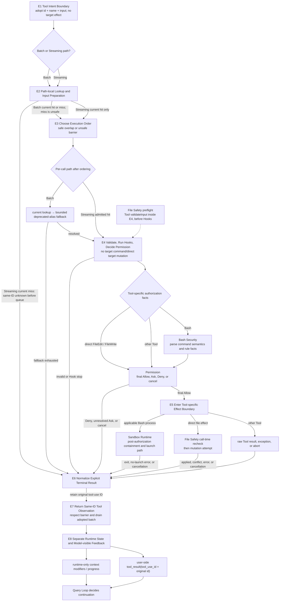

# 02：Controlled Effects——Tool Intent 怎样变成受控机器事实

[← 上一篇：Query Loop 与 Streaming](../01-model-turn/02-query-loop-and-streaming.md) · [下一篇：Tool Contract 与 Orchestration](01-tool-contract-and-orchestration.md)

> 模型已经提出 `tool_use { id, name, input }`；runtime 怎样决定它能否、何时、以什么边界触碰机器，并把每一种结局送回模型？

**[Architectural interpretation]** Controlled Effects 是 [A5 Tool Intent、A6 Controlled Machine Effect、A7 Tool Observation and State Update](../00-one-agent-turn.md#1-权威全景图a1a8) 的局部放大。它不是“调用一个 Tool function”这么简单，而是一条有明确 owner 的受控协议：先解析和排序候选，再完成 validation、Hook 与 Permission；只有 final Allow 才能进入 Tool-specific effect boundary，最后无论 success、error、denial 还是 cancellation，都要产生同 ID 的 terminal Tool Observation。

一句话先记住：

> 模型只提出效果；runtime 才拥有 lookup、ordering、authorization 与 execution；机器结局必须重新变成模型可关联的事实。

## 1. 先把 A5–A7 放回整条 Agent Turn

[00 的 A1–A8](../00-one-agent-turn.md#1-权威全景图a1a8) 仍是全轨道唯一权威流程。本部分只放大中间三步：

| canonical 节点 | 本部分接住什么 | 本部分交付什么 | 不在这里继续展开 |
| --- | --- | --- | --- |
| **A5 Tool Intent** | Model Turn 已确认的完整 `id + name + input` | E1 的 inert intent candidate | partial stream、text-only 判定 |
| **A6 Controlled Machine Effect** | 已采用的 intent 与 runtime Tool pool/context | E2–E6 的 lookup、ordering、authorization、effect 与 terminal normalization | transcript persistence、Resume |
| **A7 Tool Observation and State Update** | 带原 ID 的 terminal result 与 runtime updates | E7–E8 的 model-visible observation 和 runtime-only state | 是否再次请求模型 |

边界两端分别由其他部分拥有：

- 上游 [Model Turn](../01-model-turn/README.md) 和 [Query Loop](../01-model-turn/02-query-loop-and-streaming.md) 负责确认完整 Tool Intent，并把 Controlled Effects 保持为 Q6 opaque boundary；
- 下游 Query Loop 负责在 response 与 Tool batch 都闭合后决定 Continue 或 Stop；
- 未来的 Session Continuity 才负责 transcript write/flush、compaction、interruption persistence 与 later-process recovery。

所以 E8 结束时只是“当前 feedback 已可合法继续”，不是“session 已持久化”，也不是“runtime 必须再次调用模型”。

## 2. E1–E8：先看完整心智图



图中的 Bash Security、Permission、Sandbox Runtime 与 File Safety 不是所有 Tool 都依次经过的四扇门：

- Bash analysis 产生 command-specific authorization facts，generic Permission 消费这些 facts；
- final Allow 之后，适用的 Bash process path 才可能选择 Sandbox containment；
- direct FileEdit/FileWrite 不通过 Bash process Sandbox，它们在 File Tool 自己的 call boundary 中重查 freshness 并尝试 mutation；
- ordinary Tool 也可以直接从 final Allow 进入自己的 `Tool.call`。

File Safety 还横跨 E4 与 E5：`FileEdit.validateInput` 的 preflight 位于 final Permission 之前；Allow 后 `FileEdit.call` 只重做一组 call-time checks。若 Hook 或 Permission 更新 input，generic wrapper不会重跑完整 Tool-specific `validateInput`。因此图把 preflight 与 call-time recheck 分开，不能把它们误读成“一次 Allow 后重新完整验证”。

### 2.1 每个 E 节点改变什么

| 节点 | 输入 | 决策 / 状态变化 | 输出 | owner |
| --- | --- | --- | --- | --- |
| **E1 Tool Intent Boundary** | 完整 `tool_use { id, name, input }` 与所属 assistant message | runtime 采用结构化提议并保留原 ID；没有执行 Tool | inert intent candidate | Tool Contract |
| **E2 Path-local Lookup and Input Preparation** | name、raw input、当前 Tool pool/definitions | Batch 与 Streaming 按各自路径解析；unknown 可以在不同位置闭合 | resolved/admitted Tool，或 same-ID unknown | Tool Contract |
| **E3 Choose Execution Order** | current-hit/resolved Tool、local schema 与 concurrency fact | 只让显式证明 safe 的 work 重叠；其余形成 serial/unsafe barrier | batch plan 或 queued/running hit item | Tool Contract |
| **E4 Validate, Hooks, Permission** | resolved Tool、input、context、abort 与 rules | local schema、Tool validation、PreToolUse、Tool-specific facts 与 final authorization | final authorized `callInput`，或 no-target-effect terminal | Tool Contract + Permission + Tool-specific analyzer |
| **E5 Tool-specific Effect Boundary** | final Allow 与 runtime context | `Tool.call` 进入对应 effect owner；可能成功、部分生效、抛错或取消 | raw result/progress/error evidence | specialized Tool；process Sandbox 或 File Safety按分支介入 |
| **E6 Normalize Terminal Result** | unknown、invalid、deny、cancel、success、exception、abort | 统一形成明确 terminal shape并复制原 ID | `tool_result(tool_use_id=id, ...)` | Tool Contract |
| **E7 Return Tool Observation** | normalized result、progress、context modifier | 不跨 unsafe barrier；finish/cancel 时 drain adopted batch | user-side Observation 与独立 runtime update | Tool Contract |
| **E8 Update Two Kinds of State** | paired Observation 与 runtime modifier | model-visible feedback 与 runtime-only state 分开更新 | legal next-feedback candidate | Tool Contract handoff；Query Loop决定继续 |

## 3. 一条 failing-test 主线怎样穿过 E1–E8

继续沿用整条轨道的同一个任务：

```text
locate and fix a failing test
```

这不是四个互不相关的示例，而是一个 agent turn 内连续出现的 intents：

```text
Grep candidate
  → Read relevant region
  → Edit exact failing assertion
  → Bash run targeted test
  → same-ID observations feed the next model decision
```

### 3.1 Grep / Read：先降低不确定性，不提前授权 Edit

模型先提出 `grep-1`。E1–E4 解析、排序和授权这次 Grep；E5 只执行 Grep 自己的 read effect；E6–E8 返回 `tool_result(tool_use_id=grep-1)`。若结果被截断，正确下一步是缩小 pattern/path，不是把第一批结果当完整 workspace。

随后 `read-1` 读取候选测试的相关区域。它再次独立走 E1–E8，并返回编号后的 model-visible content；runtime 还可以保存未编号的 FileState。Grep observation 不等于 prior-read state，Read 也不等于已经批准后面的 Edit。每个 Tool invocation 都有自己的 Permission 与 terminal result。

### 3.2 `edit-1`：同一个 ID 穿过 lookup、barrier、Permission 与 direct-file effect

假设模型在 Read observation 后提出：

```yaml
type: tool_use
id: edit-1
name: Edit
input:
  file_path: test/status.test.ts
  old_string: "expect(status).toBe(500)"
  new_string: "expect(status).toBe(503)"
  replace_all: false
```

| 时点 | protocol / model-visible fact | runtime-only state | direct target mutation |
| --- | --- | --- | --- |
| E1 后 | assistant intent `edit-1` 已存在；result 尚不存在 | 原 ID 被采用 | **没有** |
| E2–E3 后 | intent内容不变 | FileEdit 已解析；mutating work位于 unsafe/serial barrier | **没有** |
| E4 preflight 后 | 模型尚未看到新事实 | 当时 input 的 path、prior state、freshness、match cardinality已检查 | **没有** |
| Hook / Permission 后 | negative decision会形成 `edit-1` terminal；Allow仍不是success | processed/final input与optional permission-state update已确定 | **没有 direct target mutation** |
| E5 File Safety recheck | 尚无 observation | final path被同步reread，mtime/cache与actual string/patch子集重查 | stale/conflict 时**没有**；mutation branch 才可能改变 |
| E6–E7 | `tool_result(tool_use_id=edit-1)` 表示 applied、conflict/error、denial或cancellation | completed/yielded，仍受barrier约束 | 取决于实际失败位置；error不证明rollback |
| E8 | 下一份合法history可包含intent与同-ID result | cache/context modifier单独更新 | E8不新增mutation |

这里最容易漏掉两个边界：

1. `FileEdit.validateInput` 在 final Permission 前运行；PreToolUse Hook 和 Permission 都可能更新 input，但 Allow 后不会完整重跑它。call-time reread/freshness/patch只是子集，不应把 old input 的 cardinality 等证据无条件搬到 final input。
2. FileEdit 的 temp+rename attempt 还存在 direct-write fallback，post-write cache/diff/mapping也可能抛错；所以 error Observation 只能说明pipeline以error结束，不能推出target一定没变。

### 3.3 `bash-1`：Edit success 之后仍要取得测试事实

FileEdit success不包含“测试通过”。Query Loop看到 `edit-1` 已闭合后，模型才能提出新的 intent，例如：

```yaml
type: tool_use
id: bash-1
name: Bash
input:
  command: "pnpm test test/status.test.ts"
```

这次 E4 内部的 owner 与 FileEdit 不同：

1. Bash Security 解析 command、operators、redirects、nested commands 与 rule candidates；它只产生 Tool-specific permission facts，目标命令尚未执行。
2. generic Permission结合 mode、rules、Hook与Bash facts返回 final decision。Deny/cancel直接成为 `bash-1` no-target-effect result。
3. final Allow 进入 E5 后，只有适用的process path才选择Sandbox containment；disabled、non-required unavailable、excluded或policy-permitted explicit bypass也可能走ordinary launch。
4. exit、launch failure、abort或semantic error最终都由E6–E8变成同 ID observation。只有测试result本身才能让模型判断修复是否成立。

如果 Bash command包含 pipeline或redirect，Bash analysis不会因左侧有已知prefix就授权整条字符串；如果 Sandbox adapter在spawn前失败，Permission仍然是Allow但target从未launch；如果process已启动后被cancel，result可能包含partial evidence。owner与时点必须保留。

## 4. 共同合同与两条 branch-local orchestration path

Tool Contract 固定共同入口/出口，却不把 Batch 与 Streaming 伪装成相同逐行流程。

### 4.1 Batch current miss 与 Streaming current miss 不同

| boundary | Batch | Streaming | 共同不变量 |
| --- | --- | --- | --- |
| classification lookup | 只查 current `options.tools`；miss保守归为unsafe/serial | `addTool` 只查 current `toolDefinitions` | 半段Tool JSON都不能执行 |
| miss之后 | serial runner仍进入 `runToolUse`；current miss后只允许一次declared deprecated-alias fallback | 立即存same-ID unknown并return；不queue、不进`executeTool → runToolUse` | unknown不能静默消失 |
| hit之后 | partition成safe batch或serial barrier | parse/classify后入queue | 只有显式证明safe才重叠 |
| finish/abort | 当前batch generator要闭合 | executor要drain或产生synthetic closure | next feedback前没有adopted orphan intent |

因此不能说“所有 Tool lookup miss 都会查全量base tools”，也不能说“Streaming只是Batch更早开始”。Streaming移动的是**current-definition hit item**的start time；它对miss的terminal位置本身也不同。

### 4.2 Ordering 的承诺不是全局 completion order

若一个response包含两个safe Reads和一个mutating Edit：

```text
read-a (safe) ─┐
               ├─ may overlap and finish in either order
read-b (safe) ─┘
               ↓ drain safe batch
edit-c (unsafe barrier)
```

允许 `read-b` 先完成，不代表result可以改绑到 `read-a`，也不代表 `edit-c` 可以越过前面的safe batch。可靠承诺只有：

- result保留原 `tool_use_id`；
- classification不能证明safe时回到serial；
- active unsafe item形成launch/result barrier；
- response结束或cancel时，adopted batch要drain或error-close。

### 4.3 Validation、updated input 与 effect boundary

common per-call gate的因果顺序可以压缩成：

```text
local inputSchema parse
→ optional Tool-specific validateInput
→ PreToolUse hooks, possibly updated input
→ final Permission on processed input, possibly updated input
→ Tool.call(final callInput)
```

这里有三个不能补写的步骤：

- optional `inputJSONSchema` 是模型/API projection override，不是common wrapper的第二次local parse；
- Hook/Permission更新input后，源码没有再次调用Tool-specific `validateInput`；
- Permission Allow之后没有通用transaction、rollback或success guarantee。

这正是 specialized owner仍然必要的原因：Bash要解释command semantics，FileEdit要在call里重查live state，Sandbox只约束适用process，MCP server-specific schema error则可能后移到remote validation。

## 5. 四层“安全检查”不能揉成一扇门

### 5.1 Permission：是否授权尝试

[Permission Decision](02-permission-decision.md) 消费effective mode、allow/ask/deny rules、PreToolUse decision、Tool-specific facts与prompt capability，返回typed Allow/Ask/Deny/cancel。P1–P7都位于目标effect之前；control-plane Hook、classifier、logging或permission-state persistence另算。

Allow只关掉authorization question。它不证明command harmless、process sandboxed、file fresh、write atomic或effect成功。

### 5.2 Bash Security：命令究竟表达哪些候选效果

[Bash Security Analysis](03-bash-security-analysis.md) 把raw shell string变成leaf commands、operator/redirection/nested evidence和rule candidates。parse uncertainty通常显式进入Ask；prefix suggestion不是authorization proof。它把Bash-specific `PermissionResult`交给generic Permission，不拥有final cross-Tool policy。

### 5.3 Sandbox Runtime：获准进程最多怎样被contain

[Sandbox Runtime](04-sandbox-runtime.md) 位于final Allow之后，只适用于相应process path。Claude Code源码能证明selection、config mapping、adapter request、shared `spawn` site与result handoff；没有exact external dependency tuple时，OS-level filesystem/network enforcement保持delegated。

Sandbox不能把Permission Deny改成Allow，也不能证明direct FileEdit安全。

### 5.4 File Editing Safety：direct mutation仍然命中正确状态吗

[File Editing Safety](05-file-editing-safety.md) 拆开discovery、Read state、exact proposal、preflight、call-time freshness、mutation primitive与result uncertainty。它是optimistic read-before-write protocol，不是hash/CAS transaction；ranged Read也只建立path-level state，不证明match位于模型看过的range。

FileEdit与FileWrite还是两个不同contract：前者有old-string/cardinality语义，后者是whole-file replacement；不能把一个Tool的guard泛化给另一个。

## 6. Terminal result 是协议责任，不是成功专属路径

每个已采用intent都必须到达E6；差别只是**effect有没有开始、机器状态能否确定**：

| terminal class | 典型位置 | 目标effect状态 | model-visible责任 |
| --- | --- | --- | --- |
| unknown Tool | E2 | 未开始 | same-ID unknown error |
| invalid input / Hook stop | E4 | 目标effect未开始；Hook control-plane effect另算 | same-ID validation/stop result |
| Permission deny / unresolved Ask / cancel | E4 | 目标effect未开始 | same-ID denial/cancel result |
| pre-launch Sandbox/Tool failure | E5 | target process未launch | same-ID error |
| conflict before direct mutation | E5 | 本次direct target primitive未执行；external actor可能已改file | same-ID conflict/error |
| success | E5→E6 | effect已产生其Tool-specific success evidence | same-ID success result |
| exception / abort after effect begins | E5→E6 | unchanged、partial、complete或仍运行要按branch判断 | same-ID error/cancel；不伪装rollback |

**[General principle]** Protocol closure回答“模型下一轮知道什么”，不自动回答“机器世界是否可回滚”。若具体effect需要idempotency、transaction或compare-and-swap，必须由该effect owner另行建立。

## 7. E8 有两种状态输出，Query Loop才拥有继续

一次Tool完成时，runtime可能同时得到：

```text
model-visible
  user-side tool_result(tool_use_id = original id)

runtime-only
  progress, queue status, abort state, context modifier,
  in-progress/completed bookkeeping
```

只有第一类经过Message projection才会成为模型下一轮可见事实；第二类不会因为存在于runtime就自动进入Model View。Batch/Streaming对context modifier的应用时点还可能不同，但都不能用modifier代替same-ID observation。

E8把两类state交给Query Loop后，仍需满足response complete、pairing closure、barrier/drain与queued-input placement。然后Query Loop才决定构造下一次request、显式终止或repair。Controlled Effects不自行递归调用模型。

## 8. MCP 与 AgentTool：只保留adapter边界

### 8.1 MCP capability进入common Tool pool

MCP在这里的主线只有：

```text
tools/list capability
→ runtime Tool adapter
→ common Tool pool / model schema projection
→ 所在Batch或Streaming path的E2–E3
→ common E4–E8 contract
```

server的具体JSON Schema可作为`inputJSONSchema`给模型/API看，本地adapter却可以使用permissive `inputSchema`；server-specific type error因此可能到remote/server validation才失败，再回到E6 error normalization。这不需要展开transport negotiation、reconnect、Plugin安装或Bridge architecture。

### 8.2 AgentTool先是Tool，E5以后才跨child boundary

AgentTool同样声明name、schema、permission、concurrency、call与result mapping，所以parent intent先走common E1–E4；只有E5的`AgentTool.call`才进入child-loop adapter。child context、mailbox、task lifecycle、cancel/recovery属于Subagent Delegation，不属于本部分。

## 9. 五条必须守住的不变量

### 9.1 Same-ID result pairing

每个adopted `tool_use(id=X)`都必须得到可关联的`tool_result(tool_use_id=X)`；success、unknown、validation error、denial与cancellation都不能成为例外。

### 9.2 Final authorization之前没有目标effect

对Bash，这表示目标command没有开始执行；对direct File Tool，这表示target content/existence mutation primitive没有开始。它不否认preflight reads、Hooks、classifier、permission persistence、directory/history/temp等control-plane或其他filesystem effects；必须先说清“target effect”是什么。

### 9.3 Ordering优化不能穿过unsafe barrier

safe work可以重叠、result可以按到达时点出现；但ID不能错绑，unsafe launch/result barrier不能被穿透，next feedback之前current adopted batch必须闭合。

### 9.4 Permission、containment与effect correctness是不同问题

Permission决定can attempt；Sandbox限制适用process；File Safety验证direct mutation candidate；Tool result才报告execution outcome。任何一层success都不能替代下一层。

### 9.5 Observation与continuation分属两个owner

Controlled Effects交付same-ID observation与runtime update；Query Loop才判断是否继续；Session Continuity才判断这些事实怎样跨时间保存和恢复。

## 10. 三个决定性源码 lens

下面只用三个source lens固定会改变整体心智模型的branch；内部细节留在五篇owner章节。

### Lens 1：Batch fallback与Streaming miss不共享同一入口

**[Source-confirmed]** 证据：snapshot `712b24f22a63eb6d1a2f86697bf6dbbaa39ae3cf` + [`src/services/tools/toolExecution.ts`](https://github.com/buoylee/Claude-Code-true/blob/712b24f22a63eb6d1a2f86697bf6dbbaa39ae3cf/src/services/tools/toolExecution.ts) + `runToolUse`；同一snapshot + [`src/services/tools/StreamingToolExecutor.ts`](https://github.com/buoylee/Claude-Code-true/blob/712b24f22a63eb6d1a2f86697bf6dbbaa39ae3cf/src/services/tools/StreamingToolExecutor.ts) + `addTool`。

- `runToolUse` 的current miss只接受base Tool显式声明的deprecated alias；
- Streaming `addTool` current miss直接构造same-ID completed unknown并return；queued push位于该branch之后。

所以“common Tool contract”不能抹掉path-local admission差异。

### Lens 2：effect之前有gate，updated input之后没有完整second validation

**[Source-confirmed]** 证据：snapshot `712b24f22a63eb6d1a2f86697bf6dbbaa39ae3cf` + [`src/services/tools/toolExecution.ts`](https://github.com/buoylee/Claude-Code-true/blob/712b24f22a63eb6d1a2f86697bf6dbbaa39ae3cf/src/services/tools/toolExecution.ts) + `checkPermissionsAndCallTool`。

这个symbol先执行local schema、optional Tool validation与PreToolUse，再resolve final Permission；non-Allow在`tool.call`前返回。Hook/Permission可以替换processed input，最终`callInput`使用更新值，但源码没有在调用前再次执行`tool.validateInput`。

### Lens 3：same-ID result与continuation是两段handoff

**[Source-confirmed]** 证据：snapshot `712b24f22a63eb6d1a2f86697bf6dbbaa39ae3cf` + [`src/services/tools/toolExecution.ts`](https://github.com/buoylee/Claude-Code-true/blob/712b24f22a63eb6d1a2f86697bf6dbbaa39ae3cf/src/services/tools/toolExecution.ts) + nested `addToolResult`；[`src/services/tools/StreamingToolExecutor.ts`](https://github.com/buoylee/Claude-Code-true/blob/712b24f22a63eb6d1a2f86697bf6dbbaa39ae3cf/src/services/tools/StreamingToolExecutor.ts) + `getCompletedResults` / `getRemainingResults`；[`src/query.ts`](https://github.com/buoylee/Claude-Code-true/blob/712b24f22a63eb6d1a2f86697bf6dbbaa39ae3cf/src/query.ts) + `queryLoop`。

Tool layer先把result放进带原ID的user-side message，并按barrier/drain交付；Query Loop再把assistant intents与normalized results构造成下一份state。前者不拥有下一次model request。

## 11. 常见错误心智模型

| 错误模型 | 正确边界 |
| --- | --- |
| 模型输出Tool JSON后，Tool就已开始执行 | E1只是adopt inert intent；E2–E4仍可unknown、invalid、deny或cancel。 |
| Batch与Streaming只是同一流程的快慢版本 | current miss的resolution/terminal位置不同；只有hit item共享后续per-call gate。 |
| Permission Allow说明command/file是安全的 | Allow只授权继续；Bash semantics、Sandbox containment、File freshness/mutation与execution result各有owner。 |
| Sandbox是所有Tool的通用文件安全层 | 它只约束适用process path；direct FileEdit/FileWrite走File Safety。 |
| updated input既然重新授权，就一定重新完整validation | final Permission重做authorization，不等于重跑Tool-specific `validateInput`。 |
| Tool error说明机器世界没变化 | effect开始后、甚至mutation完成后的步骤仍可能error；没有通用rollback。 |
| MCP与AgentTool需要另起一套orchestrator | 两者先适配进common Tool contract；远端validation或child lifecycle只在各自E5边界后展开。 |
| E8已经等于session持久化且一定继续 | E8只交付closed feedback；Query Loop与未来Session owner仍有独立决定。 |

## 12. 面试表达

### 12.1 30 秒回答

> Claude Code把Controlled Effects放在A5到A7。完整`tool_use`先作为inert intent进入E1；E2/E3按Batch或Streaming做path-local lookup与safe/unsafe ordering，其中Batch current miss还能在`runToolUse`尝试declared alias，Streaming miss则在queue前same-ID闭合。已解析项在E4经过local validation、hooks与final Permission，只有Allow才进入E5。Bash先提供command facts，适用process在Allow后才走Sandbox；direct FileEdit/FileWrite改由File Safety重查read/freshness/match。最后success、error、denial、cancel都在E6–E8变成同ID Observation；runtime state与model-visible result分开，Query Loop才决定是否继续。

### 12.2 3 分钟回答

> 我会先画E1–E8，再强调branch-local owner。E1接模型的`id/name/input`，但只是协议数据。E2不是一条统一lookup：Batch classification只查current pool，miss先serial，真正`runToolUse`才允许一次declared deprecated-alias fallback；Streaming `addTool`只查current definitions，miss立即same-ID unknown，不queue。E3只并发显式concurrency-safe工作，unsafe item形成barrier，next feedback前必须drain。
>
> E4是pre-effect gate：local `inputSchema`、Tool-specific validation、PreToolUse与Permission。Bash的AST/operator/rule分析只产生Permission facts；FileEdit preflight会读live file、检查prior state和cardinality。Hook和Permission都可能更新input，final authorization针对processed input，但wrapper不会重跑完整Tool validation。non-Allow直接产生terminal result。Allow后E5才调用Tool：Bash可能选择Sandbox-wrapped或ordinary process path；FileEdit在自己的call里同步reread/freshness recheck，再尝试temp+rename或direct fallback。两者的failure state不能混成一种“没权限”。
>
> E6把unknown、invalid、deny、cancel、success和execution error都规范化成原`tool_use_id`；E7按barrier返回并drain；E8分开runtime-only modifier与model-visible`tool_result`。Query Loop还要等response和batch闭合，才用intent/result构造下一次request。所以核心不变量是same-ID pairing、final authorization前无目标command/direct-target mutation、unsafe barrier不被优化穿透，以及每条adopted path都有显式terminal result。

### 12.3 常见追问落点

| 追问 | 先回答什么 | 深入阅读 |
| --- | --- | --- |
| Tool schema与runtime Tool有何不同？ | 模型只见name/description/input schema；runtime还拥有validation、permission、call与mapping。 | [Tool Contract](01-tool-contract-and-orchestration.md) |
| Allow / Ask / Deny谁优先？ | 不能只背 universal matrix；先分PreToolUse入口、generic route与Tool-specific facts。 | [Permission](02-permission-decision.md) |
| 为什么Bash不能做prefix allow？ | operator、redirect、nested execution会改变effect；prefix至多是bounded candidate。 | [Bash Security](03-bash-security-analysis.md) |
| Allow后为何仍然启动失败？ | containment selection、adapter、cwd、abort、spawn与OS都是后续boundary。 | [Sandbox Runtime](04-sandbox-runtime.md) |
| 为什么Read过仍可能写错？ | prior state只是optimistic evidence；range、mtime、cardinality、updated input与TOCTOU都有边界。 | [File Safety](05-file-editing-safety.md) |

## 13. 继续阅读：从共同合同逐层进入specialized owner

按下面顺序阅读，能始终沿着同一条E1–E8主线深入：

1. [Tool Contract 与 Orchestration](01-tool-contract-and-orchestration.md)：先固定所有Tool共同的协议、lookup、barrier、validation/call与result normalization。
2. [Permission Decision](02-permission-decision.md)：放大E4 final authorization，解释PreToolUse入口、mode/rule/Tool facts与Ask state update。
3. [Bash Security Analysis](03-bash-security-analysis.md)：解释Bash command怎样生成generic Permission能消费的语义事实。
4. [Sandbox Runtime](04-sandbox-runtime.md)：进入final Allow后的process-containment selection、launch与result boundary。
5. [File Editing Safety](05-file-editing-safety.md)：切换到direct file effect，解释discovery/read/freshness/match/mutation与uncertain failure。

读完这五篇后，Controlled Effects的当前状态已经闭合：intent已经得到明确terminal observation，runtime-only state与model-visible feedback已经分开，Query Loop也拥有合法的continue/stop输入。

下一问属于未来的 **Session Continuity**：这些Messages、observations、permission/file state与interruption facts，哪些会跨context pressure与later process持续存在？当前路径只保留这个plain-text handoff，不创建不存在的链接。

[← 上一篇：Query Loop 与 Streaming](../01-model-turn/02-query-loop-and-streaming.md) · [下一篇：Tool Contract 与 Orchestration](01-tool-contract-and-orchestration.md)
