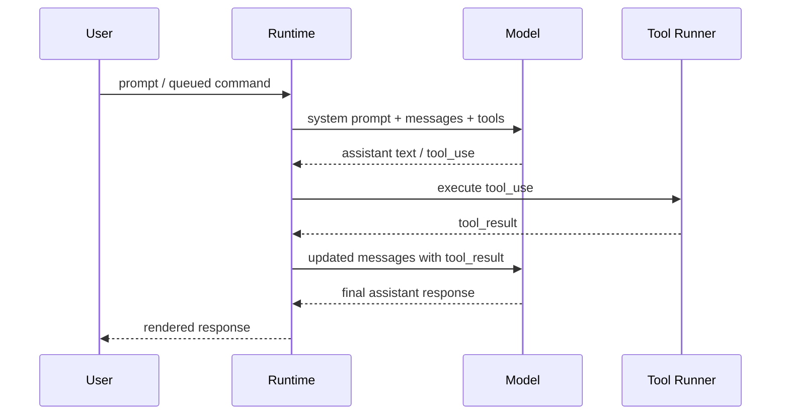

# 02 - Query Loop

## 面试式回答

`query()` 是 Claude Code 的中央 agent loop。它接收已经组装好的 `messages`、`systemPrompt`、`userContext`、`systemContext`、tools 和 `ToolUseContext`，然后反复执行同一个反馈循环：把 messages 发给模型，消费 assistant 流式输出；如果 assistant 只输出文本，就结束；如果输出 `tool_use`，runtime 执行工具，把结果包装成 `tool_result`，再作为 user-role message 放回下一次模型请求。

源码锚点是 `src/query.ts` 的 `query()` 主体、`useStreamingToolExecution` 分支、`toolUpdates` 消费，以及 `src/services/tools/StreamingToolExecutor.ts` 的流式工具执行器。REPL 从 `src/screens/REPL.tsx` 的 `onQueryImpl()` 调入，SDK/print 从 `src/QueryEngine.ts` 的 `QueryEngine.submitMessage()` 调入。

## 这一章解决什么问题

本章解释“进入 `query()` 后，agent 为什么能多轮使用工具直到给出最终答复”。重点不在某个具体工具怎么执行，而在 loop 的控制面：

- messages 如何进入模型请求。
- assistant content 如何被分成文本、thinking、`tool_use`、错误或 stream event。
- 工具执行结果如何变成下一轮模型可见的 `tool_result`。
- loop 什么时候继续，什么时候停止。
- auto-compaction、queue draining、中断如何围绕主循环工作。

## 心智模型

`query()` 可以理解为一个状态机，而不是一次 API 调用：

- 状态输入：当前 messages、system prompt、context、tools、tool runtime state。
- 模型采样：模型读入上下文，流式产出 assistant message。
- 工具接管：一旦发现 `tool_use`，runtime 接管并执行工具。
- 结果回灌：工具结果被转换为 user-role `tool_result` message。
- 下一跳：如果有工具结果，就把“原消息 + assistant tool_use + tool_result”作为新的 messages 再问模型。
- 终止：没有新的 `tool_use`、达到 max turns、被中断、prompt 过长无法恢复、hook 阻止继续，都会让 loop 返回。

## 实现逻辑

`query()` 内部是一个 `while (true)` 风格的状态推进。每轮先从 state 中取 `messagesForQuery` 和 `toolUseContext`，必要时先做自动压缩或上下文恢复，再准备调用模型。

模型调用发生在 `deps.callModel({ messages, systemPrompt, thinkingConfig, tools, signal, options })`。这里的 `messages` 会先经过 `prependUserContext(messagesForQuery, userContext)`，system prompt 和 system context 则作为单独参数参与请求构造。工具不是自然语言拼进去的，而是通过 `tools: toolUseContext.options.tools` 进入模型请求，后续由 API 层把工具描述和 schema 暴露给模型。

流式响应期间，`query()` 每收到 assistant message 就 yield 给上层 runtime。若 assistant content 中包含 `tool_use` block，代码会把 block 收集进 `toolUseBlocks`，并把 `needsFollowUp` 置为 true。这个布尔值是 loop 的关键分岔：没有 `tool_use` 时，进入 stop hooks、token budget 检查等收尾逻辑，然后返回 completed；有 `tool_use` 时，进入工具执行阶段。

工具执行有两种路径。开启 `config.gates.streamingToolExecution` 时，`query()` 创建 `StreamingToolExecutor`，在 assistant 流式输出 tool_use block 的同时把工具加入执行器；流结束后通过 `streamingToolExecutor.getRemainingResults()` 收尾。未开启时，`runTools(toolUseBlocks, assistantMessages, canUseTool, toolUseContext)` 批量执行。两者都抽象成 `toolUpdates` async iterable，因此 query loop 后半段只关心 update 中有没有 `message` 和 `newContext`。

每个工具 update 的 message 会先 yield 给上层，然后通过 `normalizeMessagesForAPI([update.message], tools).filter(_.type === 'user')` 转成下一轮模型 API 可接受的 user message。也就是说，`tool_result` 在 API 语义上属于 user-role content：assistant 提出 tool_use，runtime 以 user-role tool_result 回答它，模型下一轮才能继续推理。

工具执行后，`query()` 会补充上下文附件：从命令队列抓取可在本轮注入的 queued command/task notification，经 `getAttachmentMessages()` 变成 attachment message；已完成的内存预取、skill discovery 也会加入 toolResults。然后刷新 tools，检查 `maxTurns`，最后构造下一轮 state：

```text
messages = messagesForQuery + assistantMessages + toolResults
toolUseContext = updatedToolUseContext
turnCount = turnCount + 1
transition = next_turn
```

这一步解释了为什么工具结果会影响下一次模型调用：它们不是旁路状态，而是被追加进下一轮 messages。

## 源码入口

- `src/query.ts` / `query()`：中央 agent loop，负责模型调用、stream 消费、工具执行、递归式下一轮。
- `src/query.ts` / `useStreamingToolExecution`：决定是否边流式接收 tool_use 边执行工具。
- `src/query.ts` / `toolUpdates`：统一消费 `StreamingToolExecutor.getRemainingResults()` 或 `runTools()` 的工具结果。
- `src/services/tools/StreamingToolExecutor.ts` / `StreamingToolExecutor`：流式工具执行与并发控制；可更新 `ToolUseContext`。
- `src/services/tools/toolExecution.ts` / `runToolUse`：具体 tool_use 执行边界。
- `src/screens/REPL.tsx` / `onQueryImpl()`：交互式入口调用 `query()` 并把事件写回 UI/messages。
- `src/QueryEngine.ts` / `QueryEngine.submitMessage()`：SDK/print 入口调用 `query()` 并转换输出协议。

## 关键数据结构与状态

- `messagesForQuery`：当前轮要发给模型的历史消息。自动压缩、恢复、工具结果回灌都会更新它。
- `assistantMessages`：本轮模型流式产出的 assistant message 集合，后续会和 tool result 一起拼进下一轮。
- `toolUseBlocks`：本轮 assistant 产出的 `tool_use` blocks。只要非空，`needsFollowUp` 就会要求进入工具阶段。
- `toolResults`：工具结果、附件、队列注入、内存/skill 预取等 runtime 观察结果。它们会被标准化为 user-role messages。
- `needsFollowUp`：本轮是否需要继续问模型。它不是依赖 stop_reason，而是由是否看到 `tool_use` 决定。
- `ToolUseContext`：工具执行和 query loop 共享的 runtime 状态。工具可以通过 `update.newContext` 修改后续 loop 使用的 context。
- `turnCount` / `maxTurns`：防止非交互或 SDK 模式无限工具循环。
- `autoCompactTracking`、`pendingToolUseSummary`、`transition`：围绕主 loop 的恢复、摘要和状态追踪。

## 正常路径

1. 上层 runtime 调用 `query()`，传入 messages、system prompt、tools 和 `ToolUseContext`。
2. `query()` 做上下文长度/自动压缩检查，准备当前轮请求。
3. `deps.callModel()` 发起模型流式请求。
4. assistant 文本、thinking、tool_use 等 message 被逐条 yield 给 REPL 或 SDK。
5. 如果没有 `tool_use`，执行 stop hooks 和预算检查后返回 completed。
6. 如果有 `tool_use`，runtime 执行工具，yield 工具进度和结果。
7. 工具结果被标准化为 user-role `tool_result` messages。
8. queued command、task notification、memory/skill 预取附件被注入。
9. `query()` 用扩展后的 messages 进入下一轮模型请求。
10. 模型最终不再请求工具时，loop 停止，渲染最终 assistant response。

## 失败、边界与中断

- prompt 过长：进入请求前会检查 blocking limit；请求后若出现可恢复的 prompt-too-long，可尝试 context collapse 或 reactive compact，失败后返回 `prompt_too_long`。
- auto-compaction：在 loop 前置位置判断是否需要压缩；压缩成功后 yield compact boundary，并用压缩后的 messages 继续当前 query。
- fallback model：流式请求触发 fallback 时，会清空当前 attempt 的 assistant/tool 状态，切换模型重试，并生成提示消息。
- streaming abort：如果 AbortController 在模型流期间触发，`query()` 会补齐缺失的 tool_result 或消费 executor 的剩余结果，再返回 `aborted_streaming`。
- tool abort：如果中断发生在工具执行期间，会生成用户中断消息，必要时检查 max turns，然后返回 `aborted_tools`。
- hook 阻止继续：工具或 stop hook 可产出阻止 continuation 的信号，query loop 会停止。
- max turns：下一轮 turn count 超过限制时，yield `max_turns_reached` attachment 并返回 `max_turns`。
- queued command drain：query loop 在工具阶段后从全局队列抓取符合优先级和 agent scope 的 queued command；slash command 不会 mid-turn 注入，因为它必须走输入处理流程。

## Mermaid 图



## 设计取舍

- loop 用 message history 表达状态，而不是单独维护“工具执行上下文记录”。这样模型 API 的下一轮输入可以完整复现 assistant tool_use 和 user tool_result 的因果链。
- `needsFollowUp` 基于实际 `tool_use` block，而不是完全相信 stop_reason。这样可以规避流式响应中 stop_reason 不稳定的问题。
- 流式工具执行和批量工具执行统一成 `toolUpdates`。上层 loop 不关心工具是提前启动还是流结束后启动，降低主流程分支复杂度。
- queued command 在工具阶段后 drain，而不是随时打断模型流。这样避免普通用户消息和 tool_result 交错，保持 API 消息序列合法。
- auto-compaction 放在 loop 周围，而不是 entry 层。因为只有 query loop 最清楚当前 messages、token 状态和恢复策略。
- 中断处理必须补齐 tool_result。assistant 已经产出 tool_use 后，如果 transcript 缺少对应 tool_result，下一次 API 请求会不合法。

## 面试追问

1. 为什么 tool result 是 user-role message？
   因为模型协议中 assistant 发出 `tool_use`，外部环境以 user-role `tool_result` 回答该 tool_use。下一轮模型读取这条 user message 后继续生成。

2. query loop 如何判断是否继续？
   本轮 assistant 流里出现 `tool_use` 就继续；没有 tool_use 则进入 stop hooks、预算检查等收尾，通常返回 completed。

3. auto-compaction 和 query loop 是什么关系？
   它不是入口层预处理，而是 loop 内的恢复机制。压缩成功会产生 compact boundary，并用压缩后的 messages 继续当前 query。

4. queued command 为什么不直接插进用户输入队列？
   mid-turn 只能注入适合模型直接看到的 prompt/task notification；slash command 必须等 turn 结束后走 `processUserInput()`，否则会绕过命令解析和副作用边界。

## 一句话总结

`query()` 是把“模型想做什么”和“runtime 实际做了什么”用 messages 反复闭环的 agent 状态机，直到不再有 `tool_use` 或遇到明确停止条件。
