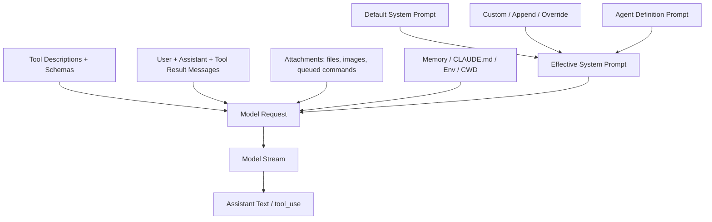

# 03 - Prompt 与 Context 组装

## 面试式回答

Claude Code 送进模型的不是一个单独 prompt 字符串，而是一份运行时组装的模型请求：system prompt、user/system context、历史 messages、工具描述与 schema、附件、memory/CLAUDE.md、cwd/env、compaction summary、queued command、pending subagent/coordinator message 等共同构成输入。源码上，默认提示词来自 `src/constants/prompts.ts` 的 `getSystemPrompt()`；REPL 用 `src/utils/systemPrompt.ts` 的 `buildEffectiveSystemPrompt()` 处理 default/custom/append/override/agent prompt 的优先级，并且每 turn 仍会采集 `getSystemPrompt()`、`getUserContext()`、`getSystemContext()`；SDK/print 用 `src/utils/queryContext.ts` 的 `fetchSystemPromptParts()` 取得 headless 路径的 default prompt、user context、system context，再在 `src/QueryEngine.ts` 的 `QueryEngine.submitMessage()` 中组装。

面试时要强调两个区分：第一，model-visible context 和 runtime-only state 不一样；第二，稳定的 prompt 前缀对 prompt cache 很重要，所以源码里会把静态系统提示、动态系统段、MCP instructions delta、附件注入等分层处理，尽量避免每 turn 无意义地打破缓存。

## 这一章解决什么问题

本章解释“模型到底看到了什么”。它覆盖：

- 默认、custom、append、override、agent-specific system prompt 的优先级。
- 工具 descriptions 和 schemas 如何进入模型请求。
- 用户消息、assistant 消息、tool_result、附件、queued command、pending subagent/coordinator message、memory、CLAUDE.md、cwd/env、compaction summary 如何进入上下文。
- 哪些信息是模型可见的，哪些只是 runtime 控制状态。
- 为什么源码会在 prompt 组装上关注稳定前缀和 cache boundary。

## 心智模型

不要把 prompt 理解成一段字符串，要把它理解成四层输入包：

1. System 层：Claude Code 身份、行为规则、cwd/env、memory 指令、语言/输出风格、MCP instructions、append/custom/agent 指令。
2. Tool 层：工具名称、描述、输入 schema、权限上下文和 MCP tools。模型看到的是工具定义，runtime-only 的权限判定和状态更新不直接给模型。
3. Message 层：用户消息、assistant 历史、tool_use、tool_result、compact boundary 之后保留的摘要与尾部历史。
4. Attachment/context 层：文件、图片、IDE selection、edited file reminders、queued command、pending agent message、CLAUDE.md/nested memory、skill discovery 等按条件注入。

最终模型请求是这些层的组合，而不是“把所有东西拼成一个大 prompt”。

## 实现逻辑

### System prompt 来源与优先级

默认 prompt 由 `src/constants/prompts.ts` 的 `getSystemPrompt(tools, model, additionalWorkingDirectories, mcpClients)` 构建。它会读取 cwd、session start date、skill commands、output style、env info、settings language、enabled tools、MCP instructions、memory prompt 等。简化模式 `CLAUDE_CODE_SIMPLE` 会返回极小 prompt；普通模式会把静态 sections 和动态 sections 分开，并使用 boundary marker 管理 cache 友好性。

REPL 的有效 system prompt 由 `src/screens/REPL.tsx` 的 `onQueryImpl()` 调用 `getSystemPrompt()` 后，再交给 `src/utils/systemPrompt.ts` 的 `buildEffectiveSystemPrompt()`。优先级是：

1. `overrideSystemPrompt`：如果存在，替换所有其他 system prompt，append 也不再追加。
2. coordinator mode prompt：在 coordinator mode 且没有 main thread agent definition 时替换默认 prompt，并可追加 append prompt。
3. agent-specific prompt：如果存在 main thread agent definition，通常替换 default/custom；内置 agent 会用 `getSystemPrompt({ toolUseContext })`，自定义 agent 用无参 `getSystemPrompt()`。
4. custom system prompt：来自 `--system-prompt` 或 `--system-prompt-file`，在没有 agent prompt 时替换 default prompt。
5. default system prompt：没有 override、agent、custom 时使用。
6. append system prompt：来自 `--append-system-prompt` 或文件，除 override 外总是追加到末尾。

proactive/KAIROS 模式有一个重要例外：agent prompt 会附加到 default prompt 之后，而不是替换 default prompt，因为此时 default prompt 描述 autonomous agent 身份，agent prompt 只是增加领域行为。

SDK/print 的 `QueryEngine.submitMessage()` 也会调用 `fetchSystemPromptParts()`。它的组装更 headless：在 `fetchSystemPromptParts()` 这条路径里，`customSystemPrompt` 存在时返回 `defaultSystemPrompt=[]` 且 `systemContext={}`，最终由 `QueryEngine.submitMessage()` 选择 custom 或 default，并追加 append prompt。这保证 SDK/print 可以用自定义系统提示，同时复用 query loop。

REPL 的 nuance 不同：`src/screens/REPL.tsx` 的 `onQueryImpl()` 即使传入 custom system prompt，也仍然每 turn 调用 `getSystemPrompt()`、`getUserContext()`、`getSystemContext()`。随后 `buildEffectiveSystemPrompt()` 会让 custom prompt 在没有 agent prompt 时替换 default prompt，但 `src/query.ts` 会通过 `appendSystemContext(systemPrompt, systemContext)` 把 `systemContext` 追加进实际发送的 `fullSystemPrompt`。所以“custom prompt 会跳过 default prompt 与 system context”只应限定在 `fetchSystemPromptParts()` 的 SDK/print/headless 路径，不能泛化到交互式 REPL。

SDK/print 还有一个可选的 memory mechanics 分支：`QueryEngine.submitMessage()` 只有在 `customPrompt !== undefined && hasAutoMemPathOverride()` 时才会调用 `loadMemoryPrompt()` 并把 memory mechanics prompt 加到 system prompt 中。没有 custom prompt 或没有 auto memory path override 时，不会额外加入这段 memory mechanics。

### User context 与 system context

`src/utils/queryContext.ts` 的 `fetchSystemPromptParts()` 并行获取三块 cache-key 前缀：`defaultSystemPrompt`、`getUserContext()`、`getSystemContext()`。在 headless helper 中，当 custom system prompt 存在时，它会返回空的 default prompt 和空的 system context；这是 SDK/print 路径的行为，不代表 REPL 不采集 system context。

REPL 的 `onQueryImpl()` 会把 base user context 与 coordinator user context 合并；在 proactive/KAIROS 且终端未聚焦时，还会加入 terminal focus 信息。`query()` 调模型时使用 `prependUserContext(messagesForQuery, userContext)`，说明 user context 是进入 message 输入的一部分，而不是只存在 runtime。

### Messages、tool_use 与 tool_result

用户输入先经 `processUserInput()` 变成 `Message[]`。普通文本是 user message；slash command 可能产生命令输出、附件或不触发模型；文件、图片、IDE selection 等会变成 attachment message 或内容块。`query()` 中 assistant 流式产出的 `tool_use` 会被追加到 `assistantMessages`；工具执行结果通过 `normalizeMessagesForAPI()` 变成 user-role `tool_result`，再拼进下一轮 messages。

这也是为什么模型输入不是单 prompt：下一轮请求中，模型会同时看到之前的 user prompt、assistant 的 tool_use、runtime 返回的 tool_result、可能的附件和 compact summary。

### Tools descriptions 与 schemas

工具定义通过 `toolUseContext.options.tools` 进入 `query()`，再传给 `deps.callModel({ tools })`。到 API 边界时，`src/services/api/claude.ts` 会把 resolved tool pool 过滤成 `filteredTools`，并调用定义在 `src/utils/api.ts` 的 `toolToAPISchema()` 来构造模型可见的工具 schema。模型看到的是工具名、描述、输入 schema 和 API 层需要的 tool metadata；runtime-only 的 `canUseTool`、permission mode、AbortController、setState、file cache 不会作为自然语言上下文暴露给模型。

MCP tools 不是主要靠 `hasPendingMcpServers` 变成 schema；它们在 MCP 连接和工具解析后成为 resolved tool pool 的一部分，随后同样由 `src/services/api/claude.ts` 调用 `src/utils/api.ts` 的 `toolToAPISchema()` 进入模型请求。`hasPendingMcpServers` 的重点是当 MCP server 仍在连接、且当前没有 deferred tools 时，保留 ToolSearch 可用性，让模型后续仍能发现连接完成后的工具。prompt 层还可能包含 MCP instructions：普通 system prompt section，或在 delta 机制开启时通过 `mcp_instructions_delta` attachments 持久化，减少 late MCP connect 对 prompt cache 的破坏。

### Attachments、queued command 与 pending agent messages

附件入口集中在 `src/utils/attachments.ts`。`getQueuedCommandAttachments(queuedCommands)` 会把 mode 为 `prompt` 或 `task-notification` 的 queued command 转为 `queued_command` attachment；如果 queued command 带 pasted image，还会构造 text + image content blocks。`query()` 在工具阶段之后抓取符合优先级和 agent scope 的 queued commands，经 `getAttachmentMessages()` 注入，并把已消费 command 从队列移除。

`getAgentPendingMessageAttachments(toolUseContext)` 用 `toolUseContext.agentId` 从 app state 中 drain pending coordinator/subagent messages，再把它们变成 meta 的 `queued_command` attachment。这样 pending subagent/coordinator message 可以作为模型可见上下文进入对应 agent loop，同时保持主线程和 subagent 的队列作用域隔离。

其他 attachment 包括 IDE selected lines、edited file diff、critical system reminder、output style、nested memory、skill discovery、MCP instruction delta、compaction reminders 等。它们不是都在 entry 层产生，而是在 query loop、input processing、prefetch、tool execution 之间按条件注入。

### Memory、CLAUDE.md、cwd/env 与 compaction summary

memory/CLAUDE.md 有两条路径：一部分由 `getSystemPrompt()` 的 `loadMemoryPrompt()` 进入 system prompt；另一部分作为 nested memory attachments 进入 message context。`ToolUseContext` 中的 `loadedNestedMemoryPaths` 用来记录本 session 已经注入过的 CLAUDE.md 路径，避免 read file LRU 淘汰后重复注入同一个 nested memory。

cwd/env 主要由 `getSystemPrompt()` 的 env info sections 进入 system prompt，包括 cwd、工作目录、模型相关环境说明、额外 working directories 等。注意 cwd/env 是模型可见上下文，但 `getAppState()`、`setAppState()`、权限 map、AbortController 这类字段仍是 runtime-only。

compaction summary 来自 compact 机制：当历史过长时，query loop 会生成 compact boundary 和压缩后的 post-compact messages。后续模型看到的是 summary 加保留尾部，而不是完整旧 transcript。这样牺牲部分细节，换取上下文窗口和成本可控。

### Prompt cache 影响

prompt cache 依赖前缀稳定。源码里有几个明显设计：

- `getSystemPrompt()` 把静态 content 放在前面，动态 sections 放在 boundary 后面。
- `fetchSystemPromptParts()` 在 SDK/print/headless 路径把 default system prompt、user context、system context 作为 cache-key 前缀统一获取；custom prompt 存在时该 helper 返回空 default prompt 和空 system context。
- `query()` 中对 assistant message 做 observable input backfill 时会 clone yield message，而不修改原始 message，避免破坏 transcript/API cache 字节一致性。
- MCP instructions delta 把易变的 MCP server instructions 从每 turn system prompt recompute 中移出，降低 late connect 导致的大段 cache miss。
- append/custom/agent prompt 会改变有效 system prompt，因此它们天然影响 cache；这也是为什么 prompt precedence 必须清楚。

## 源码入口

- `src/constants/prompts.ts` / `getSystemPrompt()`：默认 system prompt 主构造器，包含 cwd/env、memory、tool guidance、MCP instructions、输出风格等 sections。
- `src/utils/systemPrompt.ts` / `buildEffectiveSystemPrompt()`：REPL 路径的有效 system prompt precedence 实现。
- `src/utils/queryContext.ts` / `fetchSystemPromptParts()`：获取 default system prompt、user context、system context 的共享 helper。
- `src/screens/REPL.tsx` / `onQueryImpl()`：交互式每 turn 组装 prompt/context 并调用 `query()`。
- `src/QueryEngine.ts` / `QueryEngine.submitMessage()`：SDK/print 路径组装 headless prompt/context；`hasAutoMemPathOverride()` 控制 custom prompt 场景下是否追加 memory mechanics prompt。
- `src/query.ts` / `query()`：把 system prompt、messages、tools 和 context 传入模型请求，通过 `appendSystemContext()` 把 `systemContext` 加入实际 `fullSystemPrompt`，并把 tool_result/attachments 拼入下一轮。
- `src/utils/api.ts` / `toolToAPISchema()`：把 resolved tool pool 中的工具转换成模型可见 tool schema。
- `src/services/api/claude.ts` / `toolSchemas` 构造处：构建模型请求时过滤工具并调用 `toolToAPISchema()`；`hasPendingMcpServers` 主要影响 ToolSearch 是否保留。
- `src/utils/attachments.ts` / `getQueuedCommandAttachments()`：queued command/task notification 转 attachment。
- `src/utils/attachments.ts` / `getAgentPendingMessageAttachments()`：pending subagent/coordinator message 转 attachment。
- `src/Tool.ts` / `ToolUseContext`：runtime-only state 与请求相关 options 的集合。

## 关键数据结构与状态

- `SystemPrompt`：由 `asSystemPrompt()` 包装的 system prompt parts。它是模型可见的系统层输入。
- `defaultSystemPrompt: string[]`：`getSystemPrompt()` 产出的默认系统段数组。
- `customSystemPrompt`：替换 default prompt 的用户自定义系统提示。
- `appendSystemPrompt`：追加到有效 system prompt 末尾的补充提示。
- `overrideSystemPrompt`：最高优先级替换，存在时不再合并其他 prompt。
- `AgentDefinition.getSystemPrompt()`：agent-specific prompt 来源；内置 agent 可读取 `toolUseContext.options`。
- `userContext` / `systemContext`：由 context helpers 生成，参与模型请求和 cache-key 前缀。
- `ToolUseContext.options.tools`：模型可见 tool definitions 的来源，同时也是 runtime 执行工具的 registry。
- `Attachment` / `AttachmentMessage`：把非普通文本上下文放进 messages 的结构，例如 queued command、image、nested memory、MCP instruction delta。
- `Message[]`：用户、assistant、tool_result、compaction summary、attachments 的统一历史载体。
- `loadedNestedMemoryPaths`：runtime-only 去重状态，防止 CLAUDE.md/nested memory 重复注入。

## 正常路径

1. Entry 层确定模型、tools、MCP clients、custom/append prompt、agent definition、cwd 和权限上下文。
2. REPL 调 `getSystemPrompt()`、`getUserContext()`、`getSystemContext()`；SDK/print 调 `fetchSystemPromptParts()`。
3. REPL 用 `buildEffectiveSystemPrompt()` 应用 override/coordinator/agent/custom/default/append precedence，并由 `query()` 追加 `systemContext`；SDK/print 用 headless 规则组装 custom/default + append，且只有 `customPrompt !== undefined && hasAutoMemPathOverride()` 时才追加 memory mechanics。
4. 用户输入经 `processUserInput()` 变成 messages，附件和部分命令输出也进入 messages。
5. `query()` 调模型时传入 system prompt、`prependUserContext(messages, userContext)`、system context、tools、thinking config 和 options。
6. 模型产出 assistant text 或 `tool_use`。
7. 工具执行后，`tool_result` 作为 user-role message 加入下一轮 messages。
8. queued command、pending agent message、memory/skill prefetch、CLAUDE.md/nested memory 等 attachment 在合适时机加入 messages。
9. 如果发生 compaction，旧历史被 summary 与保留尾部替代，下一轮继续使用压缩后的 context。

## 失败、边界与中断

- 在 SDK/print/headless 的 `fetchSystemPromptParts()` 路径中，custom system prompt 会让 helper 返回空 default prompt 和空 system context；交互式 REPL 仍会采集 `getSystemPrompt()`、`getUserContext()`、`getSystemContext()`，并由 `query()` 把 `systemContext` 追加到实际 system prompt。
- override system prompt 是最高优先级替换，适合 loop mode 等特殊场景；它会让 append 和 default 都失效。
- agent prompt 通常替换 default/custom；proactive 模式下改为追加，是为了保留 autonomous agent 默认身份。
- tool definitions 进入模型请求，不代表工具一定能执行。permission checks、sandbox、hook、AbortController 都是 runtime-only 控制。
- queued command mid-turn 注入只允许 prompt/task-notification；slash command 必须等输入处理流程，避免绕过命令副作用和权限边界。
- 图片/附件可能触发 resize 或 size error；这些错误在 query loop 中被转换成用户可见错误或恢复路径。
- compaction summary 会丢失部分原始细节。它是上下文窗口和成本之间的取舍，不是无损压缩。
- prompt cache 可能被 custom/append prompt、MCP instruction 变化、cwd/env 变化、dynamic context 变化打破；源码通过稳定 section 和 delta attachment 降低不必要变化。

## Mermaid 图

## 设计取舍

- prompt 不是单字符串，而是分层请求。这样工具 schema、messages、system prompt、context 可以独立演进。
- default prompt 保持结构化 sections。它让缓存、测试和动态段控制更可控，但源码阅读成本更高。
- custom prompt 替换 default，append prompt 追加 default。两者语义清晰：一个是接管系统身份，一个是在默认行为上加约束。
- agent prompt 有替换语义。agent 是“换一个角色/专家”，不是简单追加一句提示；proactive 例外体现了 autonomous default prompt 的特殊性。
- `ToolUseContext` 同时包含 model request options 和 runtime-only 能力。这样函数签名稳定，但要求开发者清楚哪些字段会被模型看到。
- attachments 把上下文作为 typed message 注入，而不是全拼进 system prompt。这能保留来源、类型和生命周期，便于去重、回放、压缩和权限控制。
- prompt cache 优先考虑稳定前缀。为了缓存命中，源码会避免在静态 prompt 前缀里放易变信息，或者用 delta/attachment 承载变化。

## 面试追问

1. Claude Code 的 model input 为什么不是一个 prompt 字符串？
   因为它包含 system prompt、messages、tools schema、user/system context、attachments 和 runtime options。工具结果还必须以 user-role `tool_result` 的结构回到下一轮。

2. custom、append、override 的区别是什么？
   custom 替换 default；append 追加在有效 prompt 末尾；override 是最高优先级替换，存在时其他 prompt 都不合并。

3. agent-specific prompt 与 custom prompt 谁优先？
   在 `buildEffectiveSystemPrompt()` 中，main thread agent definition 产生的 agent prompt 优先于 custom prompt；proactive 模式下 agent prompt 会追加到 default 后面。

4. tool schema 是不是 system prompt 的一部分？
   不是。工具通过 `tools` 参数进入模型请求，并在 API 边界由 `src/services/api/claude.ts` 调用 `src/utils/api.ts` 的 `toolToAPISchema()` 变成模型可见工具描述和输入 schema；权限、执行、中断由 runtime 控制。

5. CLAUDE.md 如何避免重复注入？
   nested memory 路径会记录在 `ToolUseContext.loadedNestedMemoryPaths`，即使 read file LRU 淘汰，也能避免同一 session 反复注入同一个 CLAUDE.md。

6. prompt cache 为什么影响架构？
   因为 system prompt 前缀越稳定，缓存越容易命中。把动态 sections、MCP delta、attachments 和 messages 分层，能减少不必要的 cache miss。

## 一句话总结

Prompt/context assembly 的本质是把默认规则、用户/agent 定制、工具 schema、历史消息、tool_result、附件和项目环境组装成结构化模型请求，同时把权限、中断和状态更新留在 runtime-only 层。
