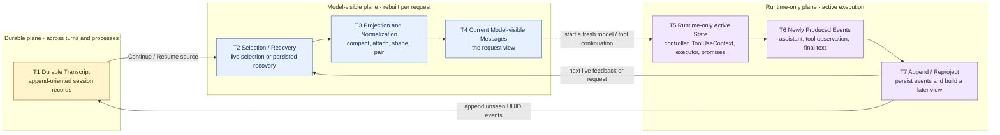

# 01：Transcript 与 Model Context——“会话历史”不是一份数组

[← 返回：Session Continuity 总览](README.md) · [下一章：Compaction](02-compaction.md)

> Claude Code 说“会话历史”时，究竟是在说落盘记录、当前模型窗口，还是正在运行的一次 turn？

答案是：**三者都可能被口语化地叫作 history 或 context，但它们不是同一份状态。**

**[Architectural interpretation]** Claude Code 的连续性不是“把一份 Messages 数组永久保存，再原样塞回模型”，而是三类状态之间的转换：durable transcript 保存可恢复的事件来源；model-visible messages 是当前请求的投影；runtime-only active state 则承载这次执行还活着的控制对象。

本文继续使用三类证据标签：

- **[Source-confirmed]**：快照中的指定 symbol 直接实现了这条行为；
- **[Architectural interpretation]**：由多个源码事实拼出的系统结论，源码不会逐字写出这句话；
- **[General principle]**：可迁移的工程原则，不冒充 Claude Code 的实现事实。

所有源码事实固定在快照 `712b24f22a63eb6d1a2f86697bf6dbbaa39ae3cf`。正文以 `snapshot + repository-relative path + symbol` 标记证据；行号只作为 pinned link 的辅助定位，不拿来组织文章。

## 1. 先建立完整画面：三条状态平面，七个转换节点



这张图最重要的不是箭头数量，而是三个不能混用的节点：

- **T1 Durable Transcript** 是可跨 turn、通常也可跨进程读取的记录来源；
- **T4 Current Model-visible Messages** 是某一次 API request 真正采用的消息视图；
- **T5 Runtime-only Active State** 是当前执行仍活着的控制状态。

它们的 owner、lifetime 和恢复能力都不同。

### 1.1 T1–T7 各自改变了什么

| 节点 | 输入 | 决策 / 状态变化 | 输出 |
| --- | --- | --- | --- |
| **T1 Durable Transcript** | 已被 logging adapter 接收的 loggable events | 清洗、按 UUID 去重、链接 parent chain、追加 unseen records | 可供 later recovery 使用的 durable source history |
| **T2 Selection / Recovery** | live loop messages，或 Continue/Resume 选中的 transcript | 普通 live path 选择当前消息；跨进程 path 才加载并反序列化 durable records | recovery candidate messages + 可重建 metadata |
| **T3 Projection and Normalization** | candidate messages、compact result、entry context、attachments、request constraints | 选择 compacted continuation；加入适用的派生信息；规范化协议；normal repair 或 strict reject | 合法的 request candidate |
| **T4 Current Model-visible Messages** | T3 的 request candidate | 与 system、tools 等 request fields 一起提交 | 模型本次真正看见的 conversation view |
| **T5 Runtime-only Active State** | entry options、fresh controller、ToolUseContext、loop state | 持有执行、取消、权限、缓存、tracking 与 pending work | 当前 model/tool continuation 的控制面 |
| **T6 Newly Produced Events** | model delta、Tool Intent、Tool Observation、terminal text/error | Query Loop 形成新的可关联事件，并更新 runtime state | feedback candidates + persistence candidates |
| **T7 Append / Reproject** | T6 events 与当前 live state | 一条路径追加 durable transcript；另一条路径为下一次 feedback/request 重建视图 | T1 的新记录，以及回到 T2 的 later projection |

### 1.2 图中最容易产生的三个误读

#### 误读一：T1 每次都直接喂给模型

不是。**[Source-confirmed]** 普通已经运行中的 session 由 `src/query.ts` / `queryLoop` 持有当前 `State.messages`，后续 feedback iteration 直接从当前 loop state 继续。只有 Continue/Resume 等 recovery path 才需要从 durable source 重新加载。

所以 T1 是**跨生命周期的恢复来源**，不是每次请求都会 read-through 的数据库。

#### 误读二：T7 是一次原子事务

不是。append 与 reproject 是两条不同路径。交互 UI 可以 fire-and-forget transcript logging；SDK path 又有自己的 await/flush 边界。下一轮 live feedback 能继续，并不自动证明相应磁盘写入已经在同一时刻完成。

#### 误读三：T5 可以由 transcript 完整恢复

不是。Transcript 可以帮助重建 messages、interruption metadata、session identity 等**可序列化状态**，却不会把旧 `AbortController`、executor、pending Promise 或 JavaScript call stack 重新变活。

## 2. Artifact 表：先问“它是什么”，再问“它在哪里”

仅说“history 在 messages 里”没有解释力。面试时应该对每个 artifact 追问：它包含什么、明确缺少什么、谁拥有、活多久、如何重建、模型是否直接看到。

| artifact | contains | omits | owner | lifetime | reconstructed from | model-visible? |
| --- | --- | --- | --- | --- | --- | --- |
| **durable transcript entries** | 可记录的 user/assistant/tool/attachment/compact events、UUID、chain metadata | active controller、executor、Promise；也不承诺保存每个纯 runtime/virtual object | `useLogMessages` / `QueryEngine` 等 adapter，最终进入 session storage | 跨 turn；local recovery path 可跨进程 | JSONL / session storage | **否，不能自动看见** |
| **current model-visible messages** | 当前任务、仍被选择的历史、闭合的 Tool Intent/Observation、适用 summary/attachments | 被投影排除的旧细节；runtime callbacks 和 controller | `queryLoop` + `queryModel` request construction | 一次 model request / feedback iteration | live loop state，或 recovery/compaction projection | **是** |
| **runtime-only active state** | `ToolUseContext`、active `AbortController`、executor、tracking、retry counters、pending promises、permission callbacks、read caches | 它不是 durable conversation representation | REPL / QueryEngine / query / tool runtime | 当前执行或 process | entry options + freshly constructed objects + 少量可恢复 metadata | **否**；只有显式派生内容可见 |
| **queued user input** | 尚未被消费的 queued commands 与 priority/address 信息 | 仅排队时还不是 original user transcript row | `messageQueueManager` 等 queue owner | 消费、删除、清空或 process 结束之前 | process memory | **排队时否**；投影成 attachment 后才是 |
| **compaction metadata / summary** | boundary、summary、retained tail、attachments、hook results 与相关 metadata | 当前窗口中被 summary 替代的旧细节 | compact service + query loop | later continuation；相关新 records 也可被追加 | current messages + `CompactionResult` | `buildPostCompactMessages` 后是 |
| **pending child-agent message** | parent-facing notification/attachment | child 的 controller、tool execution、完整 lifecycle | pending-message owner + parent attachment builder | 直到被投影/消费，按对应 owner 管理 | 显式 pending state | **只有 parent-facing attachment 被投影后才是** |

**[Architectural interpretation]** 这张表给出一个简单的判定法：如果一个对象不能被序列化为协议消息，又没有明确的 recovery adapter，就不要把它描述成“会话历史的一部分”。

### 2.1 同一个事实可以在不同平面拥有不同形态

以一次测试命令为例：

```text
模型提出的 Bash Tool Intent
  ≠ runtime 中正在执行的 child process / abort signal
  ≠ durable transcript 中记录的 assistant event
  ≠ 下一次 request 里的 normalized assistant tool_use block
```

它们通过相同 `tool_use_id` 和明确转换发生关联，但不共享同一种 lifetime。

## 3. 一条普通 failing-test turn 的六个状态快照

继续沿用前文同一条主线：

```text
User: locate and fix a failing test

Grep candidate
  → Read relevant region
  → Edit exact failing assertion
  → Bash run targeted test
  → final answer
```

这六个快照先走**同一个进程中、普通 main-thread live session**。Continue/Resume 放到后面作为 later variant，避免还没理解正常路径就先看恢复分支。

### 3.1 Snapshot 1：用户输入之前

| 平面 | 此刻有什么 | 此刻没有什么 |
| --- | --- | --- |
| **Durable / T1** | 可能有之前 turn 的 user、assistant、Tool Intent/Observation 与 compact records | 当前新任务还不存在 |
| **Model-visible / T4** | 还没有为这次新任务提交 request；“磁盘里存在”不等于模型此刻正在阅读 | 当前任务、这次 entry attachments |
| **Runtime-only / T5** | REPL/session UI 可以存在，queue manager 可以存在 | 这次 query 的 active controller、ToolUseContext、executor 尚未建立或尚未进入 active work |

这里要先接受一个看似反直觉的事实：**模型没有一个常驻的“会话脑内窗口”。** 每次 request 前，runtime 都要重新构造本次可见视图。

### 3.2 Snapshot 2：输入已被接受

用户提交：

```text
locate and fix a failing test
```

| 平面 | 状态变化 |
| --- | --- |
| **Durable / T1** | 当前 user event 成为 append candidate。SDK/QueryEngine ordinary path 会在进入 query loop 前 await 这次记录；bare path 可以 fire-and-forget；interactive UI 由 `useLogMessages` effect 异步观察并记录。 |
| **Model-visible / T4** | 当前 user task 与适用的 context/attachments 被组装成第一次 request candidate；它不是把整份 transcript 原样复制。 |
| **Runtime-only / T5** | 新的 controller、ToolUseContext、model/tool tracking、permission callbacks 等开始服务这次执行。 |

**[Source-confirmed]** 快照中的 `src/QueryEngine.ts` / `QueryEngine.submitMessage` 明确把 SDK 接受的 user messages 在进入 `query` 之前交给 `recordTranscript`；`src/hooks/useLogMessages.ts` / `useLogMessages` 则明确使用 fire-and-forget，避免阻塞 UI。因此不能发明一条覆盖所有 entry point 的“input accepted = 同步 fsync 完成”规则。

### 3.3 Snapshot 3：模型与 Tool work 正在运行

第一次模型调用可能提出：

```yaml
type: tool_use
id: grep-1
name: Grep
input:
  pattern: failing test evidence
```

之后 Read、Edit、Bash 会依次进入自己的 Tool Intent / Observation 闭环。

| 平面 | 此刻有什么 | 关键边界 |
| --- | --- | --- |
| **Durable / T1** | user event通常已进入或正在进入 append path；已经 yield 并被 logger 观察的 assistant blocks 也可成为 append candidate | fire-and-forget entry 可能让 durable completion 暂时落后于 live state |
| **Model-visible / T4** | 当前 request 已看见 user task、此前选中的历史和 tool schemas；模型提出 intent 后，本次生成阶段不会凭空看到尚未产生的 observation | Tool effect 的 live process 不在 request 中 |
| **Runtime-only / T5** | active signal、ToolUseContext、executor、pending tool IDs、Permission/Sandbox/File state、stream tracking | 这些对象影响执行，却不会整体序列化回模型 |

Controlled Effects 负责 Grep/Read/Edit/Bash 的授权与机器效果；本文只关心它们何时变成 T6 events，以及怎样进入 later projection 与 transcript。

### 3.4 Snapshot 4：Tool Intent 与 Tool Observation 已闭合

假设 runtime 已完成四个工具步骤，当前协议历史的核心形态是：

```yaml
- assistant: { tool_use: { id: grep-1, name: Grep, input: ... } }
- user:      { tool_result: { tool_use_id: grep-1, content: ... } }
- assistant: { tool_use: { id: read-1, name: Read, input: ... } }
- user:      { tool_result: { tool_use_id: read-1, content: ... } }
- assistant: { tool_use: { id: edit-1, name: Edit, input: ... } }
- user:      { tool_result: { tool_use_id: edit-1, content: ... } }
- assistant: { tool_use: { id: bash-1, name: Bash, input: ... } }
- user:      { tool_result: { tool_use_id: bash-1, content: "targeted test passed" } }
```

| 平面 | 状态变化 |
| --- | --- |
| **Durable / T1** | loggable assistant/user events按其 adapter timing 追加；`recordTranscript` 用 UUID 去重，所以 repeated full-array logging 不等于重复写入同一 event。 |
| **Model-visible / T4** | 下一次 feedback request 可以看见被选中的闭合 pairs；它看见的是 normalized protocol blocks，不是 Tool executor 本身。 |
| **Runtime-only / T5** | 已完成 tool 的 pending executor state 可以释放或被后续 state 取代；文件缓存、tracking 等仍按各 owner 更新。 |

**[Source-confirmed]** `src/utils/messages.ts` / `ensureToolResultPairing` 还建立了一个恢复边界：若历史中存在 malformed pair，normal mode 会合成 error result、移除 orphan/duplicate blocks；strict mode 则在 API submission 前抛错。不能把 normal repair 写成无条件行为。

### 3.5 Snapshot 5：最终回答产生

模型看到 `bash-1` 的成功 observation 后，生成 terminal text，例如：

```text
修复了失败断言，targeted test 已通过。
```

| 平面 | 状态变化 |
| --- | --- |
| **Durable / T1** | final assistant event 成为新的 append candidate；完成时点仍由具体 entry adapter 与 write/flush 策略决定。 |
| **Model-visible / T4** | 这段 text 是本次 model output；它不需要在同一个 request 中再次“被模型看见”才算产生。 |
| **Runtime-only / T5** | 当前 query 可以走向 Stop；controller、executor 与 pending promises 结束或释放。 |

Stop 表示这次 active continuation 完成，不表示整份 transcript 已经变成下一次 model window，也不表示所有 process-local 对象都已持久化。

### 3.6 Snapshot 6：下一次用户请求到来之前

此时三个平面再次分离：

```text
T1 durable transcript
  可能包含：旧历史 + 当前 user + Grep/Read/Edit/Bash pairs + final answer

T4 model-visible messages
  当前没有常驻 request；下一次调用时才重新选择/投影

T5 runtime-only active state
  上一次 controller/executor 已结束；下一 turn 会创建新的 active state
```

如果同一进程继续，next turn 通常从当前 live message state 进入 T2/T3；如果进程已退出，Continue/Resume 才从 T1 重新加载。两者最终都会回到普通 Model Turn，而不是绕过 request construction。

## 4. Transcript 怎样变成下一次 Model View

这一节只解释**时间与持久化边界**。system、tools、cwd、memory、attachments 怎样组成完整 request，请回到 [Context Assembly](../01-model-turn/01-context-assembly.md)。

### 4.1 第一步：选择 live state，或加载 durable source（T2）

存在两条起点：

#### 普通 live continuation

**[Source-confirmed]** `src/query.ts` / `queryLoop` 直接持有当前 `State.messages`。一批 Tool Observation 闭合后，loop 用当前 messages、assistant messages、tool results 与 applicable attachments 构造下一 iteration。它不需要为了每次 feedback 都重新读取 JSONL。

#### Continue / Resume recovery

**[Source-confirmed]** `src/cli/print.ts` / `loadInitialMessages` 与 `src/utils/conversationRecovery.ts` / `loadConversationForResume` 建立 later recovery：

- Continue 在对应 headless path 中不传 session identity，选择最新 eligible log；
- Resume 提供 session ID、JSONL path 或已选 `LogOption`；
- loader 读取完整 log、恢复可支持的 skill/session metadata、反序列化 messages、检测 interrupted turn，并加入 Resume hooks 的 messages。

这里恢复的是**可重建状态**，不是把旧 process 的 heap 载回来。

### 4.2 第二步：修复 recovery-level protocol structure

恢复后的原始记录可能在 tool pair 中间结束：例如 assistant 已经留下 `tool_use`，process 却在对应 `tool_result` 写入前退出。

源码存在两层相关处理：

1. `loadConversationForResume` 调用 `deserializeMessagesWithInterruptDetection`，恢复 message shape 并导出 `turnInterruptionState`；
2. 真正提交 API 前，`queryModel` 调用 `normalizeMessagesForAPI` 与 `ensureToolResultPairing`。

两者不能合并成一句“Resume 会自动修好所有状态”。前者属于 transcript recovery；后者属于 request protocol gate。

### 4.3 第三步：存在 Compaction 时采用 compacted projection

**[Source-confirmed]** `src/services/compact/compact.ts` / `buildPostCompactMessages` 不返回全部旧 messages，而是构造：

```text
boundary marker
  + summary messages
  + selected messagesToKeep
  + attachments
  + hook results
```

`queryLoop` 把这个结果作为 later continuation state，再走普通请求路径。

在本文检查的 local path 中，`recordTranscript` 是 append/de-duplicate helper，没有删除旧 transcript rows；因此可以说：**Compaction 改变 model-visible continuation，不在这条 traced path 上原地抹掉原 durable history。** 这不是对 remote retention、manual clear 或其他 cleanup subsystem 的全局承诺。

### 4.4 第四步：加入当前 entry 才适用的派生内容

当前 request 可以加入并非 original user record 的内容：

- current user input；
- Resume session-start hook messages；
- queued input 被显式消费后形成的 parent-facing attachment；
- pending child message 被显式投影后形成的 parent-facing attachment；
- entry-specific user/system context；
- compact boundary、summary 与 retained tail。

Queued input 和 pending child messages 在这一章只说明**投影边界**。它们如何产生、被取消或完成，分别属于 Interrupt/Queue 与 Subagent lifecycle 的 owner。

### 4.5 第五步：做 API normalization 与 pairing gate（T3）

**[Source-confirmed]** `src/services/api/claude.ts` / `queryModel` 的相关顺序是：

```text
normalizeMessagesForAPI
  → initial model-specific tool-search shaping
  → ensureToolResultPairing
  → later advisor/media filtering
  → later synthetic/request injection
  → API request
```

这个顺序揭示了两个边界：

1. transcript record 不是 API-ready message；
2. pairing repair 本身也不是最后一个 request transformation。

#### Normal pairing mode

检测到 mismatch 后，runtime 可以：

- 为缺失 result 的 `tool_use` 插入 synthetic error `tool_result`；
- 删除找不到对应 intent 的 orphan result；
- 去重重复 ID 或重复 result；
- 保持 role alternation 所需的 placeholder。

这会让 model-visible projection 包含 durable original rows 中没有的派生 block。

#### Strict pairing mode

`ensureToolResultPairing` 一旦检测到需要 repair 的结构，strict mode 会 throw，拒绝把“已经被悄悄改写的历史”提交给 API。

所以正确的不变量是：

> malformed pairing 在 normal mode 被修复，或在 strict mode 被拒绝；它不会原样穿过 pairing gate。

### 4.6 第六步：runtime controls 留在 request 外（T4 → T5）

Model request 可以携带 selected messages、system、tools 与 generation options，却不会把整个 `ToolUseContext` 序列化进去。

**[Source-confirmed]** `src/query.ts` / `queryLoop` 的 state 同时维护 messages、`toolUseContext`、compaction tracking、retry/turn counters 与 pending summaries；`src/services/api/claude.ts` / `queryModel` 只构造 API request fields。这是 model-visible data plane 与 runtime control plane 的源码边界。

## 5. Append：什么时候算“已经写进历史”

最危险的说法是：“每产生一条消息，就同步写入 transcript。”源码并没有一条适用于所有 entry point 的统一事务。

### 5.1 Common helper：清洗、去重、链接、追加

**[Source-confirmed]** `(712b24f22a63eb6d1a2f86697bf6dbbaa39ae3cf, src/utils/sessionStorage.ts, recordTranscript)`：

```text
messages
  → cleanMessagesForLogging
  → compare UUIDs with getSessionMessages(sessionId)
  → collect only unseen newMessages
  → Project.insertMessageChain(newMessages, startingParentUuid, ...)
  → return last recorded chain participant
```

两个细节很关键：

- 调用方可以反复交 full array；UUID de-duplication 决定哪些 record 真正新增；
- after-compaction retained messages 可能已存在，helper 会跳过它们并维持正确 parent linkage。

这是一条 append-oriented persistence path，不是“把当前 Messages 数组覆盖保存成唯一真相”。

### 5.2 Interactive UI：observer-driven、fire-and-forget

**[Source-confirmed]** `(712b24f22a63eb6d1a2f86697bf6dbbaa39ae3cf, src/hooks/useLogMessages.ts, useLogMessages)`：

- React effect 观察 messages；
- 普通增长只取新 tail，compaction/rebuild 则交 full array 给 `recordTranscript` 自己去重；
- `recordTranscript(...)` 明确是 fire-and-forget，避免阻塞 UI；
- sequence guard 防止较旧 async completion 覆盖较新的 parent tracking。

因此 snapshot 中必须允许一个短暂状态：live messages 已经增加，但 durable append 仍在写队列中。

### 5.3 QueryEngine / SDK：先记 input，后进 query；后续 event 又分类型

**[Source-confirmed]** `(712b24f22a63eb6d1a2f86697bf6dbbaa39ae3cf, src/QueryEngine.ts, QueryEngine.submitMessage)`：

- 接受 user input 后，在进入 query loop 前调用 `recordTranscript(messages)`；
- ordinary SDK path await 该记录，使“还没拿到 assistant response 就被停止”时仍有可 Resume 的 user source；
- bare mode为了 latency 可以 fire-and-forget；
- query yield 后，assistant record 走 fire-and-forget，user/compact-boundary record 会 await；
- eager/cowork 等适用配置还会在指定边界显式 flush。

参见 pinned source：[QueryEngine.submitMessage](https://github.com/buoylee/Claude-Code-true/blob/712b24f22a63eb6d1a2f86697bf6dbbaa39ae3cf/src/QueryEngine.ts#L209-L1156)。

这不是要读者背所有分支，而是证明一件事：**append acknowledgement 是 entry-specific contract。**

### 5.4 不完整状态为什么可能合法存在于 durable source

进程可以在任何时点退出：

```text
user 已 durable，assistant 尚未产生
assistant tool_use 已 durable，tool_result 尚未产生
tool_result 已进入 live state，对应 fire-and-forget append 尚未完成
final answer 已 yield，某些 buffered writes 正等待 flush
```

所以 recovery 不能假设 transcript 永远结束在完整业务 transaction 边界；它必须识别 interruption，并在 API submission 前建立协议合法性。

**[General principle]** 事件日志的 durability boundary 与协议完整性 boundary 是两回事。前者回答“哪些 event 跨 crash 留下”，后者回答“later consumer 能否合法解释这些 event”。

### 5.5 Abort 不等于删除

**[Source-confirmed, traced local path scope]** active abort 会停止共享该 signal 的当前 model/tool continuation；`recordTranscript` 则只做 clean/de-duplicate/append，没有“abort 后删除已记录 rows”的步骤。

因此不能说：

```text
用户按下取消
  ⇒ 这次 turn 的 durable events 自动回滚
```

详细的 `user-cancel`、queued `interrupt`、queue consumption 与 Continue/Resume 路由由后续 Interrupt / Queue / Continue / Resume 章节展开。本文只锁定 transcript 不会因为 active abort 自动回滚。

## 6. 为什么 Transcript 与下一次 Model Window 双向都不相等

### 6.1 Durable history 可以比下一次模型窗口更大

假设 transcript 已积累：

```text
100 个早期 user/assistant/tool events
+ 1 个 compact boundary
+ 1 份 summary
+ 8 个 retained tail events
+ 当前 input
```

下一次 request 可以只采用：

```text
boundary + summary + retained tail + current input + applicable attachments
```

早期 100 个 events 仍可存在于 durable source，却不再逐条占用当前 model window。

### 6.2 当前 model window 也可以包含 original user rows 中没有的内容

| derived context | 为什么出现 | 是否等于原始 user record |
| --- | --- | --- |
| compact summary | 用较短表示保留 continuity | 否，它是转换产物 |
| synthetic error `tool_result` | normal pairing repair 闭合 orphan intent | 否，它是 protocol repair |
| queued command attachment | queue item被消费并投影到 parent | 否，排队时不是 original transcript user row |
| pending child attachment | parent显式接收异步 child notification | 否，它是 parent-facing projection |
| Resume hook message | later recovery entry运行 hook | 否，它在 recovery 时派生 |
| dynamic entry context | 当前路径、memory、attachment collector 的适用事实 | 不一定；由 Context Assembly 决定形态 |

因此真正的关系是：

```text
currentModelView = project(durable/live sources, current entry, runtime policy)
```

而不是：

```text
currentModelView = durableTranscript
```

## 7. 机制优先的伪代码：`reconstructModelView`

下面是**[Architectural interpretation]**，不是源码中同名函数。它把分散在 loader、query loop、compaction、attachments 与 API normalization 中的责任压缩成一份面试可讲的机制模型。

```text
reconstructModelView(sessionId, newInput)
  -> { durableBase, projectedMessages, runtimeState }

function reconstructModelView(sessionId, newInput):
    # T2: ordinary live session may already have live messages;
    # Continue/Resume instead loads persisted source material.
    if hasLiveSessionState(sessionId):
        durableBase = lastKnownDurableChainReference(sessionId)
        recoveredMessages = snapshotSelectedLiveMessages(sessionId)
        recoveryMeta = currentReconstructibleMetadata(sessionId)
    else:
        durableBase = selectDurableSessionSource(sessionId)
        loaded = loadAndRecoverConversation(durableBase)
        recoveredMessages = loaded.messages
        recoveryMeta = loaded.turnInterruptionState + loaded.sessionMetadata

    # The real recovery adapter combines load, deserialization and interruption
    # detection. It makes persisted shapes understandable; it does not revive a stack.

    # T3: when a compact continuation exists, use its explicit projection.
    if hasApplicableCompaction(recoveredMessages):
        continuation = buildPostCompactMessages(compactionResult(recoveredMessages))
    else:
        continuation = recoveredMessages

    entryMessages = acceptCurrentInput(newInput)

    # Only explicit projections cross into the model-visible plane.
    attachments = collectApplicableParentAttachments(
        consumedQueuedInput,
        pendingChildMessages,
        entryContext
    )

    candidate = continuation + entryMessages + attachments
    normalized = normalizeMessagesForAPI(candidate, currentTools)
    shaped = applyInitialModelSpecificShaping(normalized)

    if hasToolPairMismatch(shaped):
        if strictPairingMode:
            throw PairingMismatchBeforeAPISubmission
        shaped = repairToolPairingWithSyntheticErrorsAndFiltering(shaped)

    projectedMessages = applyLaterRequestFiltersAndInjection(shaped)

    # T5: create fresh runtime controls; never deserialize old promises/stacks.
    runtimeState = {
        abortController: createFreshController(),
        toolUseContext: createFreshToolUseContext(recoveryMeta),
        executor: createFreshExecutor(),
        tracking: initializeTracking(recoveryMeta),
        pendingPromises: []
    }

    # Accepted-input append timing is owned by the entry adapter.
    persistAcceptedInputAccordingToEntrypoint(entryMessages)

    return { durableBase, projectedMessages, runtimeState }
```

这段伪代码刻意做了四个区分：

1. live continuation 与 Continue/Resume 不是同一种读取路径；
2. recovery 与 API normalization 不是同一步；
3. normal repair 与 strict reject 不是同一结局；
4. runtime state 是 fresh construction，不是 transcript deserialization 的副产品。

## 8. 四个决定性 Source Lens

本章 T1–T7 的 claim-oriented 证据表见 [Source Evidence Index](../appendices/source-evidence-index.md#42-t1t7-transcript-and-model-context)。

源码片段只保留能改变心智模型的几行；它们不是按行号追踪整个实现。

### 8.1 Lens A：live observer 与 durable append 是两层

**[Source-confirmed]** `(712b24f22a63eb6d1a2f86697bf6dbbaa39ae3cf, src/hooks/useLogMessages.ts, useLogMessages)` 与 `(712b24f22a63eb6d1a2f86697bf6dbbaa39ae3cf, src/utils/sessionStorage.ts, recordTranscript)`。

```ts
// useLogMessages: UI path does not block on durable completion
void recordTranscript(slice, teamInfo, parentHint, messages)
```

```ts
// recordTranscript: persistence decides which UUIDs are actually new
const cleanedMessages = cleanMessagesForLogging(messages, allMessages)
const messageSet = await getSessionMessages(sessionId)

// ... collect unseen newMessages ...

if (newMessages.length > 0) {
  await getProject().insertMessageChain(
    newMessages,
    false,
    undefined,
    startingParentUuid,
    teamInfo,
  )
}
```

参见 pinned source：[useLogMessages](https://github.com/buoylee/Claude-Code-true/blob/712b24f22a63eb6d1a2f86697bf6dbbaa39ae3cf/src/hooks/useLogMessages.ts#L19-L119) · [recordTranscript](https://github.com/buoylee/Claude-Code-true/blob/712b24f22a63eb6d1a2f86697bf6dbbaa39ae3cf/src/utils/sessionStorage.ts#L1408-L1449)。

**它证明什么：** live array 的更新触发 append，但二者不是同一原子动作；共同 helper 还会做清洗、去重与 parent-chain 处理。

### 8.2 Lens B：Resume 加载 records，再恢复可重建状态

**[Source-confirmed]** `(712b24f22a63eb6d1a2f86697bf6dbbaa39ae3cf, src/utils/conversationRecovery.ts, loadConversationForResume)`。

```ts
restoreSkillStateFromMessages(messages!)

const deserialized = deserializeMessagesWithInterruptDetection(messages!)
messages = deserialized.messages

const hookMessages = await processSessionStartHooks('resume', { sessionId })
messages.push(...hookMessages)

return {
  messages,
  turnInterruptionState: deserialized.turnInterruptionState,
  sessionId,
  // ... reconstructible metadata ...
}
```

参见 pinned source：[loadConversationForResume](https://github.com/buoylee/Claude-Code-true/blob/712b24f22a63eb6d1a2f86697bf6dbbaa39ae3cf/src/utils/conversationRecovery.ts#L456-L597)。

**它证明什么：** Resume 是 load → deserialize/detect → add resume-time messages → return reconstructible state。它没有恢复旧 controller、executor 或 suspended call stack。

### 8.3 Lens C：API request 前还要 normalization 与 pairing gate

**[Source-confirmed]** `(712b24f22a63eb6d1a2f86697bf6dbbaa39ae3cf, src/services/api/claude.ts, queryModel)` 与 `(712b24f22a63eb6d1a2f86697bf6dbbaa39ae3cf, src/utils/messages.ts, ensureToolResultPairing)`。

```ts
let messagesForAPI = normalizeMessagesForAPI(messages, filteredTools)

// initial model-specific post-processing

messagesForAPI = ensureToolResultPairing(messagesForAPI)

// later advisor/media filters and request-specific injection
```

严格模式的决定性分支是：

```ts
if (repaired) {
  if (getStrictToolResultPairing()) {
    throw new Error(/* pairing mismatch: refuse repair */)
  }
  // log repair diagnostics
}

return result
```

参见 pinned source：[queryModel request shaping](https://github.com/buoylee/Claude-Code-true/blob/712b24f22a63eb6d1a2f86697bf6dbbaa39ae3cf/src/services/api/claude.ts#L1260-L1345) · [ensureToolResultPairing](https://github.com/buoylee/Claude-Code-true/blob/712b24f22a63eb6d1a2f86697bf6dbbaa39ae3cf/src/utils/messages.ts#L5133-L5460)。

**它证明什么：** durable/recovered messages 不是 API-ready payload；正常路径 repair，strict path reject，而且后面仍可能继续做 request shaping。

### 8.4 Lens D：Compaction 构造 later projection，不是删除原数组

**[Source-confirmed]** `(712b24f22a63eb6d1a2f86697bf6dbbaa39ae3cf, src/services/compact/compact.ts, buildPostCompactMessages)`。

```ts
export function buildPostCompactMessages(result: CompactionResult): Message[] {
  return [
    result.boundaryMarker,
    ...result.summaryMessages,
    ...(result.messagesToKeep ?? []),
    ...result.attachments,
    ...result.hookResults,
  ]
}
```

参见 pinned source：[buildPostCompactMessages](https://github.com/buoylee/Claude-Code-true/blob/712b24f22a63eb6d1a2f86697bf6dbbaa39ae3cf/src/services/compact/compact.ts#L330-L338)。

**它证明什么：** post-compact model view 是从 structured result 新建的 continuation。结合 local `recordTranscript` 的 append-only traced path，不能把它说成“summary 覆盖并删除了原 durable rows”。

### 8.5 为什么没有贴更多源码

`normalizeMessagesForAPI` 和 `ensureToolResultPairing` 都是大函数；整段复制只会让读者重新陷入逐行追踪。这里保留的 lens 分别回答四个机制问题：

1. live state 与 durable append 是否同一步？
2. Resume 恢复的对象边界在哪里？
3. transcript 如何成为 API-legal projection？
4. Compaction 改写的是哪一层？

## 9. 必须守住的 Invariants

### 9.1 Persistence 与 projection 是两份责任

**[Architectural interpretation]** Transcript owner 负责“哪些 event 能跨生命周期留下”；request projection owner 负责“模型这次合法看见什么”。一个 event 已持久化，不保证本次 request 选中它；一个 block 出现在 request，也不保证它是 original user-authored row。

### 9.2 Tool Intent / Observation 以协议配对进入 later view

**[Source-confirmed]** normal mode 可以修复，strict mode 可以拒绝；两者都阻止 malformed pair 原样进入 API。Synthetic closure 是 request projection 的恢复行为，不应伪装成“对应机器效果真实成功过”。

### 9.3 Runtime-only state 只能显式派生，不能整体泄漏

**[General principle]** model-visible set 应该是 allowlist projection，而不是“把 session object 序列化后删几个敏感字段”。否则 controller、permission state、internal cache、credentials 或过量历史都可能越界。

### 9.4 Continue/Resume 建立 later execution

**[Architectural interpretation]** Continue 选择 latest eligible durable source，Resume 选择 explicit source；loader 重建 messages 与受支持 metadata，调用方再创建新的 controller/query execution。因此它们是 later execution，不是暂停栈的时间旅行。

### 9.5 Compaction 的“不删除”必须带 scope

**[Source-confirmed, traced local path scope]** 本文追踪的 compact reconstruction 新建 boundary/summary/tail projection；`recordTranscript` append unseen UUID events，没有在该路径删除旧 rows。

不能扩大成：

```text
Claude Code 在任何存储后端、任何 clear/delete/retention 操作下都永不删除记录
```

## 10. 常见误区

| 误区 | 正确说法 |
| --- | --- |
| transcript 就是 prompt | Transcript 是 durable source；prompt/request messages 是选择、恢复、compaction、attachments 与 normalization 后的 projection。 |
| 模型一直“记得”整个 session | 模型只看当前 request；runtime 每次重新构造本次 view。 |
| 所有 runtime state 都能从 transcript 恢复 | 只能恢复 messages 和明确序列化的 metadata；controller、executor、Promise、socket、stack 要重新创建。 |
| summary 取代并删除 original storage | 在 traced local path 中，summary 改变 continuation projection；旧 rows 没被 compact helper 原地删除。 |
| abort 会自动回滚本 turn transcript | Abort 影响 active continuation；已 durable events 不会因此自动删除。 |
| Resume 就是在旧代码位置继续执行 | Resume load/deserialize/reconstruct，然后开始 later execution。 |
| pair repair 永远发生 | normal mode repair；strict mode 在发现 mismatch 后 reject。 |
| queued input 排队时模型已经看到 | queue item 只有被显式转换成 attachment/message 后才跨进 model-visible plane。 |
| durable append 与 UI update 同时完成 | interactive logging 可以 fire-and-forget；不同 entry point 有不同 await/flush contract。 |

## 11. 设计取舍：为什么不直接保存一个“最终 Context”

### 11.1 Append-oriented transcript vs snapshot overwrite

| 方案 | 优点 | 代价 |
| --- | --- | --- |
| append events + UUID de-dup + chain | 支持增量记录、恢复、分支/parent relation、保留历史证据 | recovery/projection 更复杂；必须处理 interrupted tail |
| 每次覆盖一份 final messages snapshot | 读取简单，概念直观 | 并发/崩溃覆盖风险更高；历史证据、parent chain 与不同 projection 难保留 |

Claude Code 的 traced path 选择前者，因此 normalizing/recovery 不能被省略。

### 11.2 Fire-and-forget logging vs synchronous durability

| 选择 | 收益 | 风险 / 补偿 |
| --- | --- | --- |
| UI fire-and-forget | 不阻塞渲染与 streaming | live state 可短暂领先 durable completion；需要 ordered write、parent tracking 与 terminal flush policy |
| accepted input await | crash-before-response 时仍可 Resume 到 user intent | 增加入口 latency |

源码没有全局只选一个，而是按 entry contract 取舍。

### 11.3 Repair vs reject

| 模式 | 目标 | 代价 |
| --- | --- | --- |
| normal repair | 让受 interruption/旧 bug 影响的 session 继续工作 | synthetic block 会改变 model-visible history，需要 diagnostics，不能伪装真实 tool success |
| strict reject | 不允许 runtime 静默改变协议历史 | session 会停在错误边界，需要人工或更上层 recovery |

### 11.4 Full replay vs compacted projection

Full replay 保留细节，却受 context budget 限制；compacted projection 保留任务连续性，却把多个原始事件压缩成派生 summary。正因为两者权衡不同，durable transcript 与 current model view 必须分层。

## 12. 面试回答模板

### 12.1 30 秒版本

> Claude Code 的 session continuity 至少分三层：durable transcript 保存可恢复事件，current model-visible messages 是每次请求前从 live 或 durable state 选择、压缩、加附件并规范化得到的投影，runtime-only state 则保存 AbortController、ToolUseContext、executor 和 pending promises。普通 live feedback 用当前 loop messages，不会每轮重读 transcript；Continue/Resume 才加载持久化记录并重建 later execution。恢复时 malformed tool pairs 在 normal mode 被修复、strict mode 被拒绝。Compaction 改变当前 continuation view，在本文追踪的 local path 中不会原地删除旧 transcript rows。

### 12.2 追问一：为什么 transcript 不能直接发给模型？

因为 durable record 的目标是恢复与审计，不保证符合当前模型、当前 tool schemas、当前 context budget 或 tool-pair protocol。API 前仍要做 selection、compaction、attachment projection、normalization、pairing gate 与 request-specific shaping。

### 12.3 追问二：Resume 能恢复到什么程度？

它能加载 messages，恢复明确保存的 skill/session metadata，检测 interrupted turn，并构造新的 request/runtime state；不能恢复旧 Promise、socket、executor、AbortController 或 suspended JavaScript stack。

### 12.4 追问三：为什么 normal mode 要造 synthetic tool result？

因为模型 API 需要合法的 `tool_use` / `tool_result` 结构。若 process 在 pair 中间中断，normal mode用 synthetic error closure 告诉模型“这次工具没有可靠结果”，比让 malformed payload 原样 400 更可恢复；strict mode则选择拒绝这种自动改写。

### 12.5 追问四：取消后历史会回滚吗？

不会由 abort 自动回滚。Abort 控制当前 active continuation；本文追踪的 transcript helper 是 clean/de-duplicate/append path。已经 durable 的 rows 不会因为 signal 被触发就自动删除。

## 13. 源码阅读路线：沿状态变换，不沿文件数量

如果要现场打开源码，推荐只走四步：

1. 从 [`useLogMessages`](https://github.com/buoylee/Claude-Code-true/blob/712b24f22a63eb6d1a2f86697bf6dbbaa39ae3cf/src/hooks/useLogMessages.ts#L19-L119) 到 [`recordTranscript`](https://github.com/buoylee/Claude-Code-true/blob/712b24f22a63eb6d1a2f86697bf6dbbaa39ae3cf/src/utils/sessionStorage.ts#L1408-L1449)，确认 T6/T7 怎样进入 T1；
2. 看 [`loadConversationForResume`](https://github.com/buoylee/Claude-Code-true/blob/712b24f22a63eb6d1a2f86697bf6dbbaa39ae3cf/src/utils/conversationRecovery.ts#L456-L597)，确认 T1 怎样成为 T2 recovery candidate；
3. 看 [`queryModel`](https://github.com/buoylee/Claude-Code-true/blob/712b24f22a63eb6d1a2f86697bf6dbbaa39ae3cf/src/services/api/claude.ts#L1260-L1345) 与 [`ensureToolResultPairing`](https://github.com/buoylee/Claude-Code-true/blob/712b24f22a63eb6d1a2f86697bf6dbbaa39ae3cf/src/utils/messages.ts#L5133-L5460)，确认 T2/T3 怎样成为 T4；
4. 最后看 [`buildPostCompactMessages`](https://github.com/buoylee/Claude-Code-true/blob/712b24f22a63eb6d1a2f86697bf6dbbaa39ae3cf/src/services/compact/compact.ts#L330-L338)，确认 context pressure 下为什么不再 full replay。

这条路线始终围绕一个问题：**状态的 owner 与形态在哪个箭头发生改变？**

## 14. 交给 Compaction 的问题

现在我们已经知道：durable transcript 不是 current model window，current model window 也不是 runtime stack。

下一步真正的问题是：

> 当模型 context budget 成为限制时，Claude Code 如何决定什么时候 compact、压缩哪些历史、保留哪段 Tool Intent / Observation tail、怎样构造 post-compact messages，以及失败时如何继续而不破坏 session continuity？

这正是 Compaction 要接住的主线。

[← 返回：Session Continuity 总览](README.md) · [下一章：Compaction](02-compaction.md)
