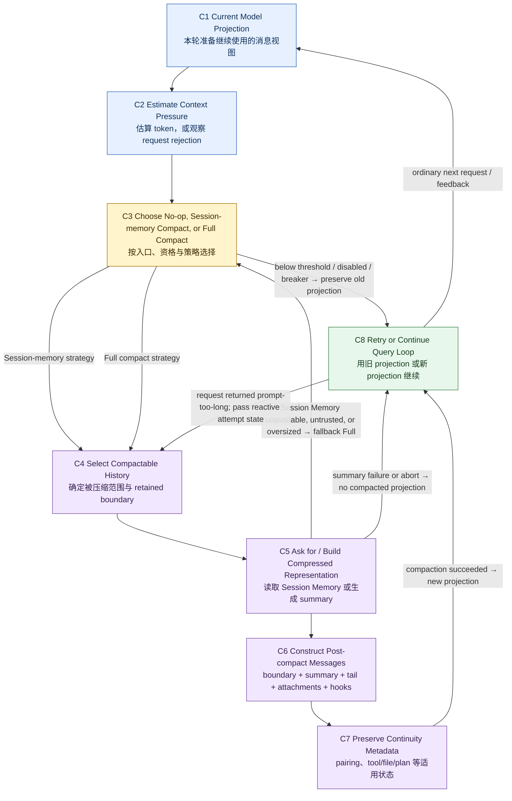

# 02：Compaction——压缩的是当前延续，不是删除会话历史

[← 上一章：Transcript 与 Model Context](01-transcript-and-model-context.md)

> Context window 快满时，Claude Code 怎样减少历史，又不让正在进行的任务“失忆”？

先给结论：**Compaction 是对 latest model-visible continuation 的有损转换。** 它先判断当前 projection 是否承受了足够大的 context pressure，再选择压缩策略，最后用 boundary、summary、必要的 retained tail 与 continuity metadata 构造一份新的消息视图。Query Loop 随后仍走普通 model request path。

它不是把 durable transcript 原地覆盖成 summary，也不是保存或恢复一段 suspended JavaScript stack。

本文沿用三种证据标签：

- **[Source-confirmed]**：快照中的指定 symbol 直接实现了这条行为；
- **[Architectural interpretation]**：由多个源码事实拼出的系统结论；
- **[General principle]**：可以迁移到其他 Agent runtime 的设计原则，不冒充源码事实。

所有源码事实固定在快照 `712b24f22a63eb6d1a2f86697bf6dbbaa39ae3cf`。证据采用 `snapshot + repository-relative path + symbol`；pinned link 中的行号只帮助定位。

## 1. 先看完整画面：预算、决策、重建、重试



图中最重要的是两类终点：

- **preserve old projection**：no-op、automatic full-compaction failure、abort 或 recovery failure 都没有产生可用的 `CompactionResult`；
- **produce new projection**：只有策略成功后，`buildPostCompactMessages` 才构造 C6，Query Loop 才能拿它替换当前 continuation。

这条分界防止把“尝试过压缩”误写成“已经压缩成功”。

### 1.1 C1–C8 每一步回答什么

| 节点 | 核心问题 | 输入 | 输出 |
| --- | --- | --- | --- |
| **C1 Current Model Projection** | 现在准备继续提交的是哪段 history？ | `queryLoop` 当前 `messagesForQuery` | 当前 continuation candidate |
| **C2 Estimate Context Pressure** | 预算还够吗，还是 API 已经拒绝？ | model、token usage/estimate、freed-snip delta，或 prompt-too-long error | proactive pressure 或 reactive overflow fact |
| **C3 Choose Strategy** | 不压、用 Session Memory，还是发起 full summary？ | eligibility、trigger、tracking、manual instructions | no-op 或具体策略 |
| **C4 Select Compactable History** | 哪些内容被 summary 覆盖，哪段 raw tail 必须保留？ | current projection、summary boundary、API invariants | summarizable range + retained range |
| **C5 Build Representation** | 压缩表示从哪里来？ | exposed Session Memory，或 summary model request | summary content / failure |
| **C6 Construct Messages** | 下一轮消息按什么顺序出现？ | `CompactionResult` fields | ordered post-compact messages |
| **C7 Preserve Metadata** | 除了文字摘要，还要携带哪些连续性事实？ | boundary metadata、tail、attachments、hooks | 可继续工作的 compacted continuation |
| **C8 Retry or Continue** | 继续旧视图，还是从新视图重试？ | success/no-op/failure/reactive result | ordinary Query Loop continuation 或 terminal error |

### 1.2 Proactive 与 reactive 不观察同一种事实

**[Source-confirmed]** proactive path 在 model request **之前**根据估算值决定是否 compact；reactive path 则必须先真实收到 prompt-too-long rejection，才能知道“这次 request 确实放不下”。

```text
proactive:
current projection → estimate → maybe compact → request

reactive:
current projection → request rejected → compact once → retry request
```

两者最终都可以回到 C6–C8，但触发证据和 retry state contract 不同。

## 2. 先理解 Trigger，再看 Summary 长什么样

Summary 内容写得再好，也必须先回答：为什么现在要产生它？

### 2.1 Effective context window 不是模型标称窗口

**[Source-confirmed]** `(712b24f22a63eb6d1a2f86697bf6dbbaa39ae3cf, src/services/compact/autoCompact.ts, getEffectiveContextWindowSize)` 先取得 model-specific context window，再保留 summary output 所需空间：

```text
modelWindow = contextWindowFor(model, activeBetas)
cappedWindow = min(modelWindow, positive env cap when configured)
summaryReserve = min(modelMaxOutput, MAX_OUTPUT_TOKENS_FOR_SUMMARY)

effectiveWindow = cappedWindow - summaryReserve
```

这意味着 proactive decision 不能只问“模型号称支持多少 token”。Runtime 还要保证压缩请求本身有输出空间。

### 2.2 Auto-compact threshold：明确保留 13,000 token headroom

**[Source-confirmed]** 同一模块把自动阈值计算为：

```text
baseAutoCompactThreshold = effectiveWindow - 13_000 tokens
```

如果合法的 `CLAUDE_AUTOCOMPACT_PCT_OVERRIDE` 存在，源码取 percentage threshold 与上式的较小值，所以 override 只能让 proactive compaction 更早发生。

这里可以安全写出 `13_000`，因为快照中 `AUTOCOMPACT_BUFFER_TOKENS = 13_000` 与减法单位都明确。它的适用范围也必须一起说清：

- 它是这个快照中 automatic compaction 的绝对 token buffer；
- 它在 model-specific effective window 计算**之后**应用；
- 它不是“永远在 93% compact”的百分比承诺；
- 环境 override 与不同 model window 都会改变最终阈值。

### 2.3 当前 usage 从哪里来

**[Source-confirmed]** `shouldAutoCompact` 使用：

```text
observedPressure = tokenCountWithEstimation(messages) - snipTokensFreed
```

`tokenCountWithEstimation` 可以利用最近一次 API usage，也需要为还没有 authoritative usage 的新增消息做估算。`snipTokensFreed` 则修正一个特定滞后：snip 已移除消息，但幸存 assistant 的 usage 仍可能反映 pre-snip context。

因此这里的正确表述是“基于可获得 usage 与 estimate 的 pressure decision”，而不是“对下一次完整 request 做精确 tokenization”。System prompt、tools 与 entry context 仍会影响真正提交时的总量。

### 2.4 Eligibility 在阈值比较之前

达到 token 数不代表一定 proactive compact。`shouldAutoCompact` 还会拒绝或绕开：

- `compact` / `session_memory` 等会造成递归或 deadlock 风险的 query source；
- automatic compaction 未启用；
- 由其他 context-management feature 明确接管的 applicable path；
- reactive-only 配置中的 proactive attempt。

所以 C2 回答 pressure，C3 才同时考虑 eligibility 与 strategy。

### 2.5 `AutoCompactTrackingState` 记住跨 iteration 的结果

**[Source-confirmed]** tracking 保存：

```text
compacted
turnId
turnCounter
consecutiveFailures?
```

前三项让 telemetry/decision 知道这是不是同一 chain 上的再次压缩、距离上次 compact 过了几轮；`consecutiveFailures` 则是 circuit breaker 输入。

这个快照把 automatic compaction 的连续失败上限设为 **3**。达到上限后，`autoCompactIfNeeded` no-op，不再每一轮持续发送注定失败的 summary request。成功会重置 failure count。

注意：这个“连续失败 3 次”与后面“单次 full compact 内部 prompt-too-long 最多重试 3 次”是两个不同层次的 guard，只是数值碰巧相同。

### 2.6 Manual trigger 与 automatic trigger

**[Source-confirmed]** `/compact` 是明确存在的 manual entry：

- 它不需要先越过 automatic threshold；
- 没有 custom instructions 时，可以先尝试 Session Memory；
- 有 custom instructions 时会跳过 Session Memory，因为该策略不支持这些 instructions；
- ordinary path 最终以 `isAutoCompact=false` 调用 full compaction；
- hooks 收到的 trigger 也区分 `manual` / `auto`。

因此“manual”描述的是入口意图，不代表它绕过 boundary、abort、summary validation 或 post-compact reconstruction。

### 2.7 Reactive trigger：只有失败后才知道

**[Source-confirmed]** `queryLoop` 会暂时 withheld 可恢复的 prompt-too-long error。若前置 recovery 没解决，它把以下事实交给 reactive compactor：

```text
hasAttemptedReactiveCompact
querySource
abort state
messagesForQuery
cache-safe request context
```

成功后，loop 设置 `hasAttemptedReactiveCompact=true`，记录 `reactive_compact_retry`，并从 post-compact messages 重新进入普通 request path。若 later request仍然 prompt-too-long，`queryLoop` 会把 `hasAttempted=true` 再交给 reactive compactor；callee 是否据此拒绝第二次 attempt，属于缺失 feature module 的内部 contract。若 callee 返回空结果，loop 才直接暴露 withheld error。

快照中 feature-elided 的 reactive implementation 文件不在 checkout；本文只使用 `queryLoop` 直接可见的 flag 初始化、保留、置位、传参与 state transition，不推断其内部切片算法或 one-attempt enforcement。

### 2.8 三类 trigger facts 的时间表

| fact | 什么时候可知 | owner | 对 decision 的作用 |
| --- | --- | --- | --- |
| model effective window | request 前 | model/config helpers | 确定理论预算上界 |
| token usage / estimate | request 前 | messages + token helpers | 判断 proactive pressure |
| freed-snip adjustment | snip 后、autocompact 前 | query-loop projection path | 修正滞后 usage |
| prior compact / failure count | 跨 query-loop iteration | `AutoCompactTrackingState` | recompaction telemetry 与 breaker |
| explicit `/compact` | 用户触发 command 时 | command adapter | 不依赖 threshold，直接进入 strategy selection |
| prompt-too-long rejection | request 失败后 | model API + Query Loop | 触发 reactive recovery，并传递 attempt state |
| abort | compaction 进行中 | shared `AbortController` | 停止 attempt；不产生成功 projection |

## 3. Canonical automatic path：从 failing-test 历史到可继续的 projection

继续使用上一章的同一条任务主线：

```text
User: locate and fix a failing test
  → Grep candidates
  → Read relevant region
  → Edit failing assertion
  → Bash run targeted test
  → continue investigation
```

这里选取“automatic threshold 到达，Session Memory strategy 可用并成功”的 canonical path。Full compact 是稍后的 fallback variant。

### 3.1 Before snapshot：三个平面仍然分离

#### Durable transcript

```yaml
- user: locate and fix a failing test
- assistant: tool_use grep-1
- user: tool_result grep-1 -> candidate files
- assistant: tool_use read-1
- user: tool_result read-1 -> failing assertion context
- assistant: tool_use edit-1
- user: tool_result edit-1 -> edit applied
- assistant: tool_use bash-1
- user: tool_result bash-1 -> one remaining failure
- user: inspect the remaining failure
```

#### C1 Current Model Projection

```yaml
- selected earlier task/history
- grep-1 intent + observation
- read-1 intent + observation
- edit-1 intent + observation
- bash-1 intent + observation
- current user continuation
- current applicable attachments/context
```

#### Runtime-only state

```text
ToolUseContext
active AbortController
readFileState
tracking / retry counters
tool definitions and callbacks
```

**[Architectural interpretation]** C1 不是 durable rows 的别名，也不是 runtime object graph。它只是这次 Query Loop 即将继续采用的 message projection。

### 3.2 C2：projection 接近阈值

`shouldAutoCompact` 完成 eligibility 检查，然后比较：

```text
tokenCountWithEstimation(C1) - snipTokensFreed
    >= getAutoCompactThreshold(model)
```

若结果为 false，C3 选择 no-op，旧 projection 直接进入普通 model request。Canonical path 中结果为 true。

### 3.3 C3：先试 Session Memory，而不是立刻重新总结一遍

`autoCompactIfNeeded` 创建 recompaction metadata，然后调用 `trySessionMemoryCompaction(messages, agentId, threshold)`。

这一选择的价值在于：如果 Session Memory 已有可用的压缩表示，就不必先把整段对话再送进一次 legacy summary request。但本文只把 Session Memory 当作 **C5 的输入边界**，不讨论它在此前怎样抽取、何时更新或是否原子提交。

### 3.4 C4：确定 summarized boundary 与 retained tail

假设 `lastSummarizedMessageId` 指向 `edit-1` observation。逻辑边界是：

```text
already represented by Session Memory
  user task
  grep-1 pair
  read-1 pair
  edit-1 pair   ← lastSummarizedMessageId

candidate retained tail
  bash-1 intent
  bash-1 observation
  current continuation
```

`calculateMessagesToKeepIndex` 不只是 `slice(lastId + 1)`：

1. 从 summarized boundary 之后开始；
2. 按当前 dynamic config 检查最小 token、最小 text-message 数量与最大 cap；
3. minimum-driven backward expansion 以最近旧 compact boundary 为 floor；
4. 必要时在这个 floor 以内向前扩张；
5. 之后 `adjustIndexToPreserveAPIInvariants` 再调整起点；它没有接收上述 floor，因此为补齐 `tool_use` / `tool_result` pair 或同一 provider message ID 的 streaming fragments，最终起点仍可能越过旧 boundary。

因此 retained tail 的目标不是“保留最后 N 条”，而是保留**足以合法继续的最近 segment**。

### 3.5 C5：用 Session Memory 构造 compressed representation

`createCompactionResultFromSessionMemory` 使用已经暴露的 Session Memory text：

- 过大的 memory section 可以被截断，并保留读取完整 memory 的路径提示；
- summary message 被标记为 compact summary；
- boundary 记录 pre-compact terminal UUID 与 discovered tool names（若存在）；
- preserved-segment metadata 关联 summary 与 retained messages；
- applicable plan attachment 与 compact-time SessionStart hook results 被加入结果。

随后 strategy 先对完整 post-compact shape 做 token estimate。若自动阈值已被新 projection 自己达到或超过，它返回 `null`，让 C3 改走 full compact，而不是把“压完仍塞不下”的结果当成功。

### 3.6 C6：canonical after snapshot

`buildPostCompactMessages` 得到的逻辑形态是：

```yaml
- system: compact boundary
  metadata:
    trigger: auto
    preCompactLastUuid: ...
    preCompactDiscoveredTools: [...]
    preservedSegment: ...

- user: compact summary
  content: |
    Current task: locate and fix a failing test.
    Grep/Read found the failing assertion; Edit changed it.
    One targeted Bash run still reports a remaining failure.
    Continue from the retained recent tool exchange.

- assistant: tool_use bash-1
- user: tool_result bash-1 -> one remaining failure
- user: inspect the remaining failure
- attachment: applicable plan state, if any
- hook_result: compact-time SessionStart context
```

这里的 summary 内容只是示意逻辑，不是对实际 prompt 文本的逐字复制。真正关键的是结构：

```text
boundaryMarker
  + summaryMessages
  + messagesToKeep
  + attachments
  + hookResults
```

### 3.7 C7：continuity 不只靠一段自然语言

新 projection 能继续工作的原因至少有三层：

1. **semantic continuity**：summary 保存当前 task、已做决策、关键结果与下一步；
2. **protocol continuity**：retained boundary 不拆开 Tool Intent / Observation；
3. **runtime-to-message continuity**：source-proven metadata、attachments 与 hooks 把必要状态重新投影回来。

第三层必须按源码范围陈述。Full compact 会从 `readFileState` 选择性创建 post-compact file attachments，也会恢复 applicable plan、plan-mode、invoked-skill、tool/agent/MCP instruction delta 等信息；这不等于“所有读过的文件与所有 runtime state 都完整保存”。

### 3.8 C8：仍走普通 Query Loop

**[Source-confirmed]** proactive success 后，`queryLoop`：

1. 建立新的 compact tracking state；
2. `buildPostCompactMessages(compactionResult)`；
3. yield 这些新 messages；
4. 把 `messagesForQuery` 替换为新数组；
5. 更新 `toolUseContext.messages`；
6. 继续普通 model-call setup。

没有一条“summary 专用模型主循环”。Compaction 改写的是普通 Query Loop 的输入状态。

### 3.9 Durable after snapshot：旧 rows 仍是 recovery/audit source

在上一章验证的 local transcript path 中，`recordTranscript` clean、按 UUID 去重并 append unseen entries，没有在 compact reconstruction 中删除旧 rows。

所以 after snapshot 是：

```text
durable transcript:
  original user/tool rows
  + newly observed compact boundary/summary-related records

current model-visible projection:
  boundary + summary + retained tail + applicable attachments/hooks

runtime-only state:
  current process objects; never replaced by the summary text
```

**[Source-confirmed, traced local path scope]** Compaction 没有在这条路径上原地删除原 durable rows。

**[Architectural interpretation]** Durable transcript 因而可以作为 recovery/audit source；但只要旧细节没有重新被选择、Read 或恢复，它们不会自动回到当前 model window。

## 4. 两种主要 Strategy：Session Memory 与 Legacy / Full

| variant | trigger | transformed content | output shape | fallback | applicability |
| --- | --- | --- | --- | --- | --- |
| **Session-memory compaction** | automatic threshold reached 后优先尝试；manual `/compact` 无 custom instructions 时也可先试 | 使用已存在的 Session Memory 表示 summarized history，并选择 recent tool-safe tail | boundary + one compact-summary message + `messagesToKeep` + applicable plan attachment + compact-time hooks | eligibility/content/boundary/size/error 任一不满足时返回 `null`；caller 改走 full | 受 feature eligibility 约束；不支持 manual custom instructions；本文不推断 memory extraction scheduling |
| **Legacy / full compaction** | automatic path 在 Session Memory 返回 `null` 后；manual ordinary path（包括 custom instructions） | 把当前 selected projection 交给 summary request，生成新的 compressed text；standard full path 不保留显式 raw `messagesToKeep` | boundary + generated summary + restored attachments + compact-time hooks | 失败时 throw；automatic caller 保留旧 projection 并增加 failure count，manual caller显示错误 | auto/manual 均适用；共享 abort signal；内部有 bounded prompt-too-long truncation retry |

### 4.1 为什么需要两种策略

Session Memory 已经存在时，复用它可以减少一次大 summary request，并保留 source-proven recent tail；但它要求 summary boundary 可解释，且构造后的 projection 真正低于 automatic threshold。

Full compaction 对外部 memory 边界依赖更少，可以根据当前 projection 与 custom instructions 重新总结；代价是额外 model call、更多 latency/cost，以及把整段 selected history压成生成式 summary 带来的 drift 风险。

### 4.2 `null` 是 strategy fallback，不是 compaction success

Session Memory path 的 `null` 条件包括：

- feature 不适用；
- memory 不存在；
- memory 仍是无有效内容的模板；
- **提供了** summarized UUID，但它在 current messages 中找不到；
- post-compact estimate 仍达到或超过 supplied auto threshold；
- strategy 内部捕获到 expected error。

Caller 收到 `null` 后才发起 full compact。因此不应产生中间 boundary/summary projection。

### 4.3 Manual custom instructions 为什么绕过 Session Memory

`/compact explain the remaining test failure in detail` 这类 instructions 要影响 summary generation。Session Memory path 消费的是既有 memory 表示，不支持这份新 instruction，所以 command adapter直接进入能够使用 custom instructions 的 full path。

这是 entry capability 的差异，不是 quality ranking。

### 4.4 Reactive-only 是入口路由 variant

快照中的 manual command 与 Query Loop 都存在 feature-specific reactive route。它仍返回 compatible `CompactionResult`，以便后续走相同 C6 reconstruction；但 feature-elided implementation 不在 checkout，本文不把其内部 selection 伪装成已验证的 Session Memory 或 legacy algorithm。

## 5. Boundary 与 Tail：连续性的协议底座

### 5.1 有 ID：boundary 可以被验证

若 `lastSummarizedMessageId` 存在，Session Memory strategy 在 current messages 中查找 exact UUID：

```text
found     → boundary trusted → calculate retained start
not found → boundary untrusted → return null → full fallback
```

原因不是“这条消息一定丢了”，而是 runtime 无法证明 memory 覆盖到 current projection 的哪个位置。继续切片可能同时重复或遗漏 history。

### 5.2 无 ID：Resume branch 不是 fallback

**[Source-confirmed]** 完全没有 `lastSummarizedMessageId` 时，源码进入 resumed-session policy：

```text
lastSummarizedIndex = messages.length - 1
start from no initially kept messages
expand backward through calculateMessagesToKeepIndex
```

所以必须把两句话分开：

```text
absent ID                → use resumed-session boundary policy
present but unfound ID   → return null and fall back
```

把二者都叫“missing ID”会反转真实控制流。

### 5.3 Tail minimums 是 dynamic config，不是永久常量

Session Memory tail 会根据 `minTokens`、`minTextBlockMessages` 与 `maxTokens` 决定向前扩张范围。源码提供 defaults，但 positive remote config 可以替换它们。

因此本文保留参数语义，不把当前 defaults 写成部署永远不变的产品契约。

### 5.4 Tool pair safety

假设 candidate start 正好落在 observation：

```yaml
- assistant: tool_use bash-1       # 被切在边界外
- user: tool_result bash-1         # 被保留
```

`adjustIndexToPreserveAPIInvariants` 会扫描 kept range 的所有 `tool_result` IDs，并向前找到所需 `tool_use`。调整后：

```yaml
- assistant: tool_use bash-1
- user: tool_result bash-1
```

它还会保留共享同一 provider `message.id` 的 assistant fragments，让 later normalization 可以正确合并 thinking/tool blocks。

这是一条比“保留最近几条”更强的 invariant：**retained suffix 必须先是 API-legal continuation，才谈得上最近。**

### 5.5 Full compact 不应被误写成“一定保留 recent raw tail”

`CompactionResult.messagesToKeep` 是 optional。Session Memory 与 partial/manual variants可以使用它；本文追踪的 standard `compactConversation` full path没有填充 explicit `messagesToKeep`。

Full path 的近期事实主要依赖 generated summary 与重新注入的 attachments/hooks。不能把 Session Memory 的 tail 保证复制成所有 Compaction variant 的共同承诺。

## 6. Continuity Metadata：Summary 之外保留什么

### 6.1 Boundary marker

两条主要策略都会创建 boundary marker。Source-visible metadata 可以包括：

- trigger 是 automatic 还是 manual；
- pre-compact token count；
- pre-compact last UUID；
- pre-compact discovered tools；
- applicable preserved-segment linkage。

Boundary 的作用是告诉 later projection 与 transcript tooling：“这里发生了一次 representation change”，而不是把 summary 当成普通 user utterance。

### 6.2 File read state 的准确边界

Full compact 会先把 `context.readFileState` snapshot 成 plain object，然后 clear live cache，再通过 `createPostCompactFileAttachments` 选择性恢复文件相关信息。

可以说：

> **[Source-confirmed]** Full compact 有显式机制，从 pre-compact read-file state 生成受上限与过滤规则约束的 post-compact attachments。

不能说：

> 所有读过的文件内容都会完整保留，模型再也不需要重新 Read。

Summary 可能只记住“看过某文件”，而文件后来还可能变化。需要 exact content 时，重新读取才是可靠边界。

### 6.3 Plan、skill 与动态能力

Full path 会按 applicability 恢复：

- plan attachment；
- plan-mode instructions；
- invoked skill attachment；
- async-agent parent-facing attachment；
- deferred tools、agent list 与 MCP instructions 的必要 delta。

这些机制说明 continuity 不是纯自然语言问题；但每一项都有 feature/context 条件，不能简化成“整个 ToolUseContext 被序列化进 summary”。

### 6.4 Hook context

PreCompact hooks 可以影响 custom instructions；成功后，compact-time SessionStart/PostCompact hooks又能加入新的 messages 或 user display information。它们与 summary 一起形成 post-compact continuation。

Abort signal 会传给相关 hooks 与 summary request，保证用户取消能影响这次 compaction attempt。

### 6.5 不会被整体保留的 runtime objects

以下对象没有因为 C6 而变成 durable/model messages：

```text
old Promise
old executor
old call stack
old socket
arbitrary callback closures
the whole ToolUseContext object graph
```

Compaction 是 continuation data transformation，不是 heap snapshot。

## 7. 信息损失：稳定继续不等于完美重放

### 7.1 Model-visible detail loss 是真实且不可逆的

对当前 projection 而言，多条原始事件被一段 summary 替代后，以下细节可能消失：

- exact error wording；
- 某次 Read 的精确行文；
- 中间被否决的假设；
- 工具输出中的低显著性数字；
- 谁在什么时候做了某个微小决定；
- summary writer没有选中的因果关系。

即使 durable transcript 仍保存这些 rows，当前模型也不会自动看见它们。

### 7.2 Summary drift

Generated summary 可能发生：

- omission：漏掉后来真正关键的事实；
- conflation：把两个尝试合并成一个结论；
- stale state：把已被后续工具结果推翻的中间状态写成当前状态；
- confidence inflation：把推测写得像确定事实。

Retained tail、structured metadata 与 file/plan attachments可以降低风险，却不能让有损压缩变成 byte-perfect replay。

### 7.3 Durable transcript 是 recovery source，不是自动扩展内存

正确关系是：

```text
durable original rows
    remain available in traced local storage path

current compacted projection
    contains only selected summary/tail/attachments/hooks

recover exact omitted detail
    requires explicit reload, search, Read, Resume flow, or another owner
```

**[General principle]** 把审计历史和工作内存分开后，系统才能同时保留证据与控制 request size；代价是需要明确的 rehydration path。

## 8. 机制优先伪代码：`maybeCompact`

下面是 **[Architectural interpretation]**，不是源码中同名函数。它把 proactive、strategy fallback、result reconstruction 与 retry guards压缩成一个面试可讲的模型。

```text
maybeCompact(modelProjection, usage, trackingState)
  -> NoChange | CompactedProjection | RetryableFailure

function maybeCompact(modelProjection, usage, trackingState):
    # C2: facts known before a normal request
    model = usage.model
    effectiveWindow = getEffectiveContextWindowSize(model)
    threshold = getAutoCompactThreshold(model)
    pressure = estimateTokens(modelProjection) - usage.snipTokensFreed

    # C3: eligibility and outer circuit breaker
    if not usage.autoCompactEligible:
        return NoChange(modelProjection, reason="ineligible")

    if trackingState.consecutiveFailures >= 3:
        return NoChange(modelProjection, reason="circuit_breaker")

    if pressure < threshold:
        return NoChange(modelProjection, reason="below_threshold")

    # C4-C5: session-memory strategy has an explicit null/fallback contract
    sessionResult = trySessionMemoryCompaction(
        modelProjection,
        usage.agentId,
        threshold
    )

    if sessionResult is not null:
        nextMessages = buildPostCompactMessages(sessionResult)
        return CompactedProjection(
            messages=nextMessages,
            tracking=resetTrackingAfterSuccess()
        )

    # Session-memory null did not mutate the active projection.
    try:
        fullResult = compactConversation(
            modelProjection,
            usage.toolUseContext,
            usage.cacheSafeParams,
            isAutoCompact=true
        )
        nextMessages = buildPostCompactMessages(fullResult)
        return CompactedProjection(
            messages=nextMessages,
            tracking=resetTrackingAfterSuccess()
        )
    catch AbortOrSummaryFailure as error:
        failures = trackingState.consecutiveFailures + 1
        return RetryableFailure(
            oldProjection=modelProjection,
            cause=error,
            consecutiveFailures=failures
        )
```

Reactive path发生在这个 proactive function 之后：

```text
request(oldOrCompactedProjection)

if promptTooLong and reactiveCompactorAvailable:
    reactiveResult = tryReactiveCompact(
        currentProjection,
        hasAttempted=state.hasAttemptedReactiveCompact,
        aborted=state.abortSignal.aborted
    )
    if reactiveResult exists:
        state.messages = buildPostCompactMessages(reactiveResult)
        state.hasAttemptedReactiveCompact = true
        continue with transition "reactive_compact_retry"

surface original rejection
```

这份伪代码刻意守住四个边界：

1. pressure estimation 不等于 request failure；
2. Session Memory `null` 是 strategy fallback，不是 terminal failure；
3. failure carries the old projection，不伪造 compact success；
4. Query Loop 维护并传递 reactive attempt state；缺失 callee 是否强制 one-attempt，本文保持 unresolved。

## 9. 六个决定性 Source Lens

源码只截取能改变心智模型的片段，不沿几百行 implementation 逐行复述。

### 9.1 Lens A：threshold 保留 model-specific headroom

**[Source-confirmed]** `(712b24f22a63eb6d1a2f86697bf6dbbaa39ae3cf, src/services/compact/autoCompact.ts, getEffectiveContextWindowSize / getAutoCompactThreshold)`：

```ts
const reservedTokensForSummary = Math.min(
  getMaxOutputTokensForModel(model),
  MAX_OUTPUT_TOKENS_FOR_SUMMARY,
)

return contextWindow - reservedTokensForSummary
```

```ts
const autocompactThreshold =
  effectiveContextWindow - AUTOCOMPACT_BUFFER_TOKENS
```

参见 pinned source：[effective window 与 threshold](https://github.com/buoylee/Claude-Code-true/blob/712b24f22a63eb6d1a2f86697bf6dbbaa39ae3cf/src/services/compact/autoCompact.ts#L33-L91)。

**它证明什么：** auto threshold 不是标称 model window 的固定百分比；summary reserve 与 13,000-token buffer 都先占据预算。

### 9.2 Lens B：`shouldAutoCompact` 看经过修正的 projection pressure

**[Source-confirmed]** `(712b24f22a63eb6d1a2f86697bf6dbbaa39ae3cf, src/services/compact/autoCompact.ts, shouldAutoCompact)`：

```ts
const tokenCount = tokenCountWithEstimation(messages) - snipTokensFreed
const { isAboveAutoCompactThreshold } = calculateTokenWarningState(
  tokenCount,
  model,
)
return isAboveAutoCompactThreshold
```

参见 pinned source：[shouldAutoCompact 与 strategy selection](https://github.com/buoylee/Claude-Code-true/blob/712b24f22a63eb6d1a2f86697bf6dbbaa39ae3cf/src/services/compact/autoCompact.ts#L160-L351)。

**它证明什么：** trigger 输入是 current messages 的 usage/estimate 与特定 snip adjustment；eligibility guards则发生在这段比较之前。

### 9.3 Lens C：Session Memory first，`null` 才转 full

```ts
const sessionMemoryResult = await trySessionMemoryCompaction(
  messages,
  toolUseContext.agentId,
  recompactionInfo.autoCompactThreshold,
)

if (sessionMemoryResult) {
  return { wasCompacted: true, compactionResult: sessionMemoryResult }
}

const compactionResult = await compactConversation(/* ... */)
```

**它证明什么：** automatic strategy order 是显式控制流；不能从文件名猜成两个并列、随机选择的 algorithm。

### 9.4 Lens D：No-ID Resume 与 present-but-unfound 是两条分支

**[Source-confirmed]** `(712b24f22a63eb6d1a2f86697bf6dbbaa39ae3cf, src/services/compact/sessionMemoryCompact.ts, trySessionMemoryCompaction)`：

```ts
if (lastSummarizedMessageId) {
  lastSummarizedIndex = messages.findIndex(
    msg => msg.uuid === lastSummarizedMessageId,
  )
  if (lastSummarizedIndex === -1) return null
} else {
  lastSummarizedIndex = messages.length - 1
}
```

参见 pinned source：[boundary、tail 与 fallback](https://github.com/buoylee/Claude-Code-true/blob/712b24f22a63eb6d1a2f86697bf6dbbaa39ae3cf/src/services/compact/sessionMemoryCompact.ts#L324-L630)。

**它证明什么：** absence 触发 resumed-session boundary policy；只有 present-but-unfound ID 使边界不可验证并 fallback。

### 9.5 Lens E：post-compact continuation 有固定顺序

**[Source-confirmed]** `(712b24f22a63eb6d1a2f86697bf6dbbaa39ae3cf, src/services/compact/compact.ts, CompactionResult / buildPostCompactMessages)`：

```ts
return [
  result.boundaryMarker,
  ...result.summaryMessages,
  ...(result.messagesToKeep ?? []),
  ...result.attachments,
  ...result.hookResults,
]
```

参见 pinned source：[CompactionResult reconstruction](https://github.com/buoylee/Claude-Code-true/blob/712b24f22a63eb6d1a2f86697bf6dbbaa39ae3cf/src/services/compact/compact.ts#L299-L367)。

**它证明什么：** Compaction 输出不是“一段 summary string”，而是一份 structured continuation。

### 9.6 Lens F：Query Loop 替换 state，再从普通 request path 继续

**[Source-confirmed]** `(712b24f22a63eb6d1a2f86697bf6dbbaa39ae3cf, src/query.ts, queryLoop)`：

```ts
const postCompactMessages = buildPostCompactMessages(compactionResult)

for (const message of postCompactMessages) {
  yield message
}

messagesForQuery = postCompactMessages
```

Reactive success 则建立：

```ts
state = {
  messages: postCompactMessages,
  hasAttemptedReactiveCompact: true,
  transition: { reason: 'reactive_compact_retry' },
  // ...
}
continue
```

参见 pinned source：[proactive 与 reactive Query Loop integration](https://github.com/buoylee/Claude-Code-true/blob/712b24f22a63eb6d1a2f86697bf6dbbaa39ae3cf/src/query.ts#L400-L1175)。

**它证明什么：** success 改写 loop continuation；reactive retry 也没有绕开 ordinary query loop。

## 10. Failure Paths：失败时究竟留下哪份 projection

| failure / branch | 发生在哪层 | 结果 | current projection |
| --- | --- | --- | --- |
| below threshold / disabled | proactive decision | no-op | **旧 projection 保持不变** |
| automatic breaker 已到连续 3 次 | strategy entry | no-op，停止 futile attempt | **旧 projection 保持不变** |
| Session Memory 不可用或为空 | strategy C5 | 返回 `null`，改走 full | 在 full 成功前仍是旧 projection |
| present summarized UUID 找不到 | boundary validation | 返回 `null`，改走 full | 旧 projection；不采用不可信 boundary |
| Session Memory result仍过大 | result validation | 返回 `null`，改走 full | 旧 projection；oversized result不算成功 |
| Session Memory caught error | strategy | 返回 `null`，改走 full | 旧 projection |
| full summary没有有效 text | full C5 | throw | auto 增加 failure count；manual 显示错误；**没有新 projection** |
| full summary返回 API error text | full C5 | throw | 同上 |
| compact request自身 prompt-too-long | full summary request | 丢弃 oldest API-round groups，单次 attempt 内最多重试 3 次 | 成功前仍是旧 projection；truncation 本身有损 |
| prompt-too-long仍无法解除 | full summary request | throw | auto 计入连续失败；manual 显示 incomplete/error |
| abort during hooks/summary/retry | shared abort signal | attempt终止 | 不产生成功 projection；manual 转成 canceled message |
| ordinary request prompt-too-long | Query Loop reactive branch | 把 current attempt state 交给 reactive compactor；成功后重试 | 成功才换新 projection；callee返回空结果才暴露原 rejection |
| reactive success后的 later request仍 prompt-too-long | Query Loop → reactive callee | 再传 `hasAttempted=true`；callee 是否据此拒绝第二次 attempt在当前快照中 unresolved | 若 callee返回空结果，保留失败事实并 terminal return |

### 10.1 Inner retry 与 outer breaker

```text
inner MAX_PTL_RETRIES = 3
  scope: one full-compaction summary request
  action: truncate oldest API-round groups and retry summary generation

outer MAX_CONSECUTIVE_AUTOCOMPACT_FAILURES = 3
  scope: repeated automatic attempts across query-loop iterations
  action: stop launching further automatic attempts
```

二者解决不同 failure amplification：一个避免单次 compact 因 413 立即卡死，另一个避免整个 session 每轮反复失败。

### 10.2 Abort 不等于 rollback durable history

Abort 影响正在进行的 hooks、summary request 与 continuation。它不会让已经 durable 的 user/tool rows自动消失，也不会把旧 projection变成一份“半成功 summary”。

详细的 controller ownership、queued input 与用户 interrupt 后的 later continuation，留给未来 Interrupt / Queue / Continue / Resume 主题。

### 10.3 “压完仍太大”为什么必须判失败或 fallback

如果 C6 的 projection 自己已经达到 automatic threshold，直接使用它会导致：

```text
compact → next iteration立即再次 compact → compact → ...
```

Session Memory path 用 post-compact estimate阻止这种明显无效的成功。Full path在本文追踪的分支中只记录 `truePostCompactTokenCount` 与 `willRetriggerNextTurn` telemetry，并不会因结果仍大而拒绝这次 success。下一轮可以再次触发 successful full compaction；outer breaker只统计 thrown failures，而且每次 success都会把 failure count重置为零，所以它不限制 successful recompaction chain。

## 11. 必须守住的 Invariants

### 11.1 Compaction 改的是 projection

**[Architectural interpretation]** C1 到 C6 是 current model-visible continuation 的转换。Durable transcript 与 runtime-only control state 有各自 owner，不应被同一个“context”词吞并。

### 11.2 没有 `CompactionResult` 就没有新 continuation

**[Source-confirmed]** Session Memory `null`、full throw、abort 和 no-op 都不能进入成功的 `buildPostCompactMessages` branch。

### 11.3 Retained tail 不能破坏 protocol

**[Source-confirmed]** Session Memory tail 会调整 boundary，避免拆开 `tool_use` / `tool_result` 和同 provider-message fragments。它保的是 legal continuation，不只是最近时间戳。

### 11.4 Metadata preservation 是 allowlist，不是 heap serialization

**[General principle]** Boundary、attachments 与 hooks应该只投影模型后续工作所需的明确状态；不应尝试把整个 runtime object graph 塞进 summary。

### 11.5 Durable detail存在，不代表 current model知道

**[Architectural interpretation]** Omitted rows可以留在 durable source，却已经从 current projection 丢失。恢复 exact fact需要显式路径。

### 11.6 Summary 不可伪装成 perfect replay

**[General principle]** Agent continuity 的目标是稳定继续当前任务，而不是让有损表示声称保留了每一个 token、每一次犹豫和每一段工具输出。

## 12. 常见误区

| 误区 | 正确说法 |
| --- | --- |
| Compaction 会把 transcript 改写成一条 summary | 它构造新的 model-visible continuation；traced local transcript path保留并追加 rows。 |
| 只要超过模型标称窗口的某个百分比就 compact | 先计算 model-specific effective window、summary reserve 与 absolute buffer；还有 eligibility 和 override。 |
| Token count 是下一次完整 request 的绝对精确值 | Proactive path使用 usage/estimate 与 snip adjustment；真正 request 仍有 system/tools/context 等因素。 |
| Session Memory 失败就结束 | 它以 `null` 表示不能使用；automatic/manual caller可 fallback到 full。 |
| 没有 summarized ID 就必须 fallback | 无 ID进入 resumed-session boundary policy；present-but-unfound才 fallback。 |
| 所有 strategy 都保留 raw recent tail | `messagesToKeep` 是 optional；standard full path没有这项。 |
| Summary 成功就一定显著低于阈值 | Session Memory明确校验完整 result；full path只记录 resulting-size/retrigger telemetry，成功结果仍可能在下一轮再次触发。Failure breaker不限制 successful recompaction。 |
| Compaction 失败后已经切到“半份 summary” | 没有成功 `CompactionResult` 时，Query Loop不安装新 projection。 |
| Durable rows 在磁盘里，所以模型还能自动回忆 | 只有被当前 selection/projection选中的内容才 model-visible。 |
| Abort 会回滚这次 turn 的历史 | Abort停止 active attempt，不自动删除已 durable events。 |
| Query Loop 自己保证 reactive最多尝试一次 | Query Loop只初始化、保留、置位并传递 `hasAttemptedReactiveCompact`；实际 enforcement 位于当前 checkout缺失的 callee，不能从 visible caller断言。 |
| Compaction 恢复整个 runtime | 它恢复明确的 message/metadata；Promise、executor、socket、stack不在其中。 |

## 13. 设计取舍

### 13.1 Full replay vs compacted continuation

| 选择 | 收益 | 代价 |
| --- | --- | --- |
| full replay | 细节完整，减少 summary drift | 受 context window 限制；request cost、latency 与 cache pressure 增长 |
| compacted continuation | 释放 headroom，长任务能继续 | 丢失原始细节；需要 boundary、tail、metadata 与 rehydration path |

Claude Code 选择在两者之间动态切换，而不是把任何一方当永久唯一真相。

### 13.2 Proactive vs reactive

| 策略 | 优点 | 风险 / 补偿 |
| --- | --- | --- |
| proactive threshold | 在 request真正失败前释放空间，体验稳定 | estimate可能偏差或过早压缩；需要保留 headroom与 eligibility guards |
| reactive recovery | 以真实 rejection为证据，不会因估算偏高而提前损失细节 | 已支付一次失败 latency；caller必须 withhold error并传递 attempt state，实际 one-attempt enforcement在当前快照中 unresolved |

两者组合相当于“预测式控制 + 失败后的补偿控制”。

### 13.3 Existing Session Memory vs generated full summary

| 方案 | 收益 | 代价 |
| --- | --- | --- |
| reuse Session Memory | 避免一次大 summary request；可保留 source-proven tail | 依赖可验证 boundary 与 memory quality；不支持 custom instructions |
| generate full summary | 直接面向当前 projection；支持 instructions | 多一次 model call；可能失败、413 或产生 drift；standard path无 raw tail |

### 13.4 Larger retained tail vs more headroom

更大 tail 保留精确 recent facts 和 protocol pairs，却减少 compact 后的可用预算；更小 tail提供更多 headroom，却把更多事实交给有损 summary。

Session Memory config 的 min/max boundaries正是在做这一取舍，tool-pair adjustment则是不可被 token optimization破坏的 hard constraint。

### 13.5 Stable continuation vs perfect replay

**[General principle]** 面试时最值得强调的 design goal 是：

```text
preserve current task, decisions, failures, next actions, and protocol legality
    before
preserve every historical token
```

如果 exact detail 仍重要，系统应该提供显式的 transcript search/read/recovery，而不是要求 summary承担无限责任。

## 14. 面试回答模板

### 14.1 30 秒版本

> Claude Code 的 Compaction 是 model-visible continuation 的有损转换，不是删除 transcript。Proactive path先根据 model-specific effective window、summary reserve 和 13,000-token headroom判断 pressure；达到阈值后优先尝试 Session Memory，不能使用才 fallback到 full summary。成功结果统一是 boundary、summary、optional retained tail、attachments 与 hooks，`buildPostCompactMessages` 重建消息后回到普通 Query Loop。Session Memory tail会保护 tool-use/result pairs；无 summarized ID走 Resume boundary policy，present-but-unfound ID才 fallback。失败没有新 projection，连续 automatic failure有明确 breaker；reactive caller则维护并传递 attempt state，实际 one-attempt enforcement因 feature module缺失而保持 unresolved。原 durable rows在本文追踪的 local path仍可用于恢复/审计，但不会自动回到模型窗口。

### 14.2 追问一：为什么阈值不是 context window 的 100%？

因为 runtime还要为 summary output与后续 continuation保留空间。源码先从 model context window中扣除 summary reserve，再减 13,000-token automatic buffer；合法 percentage override只能让 compaction更早。

### 14.3 追问二：Session Memory 与 full compaction 的核心差异？

Session Memory复用已有压缩表示，并从 verified summary boundary后选择 tool-safe recent tail；full path重新调用 model总结 current projection，支持 custom instructions，但 standard path不保留 explicit raw tail。前者以 `null` fallback，后者失败会 throw。

### 14.4 追问三：Compaction 怎样保证工具协议不坏？

对 Session Memory retained tail，boundary algorithm会扫描 kept results并向前包含对应 tool uses，也保留共享 provider message ID 的 fragments。重建后，普通 API normalization/pairing gate仍会继续执行。它不能保证 summary中的机器事实全部准确，但能避免 boundary直接制造 malformed pair。

### 14.5 追问四：压缩失败会发生什么？

Session Memory failure通常返回 `null` 并 fallback到 full。Full automatic failure保留旧 projection、增加 consecutive failure count，达到 3 后 circuit-break；manual path显示错误。Compact request自身 413还有最多 3 次 bounded head-truncation retry。没有成功 `CompactionResult` 就不会安装新 projection。

### 14.6 追问五：原历史还在，为什么模型会忘？

因为 durable transcript与 current model window是不同平面。Old rows可以继续存在，但 current request只收到 boundary、summary、selected tail与attachments。要找回 omitted exact detail，必须走显式 recovery/read/search path。

## 15. 源码阅读路线：沿一份 projection 的变化走

现场阅读只需要五步：

1. 看 [`getEffectiveContextWindowSize`、`getAutoCompactThreshold` 与 `shouldAutoCompact`](https://github.com/buoylee/Claude-Code-true/blob/712b24f22a63eb6d1a2f86697bf6dbbaa39ae3cf/src/services/compact/autoCompact.ts#L33-L239)，确认 C2 的预算与 trigger；
2. 接着看 [`autoCompactIfNeeded`](https://github.com/buoylee/Claude-Code-true/blob/712b24f22a63eb6d1a2f86697bf6dbbaa39ae3cf/src/services/compact/autoCompact.ts#L241-L351)，确认 C3 的 no-op、Session Memory first、full fallback 与 outer breaker；
3. 看 [`calculateMessagesToKeepIndex` 与 `trySessionMemoryCompaction`](https://github.com/buoylee/Claude-Code-true/blob/712b24f22a63eb6d1a2f86697bf6dbbaa39ae3cf/src/services/compact/sessionMemoryCompact.ts#L324-L630)，确认 C4 的 boundary、tail、no-ID Resume 与 present-but-unfound fallback；
4. 看 [`CompactionResult`、`buildPostCompactMessages` 与 `compactConversation`](https://github.com/buoylee/Claude-Code-true/blob/712b24f22a63eb6d1a2f86697bf6dbbaa39ae3cf/src/services/compact/compact.ts#L299-L763)，确认 C5–C7 的 summary、failure 与 structured reconstruction；
5. 最后看 [`queryLoop`](https://github.com/buoylee/Claude-Code-true/blob/712b24f22a63eb6d1a2f86697bf6dbbaa39ae3cf/src/query.ts#L400-L1175)，确认 proactive success 与 reactive retry 怎样回到 C8。

若要验证 explicit trigger，再补看 [`/compact` command adapter](https://github.com/buoylee/Claude-Code-true/blob/712b24f22a63eb6d1a2f86697bf6dbbaa39ae3cf/src/commands/compact/compact.ts#L40-L228)。

整条阅读路线只追一个问题：**旧 projection 在什么条件下被保留，什么条件下才被一份成功的 `CompactionResult` 替换？**

## 16. 交给未来 Interrupt / Queue / Continue / Resume 的问题

Context pressure 现在已经解决：runtime可以在同一 Query Loop中，把过大的 model-visible continuation转换成 boundary、summary、retained tail与适用 metadata，再继续普通请求。

但连续性还会被另一类事件挑战：

```text
用户在 active model/tool work 中取消
新输入在当前 turn 尚未结束时到达
进程结束后选择 latest session 或 explicit session
durable tail 恰好停在 incomplete Tool Intent / Observation
```

下一步需要回答的不是“怎样再压缩”，而是：谁 signal active work、queued input何时进入 model-visible plane、Continue与Resume怎样选择 durable source，以及为什么 later continuation是一轮新 invocation而不是恢复旧 stack。

这部分留给未来的 Interrupt / Queue / Continue / Resume 主题；当前不创建尚不存在的 Markdown 链接。
