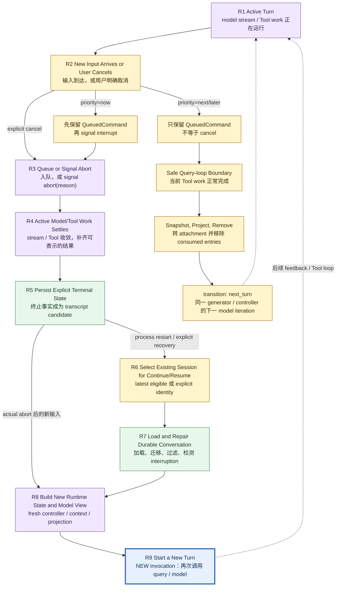

# 03：Interrupt、Queue、Continue 与 Resume——连续的是会话，不是旧调用栈

[← 上一章：Compaction](02-compaction.md) · [返回：Session Continuity 总览](README.md)

> 用户在 Claude 正工作时按下取消、又输入一条指令，或者重启进程后 Continue / Resume，究竟有哪些状态被保留，哪些执行已经结束？

先给结论：**Interrupt 结束的是 active work；Queue 保存的是尚未进入模型视图的 process-local input；Continue / Resume 从 durable conversation 重建新 runtime。无论哪条路径，后续 R9 都是一次新的 invocation，不是旧 JavaScript stack 复活。**

本文沿用三种证据标签：

- **[Source-confirmed]**：固定快照中的 symbol 直接实现该行为；
- **[Architectural interpretation]**：由多个源码事实拼出的系统结论；
- **[General principle]**：可迁移的工程原则，不冒充 Claude Code 的实现事实。

所有源码事实固定在 `712b24f22a63eb6d1a2f86697bf6dbbaa39ae3cf`。证据按 `commit + repository-relative path + symbol` 标记；pinned link 的行号只辅助定位。

## 1. 一张 R1–R9 时间图：取消、排队与恢复最终都回到新 turn



这张图需要先守住三条边界：

1. **Queue 不天然等于 Cancel。** `next` / `later` 等到 query-loop 的 safe boundary，经 snapshot、attachment projection 与 consumed-entry removal 后，以 `next_turn` 留在同一 generator/controller 内进入下一次 model iteration；只有 `now` 路径明确发出 `interrupt`。
2. **R5 不保证同步 fsync。** 这里表示 partial assistant、synthetic Tool result、interruption marker 或 terminal outcome 已进入对应 adapter 的可持久化事件流；不同 entry 的写入/flush timing 仍不同。
3. **R5 / R8 只属于实际 abort 或 recovery。** Queue-only steering不会经过 terminal persistence，也不会重建 controller；它在原 `queryLoop` 内产生下一次 model request。实际 abort后的新输入，以及 Continue/Resume重建，才经 R8 到 R9；R9始终是新的 turn invocation。

### 1.1 R1–R9 分别改变什么

| state | owner / input | state transition | output |
| --- | --- | --- | --- |
| **R1 Active Turn** | REPL / print / Query Loop | controller、stream、Tool executor 与 live messages 正在变化 | active runtime-only work |
| **R2 New Input Arrives or User Cancels** | keybinding、stdin、bridge/UDS 等 entry | 区分 explicit cancel、ordinary queue、`now` queue | cancel intent 或 typed input |
| **R3 Queue or Signal Abort** | REPL / queue owner | `QueuedCommand` 入 process-local queue；需要时 signal `user-cancel`、`interrupt` 或其他 reason | 可观察的 queue / abort state |
| **R4 Active Model/Tool Work Settles** | stream / Tool runtime | 消费剩余 executor results，或合成 missing Tool result；返回 terminal reason | protocol-representable terminal events |
| **R5 Persist Explicit Terminal State** | transcript adapters | partial output、interruption/terminal event成为 append candidate；queue仍有独立 owner | durable recovery source可增长 |
| **R6 Select Existing Session** | Continue / Resume adapter | latest eligible，或 UUID/path/picker-selected log | chosen session identity/log |
| **R7 Load and Repair Durable Conversation** | recovery layer | full-log load、migration、malformed-tail filtering、interruption detection | repaired messages + recoverable metadata |
| **R8 Build New Runtime State and Model View** | new REPL / print run | 重新创建 controller、ToolUseContext、projection、callbacks | 下一次 request candidate |
| **R9 Start a New Turn** | `query` / model adapter | 新 generator、新 request、新 Tool continuation | 新 invocation；不是 suspended stack |

## 2. 五种操作不能只靠 UI label 判断

| operation | trigger | affects active turn? | durable state used | process may restart? | next model call | identity/session selection |
| --- | --- | --- | --- | --- | --- | --- |
| **cancel / interrupt** | active turn 时 Escape / Ctrl+C 等 local cancel entry | **是**；ordinary local path signal `user-cancel`，stream/Tool work进入 abort settlement | 已产生且被 adapter 观察的 transcript events；不会删除旧 rows | 不要求 | 不自动恢复旧调用；用户下一次提交才产生新 call | 当前 session 不变 |
| **queued steering** | active work 中收到 `QueuedCommand` | `next/later` 通常不立即取消；`now` 会 signal distinct `interrupt` | queue 本身是 process-local；被投影后的 attachment/event才可进入 transcript | 普通路径不要求；进程丢失则未消费 queue 不可恢复 | safe drain boundary 内成为 feedback，或 interrupt 后由新 query消费 | 当前 session；`agentId` 还限制接收者 |
| **session backgrounding** | interactive background action | **是**；canonical main-session path以 `background` 停前台 query，再从 live messages启动 background task | 主要使用 active in-memory messages与明确转交的 notification attachments，不是从 durable loader恢复 | canonical path不要求 | background task以新的 `query` 执行继续 | 当前 active session/task identity；不是 Continue/Resume selector |
| **Continue** | `--continue` / `-c` | 不作用于旧 active call；旧 process若已结束，已无 call可作用 | latest eligible durable log + recoverable metadata | **可以，且 CLI entry常是新进程** | load本身不调用模型；后续 input或显式 auto-resume路径提交新 turn | `source === undefined`：当前目录最近 eligible session；BG feature下跳过 live non-interactive sessions |
| **Resume** | UUID、JSONL/path、picker、`/resume` 等明确选择 | 不“继续执行”旧 call；它切换/rebuild conversation | explicit selected durable log + recoverable metadata | 可以；`/resume` 也可在同进程切换 | reconstructed REPL / print run 在新 input时提交新 turn | explicit session ID/path/log；picker/title只是前置选择变体 |

**[Source-confirmed]** `(712b..., src/main.tsx, --continue branch)` 与 `(712b..., src/cli/print.ts, loadInitialMessages)` 都以 `loadConversationForResume(undefined, undefined)` 实现 Continue。`--resume`、picker 与 `/resume` 则先解析 UUID/path/log，再把 explicit source交给 loader。

**[Architectural interpretation]** 因此“Continue 与 Resume 后端完全相同”只对**加载/修复的共同尾段**成立；它们的 session selection、失败提示、cross-project处理和 entry lifecycle并不相同。

## 3. Canonical explicit cancel：从 keybinding 到 terminal outcome

先只看普通 interactive main-thread、本地 model/tool work，不把 prompt dialog、remote cancel 或 child-agent kill混进主路径。

### 3.1 Cancel input先到当前 owner

**[Source-confirmed]** `(712b..., src/hooks/useCancelRequest.ts, CancelRequestHandler)` 明确给 active task最高优先级：

```text
if active abort signal exists and is not aborted:
    clear Tool confirmation queue
    onCancel()
    return

else if command queue is non-empty:
    pop queued command
```

所以 active turn时按 Escape不是先删除 queue里的 steering；当前 work先被取消。只有 Claude idle时，同一个 handler才把 queue pop作为第二优先级。

参见 pinned source：[CancelRequestHandler](https://github.com/buoylee/Claude-Code-true/blob/712b24f22a63eb6d1a2f86697bf6dbbaa39ae3cf/src/hooks/useCancelRequest.ts#L63-L156)。

### 3.2 REPL signal当前 controller，再清 active slot

**[Source-confirmed]** `(712b..., src/screens/REPL.tsx, onCancel)` 的 ordinary local branch：

1. 结束 query guard的当前 generation；
2. 若已有 partial streamed text，先把它保存为 assistant message；
3. reset UI loading state；
4. `abortController.abort('user-cancel')`；
5. `setAbortController(null)`，避免 stale aborted controller继续占住 keybinding；
6. 发出 turn-complete / bridge-facing completion路径。

这里的顺序解释了为什么 transcript可以同时保留“取消前已经看到的 partial assistant text”和后面的 interruption marker。

参见 pinned source：[REPL.onCancel](https://github.com/buoylee/Claude-Code-true/blob/712b24f22a63eb6d1a2f86697bf6dbbaa39ae3cf/src/screens/REPL.tsx#L2106-L2163)。

### 3.3 AbortController怎样传播

**[Source-confirmed]** `(712b..., src/utils/abortController.ts, createChildAbortController)` 建立单向 parent → child传播：

```ts
if (parent.signal.aborted) {
  child.abort(parent.signal.reason)
  return child
}
parent.signal.addEventListener('abort', handler, { once: true })
```

child从任何来源 abort后会移除 parent listener；反方向不传播。因此 controller tree是取消作用域，不是共享的“所有东西一起死”开关。

参见 pinned source：[AbortController ownership and propagation](https://github.com/buoylee/Claude-Code-true/blob/712b24f22a63eb6d1a2f86697bf6dbbaa39ae3cf/src/utils/abortController.ts#L16-L99)。

### 3.4 Model stream与Tool execution观察 abort

**[Source-confirmed]** `(712b..., src/query.ts, queryLoop)` 分别处理 streaming abort和Tool阶段 abort：

- streaming executor存在时，先消费 `getRemainingResults()`，让 queued/in-progress Tools产生 synthetic `tool_result`；
- 没有 executor时，`yieldMissingToolResultBlocks` 合成缺失观察；
- ordinary cancel yield `createUserInterruptionMessage(...)`；
- terminal return区分 `aborted_streaming` 与 `aborted_tools`。

**[Source-confirmed]** `(712b..., src/services/tools/StreamingToolExecutor.ts, getAbortReason)` 还给 `interrupt` 加了一层 Tool contract：Tool的 `interruptBehavior` 是 `cancel` 才被这类 steering取消；缺省/异常都按 `block`。因此“输入 `now` 就强杀所有 Tool”不成立。

参见 pinned source：[streaming abort settlement](https://github.com/buoylee/Claude-Code-true/blob/712b24f22a63eb6d1a2f86697bf6dbbaa39ae3cf/src/query.ts#L1015-L1054) · [Tool-stage abort settlement](https://github.com/buoylee/Claude-Code-true/blob/712b24f22a63eb6d1a2f86697bf6dbbaa39ae3cf/src/query.ts#L1485-L1513) · [Tool interrupt behavior](https://github.com/buoylee/Claude-Code-true/blob/712b24f22a63eb6d1a2f86697bf6dbbaa39ae3cf/src/services/tools/StreamingToolExecutor.ts#L205-L241)。

### 3.5 R4 settlement为什么不是 rollback

假设模型先提出：

```yaml
assistant: { tool_use: { id: edit-1, name: Edit, input: ... } }
```

取消时存在三种不同事实：

```text
A. Tool 尚未开始 effect
B. Tool effect 执行中，并成功观察 abort
C. Tool effect 已经完成，只是 observation 尚未来得及进入 transcript
```

Abort能阻止或缩短 A/B，不能把 C 已完成的外部副作用自动回滚。补出的 error `tool_result` 只保证协议有一个 observation slot，不证明文件、进程、网络服务或第三方系统已经恢复原状。

**[General principle]** 安全恢复顺序应该是：先检查外部事实，再决定继续、补偿或重试。不能因为 transcript缺 observation就默认 effect没发生。

### 3.6 R5 terminal state的持久化边界

ordinary `user-cancel` path会产生 interruption message；REPL还保留 partial assistant text。它们进入现有 transcript logging adapter后可供 later recovery读取。

但必须把三件事分开：

```text
runtime 已 return aborted_* terminal
  ≠ UI 已 reset loading
  ≠ transcript write 已 durable flush
```

**[Architectural interpretation]** R5表示系统形成了明确的、可记录的 terminal representation；不把各 entry的异步记录策略夸成统一同步事务。Abort也不会自动删除已落盘 rows。

## 4. Queued steering：typed input怎样进入下一次模型决策

### 4.1 入队时，它还不是 model-visible message

**[Source-confirmed]** `(712b..., src/types/textInputTypes.ts, QueuedCommand)` 保存：

```text
value, mode, priority?, uuid?, pastedContents?, origin?, isMeta?, workload?, agentId?
```

**[Source-confirmed]** `(712b..., src/utils/messageQueueManager.ts, enqueue)` 把缺省 priority设为 `next`，写入 module-level queue并通知 subscribers。queue规则是：

```text
priority: now > next > later
same priority: FIFO
storage: process-local module state
```

这时 input还不是 transcript里的 user message，也不自动进入当前 API request。

参见 pinned source：[QueuedCommand](https://github.com/buoylee/Claude-Code-true/blob/712b24f22a63eb6d1a2f86697bf6dbbaa39ae3cf/src/types/textInputTypes.ts#L294-L358) · [unified queue and snapshots](https://github.com/buoylee/Claude-Code-true/blob/712b24f22a63eb6d1a2f86697bf6dbbaa39ae3cf/src/utils/messageQueueManager.ts#L40-L149)。

### 4.2 `next/later` 与 `now` 是两条路径

#### Queue-only steering

`next` / `later` 只入队。active model/tool work可以先走到安全 feedback boundary，再由 query loop选择 eligible commands。它避免为了每条补充说明都重启当前 work。

#### Queue + interrupt steering

**[Source-confirmed]** REPL与 print path都订阅 queue；发现最高优先级 `now` 时，对 active controller发出：

```ts
abortController.abort('interrupt')
```

`queryLoop` 对这个 reason故意不产生普通 `[Request interrupted by user]` marker，因为马上会有 queued user input提供上下文。这不是 `user-cancel` 的别名。

参见 pinned source：[REPL now-priority interrupt](https://github.com/buoylee/Claude-Code-true/blob/712b24f22a63eb6d1a2f86697bf6dbbaa39ae3cf/src/screens/REPL.tsx#L4089-L4105) · [print now-priority interrupt](https://github.com/buoylee/Claude-Code-true/blob/712b24f22a63eb6d1a2f86697bf6dbbaa39ae3cf/src/cli/print.ts#L1847-L1865)。

### 4.3 Query Loop在明确 boundary snapshot/drain

**[Source-confirmed]** `(712b..., src/query.ts, queryLoop)` 在Tool calls完成、准备 attachments时：

1. 取最高 eligible priority的 snapshot；
2. 排除 slash commands；
3. 按 main thread / `agentId` 做地址过滤；
4. 把 prompt / task-notification交给 attachment builder；
5. yield attachment进入 live message flow；
6. 只移除确实被消费的 command object；
7. 有 UUID时发出 `started`，`query`正常 return后再发 `completed`。

**[Source-confirmed]** `(712b..., src/utils/attachments.ts, getQueuedCommandAttachments)` 把 eligible command转换为：

```yaml
type: queued_command
prompt: string-or-content-blocks
source_uuid: optional UUID
commandMode: prompt-or-task-notification
origin: optional provenance
isMeta: optional hidden-in-UI marker
```

参见 pinned source：[query-loop queue snapshot and removal](https://github.com/buoylee/Claude-Code-true/blob/712b24f22a63eb6d1a2f86697bf6dbbaa39ae3cf/src/query.ts#L1547-L1648) · [queued-command attachment projection](https://github.com/buoylee/Claude-Code-true/blob/712b24f22a63eb6d1a2f86697bf6dbbaa39ae3cf/src/utils/attachments.ts#L1046-L1083)。

### 4.4 为什么这能降低 duplicate / loss风险

核心不是“永远 exactly once”，而是几个窄不变量：

- snapshot持有原 object reference，`remove(consumedCommands)`只删除真正投影的对象；
- slash/bash等不合法的 mid-turn形态不会被误当普通文字注入；
- UUID lifecycle把 `started without completed` 暴露给上层，而不是悄悄声称成功；
- `agentId` 防止 process-global queue把子循环通知泄漏给错误的模型视图；
- queue mutation后刷新 immutable snapshot，React与 non-React consumer看到一致的下一版引用。

**[General principle]** 这些机制降低 duplicated/lost steering，但 process-local queue仍不是 durable broker。进程在 consume前崩溃，未持久化 command没有恢复承诺。

## 5. Continue 与 Resume：恢复的是 conversation，随后才开始新 turn

### 5.1 R6：先确定 session identity

#### Continue：latest eligible

**[Source-confirmed]** `(712b..., src/utils/conversationRecovery.ts, loadConversationForResume)` 在 `source === undefined` 时调用 `loadMessageLogs()`，选择最近 log。`BG_SESSIONS`启用时，它会尝试查询 live sessions，并跳过仍由 non-interactive background/daemon owner写入的 session；UDS不可用时 fail open，把所有 sessions视为可 Continue。

interactive `--continue` 与 print `--continue` 都走这个 absence-of-identity contract。

#### Resume：explicit selection

同一个 loader接受：

- string session ID → `getLastSessionLog(id)`；
- JSONL path → `loadMessagesFromJsonlPath(path)`；
- 已选 `LogOption` → 直接使用；
- picker / `/resume` 先选择或解析，再交给 loader。

所以 Resume的 identity是 explicit；picker、title search、UUID、path只是前置路由变体。

参见 pinned source：[session selection and load](https://github.com/buoylee/Claude-Code-true/blob/712b24f22a63eb6d1a2f86697bf6dbbaa39ae3cf/src/utils/conversationRecovery.ts#L456-L539) · [interactive Continue](https://github.com/buoylee/Claude-Code-true/blob/712b24f22a63eb6d1a2f86697bf6dbbaa39ae3cf/src/main.tsx#L3101-L3163) · [print Continue/Resume](https://github.com/buoylee/Claude-Code-true/blob/712b24f22a63eb6d1a2f86697bf6dbbaa39ae3cf/src/cli/print.ts#L4893-L5190)。

### 5.2 R7：加载 durable entries并修复 tail

**[Source-confirmed]** loader对 lite log补 full messages，恢复 skill state，然后调用 `deserializeMessagesWithInterruptDetection`。后者依次：

1. migration legacy attachments；
2. 删除非法 persisted permission mode；
3. `filterUnresolvedToolUses` 去掉无法闭合的 Tool Intent；
4. 过滤 orphan thinking-only 与 whitespace-only assistant tail；
5. 检测最后一个 turn-relevant message；
6. mid-turn interruption转成 meta `Continue from where you left off.`；
7. trailing user后补 assistant sentinel，使未立即 auto-resume时仍保持 API-valid pair。

**[Source-confirmed]** API submission前仍有第二道 gate：`normalizeMessagesForAPI` / `ensureToolResultPairing`。normal mode可以合成 error result、移除 orphan/duplicate；strict mode会 reject。Malformed pairing不会原样穿透。

参见 pinned source：[recovery and interruption normalization](https://github.com/buoylee/Claude-Code-true/blob/712b24f22a63eb6d1a2f86697bf6dbbaa39ae3cf/src/utils/conversationRecovery.ts#L164-L252) · [filter unresolved Tool uses](https://github.com/buoylee/Claude-Code-true/blob/712b24f22a63eb6d1a2f86697bf6dbbaa39ae3cf/src/utils/messages.ts#L2795-L2845) · [pairing gate](https://github.com/buoylee/Claude-Code-true/blob/712b24f22a63eb6d1a2f86697bf6dbbaa39ae3cf/src/utils/messages.ts#L5133-L5460)。

### 5.3 R8：哪些状态 exact restore、approximate reconstruction、不可恢复

| class | examples | recovery semantics |
| --- | --- | --- |
| **exactly selected / copied** | session ID、可读取的 durable message fields、可关联 UUID、明确保存的 title/tag/mode/path metadata | 从 chosen log读取；仍受 migration/filter约束 |
| **reconstructed** | current model-visible projection、interruption classification、Tool pairing repair、agent/skill/session state的受支持子集 | 由 recovery与request normalization重新派生；不是 byte-for-byte old heap |
| **not restorable** | old `AbortController`、executor、Promise、socket、callback closure、JS call stack、in-flight OS process handle | 新 runtime重新创建；若外部 effect状态不明，必须检查/对账 |

这也解释了为什么 durable transcript 与 [Compaction](02-compaction.md) 的 projection仍要分开：Resume先恢复 candidate history，之后才根据 compact boundary、normalization与新 entry context构造当前 model view。

### 5.4 R9：load结束不等于 model已经继续

`loadConversationForResume` 返回的是 messages + recoverable metadata。interactive path把它们作为 `initialMessages` 创建新的 REPL；print path装入 mutable messages。真正提交时，entry创建 fresh controller / ToolUseContext并再次调用 `query(...)`。

**[Architectural interpretation]** 这条顺序是：

```text
select → load → repair → construct runtime → receive/derive new input → query() → model call
```

不是：

```text
deserialize old stack → jump back into old await → continue old model stream
```

参见 pinned source：[fresh REPL query submission](https://github.com/buoylee/Claude-Code-true/blob/712b24f22a63eb6d1a2f86697bf6dbbaa39ae3cf/src/screens/REPL.tsx#L2730-L3030) · [query wrapper and fresh terminal return](https://github.com/buoylee/Claude-Code-true/blob/712b24f22a63eb6d1a2f86697bf6dbbaa39ae3cf/src/query.ts#L219-L239)。

## 6. Backgrounding：保留 active work，但不是 Resume

**[Source-confirmed]** `(712b..., src/screens/REPL.tsx, handleBackgroundQuery)` 的 canonical main-session path：

1. foreground controller `abort('background')`；
2. 从统一 queue移出 task notifications；
3. 用 live `messagesRef`、fresh ToolUseContext与system/user context构造 background session输入；
4. task notification转 attachment并去重；
5. `startBackgroundSession(...)` 创建 `LocalMainSessionTask`继续运行。

**[Source-confirmed]** `(712b..., src/hooks/useSessionBackgrounding.ts, useSessionBackgrounding)` 则负责 UI foreground/background projection：重新 background时清主视图、loading与controller slot；foregrounded task运行时把它的 messages与controller投到主视图；完成/abort后再清 foreground ownership。

参见 pinned source：[main-session transfer](https://github.com/buoylee/Claude-Code-true/blob/712b24f22a63eb6d1a2f86697bf6dbbaa39ae3cf/src/screens/REPL.tsx#L2524-L2583) · [foreground/background view ownership](https://github.com/buoylee/Claude-Code-true/blob/712b24f22a63eb6d1a2f86697bf6dbbaa39ae3cf/src/hooks/useSessionBackgrounding.ts#L27-L158)。

这里必须避免两个误解：

- backgrounding不是让同一 call stack无缝换线程；foreground query先 abort，background task从明确输入启动自己的 query runtime；
- backgrounding不是从 JSONL执行 Resume；它主要依赖当下 live messages与显式转交的 runtime inputs。

## 7. Entry / process variants：只在 canonical path之后讨论

### 7.1 Same-process next turn vs process restart

| path | source of continuity | fresh runtime? | durable loader required? |
| --- | --- | --- | --- |
| ordinary next input | current live messages | 是，new turn controls | 否 |
| queued feedback in same query chain | current query messages + projected attachment | feedback request仍重新构造 | 否 |
| `/resume` in running UI | explicitly selected log | 是 | 是 |
| CLI `--continue` / `--resume` after restart | chosen durable log | 是 | 是 |

“same process”只省掉 durable reload，不会把 R9变成同一次 API invocation。

### 7.2 Interactive vs print/headless

- interactive `--continue` 直接加载 latest eligible并 launch新 REPL；interactive bare `--resume`可以打开 picker；
- print `--continue`同样用 absent identity；print `--resume`要求可解析的 explicit session identity/path；
- print path可在环境开关启用时，把 detected interrupted prompt重新 enqueue，确保只注入一次；这是一条明确的 auto-resume variant，不应推广到所有 UI。

参见 pinned source：[print interrupted-turn re-enqueue](https://github.com/buoylee/Claude-Code-true/blob/712b24f22a63eb6d1a2f86697bf6dbbaa39ae3cf/src/cli/print.ts#L1169-L1194)。

### 7.3 Pending child-agent notification

**[Source-confirmed]** `(712b..., src/utils/attachments.ts, getAgentPendingMessageAttachments)` 只把 parent-facing pending message drain成：

```yaml
type: queued_command
origin: { kind: coordinator }
isMeta: true
```

本文只解释它怎样进入 parent model view。child task创建、mailbox、kill、result lifecycle属于后续 Subagent Delegation。

参见 pinned source：[parent-facing pending message projection](https://github.com/buoylee/Claude-Code-true/blob/712b24f22a63eb6d1a2f86697bf6dbbaa39ae3cf/src/utils/attachments.ts#L1085-L1101)。

### 7.4 Remote history与remote cancellation

`src/assistant/sessionHistory.ts` 提供 authenticated remote event pagination；它证明 remote history可被读取，却不是 local Continue latest selector的实现。remote/direct-connect cancellation也有独立 bridge/server owner。

**[Source boundary]** 本文不把 local `user-cancel`、remote cancel request、permission dialog abort与server session cancel写成一条 universal backend path；它们共享“终止 active work并形成terminal outcome”的设计目标，不共享所有 UI label与transport。

参见 pinned source：[remote session history paging](https://github.com/buoylee/Claude-Code-true/blob/712b24f22a63eb6d1a2f86697bf6dbbaa39ae3cf/src/assistant/sessionHistory.ts#L25-L87)。

## 8. 两段机制伪代码

机制已经走完，再把它压缩成两个接口。

### 8.1 `interruptActiveTurn(reason) -> cancellation issued`；`queryLoopOnAbort(signal) -> settled terminal state`

```text
interruptActiveTurn(reason):
    owner = locateCurrentRuntimeOwner()
    if no active controller:
        return no_active_turn

    # issuer-side REPL/UI path
    preserveAlreadyStreamedAssistantTextIfApplicable()
    resetIssuerLoadingState()
    signal = owner.controller.signal
    owner.controller.abort(reason)
    clearActiveControllerSlot()
    fireIssuerSideCompletion()
    return cancellation_issued(signal)

queryLoopOnAbort(signal) -> settled terminal state:
    # downstream query/tool path observes the signal asynchronously
    if streaming executor exists:
        observations = drainSyntheticOrCompletedToolResults()
    else:
        observations = synthesizeMissingToolResults()

    if signal.reason != "interrupt":
        appendInterruptionMarker()

    terminal = aborted_streaming | aborted_tools
    exposeTerminalToUIOrSDK(terminal)
    yieldProtocolRepresentableEvents()
    return terminal

transcriptAdapter:
    independentlyObserveAndPersistYieldedEvents()
```

这是一段概念合成，而不是一个同步 source function：issuer在 signal后立即清 active controller slot并返回 `cancellation_issued(signal)`；`queryLoop` / Tool executor随后从同一个 `AbortSignal` 读取 `signal.reason`并异步settle，transcript adapter再独立观察 yielded events。它不包含 effect rollback；`signal.reason === interrupt`跳过 ordinary interruption marker，也不代表 skip protocol settlement。

### 8.2 `resumeSession(sessionSelector, newInput) -> new turn`

```text
resumeSession(sessionSelector, newInput):
    source = selectLatestEligibleOrExplicitSession(sessionSelector)
    durableEntries = loadFullConversation(source)
    repaired = migrateFilterAndDetectInterruption(durableEntries)
    modelCandidate = normalizeProjectionAndPairing(repaired.messages)

    runtime = createFreshRuntime(
        controller = new AbortController(),
        toolContext = new ToolUseContext(),
        callbacks = new entrySpecificCallbacks()
    )

    if newInput is absent and no explicit autoResume rule:
        return reconstructed_idle_session

    return query(modelCandidate + project(newInput), runtime)  // NEW turn
```

## 9. 五个 decisive source lenses

下面只保留改变 lifecycle结论的短 excerpt；无关 branches已省略。

### 9.1 Abort propagation

```ts
if (parent.signal.aborted) child.abort(parent.signal.reason)
else parent.signal.addEventListener('abort', handler, { once: true })
```

Lens：reason沿 parent → child传递；旧 controller不是恢复 artifact。

### 9.2 Queue snapshot / drain

```ts
const queuedCommandsSnapshot = getCommandsByMaxPriority(...).filter(...)
// project eligible commands to attachments
const consumedCommands = queuedCommandsSnapshot.filter(isInlineMode)
removeFromQueue(consumedCommands)
```

Lens：先snapshot并投影，再按引用删除 consumed set；queueing与model visibility之间有明确转换。

### 9.3 Session selection / load

```ts
if (source === undefined) log = firstRecentEligibleLog()
else if (sourceJsonlFile) messages = loadJsonlChain(sourceJsonlFile)
else if (typeof source === 'string') log = getLastSessionLog(source)
else log = source
```

Lens：Continue是absence-based latest selection；Resume是explicit source。

### 9.4 Recovery / pairing normalization

```ts
messages = filterUnresolvedToolUses(migrate(serializedMessages))
state = detectTurnInterruption(messages)
if interruptedMidTurn: appendMetaContinueMessage()
if trailingUser: appendAssistantSentinel()
```

Lens：malformed tail不会原样进入later request；但 recovery无法观察未知外部effect。

### 9.5 Fresh Query submission

```ts
for await (const event of query({
  messages: reconstructedMessages,
  toolUseContext: freshToolUseContext,
  ...freshEntryContext,
})) consume(event)
```

Lens：R9是新 generator / request；Resume不是恢复旧 `await`。

## 10. Races、失败与恢复策略

| failure / race | source-visible protection | remaining risk / correct response |
| --- | --- | --- |
| cancel与completed effect竞态 | abort-aware executor、synthetic result、terminal reason | effect可能已经完成；inspect/reconcile，不盲 replay |
| duplicate queued input | snapshot后只删除consumed refs；UUID lifecycle；priority/FIFO | process crash窗口仍非durable exactly-once |
| lost queued input | 未消费command保留在module queue | process exit会丢process-local queue；需要durable broker才有跨进程保证 |
| incomplete transcript pair | recovery过滤 unresolved intent；API gate normal repair或strict reject | repair产生的是合法表示，不证明真实世界effect状态 |
| stale/missing session | loader返回 `null`；entry显示 no conversation / failure | 不能凭 UI cache假装恢复成功 |
| corrupt persisted fields | migration、permission mode validation、thinking/whitespace filtering | 无法解析的严重错误仍应失败并保留诊断 |
| `now`到达不可interrupt Tool | Tool `interruptBehavior: block` | steering延迟到安全边界；响应性让位给Tool原子性 |
| background transfer与notification竞态 | remove、attachment conversion、prompt text dedup | dedup key不等于全局 exactly-once；只证明该handoff分支的窄防护 |

### 10.1 Durable intent但没有 observation

最危险的恢复形态是：

```yaml
assistant: tool_use payment-1 / edit-1 / deploy-1
# no matching durable tool_result
```

Recovery为了API合法性可以过滤 intent或合成 error result，但不能据此断言 effect未发生。正确策略依effect类型而定：

- read-only operation：通常可安全重查；
- idempotent operation：用同一 idempotency key查询或重试；
- non-idempotent operation：先查外部系统record，必要时人工确认/补偿；
- file mutation：检查文件与VCS diff，不以transcript absence作事实来源。

## 11. 设计取舍

### 11.1 Responsive steering vs deterministic turn boundaries

| choice | benefit | cost |
| --- | --- | --- |
| queue until boundary | Tool/model状态更容易闭合，顺序稳定 | 用户补充说明反馈较慢 |
| `now` interrupt | steering响应快 | 需要abort-aware Tool contract、pair repair与race处理 |

Claude Code同时提供 priority queue与distinct interrupt reason，而不是把所有输入都强制采用同一种策略。

### 11.2 Durable recovery vs non-serializable runtime state

| preserve | benefit | limitation |
| --- | --- | --- |
| durable messages + metadata | 可跨进程继续、审计、选择session | 不能恢复executor/Promise/socket/stack |
| serialize更多runtime state | 理论上减少重建 | callbacks、OS handles与外部effects通常不可安全序列化 |

选择“reconstruct fresh runtime”承认了真正的failure boundary，也迫使系统显式处理unknown effects。

### 11.3 Replay vs continue from observations

Replay旧 intents看似简单，却可能重复执行已完成effect。更安全的默认值是：

```text
durable observations / external reconciliation
    before
replaying unobserved intent
```

这也是 transcript repair只承诺protocol legality、不承诺effect truth的原因。

## 12. 必须守住的 invariants

1. **Active cancel优先于idle queue pop。** 同一 keybinding在不同runtime state下语义不同。
2. **Queue entry不等于model-visible message。** 必须经过snapshot、filter、attachment/message projection。
3. **`user-cancel`与`interrupt`不同。** 前者产生显式用户中断marker；后者由queued steering提供后续上下文。
4. **R4必须settle protocol shape。** Abort不能留下可见但无对应result的 Tool Intent原样提交。
5. **R5不等于effect rollback或同步durability。** terminal representation、UI completion、disk flush是不同边界。
6. **Continue是latest eligible selection；Resume是explicit selection。** 共同loader不抹平前置routing差异。
7. **R7 repair不等于truth reconstruction。** 合法message pair不能证明外部effect成功或失败。
8. **R8创建fresh runtime-only controls。** controller、executor、Promise与stack不从transcript复活。
9. **R9是新 turn。** same-process feedback也会发起新的 model invocation。

## 13. 常见误区

| 误区 | 正确说法 |
| --- | --- |
| Escape会把这一轮所有副作用回滚 | Abort只能通知active work；已完成external effect必须检查或补偿。 |
| 用户在运行中输入就一定取消当前turn | `next/later`可以只入队；`now`才走distinct `interrupt`。 |
| 进queue后模型已经看见 | 只有在query boundary被投影为attachment/message后才model-visible。 |
| 从queue删除就证明完整处理成功 | UUID lifecycle可能只有started没有completed；正常return才发completed。 |
| background等于Resume | background从live state转交到new task runtime；Resume从durable source重建。 |
| Continue与Resume只是两个同义按钮 | Continue按absence选择latest eligible；Resume显式选择identity/log。 |
| Resume回到旧Tool执行的下一行 | 它加载messages并构造fresh runtime，随后启动新query。 |
| repair出来的error result证明Tool没执行 | repair只恢复protocol legality；effect truth仍可能unknown。 |
| durable transcript能恢复所有状态 | controller、executor、Promise、socket、call stack不可恢复。 |
| 所有取消入口都走相同后端 | local、prompt/permission、remote/direct-connect/server variant有不同owner。 |

## 14. 面试回答模板

### 14.1 30秒版本

> Claude Code把interrupt、queue和session recovery拆成不同层。Active cancel先由当前owner signal AbortController；query loop让stream和Tools收敛，补齐synthetic tool results并形成aborted terminal，但不会回滚已完成external effects。运行中输入先成为typed `QueuedCommand`；`next/later`等安全boundary，`now`则以distinct `interrupt` reason结束active work，随后command被投影为model-visible attachment并从queue移除。Continue用absence-of-identity选当前目录latest eligible session，Resume用UUID/path/picker显式选session；两者加载durable entries、过滤unresolved pairs、检测interruption，再创建fresh controller、ToolUseContext和model projection。下一步始终是一轮新query/model invocation，不是恢复旧JavaScript stack。

### 14.2 追问：为什么cancel后仍可能看到文件已经改了？

因为Abort是协作式信号，不是事务rollback。effect可能在signal到达前已完成，或底层operation不支持中断。synthetic `tool_result`只闭合protocol；必须检查文件/VCS/外部系统再决定补偿或重试。

### 14.3 追问：Queue怎样避免消息重复或丢失？

它用priority + FIFO、immutable snapshot、consume后按object reference删除，并对有UUID的command发started/completed lifecycle。它降低同进程重复/误删风险，但仍是process-local queue，不提供崩溃后的durable exactly-once。

### 14.4 追问：Continue和Resume核心区别？

selection。Continue不给identity，让loader选择latest eligible log；Resume先通过UUID、JSONL/path、picker或`/resume`选explicit source。加载、repair与new runtime reconstruction的共同尾段可以复用，但entry routing不完全相同。

### 14.5 追问：为什么Resume不能“接着旧Tool跑”？

Transcript只能恢复可序列化messages与部分metadata。旧controller、executor、Promise、socket和call stack不存在了；更重要的是，缺observation时系统不知道external effect是否已完成。安全做法是重建fresh runtime并从durable/external observations继续。

## 15. 源码阅读路线

1. 从 [`CancelRequestHandler` 与 `REPL.onCancel`](https://github.com/buoylee/Claude-Code-true/blob/712b24f22a63eb6d1a2f86697bf6dbbaa39ae3cf/src/hooks/useCancelRequest.ts#L63-L156) 开始，确认 active cancel priority、`user-cancel`与controller slot ownership；
2. 看 [`createChildAbortController`](https://github.com/buoylee/Claude-Code-true/blob/712b24f22a63eb6d1a2f86697bf6dbbaa39ae3cf/src/utils/abortController.ts#L68-L99) 与 [`queryLoop` abort branches](https://github.com/buoylee/Claude-Code-true/blob/712b24f22a63eb6d1a2f86697bf6dbbaa39ae3cf/src/query.ts#L1015-L1054)，确认signal怎样变成settled terminal；
3. 看 [`QueuedCommand`、queue manager](https://github.com/buoylee/Claude-Code-true/blob/712b24f22a63eb6d1a2f86697bf6dbbaa39ae3cf/src/types/textInputTypes.ts#L294-L358) 与 [`queryLoop` drain](https://github.com/buoylee/Claude-Code-true/blob/712b24f22a63eb6d1a2f86697bf6dbbaa39ae3cf/src/query.ts#L1547-L1648)，确认queued input何时model-visible、何时remove；
4. 看 [`loadConversationForResume`](https://github.com/buoylee/Claude-Code-true/blob/712b24f22a63eb6d1a2f86697bf6dbbaa39ae3cf/src/utils/conversationRecovery.ts#L456-L597) 与 [`deserializeMessagesWithInterruptDetection`](https://github.com/buoylee/Claude-Code-true/blob/712b24f22a63eb6d1a2f86697bf6dbbaa39ae3cf/src/utils/conversationRecovery.ts#L164-L252)，确认Continue/Resume selection与recovery；
5. 最后回到 [`REPL` fresh submission](https://github.com/buoylee/Claude-Code-true/blob/712b24f22a63eb6d1a2f86697bf6dbbaa39ae3cf/src/screens/REPL.tsx#L2730-L3030)，确认R9为什么是new turn。

整条阅读路线只追一个不变量：**旧 active work必须先形成可解释终点；later continuation只能从明确状态重建新的调用。**

## 16. Subagent handoff

到这里，main session已经能取消active work、吸收queued steering、转入background，并从durable conversation构建fresh turn。

下一问是：同一个parent loop怎样把工作委派给隔离的child loop，child拥有怎样独立的messages/controller/Tool lifecycle，parent又怎样通过pending notification或result attachment把child结果纳入自己的下一次模型决策？

这属于 [Part 04：Subagent Delegation](../04-subagent-delegation/README.md)。本文不提前展开child创建、mailbox、cancellation或result lifecycle；下一部分从普通 parent Tool boundary 接手这些机制。

[← 上一章：Compaction](02-compaction.md) · [返回：Session Continuity 总览](README.md) · [下一部分：Subagent Delegation](../04-subagent-delegation/README.md)
