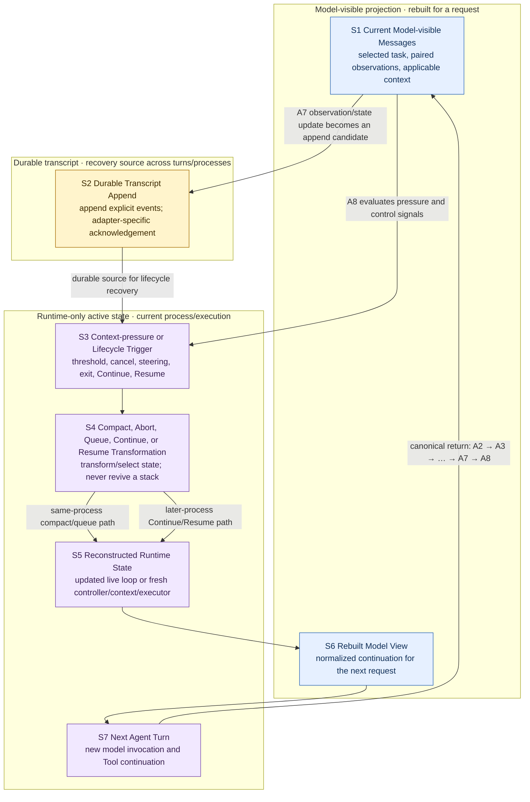

# 03：Session Continuity——跨越窗口压力与进程生命周期继续任务

[← 上一部分：Controlled Effects](../02-controlled-effects/README.md) · [下一篇：Transcript 与 Model Context](01-transcript-and-model-context.md)

> Tool Observation 已经产生后，任务怎样跨过 context pressure、中断和进程退出，仍然回到一轮合法的新 Agent Turn？

先给结论：**Claude Code 延续的是可重建的会话状态，不是一个永远不变的 Messages 数组，更不是暂停中的 JavaScript 调用栈。** Durable transcript 保存可恢复事件；model-visible projection 为每次请求选择和改写这些事件；runtime-only active state 则拥有 controller、executor、queue 与 pending work。Compaction 从当前 projection 构造较短的 continuation，Resume 从 durable material 构造 later-process view 与全新 runtime；两者都不会让旧 stack 复活。

本文是 Session Continuity 的自包含总览。机制证据固定在源码快照 `712b24f22a63eb6d1a2f86697bf6dbbaa39ae3cf`；细节分别由 [Transcript 与 Model Context](01-transcript-and-model-context.md)、[Compaction](02-compaction.md) 和 [Interrupt / Queue / Continue / Resume](03-interrupt-queue-continue-resume.md) 拥有。

## 1. 先放回 A7、A8 与 next-turn return edge

[00 的 A1–A8 权威图](../00-one-agent-turn.md#1-权威全景图a1a8) 只有一份，本章不再画第二套 A-map。Session Continuity 接住的是它的时间维度：

- **A7 Tool Observation and State Update** 产生可关联的 observation，并让 protocol Messages、runtime state 与 durable transcript 分别获得自己的更新；
- **A8 Continue, Stop, Recover, or Delegate** 在协议闭合后选择普通继续、停止或恢复；
- **next-turn return edge** 不是从旧执行位置跳回去，而是把 persisted/projected state 送回 A2 Model View Assembly，再经 A3 发起下一次模型请求。

因此本部分的入口不是“重新执行 Tool”，而是 A7 已经拥有一个明确 observation 或 interruption terminal；出口也不是“恢复旧 `await`”，而是 A8 经 A2 → A3 启动一轮合法的新请求。

## 2. S1–S7：一张图看完整连续性



### 2.1 七个节点各自改变什么

| 节点 | 输入 | 转换 | 输出 |
| --- | --- | --- | --- |
| **S1 Current Model-visible Messages** | A2 为当前请求选中的 user、assistant、Tool pairs、summary 与 attachments | 模型与 Tool loop 继续产生新事件 | A7 可闭合的 observation/state update |
| **S2 Durable Transcript Append** | user/assistant/tool/compact/interruption 等 loggable events | 清洗、UUID 去重、parent-chain 关联，并按 entry contract append/flush | 跨 turn、可跨进程加载的 recovery source |
| **S3 Context-pressure or Lifecycle Trigger** | token pressure、explicit cancel、queued input、process restart、Continue/Resume selector | 判断这次需要缩短 projection、settle active work、等待安全边界，还是加载 session | 一条明确的 continuity branch |
| **S4 Compact, Abort, Queue, Continue, or Resume Transformation** | 当前 projection/runtime，或选中的 durable transcript | summary/tail 重建、abort settlement、queue attachment projection、session load/repair | 可继续的数据与明确 terminal facts |
| **S5 Reconstructed Runtime State** | S4 的 branch result 与 entry options | Compaction/queue 更新 live loop state；Resume 创建 fresh controller、ToolUseContext、executor 与 tracking | 当前 process 可执行的 control state |
| **S6 Rebuilt Model View** | transformed messages、current input、attachments、tools 与 policy | selection、normalization、pairing repair或 strict reject、request shaping | 下一次 API-ready conversation view |
| **S7 Next Agent Turn** | S5 runtime + S6 view | 发起新的 model invocation，必要时再进入 Controlled Effects | 新一轮 A2–A8 feedback loop |

### 2.2 S5 的“重建”不总是重启进程

S5 有两个合法形态，不能混成一句“恢复”：

- **same-process Compaction / queued steering**：旧进程仍在，Query Loop 替换或扩展当前 continuation；controller 可以继续属于同一 active query chain，但下一次 model request 仍是新的 invocation；
- **Continue / Resume after lifecycle break**：loader 从 durable material 恢复 messages 与受支持 metadata，再创建 fresh controller、ToolUseContext、executor 和 callbacks。

两条路径都只重建**可继续状态**；它们都不恢复旧 Promise、socket、OS handle 或 suspended call stack。

## 3. 三个状态平面必须始终分开

| 平面 | 典型内容 | 生命周期 | 模型是否直接看见 | 如何进入下一轮 |
| --- | --- | --- | --- | --- |
| **Durable transcript** | user/assistant/tool/compact/interruption records、UUID 与 chain metadata | 跨 turn；local recovery path 可跨进程 | 否 | Continue/Resume 选择并加载，再投影 |
| **Model-visible projection** | selected messages、paired Tool blocks、summary、retained tail、applicable attachments | 一次 request / feedback iteration | 是 | A2 组装并由 A3 提交 |
| **Runtime-only active state** | AbortController、ToolUseContext、executor、queue、pending Promise、permission/file cache | 当前 execution/process | 否 | same-process 更新，或 later process 重新创建 |

三个常见对象也必须放在正确位置：

- **queued input** 在排队时是 process-local runtime artifact；被 snapshot、filter 并投影成 attachment 后，才可能进入 model-visible/durable event flow；
- **compact summary** 是从历史产生的 model-view transformation，不是整个 session state，也不是原 transcript 的同义词；
- **interruption state** 是 terminal/recovery metadata；它能帮助 later request 理解旧 turn 怎样结束，却不能证明外部 effect 已回滚。

一句话表达三者关系：

```text
nextModelView = project(durable or live events, current entry, continuity policy)
nextRuntime   = updateLiveControls(...) or createFreshControls(recovery metadata)
```

而不是：

```text
nextModelView = durableTranscript = runtimeHeap
```

## 4. 一条 failing-test session 如何跨过五种时间变化

下面始终是同一个任务：

```text
User: locate and fix a failing test.
```

### 4.1 普通运行与持久化：S1 → A7 → S2

第一次 S1 只包含当前任务、被选中的历史、工具定义与适用上下文。模型依次提出 Grep、Read、Edit 和 targeted Bash；每个 adopted Tool Intent 都由 Controlled Effects 产生同 ID Observation。A7 更新 live protocol state，并把 user、assistant、Tool events 交给 S2 的 append path。

此时可能同时成立：

```yaml
durable_transcript:
  contains: [user_task, grep-1_pair, read-1_pair, edit-1_pair]
model_visible_projection:
  selected: [task, recent_pairs, current_test_failure]
runtime_only_state:
  active: [controller, tool_context, executor, read_cache]
```

Append acknowledgement 由 entry adapter 决定；live feedback 已继续不等于所有 fire-and-forget writes 已同步 flush。普通同进程 continuation 也不必每轮重读 transcript，它可以从 live messages 重建 S6。

### 4.2 Context pressure 与 Compaction：S3 → S4 → S6

随着诊断输出增长，S3 检测到 current projection 接近预算。S4 的 Compaction 对 S1 做有损转换，成功结果按以下顺序构造：

```text
compact boundary
  + summary of task / decisions / failures / next action
  + optional protocol-safe retained tail
  + applicable attachments
  + hook results
```

例如早期 Grep/Read/Edit 细节由 summary 表示，而最新 `bash-1` intent/result pair 被完整保留。S6 得到更小、仍合法的 model view；S2 中原始 rows 在本文追踪的 local append path 没有被这次转换原地删除。

若 Compaction no-op、abort 或失败，没有成功 `CompactionResult`，旧 projection 保持为当前事实；系统不能安装“半份 summary”。

### 4.3 User interrupt：先 settle，再继续

压缩后的下一轮启动另一个测试 Tool。用户此时发出紧急 steering：

```text
now: do not change the parser; inspect the fixture first
```

这条输入先作为 queued command 保存，再用 distinct `interrupt` reason signal active controller。S4 必须让 stream/Tool work settle：已采用的 Tool Intent 得到 completed 或 synthetic terminal Observation；如果走普通 `user-cancel`，还会形成明确 interruption marker。R4/S4 的成功边界是**协议可表示的终点**，不是机器世界回滚。

如果测试进程、文件写入或远端调用在 signal 前已经完成，terminal error/cancel result 也不能把效果撤销。下一步必须先检查文件、VCS、进程或外部记录，再决定补偿或重试。

### 4.4 Queued steering：排队不等于模型已经看见

当 active work 到达安全边界，runtime snapshot eligible queue entries，按 priority/agent address 过滤，将这条 steering 投影成 parent-facing attachment，再只移除确实被消费的对象。此后它才能进入 S6，成为下一次模型决策的输入。

若使用 `next` / `later`，该过程可以不 abort 当前 work；若使用 `now`，则先 queue、再 interrupt。若进程在投影前退出，process-local queue 本身没有跨进程恢复保证；不能在 Resume 时假装它已经 durable。

### 4.5 Later Resume：S2 → S4 → S5 → S7

假设进程在 interruption terminal 已进入 transcript 后退出。Later Resume 显式选择 session ID/path/log；Continue 则选择 latest eligible session。Loader 从 S2 读取 durable entries，迁移和过滤 malformed tail，检测 interrupted turn；API submission 前仍要经过 normalization 与 Tool pairing gate。

S5 随后创建 fresh runtime：

```yaml
reconstructed_from_durable:
  - selected_messages
  - session_identity
  - supported_interruption_and_session_metadata
newly_initialized_runtime_only:
  - new_abort_controller
  - new_tool_use_context
  - new_executor
  - new_pending_promises
not_restored:
  - old_stack
  - old_socket
  - old_process_handle
```

S6 把 recovered history、compacted continuation、current input与适用 attachments 重新投影。S7 再调用 `query(...)`，沿 A2 → A3 → … → A7 → A8 开始 next turn。恢复完成的判据是“新 request 合法、知道旧 turn 的明确终点并能继续任务”，不是“旧工具从中断那一行继续跑”。

## 5. 五条 continuity invariants

### 5.1 Projection-not-transcript

当前 Model Context 是从 live/durable sources 构造的 projection，不是 durable transcript 原样重放。Compaction 可以缩短 view；Resume hooks、pair repair 与 attachments 也可以加入 original rows 中没有的派生内容。

### 5.2 Pairing

任何进入 later model view 的 adopted Tool Intent 都必须有可关联的 terminal Observation。Normal mode 可以合成 error result或过滤 orphan；strict mode可以拒绝 malformed history。Repair 只证明协议合法，不证明机器 effect 的真实结局。

### 5.3 Explicit terminal state

Cancel、abort、summary failure和recovery failure都必须留下明确结局：settled Tool result、interruption marker、old-projection preservation或terminal error。不能让状态无 producer 地出现，也不能让 pending intent 无 transition 地消失。

### 5.4 No-stack-resume

Compaction 从 current messages 构造 later continuation；Continue/Resume 从 durable records 重建新的 messages/runtime。两者都不反序列化旧 controller、Promise、executor、socket或 JavaScript call stack。

### 5.5 No-effect-rollback

Interrupt 只能 signal active work并闭合 protocol state。已经完成、部分完成或仍在外部运行的 effect 不会因 synthetic error、interruption marker或 Resume 自动回滚；恢复前必须检查和对账。

## 6. Ownership 与边界

| 主题 | 本部分中的 owner | 明确不拥有 |
| --- | --- | --- |
| state planes、append、projection、recovery source | [Transcript 与 Model Context](01-transcript-and-model-context.md) | general request assembly细节、compaction policy |
| context-pressure transformation、summary、tail、failure preservation | [Compaction](02-compaction.md) | active Tool cancellation、session selection |
| active cancellation、queue、Continue/Resume selection、repair与 fresh runtime | [Interrupt / Queue / Continue / Resume](03-interrupt-queue-continue-resume.md) | child task lifecycle |
| general request assembly 与 Query Loop semantics | [Model Turn](../01-model-turn/README.md) | session durability policy |
| running Tool cancellation 与 result normalization | [Controlled Effects](../02-controlled-effects/README.md) | transcript recovery |

Child task storage、mailbox、communication、cancellation和result return属于 Part 04：Subagent Delegation；当前只保留文字交接，不创建尚未存在的链接。

## 7. 决定性源码坐标

本总览只保留能证明跨层边界的四个入口，完整 branch 与限制留在三篇 owner 章节：

1. **Transcript append 不是 snapshot overwrite。** `712b24f22a63eb6d1a2f86697bf6dbbaa39ae3cf` + [`src/utils/sessionStorage.ts`](https://github.com/buoylee/Claude-Code-true/blob/712b24f22a63eb6d1a2f86697bf6dbbaa39ae3cf/src/utils/sessionStorage.ts) + `recordTranscript`。
2. **Compaction 构造 structured continuation。** `712b24f22a63eb6d1a2f86697bf6dbbaa39ae3cf` + [`src/services/compact/compact.ts`](https://github.com/buoylee/Claude-Code-true/blob/712b24f22a63eb6d1a2f86697bf6dbbaa39ae3cf/src/services/compact/compact.ts) + `buildPostCompactMessages`。
3. **Abort settlement 与 queue projection 回到普通 Query Loop。** `712b24f22a63eb6d1a2f86697bf6dbbaa39ae3cf` + [`src/query.ts`](https://github.com/buoylee/Claude-Code-true/blob/712b24f22a63eb6d1a2f86697bf6dbbaa39ae3cf/src/query.ts) + `queryLoop`。
4. **Resume 加载可重建材料，不恢复 heap。** `712b24f22a63eb6d1a2f86697bf6dbbaa39ae3cf` + [`src/utils/conversationRecovery.ts`](https://github.com/buoylee/Claude-Code-true/blob/712b24f22a63eb6d1a2f86697bf6dbbaa39ae3cf/src/utils/conversationRecovery.ts) + `loadConversationForResume`。

## 8. 继续阅读

按同一条 S1–S7 主线深入：

1. [Transcript 与 Model Context](01-transcript-and-model-context.md)：先固定 durable、model-visible 与 runtime-only 三个平面，以及 append / projection 边界；
2. [Compaction](02-compaction.md)：再看 context pressure 怎样把旧 projection 变成 boundary、summary、tail与 metadata；
3. [Interrupt / Queue / Continue / Resume](03-interrupt-queue-continue-resume.md)：最后看 active cancellation、queued steering、session selection、repair与 fresh-runtime reconstruction。

读完第三篇后，下一部分将进入 Part 04：Subagent Delegation，解释 parent loop 如何通过显式任务、通信与结果边界接回 child work。该部分尚未创建，因此这里不提供链接。

[← 上一部分：Controlled Effects](../02-controlled-effects/README.md) · [下一篇：Transcript 与 Model Context](01-transcript-and-model-context.md)
