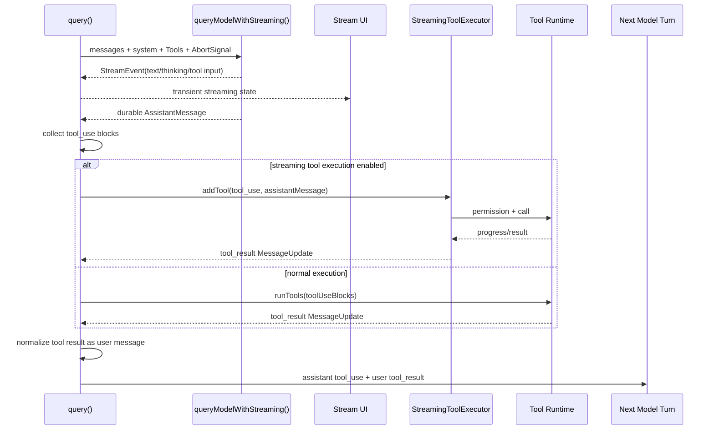

# 04 - Model Streaming

## 面试式回答

Claude Code 的 model streaming 不是“把字一个个打到屏幕上”这么简单。它把一次模型响应拆成两类运行时事件：一类是可以立即展示的增量内容，例如 text、thinking、stream mode；另一类是必须等结构完整后才能变成协议消息的 durable assistant message，尤其是 `tool_use`。`queryModelWithStreaming()` 负责从 API 边界产出 stream event 和最终 assistant message，`query()` 负责消费这些事件、更新 UI、收集 `tool_use`、必要时提前启动工具，并把最终 assistant message 放回 transcript。

流式路径的核心价值是降低编码 agent 的等待时间：用户能立刻看到模型是否在思考、是否开始写解释、是否正在构造工具输入；同时 runtime 可以在 `tool_use` block 完整出现后尽早调用工具，而不是等整段 assistant 输出结束。最终送回下一轮模型的仍然是标准消息序列：assistant 的 `tool_use` message 后面跟 user 的 `tool_result` message。也就是说，streaming 优化的是执行时序和交互反馈，不改变模型协议里的因果关系。

如果 streaming 失败或被降级，`queryModelWithoutStreaming()` 会通过同一层 `queryModel()` 生成完整 assistant message，再由 `query()` 统一处理其中的 `tool_use`。差别是用户看不到中间 token，工具也不能边流边启动；但持久 transcript、tool schema、permission、tool_result 回填这些语义保持一致。

## 这一章解决什么问题

这一章解释 Claude Code 如何把模型的流式响应接入 agent loop：

- 为什么 coding agent 需要 streaming：缩短首 token、展示长工具输入、及时发现工具调用、让可并发工具提前开跑。
- partial assistant text 和 `tool_use` block 的差异：text 可以作为 UI 增量展示，`tool_use` 必须携带稳定 `id`、`name`、完整 `input`，才能成为可执行的运行时任务。
- streaming 输出如何变成 durable assistant message：API stream 先累积 content blocks，最终产出完整 `AssistantMessage`，`query()` 将它加入 `assistantMessages`，后续作为 transcript 的一部分参与下一轮 API 请求。
- streaming 如何与中断和工具执行配合：AbortController 既能停止模型流，也能在已有 `tool_use` 时补齐 synthetic `tool_result`，避免 transcript 出现未配对的工具调用。
- 非流式 fallback 改变了什么：交互反馈和提前执行能力消失，但消息协议、工具编排和下一轮上下文构造不变。
- tools/schema 在模型请求里何时进入：`claude.ts` 在 API 调用前过滤工具集合，调用 `toolToAPISchema()` 构建模型可见 schema，再把 schema 放进 messages request 的 tools 字段。

## 心智模型

可以把 model streaming 理解成三层：

第一层是 API 流。`src/services/api/claude.ts` 里的 `queryModelWithStreaming()` 包住 `queryModel()`，让调用方能收到 `StreamEvent`、最终 `AssistantMessage` 或 synthetic API error。`queryModelWithoutStreaming()` 也调用同一个 `queryModel()`，只是消费完整个 generator 后只返回最后的 assistant message。

第二层是 durable transcript。stream event 只是 UI 和运行时调度信号；真正会进入下一轮模型上下文的是完整 assistant message、工具执行产生的 user `tool_result` message、以及少量 attachment/meta message。`query()` 在模型流结束后，把这些 durable message 组合成下一次 state。

第三层是工具执行的提前启动。启用 `useStreamingToolExecution` 时，`query()` 一看到 assistant message 中有完整 `tool_use` block，就把它交给 `StreamingToolExecutor.addTool()`。执行器可以在模型响应尚未完全结束时启动工具，但结果仍以 `tool_result` message 的形式产出，并按需要保持顺序。

## 实现逻辑

模型请求从 `query()` 进入。每轮 loop 先构造 `ToolUseContext`、`assistantMessages`、`toolResults`、`toolUseBlocks` 和 `needsFollowUp`。如果 feature gate `config.gates.streamingToolExecution` 打开，`query()` 会创建 `StreamingToolExecutor`，否则后面走传统 `runTools()`。

调用模型时，`query()` 使用 `deps.callModel()`，传入当前 messages、system prompt、thinking config、tools、abort signal 和 options。options 里包含 `model`、`fallbackModel`、`getToolPermissionContext()`、MCP tools、agent definitions、query tracking 等。工具 schema 并不是在 `query()` 里直接拼 JSON，而是在 API 边界由 `claude.ts` 根据这些 tools 生成。

`claude.ts` 的 `queryModel()` 在真正发 API 请求前做几件关键事：判断 tool search 是否启用，过滤 ToolSearch 或 deferred tools；对每个 filtered tool 调用 `toolToAPISchema()`；再调用 `normalizeMessagesForAPI()` 清理 transcript，并用 `ensureToolResultPairing()` 修复 `tool_use` / `tool_result` 配对问题。这样 API 请求里看到的是模型可理解的 tool schema 和协议合法的消息历史。

streaming 期间，`queryModel()` 逐个消费 API stream part。`message_start` 建立 partial message，`content_block_start` 根据 block 类型初始化 text、thinking、`tool_use` 等 content block，后续 delta 继续填充。UI 层的 `handleMessageFromStream()` 会根据这些 stream event 切换 responding、thinking、tool-input、tool-use 等显示状态，并维护临时 streaming text / streaming tool use。

对 `query()` 来说，真正关键的是 stream 中最终 yield 出来的 `AssistantMessage`。每收到一个 assistant message，`query()` 会：

- 把它加入 `assistantMessages`，作为 durable transcript 的一部分。
- 从 `message.content` 里筛出 `type === "tool_use"` 的 block，追加到 `toolUseBlocks`。
- 将 `needsFollowUp` 置为 true，表示本轮模型输出不是最终回答，还需要执行工具并再次进入模型。
- 如果存在 `StreamingToolExecutor` 且没有 abort，就把每个 `tool_use` block 交给 `addTool()`，让工具尽早排队执行。
- 随后调用 `getCompletedResults()` 取出已完成的工具结果，yield 给 UI，并把这些结果经 `normalizeMessagesForAPI()` 转成 user `tool_result`，放入 `toolResults`。

当模型流结束后，如果没有 `tool_use`，`query()` 进入 stop hook、token budget、完成等逻辑。如果有 `tool_use`，则进入工具执行阶段。启用 streaming executor 时，`toolUpdates` 来自 `StreamingToolExecutor.getRemainingResults()`；未启用时，来自 `runTools(toolUseBlocks, assistantMessages, canUseTool, toolUseContext)`。两条路径都产出同一种 `MessageUpdate`：可能包含 `message`，也可能包含更新后的 `ToolUseContext`。

工具结果回到模型的方式非常严格：`query()` 对每个 update.message 先 yield 给上层，再调用 `normalizeMessagesForAPI([update.message], tools)`，只保留 user message，追加到 `toolResults`。后续构造下一轮 state 时使用 `messagesForQuery + assistantMessages + toolResults + attachments`。这保证下一次 API 请求看到的是“assistant 发出 `tool_use`，user 回答 `tool_result`”的标准协议，而不是 runtime 私有事件。

非流式 fallback 走 `queryModelWithoutStreaming()` 时，API 调用仍经过 `queryModel()` 的 schema 构建、message normalization 和 retry/fallback 逻辑。只是调用方不会逐个处理 stream event，而是在 generator 被完整消费后拿到最终 assistant message。对于工具系统来说，这意味着无法在工具输入刚完成时提前启动，但后面的 `toolUseBlocks` 收集、`runTools()` 编排、`tool_result` 回填仍然相同。

## 源码入口

- `src/query.ts` / `query()`：主 agent loop，消费 `deps.callModel()` 输出，收集 assistant message、`tool_use` 和 `tool_result`。
- `src/query.ts:557`：初始化 `toolUseBlocks`，这是本轮模型声明的工具调用队列。
- `src/query.ts:562`：根据 `useStreamingToolExecution` 创建 `StreamingToolExecutor`。
- `src/query.ts:659`：进入 `deps.callModel()` 的 streaming 消费循环。
- `src/query.ts:827`：把完整 assistant message 加入 `assistantMessages`。
- `src/query.ts:833`：从 assistant message 中收集 `tool_use` blocks。
- `src/query.ts:842`：streaming 模式下调用 `streamingToolExecutor.addTool()` 提前启动工具。
- `src/query.ts:851`：streaming 模式下取出已完成工具结果并转成 `toolResults`。
- `src/query.ts:1380`：选择 `StreamingToolExecutor.getRemainingResults()` 或 `runTools()`。
- `src/services/api/claude.ts:709`：`queryModelWithoutStreaming()`，消费完整 generator 后返回 assistant message。
- `src/services/api/claude.ts:752`：`queryModelWithStreaming()`，对外暴露 stream event 和最终 message。
- `src/services/api/claude.ts:1120` 起：API 请求前的 tool search、tool filtering、tool schema 构建和 message normalization。
- `src/services/api/claude.ts:1930` 起：真实 API stream 消费，处理 `message_start`、`content_block_start` 等 event。
- `src/utils/messages.ts:2930`：`handleMessageFromStream()`，UI 层根据 stream event 更新显示状态。

## 关键数据结构与状态

- `AssistantMessage`：最终可持久化的 assistant 响应。stream event 结束后形成完整 content blocks，进入 `assistantMessages`。
- `StreamEvent`：模型 API 的增量事件，用于 UI 和 runtime 调度，不直接等价于 transcript message。
- `ToolUseBlock`：assistant content 中的 `tool_use` block，包含 `id`、`name`、`input`。`id` 是之后 `tool_result.tool_use_id` 的关联键。
- `toolUseBlocks`：本轮收集到的所有工具调用。没有 streaming executor 时，工具执行完全依赖它。
- `toolResults`：工具执行、attachment、hook 等产出的 user/attachment messages；其中 user `tool_result` 会进入下一轮 API 请求。
- `ToolUseContext`：工具执行上下文，持有 tools、MCP clients、permission context 获取函数、AbortController、UI setters、file state 和 query tracking 等运行时状态。
- `StreamingToolExecutor`：流式工具执行器，维护 queued/executing/completed/yielded 状态、并发安全判断、pending progress、synthetic errors 和更新后的 context。
- `AbortController`：贯穿模型流和工具执行。中断发生时不仅要停止当前工作，还要补齐已有 `tool_use` 的 `tool_result`。
- `needsFollowUp`：标记模型是否发出了工具调用；为 true 时，工具结果会驱动下一轮模型请求。

## 正常路径

1. `query()` 准备当前轮 messages、system prompt、tools 和 `ToolUseContext`。
2. `deps.callModel()` 调到 `queryModelWithStreaming()`，`claude.ts` 先把 runtime tools 转成 API tool schema，再开始流式 API 请求。
3. stream event 持续 yield，UI 用它展示 thinking、text、tool input 等临时状态。
4. 当完整 assistant message yield 出来，`query()` 将其持久化到 `assistantMessages`。
5. 如果 message 含 `tool_use`，`query()` 记录 block，并在 streaming executor 打开时立即 `addTool()`。
6. streaming executor 已完成的结果会在模型流期间被 `getCompletedResults()` 取出，提前显示并进入 `toolResults`。
7. 模型流结束后，`query()` 消费剩余工具结果；非 streaming 模式则此时才调用 `runTools()`。
8. 每个工具结果被规范化成 user `tool_result`，用 `tool_use.id` 作为 `tool_use_id`。
9. `query()` 将原 messages、assistant tool_use、user tool_result 和附件拼成下一轮上下文，再次请求模型，让模型基于观察结果继续推理。

## 失败、边界与中断

streaming fallback 是最容易出错的边界。`query()` 发现 `onStreamingFallback` 触发后，会 tombstone 已经 yield 到 UI 的 orphan assistant message，清空 `assistantMessages`、`toolResults`、`toolUseBlocks`，并 discard 当前 `StreamingToolExecutor`。这样旧 attempt 中产生的 `tool_use_id` 不会泄漏到新 attempt 的 `tool_result`。

模型 fallback 也类似。如果 `FallbackTriggeredError` 触发，`query()` 会为已经出现但不会继续的 `tool_use` 补 synthetic missing result，清空本次 assistant/tool 状态，切换到 fallback model 后重试。原因是不同 attempt 的 assistant message id、thinking signature 和 tool_use id 都不能混用。

用户中断有两层处理。模型流中断时，如果已经有 `tool_use`，streaming executor 必须继续被消费到能生成 synthetic `tool_result`，否则下一轮 transcript 会留下无配对工具调用。未启用 executor 时，`yieldMissingToolResultBlocks()` 负责补齐。工具执行中断时，`query()` 产出 user interruption message，并以 `aborted_tools` 结束当前 turn。

API 层还有 stall、timeout 和非流式 fallback。`claude.ts` 会记录 stream event 之间超过阈值的 stall；非流式 fallback 有独立 timeout，避免后端卡住时让 CLI 无限等待。对调用方而言，这些失败最终都要么 yield synthetic API error message，要么返回完整 assistant message，避免半截消息直接进入 durable transcript。

message pairing 是硬约束。API 不接受 orphan `tool_result`，也不接受 assistant `tool_use` 后缺少对应结果的历史。`normalizeMessagesForAPI()` 和 `ensureToolResultPairing()` 是请求边界的最后保护，`query()` 和 executor 则在运行时尽量保持每个 `tool_use` 都有对应 `tool_result`。

## Mermaid 图

## 设计取舍

Claude Code 选择把 streaming event 和 durable message 分开，是为了兼顾交互体验和协议正确性。UI 可以快速响应 partial text，但 transcript 只保存完整 assistant message，避免把不完整 JSON、半个 tool input 或无效 thinking signature 写入历史。

工具可以流式提前执行，但结果仍然按 `tool_use` / `tool_result` 协议回填。这牺牲了一点实现简单性，因为 executor 要处理并发、安全顺序、discard、synthetic errors 和 progress；换来的是长工具输入、读文件、搜索等场景可以少等一整个 assistant response。

fallback 选择丢弃旧 attempt 的部分消息，而不是尝试合并。这是保守设计：合并会面对不同 request id、message id、tool_use id、thinking signature 和 cache bytes 的一致性问题。直接 tombstone 并重试虽然看起来“重”，但能保证 transcript 可重放、API 可接受。

工具 schema 在 API 边界统一生成，而不是散落在每个工具调用点。这让 tool search、defer loading、prompt caching、strict schema、fine-grained tool streaming 和 provider 兼容开关都集中在 `toolToAPISchema()` / `claude.ts` 附近，减少模型请求形状漂移。

## 面试追问

1. 为什么 partial text 可以马上展示，而 `tool_use` 不能当作普通文本处理？
答：text 是用户可读的增量，展示错了最多是 UI 闪烁；`tool_use` 是协议和副作用入口，必须等到有稳定 `id`、工具名和可解析 input，才能绑定权限、执行和后续 `tool_result`。

2. streaming executor 提前执行工具后，怎么保证下一轮模型看到的顺序合法？
答：执行可以提前，但 transcript 回填仍由 `query()` 统一收集。结果被 normalize 成 user `tool_result`，并与 assistant `tool_use` 一起进入下一轮。executor 还用 queued/executing/completed/yielded 状态和并发安全判断控制产出顺序。

3. streaming fallback 时为什么要 tombstone 旧 assistant message？
答：旧 attempt 可能已经显示了部分 thinking、text 或 tool_use，但这些消息的 signature、id 和 tool_use_id 属于失败的 request。保留它们会导致 orphan tool result 或 API 拒绝历史，所以 runtime 将其从 UI/transcript 逻辑上移除。

4. 非流式 fallback 会不会改变工具语义？
答：不会。它只改变“什么时候可见、什么时候能开始执行”。最终 assistant message 仍被 `query()` 扫描 `tool_use`，工具仍经过 permission/call/result，下一轮仍看到 `tool_result`。

5. 为什么中断后还要生成 synthetic `tool_result`？
答：因为模型协议要求每个 assistant `tool_use` 都有 user `tool_result`。中断不能让 transcript 留下半个工具调用，否则下一次 API 请求可能失败，或者模型无法理解工具调用的结局。

## 一句话总结

Model streaming 是 Claude Code 把“模型增量输出”转成“可展示、可中断、可提前执行工具、但最终仍保持合法 transcript”的运行时桥梁。
