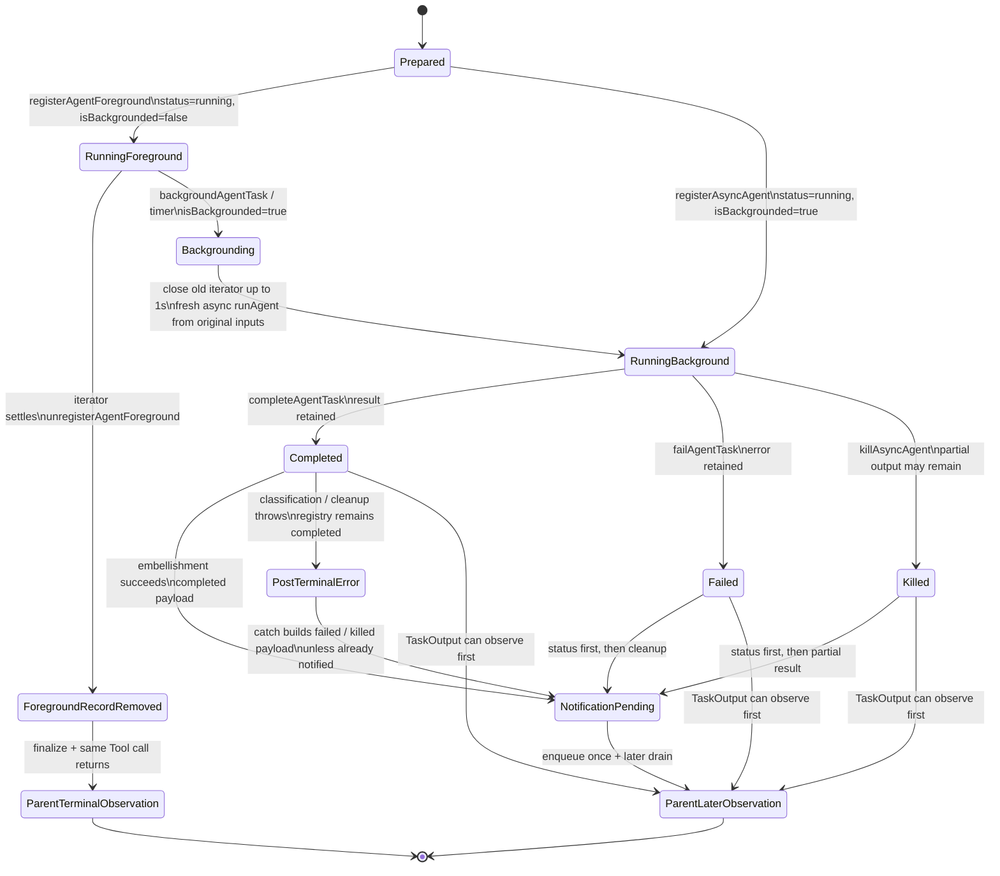

# Foreground / Background Lifecycle：Task Registry 如何接管 Agent 执行

[← 上一篇：Child Loop 与 Context Isolation](01-child-loop-and-context-isolation.md) · [返回 Part 04 总览](README.md) · [下一篇：Agent Communication / Result Return](03-communication-and-result-return.md)

## 1. 先看全景：execution mode 改变交付时序，不改语义边界

上一篇 [Child Loop 与 Context Isolation](./01-child-loop-and-context-isolation.md) 已经建立了基本契约：父 Query Loop 发出 `Agent` Tool Intent，`AgentTool` 在内部运行另一个 child Query Loop，最后跨回父侧的是归一化数据，不是 child 的 messages、controller 或 live stack。

foreground 与 background 改变的是**谁等待、task record 保留多久、结果何时进入父模型**：

- foreground：父侧这一次 `Agent` Tool call 一直 pending；child settle 后，foreground record 先被删除，结果再成为同一次 Tool call 的 completed Observation。
- async-from-start：先注册可寻址的 background task，再立即返回 `async_launched` Observation；terminal result 稍后写入 registry，并通过 notification 或 `TaskOutput` 进入父侧。
- foreground-to-background：不是把正在运行的 iterator 无缝搬到后台。旧 iterator 最多等待 1 秒关闭，随后从**原始输入**启动一次新的 async `runAgent`；已收集的 `agentMessages` 只用于聚合，不是新 query 的模型上下文。

所以最重要的区分是：

```text
semantic contract: parent receives normalized data, never child mutable runtime
operational mode:   foreground waits now; background acknowledges now and delivers terminal data later
```

下面的图是 **Architectural interpretation**：源码没有一个覆盖全部阶段的 enum；图把 `LocalAgentTaskState.status`、独立的 `isBackgrounded` flag、`AgentTool.call` 的 iterator 分支、terminal helper 与通知队列合成一张生命周期图。源码实际 status 只有这里用到的 `running`、`completed`、`failed`、`killed`；`Backgrounding`、`ForegroundRecordRemoved` 等是解释性阶段，不是源码 status。



图里有三条不能合并的 terminal / delivery 路径：

1. foreground 成功时没有在通用 registry 中写 `completed`；`unregisterAgentForeground` 删除仍为 foreground 的 record，之后才 finalize 并返回父 Tool Observation。
2. background terminal 时，record 留在 task store，并先写 `completed` / `failed` / `killed`。notification 是后续交付动作，不是 terminal status 的组成部分。
3. `PostTerminalError` 是解释性 delivery stage：registry 已写 `completed` 后，classification 或 worktree cleanup 若抛错，同一个 catch 会尝试 fail / kill；helper 因 record 已 terminal 而 no-op，但随后构造的 notification 仍可能使用 `failed` / `killed`。所以 registry 与 notification 不保证同 status。

## 2. Lifecycle ownership：状态不属于同一个对象

判断生命周期问题时，不要只问“task 现在是什么状态”，而要问“哪个资源、由谁持有、通过哪条边界可见”。

| state / resource | owner | entered by | exited by | durable? | visible to parent model? | cancellation behavior |
|---|---|---|---|---|---|---|
| stable task identity (`agentId` / task ID) | `AgentTool.call` 创建，task store 以它为 key | route 与 mode 确定后提前创建 | record 被删或后续 eviction；transcript 可更久 | session / transcript 范围，不是 process 永久态 | launch Observation、notification、`TaskOutput` 可带 ID | cancel 不改变 ID，也不撤销已发生效果 |
| foreground task record | root `AppState.tasks` + `registerAgentForeground` | `status: running`, `isBackgrounded: false` | foreground settle 时 remove；或原地 flip 为 background | session 内 registry record | 不直接进入 model；映射后才可见 | registry controller 可被 task helper abort；与 sync child execution controller 分离 |
| background task record | root `AppState.tasks` + task helpers | async registration，或 foreground record 原地 background | terminal 后保留，按 retention / eviction policy 清理 | session 内可查询；output / transcript 另有持久载体 | 经 launch、notification、`TaskOutput` 的数据副本可见 | `killAsyncAgent` 只从 `running` 转 `killed`，清 live refs |
| foreground child iterator / pending `next()` | `AgentTool.call` | `runAgent(...)[Symbol.asyncIterator]()` 与 `next()` | normal settle；backgrounding 时 `.return()` 最多等 1 秒 | 否，live runtime | 否，只能看到归一化后的输出 | sync child execution 使用 `runAgent` 从 parent Tool context fallback 选中的 controller；不是 registry controller |
| async child stream / execution promise | detached lifecycle closure | `runAsyncAgentLifecycle` 或 conversion closure | complete / fail / Abort catch + `finally` cleanup | promise 本身不 durable | 否 | task-owned async controller abort；catch 负责落 `killed` 与通知 |
| registry controller | `LocalAgentTaskState.abortController` | foreground / async registration 各自创建 | terminal helper 清除；unregister cleanup 释放 | 否 | 否 | task stop / cleanup 使用；不要当成 canonical sync child execution controller |
| sync child execution controller | parent `ToolUseContext` 持有；`runAgent` 负责选择 | canonical foreground caller 先 spread / 保留 `runAgentParams.override`，再覆盖或补上稳定 `agentId`；该 effective override 没有 `abortController`，所以 `runAgent` 在 `isAsync=false` 时 fallback 到 `toolUseContext.abortController`，再传入 child context | query settle 或父 cancel | 否 | 否 | 父 cancel 传播到 child query / Tool stage；不等于 registry 状态自动完成 |
| `agentMessages` aggregation buffer | `AgentTool.call` 或 async wrapper | child messages 被 yield 时 append | finalization / closure 回收 | 内存 buffer 否；消息可另写 transcript | 原数组不可见；finalized content 可见 | kill 可能从已收集消息提取 partial result；不会回滚 Tool effects |
| progress / retained output | task helper + registry / task output path | 每条 async message 更新 progress；terminal helper 保存 result/error | retention / eviction cleanup | registry session 内，output path 可单独保留 | 只能经 Observation / notification / `TaskOutput` 映射后可见 | kill 可保留 partial output，不保证有完整 terminal answer |
| `isBackgrounded` mode flag | `LocalAgentTaskState` | registration 设初值；`backgroundAgentTask` / timer flip | 不会再 flip 回 foreground | 随 record 保留 | 通常不是直接模型事实；launch shape 表达 mode | 它不是 status；`running + true` 才表示后台运行中 |
| terminal `result` / `error` + status | `completeAgentTask` / `failAgentTask` / `killAsyncAgent` | 仅对仍为 `running` 的 record 执行 terminal transition | retention / eviction | session 内可查询；transcript/output 可更久 | `TaskOutput` 或后续 notification 可见 | terminal 后再次 kill 是 no-op；外部副作用不可回滚 |
| terminal notification queue item | `enqueueAgentNotification` + global pending queue | terminal status 已落定后尝试 embellishment/cleanup；成功分支或 catch 各自传入 notification status | later command-queue drain | 排队期间保留 | drain 后成为 later parent input；post-terminal error 时 status 可与 registry 不同 | `notified` check-and-set 抑制重复；若 `TaskOutput` 先标记，可抑制矛盾通知 |
| foreground Tool Observation | generic Tool result mapper + parent Query Loop | finalize 完成后由同一 `Agent` call 返回 | parent history 接收并进入下一轮 | 进入 parent transcript 后持久 | 是 | cancel / error 决定 call 是抛出还是可能返回 partial completed |
| background launch / retrieval Observation | `AgentTool` mapper 或 `TaskOutputTool` mapper | `async_launched` 立即返回；terminal poll 以后返回 | parent history 接收 | 进入 parent transcript 后持久 | 是 | launch 不承诺完成；poll timeout 不制造 terminal state |

这里必须特别守住 controller 边界：`registerAgentForeground` 为 registry record 创建 controller；canonical foreground caller 会 spread / 保留预先构造的 `runAgentParams.override`，然后覆盖或补上稳定 `agentId`。这些 preserved override fields 可承载先前组装的 context / prompt 配置，但这条路径的 effective override **没有** `abortController`。`runAgent` 根据优先级选择 controller：显式 abort override 优先，async 无 override 时新建 unlinked controller，sync 无 override 时 fallback 到 `toolUseContext.abortController`；随后才把选中的 controller 传入 child context。它们都是“取消相关对象”，但 owner、选择路径、作用域和 settle 条件不同。只有 async-from-start 与 foreground-to-background conversion 会在本文路径中显式把 task controller 传给 `runAgent`。

## 3. Walkthrough A：canonical foreground

假设父 Agent 委派一个只读调查，未请求 `run_in_background`，任何强制 async gate 也未开启。

### 3.1 create / register：先让 task 可寻址

`AgentTool.call` 先解析 agent type、prompt、tools 与 mode，并提前生成稳定 `agentId`。在 child iterator 被推进前，它调用 `registerAgentForeground`：

```text
task[agentId] = {
  status: running,
  isBackgrounded: false,
  abortController: registryController,
  pendingMessages: [],
  result: undefined,
}
```

提前注册使 UI / task helper 能在 child 运行中寻址该任务，也为手动或计时 background signal 建立 resolver。但这不表示 registry controller 就是 sync child execution controller：foreground caller 保留原 `runAgentParams.override` fields 并设置稳定 `agentId`，却没有提供 `abortController`；`runAgent` 因 `isAsync=false` 而 fallback 选择 parent `ToolUseContext.abortController`，再把它供应给 child context。

### 3.2 run / collect：父 Tool call 等待，父子 loop 仍分离

`AgentTool.call` 创建 `runAgent(...)` async iterator，每轮 `next()` 得到 child event 后追加到 outer `agentMessages`，并更新 progress。父 Query Loop 此时被同一次 Tool call 阻塞，不能消费 child 的中间 Tool history；child Query Loop 仍独立增长自己的 messages、执行自己的 Tool rounds。

因此 foreground 的“同步”只是调用者等待关系：

```text
parent Query Loop
  waits for one Agent Tool call
      child Query Loop
        model -> child Tool -> child Observation -> next child model round
```

它不把两套 loop 合并，也不让父 model 直接读取 `agentMessages`。

### 3.3 settle / unregister / finalize：remove 先于 Observation

child iterator 正常结束后，`AgentTool.call` 的 cleanup 先调用 `unregisterAgentForeground`。这个 helper 只删除 `isBackgrounded === false` 的 record，并运行 registration cleanup；它不会把 foreground record 改写成通用 `completed`。

随后 adapter 才处理 error / partial-output 规则、调用 `finalizeAgentTool`，再把 `{status: "completed", ...result}` 映射为普通 Tool Observation。父侧第一次得到 child 结果就在这里，并继续自己的 Query Loop。

### 3.4 immediate 与 later parent-visible outcome

| 时间 | 父模型看到什么 | registry 发生什么 |
|---|---|---|
| 调用刚开始 | 没有 launch acknowledgement；原 Tool call 仍 pending | foreground `running / false` record 已存在 |
| child 运行中 | 不直接看到 child event | progress 可由 runtime/UI 更新 |
| child settle | 同一次 Tool call 返回 completed content / usage；无 assistant output 的 error 或 Abort 可走错误路径 | foreground record 已先被 remove |
| 稍后 | 不依赖 generic background XML notification 再交付一次结果 | 没有保留一个 generic `completed` foreground record 供常规 terminal polling |

foreground 也可能在非 Abort error 前已经积累 assistant output；这时 adapter 可以 finalize partial output 为父侧 `completed` result。这里的 `completed` 是 Tool result contract，不证明 child 内部 error-free。

## 4. Walkthrough B：async-from-start

现在父 Agent 显式请求 `run_in_background: true`，或者运行时 gate / agent definition 使 `shouldRunAsync` 为真。这条路径从未创建 foreground iterator，也不经过 foreground-to-background conversion。

### 4.1 register / launch：先建后台 record，再 detach

`registerAsyncAgent` 创建：

```text
task[agentId] = {
  status: running,
  isBackgrounded: true,
  abortController: asyncTaskController,
  pendingMessages: [],
  result: undefined,
}
```

普通 async-from-start 不把 parent abort controller 传给 registration，因此后台 task controller 与父侧 ESC 取消链解除；后台任务由显式 task kill 管理。helper 本身也支持传入 parent controller 时创建 linked child controller，但那不是这里的普通 launch branch。

注册成功后，`AgentTool.call` 以 fire-and-forget 方式启动 `runAsyncAgentLifecycle`。wrapper 通过 `makeStream` 创建真正的 async `runAgent` stream，收集自己的 `agentMessages`、更新 progress，并在 terminal branch 保存 result / error。

### 4.2 immediate outcome：父侧先得到 launch Observation

父 Tool call 不等待 child terminal。它立即返回一份 launch result，核心 shape 是：

```text
status: async_launched
isAsync: true
agentId: stable task ID
description / prompt
outputFile
canReadOutputFile
```

这份 Observation 只证明任务已注册、异步 lifecycle 已被调度，不证明 child 已完成第一轮模型请求，更不证明 terminal notification 已经存在。父 Query Loop 可以马上继续，并用 `agentId` 寻址任务。

### 4.3 later outcome：terminal status 与交付分两步

async wrapper 收完 stream 后先 `finalizeAgentTool`，再调用 completion helper；运行阶段异常分支分别调用 fail 或 kill helper。**terminal status 先写 registry**，之后才做 transcript classification、worktree cleanup 等可能较慢的 notification embellishment，最后尝试 enqueue terminal notification。

这个顺序还产生一个重要 race：`completeAgentTask` 已把 record 写成 `completed` 后，classification 或 worktree cleanup 仍处于同一个 `try`。若它们随后抛出非 Abort error 或 `AbortError`，catch 会调用 fail 或 kill helper；这些 helper 只接受 `running`，所以 registry transition 是 no-op，record 仍为 `completed`。但 catch 接着仍可能用 `failed` 或 `killed` 参数构造 notification。于是 `TaskOutput` 可观察 `completed`，later notification 却报告 failed / killed；如果 `TaskOutput` 抢先把 `notified` 设为 true，这份矛盾 notification 会被抑制。

因此 later parent visibility 有两条边：

- `TaskOutput` 读取 registry：nonblocking poll 在 `running` 时返回 `not_ready`；blocking poll 等到 terminal status 后即可返回。它不必等待 notification embellishment。
- terminal notification：`notified` check-and-set 成功后进入 pending queue，稍后再成为 parent input。它不是 child runtime，也不是整个 transcript，只是格式化后的 terminal data / metadata；post-terminal error 时，其 status 可能不同于已持久的 registry status。

精确的 `TaskOutput` 协议、notification drain 与 parent re-entry 属于下一篇通信文章；本文只固定边界：**terminal registry transition 与 later delivery 是不同 owner 的两次操作。**

### 4.4 immediate 与 later parent-visible outcome

| 时间 | 父模型看到什么 | registry 发生什么 |
|---|---|---|
| launch | 立即得到 `async_launched`、ID 与 output path | `running / isBackgrounded=true` 已注册 |
| child 运行中 | 父可继续其他工作；主动 poll 可能得到 `not_ready` | progress 持续更新，result 尚未落定 |
| terminal status 刚写入 | `TaskOutput` 已可能得到 terminal task | `completed` / `failed` / `killed` 与 result/error 已落定，live refs 被清理 |
| embellishment / cleanup 后 | 若尚未标记 notified，terminal notification 可在稍后 parent turn 出现；post-terminal error 可让它报告 failed / killed | registry 可仍为 `completed`；`notified` 与 queue enqueue 单独推进 |

## 5. Walkthrough C：foreground-to-background conversion

这条路径最容易被错误描述成“同一 child 继续在后台跑”。实际实现的边界更锋利：**task identity 与聚合 buffer 延续，但 query iterator 不延续。**

### 5.1 signal 到来前：已经有一个 pending `next()`

foreground loop 每轮先创建 `nextMessagePromise = agentIterator.next()`，然后把它与只创建一次的 `backgroundPromise` 做 `Promise.race`。所以 background signal 赢时，旧 iterator 上已经有一个在途 round。

`backgroundAgentTask` 或 auto-background timer 先把 registry record 原地更新为：

```text
status: running
isBackgrounded: true
task ID: unchanged
abortController: foreground registration 创建的 registry controller
```

随后它 resolve background signal。这里没有 `registerAsyncAgent` 第二次注册；同一个 record 从 foreground mode 变为 background mode。

### 5.2 handoff 实际做什么：bounded close，然后 fresh restart

background branch 调度 detached closure。closure 内部依次执行：

1. 调用旧 `agentIterator.return()`，让旧 `runAgent` 的 `finally` 有机会释放 MCP connection、hook 与 prompt-cache tracking 等资源。
2. cleanup 与 `sleep(1000)` race；最多只等 1 秒，不无限阻塞后台接管。
3. 用稳定 task ID、task registry controller 和 `isAsync: true` 调用一次**新的** `runAgent({...runAgentParams})`。
4. 新 invocation 使用 `runAgentParams` 中保存的**原始 prompt / initial inputs**；它没有把 foreground 已收集的 `agentMessages` 作为 model context 传入。
5. 旧 `agentMessages` 只先喂给 progress tracker，并继续作为新消息的聚合数组；最后的 `finalizeAgentTool` 会基于这份合并聚合生成 parent-visible result。

因此必须接受两个运行时后果：

- **replay**：fresh async child 从原始输入重新开始，旧 foreground 已完成的搜索、Tool 调用或外部效果可能再次执行。
- **temporary overlap**：若 1 秒 timeout 比旧 `.return()` 先完成，旧在途 round 可能尚未退出，新 async query 已经启动；两者可短暂重叠。

这不是泛泛的“cleanup 可能慢”，而是 mode conversion 的真实语义。稳定 ID 只维持寻址与聚合连续性，不能证明执行栈连续性或 exactly-once effects。

### 5.3 immediate outcome：launch Observation 不等待 restart 完成

`AgentTool.call` 在调度 detached closure 后立即返回与后台 launch 同类的 `async_launched` result：stable `agentId`、description、prompt、output path 与读取能力。父侧收到 acknowledgement 时，旧 iterator cleanup / fresh restart 可能仍在后台 closure 内推进。

稍后，fresh async invocation 走同一套 `completed` / `failed` / `killed` terminal helper，再通过 `TaskOutput` 或 notification 交付；它也继承 post-terminal error 可能造成 registry / notification status divergence 的边界。与 async-from-start 相同的是 terminal contract；不同的是 conversion 前已有 foreground work，因此结果聚合、replay 和 overlap 风险都不同。

### 5.4 immediate 与 later parent-visible outcome

| 时间 | 父模型看到什么 | registry / execution 发生什么 |
|---|---|---|
| 转换前 | 原 foreground Tool call 仍 pending | `running / false`，旧 iterator 已有 pending `next()` |
| signal 赢 | 同一 Tool call 很快返回 `async_launched` | record 原地变为 `running / true`；detached closure 接管 |
| closure 内 | 父已可继续，不看见 cleanup 细节 | 旧 iterator 最多等 1 秒关闭；fresh async `runAgent` 从原始输入重启 |
| fresh run terminal | `TaskOutput` 可先观察，notification 可稍后交付且 status 可能因 post-terminal error 不同 | terminal status / result 先落 registry；catch helper 不会覆写已 terminal record |

## 6. Terminal、cleanup 与 race

### 6.1 三个真实 terminal status

| terminal | registry transition / retained data | immediate parent-visible path | later notification | cleanup owner |
|---|---|---|---|---|
| `completed` | 仅 `running -> completed`；保存 `AgentToolResult`，清 controller / cleanup / selected agent | `TaskOutput` 可返回 `retrieval_status: success` + task status/result | 可含 final text、usage、output path、worktree metadata | completion helper 清 live refs；async wrapper 清 summarization / scoped skills / dump state；retention/eviction 另管 record |
| `failed` | 仅 `running -> failed`；保存 error，清 live refs | `TaskOutput` 可返回 `success` retrieval，但 task 自身是 `failed` | terminal notification 带 failed summary / error | fail helper + async catch；worktree cleanup 在 enqueue 前 |
| `killed` | 仅 `running -> killed`；先 abort task controller，再清 live refs；可从已收集消息提取 partial output | `TaskOutput` 可返回 terminal `killed` | notification 可带 partial result | kill helper + Abort catch；重复 kill / terminal 后 kill 是 no-op |
| `completed` + post-terminal error | completion 已持久；catch 中 fail / kill helper 因非 `running` 而 no-op | `TaskOutput` 仍读取 `completed` result | 若未先 `notified`，catch 可 enqueue `failed` / `killed` payload；否则被抑制 | catch 继续 cleanup / notification；它不能改写已 terminal registry |

`retrieval_status: success` 表示“成功取得 terminal task 数据”，不等于 task 业务状态是 `completed`。同理，源码状态叫 `killed`；不要在 **Architectural interpretation** 中把 `Cancelled` 发明成 source status。

### 6.2 status-before-notification 是可观察保证

completion / failure / Abort branch 都刻意先写 terminal status，再运行可能卡住的 classification 或 worktree cleanup。这样 `TaskOutput(block=true)` 能先 unblock。结果是：

```text
registry says terminal
  does not imply
terminal notification already embellished and queued
```

`TaskOutput` terminal retrieval 与 `enqueueAgentNotification` 都会触碰 `notified`。如果 retrieval 先标记，后续 enqueue 的 check-and-set 可以抑制重复或矛盾通知；如果 enqueue 先成功，queue item 稍后由父 runtime drain。无论谁先，terminal status 与 retained result 不依赖 notification queue 才成立。

### 6.3 post-terminal cleanup error 会让 registry 与 notification 分叉

`runAsyncAgentLifecycle` 的成功路径不是在 `completeAgentTask` 后离开 `try`；classification、worktree cleanup 与 completed notification enqueue 仍在其中。因此要按下面的顺序理解：

```text
completeAgentTask -> registry = completed
        |
        v
classification / worktree cleanup throws
        |
        v
same catch -> failAgentTask or killAsyncAgent
              (no-op: registry is no longer running)
        |
        v
try enqueue failed / killed notification
```

这意味着 registry / `TaskOutput` 是已提交的 task fact，notification 是后续 delivery attempt；后者不是前者的权威镜像。若 `TaskOutput` 先将 `notified=true`，`enqueueAgentNotification` 的 check-and-set 会阻止矛盾 payload；否则父模型可能稍后看到与 registry 不同的 notification status。

### 6.4 completion 与 background signal 不是一个原子 transition

foreground loop 的 `next()` 与 background signal 在 `Promise.race` 中竞争。实现通过三层 guard 降低错误 transition：

- background branch 重新读取 task，并确认 `isBackgrounded`。
- `unregisterAgentForeground` 只删除仍为 foreground 的 record。
- terminal helpers 只转换仍为 `running` 的 task。

但这不把分布式 owner 变成一个原子状态机。诊断边界 race 时，要同时看 iterator promise、registry flag 和 status helper，而不是只看某个 UI label。尤其 background signal 赢后，losing `next()` 仍可能在途，必须结合 1 秒 bounded cleanup 理解 overlap。

### 6.5 kill 的能力边界

kill 是停止未来执行的控制面，不是 transaction rollback：

- 已写入文件、已调用外部 API、已提交数据库或已发送消息的效果不会因 controller abort 自动撤销。
- replay 或 temporary overlap 还可能让非幂等效果出现多次。
- 因此可转换为 background 的 child Tool 应优先具备幂等键、去重、补偿或显式 effect boundary；不能把 task status 当成 effect ledger。

### 6.6 resume 不等于复活 live stack

terminal / evicted agent 的 resume 会读取 transcript 与 metadata，过滤未配对 Tool use / thinking 等内容，重建 replacement state，重新注册 async task，再启动新的 query。它恢复的是可序列化材料，不是 promise、iterator、controller 或旧调用栈。本文只用这一点划定 retention / cleanup 边界；具体通信与恢复协议留给下一篇。

## 7. 一段能覆盖三条路径的伪代码

```ts
async function manageLocalAgentTask(
  taskSpec,
  executionMode,
): Promise<ImmediateHandle | TerminalResult> {
  const id = createStableAgentId()
  const originalInputs = buildRunAgentParams(taskSpec, id)

  if (executionMode === "background-from-start") {
    const task = registerAsyncAgent({ id, isBackgrounded: true })
    void runAsyncLifecycle({
      task,
      makeStream: () => runAgent(originalInputs, {
        isAsync: true,
        abortController: task.abortController,
      }),
      // Terminal status is persisted before notification work. A later
      // embellishment error may build a divergent notification payload.
    })
    return asyncLaunchedObservation(task)
  }

  const registration = registerAgentForeground({
    id,
    status: "running",
    isBackgrounded: false,
  })
  const syncRunParams = {
    ...originalInputs,
    isAsync: false,
    // Preserve prebuilt override fields and set stable identity. The canonical
    // foreground params still contain no abortController override.
    override: { ...originalInputs.override, agentId: id },
  }
  // With no effective abortController override, sync runAgent falls back to
  // originalInputs.toolUseContext.abortController.
  const oldIterator = runAgent(syncRunParams).iterator()
  const agentMessages = [] // aggregation only

  try {
    while (true) {
      const pendingNext = oldIterator.next()
      const winner = await race(pendingNext, registration.backgroundSignal)

      if (winner === "background") {
        // Signal owner already flipped isBackgrounded; record remains running.
        const backgroundTask = getTask(id)
        void (async () => {
          await race(ignoreErrors(oldIterator.return()), sleep(1000))

          // Seed metrics/result aggregation only; NOT child model context.
          const tracker = progressFrom(agentMessages)
          try {
            for await (const message of runAgent(originalInputs, {
              isAsync: true,
              id,
              abortController: backgroundTask.abortController,
            })) {
              agentMessages.push(message)
              updateProgress(id, tracker, message)
            }
            persistCompletedBeforeNotification(finalize(agentMessages))
            await embellishAndTryEnqueueNotification(id, "completed")
          } catch (error) {
            const notificationStatus = isAbort(error) ? "killed" : "failed"
            // These are no-ops if completed was already persisted.
            if (isAbort(error)) persistKilledIfRunning(agentMessages)
            else persistFailedIfRunning(error)
            await cleanupAfterError()
            tryEnqueueNotificationUnlessNotified(id, notificationStatus)
          }
        })()
        return asyncLaunchedObservation({ id })
      }

      if (winner.done) break
      agentMessages.push(winner.value)
    }
  } finally {
    // Removes only if record is still foreground; happens before finalization.
    unregisterAgentForeground(id)
  }

  return completedToolObservation(finalize(agentMessages))
}
```

这段伪代码刻意没有把 `agentMessages` 传给第二次 `runAgent`。如果把它放进 `originalInputs.promptMessages`，就会把 aggregation、transcript 与 model context 三种语义错误合并，并掩盖真实 replay 行为。

## 8. 决定性源码镜头

所有源码事实固定在 commit `712b24f22a63eb6d1a2f86697bf6dbbaa39ae3cf`。证据身份使用 `commit + repository-relative path + symbol`；链接中的行号只是该固定快照的定位信息。

### Lens 1：foreground 与 async registration 写同一种 record、不同 mode flag

**[Source-confirmed]** `(712b24f22a63eb6d1a2f86697bf6dbbaa39ae3cf, src/tasks/LocalAgentTask/LocalAgentTask.tsx, registerAsyncAgent / registerAgentForeground)`：

```ts
// async-from-start
const taskState = {
  status: 'running',
  abortController,
  isBackgrounded: true,
  pendingMessages: [],
}

// foreground
const taskState = {
  status: 'running',
  abortController: createAbortController(),
  isBackgrounded: false,
  pendingMessages: [],
}
```

status 与 execution mode 是两条轴；不能发明 `background` status，也不能只看 `running` 推断前台/后台。[查看 task shape 与 registration helpers](https://github.com/buoylee/Claude-Code-true/blob/712b24f22a63eb6d1a2f86697bf6dbbaa39ae3cf/src/tasks/LocalAgentTask/LocalAgentTask.tsx#L116-L148) · [查看 async / foreground registration](https://github.com/buoylee/Claude-Code-true/blob/712b24f22a63eb6d1a2f86697bf6dbbaa39ae3cf/src/tasks/LocalAgentTask/LocalAgentTask.tsx#L466-L614)。

### Lens 2：canonical foreground controller 来自 `runAgent` 的 sync fallback

**[Source-confirmed]** `(712b24f22a63eb6d1a2f86697bf6dbbaa39ae3cf, src/tools/AgentTool/AgentTool.tsx, AgentTool.call)` 与 `(712b24f22a63eb6d1a2f86697bf6dbbaa39ae3cf, src/tools/AgentTool/runAgent.ts, runAgent)`：

```ts
// canonical foreground caller: preserve prebuilt fields and set stable identity
runAgent({
  ...runAgentParams,
  override: { ...runAgentParams.override, agentId: syncAgentId },
})

// runAgent controller selection
const agentAbortController = override?.abortController
  ? override.abortController
  : isAsync
    ? new AbortController()
    : toolUseContext.abortController

createSubagentContext(toolUseContext, {
  abortController: agentAbortController,
  // ...
})
```

canonical foreground spread-preserves `runAgentParams.override`，因此 effective override 仍可能含其他预构造字段；caller 最后覆盖或补上稳定 `agentId`。这条路径 preserved fields 中没有 `abortController`，controller 因而不是 caller 的显式 abort override，而是 `runAgent` 在 sync branch 直接 fallback 选择 parent `ToolUseContext` 的 controller，再传入 child context。async-from-start 与 conversion 才显式把 task controller 放进 override。[查看 foreground caller 的 spread-preservation](https://github.com/buoylee/Claude-Code-true/blob/712b24f22a63eb6d1a2f86697bf6dbbaa39ae3cf/src/tools/AgentTool/AgentTool.tsx#L839-L853) · [查看预先构造的 override fields](https://github.com/buoylee/Claude-Code-true/blob/712b24f22a63eb6d1a2f86697bf6dbbaa39ae3cf/src/tools/AgentTool/AgentTool.tsx#L620-L630) · [查看 `runAgent` controller 选择](https://github.com/buoylee/Claude-Code-true/blob/712b24f22a63eb6d1a2f86697bf6dbbaa39ae3cf/src/tools/AgentTool/runAgent.ts#L520-L528) · [查看 controller 进入 child context](https://github.com/buoylee/Claude-Code-true/blob/712b24f22a63eb6d1a2f86697bf6dbbaa39ae3cf/src/tools/AgentTool/runAgent.ts#L697-L714)。

### Lens 3：conversion 关闭旧 iterator 后，从 original params fresh restart

**[Source-confirmed]** `(712b24f22a63eb6d1a2f86697bf6dbbaa39ae3cf, src/tools/AgentTool/AgentTool.tsx, AgentTool.call)`：

```ts
const nextMessagePromise = agentIterator.next()
const raceResult = await Promise.race([
  nextMessagePromise.then(result => ({ type: 'message', result })),
  backgroundPromise,
])

await Promise.race([
  agentIterator.return(undefined).catch(() => {}),
  sleep(1000),
])

for (const existingMsg of agentMessages) {
  updateProgressFromMessage(tracker, existingMsg, ...)
}

for await (const msg of runAgent({
  ...runAgentParams,
  isAsync: true,
  override: { agentId: backgroundedTaskId, abortController: task.abortController },
})) {
  agentMessages.push(msg)
}
```

`runAgentParams` 是 conversion 前保存的原始 inputs；旧消息只初始化 progress / result aggregation，没有进入 fresh invocation 的 model input。`.return()` 的 1 秒上界意味着 timeout 后旧 round 可仍在途。[查看 pending-next race 与 bounded close](https://github.com/buoylee/Claude-Code-true/blob/712b24f22a63eb6d1a2f86697bf6dbbaa39ae3cf/src/tools/AgentTool/AgentTool.tsx#L883-L924) · [查看 fresh async restart 与 aggregation](https://github.com/buoylee/Claude-Code-true/blob/712b24f22a63eb6d1a2f86697bf6dbbaa39ae3cf/src/tools/AgentTool/AgentTool.tsx#L925-L1050)。

### Lens 4：terminal status 必须先于 notification embellishment

**[Source-confirmed]** `(712b24f22a63eb6d1a2f86697bf6dbbaa39ae3cf, src/tools/AgentTool/agentToolUtils.ts, runAsyncAgentLifecycle)`：

```ts
try {
  const agentResult = finalizeAgentTool(agentMessages, taskId, metadata)
  completeAsyncAgent(agentResult, rootSetAppState)

  const handoffWarning = await classifyHandoffIfNeeded(...)
  const worktreeResult = await getWorktreeResult()
  enqueueAgentNotification({ status: 'completed', ...worktreeResult })
} catch (error) {
  if (error instanceof AbortError) {
    killAsyncAgent(taskId, rootSetAppState)
    const worktreeResult = await getWorktreeResult()
    enqueueAgentNotification({ status: 'killed', ...worktreeResult })
    return
  }
  failAsyncAgent(taskId, errorMessage(error), rootSetAppState)
  const worktreeResult = await getWorktreeResult()
  enqueueAgentNotification({ status: 'failed', ...worktreeResult })
}
```

classification 或 git cleanup 卡住时，blocking `TaskOutput` 仍可因 terminal status 已写入而 unblock。若它们抛错，catch 的 fail / kill helper 因 record 已是 `completed` 而 no-op，但传给 notification 的 status 仍可成为 `failed` / `killed`。[查看 completion 后仍在 try 内的 embellishment 与 catch](https://github.com/buoylee/Claude-Code-true/blob/712b24f22a63eb6d1a2f86697bf6dbbaa39ae3cf/src/tools/AgentTool/agentToolUtils.ts#L603-L682)。

### Lens 5：terminal helper 与 notification queue 各自有 guard

**[Source-confirmed]** `(712b24f22a63eb6d1a2f86697bf6dbbaa39ae3cf, src/tasks/LocalAgentTask/LocalAgentTask.tsx, completeAgentTask / failAgentTask / killAsyncAgent / enqueueAgentNotification)`：

```ts
if (task.status !== 'running') return task
return { ...task, status: 'completed', result, abortController: undefined }

if (task.notified) return task
shouldEnqueue = true
return { ...task, notified: true }

if (shouldEnqueue) {
  enqueuePendingNotification({ value: message, mode: 'task-notification' })
}
```

terminal status 的 idempotency gate 与 notification 的 once-only gate 不在同一个 transition 中。正因为 fail / kill 只接受 `running`，post-completion catch 不能改写 registry；notification helper 却按 caller 传入的 status 组装 payload。[查看 terminal helpers](https://github.com/buoylee/Claude-Code-true/blob/712b24f22a63eb6d1a2f86697bf6dbbaa39ae3cf/src/tasks/LocalAgentTask/LocalAgentTask.tsx#L281-L303) · [查看 complete / fail transitions](https://github.com/buoylee/Claude-Code-true/blob/712b24f22a63eb6d1a2f86697bf6dbbaa39ae3cf/src/tasks/LocalAgentTask/LocalAgentTask.tsx#L412-L456) · [查看 notification check-and-set](https://github.com/buoylee/Claude-Code-true/blob/712b24f22a63eb6d1a2f86697bf6dbbaa39ae3cf/src/tasks/LocalAgentTask/LocalAgentTask.tsx#L197-L262)。

### Lens 6：foreground remove 与 terminal polling 是不同 observation path

**[Source-confirmed]** `(712b24f22a63eb6d1a2f86697bf6dbbaa39ae3cf, src/tasks/LocalAgentTask/LocalAgentTask.tsx, unregisterAgentForeground)` 与 `(712b24f22a63eb6d1a2f86697bf6dbbaa39ae3cf, src/tools/TaskOutputTool/TaskOutputTool.tsx, TaskOutputTool.call)`：

```ts
// foreground cleanup
if (!isLocalAgentTask(task) || task.isBackgrounded) return prev
const { [taskId]: removed, ...rest } = prev.tasks
return { ...prev, tasks: rest }

// terminal task retrieval
if (task.status !== 'running' && task.status !== 'pending') {
  markNotified(task_id)
  return { retrieval_status: 'success', task: await getTaskOutputData(task) }
}
return { retrieval_status: 'not_ready', task: await getTaskOutputData(task) }
```

foreground 的完成数据由原 `Agent` Tool call 交付；`TaskOutput` 面向仍在 registry 中的 async task。blocking timeout 只返回 timeout，不会伪造 completion。[查看 foreground removal](https://github.com/buoylee/Claude-Code-true/blob/712b24f22a63eb6d1a2f86697bf6dbbaa39ae3cf/src/tasks/LocalAgentTask/LocalAgentTask.tsx#L657-L682) · [查看 poll / wait / terminal retrieval](https://github.com/buoylee/Claude-Code-true/blob/712b24f22a63eb6d1a2f86697bf6dbbaa39ae3cf/src/tools/TaskOutputTool/TaskOutputTool.tsx#L208-L308)。

### Lens 7：resume 从 transcript reconstruction 启动新 query

**[Source-confirmed]** `(712b24f22a63eb6d1a2f86697bf6dbbaa39ae3cf, src/tools/AgentTool/resumeAgent.ts, resumeAgentBackground)`：

```ts
const transcript = await getAgentTranscript(agentId)
const resumedMessages = filterUnresolvedToolUses(transcript.messages)
const task = registerAsyncAgent({ agentId, ... })

void runAsyncAgentLifecycle({
  taskId: task.agentId,
  makeStream: () => runAgent({
    promptMessages: [...resumedMessages, createUserMessage({ content: prompt })],
    isAsync: true,
  }),
})
```

恢复依赖 transcript / metadata 的可重建副本，不依赖旧 iterator 或 promise 仍存活。[查看 transcript reconstruction 与新 async lifecycle](https://github.com/buoylee/Claude-Code-true/blob/712b24f22a63eb6d1a2f86697bf6dbbaa39ae3cf/src/tools/AgentTool/resumeAgent.ts#L42-L265)。

## 9. 设计取舍

### 9.1 responsiveness 与 deterministic result timing

foreground 给调用者一个强时序：原 Tool call terminal 后才继续，父 model 的下一步天然拿到结果。代价是父 turn 被占住，长任务会降低响应性。

background 把 launch acknowledgement 与 terminal delivery 分开，父侧可继续调度、回答或发起其他工作。代价是 parent 必须处理 `not_ready`、later notification、terminal race 与结果到达顺序；“已经启动”与“已经完成”不能再由一个返回值表达。

### 9.2 retention 与 cleanup

foreground settle 后删除 registry record，减少 retained state，也意味着不能把普通 foreground completion 当作长期 task history 来 poll。background 为 discoverability、kill、progress、`TaskOutput` 和 resume 保留 record / output / transcript，代价是 eviction、disk bootstrap、notification 去重与 stale metadata 都要有 owner。

### 9.3 bounded cleanup 与 exactly-once illusion

conversion 最多等待 1 秒关闭旧 iterator，优先保证父侧尽快恢复响应；代价是 fresh restart 可 replay，timeout 可 overlap。若强求旧 iterator 完全退出再返回，响应时间会被任意慢的 MCP / hook cleanup 绑架；若直接 abandon，又更容易泄漏资源。实现选择 bounded cleanup，但没有提供 exactly-once effect guarantee。

### 9.4 registry complexity 是显式治理的成本

task ID、status、mode flag、controllers、progress、retention、terminal result、notification 与 parent Observation 分散在不同 owner 中，理解成本高；换来的能力是可寻址、可 kill、可 poll、可稍后交付，并且 slow notification 工作不会阻塞 terminal status。代价是 post-terminal delivery error 可能让 registry 与 notification status 分叉，消费者必须把 registry 当 task fact、把 notification 当 delivery payload。正确抽象不是“一个更复杂的 enum”，而是“多个有顺序约束的资源生命周期”。

## 10. 必须守住的不变量

1. **execution mode 不改变语义边界。** 父侧始终只接收 normalized data，不接收 child mutable runtime。
2. **`status` 与 `isBackgrounded` 分离。** 实际 terminal status 是 `completed`、`failed`、`killed`；后台运行是 `running + isBackgrounded=true`。
3. **canonical foreground completion 先 remove record，再 finalize。** 它不在 generic task registry 中写一个 completed record。
4. **async terminal status 先于 notification embellishment。** `TaskOutput` 可以比 terminal notification 更早观察完成。
5. **notification 的 `notified` check-and-set 与 terminal transition 分离。** delivery once 不等于 task completion only once 的同一原子操作。
6. **registry status 与 notification status 不保证一致。** completion 后的 classification / cleanup error 不能改写 terminal record，却可让 catch 构造 failed / killed payload；`TaskOutput` 先标记 notified 时又可抑制它。
7. **registry controller 与 sync child execution controller 分离。** canonical foreground caller spread-preserves `runAgentParams.override` 并设置稳定 `agentId`；effective override 没有 `abortController`，所以 `runAgent` 的 sync fallback 从 parent `ToolUseContext` 选择 controller。只有 async / conversion 路径显式传 task controller。
8. **foreground-to-background 是 fresh async restart。** 旧 iterator 最多等 1 秒 `.return()`；新 `runAgent` 使用 original inputs。
9. **`agentMessages` 只承担 aggregation / progress / finalization。** 它不是 conversion 后 fresh query 的隐式模型上下文。
10. **stable task ID 不保证 execution continuity。** replay 与 cleanup-timeout overlap 都可能发生。
11. **kill 不能回滚 completed effects。** controller 管未来执行，不是 transaction coordinator。
12. **poll timeout 不制造 terminal state。** `not_ready` / timeout 与 failed / killed 是不同事实。
13. **resume 重建数据，不复活 stack。** transcript / metadata 可恢复，promise / iterator / controller 不可恢复。

## 11. 常见误解校正

**误解：background 就是 detached and untracked。**

校正：执行 closure 与父 Tool call 解耦，但 task 先注册为 `running / isBackgrounded=true`，保留 ID、controller、progress、terminal result/error，并可由 `TaskOutput` 或 notification 寻址。

**误解：foreground 表示父 Agent 与 child 共用一个 model loop。**

校正：foreground 只表示父 Tool call 等待 child terminal。parent Query Loop 与 child Query Loop 的 messages、Tool rounds 和 runtime owner 仍分离。

**误解：completion notification 包含整个 child runtime。**

校正：notification 是格式化的 terminal data，可带 result、usage、output path 与 worktree metadata；controller、promise、iterator、cache 和 mutable child context 都不会跨回父侧。

**误解：foreground 转 background 会无缝继续同一 child stack。**

校正：旧 iterator `.return()` 最多等 1 秒，随后从 original inputs fresh async `runAgent`。已有 `agentMessages` 只用于 aggregation；工作可能 replay，cleanup timeout 时旧 round 与新 query 可能 overlap。

**误解：changing mode 只是改一个 flag，或者一定会丢掉之前所有结果。**

校正：flag 会改变 registry mode，但 adapter 还执行 bounded cleanup 与 fresh restart。旧 messages 仍参与 progress / final result aggregation，却不作为新 model context；“保留结果聚合”与“延续执行栈”必须分开。

**误解：registry 是 `completed`，later notification 就一定也是 completed。**

校正：terminal status 刻意先写，classification 与 worktree cleanup 后才 enqueue。它们若抛错，catch 的 fail / kill transition 因 record 已 terminal 而 no-op，但 notification payload 仍可能报告 failed / killed；`TaskOutput` 若先把 `notified` 标记为 true，则可抑制这份矛盾通知。

**误解：cancel / kill 会撤销 child 已完成的工作。**

校正：abort 只能停止仍在执行或未来的步骤。已发生的文件、网络、数据库或消息效果需要各自的幂等 / 补偿机制。

**误解：`TaskOutput` 读取的是 child live stack。**

校正：它读取 task registry / output 表达并映射成 Tool Observation；timeout、terminal retrieval 与 notification delivery 都不需要恢复 iterator。

## 12. 面试回答

如果面试官问“Claude Code 如何管理 foreground / background subagent 生命周期”，可以这样回答：

> `AgentTool` 的语义边界始终是父 Tool Intent 到 normalized Tool Observation；foreground/background 只改变等待与交付时序。canonical foreground 会先注册 `status=running, isBackgrounded=false` 的 task record，但 registry controller 与 sync child execution controller 分离：caller spread-preserves 预先构造的 `runAgentParams.override` 并设置稳定 `agentId`；effective override 没有 `abortController`，所以 `runAgent` 在 `isAsync=false` 时 fallback 选择 parent `ToolUseContext.abortController`，再传入 child context。父 Tool call 等 child iterator，收集 messages；settle 时先 remove foreground record，再 finalize 并用原 Tool call 返回结果。async-from-start 则注册 `running / true` record，detach `runAsyncAgentLifecycle`，立即返回 `async_launched`；wrapper 后续把 task 写成 `completed`、`failed` 或 `killed`，而且 terminal status 先于 classification、worktree cleanup 与 notification enqueue，所以 `TaskOutput` 可先观察结果。completion 后的 classification / cleanup 若抛错，catch 的 fail / kill helper 因 record 已 terminal 而 no-op，但 notification 仍可报告 failed / killed；`TaskOutput` 先标记 notified 时会抑制它。foreground 转 background 不是迁移 live stack：已有 pending `next()`，旧 iterator 的 `.return()` 最多等 1 秒，然后以相同 task ID 从 original inputs fresh async `runAgent`；旧 `agentMessages` 只做 progress/result aggregation，因此可能 replay，cleanup timeout 还可能造成短暂 overlap。kill 不会回滚已完成外部效果。

继续追问时，先画两条轴：

```text
task status: running -> completed | failed | killed
mode flag:   isBackgrounded false -> true
```

再说明三个 parent-visible contract：foreground 的 terminal Observation、async 的 immediate launch Observation、以及 later `TaskOutput` / notification。这样能避免把 registry state、execution promise 和 model history混成一个“Agent 状态”。

## 13. 阅读衔接与未来通信交接

如果 parent / child 两套 Query Loop 与 context ownership 还不清楚，先回到 [上一篇：Child Loop 与 Context Isolation](01-child-loop-and-context-isolation.md)；完整 D1–D8 定位见 [Part 04 总览](README.md)。本文只接手 lifecycle：registration、mode、controller、terminal result 与 delivery timing。

[下一篇：Agent Communication / Result Return](03-communication-and-result-return.md) 接手以下边界：

```text
running child communication
  parent or sibling sends data
    -> which registry queue owns it?
    -> at which child tool-round boundary is it drained?
    -> how does it enter child model context without mutating a suspended stack?

terminal result return
  task status becomes completed / failed / killed
    -> TaskOutput polling or wait may observe it
    -> notification check-and-set may enqueue later parent input
    -> can a post-terminal delivery error make notification status diverge?
    -> which path marks notified, and how are duplicates suppressed?

stopped or evicted child
  new message arrives
    -> which transcript / metadata is reconstructed?
    -> why is this a new async query rather than live-stack continuation?
```

由此留下下一问：**parent、child 与 sibling task 如何交换消息并回收结果，同时仍保持各自 Query Loop 的 mutable state 隔离？**

[← 上一篇：Child Loop 与 Context Isolation](01-child-loop-and-context-isolation.md) · [返回 Part 04 总览](README.md) · [下一篇：Agent Communication / Result Return](03-communication-and-result-return.md)
