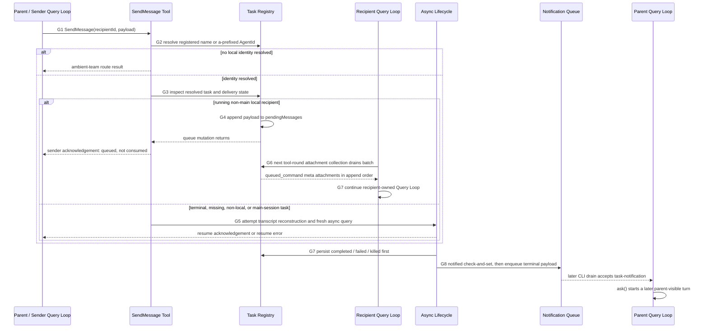

# Agent Communication / Result Return：消息如何跨越独立 Query Loop

Agent 之间交换的是**由明确 owner 持有、经队列或结果归一化复制的数据**，不是共享 conversational memory。发送成功、收件人模型可见、收件人行动、任务 terminal、父模型看到结果是五个不同边界；任何一个先发生，都不能替另外四个背书。



这张图把两条方向放在同一张 sequence 中：上半段先把 G2 identity failure 与 G3 resolved-task routing 分开，再展示 parent / sender 到 running non-main local recipient 的 `SendMessage`；下半段是 background child 的 compact reverse-result path。G5 不是 running path 的“即时唤醒”：running recipient 要等自己的下一次 attachment collection；resolved identity 的其他状态会尝试 reconstruction + fresh background query，而未解析出 local identity 的 plain string 才进入 ambient-team route。

## 1. G1-G8：每一步只跨一个边界

| 节点 | 当前 owner | 移动 / 复制事件 | 已跨过的成功边界 | 仍未证明 |
|---|---|---|---|---|
| G1 Sender Emits `SendMessage` or Requests Task Output | sender Query Loop | 产生结构化 Tool Intent | sender 已请求通信或读取 | recipient 存在、结果 terminal |
| G2 Resolve Recipient / Task Identity | `SendMessageTool` 或 `TaskOutputTool` | name registry 查找；否则 `toAgentId` 只接受 `a...` AgentId | 得到可寻址 identity；未解析的 plain string 才走 ambient-team route | delivery 已发生、task state 已验证 |
| G3 Validate Delivery State | routing tool + task registry snapshot | identity 已解析后检查 task：仅 running non-main local task 进入 queue，其余 resolved cases 尝试 resume | 选定 queue 或 resume attempt；poll / remote 仍是独立实现 | resume 一定成功、后续状态不会 race |
| G4 Queue Message or Read Output Snapshot | task registry / output store | append `pendingMessages`，或读取 retained task/output | send 被本地队列接受，或 poll 得到当下 snapshot | 模型消费、外部效果、notification 已送达 |
| G5 Wake / Resume Recipient if Applicable | resume adapter | resolved non-queue case 尝试 transcript / metadata reconstruction，并在成功时注册 fresh async task | resume 成功时该 identity 已重新调度；失败则返回 source-specific error | 旧 stack 恢复、从精确 instruction point 延续 |
| G6 Inject Pending Message at Recipient Turn Boundary | recipient attachment assembly | drain array，映射为 `queued_command` meta attachments | payload 已进入下一次 model-visible input 组装 | 模型一定执行、effect exactly once |
| G7 Recipient Produces New Output | recipient Query Loop / async lifecycle | 新 round 产生 messages，或 finalizer 归一化 terminal data | child 自己的 execution/result 边界推进 | parent 已看到它 |
| G8 Notify / Return Result to Requester | Agent Tool mapper、TaskOutput mapper、notification queue / drain | 生成 `tool_result` 或 later input | 某一条 parent-visible delivery path 完成 | 所有 consumer 同时、同 status 看见 |

判断任一通信问题时，固定问三句：**数据现在归谁？哪个事件移动或复制它？当前 acknowledgement 究竟确认了哪一层？**

## 2. Identity、channel 与 payload 不要混成一条总线

| channel | sender | recipient | identity key | payload shape | delivery timing | acknowledgement / result |
|---|---|---|---|---|---|---|
| local running `SendMessage` | parent 或其他能调用该 Tool 的 in-process loop | addressable、non-main local agent task | registered agent name -> `agentId`，或合法 raw `agentId` | plain string copied into `pendingMessages[]` | append 立即；模型可见要等 recipient 后续 attachment boundary | sender 得到 `success: true` + queued acknowledgement；不是 recipient action result |
| resolved-identity resume attempt | sender loop | terminal non-main local task，或 resolved ID 对应 missing / non-local / main-session task | name registry 或合法 `a...` raw `agentId` 已完成 G2 resolution | string 尝试成为 reconstructed transcript 后的新 user message | `resumeAgentBackground` 成功时 fresh async launch；缺 transcript 等情况返回 error | resume acknowledgement + output path，或 resume error；terminal result 仍稍后到达 |
| foreground direct terminal | parent `Agent` Tool call | 原调用中的 parent Query Loop | original tool-use ID + child `agentId` | finalized text blocks、usage、duration、tool count | parent Tool call 持续 blocked，child settle 后同一次返回 | ordinary `tool_result` Tool Observation |
| async launch | parent `Agent` Tool call | parent Query Loop | stable `agentId` | `async_launched` metadata + output path | task 注册与 lifecycle 调度后、terminal 前 | ordinary launch `tool_result`；只确认已启动 |
| terminal notification | async lifecycle | parent runtime，随后 parent model | task ID；可带 original tool-use ID | XML-like terminal payload：status、summary、result、usage、output/worktree metadata | terminal registry state 之后 enqueue；CLI later drain 后进入 `ask()` | later parent input；不是原 Agent Tool call 的 terminal Observation |
| explicit `TaskOutput` | parent Tool call | retained task / output store，再回 parent Query Loop | `task_id` | `retrieval_status` + task status/output/error | nonblocking snapshot，或 blocking 轮询至 terminal / timeout | ordinary `TaskOutput` `tool_result`; terminal retrieval marks `notified` |
| recipient pending-message attachment | task registry | recipient model | recipient `toolUseContext.agentId` | coordinator-origin `queued_command`, `prompt=msg`, `isMeta=true` | recipient 下一次 attachment collection | 无 sender-facing execution result；只是 recipient-directed model input |
| teammate / sibling team mailbox | team lead 或 teammate | named teammate / lead | teammate name + team name | mailbox record with `from`, text, summary, timestamp, color | mailbox implementation 的 inbox timing | “sent to inbox” acknowledgement；**不使用 local `pendingMessages`** |
| remote `bridge:` / `uds:` | local sender | remote session / UDS target | parsed peer address | plain text | peer/UDS transport 自己的 send semantics | transport-specific ok/error；**不共享 local registry queue** |

表中第一行只描述 source-confirmed 的 local task queue。它可以由 parent 发出，也可以由另一个有 root task-store channel 的 in-process loop 发出；但这不等于所有 child-to-parent、sibling、team 或 remote message 都复用同一数组。main-session 必须再分两种情况：普通 main-session ID 是 `s...`，不符合 `toAgentId` 接受的 `a...` 格式，若 name registry 也未命中，就在 G2 identity resolution 失败后进入 ambient-team route；若某个 identity 已解析到 main-session task，G3 的 non-main predicate 为 false，控制流进入同一个 `else` 尝试 `resumeAgentBackground` 并直接返回，而不是 fall through 到 `handleMessage`。

## 3. Walkthrough A：running local `SendMessage` 如何交付

### 3.1 Sender 先产生 Tool Intent

sender 的模型先输出 `SendMessage` Tool Intent，其中 plain string message 与 `to` 是数据，sender 的 Query Loop 仍拥有自己的 mutable history。Tool runtime 不拿 sender 的 history 引用去改 recipient prompt；它只处理一份结构化 input。

### 3.2 Resolve 与 validate 选择 local route

`SendMessageTool.call` 先从 `agentNameRegistry` 解析注册名；若没有命中，再用 `toAgentId` 尝试把 `to` 解释为合法、`a` 开头的 raw AgentId。只有 G2 得到 `agentId` 才读取 task：G3 中仅 **running + local agent + non-main-session** 进入 pending queue；terminal local task以及 missing / non-local / main-session task都进入同一个 resume `else`。没有解析出 `agentId` 的 plain string 才继续到 ambient-team `handleMessage`。

running 分支读取的是一个 task snapshot，然后调用 `queuePendingMessage`。因此这里的 state validation 是 route choice，不是跨 sender、registry 与 recipient loop 的事务锁。

### 3.3 Queue append 才是 sender-side success

`queuePendingMessage` 通过 task-store updater 构造：

```text
pendingMessages = [...oldPendingMessages, newMessage]
```

所以 source-confirmed ordering 只到这里：同一 registry 更新序列中的消息按 append 顺序保存在数组里。`SendMessageTool.call` 随后返回 “queued ... at its next tool round”。此时 delivery considered successful 的精确定义是：**runtime 已接受该 payload，并发起对 task-owned pending queue 的 append；sender 得到 queue acknowledgement。**

它不表示：

- recipient 当前 inference 被中断或即时唤醒；
- recipient model 已看见 message；
- recipient 已按 message 行动；
- recipient 的 Tool effects 成功；
- 消息具备 durable exactly-once processing。

### 3.4 Recipient 在下一轮边界 drain

recipient 自己的 Query Loop 每个 tool-loop iteration 会收集 attachments。`getAttachments` 包含 `getAgentPendingMessageAttachments`；该 helper 以 recipient 的 `toolUseContext.agentId` 调用 `drainPendingMessages`。

drain 的两个动作是：

1. 把当下 `pendingMessages` 数组引用保存为 drained batch；
2. 把 registry 中该数组替换成 `[]`，再将 batch 逐项映射为 coordinator-origin、`isMeta=true` 的 `queued_command` attachments。

随后 `getAttachmentMessages` 把 attachment 包装为 message，加入 recipient 下一次 model request 的 input。这里才跨过 **recipient model-visible boundary**；它仍然不是 model action acknowledgement。

### 3.5 Recipient 继续自己的 Query Loop

message 进入的是 recipient 后续 round 的 model-visible context，不是 sender 与 recipient 共用一块 mutable memory。recipient 之后如何回答、调用 Tool、失败或结束，都由 recipient Query Loop 和 task lifecycle 管理；sender-side send result 不会自动变成 recipient result channel。

## 4. Walkthrough B：stopped / evicted 不是 wake stack，而是 fresh resume

当被寻址的 local task 已是 `completed`、`failed` 或 `killed`，`SendMessageTool.call` 不把“completed recipient”一律拒绝；它尝试 `resumeAgentBackground`。当 name / raw ID 仍可解析、但 task record 已 eviction 时，也尝试从 disk transcript resume。

resume adapter 依次：

1. 读取 sidechain transcript 与 agent metadata；缺 transcript 就抛出精确的 resume failure。
2. 过滤 unresolved Tool uses、orphaned thinking-only messages 与 whitespace-only assistant messages。
3. 从可序列化 messages / replacements 重建 content replacement state。
4. best-effort 检查原 worktree；不存在就 fallback 到 parent cwd。
5. 按 metadata 恢复 agent type / fork variant，重组 Tool set 与 system prompt 条件。
6. 将 reconstructed messages 加上新 sender message，注册一个 fresh async task。
7. detached 启动 `runAsyncAgentLifecycle`，由新的 `runAgent` 创建新的 query execution。

因此 G5 的 “resume” 是 **reconstruction + new background query**。它不会恢复旧 generator、promise、controller、suspended Tool call 或 live call stack，也不保证从旧 instruction 的某个精确指令边界继续。

sender 此时得到的 success 只说明 fresh background execution 已被注册 / 调度并返回 output path。transcript persistence gap、过滤内容、worktree 缺失、replay 与重复外部效果仍需单独处理。

## 5. Walkthrough C：child completion 如何回到 parent

同一个 child result 有五种容易混淆的 parent / recipient-visible outcome：

| path | 谁先拥有 terminal / payload | 触发事件 | model-visible 形式 | 返回的是结果、状态还是 acknowledgement |
|---|---|---|---|---|
| foreground direct terminal result | `AgentTool.call` 的 message aggregation buffer | child iterator settle -> `finalizeAgentTool` -> Agent Tool mapper | 同一 blocked Tool call 的 ordinary `tool_result` Observation | normalized terminal result + usage；不是 child runtime |
| async launch acknowledgement | task registry + original Agent Tool mapper | `registerAsyncAgent` / lifecycle scheduling 后立即返回 | 原 Agent Tool call 的 ordinary launch `tool_result` | 仅 `async_launched` metadata；不是 terminal result |
| background terminal notification | registry 先存 terminal fact；notification helper 后持有 formatted payload | `notified` check-and-set -> global pending queue -> CLI drain -> `ask()` | later parent input / new turn；SDK consumer 可另得 system event | eventual terminal delivery attempt；不属于原 Tool call |
| explicit `TaskOutput` retrieval | retained task record + disk/in-memory output | nonblocking read，或 100ms polling wait 至 terminal / timeout | `TaskOutput` ordinary `tool_result` Observation | `success` 代表成功取得 terminal task；`not_ready` / `timeout` 只返回当前状态 |
| pending agent message attachment | recipient task pending queue，随后 attachment assembly | recipient 下一次 collection drains | recipient 的 `queued_command` meta attachment | recipient-directed input；既不是 parent terminal Observation，也不是 task status |

### 5.1 Foreground：同一次 Tool call 直接返回

foreground path 收集 child messages 后，`finalizeAgentTool` 只提取最后 assistant text（必要时向前找有 text 的 assistant message）、usage、duration 与 Tool count，形成 `AgentToolResult`。Agent Tool mapper 再把 completed data 映射成 ordinary `tool_result`。

parent 被阻塞的是一个 Tool call，不是共享 child stack。跨回 parent 的是 normalized content 与 metadata 副本；child iterator、controller、context、cache、mutable messages array 都不会穿过边界。

### 5.2 Async：launch 与 terminal delivery 拆开

async-from-start 先把稳定 ID 和 running task 注册好，再让原 Agent Tool call 返回 `async_launched` Observation。child terminal 时，async lifecycle 先写 `completed` / `failed` / `killed` 与 result/error，之后才做 classification、worktree cleanup 和 notification enqueue。

这意味着 parent 有两条 later read path：

- 主动 `TaskOutput`：直接读取 retained task/output；
- 被动 terminal notification：等待 check-and-set、queue enqueue、consumer drain 和 later `ask()`。

它们都复制数据，不会“回收”或恢复 child live execution object。

### 5.3 `TaskOutput`：retrieval success 不等于 task completed

nonblocking poll 遇到 `running` / `pending` 返回 `retrieval_status=not_ready`；blocking poll 每 100ms 观察一次，直到 terminal、timeout 或 abort。terminal 可能是 completed、failed 或 killed，但 retrieval 都可以返回 `success`，因为这里的 success 指“成功取得 terminal task snapshot”。

timeout 不制造 terminal status，`not_ready` 也不代表 failed。terminal retrieval 会把 task 标成 `notified=true`，从而可能抑制尚未 enqueue 的 terminal notification。

## 6. Ordering、drain、duplication 与 race

### 6.1 Queue ordering 只保证 append batch 的相对顺序

`pendingMessages` 使用 immutable append，drain 返回整个当下数组，再清空 registry array；attachments 用 `map` 保留 drained batch 的数组顺序。这支持“同一 task queue 中已 append items 的相对顺序”。

源码没有在这个边界提供 message sequence number、durable log、receiver acknowledgement 或 effect ledger。因此不要升级为跨 process total order，也不要声称 model consumption / Tool effect exactly once。

### 6.2 Drain acknowledgement 与 sender acknowledgement 不同

有四个分开的时间点：

```text
sender Tool success
  -> registry pending array mutated
    -> recipient drains and clears batch
      -> next model request includes attachments
        -> model may act and Tool effects may occur
```

canonical local queue 没有 full / closed capacity branch；它就是 task record 上的数组。但“没有显式 full error”不等于 durable or lossless：task eviction、terminal race、process failure、drain 后 model request 失败都不由 sender acknowledgement 覆盖。

### 6.3 Repeated `TaskOutput` 读 retained state，不消费 child stack

terminal `TaskOutput` 不删除 task result，也不移动 iterator；重复调用会再次读取仍保留的 task / output snapshot，并再次把 `notified` 写为 true。可重复读取与 notification de-duplication 是两件事：前者由 retained record 决定，后者由 `notified` guard 决定。

### 6.4 `notified` 是 delivery guard，不是 terminal transition

`enqueueAgentNotification` 对 task record 做 check-and-set：已经 notified 就不 enqueue；否则先写 `notified=true`，再格式化并 push `mode=task-notification` 的 global queue item。`TaskOutput` terminal retrieval 也会写同一 flag。

所以 race 结果是：

- `TaskOutput` 先写 notified：later notification enqueue 被抑制；
- notification helper 先 check-and-set：queue item 稍后由 consumer drain；后续 `TaskOutput` 仍可读取 retained result；
- notified once 只约束这条 terminal notification attempt，不证明 task execution 或外部 effect exactly once。

### 6.5 Terminal status 与 notification 可能分叉

async lifecycle 的 source-confirmed 顺序是 terminal registry transition 在前，classification / worktree cleanup 与 enqueue 在后。`TaskOutput` 因此可能先看到 terminal。

更微妙的是：`completeAgentTask` 写入 completed 后，后续 classification / cleanup 仍在同一个 `try`。若它们抛错，catch 会尝试 fail / kill；helper 因 record 已非 running 而 no-op，但 catch 仍可能构造 failed / killed notification payload。于是 registry / `TaskOutput` 可以是 completed，而 later notification 报告另一个 status；若 poll 更早写 notified，这个矛盾 payload 又会被抑制。

### 6.6 Message 与 completion racing 没有原子承诺

running validation、queue updater、recipient drain 与 terminal transition 分属不同事件。源码没有提供“send 与 completion”联合 transaction。因而只能说：

- 若 recipient 在后续 attachment boundary drain 到 batch，message 才进入 model-visible input；
- sender queued acknowledgement 不能证明 terminal 前一定 drain；
- terminal / eviction 后再次发送走 resume reconstruction，而不是唤醒旧 round；
- cancellation 只能停止未来执行，不能撤销已发送 message 或已发生 Tool effects。

这也是为什么 message payload 应尽量带幂等键、revision 或明确 effect boundary，而不能把 queue success 当业务 commit。

## 7. 两段边界伪代码

下面是 **Architectural interpretation**，用于压缩真实分支；名字不是源码中的统一 facade。

```text
deliverAgentMessage(sender, recipientId, payload) -> DeliveryResult:
    assert payload is a plain string for canonical local route

    if recipientId belongs to remote routing:
        return separatelyImplementedTransportResult

    resolvedId = resolveRegisteredNameOrRawAgentId(recipientId)

    if resolvedId exists:
        task = taskRegistry[resolvedId]
        if task is running local non-main:
            append task.pendingMessages with payload
            return AcceptedIntoPendingQueue
            // not ModelVisible, not ActedOn, not TerminalResult

        // terminal, missing, non-local, and main-session all enter this branch
        return reconstructTranscriptAndLaunchFreshAsync(resolvedId, payload)

    // A normal s-prefixed main-session ID fails raw AgentId resolution here.
    return separatelyImplementedAmbientTeamResult
```

```text
collectAgentResult(taskId) -> Pending | TerminalResult:
    task = readRetainedTask(taskId)
    if task missing:
        raise NoTaskFound

    if task.status in {running, pending}:
        return Pending(currentOutputSnapshot)       // or wait / timeout

    set task.notified = true                        // delivery de-dup guard
    return TerminalResult(
        retrievalStatus = success,
        taskStatus = task.status,                   // completed|failed|killed
        normalizedOrPersistedOutput = readOutput(task),
    )
```

## 8. 决定性源码镜头

以下 excerpt 都来自固定 snapshot `712b24f22a63eb6d1a2f86697bf6dbbaa39ae3cf`。excerpt 为教学压缩；链接给出 path + symbol 的完整固定提交上下文。

### Lens 1：local routing 的成功只到 queue append

**[Source-confirmed]** `src/tools/SendMessageTool/SendMessageTool.ts`，`SendMessageTool.call`：

```ts
if (isLocalAgentTask(task) && !isMainSessionTask(task)) {
  if (task.status === 'running') {
    queuePendingMessage(agentId, input.message, rootTaskSetter)
    return { data: { success: true, message: '...next tool round.' } }
  }
  return resumeAgentBackground({ agentId, prompt: input.message, ... })
} else {
  return resumeAgentBackground({ agentId, prompt: input.message, ... })
}
```

running non-main local 与其余 resolved-task cases 在这里分流。普通 main-session ID 由 `generateMainSessionTaskId` 产生 `s...`，而 `toAgentId` 只接受 `a...`；前者通常在 G2 未解析并进入 ambient route。若 identity 已解析到 main-session task，代码进入上面的 resume `else` 并 return，不会 fall through 到 `handleMessage`。[查看 identity / task routing](https://github.com/buoylee/Claude-Code-true/blob/712b24f22a63eb6d1a2f86697bf6dbbaa39ae3cf/src/tools/SendMessageTool/SendMessageTool.ts#L801-L887) · [查看 raw AgentId pattern](https://github.com/buoylee/Claude-Code-true/blob/712b24f22a63eb6d1a2f86697bf6dbbaa39ae3cf/src/types/ids.ts#L35-L44) · [查看 main-session ID prefix](https://github.com/buoylee/Claude-Code-true/blob/712b24f22a63eb6d1a2f86697bf6dbbaa39ae3cf/src/tasks/LocalMainSessionTask.ts#L75-L82) · [查看 main-session predicate](https://github.com/buoylee/Claude-Code-true/blob/712b24f22a63eb6d1a2f86697bf6dbbaa39ae3cf/src/tasks/LocalMainSessionTask.ts#L307-L322)。

### Lens 2：append 与 drain 是两个 task-store mutation

**[Source-confirmed]** `src/tasks/LocalAgentTask/LocalAgentTask.tsx`，`queuePendingMessage` / `drainPendingMessages`：

```ts
pendingMessages: [...task.pendingMessages, msg]

const drained = task.pendingMessages
pendingMessages: []
return drained
```

数组 append 顺序可见，但 drain 清空与 sender acknowledgement、model consumption 不是同一原子操作。[查看 pending-message append / drain](https://github.com/buoylee/Claude-Code-true/blob/712b24f22a63eb6d1a2f86697bf6dbbaa39ae3cf/src/tasks/LocalAgentTask/LocalAgentTask.tsx#L162-L192)。

### Lens 3：drained strings 在 recipient boundary 变成 meta attachments

**[Source-confirmed]** `src/utils/attachments.ts`，`getAttachments` / `getAgentPendingMessageAttachments`，以及 `src/query.ts`，`queryLoop`：

```ts
return drained.map(msg => ({
  type: 'queued_command',
  prompt: msg,
  origin: { kind: 'coordinator' },
  isMeta: true,
}))
```

`queryLoop` 每个 tool-loop iteration 调用 attachment pipeline，并把产生的 attachment message 加到下一次 query input；不是修改在途 inference。[查看 attachment registration](https://github.com/buoylee/Claude-Code-true/blob/712b24f22a63eb6d1a2f86697bf6dbbaa39ae3cf/src/utils/attachments.ts#L907-L918) · [查看 pending-message mapping](https://github.com/buoylee/Claude-Code-true/blob/712b24f22a63eb6d1a2f86697bf6dbbaa39ae3cf/src/utils/attachments.ts#L1085-L1101) · [查看 Query Loop attachment boundary](https://github.com/buoylee/Claude-Code-true/blob/712b24f22a63eb6d1a2f86697bf6dbbaa39ae3cf/src/query.ts#L1560-L1592)。

### Lens 4：resume 注册 fresh async lifecycle

**[Source-confirmed]** `src/tools/AgentTool/resumeAgent.ts`，`resumeAgentBackground`：

```ts
const resumedMessages = filterUnresolvedAndOrphaned(transcript.messages)
const task = registerAsyncAgent({ agentId, ... })
void runAsyncAgentLifecycle({
  taskId: task.agentId,
  makeStream: () => runAgent({ ...runAgentParams, isAsync: true }),
})
```

真正源码用多个具体 filter，并重建 replacement/worktree/agent metadata；这里压缩的重点是“serialized reconstruction -> fresh registration/query”。[查看完整 resume reconstruction](https://github.com/buoylee/Claude-Code-true/blob/712b24f22a63eb6d1a2f86697bf6dbbaa39ae3cf/src/tools/AgentTool/resumeAgent.ts#L42-L265)。

### Lens 5：`TaskOutput` 读 snapshot，并用 notified 参与 notification 去重

**[Source-confirmed]** `src/tools/TaskOutputTool/TaskOutputTool.tsx`，`TaskOutputTool.call`：

```ts
if (task.status === 'running' || task.status === 'pending') {
  return { retrieval_status: 'not_ready', task: await getTaskOutputData(task) }
}
updateTaskState(task_id, setAppState, t => ({ ...t, notified: true }))
return { retrieval_status: 'success', task: await getTaskOutputData(task) }
```

blocking variant 轮询并保留 timeout；result mapper 再把 retrieval/task status/output 变成普通 Tool Observation。[查看 poll / wait / mapper](https://github.com/buoylee/Claude-Code-true/blob/712b24f22a63eb6d1a2f86697bf6dbbaa39ae3cf/src/tools/TaskOutputTool/TaskOutputTool.tsx#L208-L308)。

### Lens 6：terminal notification 是 check-and-set 后的 later parent input

**[Source-confirmed]** `src/tasks/LocalAgentTask/LocalAgentTask.tsx`，`enqueueAgentNotification`；`src/utils/messageQueueManager.ts`，`enqueuePendingNotification`；`src/cli/print.ts`，`drainCommandQueue`：

```ts
if (task.notified) return task
shouldEnqueue = true
return { ...task, notified: true }

if (shouldEnqueue) enqueuePendingNotification({ value: message, mode: 'task-notification' })
```

CLI consumer 接受 `task-notification`，可产生 SDK system event，然后刻意不 `continue`，让 payload fall through 到 `ask()` 成为 later parent model input。这里只能证明已核对的 CLI drain；不能据此断言每个 UI / TUI consumer 都有完全相同 scheduling。[查看 notification guard / formatting](https://github.com/buoylee/Claude-Code-true/blob/712b24f22a63eb6d1a2f86697bf6dbbaa39ae3cf/src/tasks/LocalAgentTask/LocalAgentTask.tsx#L197-L262) · [查看 shared enqueue boundary](https://github.com/buoylee/Claude-Code-true/blob/712b24f22a63eb6d1a2f86697bf6dbbaa39ae3cf/src/utils/messageQueueManager.ts#L142-L149) · [查看 CLI drain / ask re-entry](https://github.com/buoylee/Claude-Code-true/blob/712b24f22a63eb6d1a2f86697bf6dbbaa39ae3cf/src/cli/print.ts#L1934-L2093)。

### Lens 7：foreground result 被 reduce 后才成为 Tool Observation

**[Source-confirmed]** `src/tools/AgentTool/agentToolUtils.ts`，`finalizeAgentTool`；`src/tools/AgentTool/AgentTool.tsx`，`mapToolResultToToolResultBlockParam`：

```ts
return { agentId, agentType, content, totalDurationMs, totalTokens, totalToolUseCount, usage }

return { tool_use_id: toolUseID, type: 'tool_result', content: normalizedContent }
```

parent 收到的是 final text / usage metadata，而非 child runtime object。[查看 result finalization](https://github.com/buoylee/Claude-Code-true/blob/712b24f22a63eb6d1a2f86697bf6dbbaa39ae3cf/src/tools/AgentTool/agentToolUtils.ts#L276-L357) · [查看 parent-facing mapper](https://github.com/buoylee/Claude-Code-true/blob/712b24f22a63eb6d1a2f86697bf6dbbaa39ae3cf/src/tools/AgentTool/AgentTool.tsx#L1298-L1379)。

## 9. Failure cases 与精确边界

| case | canonical local behavior | 不应说成什么 |
|---|---|---|
| empty / malformed address | validation 拒绝 empty target、含 `@` 的非 bare name，以及不支持的 structured cross-session payload | “所有字符串都会入 local queue” |
| unknown / unresolved local-looking recipient | name registry 未命中且不符合 `a...` raw AgentId 时，G2 不产生 local identity；plain string 才 fall through 到 ambient-team mailbox route，由该实现决定成功/错误 | “只要看起来像 task ID，就一定执行 G3” |
| raw/former agent ID but missing transcript | evicted resume 读取不到 transcript，返回 could-not-resume / may-have-been-cleaned-up error | “completed agent 永远不能发消息” |
| completed / failed / killed task still registered | 尝试 fresh background resume with message | “往 terminal record 的旧 stack 注入 prompt” |
| ordinary main-session ID | `s...` 不符合 `toAgentId` 的 `a...` pattern；若 name registry 也未命中，G2 失败后走 ambient-team route，`isMainSessionTask` 根本未执行 | “先被 non-main predicate 拒绝，再 fall through” |
| identity resolves to main-session task | G2 已得到 ID；G3 的 local non-main predicate 为 false，进入 `else` 尝试 `resumeAgentBackground` 并 return | “predicate 为 false 后继续到 `handleMessage`” |
| full / closed queue | canonical `pendingMessages` array 没有 source-confirmed capacity / closed branch | “有 backpressure / full-queue retry” |
| cancellation race | abort 可停止 future execution；已 enqueue、已 drain 或已发生 effects 不自动回滚 | “kill 会撤回消息和副作用” |
| repeated terminal output request | retained task 仍在时可重复读取；`notified` 继续为 true | “第一次 `TaskOutput` 消费并删除结果” |
| notification after terminal | status 先写、delivery 后做；poll 可更早，post-terminal error 还可让 payload status 分叉 | “notification 就是 terminal transaction 本身” |
| message arrives near completion | 没有联合原子保证；只有实际 drain 到 attachment 才证明 recipient model-visible | “send success 保证 child terminal 前处理” |

## 10. 设计取舍

### 10.1 Message passing 换来 isolation

每个 Query Loop 继续拥有自己的 mutable messages、Tool rounds、controller 与 cache。跨 Agent 只复制 string、attachment、normalized result 或 notification metadata，因此更容易推理 owner、权限与 cleanup，也避免一个 Agent 直接修改另一个 Agent 的 live history。

代价是 delivery semantics 变成显式系统问题：identity、queue retention、poll、wake/resume、duplicate effects 与 eventual visibility 都要分别治理。

### 10.2 Immediate acknowledgement 换来 responsiveness

running send 在 append 后立即 ack；async launch 在 task 调度后立即 ack；terminal notification 也不阻塞 terminal registry transition。sender / parent 可以继续工作，慢 recipient 不会把每次通信变成同步 RPC。

代价是 “accepted” 与 “processed” 分离。若业务需要强确认，必须让 recipient 产生显式 reply / result，并让 sender 以 task ID、correlation ID 或幂等 protocol 追踪；不能把 Tool success 文案当业务 ACK。

### 10.3 Poll 与 notification 共同提高可达性，也制造 race

`TaskOutput` 允许主动读取，notification 允许 eventual push。两者共享 `notified` guard 减少重复 parent prompts，却也意味着先 poll 可抑制 later notification；消费者要把 registry result 当 task fact，把 notification 当 delivery payload，而不是假设两者同步且 status 必然一致。

### 10.4 Resume 提高 addressability，不提供 stack continuity

transcript-addressable task 即使 state eviction 也能重新承接 message。代价是 reconstruction 只覆盖 persisted material；被过滤内容、缺失 metadata/worktree、重放和非幂等 Tool effect 都需要保守处理。

## 11. 必须守住的不变量与常见误解

1. **没有 shared conversational memory。** communication 跨的是 queue / attachment / normalized result，不是双方共同 mutation 的 model history。
2. **sender acknowledgement 只确认 sender-side boundary。** running local send 的 success 到 pending queue acceptance 为止。
3. **model-visible boundary 在 drain 之后。** `queued_command` attachment 进入 recipient next round，才算模型可见。
4. **drain 不是 processing ACK。** array 被清空不证明模型完成 action，也不提供 exactly-once Tool effect。
5. **resume 是 fresh query。** transcript / metadata 被重建；generator、promise、controller、live stack 不恢复。
6. **foreground result 是普通 Tool Observation。** finalizer 与 mapper 归一化数据；parent 不接收 child runtime。
7. **async launch 不等于 terminal。** `async_launched` 只确认 registry / scheduling boundary。
8. **terminal status 先于 notification。** poll 可先看到结果；notification 是 later delivery attempt。
9. **`notified` 是 de-dup guard。** 它不是 completed / failed / killed transition，也不删除 retained result。
10. **repeated poll 不消费 stack。** task 仍 retained 时可以再次读 snapshot。
11. **team / remote 是独立 route。** mailbox、bridge、UDS 不得描述为 local `pendingMessages` 的别名。
12. **没有 exactly-once illusion。** queue append、drain、model consumption 与 external effect 是四个 success boundary。

常见误解可直接这样校正：

**误解：`SendMessage` success 表示 child 已收到并处理。**

校正：running local path 只表示 message 已被接受到 task pending queue；child 要到后续 attachment collection 才 model-visible，行动结果还要再走自己的 Query Loop / result path。

**误解：给 stopped agent 发消息会唤醒原来的暂停点。**

校正：runtime 从 transcript / metadata 重建 prompt state，注册 fresh async task，启动 new query；旧 call stack 不存在可供恢复。

**误解：notification 与 `TaskOutput` 是同一份一次性结果。**

校正：两者都可表达 terminal data，但 path 不同。`TaskOutput` 读 retained record 并可重复；notification 经 check-and-set 与 queue later delivery，只尝试避免重复 parent prompt。

**误解：child result 回 parent 就把 child history merge 进 parent memory。**

校正：foreground mapper 返回 normalized text/usage；background notification / TaskOutput 也只返回格式化数据。父 history 增长的是 Observation 或 later input，不是 child mutable history 本体。

## 12. 面试回答

如果面试官问“Claude Code 的 parent / subagent 如何通信、结果怎样返回”，可以这样回答：

> 核心不是 shared memory，而是 queued boundary crossing。对 running local child，`SendMessageTool.call` 先用 registered name 或 raw agent ID 找到 non-main local task，检查 running 后把 plain string append 到 task-owned `pendingMessages`；此时 sender success 只代表 accepted into queue。recipient 自己的 Query Loop 到下一次 attachment collection 才 drain 整批消息、清空数组，并映射为 coordinator-origin `queued_command` meta attachments，因此 queue ACK、model-visible、model action 与 Tool effect 是四个边界。terminal 或 state-evicted agent 不恢复旧 stack，而是读 transcript / metadata、过滤 unresolved/orphaned content、重建 state、注册 fresh async task 并启动 new query。结果返回也有多条协议：foreground 由 `finalizeAgentTool` reduce child messages，再经 mapper 作为原 Agent Tool call 的 ordinary `tool_result`；async 先返回 `async_launched`，terminal status 后续先写 registry，parent 可以用 `TaskOutput` poll/wait，也可以等 terminal notification 经 `notified` check-and-set、global queue 和 CLI `ask()` 进入 later turn。`TaskOutput` terminal retrieval 会标 notified，但不删除 retained result；它可能比 notification 更早观察 terminal，并抑制后者。因为 completion 后的 cleanup 仍可能抛错，registry status 与 notification payload status 甚至可能分叉。整个系统保证的是明确 owner 与交付边界，不是 exactly-once processing，也没有 child runtime object 跨回 parent。

继续追问时，把 success boundary 写成：

```text
accepted into queue
  != drained into attachment
  != visible to recipient model
  != acted on
  != terminal result visible to requester
```

这五层能立即拆开多数 “message lost”“child 没回应”“notification 重复” 的诊断。

## 13. 阅读衔接与 fork / cache 交接

如果 foreground/background 的 registration、terminal ordering、restart 与 result timing 还不清楚，先回到 [上一篇：Foreground / Background Lifecycle](./02-foreground-background-lifecycle.md)。本文接手其中的 communication / delivery 边界：local pending queue、resume、`TaskOutput`、notification drain 与 parent re-entry。

下一篇 fork/cache 文章尚未创建，先用纯文本交接它必须回答的问题：

```text
fork mode wants to reuse parent context efficiently
  -> which parent messages / system-prompt prefix are copied or reconstructed?
  -> which cache-safe prefix metadata can be reused without sharing mutable history?
  -> where does child identity and isolated ToolUseContext begin?
  -> how are placeholder tool results / filtered messages kept structurally valid?
  -> when child terminal data rejoins the same normalized result and delivery paths?
```

由此留下下一问：**fork mode 如何高效复用 parent context 与 prompt-cache prefix，同时仍让 child 保持独立 identity、mutable state 与 Query Loop？**
