# Fork / Prompt Cache：复用前缀，按 Mode 划分 Runtime Ownership

[← 上一篇：Agent Communication / Result Return](03-communication-and-result-return.md) · [返回 Part 04 总览](README.md)

## 1. 先守住不变量：fork 是 D2 / D3 的优化分支

上一篇 [Agent Communication / Result Return](./03-communication-and-result-return.md) 留下的问题是：父 Agent 已经拥有一段很长的 system prompt、Tool schemas 与 conversation prefix，启动 child 时能否复用这些输入，同时仍保持 child isolation？

答案是：**可以复用 selected prefix-sensitive material，但不能把 child 概括成共享整套 parent mutable runtime。** 两种 execution mode 都有 cloned/fresh child core state；async 另有 task-owned lifecycle state，global-disable sync 则显式复用 parent 的 `abortController`、`setAppState` 与 `localDenialTracking`。

Claude Code 的 implicit fork 不是 process clone、session clone，也不是另一套 agent framework。它只是 `AgentTool.call` 在 D2 route / D3 context construction 处选择的一条优化分支：让 system prompt、Tool schemas、model / thinking configuration 与 selected parent messages 尽量保持 prefix-compatible；然后构造 child context，其中 core state fresh/cloned、少数 runtime references 依 execution mode 显式 shared，再进入既有 D4 `query()` / `queryLoop()`，最后经正常 Agent result contract 回到 D7 / D8。

下面的图是 **Architectural interpretation**。K1-K6 是 fork-specific preparation；K7 就是已有 D4 child Query Loop；K8 不是新协议，而是根据实际 execution mode 重新接入 D7 result normalization / delivery 与 D8 parent continuation。

```mermaid
flowchart LR
    D2[D2 AgentTool resolves route] --> K1[K1 Parent Context Candidate]
    K1 --> K2[K2 Fork Eligibility and Recursion Gate]
    K2 -->|eligible implicit fork| K3[K3 Select Cache-safe / Shareable Prefix]
    K2 -->|explicit type or gate off| D3[D3 Ordinary child-context construction]
    K3 --> K4[K4 Build Forked Child Messages]
    K4 --> K5[K5 Add Child-specific Prompt and Isolation Notice]
    K5 --> K6[K6 Create Fresh Child Runtime State]
    K6 --> KM{shouldRunAsync?}
    KM -->|yes| KA[Async: task controller and record<br/>no-op broad setAppState; fresh denial and pending queue]
    KM -->|no, global background disabled| KS[Sync: exact parent controller, setAppState and denial<br/>no Agent task record or pendingMessages]
    D3 --> D4[D4 Child Query Loop]
    KA --> K7[K7 Run Normal Child Query Loop / D4]
    KS --> K7
    K7 --> K8[K8 Normal Task Result Contract / D7]
    D4 --> D7[D7 Normalize child result]
    K8 --> D7
    D7 --> D8[D8 Parent Query Loop continues]
    D8 --> A7[A7 Tool Observation enters parent history]
    A7 --> A8[A8 Parent chooses next action]
```



| local node | owner | 发生什么 | 明确不发生什么 |
|---|---|---|---|
| K1 Parent Context Candidate | parent runtime / `AgentTool.call` | 取得已渲染 system prompt、parent messages、当前 assistant message、Tool array 与 request options | 还没有 child Query Loop |
| K2 Fork Eligibility and Recursion Gate | `AgentTool.call` | 检查 feature/session/coordinator 条件、explicit type 与 nested-fork guard | `FORK_AGENT` 本身不是 recursion guard |
| K3 Select Cache-safe / Shareable Prefix | fork adapter | 选择对 API prefix 有影响的 system、tools、model、thinking 与 history material | 不把整个 parent `ToolUseContext` 当共享 heap |
| K4 Build Forked Child Messages | `buildForkedMessages` + `runAgent` | clone current assistant message，补齐全部 tool results，并把 selected history 与 prompt messages 组装成新 array | 不修改 parent messages array |
| K5 Add Child-specific Prompt and Isolation Notice | fork adapter | 把 directive 放在 identical placeholders 之后；实际创建 worktree 时再追加 notice | notice 本身不创建 filesystem isolation |
| K6 Create Fresh Child Runtime State | `runAgent` / `createSubagentContext` / optional task registry | 两种 mode 都 clone file/replacement state并新建 child identity、query tracking、per-child Sets；async 新建 task-owned controller/record/denial/pending queue，sync 显式复用 parent controller、`setAppState`、`localDenialTracking` 且无 Agent task record | “fresh”不表示每个 reference 都 child-owned；必须按 mode / field 说明 |
| K7 Run Normal Child Query Loop | existing D4 | 调用普通 `query()` / `queryLoop()` | 不进入 fork 专用推理引擎 |
| K8 Return Through Normal Task Result Contract | existing D7 / D8 | async 时经 task registry + notification / `TaskOutput`；background 被全局禁用时，parent 等待并从原 Agent Tool call 直接取得 terminal result | 不把 child context object 返回 parent |

## 2. Reuse / transformation / isolation matrix

看 fork 时，不能只问“是否 shared”。必须指出 crossing semantic：**verbatim prefix material、transformed copy、explicit shared channel，还是 fresh child state。**

| parent artifact | reused verbatim | transformed | omitted | fresh child equivalent | cache implication | safety reason |
|---|---|---|---|---|---|---|
| rendered parent system prompt | `renderedSystemPrompt` 可用时复用已渲染 bytes | 缺失时重新 build；feature state 变化可令 bytes 不同 | 不使用 synthetic `FORK_AGENT.getSystemPrompt()` | child request 持有选中的 `SystemPrompt` 输入 | byte-exact 版本最利于 prefix reuse；fallback 可能 miss | model instructions 可继承，但构造过程不等于共享 parent runtime |
| parent message prefix / history | selected message objects 作为模型输入 material 被带入 | `filterIncompleteToolCalls` 先过滤；再用新 `initialMessages` array 拼接 | incomplete tool-call material 可被过滤 | child Query Loop owns its evolving message array | 相同早期 messages 才有 prefix opportunity | 新 array 避免 child append 改写 parent history；不要声称 deep-clone 整段 session |
| current assistant message | text / thinking / 所有 `tool_use` content 保持一致 | object、message、content array 被结构 clone，并生成新 UUID | 无 `tool_use` 时无法构造完整 pairing，只返回 directive user message | cloned assistant entry | sibling fork 的 assistant wire content 可保持对齐 | 避免修改原 assistant object，并保留完整 Tool pairing context |
| placeholder `tool_result` blocks | sibling forks 使用相同 placeholder text 与相同 tool-use ordering | 每次为每个 `tool_use` 新建 block，引用对应 ID | 不省略同一 assistant message 中的其他 tool uses | one newly built user message | dynamic directive 前的结构尽量 identical | 保证 Tool protocol pairing，不把 sibling-specific result 提前放进 shared prefix |
| per-child directive | 否 | 包进 fork boilerplate，作为 placeholder blocks 后的最后 text block | 不放进 stable sibling prefix 之前 | child-specific instruction suffix | 从这里开始自然发生 divergence | 每个 child 只得到自己的 task intent |
| fork + worktree notice | 否 | 用 parent cwd 与实际 worktree cwd 构造 later user message | 没创建 worktree 时完全省略 | child-specific filesystem guidance | 放在 directive 后，不能算 sibling-stable prefix | 提醒 path translation / stale text；不冒充隔离机制 |
| system / user / system context bundle | 已渲染 system 可 byte-exact；generic utility 可直接消费 `CacheSafeParams` | normal child construction 可能重新解析 context；AgentTool fork 用 override 保持关键 system 输入 | 与 child 无关的 UI state 不进入 model prefix | child request 的 context values | 它们都是 prefix-sensitive inputs | `CacheSafeParams` 只是输入契约，不授予 mutation ownership |
| parent exact Tool array and schema order | `availableTools` 传 parent Tool array，`useExactTools=true` 保留 resolved ordering | API 层仍会做正常 schema serialization / provider normalization | 不用普通 worker `resolveAgentTools` 结果替换 exact pool | child `agentOptions.tools` / executor | Tool definition 任一差异都可能提前打断 prefix | Tool definition 可保留；permission decision 与 mutable executor state仍在 child boundary |
| model / thinking / noninteractive configuration | fork model 继承；exact-tools path 继承 thinking 与 noninteractive setting | downstream request normalization 仍可能调整 provider parameters | 不采用普通 subagent 默认 disabled-thinking 分支 | child-owned options object | model / thinking 差异会改变 request prefix | 配置对齐不等于共享 inference、token counters 或 loop state |
| Permission / broad AppState runtime | sync path 精确复用 parent `setAppState` 与 `localDenialTracking`；两种 mode 都保留明确的 task/metrics/attribution channels | `getAppState` 仍经 agent wrapper；async 的 broad `setAppState` 为 no-op并创建 local denial state | UI callbacks 两种 mode 都被移除；async 不继承 parent broad AppState mutation callback | child `ToolUseContext`；async fresh denial，sync shared parent denial reference | 不应作为 cache prefix 论证 | sync 可经 shared setter / denial state影响 parent runtime；这不是共享整个 context或模型 history |
| file / replacement / per-child Sets / query state | 否 | read-file 与 content-replacement state 在两种 mode 都 clone；后者保留 decisions 以减少 wire divergence | parent live query chain 不继承 | fresh attachment/skill Sets、child agent/query identity与new query chain | cloned replacement decisions 可帮助 wire prefix 一致，但不保证 hit | 这些 child mutation不会回写 parent cache / Sets / tracking chain；denial state另见 mode-specific row |
| task / agent identity | 否 | `AgentTool.call` 先生成 stable child ID，再作为 override 传入 | parent identity 不冒充 child；global-disable sync 不创建 foreground `LocalAgentTask` record | 两种 mode 都有 child `agentId` / query chain；只有 async 有 task record | 不属于 reusable prompt prefix | async addressability/notification由 task record提供；sync direct result不伪造 task lifecycle |
| AbortController / lifecycle state | global-disable sync fork 精确复用 `toolUseContext.abortController` reference | async path把 task-owned controller显式交给 child | sync 无 async controller / task record；async 不复用 parent live controller | async 有 separately owned controller + running/terminal task state；sync 由原 Tool call等待并随 parent cancellation | 与 prompt cache 无关 | controller ownership 随 mode变化；两条路都不返回 child context object |
| pending messages / notifications / dynamic attachments | selected history 中已序列化的 attachment text可作为普通输入 material | future dynamic attachments仍在 child turn boundary收集 | parent live queues不复制；global-disable sync 无 Agent task record，因此无 task-owned `pendingMessages` / terminal notification queue item | async task record含 fresh pending queue并走 terminal notification；sync 只有普通 child attachment pipeline与direct result | dynamic suffix/attachments可能让后续 turns diverge | queued Agent communication是 async task capability；不能给无 record 的 sync fork虚构 queue |
| cwd / filesystem state | 同一 repository 的 committed base可相同 | worktree route创建另一 working copy；notice要求转换 inherited absolute paths | parent later/uncommitted edits不会自动同步 | worktree cwd，或未隔离时的实际 process cwd | filesystem 不属于 provider prompt cache | logical context、runtime ownership、physical workspace 是三条不同轴 |

这张表有一个刻意的“不对称”：某些 config object 或 message object 可以作为 immutable input 被引用，但 parent 与 child **不会共同拥有一个可增长的 mutable history**。是否 deep copy 每个嵌套值不是主要契约；主要契约是 child 用新 `initialMessages` array 和新 context 运行，mutation owner 已经改变。

## 3. Canonical walkthrough：AgentTool implicit fork

### 3.1 K1 / K2：route 先决定是不是 fork

主线入口是 `AgentTool.call`，不是 generic `runForkedAgent`。

路由顺序如下：

1. `isForkSubagentEnabled()` 只有在 `FORK_SUBAGENT` feature 开启、非 coordinator、非 noninteractive session 时才返回 true。
2. `subagent_type` 显式给出时始终优先，进入 typed-agent route。
3. gate 开启且省略 `subagent_type` 时，`effectiveType` 才是 `undefined`，选择 implicit fork。
4. gate 关闭且省略 type 时，fallback 为 `general-purpose`，不是 fork。
5. fork child 再发 implicit fork 时，primary guard 检查 `options.querySource === agent:builtin:fork`；fallback 才扫描 fork boilerplate message。

`FORK_AGENT` 是 synthetic definition：`agentType=\"fork\"`、model inherit、permission mode bubble、exact-tool intent。它帮助 route / analytics / child configuration，但**不是** recursion guard。

### 3.2 K3-K5：把稳定 prefix 放前面，把 dynamic directive 放后面

假设 parent 当前一条 assistant message 同时发出两个 Agent Tool uses：

```text
parent model-visible input
  system: rendered parent system prompt
  tools:  [ToolA schema, ToolB schema, ..., Agent schema]
  model / thinking / noninteractive config
  history: [m1, m2, ..., mN]
  current assistant:
    [thinking?, text?, tool_use fork-A, tool_use fork-B]
```

对 fork-A，`buildForkedMessages` 与 `runAgent` 形成的 child shape 是：

```text
cache-aligned / shareable prefix candidate
  same rendered system prompt
  same Tool schema array and ordering
  same model + thinking configuration
  selected/filter-safe parent history
  cloned current assistant message:
    [thinking?, text?, tool_use fork-A, tool_use fork-B]
  one user message:
    tool_result(fork-A, identical placeholder)
    tool_result(fork-B, identical placeholder)

dynamic suffix begins
    text(<fork boilerplate> + directive-A)
  optional later user message(worktree notice for actual worktree-A)
```

fork-B 的结构相同，只把 final directive 换成 directive-B；如果创建了不同 worktree，later notice 也会不同。这里保留**所有** tool-use blocks，并为每个 block 创建 placeholder result，是为了同时满足 Tool protocol pairing 与 sibling prefix alignment。不能只留下“属于这个 child”的 tool use，否则 assistant content 与 placeholder ordering 会更早分叉。

这仍不承诺“cache boundary 一定精确落在 directive 前”。provider request transformation、system/tool serialization、normalization 与 marker placement共同决定实际 cache key。能确认的是：实现刻意把稳定输入排在 dynamic suffix 之前，以创造 prefix reuse 机会。

### 3.3 K6：core state fresh / cloned，shared channels 取决于 mode

prefix 准备完之后，`AgentTool.call` 仍调用普通 `runAgent`。`runAgent`：

1. 用 selected history 与 prompt messages 创建新的 `initialMessages` array；
2. exact-tools path 继承 Tool ordering、thinking 与 noninteractive configuration；
3. 根据 `shouldRunAsync` 选择 lifecycle：async 使用 task-owned controller；global-disable sync 精确复用 parent `toolUseContext.abortController`，由 parent Tool call 等待；
4. 调用 `createSubagentContext` clone read-file / replacement state，并在两种 mode 都建立 fresh per-child Sets、agent identity 与 query tracking；
5. mode-specific 地处理 mutable channels：async 的 broad `setAppState` 为 no-op、`localDenialTracking` fresh，并由 task record持有 fresh `pendingMessages`；sync 设 `shareSetAppState=true`，因此共享 parent `setAppState` 与 `localDenialTracking`，且 global-disable 跳过 foreground task registration，没有 Agent task record / task-owned pending queue；
6. 两种 mode 都移除 child UI callbacks，再用上述 context 调用普通 `query()`。

因此要分开三种 isolation：

```text
logical context reuse
  = selected model-visible prefix material remains compatible

child core state ownership
  = both modes clone file/replacement state and own fresh Sets,
    child identity, query tracking and evolving messages

mode-specific explicit channels
  = async owns task controller/record/fresh denial/pending queue;
    global-disable sync shares exact parent controller/setAppState/denial
    and has no Agent task record or task-owned pendingMessages

filesystem worktree isolation
  = optional separate working copy created before launch
```

任意一条都不能推出另外两条。复用文本不等于共享整套 runtime；core state fresh/cloned 也不排斥 sync path 显式共享三个 parent references；context ownership 不自动带来 separate filesystem；prompt notice 也不能创建 worktree。

### 3.4 K7 / K8：force-async 仍受 global disable gate 约束

`isForkSubagentEnabled()` 只检查 `FORK_SUBAGENT` feature、coordinator mode 与 noninteractive session；它**不检查** `CLAUDE_CODE_DISABLE_BACKGROUND_TASKS`。`AgentTool.call` 随后才把两者组合：

```text
forceAsync = isForkSubagentEnabled()
shouldRunAsync = (explicit background OR agent background OR coordinator
                  OR forceAsync OR other async-forcing modes)
                 AND NOT isBackgroundTasksDisabled
```

因此，在 background tasks 可用时，fork feature 的 `forceAsync` 会让**所有 Agent spawns**进入 async path，不只 implicit fork；这是为了统一 task-notification interaction model。可是 global background-disable 具有最终否决权：eligible implicit fork 仍然成立，prefix construction 也照常发生，但 `shouldRunAsync=false`，执行改走 synchronous path。

AgentTool implicit fork 因而有两种 parent-visible timing：

```text
background enabled（通常路径）
  original Agent Tool call
    -> async task registered
    -> ordinary tool_result carrying launch acknowledgement

  child K7 / D4 query settles later
    -> task registry stores terminal fact
    -> TaskOutput retrieval OR terminal notification / later parent turn
    -> D7 normalized data
    -> D8 / A7 / A8 parent continues

CLAUDE_CODE_DISABLE_BACKGROUND_TASKS=true
  original Agent Tool call remains pending
    -> no async task registration
    -> child K7 / D4 settles
    -> finalize terminal result in the same Agent Tool call
    -> D7 direct Tool Observation
    -> D8 / A7 / A8 parent continues
```

async launch acknowledgement 不是 terminal result；其 terminal payload 遵循上一篇定义的 registry / notification / `TaskOutput` 边界。global-disable sync path 则没有 `async_launched` acknowledgement，parent 等待同一次 Agent Tool call 的 direct terminal result。两条路径作为 result 跨回 parent 的都只是 normalized data；child `ToolUseContext`、controller、mutable messages array 不会被返回。sync 向下构造 child 时复用的三个 parent references，是另一方向的显式 runtime channel。

## 4. Prompt cache：明确的 API feature，非正确性依赖

### 4.1 Source-confirmed 的 API 行为

这份源码不是仅凭“相同 prompt 可能被 provider 优化”来猜 caching：request construction 会根据 `enablePromptCaching` 加入 `cache_control`；system blocks 与 selected message block都能带 ephemeral cache marker。response usage 又明确保留：

- `cache_read_input_tokens`：本次读取 cache 的 input token 数；
- `cache_creation_input_tokens`：本次创建 cache 的 input token 数。

这些 metrics 能在请求后观察 hit / creation；它们不能提前保证本次一定 hit。

### 4.2 `CacheSafeParams` 保证什么

`CacheSafeParams` 命名了 prefix-sensitive bundle：system prompt、user context、system context、含 Tool/model/options 的 `ToolUseContext`，以及 fork context messages。thinking configuration 另从 inherited options 取得。

它的正确读法是：

```text
CacheSafeParams
  = caller promises/receives a set of inputs suitable for prefix-compatible reuse
  != provider cache-hit receipt
  != whole parent mutable runtime ownership contract
  (ToolUseContext内的显式 references 仍由 execution mode决定 clone/fresh/share)
  != every isolation rule的来源
```

### 4.3 什么会打断 prefix reuse

- rendered system prompt 缺失后重新计算，bytes 因 feature/config state 变化而不同；
- Tool schema 内容或 ordering 改变；
- model、thinking configuration、noninteractive behavior 或 request betas 改变；
- parent history 被不同方式 filter / normalize / content-replace；
- current assistant content、placeholder ordering 或 dynamic suffix placement 不同；
- provider cache cold、expired、disabled 或 unavailable。

这些情况最多改变 latency、cost 或 input processing。**即使 cache miss，child 仍必须执行同一条 `query()`，产生相同语义 contract。** 若正确性依赖 cache hit，设计已经越过源码能证明的边界。

## 5. Recursion 与 worktree：两个独立 safety boundary

### 5.1 为什么保留 Agent schema，却在 routing 处拒绝 nested fork

fork child 保留 parent exact Tool array，包括 Agent Tool definition，因为删掉一个 schema 会改变 request prefix。代价是 child 看起来仍“拥有 Agent Tool”。因此 nested-fork prevention 不能靠从 Tool pool 移除 Agent，而在 `AgentTool.call` route time拒绝：

- primary：`querySource` 标记 `agent:builtin:fork`；
- fallback：`isInForkChild(messages)` 扫描 fork boilerplate tag。

`runAgent` 把 `querySource` 放入 exact-tools child options。message compaction 可以重写 history，却不会清掉这个 runtime option，所以 primary guard 比只扫消息更稳。

### 5.2 notice 不是 worktree

当 `isolation` resolve 为 `worktree` 时，`createAgentWorktree` 先创建 separate working copy；只有 creation 成功且 route 是 fork，才追加 `buildWorktreeNotice`。notice 负责解释 inherited text：

- parent absolute paths 应映射到 child worktree root；
- inherited file descriptions 可能 stale，编辑前要 re-read；
- child edits 位于 separate working copy。

物理边界来自 worktree creation，不来自 prompt。若没有 worktree，fork child 与 parent 可能面向同一 working copy；fresh `ToolUseContext` 并不会阻止 filesystem effects 相互可见。即使有 worktree，parent 的未提交或之后发生的变化也不会“因为共享 conversation context”自动同步到 child；具体可见内容由创建 worktree 时的 Git/base 状态决定。

## 6. 两条实现路线必须分开

### 6.1 主线：AgentTool implicit fork

```text
AgentTool.call
  -> route / recursion gate
  -> build parent-compatible system + messages + exact tools
  -> ordinary runAgent
  -> if background enabled: feature-forced async task lifecycle
     else: synchronous execution in the original Tool call
  -> normal async-later or sync-direct parent Observation boundary
```

这是本文 K1-K8 的 canonical spine。

### 6.2 辅助证据：generic `runForkedAgent`

`src/utils/forkedAgent.ts` 的 `runForkedAgent` 直接消费 `CacheSafeParams`，调用 `createSubagentContext`，再启动新的 `query()`；最后把 `messages + totalUsage` 返回 direct caller。memory / summary 等 non-AgentTool facilities 可使用这条 utility route。

它证明两个机制事实：cache-sensitive inputs 可以被打包重用；重用这些输入后仍创建 isolated child context 和 fresh query。但不能据此写成：

- `AgentTool.call` 直接调用 `runForkedAgent`；
- 所有 `runForkedAgent` caller 都注册 Agent task；
- generic utility result 一定经过 Agent notification / `TaskOutput`。

## 7. 伪代码：`buildForkedChild`

下面是机制伪代码，不是源码逐行转写：

```text
buildForkedChild(parentState, task):
  require FORK_SUBAGENT enabled
  require interactive and not coordinator
  require task.subagentType is omitted
  reject parentState.querySource == "agent:builtin:fork"
  reject fallbackBoilerplateScan(parentState.messages)

  cacheSafePrefix = {
    systemPrompt: parentState.renderedSystemPrompt
                  ?? recomputeWithPossibleByteDivergence(),
    history: filterIncompleteToolCalls(parentState.messages),
    tools: parentState.toolsInExactOrder,
    model: parentState.model,
    thinking: parentState.thinkingConfig,
  }

  clonedAssistant = cloneCurrentAssistant(allContentBlocks, newUUID)
  placeholders = everyToolUse(clonedAssistant)
                   .map(id => identicalToolResult(id))
  childMessages = cacheSafePrefix.history
                + clonedAssistant
                + user(placeholders + dynamicDirective(task))

  if actualWorktreeCreated:
    childMessages += user(worktreeNotice(parentCwd, childCwd))

  if shouldRunAsync:
    lifecycle = {
      abortController: asyncTaskController,
      shareSetAppState: false,
      localDenialTracking: fresh,
      agentTaskRecord: freshWithPendingMessages,
    }
  else:  // global background tasks disabled
    lifecycle = {
      abortController: parentState.toolContext.abortController,  // exact ref
      shareSetAppState: true,
      setAppState: parentState.toolContext.setAppState,          // exact ref
      localDenialTracking: parentState.toolContext.localDenialTracking,
      agentTaskRecord: none,
      pendingMessages: none,
    }

  childRuntime = createSubagentContext(parentState.toolContext, {
    messages: childMessages,
    exactToolsAndInheritedRequestOptions,
    childIdentity,
    clonedMutableCaches,
    freshPerChildSetsAndQueryTracking,
    lifecycle,
    noParentUIControl,
  })

  return { cacheSafePrefix, childMessages, childRuntime }

caller:
  run normal query(childMessages, childRuntime)
  return through normal Agent result contract:
    async-later when background is enabled
    sync-direct when background is globally disabled
```

## 8. 决定性源码镜头

本章 K1–K8 的 claim-oriented 证据表见 [Source Evidence Index](../appendices/source-evidence-index.md#53-k1k8-fork-prompt-cache-worktree)。

以下 excerpt 都来自固定 snapshot `712b24f22a63eb6d1a2f86697bf6dbbaa39ae3cf`。excerpt 为教学压缩；链接给出 repository-relative path、symbol 与固定 commit 上下文。

### Lens 1：route / gate 与 recursion guard

**[Source-confirmed]** `src/tools/AgentTool/AgentTool.tsx`，`AgentTool.call`；`src/tools/AgentTool/forkSubagent.ts`，`isForkSubagentEnabled`：

```ts
const effectiveType = subagent_type ??
  (isForkSubagentEnabled() ? undefined : GENERAL_PURPOSE_AGENT.agentType)
const isForkPath = effectiveType === undefined

if (isForkPath &&
    (toolUseContext.options.querySource === 'agent:builtin:fork' ||
     isInForkChild(toolUseContext.messages))) {
  throw new Error('Fork is not available inside a forked worker...')
}
```

gate 本身还拒绝 coordinator 与 noninteractive session；explicit `subagent_type` 胜出。[查看 AgentTool fork routing](https://github.com/buoylee/Claude-Code-true/blob/712b24f22a63eb6d1a2f86697bf6dbbaa39ae3cf/src/tools/AgentTool/AgentTool.tsx#L318-L356) · [查看 feature gate / synthetic definition / fallback scan](https://github.com/buoylee/Claude-Code-true/blob/712b24f22a63eb6d1a2f86697bf6dbbaa39ae3cf/src/tools/AgentTool/forkSubagent.ts#L32-L89)。

### Lens 2：message construction 把 dynamic directive 放在最后

**[Source-confirmed]** `src/tools/AgentTool/forkSubagent.ts`，`buildForkedMessages`：

```ts
const fullAssistantMessage = {
  ...assistantMessage,
  uuid: randomUUID(),
  message: { ...assistantMessage.message,
             content: [...assistantMessage.message.content] },
}
const toolResultBlocks = everyToolUse.map(block => identicalPlaceholder(block.id))
const toolResultMessage = user([...toolResultBlocks, childDirective])
return [fullAssistantMessage, toolResultMessage]
```

真正实现保留所有 content blocks，并对每个 `tool_use` 建 placeholder result。[查看 complete assistant clone / placeholder ordering](https://github.com/buoylee/Claude-Code-true/blob/712b24f22a63eb6d1a2f86697bf6dbbaa39ae3cf/src/tools/AgentTool/forkSubagent.ts#L107-L169)。

### Lens 3：exact prefix configuration 最后仍交给普通 `runAgent`

**[Source-confirmed]** `src/tools/AgentTool/AgentTool.tsx`，`AgentTool.call`；`src/tools/AgentTool/runAgent.ts`，`runAgent`：

```ts
runAgent({
  override: { systemPrompt: forkParentSystemPrompt },
  availableTools: toolUseContext.options.tools,
  forkContextMessages: toolUseContext.messages,
  useExactTools: true,
  ...
})

const resolvedTools = useExactTools ? availableTools : resolveAgentTools(...)
thinkingConfig = useExactTools ? parent.thinkingConfig : disabled

const forceAsync = isForkSubagentEnabled()
const shouldRunAsync = (... || forceAsync || ...)
  && !isBackgroundTasksDisabled
```

fork route 继承 rendered parent system、exact tools、model / thinking-related options；随后还是 ordinary `runAgent -> query`。`forceAsync` 只是 async 条件之一，最后还要通过 global background-disable gate；false 时进入同一 `AgentTool.call` 的 sync branch。[查看 prompt / exact-tools run params 与 execution-mode gate](https://github.com/buoylee/Claude-Code-true/blob/712b24f22a63eb6d1a2f86697bf6dbbaa39ae3cf/src/tools/AgentTool/AgentTool.tsx#L483-L765) · [查看 exact-tool options / child query entry](https://github.com/buoylee/Claude-Code-true/blob/712b24f22a63eb6d1a2f86697bf6dbbaa39ae3cf/src/tools/AgentTool/runAgent.ts#L667-L757)。

### Lens 4：`CacheSafeParams` 是 prefix-sensitive bundle

**[Source-confirmed]** `src/utils/forkedAgent.ts`，`CacheSafeParams`：

```ts
type CacheSafeParams = {
  systemPrompt
  userContext
  systemContext
  toolUseContext
  forkContextMessages
}
```

这个 type 没有 `cacheHit: true`，也没有直接声明 task record / `pendingMessages` fields；其中的 `ToolUseContext` 仍可能携带 callbacks/references，最终由 `runAgent` 与 `createSubagentContext` 按 mode 决定 clone、fresh 或 share。[查看 CacheSafeParams contract](https://github.com/buoylee/Claude-Code-true/blob/712b24f22a63eb6d1a2f86697bf6dbbaa39ae3cf/src/utils/forkedAgent.ts#L57-L68)。

### Lens 5：core state 与 mode-specific shared channels 分开构造

**[Source-confirmed]** `src/utils/forkedAgent.ts`，`createSubagentContext`：

```ts
readFileState: cloneFileStateCache(...),
contentReplacementState: cloneContentReplacementState(...),
nestedMemoryAttachmentTriggers: new Set(),
addNotification: undefined,
agentId: override.agentId ?? createAgentId(),
queryTracking: { chainId: randomUUID(), depth: parentDepth + 1 },

// runAgent
abortController: isAsync ? taskOrUnlinkedController : parent.abortController,
shareSetAppState: !isAsync,

// createSubagentContext
setAppState: shareSetAppState ? parent.setAppState : () => {},
localDenialTracking: shareSetAppState
  ? parent.localDenialTracking
  : createDenialTrackingState(),
```

global-disable sync path还跳过 `registerAgentForeground`，所以没有 `LocalAgentTask` record或其 `pendingMessages`。结论不是“所有字段 deep-clone”，而是 core child state与 mode-specific shared references 必须逐项列出。[查看 runAgent controller / shared-state selection](https://github.com/buoylee/Claude-Code-true/blob/712b24f22a63eb6d1a2f86697bf6dbbaa39ae3cf/src/tools/AgentTool/runAgent.ts#L520-L528) · [查看 runAgent context overrides](https://github.com/buoylee/Claude-Code-true/blob/712b24f22a63eb6d1a2f86697bf6dbbaa39ae3cf/src/tools/AgentTool/runAgent.ts#L697-L710) · [查看 child context clone / share branches](https://github.com/buoylee/Claude-Code-true/blob/712b24f22a63eb6d1a2f86697bf6dbbaa39ae3cf/src/utils/forkedAgent.ts#L365-L425) · [查看 global-disable skip registration](https://github.com/buoylee/Claude-Code-true/blob/712b24f22a63eb6d1a2f86697bf6dbbaa39ae3cf/src/tools/AgentTool/AgentTool.tsx#L808-L833)。

### Lens 6：prompt cache 是 request / response 可见 feature

**[Source-confirmed]** `src/services/api/claude.ts`，`getCacheControl`、`addCacheBreakpoints`、`updateUsage`：

```ts
cache_control: getCacheControl({ querySource })

cache_creation_input_tokens: partUsage.cache_creation_input_tokens
cache_read_input_tokens: partUsage.cache_read_input_tokens
```

API request construction conditional 地添加 ephemeral `cache_control`，usage 则记录 read / creation token counts。[查看 cache-control construction](https://github.com/buoylee/Claude-Code-true/blob/712b24f22a63eb6d1a2f86697bf6dbbaa39ae3cf/src/services/api/claude.ts#L588-L674) · [查看 request cache breakpoint](https://github.com/buoylee/Claude-Code-true/blob/712b24f22a63eb6d1a2f86697bf6dbbaa39ae3cf/src/services/api/claude.ts#L3063-L3110) · [查看 cache usage accounting](https://github.com/buoylee/Claude-Code-true/blob/712b24f22a63eb6d1a2f86697bf6dbbaa39ae3cf/src/services/api/claude.ts#L2919-L2987)。

### Lens 7：worktree 先创建，notice 后注入

**[Source-confirmed]** `src/tools/AgentTool/AgentTool.tsx`，`AgentTool.call`；`src/tools/AgentTool/forkSubagent.ts`，`buildWorktreeNotice`：

```ts
if (effectiveIsolation === 'worktree') {
  worktreeInfo = await createAgentWorktree(slug)
}
if (isForkPath && worktreeInfo) {
  promptMessages.push(user(buildWorktreeNotice(parentCwd, worktreeCwd)))
}
```

顺序证明 notice 是 explanation suffix，实际 separate working copy 由 creation helper 提供。[查看 worktree creation / notice injection](https://github.com/buoylee/Claude-Code-true/blob/712b24f22a63eb6d1a2f86697bf6dbbaa39ae3cf/src/tools/AgentTool/AgentTool.tsx#L579-L601) · [查看 notice content](https://github.com/buoylee/Claude-Code-true/blob/712b24f22a63eb6d1a2f86697bf6dbbaa39ae3cf/src/tools/AgentTool/forkSubagent.ts#L205-L210)。

### Lens 8：generic utility 另起 fresh query，并只返回 data

**[Source-confirmed]** `src/utils/forkedAgent.ts`，`runForkedAgent`：

```ts
const isolatedToolUseContext = createSubagentContext(toolUseContext, overrides)
const initialMessages = [...forkContextMessages, ...promptMessages]
for await (const message of query({ ..., toolUseContext: isolatedToolUseContext })) {
  outputMessages.push(message)
}
return { messages: outputMessages, totalUsage }
```

这是 generic helper，不是 AgentTool implicit fork 的 call target。[查看 runForkedAgent isolated query / return](https://github.com/buoylee/Claude-Code-true/blob/712b24f22a63eb6d1a2f86697bf6dbbaa39ae3cf/src/utils/forkedAgent.ts#L489-L626)。

## 9. Failure cases 与 trade-offs

| case | source-grounded outcome | trade-off / diagnostic question |
|---|---|---|
| gate off / coordinator / noninteractive | implicit fork route不可选；omitted type fallback 或 feature gate返回 false | 是不 eligible，还是 cache miss？两者层级不同 |
| explicit `subagent_type` | explicit route优先，正常 typed child | 不要把任何 Agent call 都称为 fork |
| nested implicit fork | route-time error；primary `querySource` guard，fallback boilerplate scan | 保留 Agent schema换来 prefix compatibility，也要求显式 recursion guard |
| current assistant 没有 `tool_use` | builder记录异常并退化为 directive-only user message | pairing shape与 sibling prefix机会下降，但不应伪造 tool result |
| oversized inherited context | child仍需处理 selected history，可能触发 compaction / context limit压力 | reuse减少重复输入处理的机会，不减少语义 context size本身 |
| stale contextual assumptions | inherited text只是 snapshot；worktree notice要求 re-read | cache-friendly不等于 information fresh |
| cache miss / expiry / disabled | 正常 child query照常运行，usage反映 read/create变化 | latency/cost变化，correctness contract不变 |
| recomputed system / Tool / thinking divergence | prefix可能更早失配 | 先比较 request-sensitive inputs，不要先怀疑 child isolation |
| worktree creation mismatch / unavailable | 不能仅靠 notice宣称 separate filesystem | 检查实际 worktree path与创建结果，而非 prompt wording |
| no worktree | logical/runtime isolation仍可成立，但 filesystem可能共享 | child edits与 parent effects可能互相可见 |
| parent later/uncommitted changes | 不会由 inherited conversation自动同步进 child worktree | re-read实际 child files，区分文本快照与磁盘状态 |
| generic utility caller | direct caller得到 messages/usage；是否有其他 lifecycle由 caller决定 | 不自动套用 Agent registry / notification协议 |

核心取舍有三组：

1. **reuse efficiency vs context leakage**：更多 parent history提高连续性与 prefix机会，也把更多可能无关或 stale 的上下文带给 child。
2. **schema compatibility vs local capability simplicity**：保留 exact Agent schema有利于 prefix alignment，却必须在 route处阻止 recursive fork。
3. **semantic isolation vs physical resource sharing**：separate context让 state ownership可推理，但 model provider、process、repository甚至 working copy仍可能共享物理资源；只有显式 worktree route提供这里讨论的 separate working copy。

## 10. 必须守住的不变量与常见误解

1. **fork 是 D2 / D3 variant。** K7 重用 D4，K8 重用 D7 / D8；没有第二套 agent runtime。
2. **AgentTool implicit fork 与 generic `runForkedAgent` 不同。** 前者调用 ordinary `runAgent`，再按 global background gate 进入 async-later 或 sync-direct Agent result contract；后者为 direct caller返回 messages/usage。
3. **`FORK_SUBAGENT` 是 gate，`FORK_AGENT` 是 synthetic definition。** 两者不能互换。
4. **recursion guard 主要依赖 `querySource`。** boilerplate scan只是 fallback；保留 Agent Tool schema不表示允许 nested fork。
5. **cache-safe 不等于 cache-hit。** request有显式 caching feature、response有usage metrics，但 hit仍取决于实际 prefix与provider状态。
6. **cache miss 不改变语义。** child仍进入普通 Query Loop；正确性不能依赖省下了多少 input tokens。
7. **message reuse不是 mutable history sharing。** selected history进入新 initial array；child拥有自己的 evolving loop state。
8. **fresh 不等于所有字段从零开始或都由 child 独占。** 两种 mode 都 clone read/replacement state并创建 fresh Sets / identity / query tracking；async 拥有 task controller/record/fresh denial/pending queue，而 global-disable sync 精确共享 parent controller、`setAppState`、`localDenialTracking`，且没有 Agent task record / `pendingMessages`。
9. **worktree notice不是 isolation。** worktree creation才创建 separate working copy；notice只解释路径与staleness。
10. **feature mode 的 force-async 受 global disable 最终否决。** background 可用时它影响所有 Agent spawns；`CLAUDE_CODE_DISABLE_BACKGROUND_TASKS=true` 时 eligible fork 仍走 sync，不产生 async task。
11. **async launch Observation不是 terminal result，但 sync fork 没有 launch Observation。** async K8 的 terminal data稍后经 registry + `TaskOutput` / notification回到 D7 / D8；global-disable sync K8 在同一次 Agent Tool call 直接返回 terminal result。
12. **filesystem isolation与prompt cache正交。** prefix完全命中也不说明 files隔离；cache完全 miss也不破坏 worktree。

## 11. 面试回答

如果面试官问“Claude Code 的 fork subagent 与 prompt cache 是怎么配合的”，可以这样回答：

> Fork 不是 clone 整个 session，而是 AgentTool 在 route / child-context construction 上的一条优化分支。`FORK_SUBAGENT` gate开启、interactive且非 coordinator，并且调用省略 `subagent_type` 时，AgentTool才选择 synthetic `FORK_AGENT`；explicit type优先。它尽量复用已经rendered的parent system prompt bytes，传parent exact Tool array与ordering，继承model、thinking和noninteractive配置，再把selected parent history与当前assistant message组成child input。当前assistant会结构clone并换UUID，所有tool-use blocks都会保留；随后为每个tool use创建内容相同的placeholder result，最后才追加per-child directive，实际创建worktree时再追加child-specific notice。这样把稳定输入放在dynamic suffix前，给provider prompt cache创造prefix reuse机会。源码会显式加入`cache_control`，也会记录`cache_read_input_tokens`与`cache_creation_input_tokens`，所以cache是API feature；但`CacheSafeParams`只描述prefix-sensitive inputs，不保证hit。即使cache cold、expired或prefix byte-divergent，child仍运行同一个`query()`，只影响成本和延迟，不能影响正确性。与此同时，两种mode都clone file/replacement state并创建fresh per-child Sets、agent/query identity与evolving messages；async使用task-owned controller/record、fresh local denial和pending queue，broad `setAppState`为no-op；global-disable sync则精确复用parent `abortController`、`setAppState`、`localDenialTracking`，并跳过foreground `LocalAgentTask` registration，所以没有task-owned `pendingMessages`。因此logical prefix reuse不等于共享整套runtime，fresh/cloned core也不等于每个reference都child-owned。nested fork主要由`querySource=agent:builtin:fork`在AgentTool routing处拒绝，message boilerplate scan只是fallback。worktree也是独立轴：先真正创建separate working copy，再注入path/stale notice；prompt本身不产生隔离。最后AgentTool fork仍经ordinary `runAgent`与normal Agent result boundary：background可用时，fork feature通常令所有Agent spawns进入async，先返回`async_launched`，terminal data再通过`TaskOutput`或notification回到D7/D8；但`CLAUDE_CODE_DISABLE_BACKGROUND_TASKS=true`会最终否决async，eligible fork改由parent在同一次Agent Tool call等待并直接取得terminal result。generic `runForkedAgent`则是另一条utility route，直接返回messages与usage，不能自动套用Agent task lifecycle。

一句话压缩：

```text
reuse prefix material, reconstruct child ownership, optionally isolate files,
then rejoin the same Query Loop and parent result contract.
```

## 12. 回到主学习路径

本文从上一篇的 result boundary 接手：running communication、terminal registry、notification 与 `TaskOutput` 的完整时序见 [Agent Communication / Result Return](03-communication-and-result-return.md)；完整 D1–D8 定位见 [Part 04 总览](README.md)。

K8 已经重新接回 D7 / D8：background 可用时，implicit fork 的 launch acknowledgement与later terminal data进入 parent Tool / later-turn contract；global background-disable 时，同一次 Agent Tool call 直接返回 terminal Observation。两条路最终都回到 A7 Tool Observation 与 A8 parent next action。至此四篇机制文章已经闭合 child construction、lifecycle、communication/result 与 fork/cache 四条边界。

至此 Part 04 已接回完整 A1–A8 学习主轴。下一站是未来的 `99-interview-playbook.md`；该文件创建前这里只保留纯文字方向，不创建链接。

[← 上一篇：Agent Communication / Result Return](03-communication-and-result-return.md) · [返回 Part 04 总览](README.md)
