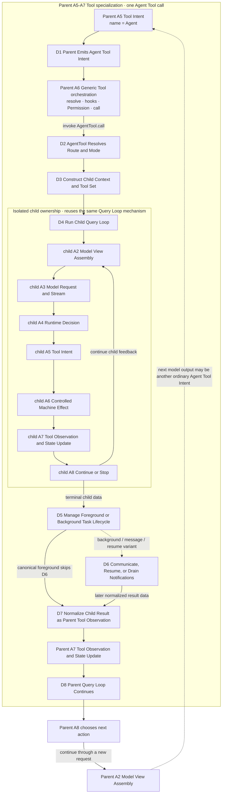

# 04：Subagent Delegation——普通 Tool 边界里的隔离 Child Loop

[← 上一部分：Session Continuity](../03-session-continuity/README.md) · [下一篇：Child Loop 与 Context Isolation](01-child-loop-and-context-isolation.md)

> 父 Agent 委派任务时，为什么不是把工作交给一个共享内存的 helper，而是打开另一条有明确上下文、生命周期与结果边界的 Query Loop？

先给结论：**AgentTool 是普通的 parent Tool 边界：它把一次 parent Tool call 适配成隔离的 child Query Loop，再把 child result 归约成普通的 parent Observation。** Parent 仍从 A5 Tool Intent 进入 A6 的通用 Tool orchestration 与 Permission；child 仍运行同一套模型 / Tool feedback 机制；跨回 parent 的是 normalized data，不是 child 的 mutable messages、controller 或调用栈。

本文是 Part 04 的自包含总览。它先把 D1–D8 放回 [A1–A8 权威主线](../00-one-agent-turn.md#1-权威全景图a1a8)，再固定 parent、child 与 task registry 的所有权边界。四篇 owner 文章分别深入 context isolation、foreground/background lifecycle、communication/result return 与 fork/prompt cache。

## 1. D1–D8：A5–A7 内部的一次 nested-loop specialization

下面的图是 **[Architectural interpretation]**：它综合固定源码快照中的通用 Tool、`AgentTool`、child Query Loop 与 task lifecycle 行为。D1–D8 不是 A1–A8 的同级架构，而是 parent 在 A5 产生 `Agent` Tool Intent 后、穿过 A6、回到 A7 的一条 Tool-specific 内部路径。



这张图必须按以下边界阅读：

- **D1 仍是 parent A5 的 Tool Intent。** “选择委派”只有在下一次 parent model output 形成普通 `Agent` `tool_use` 后，才真正进入 Tool path。
- **D2–D6 仍在 parent A6 控制范围内。** Generic Tool resolution、hooks、Permission 与 result pairing 没有因为 Tool 名称是 `Agent` 而消失。
- **D4 复用的是同一套 A2–A8 / `query()` / `queryLoop()` 机制。** Child 拥有自己的 evolving messages、Tool rounds 与 runtime controls；它不是第二套 agent framework。
- **D7 只归约数据。** Foreground terminal result、async launch metadata、`TaskOutput` result 或 later notification 最终都必须成为 parent 可消费的 normalized data。
- **D8 是 parent continuation。** 它经 parent A8 回到 A2 → A3 发起新请求，不会把 child runtime merge 进 parent，也不会恢复 child stack。

## 2. 一次失败测试调查怎样穿过 D1–D8

下面是 **[Architectural interpretation]**：它用同一个 failing-test 场景走完整条机制路径，不声称固定源码快照记录过这一组具体 Search / Read / Test 调用。

```text
Parent task: locate and fix a failing test.
Bounded delegation: only investigate whether the failure comes from
production logic, fixture setup, or fake-timer ordering.
```

### D1：parent 产生结构化 Agent Tool Intent

Parent model 不是直接“创建一个 child object”，而是产生普通 Tool Intent：包含 description、bounded prompt、agent type / mode 与可选 isolation。该 intent 仍带 Tool call identity，并等待合法的 Tool Observation 闭合。

### D2：generic Tool control 先成立，AgentTool 再选 route / mode

A6 先解析可见 Tool、运行通用 hooks / Permission，再调用 `AgentTool.call`。`AgentTool` 随后决定 local / other route、typed child / fork variant、foreground / async，以及是否创建 worktree。若输入、agent type 或 route gate 在这里失败，child Query Loop 尚未存在。

### D3：显式构造 child context 与 capability

Runtime 从 bounded prompt 派生 child user message与system/persona，组装并过滤 child Tool set，建立 Permission context、cwd/worktree、identity、query tracking、caches与 cancellation channel。正常 child 不复制 parent 的完整 mutable history；每个 crossing 必须能说清是 derived、copy/clone、fresh、selected reference 还是 named shared channel。

### D4：child 自己完成 search / read / test feedback rounds

Child model 可以先搜索失败测试，读取 fixture 与直接生产调用链，再运行 targeted test。每一步仍是 child A5 Tool Intent → child A6 Controlled Effect → child A7 Observation；Permission denial、Tool error 与 test failure也都回到 child 自己的下一轮模型视图。Parent model 不会逐条看到这些中间 Tool history。

### D5：lifecycle owner 决定谁等待、事实保留在哪里

Canonical foreground 让原 `Agent` Tool call 等待 child terminal；async 则注册可寻址 task，先返回 launch acknowledgement，随后由 registry保存 running / terminal state。Execution mode 改变等待、retention 与交付时序，不改变“只跨回 normalized data”的语义边界。

### D6：只有 attached variants 才经过 queue、resume 或 later notification

Foreground direct result跳过 D6。Background child 可以在后续 tool-round boundary drain pending message；terminal / evicted child 的 resume 从 transcript / metadata 重建 fresh query；async terminal notification 则在 task fact 落定后进入 later parent input。没有一条路径把 suspended stack 或共享 conversation memory交给另一侧。

### D7：child output 被归约，而不是 history merge

Foreground 由 finalizer提取 terminal / partial text、usage 与 Tool count，再由 Agent Tool mapper生成 ordinary `tool_result`。Async launch、`TaskOutput` 与 notification各有自己的 payload / timing，但 parent 接到的仍是 status、result、usage、task ID或 output location等数据副本。

### D8：parent 带着 observation 继续修复与验证

Foreground parent 在同一次 Agent call 返回后得到根因；background parent 先得到 launch Observation，稍后通过 `TaskOutput` 或 notification得到 terminal result。Parent 随后才在自己的 Query Loop 中决定 Edit、重新运行 targeted test与最终 verification。Child 的 mutable runtime、内部 Tool history与已结束 call stack都不会成为 parent state。

## 3. 不要说“Agent state”：九个 owner 与 lifetime

同一次委派同时存在多个状态平面。下表只回答四个问题：谁拥有、何时对模型可见、由什么事件改变、活多久。

| state plane | owner | model visibility | mutation event | lifetime |
| --- | --- | --- | --- | --- |
| parent model-visible messages | parent Query Loop / A2 projection | parent model 在被选入下一次 request 后可见 | parent assistant intent、mapped Tool Observation或later input append / projection | parent turn之间可增长；durable form另有 owner |
| parent runtime / Tool-call state | generic Tool executor + `AgentTool.call` | 不直接可见 | validation、Permission、route、pending/return/error settlement | 一次 parent Tool invocation |
| child model-visible messages | child Query Loop | 只对 child model 的对应 request 可见 | fresh prompt / selected fork input、child assistant output与child Tool Observation append | 一个 child query chain；可另行写 sidechain transcript |
| child runtime / query state | child `ToolUseContext` + `runAgent` / `queryLoop` | 不直接可见 | identity / controller / caches / Sets / Permission context构造，Tool rounds持续更新 | live child execution；terminal 后不跨回 parent |
| `LocalAgentTask` registry / terminal data | root task store + task helpers | 不直接可见；经 mapper / `TaskOutput` / notification投影后才可见 | registration、mode flip、`completed` / `failed` / `killed` transition、retention / eviction | foreground通常到 unregister；async terminal record可保留更久 |
| pending child-message queue | addressable local task record | append 时双方模型都不可见；drain成 attachment 后只对recipient可见 | `queuePendingMessage` append；attachment collection时 `drainPendingMessages` 清批次 | running task record内的process-local queue |
| global terminal notification queue | pending-notification manager / entry consumer | enqueue 时parent model不可见；consumer drain并进入later `ask()` 后可见 | terminal fact之后的 `notified` check-and-set、enqueue、drain | process-local delivery window；不等于terminal registry fact |
| normalized parent Tool Observation / later parent input | Agent Tool mapper、`TaskOutput` mapper或notification consumer；随后parent history | parent model在下一次 request中可见 | D7 mapping或later notification projection | parent conversation / transcript中的数据；不含child runtime reference |
| transcript / metadata for fresh resume | sidechain persistence + resume adapter | 不直接可见；filter / reconstruct / project后对fresh child可见 | child messages / metadata append；resume时load、filter、rebuild | 可跨task-record eviction；写入缺口会降低恢复保真度 |

三组名字尤其不能互换：

```text
child messages       = child 下一次 model request 的协议历史
agentMessages        = adapter 的 outer progress / result aggregation
LocalAgentTask state = lifecycle registry，不是任何模型的 transcript
```

## 4. Foreground / background：相同语义目标，不同交付时序

| route | immediate parent-visible outcome | execution / retention | terminal delivery | 必须保留的边界 |
| --- | --- | --- | --- | --- |
| canonical foreground | 原 `Agent` Tool call保持 pending，没有 launch acknowledgement | foreground record可寻址；child iterator settle后先remove record | finalizer + mapper在**同一次** Tool call返回terminal normalized result | parent等待child，但两套Query Loop与mutable messages仍分离 |
| async from start | 先返回 `async_launched`、stable task ID与output metadata | `running / isBackgrounded=true` record保留progress、controller与later terminal data | terminal fact先写registry；之后可由`TaskOutput`读取，或经notification成为later parent input | launch只证明注册 / 调度，不证明terminal |
| foreground → background | signal赢后很快返回launch acknowledgement | 旧iterator `.return()` cleanup最多等1秒；再以stable ID从**original inputs** fresh async `runAgent`；旧`agentMessages`只做聚合 | fresh run走普通async terminal / retrieval / notification path | 可能replay；cleanup timeout时旧round与新query可短暂overlap，不是stack migration |
| fork，background可用 | fork feature通常把Agent spawn推入async lifecycle | selected prefix material对齐，但child core runtime仍clone/fresh并有task record | launch first，terminal later | AgentTool implicit fork仍调用ordinary `runAgent` |
| eligible fork，global background disable | 不返回launch；原Tool call同步等待 | prefix variant仍成立，但无async task registration | 同一次Agent Tool call直接返回terminal result | global disable最终否决force-async；不能虚构task-owned queue |

这些路径改变的是 delivery timing。它们都不把 child mutable context交还parent；cancel / kill也只能阻止未来执行，不能回滚已经完成的文件、进程、数据库或远端效果。

Lifecycle的完整状态、controller ownership、status-before-notification与conversion race由 [Foreground / Background Lifecycle](02-foreground-background-lifecycle.md) 负责。

## 5. 两个 attached variants：communication 与 fork

### 5.1 Communication：queue success 不是 model consumption

对 running local child，`SendMessage` 的canonical boundary是把plain string append到task-owned `pendingMessages`。Recipient到后续attachment collection才drain批次、清queue，并映射成`queued_command` meta attachments：

```text
sender Tool success
  -> accepted into pending queue
    -> drained at recipient turn boundary
      -> visible to recipient model
        -> recipient may act and later produce result
```

这五个边界没有共享 conversational memory，也没有 exactly-once Tool-effect保证。对terminal或evicted child，resume读取transcript / metadata、过滤无法闭合内容并启动fresh async query；它不是唤醒旧generator。Terminal registry state、`notified`、`TaskOutput` retrieval与notification delivery仍是不同事实。

Identity、queue、drain、poll与parent re-entry的完整成功边界见 [Agent Communication / Result Return](03-communication-and-result-return.md)。

### 5.2 Fork：复用prefix material，不借用正确性或隔离

Fork是D2 / D3的route与context-construction variant。它让rendered system prompt、exact Tool schemas/order、model/thinking配置与selected parent messages尽量prefix-compatible，把dynamic child directive放在稳定material之后；随后仍创建新的child initial array、identity、query tracking与cloned/fresh core state，再进入普通D4。

需要守住四个限定：

- AgentTool implicit fork使用ordinary `runAgent`；generic `runForkedAgent`是另一条utility，不能替代Agent task lifecycle证据。
- `CacheSafeParams`只命名prefix-sensitive inputs；prompt-cache compatibility不保证hit，cache cold / miss不影响正确性。
- Mode决定少数named runtime references是fresh还是shared；这不等于parent / child共享一份mutable history。
- Separate working copy来自实际worktree creation；prompt notice只解释路径与staleness，不产生filesystem isolation。

完整的message shape、recursion gate、mode-specific ownership与cache边界见 [Fork / Prompt Cache](04-fork-and-prompt-cache.md)。

## 6. 九条面试级不变量

1. **Nested loop，ordinary Tool boundary。** `AgentTool` 在parent A5–A7内部打开child Query Loop，不是主架构旁的第二套runtime。
2. **Context与capability显式构造。** Prompt、system、tools、Permission、cwd与runtime controls逐项 crossing，不存在默认“复制整个parent context”。
3. **Mutable model/runtime state隔离。** 只有named queue、task store、controller、setter或stable config reference按mode穿越边界。
4. **Task lifecycle显式且mode-dependent。** Foreground wait、async launch与conversion不能用一个“running in background”标签概括。
5. **Communication走queue / attachment。** Queue acceptance、drain、model visibility、action与result是不同success boundary。
6. **Result只以normalized data返回。** Foreground是ordinary Tool Observation；background是launch后由`TaskOutput`或later notification交付terminal data。
7. **Resume / restart创建fresh runtime。** Transcript与metadata可重建，generator、Promise、controller与suspended stack不会复活。
8. **Fork / cache是优化，不是正确性或隔离捷径。** Cache miss只影响cost / latency；worktree isolation与prompt prefix正交。
9. **Cancellation不是rollback。** Abort / kill不能撤销已经发生的external effects；replay或overlap前必须检查、幂等或补偿。

## 7. 四篇 owner 文章怎样读

按因果顺序深入，不要按源码目录跳读：

1. [Child Loop 与 Context Isolation](01-child-loop-and-context-isolation.md)：D1–D4与D7–D8；先固定parent / child context、Tool、Permission与cancel crossing。
2. [Foreground / Background Lifecycle](02-foreground-background-lifecycle.md)：D5；再看registration、mode、controller、terminal fact与delivery timing。
3. [Agent Communication / Result Return](03-communication-and-result-return.md)：D6 / D7；接着看identity、pending queue、resume、`TaskOutput`、notification与parent re-entry。
4. [Fork / Prompt Cache](04-fork-and-prompt-cache.md)：D2 / D3 variant；最后看prefix reuse、recursion、mode-specific state与worktree isolation。

## 8. 决定性源码坐标

本部分 D1–D8 的 claim-oriented 证据表见 [Source Evidence Index](../appendices/source-evidence-index.md#51-d1d8-delegation-spine)。

下面只保留跨层主干；全部结论、分支与短excerpt留在四篇owner文章。源码快照固定为`712b24f22a63eb6d1a2f86697bf6dbbaa39ae3cf`。

1. **Generic Tool execution进入`AgentTool.call`。** `712b24f22a63eb6d1a2f86697bf6dbbaa39ae3cf` + [`src/services/tools/toolExecution.ts`](https://github.com/buoylee/Claude-Code-true/blob/712b24f22a63eb6d1a2f86697bf6dbbaa39ae3cf/src/services/tools/toolExecution.ts) + `checkPermissionsAndCallTool`；随后多态调用同一快照的 [`src/tools/AgentTool/AgentTool.tsx`](https://github.com/buoylee/Claude-Code-true/blob/712b24f22a63eb6d1a2f86697bf6dbbaa39ae3cf/src/tools/AgentTool/AgentTool.tsx) + `AgentTool.call`。
2. **`runAgent`进入child `query()` / `queryLoop()`。** `712b24f22a63eb6d1a2f86697bf6dbbaa39ae3cf` + [`src/tools/AgentTool/runAgent.ts`](https://github.com/buoylee/Claude-Code-true/blob/712b24f22a63eb6d1a2f86697bf6dbbaa39ae3cf/src/tools/AgentTool/runAgent.ts) + `runAgent`；同一快照的 [`src/query.ts`](https://github.com/buoylee/Claude-Code-true/blob/712b24f22a63eb6d1a2f86697bf6dbbaa39ae3cf/src/query.ts) + `query / queryLoop`。
3. **Task lifecycle与notification有独立owner。** `712b24f22a63eb6d1a2f86697bf6dbbaa39ae3cf` + [`src/tasks/LocalAgentTask/LocalAgentTask.tsx`](https://github.com/buoylee/Claude-Code-true/blob/712b24f22a63eb6d1a2f86697bf6dbbaa39ae3cf/src/tasks/LocalAgentTask/LocalAgentTask.tsx) + `registerAgentForeground / registerAsyncAgent / completeAgentTask / enqueueAgentNotification`。
4. **Final result mapper只把data送回parent Tool contract。** `712b24f22a63eb6d1a2f86697bf6dbbaa39ae3cf` + [`src/tools/AgentTool/agentToolUtils.ts`](https://github.com/buoylee/Claude-Code-true/blob/712b24f22a63eb6d1a2f86697bf6dbbaa39ae3cf/src/tools/AgentTool/agentToolUtils.ts) + `finalizeAgentTool`；同一快照的 [`src/tools/AgentTool/AgentTool.tsx`](https://github.com/buoylee/Claude-Code-true/blob/712b24f22a63eb6d1a2f86697bf6dbbaa39ae3cf/src/tools/AgentTool/AgentTool.tsx) + `mapToolResultToToolResultBlockParam`。

## 9. 回到主线与下一篇

Part 04 放大的只是parent A5–A7内部的一次`Agent` Tool specialization。D7完成后，D8仍让parent经A8回到A2 → A3：parent用normalized child result继续编辑、测试与验证，而不是接管child runtime。

[← 上一部分：Session Continuity](../03-session-continuity/README.md) · [下一篇：Child Loop 与 Context Isolation](01-child-loop-and-context-isolation.md)

四篇读完后，先回到A1–A8主图复述完整feedback loop，再用 [99 Interview Playbook](../99-interview-playbook.md) 把这套机制压缩成30秒结论、白板路径与深入追问。
