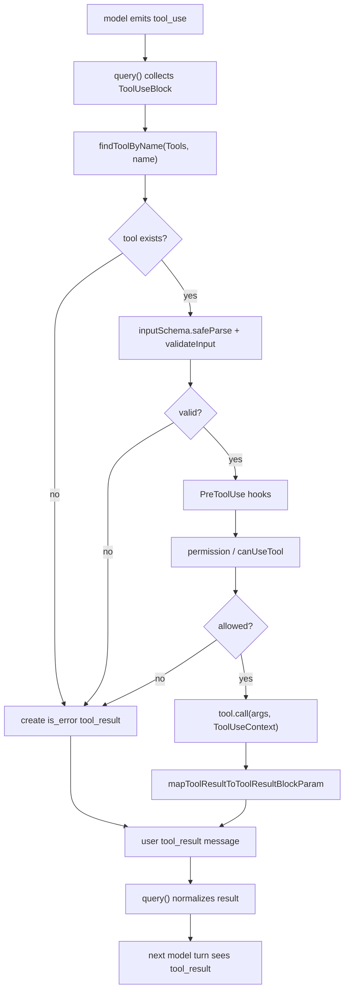

# 05 - Tool System 与 Orchestration

## 面试式回答

Claude Code 的工具系统可以理解成一套 runtime contract。每个 `Tool` 不只是一个函数，而是同时定义了模型看到什么、运行时如何校验、权限如何判断、是否允许并发、如何执行、结果如何映射回 API、以及 UI 如何渲染。`Tools` 是当前 turn 可用工具集合；API 请求前，`toolToAPISchema()` 把这些工具转成模型可见的 schema；模型返回 `tool_use` 后，runtime 再通过 `findToolByName()` 找回真实工具，经过 validation、permission、hooks 和 `call()`，最终生成 user `tool_result` message。

编排层有两条路径。传统路径是模型响应完成后，`runTools()` 按 `isConcurrencySafe(parsedInput)` 分批执行工具：被判定为 concurrency-safe 的工具调用可以一起跑，非并发安全的工具调用独占顺序执行。流式路径是 `StreamingToolExecutor` 在 assistant message 刚流出时就开始排队执行工具，但仍然保证输出为标准 `tool_result`。两条路径都维护 `toolUseID` 到 `tool_result.tool_use_id` 的映射，确保下一轮模型能把每个观察结果对应回原始 `tool_use`。

## 这一章解决什么问题

这一章解释工具从“TypeScript 对象”变成“模型可调用能力”，再从 `tool_use` 变回“下一轮模型可读观察结果”的全过程：

- `Tool` runtime contract 包含 name、schema、prompt、permission、call、render 等多个面向。
- 工具定义如何通过 `toolToAPISchema()` 变成模型请求里的 tool schema。
- `tool_use.id` 如何成为 `tool_result.tool_use_id`，让模型协议保持配对。
- `runTools()` 的普通编排与 `StreamingToolExecutor` 的流式编排有什么不同。
- 多个工具调用如何完成、失败、取消，以及并发安全如何影响执行顺序。
- 工具结果如何被 `query()` 重新注入下一轮 model turn。

## 心智模型

工具系统有两个世界。

模型世界只认识 schema。它看到的是工具名、自然语言 description、JSON input schema，以及少量 API 字段，例如 strict、defer_loading、eager_input_streaming。模型并不知道具体的权限弹窗、hook、sandbox 或 UI 组件。

runtime 世界认识完整 `Tool`。当模型输出 `tool_use`，runtime 拿 `name` 找到工具对象，拿 `inputSchema` 做解析，调用 `validateInput()` 和 `checkPermissions()` / `canUseTool` 做权限决策，再执行 `call()`。工具返回的内部结果会通过 `mapToolResultToToolResultBlockParam()` 转成 API 规定的 `tool_result` block，同时通过 `renderToolUseMessage()`、`renderToolResultMessage()` 等方法服务 UI。

编排层负责把多个工具调用排成安全的执行计划。一个 `tool_use` 是模型提出的意图，真正能不能跑、什么时候跑、失败后其他工具怎么办，都由 runtime 决定。最终 runtime 只把结果以 user message 的形式交还给模型。

## 实现逻辑

`Tool` 类型定义在 `src/Tool.ts`。核心字段可以按职责分组：

- 身份与发现：`name`、`aliases`、`searchHint`、`shouldDefer`、`alwaysLoad`、`mcpInfo`。
- 模型 schema：`prompt()` 生成 description，`inputSchema` 或 `inputJSONSchema` 生成参数 schema，`strict` 控制结构化约束。
- 执行边界：`validateInput()`、`checkPermissions()`、`isReadOnly()`、`isConcurrencySafe()`、`isDestructive()`、`interruptBehavior()`。
- 调用本体：`call(args, context, canUseTool, parentMessage, onProgress)`。
- 结果映射：`mapToolResultToToolResultBlockParam(content, toolUseID)` 负责生成 API `tool_result` block。
- UI 渲染：`renderToolUseMessage()`、`renderToolResultMessage()`、`getActivityDescription()`、`getToolUseSummary()` 等。

工具 schema 的生成发生在 API 请求边界。`claude.ts` 根据 tool search、deferred tools、MCP pending 状态和模型支持情况得到 `filteredTools`，然后对每个工具调用 `toolToAPISchema()`。这个函数会选择 `inputJSONSchema` 或把 Zod `inputSchema` 转 JSON Schema，调用 `tool.prompt()` 得到 description，按模型/feature gate 添加 strict、defer_loading、eager_input_streaming、cache_control 等字段。生成的 schema 是模型可见能力，和 runtime 内部 `Tool` 对象不是一回事。

模型返回工具调用时，assistant message 的 content 中出现 `type: "tool_use"` block。这个 block 的 `id` 是整个工具生命周期的主键。`query()` 收集这些 blocks 到 `toolUseBlocks`；工具执行层会把同一个 id 传给 `runToolUse()`、permission、hooks、`tool.call()`，最后把它写到 `tool_result.tool_use_id`。模型下一轮就是靠这个字段知道“这条结果回应的是哪个工具调用”。

普通编排由 `runTools()` 完成。它先用 `partitionToolCalls()` 根据每个工具的 `isConcurrencySafe(parsedInput)` 把连续工具调用切成 batch：并发安全的连续调用可以组成一批，非并发调用单独成批。并发 batch 走 `runToolsConcurrently()`，内部用 `all(..., CLAUDE_CODE_MAX_TOOL_USE_CONCURRENCY || 10)` 限制最大并发；串行 batch 走 `runToolsSerially()`，每个工具执行完才继续。两条路径都会通过 `setInProgressToolUseIDs()` 标记运行中工具，并在 `markToolUseAsComplete()` 删除对应 id。

单个工具调用由 `runToolUse()` 和 `checkPermissionsAndCallTool()` 承担。流程是：按名称查找工具；查不到就返回 is_error 的 `tool_result`；检查 abort；解析 input schema；运行工具自己的 value validation；执行 PreToolUse hooks；解析 hook permission decision；调用统一 permission 决策；如果拒绝，返回 is_error `tool_result`；如果允许，调用 `tool.call()`，接收 progress，并把结果映射成 `tool_result`。这个过程还会记录 telemetry、处理 structured output、PostToolUse hooks 和错误包装。

流式编排由 `StreamingToolExecutor` 完成。它的输入不是完整的 `toolUseBlocks` 数组，而是随着 assistant message 到达逐个 `addTool(block, assistantMessage)`。它为每个工具维护 `queued`、`executing`、`completed`、`yielded` 状态，并用 `canExecuteTool()` 保证非并发安全工具独占，被判定为 concurrency-safe 的工具可以与其他并发安全工具一起跑。`getCompletedResults()` 可以在模型仍在流时产出已完成结果；`getRemainingResults()` 在模型结束后等待所有未完成工具。

工具结果重新进入模型由 `query()` 统一完成，不由工具自己调用模型。无论结果来自 `runTools()` 还是 `StreamingToolExecutor`，`query()` 都会 yield message 给上层，再用 `normalizeMessagesForAPI()` 把它转成 API user message，追加到 `toolResults`。下一轮 state 使用 `messagesForQuery`、`assistantMessages`、`toolResults` 和 attachments 构造，因此模型看到的是完整的“我调用了工具，用户返回了工具结果”的对话历史。

## 源码入口

- `src/Tool.ts:362`：`Tool` 类型，定义工具 runtime contract。
- `src/Tool.ts:358`：`findToolByName()`，按 name 或 alias 从 `Tools` 查找真实工具。
- `src/Tool.ts:158`：`ToolUseContext`，工具执行时使用的 runtime-only 上下文。
- `src/tools.ts`：基础工具集合的注册/聚合入口。
- `src/utils/api.ts:119`：`toolToAPISchema()`，把 `Tool` 转成 API tool schema。
- `src/services/api/claude.ts:1120` 起：tool search、deferred tools、filtered tools 和 schema 构建。
- `src/query.ts:557`：本轮 `toolUseBlocks` 队列。
- `src/query.ts:833`：从 assistant message 收集 `tool_use`。
- `src/query.ts:1380`：统一选择 streaming executor 或 `runTools()`。
- `src/services/tools/toolOrchestration.ts:19`：`runTools()`，普通工具编排入口。
- `src/services/tools/toolOrchestration.ts:91`：`partitionToolCalls()`，按并发安全性切 batch。
- `src/services/tools/toolOrchestration.ts:179`：`markToolUseAsComplete()`，从 in-progress set 移除 `toolUseID`。
- `src/services/tools/toolExecution.ts:337`：`runToolUse()`，单个 tool_use 的执行入口。
- `src/services/tools/toolExecution.ts:599`：`checkPermissionsAndCallTool()`，validation、hooks、permission、call 和 result 映射。
- `src/services/tools/StreamingToolExecutor.ts:40`：流式工具执行器。
- `src/services/tools/StreamingToolExecutor.ts:76`：`addTool()`，流式路径接收新的 tool_use。
- `src/services/tools/StreamingToolExecutor.ts:412`：`getCompletedResults()`，非阻塞取已完成结果。
- `src/services/tools/StreamingToolExecutor.ts:453`：`getRemainingResults()`，等待并产出剩余结果。

## 关键数据结构与状态

- `Tool<Input, Output, P>`：工具的完整 runtime contract，包含模型描述、参数 schema、权限、执行、并发、结果映射和渲染。
- `Tools`：当前 turn 可用工具数组，是 schema 构建、工具查找和 permission/render 的共同输入。
- `ToolUseContext`：工具执行上下文，持有 options、AbortController、AppState 访问器、file state、in-progress tool ids、UI setters、query tracking 等。
- `ToolUseBlock`：模型发出的工具调用，关键字段是 `id`、`name`、`input`。
- `toolUseID`：runtime 中传递的工具调用 id，最终写入 `tool_result.tool_use_id`。
- `MessageUpdate` / `MessageUpdateLazy`：工具执行层向 `query()` 返回的更新，可能包含 message、context modifier 或 new context。
- `PermissionResult`：permission/hook/classifier 的决策结果，决定 allow、ask、deny 以及可选 updatedInput。
- `TrackedTool`：`StreamingToolExecutor` 内部状态，记录 block、assistantMessage、status、isConcurrencySafe、promise、results、pendingProgress、contextModifiers。
- `setInProgressToolUseIDs`：UI/runtime 状态，用于标记正在执行的工具；完成时由 `markToolUseAsComplete()` 删除。
- `sourceToolAssistantUUID`：user tool_result message 记录来源 assistant message，便于 UI/transcript 关联。

## 正常路径

1. runtime 准备 `Tools`，每个工具实现 `Tool` contract。
2. API 请求前，`claude.ts` 过滤工具集合，并用 `toolToAPISchema()` 生成模型可见 schema。
3. 模型选择工具，assistant message 中出现 `tool_use` block。
4. `query()` 收集 `tool_use`，记录 `needsFollowUp`。
5. 普通模式下，模型响应结束后 `runTools()` 按 batch 执行；流式模式下，`StreamingToolExecutor.addTool()` 在 message 到达时就排队执行。
6. 单个工具执行进入 `runToolUse()`，按 name/alias 找工具，解析 input，处理 abort。
7. `checkPermissionsAndCallTool()` 运行 schema validation、工具 validation、PreToolUse hooks、permission 决策。
8. permission 允许时调用 `tool.call()`；工具可以通过 `onProgress` 产出 progress。
9. 工具内部结果通过 `mapToolResultToToolResultBlockParam(result.data, toolUseID)` 变成 API `tool_result`。
10. `query()` 收集这些 result message，normalize 后放入 `toolResults`。
11. 下一轮模型请求包含 assistant `tool_use` 和 user `tool_result`，模型基于结果继续回答或继续调用工具。

## 失败、边界与中断

工具不存在时，`runToolUse()` 不会抛给上层，而是构造 is_error 的 `tool_result`，内容说明工具不可用，并保留原始 `tool_use.id`。这能让模型在下一轮看到失败原因，而不是让 transcript 断裂。

输入不符合 schema 时，`checkPermissionsAndCallTool()` 返回 `InputValidationError` 的 is_error `tool_result`。如果失败来自 deferred tool schema 未发送，runtime 会附加提示，让模型先通过 ToolSearch 加载该工具后重试。这样错误路径仍然通过模型协议表达，而不是 runtime 私下修改模型输入。

权限拒绝、hook 阻止、classifier 拒绝都会转成 `tool_result`。如果 PreToolUse hook 还要求阻止后续 continuation，`query()` 会看到 attachment 并以 `hook_stopped` 结束。权限路径可能返回 updatedInput；只有 permission/hook 明确修改后的 input 才会进入 `tool.call()`。

取消分几类。若 `ToolUseContext.abortController` 已经 aborted，`runToolUse()` 直接返回取消消息。流式 executor 还会为 pending 或 running tools 生成 synthetic error：用户中断使用 rejection 文案，streaming fallback 使用 discarded 文案，Bash 兄弟工具错误会取消相关并发 Bash。这样每个已出现的 `tool_use` 都能得到一个结局。

并发失败的策略是保守的。普通 `runTools()` 只把 `isConcurrencySafe()` 为 true 的连续工具并发执行；否则串行。`StreamingToolExecutor` 允许并发安全工具同时执行，但非并发工具需要独占。如果 Bash 工具产出 error result，executor 会 abort sibling subprocess，避免明显依赖链继续执行无意义命令。

结果过大、structured output、progress、hooks 都是边界状态。工具可以把超大结果持久化后给模型预览；structured output 可以作为 attachment 进入 runtime；progress 只服务 UI 和中间状态，不等价于最终 `tool_result`。

## Mermaid 图

## 设计取舍

`Tool` 把模型 schema、权限、执行和渲染放在同一个 contract 下，优点是每个工具能自描述、可统一编排；代价是接口较宽。Claude Code 用可选方法和 shared orchestration 把复杂度集中到工具边界，而不是让每个调用点重复处理权限和结果映射。

schema 生成在 API 边界集中处理，能把 prompt caching、tool search、MCP schema、strict mode、fine-grained tool streaming 和 provider 兼容性放在一个 choke point。这减少请求漂移，但要求 runtime 工具定义必须足够稳定，因为 schema bytes 会影响缓存。

`tool_use.id` 到 `tool_result.tool_use_id` 的显式配对看起来啰嗦，但它让多工具并发、失败补偿、中断恢复都可解释。即使结果乱序完成，runtime 也能用 id 把观察结果还给正确调用。

普通 `runTools()` 更简单，适合在模型这一轮采样结束后批量执行；`StreamingToolExecutor` 更复杂，需要管理 queue、progress、discard、synthetic errors 和 sibling abort，但能显著减少“模型写完工具输入后还要等整段响应结束”的空窗。

失败通过 `tool_result` 返回给模型，而不是直接抛出终止整轮，是 agent 系统的重要设计。模型需要观察失败、修正参数、选择替代工具；只有 runtime 自身不可恢复的 API/bug 才应该走 assistant API error。

## 面试追问

1. `Tool` 的 `prompt()` 和 `description()` 有什么区别？
答：`prompt()` 面向模型 schema，生成工具在 API request 里的 description；`description(input, options)` 面向运行时/UI，通常基于具体 input 展示这次工具调用在做什么。

2. 为什么工具执行前还要 runtime validation，模型不是已经看过 schema 吗？
答：模型可能输出类型不符、字段缺失、deferred tool 未加载导致参数退化，或者值层面不合法。schema 只是提示和 API 约束，runtime validation 是副作用前的最后防线。

3. `tool_use` 和 `tool_result` 如何关联？
答：assistant `tool_use.id` 在 runtime 中作为 `toolUseID` 传递，最终写入 user `tool_result.tool_use_id`。下一轮模型按这个 id 把结果对应回原调用。

4. 为什么不是所有工具都并发执行？
答：文件写入、编辑、shell 命令等可能改变共享状态；并发会制造竞态。`isConcurrencySafe(input)` 让工具根据具体参数声明是否安全，编排层据此分批。

5. streaming tool execution 和普通 `runTools()` 最大差别是什么？
答：普通路径等模型响应结束后统一执行 `toolUseBlocks`；streaming 路径在每个 assistant message 到达时就排队执行工具。但二者最终都产出相同的 `tool_result` message，并由 `query()` 重新注入下一轮。

6. 工具失败时为什么还要返回 `tool_result`？
答：模型协议和 agent 推理都需要结果。失败本身也是观察信息；返回 is_error `tool_result` 能让模型修正计划，同时保持 transcript 配对合法。

## 一句话总结

Tool system 是 Claude Code 把模型声明的 `tool_use` 安全地翻译成 runtime 副作用，再把副作用结果按 `tool_result` 协议交还给模型的编排层。
