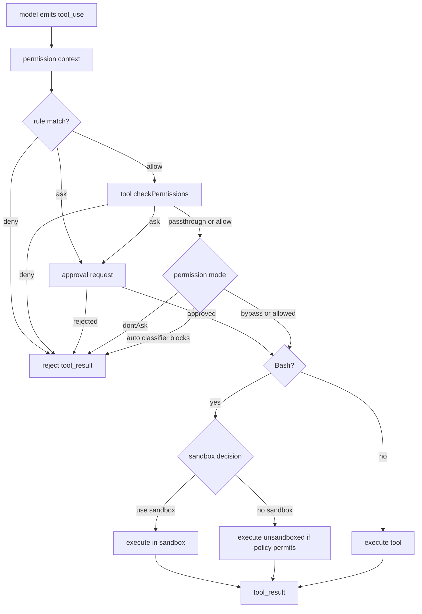

# 06 - Permission 与 Sandbox

## 面试式回答

Claude Code 的权限系统不是让模型自己“保证安全”，而是在模型输出 `tool_use` 之后，由 runtime 根据当前 permission mode、allow/deny/ask 规则、工具自己的权限检查、用户交互和 sandbox 能力再做一次授权。模型可以表达意图，例如“我要运行 Bash”或“我要 Edit 文件”，但它没有最终执行权。

核心链路是：启动时 `initializeToolPermissionContext()` 汇总 CLI、settings、policy、session 和工作目录信息；工具执行前 `canUseTool` 进入 `hasPermissionsToUseTool()`；通用规则先处理 deny / ask / allow，再交给工具的 `checkPermissions()` 做内容级判断；如果仍然需要用户确认，就进入权限 UI 或 headless 拒绝路径。Bash 还会单独判断 shell 规则、危险命令和 sandbox。sandbox 是运行时 containment，不是 prompt 里的道德约束：它决定命令是否在受限环境里 spawn，而不是让模型“不要做坏事”。

## 这一章解决什么问题

这一章回答四个问题：

1. 为什么模型意图不能等同于 runtime authorization。
2. `permission mode` 如何影响 tool_use 的 allow / deny / ask 行为。
3. allow/deny 规则、危险权限清理、Bash 规则和 sandbox 如何串起来。
4. 被拒绝、无法提示、sandbox 不可用、命令不安全时系统怎样失败。

理解这一章后，面试里可以把 Claude Code 的安全边界讲成“模型建议动作，runtime 裁决动作，工具执行动作，sandbox 限制动作”，而不是把安全性归因于 prompt。

## 心智模型

可以把权限系统看成三层闸门。

第一层是会话级上下文。`ToolPermissionContext` 保存当前 mode、额外工作目录、always allow、always deny、always ask、bypass 是否可用、auto mode 是否可用等状态。它来自 settings、CLI 参数、policy 和 session 更新，不来自模型自由生成。

第二层是 tool_use 前的决策器。模型发出工具调用后，runtime 用工具名和输入去匹配规则。deny 最先拦截，ask 可以强制提示，工具自己的 `checkPermissions()` 可以对路径、命令、文件内容等做更细判断，最后才看 mode 是否允许自动放行。

第三层是执行时 containment。对 Bash 来说，即使权限允许，`shouldUseSandbox()` 仍会决定是否把命令放进 sandbox。sandbox 不是“权限批准”的同义词：权限回答“能不能执行这个动作”，sandbox 回答“如果执行，是否要限制它的系统能力”。

## 实现逻辑

入口在 `src/utils/permissions/permissionSetup.ts:872` 的 `initializeToolPermissionContext()`。它先解析 `--allowed-tools`、`--disallowed-tools` 和 base tools，把 legacy 工具名规范化，加载磁盘权限规则，再合并成 `ToolPermissionContext`。如果传了 base tools，它会把不在 base 集合里的默认工具自动加入 disallow。它还会把 settings 与 `--add-dir` 的额外目录校验后写入上下文。

permission mode 的行为可以这样理解：

- `default` / 普通交互模式：没有匹配 allow 时通常 ask；deny 直接拒绝；用户确认后可以一次性或持久化规则。
- `plan`：偏向规划阶段，原则上不直接执行会造成副作用的动作；如果会话原本允许 bypass，源码里允许 plan 下继承 bypass 可用性。
- `acceptEdits`：常见于“自动接受编辑”语义，对文件编辑类工具更容易 allow，但对 Bash 和敏感路径仍需要额外判断。
- `auto`：不直接问用户，而是用 classifier、safe-tool allowlist、acceptEdits fast path 和 denial tracking 做自动裁决；危险 shell allow 规则会在进入 auto 时被识别并清理或提示。
- `bypassPermissions`：跳过大部分交互式权限确认，但不是删除所有安全边界；工具的强制交互、安全检查、deny 规则和部分 ask 规则仍可拦截。
- `dontAsk`：把原本的 ask 转成 deny，常用于不能弹出交互确认的场景。

执行前的裁决在 `src/utils/permissions/permissions.ts:473` 的 `hasPermissionsToUseTool()` 和 `src/utils/permissions/permissions.ts:1158` 的 `hasPermissionsToUseToolInner()`。它的顺序很关键：先看整个工具是否被 deny；再看是否整个工具 always ask；然后调用工具自己的 `checkPermissions()`；工具级 deny、强制交互、内容级 ask、安全检查会优先返回；之后才根据 bypass、always allow、passthrough-to-ask、auto classifier 等逻辑决定 allow / ask / deny。

allow/deny 列表不是简单字符串集合，而是带来源和行为的规则。`PermissionRuleValue` 包含工具名和可选内容，`PermissionRuleSource` 区分 user settings、project settings、local settings、policy、CLI、command、session 等来源。这样 runtime 可以解释“为什么允许/拒绝”，也能把用户在权限 UI 里的选择写回正确位置。

危险权限清理集中在 `permissionSetup.ts`。`findOverlyBroadBashPermissions()` 会识别 `Bash(*)` 这类过宽 shell allow；auto mode 还会识别 `Bash(python:*)`、PowerShell 下载执行等可能绕过 classifier 的规则。`removeDangerousPermissions()` 按规则来源分组，对可持久化来源发出 removeRules 更新；不可持久化来源不会假装已经清掉，而是留给上层警告或降级处理。

Bash 规则在 `src/tools/BashTool/bashPermissions.ts`。`getSimpleCommandPrefix()` 会从命令里提取类似 `npm run`、`git commit` 的可建议前缀，但会跳过不安全 env var、flag、路径、URL、数字等，避免生成看似合理但实际匹配不了或过宽的规则。`bashPermissionRule` 把规则解析成 exact、prefix、wildcard 等结构，供 allow/deny/ask 和 sandbox excluded commands 复用。

sandbox 决策在 `src/tools/BashTool/shouldUseSandbox.ts:130`。它先看 `SandboxManager.isSandboxingEnabled()`；如果输入显式 `dangerouslyDisableSandbox` 且 policy 允许 unsandboxed commands，就不启用；没有 command 不启用；命中用户配置的 excluded commands 也不启用；其他 Bash 命令默认使用 sandbox。源码注释特别强调 excluded commands 是便利功能，不是安全边界。

## 源码入口

- `src/utils/permissions/permissionSetup.ts:872` / `initializeToolPermissionContext()`：启动时构造权限上下文、加载规则、处理 base tools、额外目录、危险权限。
- `src/types/permissions.ts:28` / `InternalPermissionMode` 与 `src/types/permissions.ts:29` / `PermissionMode`：runtime 支持的权限模式类型。
- `src/Tool.ts:123` / `ToolPermissionContext`：工具权限上下文的数据形状。
- `src/hooks/useCanUseTool.tsx:27` / `CanUseToolFn` 与 `useCanUseTool()`：交互式 runtime 的 `canUseTool` 实现。
- `src/utils/permissions/permissions.ts:473` / `hasPermissionsToUseTool()`：工具执行前的统一权限决策入口。
- `src/utils/permissions/permissions.ts:1158` / `hasPermissionsToUseToolInner()`：deny、ask、tool check、bypass、allow、auto 的核心顺序。
- `src/tools/BashTool/BashTool.tsx:420` / `BashTool`：Bash 工具定义、schema、权限、执行、结果映射。
- `src/tools/BashTool/bashPermissions.ts:161` / `getSimpleCommandPrefix()`：shell allow 建议的前缀提取。
- `src/tools/BashTool/bashPermissions.ts:364` / `bashPermissionRule`：shell permission rule 解析入口。
- `src/tools/BashTool/shouldUseSandbox.ts:130` / `shouldUseSandbox()`：Bash sandbox 是否启用的最终判断。

## 关键数据结构与状态

- `PermissionMode`：描述当前会话如何处理 ask。它影响 ask 是否弹 UI、转 deny、走 classifier、或被 bypass。
- `ToolPermissionContext`：保存 mode、规则集合、额外工作目录、bypass/auto 可用性、是否避免权限 prompt 等状态。
- `PermissionRuleValue`：`{ toolName, ruleContent? }`，例如 `Bash(git status)` 或文件工具的路径模式。
- `PermissionRuleSource`：记录规则来自 settings、policy、CLI、session 等，决定解释和持久化更新方式。
- `PermissionDecision`：最终进入执行器的结果，只有 allow 才继续；ask 进入交互或 headless 处理；deny 直接转失败 tool_result。
- `PermissionResult`：工具自己的中间判断，允许 `passthrough`，表示工具没有强意见，交给通用权限层继续处理。
- `DangerousPermissionInfo`：描述危险 allow 规则、来源和展示文本，用于 auto mode 的清理和警告。
- `SandboxInput`：Bash sandbox 决策只需要 command 和 `dangerouslyDisableSandbox`。

## 正常路径

一次普通 Bash tool_use 的正常路径是：

1. 模型输出 `tool_use`，名字是 `Bash`，输入里有 `command`、可选 `description`、`timeout`、`run_in_background` 等。
2. `runToolUse()` 找到 `BashTool`，先做 schema 与输入校验，再运行 PreToolUse hooks。
3. `canUseTool` 调用 `hasPermissionsToUseTool()`，deny/ask/allow 规则和 `BashTool.checkPermissions()` 共同生成决策。
4. 如果已有 allow 规则命中，或用户批准 ask，或 auto classifier 允许，决策变成 allow。
5. `shouldUseSandbox()` 判断该命令是否需要 sandbox。
6. `BashTool.call()` 通过 shell 执行命令，收集 stdout、stderr、interrupt、background task id、persisted output 等结果。
7. 结果被映射成 `tool_result` 回到模型；如果 output 很大，会保存到 tool-results 目录并给模型一个可读路径。

文件工具的正常路径类似，只是工具自己的 `checkPermissions()` 以路径规则为核心。Read 用 read 权限；Edit/Write 用 write 权限；敏感路径和被 deny 的目录会在工具校验阶段拦截。

## 失败、边界与中断

被 deny 的工具不会进入执行阶段。`hasPermissionsToUseToolInner()` 首先检查 deny rule，命中后返回 `Permission to use X has been denied.`，执行器把它转成失败的 tool_result。

被 ask 但无法交互时会失败。`dontAsk` mode 会把 ask 转 deny；async agent、headless 或 prompt 不可用时，安全检查、PowerShell 等需要显式用户批准的动作会返回 deny 或保持 ask，避免静默执行。

用户拒绝 permission request 时，tool_use 会产生 rejection 结果，模型可以根据失败原因调整下一步，例如改用 Read 获取更多上下文，或放弃危险命令。

sandbox 不可用并不等于命令自动禁止。`shouldUseSandbox()` 在 sandbox disabled 时返回 false，后续是否执行仍由权限规则、工具检查和 policy 控制。真正的安全点是“权限裁决”和“执行 containment”两条线各自生效。

unsafe command 会在 Bash 权限和解析层被拦截或要求确认。复杂 shell、无法可靠解析的命令、控制字符、过宽 prefix、危险 wrapper 或命中 ask/deny 的子命令，都会倾向于 ask 或 deny，而不是凭模型描述放行。

中断通过 `AbortController` 贯穿权限和执行。权限检查开始时如果 signal 已 abort，会抛出 abort；Bash 执行中断后会把 interrupted 写入结果，模型收到的是带错误语义的 tool_result，而不是悬空的 tool_use。

## Mermaid 图

## 设计取舍

第一，权限是 runtime 机制，而不是 system prompt 机制。这会增加实现复杂度，但能把模型输出和本地副作用分开，避免“模型说自己会小心”变成安全边界。

第二，deny 优先于 allow，工具级安全检查优先于 mode 放行。这让用户和 policy 的硬约束更可预测，也让 bypass mode 不会覆盖所有敏感路径保护。

第三，auto mode 不是简单的 YOLO。它有 classifier、safe allowlist、acceptEdits fast path、危险 shell permission cleanup 和 denial tracking，目标是在减少用户打断的同时保留可解释的拒绝路径。

第四，sandbox 与权限分离。这样一个命令可以“被允许但受限执行”，也可以“因为规则被拒绝而根本不执行”。分离之后，sandbox 不可用、被排除或被 policy 允许绕过时，权限系统仍能独立发挥作用。

第五，Bash 规则比普通工具规则更保守。shell 语法太灵活，prefix 建议、compound command 拆分、env var stripping、wildcard 匹配和解析失败 fail-safe 都是为了降低字符串规则被绕过的概率。

## 面试追问

1. 为什么不能让模型自己判断“这个命令是否安全”？
   因为模型输出只是文本和 tool_use 请求，不能作为本机副作用的授权源。runtime 必须用独立状态、规则和用户确认做裁决。

2. bypassPermissions 是不是完全无安全检查？
   不是。deny、工具强制交互、安全检查、部分内容级 ask 和 policy 仍然可能生效。它跳过的是大部分交互式 permission prompt，不是删除所有边界。

3. auto mode 和 default mode 最大差异是什么？
   default mode 遇到 ask 倾向于问用户；auto mode 会尝试用 classifier、allowlist 和 acceptEdits fast path 自动决定，并跟踪连续拒绝。

4. sandbox 和 allow rule 谁更重要？
   它们回答不同问题。allow rule 决定能不能执行；sandbox 决定如何执行。一个允许的 Bash 仍可能被 sandbox containment 限制。

5. 为什么要清理 `Bash(*)` 这类规则？
   因为过宽 shell allow 等价于绕开 auto classifier，尤其在 auto mode 下会让危险命令先被规则放行，破坏“自动但受控”的设计目标。

## 一句话总结

Claude Code 的 Permission 与 Sandbox 把模型意图、本地授权和运行时 containment 分成三件事：模型只提出 tool_use，权限系统决定 allow / deny / ask，sandbox 决定允许后的 Bash 如何被限制执行。
