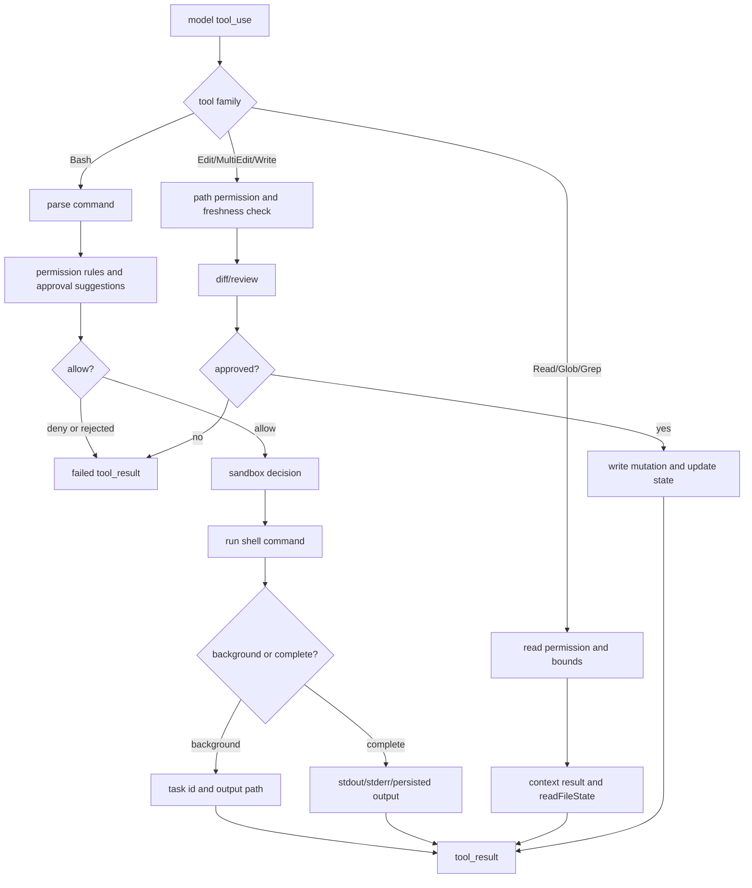

# 07 - Shell 与 File Editing

## 面试式回答

Claude Code 把 Bash 和文件修改都实现成工具，而不是让模型直接输出“请在磁盘上改成这样”。这样做的核心原因是：本地副作用必须被 schema、权限、路径校验、diff/review、并发控制、mtime 防护和失败反馈包起来。

Bash 是最开放的执行工具，可以运行测试、构建、git、包管理器，也可能删除文件、联网、启动后台服务或绕过简单字符串规则，所以它需要更强的控制：命令解析、permission rule、approval suggestion、sandbox、超时、中断、background task、输出截断和大输出持久化。文件工具则把读、搜、改、写拆开：Read/Glob/Grep 用于上下文获取；Edit/MultiEdit/Write 用于受控 mutation；每一次修改都要经过权限与文件状态检查，失败时把具体原因反馈给模型，让模型重新读文件、收窄 old_string 或请求用户确认。

## 这一章解决什么问题

这一章解释 Claude Code 如何把“模型想操作本机”变成可审计、可拒绝、可恢复的工具调用：

1. Bash 为什么是高风险通用执行面。
2. command parsing、approval suggestion、background command 和 output handling 如何降低风险。
3. Read/Glob/Grep 如何作为模型的上下文 acquisition 层。
4. Edit/MultiEdit/Write 如何把文件 mutation 变成可校验的原子动作。
5. diff/review 与失败反馈为什么是文件编辑体验的核心。

## 心智模型

Bash 是“逃逸能力最强”的工具：它不是某个固定 API，而是本地 shell 的入口。只要 Bash 被放开，模型就可能间接完成读写文件、网络访问、进程管理、git 改动等动作。因此系统不能只看工具名是 `Bash`，还要看 command 的结构、子命令、重定向、是否只读、是否后台执行、是否需要 sandbox。

文件工具则更像“带事务前置条件的编辑 API”。Read 建立事实基础，并记录 readFileState；Edit 要求 old_string 能唯一定位现有内容，并检查文件自上次读取后是否被改过；Write 用于创建或覆盖完整文件，也要求已有文件先被读取。失败不是异常噪音，而是给模型的控制信号：没有读过就先 Read，字符串不唯一就增加上下文，文件变了就重新读取。

## 实现逻辑

Bash 的工具定义在 `src/tools/BashTool/BashTool.tsx:420`。schema 包含 `command`、`timeout`、`description`、`run_in_background`、`dangerouslyDisableSandbox` 等字段，内部字段 `_simulatedSedEdit` 不暴露给模型，避免模型用伪装命令绕过预览和 sandbox。`isReadOnly()` 会用 read-only 约束判断 Bash 是否可以并发；`preparePermissionMatcher()` 会用 `parseForSecurity()` 拆分 compound command，让 `Bash(git *)` 这类规则能匹配子命令，而不是只看原始字符串。

command parsing 不只是为了好看。`src/utils/bash/ast.ts:381` 的 `parseForSecurity()` 返回 simple、too-complex 或 parse-unavailable。简单命令可以抽取 argv；复杂、控制字符、Unicode whitespace、zsh 特殊 expansion、解析超时等情况会倾向于 fail safe。Bash 规则在 `bashPermissions.ts` 里解析成 exact、prefix、wildcard。`getSimpleCommandPrefix()` 只为形如 `git commit`、`npm run` 的命令生成建议，避免把 `sh -c`、`sudo`、不安全 env var 或路径误做成宽泛 allow。

approval suggestions 发生在权限请求阶段。Bash permission UI 可以给出一次允许、按建议规则允许、编辑 prefix 后允许、拒绝等选项。建议规则来自命令解析和当前 allow list 状态，目标是让用户批准“这一类明确命令”，而不是无意中批准所有 Bash。对 shell 来说，建议过宽的成本很高，所以源码里有过宽 Bash permission 检测和 dangerous permission cleanup。

background command 是 Bash 的另一个特殊点。schema 支持 `run_in_background`，输出 schema 有 `backgroundTaskId`、`backgroundedByUser`、`assistantAutoBackgrounded`。长时间运行的命令可以被放到后台，结果里告诉模型任务 id 和输出路径；用户中断或超时也会变成结构化结果，而不是让 query loop 卡住。

output handling 分 UI 和模型两条线。`BashTool.mapToolResultToToolResultBlockParam()` 会合并 stdout、stderr、background info、interrupt 信息；大输出会持久化到 tool-results 目录，只把 preview 和路径返回给模型。这样既避免把上下文塞爆，也保留“需要时再 Read 完整输出”的路径。

Read/Glob/Grep 是上下文 acquisition 工具。`FileReadTool` 是只读且 concurrency safe，会做路径 deny、二进制类型、PDF 页范围、设备文件、文件大小和 token 限制；文本结果会按行号格式化给模型，并在 `readFileState` 里记录路径、mtime、范围和内容。Glob/Grep 走 read permission，用路径模式和忽略规则控制搜索范围，输出经过裁剪，服务于“找到相关文件和文本”，不是修改磁盘。

Edit 和 Write 是 controlled mutation。`FileEditTool` 在 `src/tools/FileEditTool/FileEditTool.ts:86`，输入是 `file_path`、`old_string`、`new_string`、`replace_all`。校验阶段会拒绝 old/new 相同、deny 路径、过大文件、未读文件、读取后被改过的文件、notebook 文件、找不到 old_string、多处匹配但未设置 replace_all 等情况。调用阶段再次读取当前文件、检查 mtime、定位实际字符串、保留 quote style、生成 patch，再写入并更新 readFileState。

`FileWriteTool` 在 `src/tools/FileWriteTool/FileWriteTool.ts:94`，用于创建或覆盖整文件。它同样检查 deny 路径、team memory secrets、UNC path、已有文件是否先 Read、读取后是否被其他进程修改。Write 的权限 UI 会读取旧内容生成整文件 diff，用户批准后才执行。

这个源码树的 CodeGraph 没有暴露独立的 `MultiEditTool` 符号；能验证到的是 `src/bridge/sessionRunner.ts:70` 的 `TOOL_VERBS` 会把 `MultiEdit` 这个工具名归一成 Editing 类状态展示。因此这里的 MultiEdit 说明聚焦 batch-edit 语义和归一化路径，而不是声称存在一个单独注册的 `MultiEditTool`。从语义上看，多处编辑仍应继承 Edit 的约束：同一批替换需要共享路径权限、文件新鲜度、diff/review 和失败反馈，不能退化为模型自由输出补丁。

## 源码入口

- `src/tools/BashTool/BashTool.tsx:223` / Bash input schema：command、timeout、description、background、sandbox override 的模型输入边界。
- `src/tools/BashTool/BashTool.tsx:420` / `BashTool`：Bash 工具定义、权限、执行、输出映射。
- `src/tools/BashTool/bashPermissions.ts:161` / `getSimpleCommandPrefix()`：approval suggestion 的 shell prefix 提取。
- `src/tools/BashTool/bashPermissions.ts:1663` / `bashToolHasPermission()`：Bash 内容级权限判断入口。
- `src/tools/BashTool/bashCommandHelpers.ts:181` / `checkCommandOperatorPermissions()`：复合命令和特殊 operator 的权限处理。
- `src/tools/BashTool/shouldUseSandbox.ts:130` / `shouldUseSandbox()`：命令执行前的 sandbox 决策。
- `src/utils/bash/ast.ts:381` / `parseForSecurity()`：安全相关的 shell AST 解析。
- `src/tools/FileReadTool/FileReadTool.ts:337` / `FileReadTool`：文件读取、token/size 限制、readFileState 更新、结果映射。
- `src/tools/GlobTool/GlobTool.ts:57` / `GlobTool`：文件路径发现。
- `src/tools/GrepTool/GrepTool.ts:160` / `GrepTool`：文本搜索与结果裁剪。
- `src/tools/FileEditTool/FileEditTool.ts:86` / `FileEditTool`：局部文件替换、校验、patch、mtime 防护。
- `src/tools/FileWriteTool/FileWriteTool.ts:94` / `FileWriteTool`：创建/覆盖文件、整文件 diff、写入防护。
- `src/components/permissions/FileWritePermissionRequest/FileWritePermissionRequest.tsx:15` / `ideDiffSupport`：Write 权限 UI 的 diff/review 支持。
- `src/bridge/sessionRunner.ts:70` / `TOOL_VERBS`：包含 Read、Write、Edit、MultiEdit、Bash 的用户可见动词映射；本源码树未暴露独立 `MultiEditTool` 符号，这里只作为 batch-edit 名称归一化锚点。

## 关键数据结构与状态

- `BashToolInput`：描述命令、timeout、description、后台执行和 sandbox override。
- `BashProgress`：Bash 运行中的增量输出、耗时、行数、字节数、task id 等进度。
- `ExecResult`：命令最终结果，包含 stdout、exit code、interrupted、background task、输出文件路径等。
- `readFileState`：文件工具共享的新鲜度状态。Read 写入它；Edit/Write 用它确认模型已经看过完整文件且文件未被其他人改动。
- `FileEditInput`：局部替换的最小语义单元，依赖 old_string 精准定位。
- `FileWriteToolInput`：整文件写入输入，风险更大，所以已有文件必须先读并展示 diff。
- `PermissionDecision`：文件工具和 Bash 最终都要回到 allow / ask / deny，只有 allow 会进入 `tool.call()`。
- `IDEDiffSupport` / `FileEdit`：权限 UI 可把模型建议转成 diff，用户可 review 或修改后再批准。

## 正常路径

Bash 正常路径：

1. 模型输出 `Bash` tool_use，带 command 和可选 description。
2. Runtime 解析 schema，运行输入校验，检查是否需要阻止明显 blocking 的 sleep/polling。
3. 权限层解析命令，匹配 Bash allow/deny/ask rule，必要时给用户 approval suggestion。
4. 用户或 auto mode 允许后，`shouldUseSandbox()` 决定 sandbox。
5. `BashTool.call()` 启动 shell，持续产出 progress，处理 timeout、interrupt、background。
6. 命令完成后，输出被裁剪、持久化或标记为 error，再作为 `tool_result` 给模型。

文件编辑正常路径：

1. 模型先用 Read/Glob/Grep 获取上下文。
2. Read 把文件内容和 mtime 写入 `readFileState`。
3. 模型发出 Edit/Write tool_use。
4. 工具校验路径、权限、文件新鲜度、old_string 匹配和敏感文件规则。
5. 权限 UI 展示 diff；用户或当前 mode 批准后执行写入。
6. 工具更新文件历史、diagnostics 和 `readFileState`，结果回到模型。

## 失败、边界与中断

Bash 解析失败或命令太复杂时，系统不会把“没看懂”当成安全。复杂命令会进入更保守的 ask/deny 路径；hook matcher 在解析不可靠时会选择触发 hook，而不是跳过 hook。

Bash 被用户拒绝、规则 deny、auto classifier block、PowerShell 需要交互但无 UI、sandbox override 不被 policy 允许，都会让 tool_use 停在执行前或产生失败 tool_result。命令运行中被中断时，结果包含 interrupted，模型可以决定重试、缩短命令或读取已有输出。

background command 的边界是“对话不中断，但进程仍受 runtime 管理”。输出会写入任务路径，模型需要通过后续 Read 或任务通知获取结果；后台并不意味着绕过权限。

Read 失败通常是上下文问题：文件不存在、路径不在 cwd、binary 不支持、页范围过大、设备文件会阻塞、内容超过限制。错误信息会提示类似路径或要求缩小范围。

Edit 失败是模型修正行为的重要反馈：未先 Read、文件被外部修改、old_string 找不到、多处匹配、文件过大、notebook 应使用 NotebookEdit、old_string 与 new_string 相同。模型应该根据错误重新读取或给出更精确 patch。

Write 失败常见于已有文件未读取、读取后被修改、路径被 deny、内容触发 secret 检查。整文件覆盖风险比局部 Edit 更高，所以 diff/review 和 read-before-write 更重要。

## Mermaid 图

## 设计取舍

第一，Bash 保留强能力，但用多层约束包住。完全禁用 shell 会让 agent 很难完成真实工程任务；完全放开 shell 又不可接受，所以系统选择解析、规则、approval、sandbox、timeout、background 和输出治理的组合。

第二，文件修改通过工具 API，而不是模型输出 patch 文本。工具 API 能做 schema 校验、路径权限、mtime 防护、old_string 唯一性、diff UI 和失败反馈；自由文本 patch 很难保证这些边界都生效。

第三，Read-before-Edit 是有意的摩擦。它迫使模型先观察当前文件，并给 runtime 一个新鲜度基线。这样能降低覆盖用户并发修改或基于陈旧上下文编辑的概率。

第四，Edit 偏向小范围精确替换，Write 偏向创建或整文件覆盖。两者都能修改文件，但风险模型不同：Edit 要求定位准确，Write 要求整文件 diff 和更强 review。

第五，大输出持久化是上下文管理取舍。把所有 Bash 输出直接塞回模型最简单，但会浪费上下文并拖慢循环；保存完整输出并返回 preview，让模型按需读取，是更可扩展的做法。

## 面试追问

1. 为什么 Bash 需要比 Read 更强的控制？
   Read 是有边界的上下文获取；Bash 是通用执行入口，可以间接读写、联网、删文件、启动进程，所以必须看 command 内容和执行方式。

2. 为什么 Edit 要求 old_string？
   old_string 是幂等和审计的锚点。它证明模型知道要改哪里，也让工具能检测找不到、多处匹配和文件变化。

3. 为什么修改前必须 Read？
   Read 写入 `readFileState`，Edit/Write 用它检查文件是否仍是模型看到的版本，避免覆盖用户或工具刚刚产生的变化。

4. MultiEdit 应该怎样理解？
   在这个源码树里没有可验证的独立 `MultiEditTool` 符号；文档里的 MultiEdit 指 batch-edit 名称和语义。它应继承 Edit 的路径权限、新鲜度、diff/review 和失败反馈，而不是把多个替换变成无约束 patch。

5. Bash 大输出为什么要保存成文件？
   模型通常只需要 preview 判断下一步；完整输出可能非常大，持久化后按需 Read 可以保护上下文窗口。

## 一句话总结

Shell 与 File Editing 的设计原则是：Bash 提供通用执行能力但必须被权限、解析、sandbox 和输出治理包住；文件修改必须通过 Read 建立事实、通过 Edit/MultiEdit/Write 受控变更，并用 diff 与失败反馈保护用户工作区。
