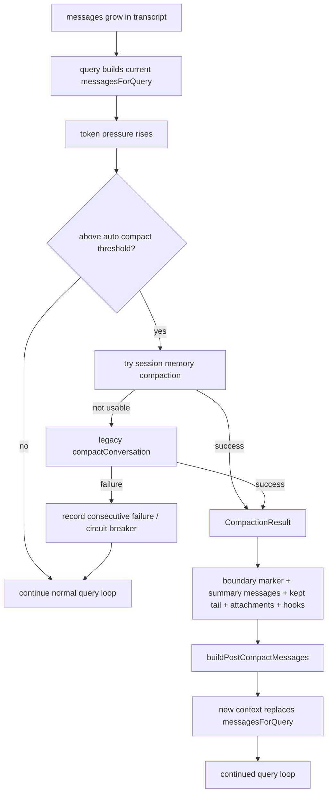

# 08 - Session History / Compaction / Resume

## 面试式回答

Claude Code 的会话能力可以分成两条线：一条是 durable transcript，负责把已经发生过的消息、工具结果、队列操作和 session metadata 持久化；另一条是 current model context，负责在某一次 query 里实际送给模型的消息窗口。二者不是同一个东西。transcript 追求完整可恢复，model context 追求可放进模型上下文且保持任务连续。

长时间 coding task 会不断累积用户消息、assistant 思考、tool_use、tool_result、附件、hook 结果和系统提醒。runtime 不能无限把这些都塞回模型，所以 query loop 会在进入模型请求前做上下文整理：先从 compact boundary 后取消息，再做 tool result budget、snip、microcompact、context collapse，最后根据 token pressure 触发 auto compact。auto compact 的产物不是简单的一段字符串，而是 `CompactionResult`：它包含新的边界标记、summary messages、需要保留的尾部消息、附件、hook 结果和 token 统计。query loop 再用 `buildPostCompactMessages()` 把这些重新拼成新的 model context，并继续当前请求。

resume 则从 durable history 方向解决问题：当进程重启、用户用 `--continue` 或 `--resume` 回到旧 session 时，runtime 不是恢复 JavaScript 调用栈，而是读取 transcript / remote session events，恢复 messages、session id、metadata、工作模式和 interruption state，再从这些历史消息构造下一轮上下文。也就是说，compact 负责“当前上下文变小后继续跑”，resume 负责“从持久历史重建工作上下文后继续跑”。

## 这一章解决什么问题

这一章回答五个问题：

1. transcript 和 current model context 为什么要分开理解。
2. 长时间 coding 任务为什么必然需要 compaction，而不是只靠更大的上下文窗口。
3. auto compact 如何根据 token pressure、阈值和失败计数决定是否启动。
4. `CompactionResult` 里有哪些东西，以及 summary 如何重新进入下一轮 context。
5. resume / continue 如何从 durable history 重建工作状态，而不是恢复旧进程的调用栈。

理解这一章后，面试里可以把会话系统讲成“完整历史可追溯，模型窗口可裁剪，压缩结果可回注，恢复从日志重放”，而不是把它讲成一个简单的聊天数组。

## 心智模型

可以把 Claude Code 的会话想成三层。

第一层是 transcript。它是事实日志，记录已经发生的用户输入、assistant 输出、tool_use、tool_result、queue operation、session metadata 等。它的价值是审计、resume、continue、UI 回放和跨进程恢复。它不等于每次都会完整发送给模型。

第二层是 working messages。进入 `query()` 时，runtime 会从完整 messages 里取出 compact boundary 之后的可用部分，再经过 tool result budget、snip、microcompact、context collapse 和 auto compact，得到这一轮要继续处理的 `messagesForQuery`。这一层是“当前工作视图”。

第三层是 model request context。它由 working messages、system prompt、user context、system context、tool schemas、attachments 和 queued command attachments 一起组成。真正的模型调用看到的是这个整理后的窗口。

compaction 的心智模型是“把旧上下文替换成可解释的摘要边界 + 新尾部”。boundary marker 告诉 runtime 这里发生过压缩；summary messages 告诉模型旧任务的关键事实；messagesToKeep 保留最近仍有细节价值的消息；attachments 和 hookResults 补回文件、计划、CLAUDE.md 或 session hook 带来的环境信息。

resume 的心智模型是“重读 durable history，而不是复活旧协程”。`--continue` 找最近会话，`--resume` 找指定 session / 文件 / URL，必要时先 hydrate remote events，然后恢复 messages 和 app state。恢复后仍然会走正常 query loop，所以后续仍可能再次 compact。

## 实现逻辑

query loop 入口处会先构造 `messagesForQuery = [...getMessagesAfterCompactBoundary(messages)]`。这一步说明 current model context 已经不是完整 transcript，而是从最近 compact boundary 之后开始的工作窗口。随后 runtime 会应用几类缩减策略：tool result budget 先限制聚合工具结果大小；history snip 可以删除一部分历史并把节省 token 数传给 auto compact；microcompact 做更细粒度的缓存/消息压缩；context collapse 在启用时把可折叠的历史投影成更小视图。

auto compact 的阈值在 `getAutoCompactThreshold()` 中计算。它先用模型上下文窗口减去为 summary 预留的输出 token，得到 effective context window，再减去 `AUTOCOMPACT_BUFFER_TOKENS`。这不是等模型报错才处理，而是在剩余空间进入危险区前主动 compact。`shouldAutoCompact()` 还会检查禁用开关、query source 递归保护、reactive-only / context-collapse 等 feature 分支，避免在 compact 自己或 session memory 子流程里再次触发 compact。

`autoCompactIfNeeded()` 是自动压缩的中心入口。它接收当前 messages、`ToolUseContext`、cache-safe 参数、query source、`AutoCompactTrackingState` 和 snip 节省的 token 数。它先看全局禁用和连续失败 circuit breaker，再调用 `shouldAutoCompact()`。如果需要压缩，它会构造 `RecompactionInfo`，记录这次是否是同一 query chain 内再次 compact、距离上次 compact 的 turn 数、上次 compact turn id、当前阈值和 query source。

真正执行时先尝试 `trySessionMemoryCompaction()`。session memory compact 会等待 session memory extraction 完成，读取 `lastSummarizedMessageId` 和 session memory 文件。如果没有 session memory、内容还是空模板、找不到上次摘要边界，或压缩后 token 仍超过 auto compact threshold，就返回 `null`，让 legacy compact 接手。对 resumed session，如果 session memory 有内容但没有 `lastSummarizedMessageId`，源码会把边界视为最后一条消息，避免错误地把未知历史边界当成可精确保留区。

session memory compact 成功时，会根据 `calculateMessagesToKeepIndex()` 选择尾部消息，并过滤旧 compact boundary，避免新旧边界互相覆盖。它还会运行 `processSessionStartHooks('compact')`，把 CLAUDE.md 等启动上下文重新补入 hook results，再通过 `createCompactionResultFromSessionMemory()` 形成 `CompactionResult`。

如果 session memory compact 不适用，`autoCompactIfNeeded()` 会调用 `compactConversation()`。成功后会重置 `lastSummarizedMessageId`，运行 post-compact cleanup，并返回 `compactionResult`。失败时，如果不是用户 abort，会记录错误；同时增加 `consecutiveFailures`，超过上限后 circuit breaker 会让之后的 query loop 跳过无望的 auto compact，避免同一个 session 反复消耗 API 调用。

query loop 拿到 `compactionResult` 后，不是把 summary 当成 UI 文本展示一下就结束，而是调用 `buildPostCompactMessages(compactionResult)`。这个函数按固定顺序生成新的上下文：boundary marker、summary messages、messagesToKeep、attachments、hookResults。query loop 会把这些 message yield 出去，并把 `messagesForQuery` 替换成 post-compact messages，后续模型调用就在这个新 context 上继续。

resume 的入口在 headless / print 路径的 `loadInitialMessages()`，交互式 resume 也会走同一类恢复工具函数。`--continue` 会调用 `loadConversationForResume(undefined, undefined)`，表示加载最近可恢复的会话；`--resume` 会先解析 session id、JSONL 文件或 URL，必要时 hydrate remote session / CCR v2 events，再调用 `loadConversationForResume(sessionId, jsonlFile)`。恢复成功后，runtime 会切换 session id、重置 session file pointer、`restoreSessionStateFromLog()`、`restoreSessionMetadata()`，并返回 messages、`turnInterruptionState` 和 agent setting。恢复失败、空 session、找不到 message uuid 或参数组合不合法时，会输出 load error 并退出或回到 startup hooks。

## 源码入口

- `src/services/compact/autoCompact.ts:51` / `AutoCompactTrackingState`：记录是否已 compact、turn counter、turn id 和连续失败次数。
- `src/services/compact/autoCompact.ts:72` / `getAutoCompactThreshold()`：根据 effective context window 和 buffer 计算 auto compact 阈值。
- `src/services/compact/autoCompact.ts:160` / `shouldAutoCompact()`：判断是否允许、是否需要自动压缩。
- `src/services/compact/autoCompact.ts:241` / `autoCompactIfNeeded()`：auto compact 的总入口，负责 session memory compact、legacy compact、cleanup 和失败 circuit breaker。
- `src/services/compact/sessionMemoryCompact.ts:514` / `trySessionMemoryCompaction()`：优先使用 session memory 生成 compaction result。
- `src/services/compact/compact.ts:299` / `CompactionResult`：压缩结果结构，包含 boundary、summary、attachments、hook results、保留消息和 token 统计。
- `src/services/compact/compact.ts:330` / `buildPostCompactMessages()`：把 compaction result 重新拼成 query loop 后续使用的 messages。
- `src/query.ts:367` / `autoCompactTracking`：query chain 内跟踪最近一次 compact 和失败次数。
- `src/query.ts:470` / `deps.autocompact(...)`：query loop 中主动 auto compact 的调用点。
- `src/query.ts:528` / `postCompactMessages`：主动 compact 成功后替换当前 `messagesForQuery`。
- `src/query.ts:1148` / `postCompactMessages`：reactive compact retry 后替换当前 state messages。
- `src/cli/print.ts:4893` / `loadInitialMessages()`：print/headless 模式处理 `--continue`、`--resume`、teleport 和 startup hooks。
- `src/utils/conversationRecovery.ts:456` / `loadConversationForResume()`：从 session id / transcript 文件恢复 conversation。
- `src/assistant/sessionHistory.ts:31` / `createHistoryAuthCtx()` 与 `src/assistant/sessionHistory.ts:73` / `fetchLatestEvents()`：远端 session history 分页读取锚点。

## 关键数据结构与状态

- `transcript`：durable history，保存完整会话事实。它支持 resume、continue、回放和审计，但不保证完整进入模型上下文。
- `messagesForQuery`：query loop 当前要处理的工作消息数组，会经过 boundary 裁剪、budget、snip、microcompact、context collapse 和 compact。
- `AutoCompactTrackingState`：query chain 内的 compact 状态，包含 `compacted`、`turnCounter`、`turnId`、`consecutiveFailures`。
- `CompactionResult`：压缩输出，核心字段是 `boundaryMarker`、`summaryMessages`、`attachments`、`hookResults`、`messagesToKeep` 和 token 统计。
- `boundaryMarker`：压缩边界。后续 `getMessagesAfterCompactBoundary()` 可以用它区分完整 transcript 和当前 compact 后工作窗口。
- `summaryMessages`：模型可见的历史摘要，承担“旧上下文重新进入新 context”的职责。
- `messagesToKeep`：不应被摘要完全替代的最近消息，通常包含未稳定完成的工具链路或对下一步很重要的尾部细节。
- `hookResults`：compact 或 startup 时重新注入的 hook 上下文，例如 CLAUDE.md、环境提示或 session start 结果。
- `turnInterruptionState`：resume 时随历史恢复的中断状态，让 runtime 知道上一次 turn 是否被打断。
- `session metadata`：session id、文件指针、工作模式、agent setting、worktree session 等恢复所需的非消息状态。

## 正常路径

一次长会话中 auto compact 的正常路径是：

1. 用户持续对同一个 coding task 追问，工具调用和 tool_result 让 transcript 持续增长。
2. 新一轮 `query()` 开始，runtime 从 compact boundary 后取出 `messagesForQuery`。
3. tool result budget、snip、microcompact、context collapse 先各自缩减上下文。
4. `deps.autocompact()` 进入 `autoCompactIfNeeded()`，根据 token usage、模型窗口、auto compact threshold、query source 和 tracking 判断是否压缩。
5. runtime 优先尝试 session memory compact；如果不适用，再调用 legacy `compactConversation()`。
6. 成功后得到 `CompactionResult`，并重置 session memory 边界、执行 post-compact cleanup。
7. query loop 调用 `buildPostCompactMessages()`，yield boundary、summary、保留消息、attachments、hook results。
8. `messagesForQuery` 被替换成 post-compact messages，当前 query loop 用新的 context 继续向模型请求。

一次 `--continue` 的正常路径是：

1. 用户启动 `claude --continue` 或等价入口。
2. `loadInitialMessages()` 识别 `options.continue`，调用 `loadConversationForResume(undefined, undefined)` 加载最近会话。
3. 如果找到结果，runtime 复用 session id，恢复 session state 和 metadata。
4. 返回恢复出的 messages、turn interruption state、agent setting。
5. 下一轮 query 仍按普通 query loop 处理；如果恢复出的 context 太长，仍会进入 compaction 流程。

一次 `--resume <session-id>` 的正常路径是：

1. runtime 解析 session 标识，支持 UUID、JSONL 文件和部分远端 URL 入口。
2. 如果是远端或 CCR v2，会先 hydrate session events 到本地可读历史。
3. `loadConversationForResume(sessionId, file)` 读取 durable history。
4. 可选 `--resume-session-at` 会把 messages 截断到指定 message uuid。
5. runtime 切换 session、恢复 app state 和 metadata，随后从这些 messages 开始新 turn。

## 失败、边界与中断

token 压力过大时，auto compact 可能不够。session memory compact 会在 post-compact token count 仍超过 threshold 时放弃，legacy compact 也可能因为 prompt too long、网络、用户 abort 或响应不完整失败。失败不是无限重试：`consecutiveFailures` 会向 query loop 回传，达到上限后 circuit breaker 在本 session 内跳过后续自动压缩尝试。

compact 自己不能递归 compact。`shouldAutoCompact()` 对 `querySource === 'session_memory'` 和 `querySource === 'compact'` 直接返回 false，避免摘要子流程又触发摘要，造成死锁或上下文循环。

resume 不能保证重建运行中的工具进程。它恢复的是 durable transcript、metadata 和可序列化状态，不是旧 Node 进程中的 Promise、AbortController、stream iterator 或 shell 子进程。恢复后如果历史里有中断状态，runtime 会把它作为下一轮上下文的一部分处理，但不会把旧调用栈接回去。

远端 session history 可能为空、不可访问或分页失败。`sessionHistory.ts` 的分页读取失败会返回 `null`，resume 路径会把空 session 和找不到 session 区分处理：远端新会话可以回到 startup hooks，本地找不到指定 session 则报错退出。

指定 `--resume-session-at` 时，如果 message uuid 不存在，runtime 会输出明确错误并退出。这样比“尽量从最近位置恢复”更保守，因为错误的截断点会让 model context 和用户预期不一致。

session memory compact 在 resumed session 上有特殊边界问题：session memory 文件可能有内容，但 `lastSummarizedMessageId` 不存在于当前 messages。源码对这种情况选择 fallback 或保守边界，而不是猜测哪些消息已被摘要覆盖。

## Mermaid 图

## 设计取舍

第一，transcript 和 model context 分离。这样历史可以完整保留，模型请求又可以只携带必要上下文。代价是实现上必须处理 boundary、summary、attachments、resume state 和 UI 回放之间的一致性。

第二，auto compact 采用阈值和 buffer，而不是等 API 报错。主动压缩减少 prompt too long 的概率，也给 summary 留出输出空间。代价是可能在用户还没有感知到问题时消耗一次额外模型调用。

第三，session memory compact 优先于 legacy compact。它可以复用后台抽取出的会话记忆，减少重新总结成本；但如果 session memory 缺失、为空、边界不可信或压缩后仍过大，就必须 fallback，避免用不可靠摘要污染 context。

第四，`CompactionResult` 是结构化结果，而不是纯文本 summary。结构化字段让 runtime 可以稳定排序 boundary、summary、tail、attachments 和 hook results，也能记录 token 统计与用户展示文案。

第五，resume 选择从 durable history 重建，而不是保存运行栈快照。这样跨进程、跨机器、远端 session 和 JSONL 文件都能复用同一套恢复逻辑；代价是运行中的工具、stream 和 AbortController 只能以历史结果或中断状态表达，不能原地继续。

第六，连续失败 circuit breaker 是成本控制。某些 session 已经不可压缩到阈值以下，继续每轮尝试只会浪费 API 调用。用失败计数停止自动尝试，比无限重试更符合长任务稳定性。

## 面试追问

1. transcript 和 current model context 有什么区别？
   transcript 是完整持久日志，用于恢复和审计；current model context 是本轮真正送给模型的工作窗口，可能已经被 boundary、snip、microcompact 或 compact 改写。

2. 为什么 compaction result 不只是一段 summary？
   因为模型继续任务不仅需要摘要，还需要 compact boundary、最近未摘要尾部、附件、hook results 和 token 统计。结构化结果能让 runtime 稳定重建下一轮 messages。

3. auto compact 为什么要有 threshold 和 reserved output tokens？
   summary 本身也要消耗输出 token。如果等窗口完全满了才 compact，摘要调用可能也无法完成。提前留 buffer 可以让 compact 有空间生成结果。

4. session memory compact 为什么可能 fallback？
   session memory 可能不存在、为空模板、边界 message id 找不到，或者生成后的 post-compact token count 仍超过阈值。此时继续使用它会比 legacy compact 更不可靠。

5. `--continue` 和 `--resume` 的差异是什么？
   `--continue` 通常加载最近会话；`--resume` 指定 session id、JSONL 文件或 URL。二者都从 durable history 重建 messages，而不是恢复旧调用栈。

6. resume 后会不会跳过 compaction？
   不会。resume 只是恢复初始 messages 和状态；恢复后的下一轮 query 仍会执行同一套上下文整理和 auto compact 检查。

## 一句话总结

Claude Code 的会话系统用 transcript 保存完整事实，用 compaction 把过长历史变成 boundary + summary + kept tail 的新 context，用 resume / continue 从 durable history 重建下一轮工作状态。
