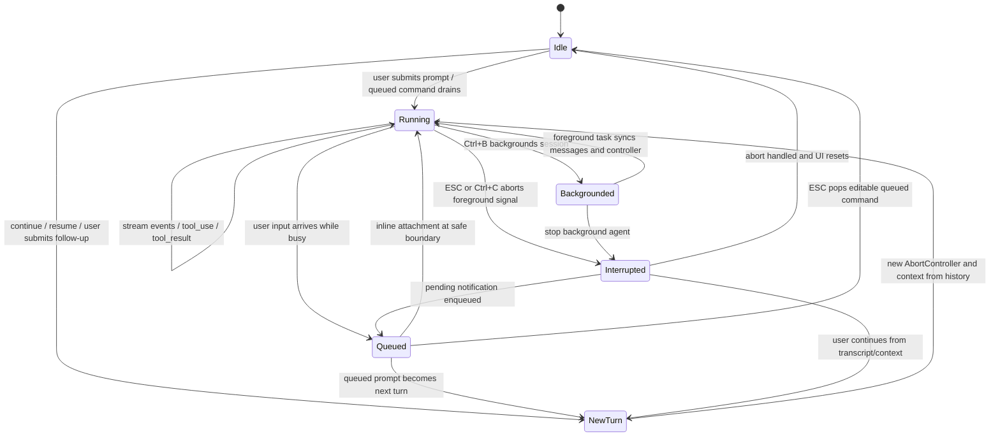

# 09 - Interrupt / Abort / Continue

## 面试式回答

Claude Code 的 interrupt 不是“把模型线程强行暂停后以后接着跑”，而是把 ESC、Ctrl+C、queue pop、agent stop 等用户动作转成 runtime event，再通过 `AbortController`、命令队列和 transcript 记录影响当前 turn。正在跑的 foreground request 会被 abort；Claude 空闲时 ESC 可能改为弹出 queued command；后台 agent 需要更明确的 kill 手势；continue 则是之后从历史和当前 context 开一个新 turn，而不是恢复被中断的调用栈。

核心实现分三块：`CancelRequestHandler` 注册 `chat:cancel` 和 `app:interrupt` keybinding；`AbortController` 贯穿 REPL、query、工具执行和部分后台任务；`messageQueueManager` 保存 interrupted input、task notification、pending command 等 turn 之间的异步输入。用户中断后，runtime 会清空 permission confirm queue、调用 `onCancel()` abort 当前 signal，工具和 stream 收到 abort 后生成可回到模型的取消结果或中断状态。后续 continue / resume 读取 durable history 和当前 messages，作为新请求继续推理。

## 这一章解决什么问题

这一章回答五个问题：

1. ESC 和用户 interruption 在 runtime 里是什么事件。
2. 为什么 foreground request、background session、subagent 和队列的中断行为不一样。
3. `AbortController` 的作用域如何穿过 query loop、工具执行和 foregrounded task。
4. queued commands / pending notifications 如何在中断后进入下一轮。
5. 为什么 continue 是从 history/context 发起新 turn，而不是恢复旧 stack。

理解这一章后，面试里可以把中断讲成“输入事件 -> runtime 状态转换 -> abort signal / queue 操作 -> transcript 可恢复结果 -> 新 turn 继续”，而不是把它讲成一个简单的键盘快捷键。

## 心智模型

interrupt 的心智模型是“当前 turn 的生命周期事件”。模型请求、stream 消费、工具执行和 permission UI 都在同一个 turn 的控制域里；ESC 或 Ctrl+C 到来时，runtime 先判断现在有没有可取消的 foreground task，如果有就 abort 它；如果没有正在运行的 request，但有 queued command，就把队列里的输入弹回 prompt；如果用户正在看 teammate / background agent 视图，则可以切回主线程或停止 agent。

`AbortController` 是一棵作用域树，而不是一个全局开关。主 REPL 或 QueryEngine 创建 request controller；工具执行、hook、background agent、attachment 处理可以拿到同一个 signal 或 child controller。父 controller abort 会传到 child；child abort 不会反向取消父流程。这样 foreground ESC 可以取消当前 request，而不会误杀所有后台 agent；停止后台 agent 则走 agent task 自己的 controller。

queue 的心智模型是“turn 之间的异步入口”。用户在模型忙时输入的新 prompt、task notification、orphaned permission、channel message 等都会进入 `messageQueueManager`。query loop 在合适的边界把部分 queued command 转成 attachments，让模型在当前或下一轮看到；PromptInput 也可以把 editable queued command 弹回输入区让用户修改。

continue 的心智模型是“从已有历史发起新 turn”。中断发生后，已经写入 transcript 的 assistant partial、tool_result、queue operation、interruption state 会成为 durable history 的一部分。用户继续时，runtime 根据这些 messages 和当前 context 再调用 query，而不是把上一次 async iterator、HTTP stream 或 shell process 接回来。

## 实现逻辑

交互式中断入口是 `CancelRequestHandler`。它本身不渲染 UI，而是在 keybinding context 中注册 `chat:cancel` 和 `app:interrupt`。handler 会先构造 analytics metadata，然后按优先级处理：如果存在未 abort 的 `abortSignal`，说明有 foreground task 正在运行，它会记录 cancel、清空 tool permission confirm queue、调用 `onCancel()` 并返回；如果没有运行任务但有 command queue，则调用 `popCommandFromQueue()`，把排队输入弹回 prompt；最后才走 fallback cancel。

这个优先级解释了 ESC 的行为差异：运行中时，ESC 是 interrupt；空闲且有 queued command 时，ESC 是取回输入；某些 overlay、history search、help、transcript screen、Vim insert mode、特殊输入模式空值、teammate view 会有自己的 escape handler，`CancelRequestHandler` 会通过 `isContextActive`、`isEscapeActive` 和 `isCtrlCActive` 避免抢事件。

Ctrl+C 走 `app:interrupt`。在 teammate view 中，它会先执行 `killAllAgentsAndNotify()`，停止 running local agent tasks、标记 agent 已通知、发 SDK terminated event，并 enqueue 一个面向模型的 task notification。之后如果当前仍有可取消 task 或 queued command，再复用 `handleCancel()`。这就是为什么“看后台 agent 时按中断”和“主会话 foreground request 中按 ESC”表现不同：它们对应的 controller 和状态归属不同。

`AbortController` 的创建集中在 `src/utils/abortController.ts`。`createAbortController()` 创建 controller 并设置 listener 上限，避免同一 signal 挂太多 listener 时出现 warning。`createChildAbortController(parent)` 会让 parent abort 单向传播到 child，同时用 WeakRef 避免父 signal 把废弃 child 长期强引用住。这个设计支持 request -> tool / hook / subtask 的取消传播，但不让局部取消反向污染父请求。

REPL、QueryEngine、headless print、attachment 处理、prompt submit、background agent registration 等都会创建或持有 abort controller。`useSessionBackgrounding()` 解释了 foreground/background 差异：当一个 background task 被 foregrounded，它会把该 task 的 messages 同步到主视图，并把 task 的 abort controller 设置成当前 ESC 处理对象；如果 task signal 已经 aborted，就清理 foregrounded state、重置 loading，并把它重新标记为 background。把 foregrounded task 重新 background 时，则清空主 messages、reset loading、`setAbortController(null)`。

命令队列由 `messageQueueManager` 维护，是 module-level singleton。`QueuedCommand` 至少包含 `value`、`mode`，还可以包含 priority、uuid、pasted contents、origin、isMeta、workload、agentId 等。`enqueue()` 默认 priority 为 `next`，用于用户输入；`enqueuePendingNotification()` 默认 priority 为 `later`，用于 task notification，避免系统消息饿死用户输入。`dequeue()` / `peek()` 按 `now > next > later` 和 FIFO 取命令；`clearCommandQueue()` 用于 ESC 类取消清理。

query loop 中，工具执行结束后的边界会读取队列。它会根据 Sleep 是否运行选择 drain `later` 或 `next`，过滤 slash command，并按 agent scope 隔离：main thread 只 drain `agentId === undefined`，subagent 只 drain 发给自己的 task notification。随后 `getAttachmentMessages()` 会调用 `getQueuedCommandAttachments()`，把 prompt / task-notification 等 inline notification 模式转成模型可见 attachment。附件里保留 prompt、source uuid、image paste ids、command mode、origin 和 isMeta。这样中断时产生的 pending notification 或用户忙时输入的 command 可以在安全边界进入模型，而不是直接插进正在 streaming 的消息中间。

continue 的实现不要理解成“继续上一帧”。在 print/headless 入口，`loadInitialMessages()` 对 `options.continue` 调用 `loadConversationForResume(undefined, undefined)`，拿最近 durable conversation；对 `options.resume` 解析指定 session，并恢复 messages、metadata、session id 和 interruption state。交互式场景里，用户中断后再提交新输入，也会通过正常 prompt submit / queue processor 进入新的 `query()`。旧 turn 的 abort signal 已经结束，新 turn 会有新的 controller 和新的 model request。

## 源码入口

- `src/hooks/useCancelRequest.ts:63` / `CancelRequestHandler`：注册 ESC / Ctrl+C cancel handler。
- `src/hooks/useCancelRequest.ts:87` / `handleCancel`：运行中优先 abort，空闲时优先 pop queued command。
- `src/hooks/useCancelRequest.ts:164` / `useKeybinding('chat:cancel', ...)`：ESC 取消绑定。
- `src/hooks/useCancelRequest.ts:200` / `handleInterrupt`：Ctrl+C / app interrupt，teammate view 下先停止 agent。
- `src/hooks/useCancelRequest.ts:225` / `handleKillAgents`：两次确认后停止 background agents。
- `src/utils/abortController.ts:16` / `createAbortController()`：创建带 listener 上限的 controller。
- `src/utils/abortController.ts:68` / `createChildAbortController()`：父子 abort 单向传播和 WeakRef cleanup。
- `src/screens/REPL.tsx:572` / `REPL()`：交互式 runtime 持有 abort controller、messages 和 prompt 状态。
- `src/QueryEngine.ts:200` / constructor：headless / SDK 路径创建 request abort controller。
- `src/hooks/useSessionBackgrounding.ts:27` / `useSessionBackgrounding()`：foregrounded background task 的 messages 和 abort controller 同步。
- `src/utils/messageQueueManager.ts:53` / `commandQueue`：统一 queued command singleton。
- `src/utils/messageQueueManager.ts:128` / `enqueue()`：用户输入等 next-priority command 入队。
- `src/utils/messageQueueManager.ts:142` / `enqueuePendingNotification()`：task notification 入队，默认 later priority。
- `src/types/textInputTypes.ts:299` / `QueuedCommand`：队列命令的数据结构。
- `src/utils/attachments.ts:1046` / `getQueuedCommandAttachments()`：把 queued command 转成模型可见 attachment。
- `src/query.ts:1570` / `queuedCommandsSnapshot`：query loop 在 tool boundary drain 队列并按 main/subagent scope 过滤。
- `src/cli/print.ts:4893` / `loadInitialMessages()`：`--continue` / `--resume` 从 durable history 重建初始 messages。

## 关键数据结构与状态

- `AbortController` / `AbortSignal`：当前 request、工具或 agent task 的取消信号。signal aborted 后，stream、工具或 foreground sync 会观察到中断。
- `abortController` in app state / REPL state：ESC 当前能取消的 foreground controller。background task 未 foreground 时不会自动成为主 ESC 的目标。
- `QueuedCommand`：排队输入或通知，包含 `value`、`mode`、priority、pasted contents、origin、isMeta、agentId 等。
- `commandQueue`：module-level singleton，React 通过 frozen snapshot 订阅，非 React 代码直接读取。
- `ToolUseConfirmQueue`：权限确认队列；cancel 时会清空，避免中断后还保留过期 approval。
- `turnInterruptionState`：resume 时恢复的 turn 级中断状态，说明旧 turn 如何结束。
- `foregroundedTaskId`：当前被拉到主视图的 background task。它决定 ESC 是否绑定到该 task 的 abort controller。
- `pending notification`：来自 agent、shell、schedule、framework 等异步任务的系统消息，通常作为 queued command 或 attachment 进入下一轮。
- `source_uuid` / `origin` / `agentId`：queued command 的来源和作用域，用于 transcript 归因、main/subagent 隔离和恢复。

## 正常路径

一次 foreground request 被 ESC interrupt 的正常路径是：

1. REPL 或 QueryEngine 为当前 turn 创建 `AbortController`，并把 signal 传给 query loop、工具执行和 UI。
2. 用户按 ESC，`chat:cancel` keybinding 命中 `CancelRequestHandler`。
3. handler 发现 `abortSignal` 存在且未 aborted，于是清空 tool confirm queue 并调用 `onCancel()`。
4. `onCancel()` abort 当前 controller，stream consumer、工具执行或 foregrounded task 观察到 signal。
5. query / tool 层生成取消结果、中断消息或停止状态，已经完成的部分进入 transcript。
6. UI 回到可输入状态；用户下一次输入会作为新 turn 进入 query loop。

一次用户在 Claude 忙时继续输入的正常路径是：

1. Prompt submit 或外部来源把输入包装成 `QueuedCommand`。
2. `messageQueueManager.enqueue()` 写入 module-level queue，并通知订阅者更新 queue preview。
3. 当前 query 不把 slash command 直接塞进 stream 中间；它只在合适边界 drain 可内联的 prompt / task-notification。
4. `getQueuedCommandAttachments()` 把可内联 command 转成 attachment，带上 source uuid、origin、image paste ids 和 mode。
5. 模型在当前或下一轮 context 中看到这条 queued input / notification。

一次 interrupted 后 continue 的正常路径是：

1. 旧 turn 因 abort、工具取消或用户停止 agent 结束，transcript 记录已经产生的消息、tool_result、queue operation 和 interruption state。
2. 用户提交新 prompt、运行 `--continue`，或 resume 到旧 session。
3. runtime 从 durable messages 和 metadata 构造新的 initial messages。
4. 新 turn 创建新的 `AbortController`，再次进入正常 query loop。
5. 模型根据历史中的中断结果和用户新指令继续，而不是接回旧 stream。

## 失败、边界与中断

运行中的 tool 不一定能瞬间停止。`AbortController` 只能发出 signal，具体工具要在执行、等待、stream 或进程管理点观察它。已经完成的 tool_result 仍可能被收集；未完成的工具可能产生 synthetic interrupted result，避免 assistant 的 tool_use 悬空。

permission prompt 期间按 ESC 会清空 tool confirm queue，并 abort 当前 request。这样可以防止用户取消后，旧 permission approval 继续作用到新 turn。

pending notification 不能随意插入 assistant stream 中间。query loop 只在工具边界把 queue 转 attachment；slash command 仍要等 turn 结束后走 command processor。这避免了 API 消息序列出现 assistant / tool_result / user prompt 非法 interleave。

background agent 和 foreground request 的取消范围不同。主会话 ESC 取消当前 foreground controller；后台 agent 默认继续跑。用户在 teammate view 中 Ctrl+C 或使用 kill-agents 手势时，才会遍历 running local agent tasks、调用 agent task 的停止逻辑，并 enqueue aggregate notification。

foregrounded background task 如果已经 aborted，`useSessionBackgrounding()` 会立刻清除 foregrounded state、reset loading，并把 abort controller 置空。否则 UI 会以为还有可取消请求，ESC 行为会错绑到已结束 task。

queued command 的 agent scope 很重要。队列是进程级 singleton，main thread 和 in-process subagents 共享它；query loop 必须按 `agentId` 过滤，否则某个 subagent 的 task notification 可能泄漏进主线程 context，或者用户 prompt 被错误送给 subagent。

continue 不能恢复旧 stack。HTTP stream、async iterator、shell child process、AbortController 和 React closure 都是进程内运行时对象；它们不会进入 durable transcript。continue 只能从 transcript / context 解释“上次停在哪里”，再用新 turn 继续。

## Mermaid 图

## 设计取舍

第一，interrupt 采用 cooperative cancellation。`AbortController` 能把取消意图传到 stream 和工具，但工具要在合适边界响应。这样比强杀所有运行对象更可控，也能生成模型可理解的取消结果。

第二，foreground 和 background 分开。用户按 ESC 通常期望停止眼前正在跑的请求，而不是杀掉所有后台 agent。后台 agent 停止需要更明确的 teammate view interrupt 或 kill-agents 手势。

第三，queue 是统一 singleton，但 drain 时按作用域过滤。统一队列让 React、headless、SDK、task notification 和 prompt preview 共用机制；按 `agentId` 过滤则避免 subagent 和 main thread 互相污染。

第四，queued input 通过 attachment 或下一 turn 进入模型，而不是直接插入 stream。这样保持 Anthropic messages 的 role / tool_use / tool_result 顺序合法，也让 slash command 继续走本地命令处理。

第五，continue 是 durable-history based。它牺牲了“原地恢复 stream”的幻想，换来跨进程、远端、JSONL 和 interrupted session 都能用同一套恢复路径。

第六，ESC 需要上下文感知。overlay、help、history search、Vim insert mode、special input mode 和 teammate view 都有自己的退出语义；统一抢 ESC 会让输入体验不可预测。

## 面试追问

1. ESC 一定会 abort 当前模型请求吗？
   不一定。只有存在未 aborted 的 foreground `abortSignal` 且当前 context 允许 cancel 时才会 abort。空闲但有 queued command 时，ESC 可能只是把 queued command 弹回输入框。

2. 为什么 background agent 不被主 ESC 一起杀掉？
   因为 background agent 有自己的 task state 和 abort controller。主 ESC 绑定 foreground request；停止后台 agent 是更明确的操作，避免误杀仍在执行的子任务。

3. `AbortController` 和 transcript 有什么关系？
   `AbortController` 是进程内取消机制，不会持久化；abort 的结果、工具取消消息、interruption state 和后续 notification 才会进入 transcript，供 continue / resume 理解。

4. queued command 为什么要转 attachment？
   因为 query 正在进行时不能随意插入新的 user message。attachment 让可内联的 queued prompt 或 task notification 在安全边界进入模型，并带上来源和图片等元数据。

5. continue 为什么不是恢复旧调用栈？
   旧调用栈包含 HTTP stream、async iterator、tool process 和 React closure，这些都不是 durable state。continue 只能从历史 messages 和 metadata 重建上下文，再发起新的模型 turn。

6. running tool 被 interrupt 后如何避免 tool_use 悬空？
   工具执行和 streaming executor 会尽量生成取消类或 synthetic tool_result，让模型消息序列保持配对，而不是留下没有结果的 tool_use。

## 一句话总结

Claude Code 的 interrupt / abort / continue 把 ESC 和 Ctrl+C 转成 runtime cancellation、queue 操作和 durable history；被打断的是当前 turn，继续时启动的是基于 transcript/context 的新 turn。
