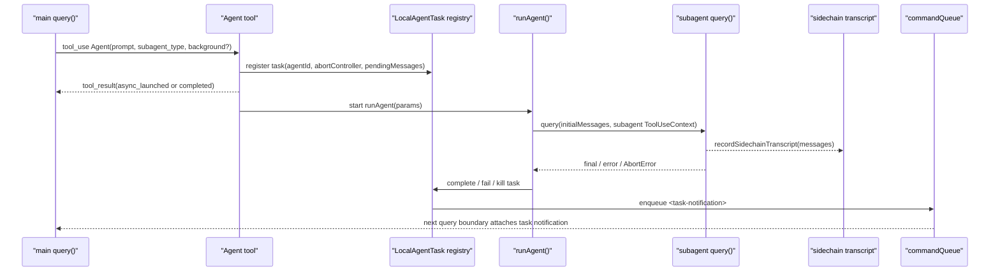

# 10 - Subagent Runtime

## 面试式回答

Claude Code 的 local subagent 不是新进程、不是单独的 MCP server，也不是另一个常驻 agent daemon。它本质上是主 agent 通过 `Agent` tool 启动的另一个 `query()` loop：运行在同一个 Node.js 进程和同一个 runtime 里，但拥有自己的 `agentId`、`agentType`、`ToolUseContext`、messages、工具集合、abort controller、sidechain transcript 和 task registry 记录。

主 agent 调用 `Agent` tool 时，`AgentTool.call()` 会先决定走 teammate、普通 subagent 还是 fork subagent；普通 local subagent 路径会构造 selected agent 的 prompt/system prompt、解析工具权限和隔离策略，然后调用 `runAgent()`。`runAgent()` 再创建隔离的 subagent context，最终进入同一个核心 `query()` 循环。同步模式下，`Agent` tool 等 subagent 完成后把结果作为当前 `tool_result` 返回；后台模式下，它先通过 `registerAsyncAgent()` 注册 `LocalAgentTask`，再 fire-and-forget 启动 `runAsyncAgentLifecycle()`，当前 `Agent` tool 只返回“已启动”的 `tool_result`，完成结果稍后通过 `<task-notification>` 回到主会话。

因此面试里最重要的一句话是：local subagent 的独立性来自运行时上下文隔离和 task 生命周期管理，不来自进程隔离。

## 这一章解决什么问题

这一章回答五个容易混淆的问题：

- `Agent` tool 到底是不是“调用另一个 agent server”。
- sync subagent 和 background subagent 在生命周期上差在哪里。
- subagent 如何隔离上下文，又如何共享 task registry。
- 主 agent 与 subagent 的结果、通知、消息如何流动。
- stopped/background agent 为什么能被 resume，以及 resume 到底恢复了什么。

读完这一章，应该能从源码角度说清楚：

```text
main query -> Agent tool -> register task -> subagent query -> sidechain transcript -> task notification -> main query
```

并且不会把 local subagent 误解成 MCP、worker thread 或外部服务。

## 心智模型

先把主 agent 的核心循环简化成：

```text
query(mainMessages, mainToolUseContext)
  -> callModel()
  -> 收 assistant message
  -> 执行 tool_use
  -> 把 tool_result 作为下一轮 user message
  -> 继续 query()
```

subagent 也是这个模型：

```text
runAgent()
  -> createSubagentContext()
  -> query(subagentMessages, subagentToolUseContext)
  -> 记录 sidechain transcript
  -> completed / failed / killed
```

所以 `Agent` tool 的角色不是“远程调用 agent”，而是“在当前 runtime 内启动另一个 agent loop”。差别不在 `query()` 是否不同，而在传给 `query()` 的输入、system prompt、tool pool、权限、abort controller 和 transcript 归属不同。

可以把 local subagent 看成三层协议叠加：

| 层次 | 关键对象 | 作用 |
|------|----------|------|
| LLM tool protocol | `tool_use` / `tool_result` | 主 agent 通过 `Agent` tool 发起任务，runtime 返回启动或完成结果 |
| Runtime task/message protocol | `LocalAgentTaskState`、`task-notification`、`pendingMessages` | 后台任务注册、进度、完成通知、运行中消息 |
| Durable transcript protocol | sidechain transcript、output file、metadata | 完整子会话记录、结果读取、resume 重放 |

这也是为什么它不是 MCP：MCP 可以是某个 agent 调用外部工具时经过的协议，但 main local agent 与 local subagent 之间靠的是 Claude Code 自己的 tool/task/message 层。

## 实现逻辑

源码顺序可以按 runtime 时间线读。

第一步，模型在主 `query()` 里产生 `tool_use: Agent(...)`。工具 schema 来自 `AgentTool`，其中 `subagent_type` 是可选字段；当 fork gate 开启时，省略 `subagent_type` 表示 fork，当 fork gate 关闭时，省略则走默认 general-purpose。`run_in_background` 字段也会根据 background/fork gate 条件被暴露或隐藏。

第二步，`AgentTool.call()` 做分流和校验。它会检查是否是 teammate path、普通 selected agent path 或 fork path；校验 team 限制、agent type 权限、required MCP servers、递归 fork guard、isolation/worktree 等运行条件；然后根据 normal/fork 分别构造 `promptMessages` 和 system prompt。普通 subagent 通常拿到 selected agent 的 system prompt 和一个简单 user prompt；fork path 则尽量复用 parent rendered system prompt 和 parent messages prefix，这一章先讲普通 runtime，fork 细节放到第 11 章。

第三步，决定 sync 还是 background。同步路径会在当前 tool call 内直接 `for await` 消费 `runAgent()` 的消息，直到 subagent 完成，然后把最终结果映射成当前 `Agent` tool 的 `tool_result`。后台路径会先调用 `registerAsyncAgent()` 创建 task，再启动 `runAsyncAgentLifecycle()`，并立即把“agent 已在后台运行”的结果返回给主 agent。

第四步，`runAgent()` 构造真正的 subagent query 环境。它会计算 resolved model、生成或接收 `agentId`，把 `filterIncompleteToolCalls(forkContextMessages) + promptMessages` 作为 `initialMessages`，选择文件状态缓存，解析 user/system context，按 agent permissionMode 覆盖父权限模式，解析工具集合，并选择 abort controller。普通路径通过 `resolveAgentTools(...)` 按 agent definition 过滤工具；fork path 使用 `useExactTools` 以保持工具 schema 稳定。

第五步，`createSubagentContext()` 创建隔离的 `ToolUseContext`。默认会创建子 abort controller，包装 `getAppState` 以避免后台 agent 触发不合适的 permission prompt，clone `readFileState`、memory triggers、`contentReplacementState`，新建 `queryTracking`，并把 UI callbacks / `setAppState` 做成 no-op，除非显式选择共享。不过它保留 `setAppStateForTasks` 到 root store，因为 task registry、progress、kill/complete 状态必须回写到全局 `AppState.tasks`。

第六步，subagent 进入 `query()`。这个 `query()` 和主 agent 的 loop 是同一个核心实现，只是 `messages`、`systemPrompt`、`toolUseContext`、`querySource`、`maxTurns` 等参数不同。`runAgent()` 会把每条产出的 message 写入 sidechain transcript，并把 stream 往外 yield 给 sync path 或 async lifecycle。

第七步，后台生命周期收尾。`runAsyncAgentLifecycle()` 消费 `runAgent()` stream，更新 retained task messages、progress tracker 和 SDK progress；正常完成时 finalize result、complete task，然后 enqueue `<task-notification>`；AbortError 时 kill task 并带 partial result 发 killed notification；其他错误则 fail task 并发 failed notification。它还会在 finally 清理 invoked skills 和 dump state。

## 源码入口

建议从这些文件进入：

| 文件 | 入口 | 读什么 |
|------|------|--------|
| `src/tools/AgentTool/AgentTool.tsx` | `AgentTool` / `call()` | `Agent` tool schema、teammate/normal/fork 分流、sync/background 分支 |
| `src/tools/AgentTool/runAgent.ts` | `runAgent()` | subagent 如何构造 `initialMessages`、权限、tools、system prompt、abort controller，并进入 `query()` |
| `src/utils/forkedAgent.ts` | `createSubagentContext()` | `ToolUseContext` 如何被复制、隔离和少量共享 |
| `src/tools/AgentTool/agentToolUtils.ts` | `runAsyncAgentLifecycle()` | background agent stream 消费、完成/失败/中断收尾、通知入队 |
| `src/tasks/LocalAgentTask/LocalAgentTask.tsx` | `LocalAgentTaskState`、`registerAsyncAgent()`、`registerAgentForeground()` | task registry、pending messages、sidechain output、abort controller |
| `src/tools/AgentTool/resumeAgent.ts` | `resumeAgentBackground()` | stopped/background agent 如何通过 transcript + metadata 重建 |
| `src/tools/SendMessageTool/SendMessageTool.ts` | `SendMessageTool` | running agent 写 `pendingMessages`，stopped agent 触发 resume |
| `src/tools/TaskOutputTool/TaskOutputTool.tsx` | `TaskOutputTool` | 读取 task 当前状态或等待完成结果 |

这些入口连起来，就是本章的主路径：`AgentTool.call()` 决定怎么启动，`registerAsyncAgent()` 或 `registerAgentForeground()` 记录 task，`runAgent()` 创建子上下文并跑 `query()`，`runAsyncAgentLifecycle()` 把后台结果转成通知。

## 关键数据结构与状态

`LocalAgentTaskState` 是后台 local subagent 的 runtime 记录。关键字段包括：

| 字段 | 含义 |
|------|------|
| `agentId` | 子 agent 的 task id 和 transcript id |
| `prompt` | 启动该 agent 的原始任务描述 |
| `selectedAgent` | resume 时用来恢复 agent definition |
| `agentType` | `general-purpose`、自定义 agent 或 `fork` 等类型 |
| `abortController` | kill background agent 的控制器 |
| `progress` / token/tool counters | UI、SDK progress 和通知摘要使用 |
| `messages` / `retain` | retained task transcript，用于查看或保留 task 内容 |
| `retrieved` | 结果是否已被读取 |
| `isBackgrounded` | foreground local agent 是否已经转后台 |
| `pendingMessages` | `SendMessage` 写给 running subagent 的 mailbox |
| `diskLoaded` / `evictAfter` | task 从磁盘恢复或淘汰相关状态 |

`ToolUseContext` 是 subagent 和主 agent 真正隔离的核心。subagent 会有自己的：

- `agentId` 和 `agentType`。
- `messages`，来自普通 prompt 或 forked messages。
- `options.tools` / model / permission 相关 options。
- `abortController`。
- `readFileState`、`contentReplacementState`、`queryTracking`。
- `getAppState` wrapper 和多数 no-op UI callbacks。

但为了 task lifecycle 能被 UI、main thread、kill/resume 看到，它仍会通过 `setAppStateForTasks` 回写 root task store。

sidechain transcript 是另一个关键状态。`registerAsyncAgent()` 会把 task output 初始化成指向 agent transcript 的 symlink；`runAgent()` 会记录 initial messages 和后续每条 message。`TaskOutput` 和 resume 都依赖这条 durable record。

## 正常路径

同步 local subagent 正常路径：

```text
main query()
  -> assistant emits Agent tool_use
  -> AgentTool.call()
  -> build selected agent prompt/system prompt/tools
  -> registerAgentForeground()
  -> runAgent()
  -> createSubagentContext()
  -> subagent query()
  -> recordSidechainTranscript()
  -> finalizeAgentTool()
  -> return completed tool_result to main query()
```

后台 local subagent 正常路径：

```text
main query()
  -> assistant emits Agent tool_use
  -> AgentTool.call()
  -> registerAsyncAgent()
  -> start runAsyncAgentLifecycle() without await
  -> return async_launched tool_result to main query()

background lifecycle
  -> runAgent()
  -> createSubagentContext()
  -> subagent query()
  -> recordSidechainTranscript()
  -> completeAsyncAgent()
  -> enqueueAgentNotification(<task-notification>)

later main query boundary
  -> drain queued task-notification
  -> attach notification to main model context
```

运行中通信路径：

```text
main agent uses SendMessage
  -> SendMessageTool finds LocalAgentTask
  -> queuePendingMessage(agentId, message)
  -> AppState.tasks[agentId].pendingMessages append
  -> subagent later collects attachments
  -> drainPendingMessages()
  -> message becomes queued_command attachment for that subagent
```

读取输出路径：

```text
main agent uses TaskOutput or Read(output file)
  -> TaskOutputTool reads current task state
  -> block=false returns current status
  -> block=true waits for waitForTaskCompletion()
  -> output includes retrieval_status/task_id/task_type/status/output/error
```

## 失败、边界与中断

local subagent 的失败边界主要来自权限、工具集合、abort、resume 和上下文压力。

权限边界：`AgentTool.call()` 会校验 selected agent 是否允许、required MCP servers 是否满足、team/in-process teammate 是否允许 background local agent。进入 `runAgent()` 后，agent 的 permission mode 可以覆盖父上下文，但父上下文若处于 bypass、acceptEdits、auto 等特殊模式会影响继承规则。async non-bubble agent 会设置 `shouldAvoidPermissionPrompts`，避免后台任务突然向用户弹交互式权限请求。`allowedTools` 会替换 session allow rules，但保留 SDK CLI allow rules。

工具边界：普通 subagent 通过 `resolveAgentTools(...)` 得到工具池；fork path 使用 exact parent tools。工具池不同会改变模型可见 tool schema，也会改变 agent 能做什么。缺工具不是 runtime 自动补全的问题，而是 selected agent definition、MCP availability、permission 和 feature gate 的结果。

中断边界：sync subagent 默认跟随 parent abort controller，所以主 turn 被 ESC 取消时，sync subagent 也会停。background subagent 有 task 自己的 controller；主 turn ESC 通常不会杀已经注册的 background task，kill agents 或显式 task kill 才会 abort 它。`runAsyncAgentLifecycle()` 捕获 AbortError 后会标记 killed，并用 partial result enqueue killed `<task-notification>`。

失败边界：background lifecycle 中普通异常会进入 failed task 状态并 enqueue failed notification；这不是静默失败。主 agent 后续通过 task notification 或 `TaskOutput` 看到失败摘要和 error。

resume 边界：`resumeAgentBackground()` 不是恢复旧 JS generator。它读取 agent transcript 和 metadata，过滤 unresolved/incomplete messages，重建 `contentReplacementState`，验证 worktree path 是否还有效，恢复 selected agent；如果 metadata 表示 fork，则选 `FORK_AGENT`。之后它追加新的 prompt message，重新 `registerAsyncAgent()` 并重新跑 `runAgent(... isAsync: true ...)` 和 `runAsyncAgentLifecycle()`。所以 resume 的本质是 transcript replay + new background run。

上下文压力边界：subagent 也会进入自己的 `query()`，因此同样受模型上下文窗口、tool schema 大小、messages 历史、sidechain replay 内容影响。普通 subagent 通过更小的 prompt 和工具集降低压力；fork subagent 则故意携带 parent prefix 来换 prompt cache 和上下文连续性，具体取舍见第 11 章。

## Mermaid 图



## 设计取舍

第一，local subagent 选择同进程 async lifecycle，而不是独立进程或 MCP server。好处是启动成本低、共享 runtime 能力简单、工具和权限系统复用充分；代价是它不是强隔离沙箱，内存、event loop、root AppState 都在同一个宿主里，隔离主要靠 `ToolUseContext` 和 task 状态约束。

第二，background agent 选择 task registry + sidechain transcript，而不是把所有结果塞回当前 `tool_result`。好处是主 agent 可以继续工作，多个 agent 可以并发，长任务可以稍后通知和读取；代价是通信变成异步协议，主 agent 必须理解 `task-notification`、output file、`TaskOutput` 和 `SendMessage`。

第三，running subagent 的消息采用 `pendingMessages` mailbox，而不是实时打断当前 API call。好处是实现简单，不破坏模型 streaming / tool execution 的边界；代价是送达时机是下一次 attachment collection，不是即时 push。

第四，resume 选择 transcript replay，而不是保存并恢复旧 generator。好处是 durable、跨中断、跨 evict 更可靠；代价是必须过滤 incomplete tool calls、重建 content replacement state，并接受“这是新一轮 background run”的语义。

第五，权限 prompt 在后台任务中被谨慎处理。async non-bubble agent 尽量避免后台弹权限请求，防止用户体验被后台任务劫持；需要交互式权限的场景要通过 bubble/父上下文或其他显式机制处理。

## 面试追问

**问：local subagent 是不是 MCP server？**
不是。local subagent 是同一 Claude Code runtime 里的另一个 `query()` loop。MCP 可能被 agent 用来调用外部工具，但 main agent 到 local subagent 的启动和通信靠 `Agent` tool、task registry、queue、pending messages、sidechain transcript。

**问：`Agent` tool 返回结果时，subagent 一定已经完成了吗？**
不一定。sync path 会等完成并返回 completed `tool_result`；background path 只返回 async launched，最终结果通过 `<task-notification>` 或 `TaskOutput` 获取。

**问：ESC 会不会杀后台 subagent？**
通常不会杀已经注册的 background local agent。ESC 取消当前 foreground query；background task 有自己的 abort controller，需要 kill agents 或显式 task kill 才会停。sync subagent 默认跟随 parent controller，因此会受到 ESC 影响。

**问：主 agent 如何给运行中的 subagent 发消息？**
通过 `SendMessageTool` 写入目标 task 的 `pendingMessages`。subagent 下次收集 attachments 时 `drainPendingMessages()`，把消息变成 queued command attachment。它不是实时 RPC。

**问：`TaskOutputTool` 和 `<task-notification>` 有什么区别？**
`task-notification` 是 background lifecycle 完成/失败/被 kill 后自动 push 到 queue 的通知；`TaskOutputTool` 是主 agent 主动 pull task 状态或等待完成结果。现在源码里 `TaskOutputTool` 也标注为更偏兼容路径，读取 output file 是更直接的方式。

**问：resume 是继续原来的 async generator 吗？**
不是。`resumeAgentBackground()` 读取 sidechain transcript 和 metadata，过滤不完整消息，重建上下文，再启动新的 background `runAgent()`。

**问：subagent 的输出最终去哪？**
同步模式进当前 `Agent` tool 的 `tool_result`；后台模式写 sidechain transcript / output file，更新 `LocalAgentTaskState`，并通过 `<task-notification>` 告诉主 agent。

## 一句话总结

Claude Code 的 local subagent 是由 `Agent` tool 启动的另一个同进程 `query()` loop；它靠 `ToolUseContext` 隔离运行上下文，靠 `LocalAgentTask`、sidechain transcript、`task-notification`、`pendingMessages` 和 `TaskOutput` 完成后台生命周期与通信。
