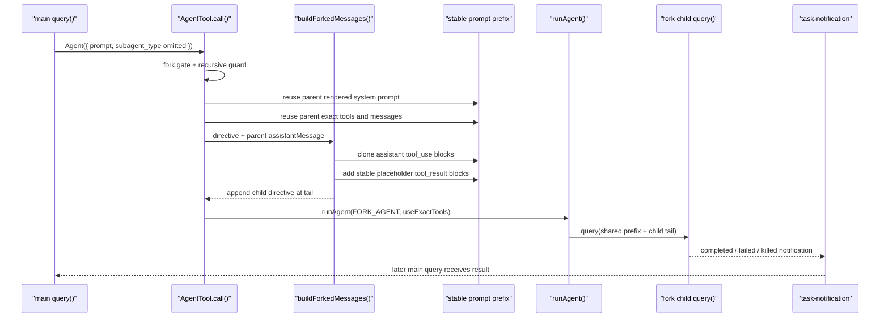

# 11 - Fork Subagent 与 Prompt Cache

## 面试式回答

fork subagent 解决的是“从主 agent 当前上下文分出后台分支，并尽量复用 prompt cache”的问题。普通 subagent 像是给一个 specialist 重新写一段任务 prompt；fork subagent 则更像在主 agent 当前请求的尾部开分支：复用 parent rendered system prompt、parent messages prefix、model、thinking 配置和 exact tools，只把每个 child 真正不同的 directive 放到最后。

它的关键实现是 `buildForkedMessages(directive, assistantMessage)`。当主 assistant message 里已经有多个 `tool_use` 时，fork child 会克隆完整 assistant message，保留 thinking/text/tool_use blocks；然后构造一个 user message，为每个 `tool_use` 放入稳定的 placeholder `tool_result`，最后追加 per-child directive。这样多个 fork child 在最后一段 directive 之前的请求 prefix 尽可能 byte-identical，prompt cache 更容易命中。

所以面试里可以这样回答：fork 不是“普通 Agent prompt 的快捷方式”，而是一种 cache-aware 的分支执行策略。它继承父上下文，保持昂贵前缀稳定，把差异推迟到 prompt 尾部；普通 subagent 则从 selected agent definition 重新构造 system prompt、messages 和 tool pool，更适合 specialist delegation。

## 这一章解决什么问题

这一章解释：

- 为什么需要 fork agent，而不是只用普通 subagent。
- forked messages 如何保持 prefix similarity。
- 为什么 stable prompt prefix 能帮助 prompt cache。
- fork prompt 尾部到底改了什么。
- 哪些因素会破坏 cache compatibility。
- fork 和 normal subagent 在 runtime、上下文、工具和权限上的差异。

它承接第 10 章：fork 仍然是 local subagent runtime 的一条路径，仍然会注册 task、跑 `runAgent()`、进入 `query()`、写 sidechain transcript、通过 `task-notification` 通知主 agent。区别在于 fork path 构造 prompt 和 tools 的目标是“尽可能像 parent request”。

## 心智模型

普通 subagent 的心智模型：

```text
main agent
  -> Agent tool(prompt, subagent_type="specialist")
  -> selected agent system prompt
  -> selected agent tools
  -> simple user prompt
  -> independent subagent query()
```

fork subagent 的心智模型：

```text
main agent current request prefix
  -> same rendered system prompt
  -> same exact tool schema
  -> same parent messages
  -> same assistant tool_use structure
  -> same placeholder tool_result blocks
  -> only final child directive differs
```

这里要区分两条相近但不同的实现路径：`AgentTool` implicit fork 显式复用的是 parent rendered system prompt、parent messages prefix、exact tools 和 forked prompt tail；它进入 `runAgent()` 后仍会重新读取 user/system context，除非调用方显式 override。`src/utils/forkedAgent.ts` 里的 `runForkedAgent()` helper 则有 `CacheSafeParams`，可以把 systemPrompt、userContext、systemContext、toolUseContext、forkContextMessages 作为一组 cache-safe 参数传入。两者共同原则是“让 cache-sensitive 前缀尽量稳定”，但不能把 helper 的参数保证直接套到 `AgentTool` fork path 上。

prompt cache 的基本直觉是：请求越靠前的内容越稳定，越容易复用 cache；差异越早出现，后面的大段内容越难复用。fork subagent 的设计就是把“不同”尽量后移。

这也是 fork agent 存在的原因：主 agent 已经读了很多文件、构造了很长上下文、拥有一组稳定工具 schema 时，如果要并发探索多个方向，重新创建多个普通 subagent 会让每个请求很早分叉；fork 则让多个 child 像同一个 parent prefix 的不同尾巴。

## 实现逻辑

第一步，feature gate 决定 fork 是否可用。`isForkSubagentEnabled()` 要求 `FORK_SUBAGENT` feature 开启，同时排除 coordinator mode 和 non-interactive session。开启后，`Agent` tool schema 中 `subagent_type` 可省略；省略时不再表示 general-purpose，而是触发 implicit fork。源码防递归有两层：primary guard 看 `toolUseContext.options.querySource === agent:builtin:fork`，因为它能跨 autocompact 消息改写保留下来；message scan `isInForkChild(messages)` 是 fallback，用 fork boilerplate 检测没有正确传 querySource 的路径。

第二步，`AgentTool.call()` 进入 fork path。它会优先使用 parent 已经渲染好的 system prompt；如果没有可用的 parent rendered system prompt，才重新计算。这样做是为了避免 GrowthBook 或动态上下文冷热状态导致 system prompt 字节不一致，从最前面破坏 cache。fork path 同时使用 parent 当前 tools，并用 `useExactTools` 让 `runAgent()` 不再通过普通 `resolveAgentTools(...)` 重排或过滤工具。

第三步，fork agent 使用合成的 `FORK_AGENT` definition。它不是用户可选择的普通 built-in agent，而是 fork path 的 synthetic definition：`agentType` 是 `fork`，tools 是 `['*']`，model 是 inherit，permissionMode 是 bubble，maxTurns 是 200。它的 `getSystemPrompt` 不承担实际 prompt 构造，因为 fork path 会通过 override 传入 parent rendered system prompt。

第四步，`buildForkedMessages()` 构造 child prompt tail。它接收 child directive 和 parent 当前 assistant message：

```text
buildForkedMessages(directive, assistantMessage)
  -> clone full assistant message
  -> collect all tool_use blocks
  -> if no tool_use: return simple user message with child directive
  -> else build user message:
       tool_result(tool_use_id=A, content=stable placeholder)
       tool_result(tool_use_id=B, content=stable placeholder)
       ...
       text(child directive wrapped in fork boilerplate)
```

这里必须补 `tool_result`，因为模型 tool protocol 要求 assistant 的 `tool_use` 后面有对应 user `tool_result`。如果不同 fork child 的 `tool_result` 内容不同，差异会紧跟在 tool_use 后出现；所以源码使用稳定 placeholder，例如 `Fork started - processing in background` 这一类固定文本，让多个 child 在 directive 之前保持相同结构。真正变化的只有最后的 child directive。

第五步，`runAgent()` 仍然按第 10 章的 subagent runtime 执行。它会把 `filterIncompleteToolCalls(forkContextMessages) + promptMessages` 组成 initial messages，设置 agentId，解析 model、permission、context、tools，创建 `ToolUseContext`，进入 `query()`，写 sidechain transcript。fork 的特殊性不在于另有一个 query engine，而在于 `systemPrompt`、`forkContextMessages`、`promptMessages`、`availableTools`、`useExactTools`、`contentReplacementState` 这些 cache-sensitive 参数被更谨慎地传入。对 `AgentTool` implicit fork 来说，user/system context 仍由 `runAgent()` 当场读取，所以它们是 cache 风险边界；对 `runForkedAgent()` helper 来说，这些 context 可以通过 `CacheSafeParams` 明确复用。

## 源码入口

建议按这条线读：

| 文件 | 入口 | 读什么 |
|------|------|--------|
| `src/tools/AgentTool/forkSubagent.ts` | `isForkSubagentEnabled()` | fork feature gate、coordinator/non-interactive 排除 |
| `src/tools/AgentTool/forkSubagent.ts` | `FORK_AGENT` | synthetic fork agent definition：inherit model、bubble permission、exact tools 目标 |
| `src/tools/AgentTool/forkSubagent.ts` | `isInForkChild()` | 递归 fork guard |
| `src/tools/AgentTool/forkSubagent.ts` | `buildForkedMessages()` | 克隆 assistant message、补 placeholder `tool_result`、把 directive 放最后 |
| `src/tools/AgentTool/forkSubagent.ts` | `buildWorktreeNotice()` | fork child 在 isolated worktree 时如何提醒 inherited paths 属于 parent cwd |
| `src/tools/AgentTool/AgentTool.tsx` | `AgentTool.call()` fork branch | parent rendered system prompt、forked messages、exact tools、递归限制 |
| `src/tools/AgentTool/runAgent.ts` | `runAgent()` | forkContextMessages + promptMessages、useExactTools、onCacheSafeParams |
| `src/utils/forkedAgent.ts` | `CacheSafeParams` / `ForkedAgentParams` | 哪些参数影响 cache compatibility |
| `src/utils/forkedAgent.ts` | `createSubagentContext()` | fork child 仍然如何隔离 `ToolUseContext` |

如果只想抓核心实现，先读 `buildForkedMessages()`，再读 `AgentTool.call()` 中 fork path 怎么把 parent prompt/tools/messages 传给 `runAgent()`。

## 关键数据结构与状态

`CacheSafeParams` 描述 fork cache 要保持稳定的核心参数：

| 字段 | 为什么重要 |
|------|------------|
| `systemPrompt` | system prompt 在请求最前面，字节不一致会最早破坏 cache |
| `userContext` | 会被拼到请求上下文里，影响 prefix |
| `systemContext` | 会附加到 system prompt，影响 prefix |
| `toolUseContext` | 包含 tools、model/options、permission 等运行时请求参数 |
| `forkContextMessages` | parent context messages，是 fork child 共享前缀的重要部分 |

`ForkedAgentParams` 则是启动 fork child 的参数包：

| 字段 | 作用 |
|------|------|
| `promptMessages` | `buildForkedMessages()` 产出的 child tail |
| `cacheSafeParams` | parent query 中捕获的 cache-sensitive 参数 |
| `canUseTool` | fork child 的权限裁决函数 |
| `querySource` / `forkLabel` | analytics、递归保护和来源标识 |
| `overrides` | 可覆盖 `ToolUseContext` 的细节，如 readFileState、contentReplacementState |
| `maxOutputTokens` / `maxTurns` | 输出和轮次上限；不同 output token 设置可能改变 thinking budget |
| `skipTranscript` / `skipCacheWrite` | 是否跳过 sidechain transcript 或最后消息 cache write |

`FORK_AGENT` 是 synthetic agent definition，不是普通 agent 配置文件。它的关键状态是：

- `agentType: 'fork'`，方便 metadata、resume 和 analytics 识别。
- `tools: ['*']`，配合 exact tools 继承 parent 当前工具池。
- `model: 'inherit'`，保持模型和上下文窗口一致。
- `permissionMode: 'bubble'`，权限需要回到父交互面。
- `maxTurns: 200`，给 fork child 足够轮次执行任务。

`contentReplacementState` 也很重要。resume 和 fork 都要注意工具结果替换状态的一致性，否则同一段历史在重放时可能生成不同内容，破坏 prompt cache 或 transcript 解释。

## 正常路径

fork 正常路径可以按一次主 agent 产生多个 fork child 来理解：

```text
main query()
  -> assistant message contains multiple Agent tool_use blocks
  -> each Agent tool call omits subagent_type while fork gate is enabled
  -> AgentTool.call() enters fork path
  -> guard: not coordinator, not non-interactive, not already fork child
  -> choose FORK_AGENT
  -> get parent rendered system prompt
  -> buildForkedMessages(child directive, parent assistantMessage)
  -> runAgent({
       agentDefinition: FORK_AGENT,
       forkContextMessages: parent messages,
       promptMessages: forked tail,
       availableTools: parent exact tools,
       useExactTools: true,
       override.systemPrompt: parent rendered system prompt
     })
  -> register async local task
  -> child query() runs in background
  -> sidechain transcript records child messages
  -> task-notification returns result to main query later
```

message 形态可以简化成：

```text
shared parent prefix:
  system prompt
  user/system context
  tool schemas
  parent messages...

shared fork bridge:
  assistant:
    thinking
    text
    tool_use Agent(child A)
    tool_use Agent(child B)

  user:
    tool_result for child A: stable placeholder
    tool_result for child B: stable placeholder

per-child tail:
  text: fork boilerplate + child-specific directive
```

如果当前 assistant message 没有 `tool_use` blocks，`buildForkedMessages()` 会退化成一个简单 user message，只包含 child directive。这种情况仍然能启动 fork child，但失去了“多个 sibling tool_use + placeholder tool_result”带来的结构化 prefix 相似性。

## 失败、边界与中断

feature 边界：fork 只在 gate 开启、非 coordinator mode、交互式 session 中启用。非交互式模式或 coordinator mode 下，省略 `subagent_type` 不应该被解释成 implicit fork；具体行为回到当时 schema 和普通 Agent path 的规则。

递归边界：fork child 的 tool pool 为了 cache 兼容可能仍保留 `Agent` tool，但源码在 `AgentTool.call()` 处先用 `options.querySource === agent:builtin:fork` 阻止 recursive fork，再用 `isInForkChild(messages)` 扫描 fork boilerplate 作为 fallback。primary guard 放在 querySource 上，是因为 autocompact 可能重写 messages，但不会重写 context options。也就是说，工具可见不等于行为允许。

prompt cache 边界：cache compatibility 会被这些变化破坏：

- rendered system prompt 不同。
- userContext 或 systemContext 不同。
- tools 列表、schema 或顺序不同。
- model 不同。
- thinking budget / max token 配置不同。
- parent messages prefix 不同。
- placeholder `tool_result` 内容不同。
- child directive 放得太靠前。
- content replacement state 重放不一致。

权限边界：`FORK_AGENT` 使用 bubble permission，意味着权限语义要回到父交互上下文；但它仍然是在 subagent `ToolUseContext` 里执行工具，具体允许/拒绝仍经过 `canUseTool`、permission mode、hook 和工具自身 permission check。

worktree 边界：fork child 可能运行在 isolated worktree。`buildWorktreeNotice(parentCwd, worktreeCwd)` 会提醒 child：继承上下文中的路径可能指向 parent cwd，而当前执行发生在 worktree cwd。否则 fork child 很容易把 parent transcript 中的路径当成当前可写路径。

中断边界：fork 仍是 background local subagent 生命周期。主 agent ESC 通常不会杀已经注册的 fork background task；显式 kill 会通过 task abort controller 让 lifecycle 进入 killed 收尾，并发送 killed `<task-notification>`。如果 fork task stopped 后收到 `SendMessage`，resume 路径会根据 metadata 识别 `FORK_AGENT`，再通过 transcript replay 启动新的 background run。

上下文压力边界：fork 继承 parent prefix，天然可能比普通 subagent 带入更多上下文。它用 prompt cache 降低重复前缀成本，但不等于消除上下文窗口限制；当 parent history 已经很大，fork child 仍可能遇到 context pressure。

## Mermaid 图



## 设计取舍

第一，fork 复用 parent rendered system prompt，而不是重新调用 agent prompt builder。好处是 byte-level prefix 更稳定，减少动态 prompt 变化破坏 cache；代价是 fork child 不像普通 specialist 那样拥有完全独立的 system prompt 身份。

第二，fork 使用 exact parent tools，而不是按 agent definition 重新 `resolveAgentTools(...)`。好处是 tool schema 和顺序更稳定；代价是 child 可能看到比任务最小集合更多的工具，所以需要 boilerplate、permission 和 scope 约束来限制行为。

第三，fork 把 child directive 放在最后。好处是最大化 shared prefix；代价是 prompt 可读性没有“先说任务，再给上下文”那么直观。这里优化的是模型请求结构和 cache，而不是人工阅读顺序。

第四，placeholder `tool_result` 使用稳定文本。好处是多个 sibling fork 在 tool protocol bridge 上保持一致；代价是这些 placeholder 不代表真实 child 结果，只是为了让 child prompt 合法并保持 prefix 相似。真实结果会通过 background task 的 sidechain transcript 和 task notification 回来。

第五，fork 禁止 recursive fork。好处是避免 fork child 继续制造 fork 树，导致成本、权限和 task lifecycle 失控；代价是 fork child 如果需要更多拆分，只能直接执行或使用普通允许路径，而不是继续 implicit fork。

## 面试追问

**问：fork agent 为什么存在？**
因为主 agent 已经拥有大量上下文时，常常要并发探索多个方向。fork 让这些 child 共享 parent prompt prefix，只在最后 directive 分叉，从而减少重复上下文带来的 prompt cache 浪费。

**问：fork 和普通 subagent 最大区别是什么？**
普通 subagent 重新构造 selected agent system prompt、工具集合和简单 user prompt；fork subagent 继承 parent rendered system prompt、parent messages prefix、exact tools 和 model，把 child-specific 指令放在尾部。

**问：`buildForkedMessages()` 为什么要补 placeholder `tool_result`？**
因为 assistant message 中的 `tool_use` 必须被后续 user message 中的 `tool_result` 配对。placeholder 让每个 fork child 在 tool_use 后面的结构保持一致，真正不同的 directive 延后出现。

**问：哪些改动最容易打碎 prompt cache？**
system prompt、tool schema、model、thinking budget、parent messages prefix、placeholder 内容、content replacement state 任一变化都可能打碎 cache。尤其 system prompt 和 tools 在请求前部，影响最大。

**问：fork child 是不是拿到完整父会话后就能继续 fork？**
不能。虽然为了 exact tools 可能仍看到 `Agent` tool，但 runtime 的 primary guard 会检查 `options.querySource === agent:builtin:fork` 并拒绝；fork boilerplate message scan 只是 fallback。

**问：fork 对权限有什么特殊处理？**
`FORK_AGENT` 的 permissionMode 是 bubble，权限会回到父交互面；但工具执行仍通过 subagent 的 `ToolUseContext`、`canUseTool` 和通用 permission pipeline。

**问：fork result 如何回到主 agent？**
和第 10 章的 background subagent 一样：写 sidechain transcript，更新 task state，完成/失败/被 kill 后 enqueue `<task-notification>`，主 agent 后续在 queue drain 时看到。

## 一句话总结

fork subagent 是 cache-aware 的 local subagent 分支：它复用 parent rendered system prompt、exact tools、messages prefix 和稳定 placeholder `tool_result`，只把 child directive 放到尾部，从而让多个后台分支共享尽可能长的 prompt cache prefix。
