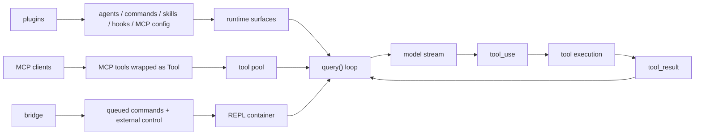

# 12 - MCP / Plugin / Bridge 附录

## 面试式回答

MCP、plugin 和 bridge 都是 Claude Code runtime 的扩展入口，但它们不是核心 agent loop。核心 loop 仍然是前面章节讲过的这条链路：入口层收集输入和上下文，`query()` 调模型，模型流出 assistant message 和 `tool_use`，runtime 执行工具并把 `tool_result` 放回下一轮。MCP、plugin、bridge 的职责是把更多能力、配置或外部环境接到这条链路上，而不是替代这条链路。

MCP 的关键点是“外部工具进入 tool pool”。连接成功的 MCP server 如果声明了 tools capability，Claude Code 会调用 `tools/list`，把 MCP 工具包装成内部 `Tool` 对象，再和内置工具通过 `assembleToolPool(permissionContext, mcpTools)` 合并。合并后的工具仍然走同一套 schema 暴露、permission、hooks、tool execution 和 `tool_result` 回填流程。

plugin 的关键点是“扩展现有 surface”。插件可以贡献 agent definition、commands、skills、hooks，也可能通过配置间接带来 MCP server。它们进入的是已有的 agent/tool/command/skill/hook 体系，而不是启动一个独立 runtime。

bridge 的关键点是“外部环境接入 REPL runtime”。`useReplBridge()` 挂在 `REPL.tsx` 这棵交互式 runtime 树上；外部消息通过 queued commands 注入，runtime messages / SDK messages / control response 通过 bridge handle 写回外部环境。它连接 claude.ai 或 SDK 控制面与本地 REPL，但本地执行仍然是同一个 query loop、同一套工具和权限系统。

## 为什么放在附录

这组笔记的主线是 coding agent runtime pipeline：

```text
input -> prompt/context -> query loop -> model stream -> tool_use -> tool execution -> tool_result -> next loop
```

MCP、plugin、bridge 对面试很重要，因为它们解释 Claude Code 为什么不是封闭的本地 CLI：它可以接外部工具、加载插件能力、把 REPL 连接到外部会话。但如果一上来讲协议细节，很容易把面试带偏成“插件系统实现”或“MCP 协议实现”，反而模糊核心 agent loop。

所以这里的定位是 appendix：只解释它们如何进入 runtime surfaces，以及它们为什么不改变主循环的本质。协议握手、marketplace 安装、transport 细节、plugin 依赖解析、bridge WebSocket 生命周期等，都只作为源码锚点存在，不展开成单独章节。

## 它们和核心 runtime loop 的关系

可以用一张图把三类扩展放回主线：



核心判断标准是：谁负责“模型下一轮继续推理”？答案仍然是 `query()`。MCP 不直接驱动模型；plugin 不直接驱动模型；bridge 也不直接驱动模型。它们只是改变模型这一轮能看到什么工具、能收到什么上下文、能触发什么 hook，或者让外部环境能把消息送进 REPL。

## MCP 与 tool pool

MCP 工具进入 runtime 的路径可以拆成四步。

第一步，连接层发现 server 能力。`src/services/mcp/client.ts:1743` 的 `fetchToolsForClient` 会先检查连接状态和 `client.capabilities?.tools`，只有 server 声明 tools capability 时才调用 `tools/list`。返回的 MCP tool 数据会做 Unicode sanitization，避免外部 server 提供的文本污染后续 prompt 或 deferred-tool 展示。

第二步，MCP tool 被包装成 Claude Code 的 `Tool`。包装后的对象带有 `name`、`mcpInfo`、`isMcp: true`、`description()` / `prompt()`、`inputJSONSchema`，并把 MCP annotations 映射到 runtime 能理解的提示：`readOnlyHint` 影响 `isReadOnly()` 和 `isConcurrencySafe()`，`destructiveHint` 影响 `isDestructive()`，`openWorldHint` 影响 `isOpenWorld()`。真正执行时，`call()` 仍然是内部 `Tool.call()` contract，只是内部会转发到 MCP client。

第三步，MCP tools 先进入 app state，再与内置工具合并。交互式路径由 `useManageMCPConnections` 把 fetched tools 同步到 `appState.mcp.tools`；headless / SDK 路径也会把连接得到的 MCP tools 放进 runtime options。随后 `src/tools.ts:271` 的 `getTools(permissionContext)` 只返回内置工具，并应用 simple mode、REPL mode、special tool、deny rules 和 `isEnabled()` 过滤。`src/tools.ts:345` 的 `assembleToolPool(permissionContext, mcpTools)` 再把内置工具和 `appState.mcp.tools` / SDK MCP tools 合成完整 tool pool：先过滤 MCP deny rules，再分别排序以保持 prompt-cache stability，保留 built-ins 作为连续前缀，最后按 name 去重，冲突时 built-in 优先。

第四步，合并后的工具走第 5 章同一条工具链。也就是说，MCP 工具不会绕过 `toolToAPISchema()`、`findToolByName()`、permission、hooks、`runToolUse()`、`StreamingToolExecutor` 或 `tool_result` 映射。面试里可以强调：MCP 是工具来源，不是另一套工具执行协议在 query loop 里的并行宇宙。

SDK MCP server 还有一条同进程接入路径。`src/services/mcp/client.ts:3262` 的 `setupSdkMcpClients` 用 `SdkControlClientTransport` 建立 SDK MCP clients，连接后同样拉取 tools 并放回 runtime。交互式 React 路径则由 `src/services/mcp/useManageMCPConnections.ts:143` 管理连接生命周期，把 fetched tools/resources/commands 同步到 app state。

Subagent 也可以有 agent-specific MCP server。`src/tools/AgentTool/runAgent.ts:95` 的 `initializeAgentMcpServers` 会读取 agent definition 上的 `mcpServers`，在 agent 生命周期开始时连接，和 parent MCP clients 合并，并在 agent 结束时清理。这里的含义是：agent 可以扩展自己的工具环境，但执行时仍回到 subagent 的 `runAgent()` / `query()` loop。

## Plugin 与 agents / tools / skills / hooks

Plugin 是能力打包和分发机制。它不是一个新的 agent loop，而是把文件、配置和扩展点加载进现有 runtime。

`src/utils/plugins/pluginLoader.ts:3096` 的 `loadAllPlugins` 是主入口之一。它负责从 session-only plugin、marketplace plugin、built-in plugin 等来源合并 enabled / disabled / errors，并处理来源优先级。这个阶段回答的是“哪些插件被启用”，不是“模型如何推理”。

插件贡献 agent 的路径会进入 AgentTool 已有机制。`src/utils/plugins/loadPluginAgents.ts:231` 的 `loadPluginAgents` 加载 enabled plugin agents，之后与其他 agent 来源一起被 `loadAgentsDir.ts` 消费。`src/tools/AgentTool/loadAgentsDir.ts:445` 的 `parseAgentFromJson` 会把 JSON agent definition 解析成 `CustomAgentDefinition`：包括 tools、disallowedTools、system prompt、model、effort、permissionMode、mcpServers、hooks、skills、memory、isolation 等。到了运行时，Agent tool 仍然通过第 10 章的 `runAgent()` 进入 subagent query loop。

插件贡献 commands 和 skills 的路径进入命令与技能 surface。`src/utils/plugins/loadPluginCommands.ts` 导出 `getPluginCommands` 和 `getPluginSkills`，`src/commands.ts` 会导入这些能力。`src/utils/plugins/loadPluginCommands.ts:840` 的 `getPluginSkills` 只加载 enabled plugins 的 skills directories，并把它们变成 command-like skill surface。这里的重点不是模型 loop，而是用户或 agent 在输入/命令/技能发现层能看到更多能力。

插件贡献 hooks 的路径进入工具、session 和 agent 生命周期。`src/utils/plugins/loadPluginHooks.ts:91` 的 `loadPluginHooks` 会加载 enabled plugins 的 hooks config，并转换成带 plugin context 的 matchers。可见事件包括 `PreToolUse`、`PostToolUse`、`PermissionDenied`、`UserPromptSubmit`、`SubagentStart` / `SubagentStop`、`PreCompact` / `PostCompact` 等。hooks 能影响某些边界决策或注入行为，但它们是在已有执行点被调用，不是另起一条模型调用链。

所以面试里可以这样压缩：plugin 是 packaging layer，agent/tool/skill/hook 才是 runtime surface。插件本身不执行任务；插件让 Claude Code 在已有 runtime contract 下多一些 agent、命令、技能、hook 或 MCP server。

## Bridge 与外部环境

Bridge 的职责是把外部环境接进 REPL，而不是替代 REPL。

`src/screens/REPL.tsx` 导入 `useReplBridge`，说明 bridge 挂在交互式 runtime container 上。`src/hooks/useReplBridge.tsx:53` 的注释已经把核心语义说清楚：来自 claude.ai 的 inbound messages 会通过 `queuedCommands` 注入 REPL。也就是说，外部消息先变成本地 runtime 可理解的 queued command，再按第 9 章的 queue / attachment / next-turn 机制进入 query loop。

`src/bridge/replBridge.ts:70` 的 `ReplBridgeHandle` 描述 bridge handle 能做什么：写 runtime messages、写 SDK messages、发送 control request / response / cancel、发送 result，以及 teardown。它更像一个 IO adapter，把本地 runtime 状态和外部控制面同步起来。

`src/bridge/replBridgeHandle.ts:18` 的 `setReplBridgeHandle` 和 `src/bridge/replBridgeHandle.ts:25` 的 `getReplBridgeHandle` 提供了一个全局指针，让 React tree 之外的调用点也能访问当前 bridge handle。这个设计说明 bridge 是 runtime surface 的连接器，而不是只有 React 组件内部能触达的局部状态。

Bridge 要处理连接启停、control response、permission response、state changes 和消息回写，但它不改变工具执行顺序，也不绕过权限系统。外部环境发来的请求最终还是要成为 REPL 的输入、queued command、permission response 或 control event，再由本地 runtime 决定下一步。

## 面试边界：刻意不展开什么

这份 appendix 刻意不展开以下内容：

- MCP 协议本身的完整握手、transport、resources、prompts、commands、OAuth 或 channel permission 细节。
- plugin marketplace、安装、缓存、版本解析、依赖合并、policy override 的完整实现。
- bridge 具体网络协议、WebSocket 生命周期、远端 UI state sync、control channel framing。
- 每一种 hook event 的完整参数和 side effect。
- MCP resource / command 与 tool 之外的全部 surfaces。

原因是面试主线应该服务“如何实现 coding agent runtime”。这些内容都能继续深挖，但第一轮回答只需要讲清：扩展从哪里来，如何进入已有 runtime surface，以及为什么它们不改变 model-tool-result 闭环。

## 源码入口

| 主题 | 源码锚点 | 读什么 |
|------|----------|--------|
| built-in tools | `src/tools.ts:271` / `getTools(permissionContext)` | 内置工具如何按 mode、deny rules、`isEnabled()` 过滤 |
| tool pool | `src/tools.ts:345` / `assembleToolPool(permissionContext, mcpTools)` | built-in tools 与 MCP tools 如何合并、排序、去重 |
| MCP tools | `src/services/mcp/client.ts:1743` / `fetchToolsForClient` | `tools/list`、sanitize、包装成 `Tool` |
| SDK MCP | `src/services/mcp/client.ts:3262` / `setupSdkMcpClients` | SDK control transport 如何接 MCP server |
| MCP app state | `src/services/mcp/useManageMCPConnections.ts:143` | React hook 如何管理 MCP connections 并更新 app state |
| agent MCP | `src/tools/AgentTool/runAgent.ts:95` / `initializeAgentMcpServers` | agent-specific MCP servers 如何在 subagent 生命周期内接入 |
| plugin load | `src/utils/plugins/pluginLoader.ts:3096` / `loadAllPlugins` | 插件来源、enabled/disabled/errors 聚合 |
| plugin agents | `src/utils/plugins/loadPluginAgents.ts:231` / `loadPluginAgents` | enabled plugin agents 如何进入 agent definitions |
| agent JSON | `src/tools/AgentTool/loadAgentsDir.ts:445` / `parseAgentFromJson` | JSON agent definition 如何变成 `CustomAgentDefinition` |
| plugin skills | `src/utils/plugins/loadPluginCommands.ts:840` / `getPluginSkills` | plugin skills 如何进入 skill surface |
| plugin hooks | `src/utils/plugins/loadPluginHooks.ts:91` / `loadPluginHooks` | plugin hooks 如何注册到 runtime events |
| REPL bridge | `src/hooks/useReplBridge.tsx:53` / `useReplBridge` | inbound bridge messages 如何进入 queued commands |
| bridge handle | `src/bridge/replBridge.ts:70` / `ReplBridgeHandle` | bridge 可写回哪些 runtime / SDK / control 消息 |
| global bridge handle | `src/bridge/replBridgeHandle.ts:18` / `setReplBridgeHandle` | React tree 外如何拿到 active bridge handle |

## 面试追问

**问：MCP/plugin/bridge 为什么不是核心 runtime loop？**
因为它们不负责“模型采样 -> tool_use -> 工具执行 -> tool_result -> 下一轮模型”。MCP 只是工具来源，plugin 是扩展打包，bridge 是外部环境连接器；最终都进入已有 `query()`、tool execution、permission 和 message queue 体系。

**问：MCP tool 进入模型请求前发生了什么？**
连接层调用 `tools/list`，把 MCP tool 包装成内部 `Tool`，再由 `assembleToolPool()` 和 built-in tools 合并。API 请求前仍由 `toolToAPISchema()` 转成模型可见 schema。

**问：MCP tool 会绕过权限吗？**
不会。MCP tool 作为 `Tool` 进入 tool pool 后，仍然经过 deny rules、tool permission、hooks、classifier 和 runtime execution。`mcpInfo` 还用于 server/tool 维度的 permission 匹配。

**问：插件 agent 和普通 custom agent 有什么关系？**
插件 agent 最终也会被解析成 `AgentDefinition` / `CustomAgentDefinition`，拥有 tools、system prompt、permissionMode、mcpServers、hooks 等字段。运行时还是通过 Agent tool 和 `runAgent()` 执行。

**问：bridge 收到远端消息后是不是直接调用模型？**
不是。bridge 把 inbound messages 注入 REPL 的 queued commands 或处理 control/permission response。真正进入模型仍然要经过 REPL 输入处理、message queue、`query()` 和权限边界。

## 一句话总结

MCP、plugin、bridge 是 Claude Code 的 extension surfaces：它们把外部工具、插件能力和远端环境接入现有 runtime，但核心闭环仍然是同一个 `query()` 驱动的 model-tool-result loop。
