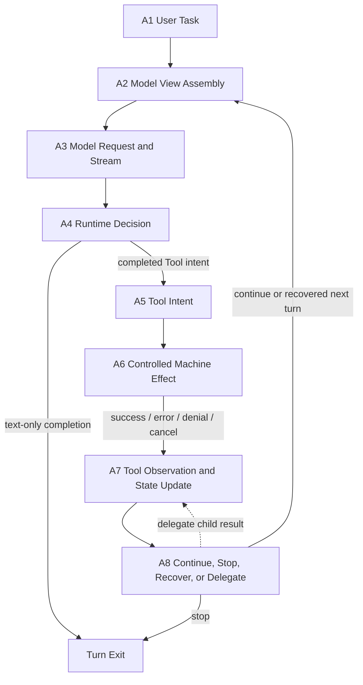
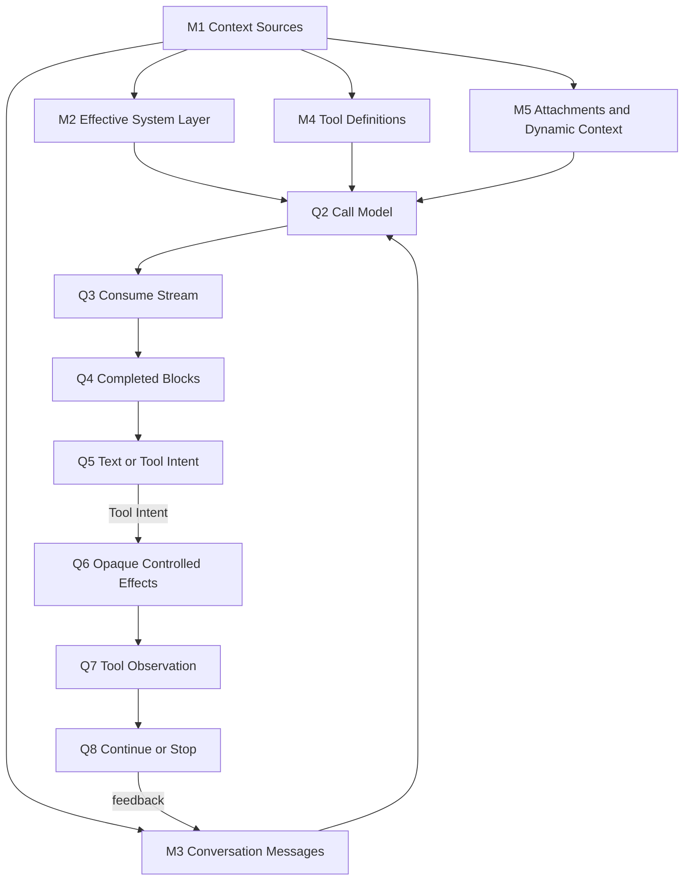
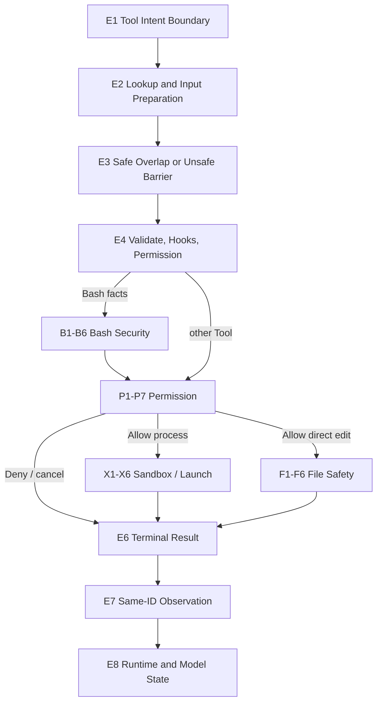
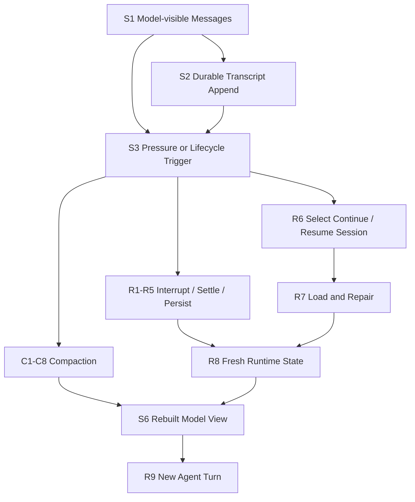
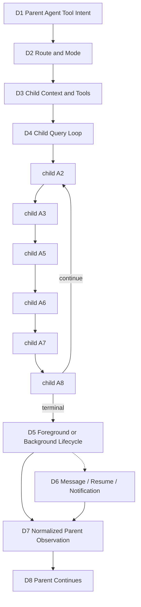

# 99：Interview Playbook——从 A1–A8 讲清 Coding Agent Runtime

[← 返回学习轨道 README](README.md) · [回到 A1–A8 权威主线](00-one-agent-turn.md) · [查实现证据](appendices/source-evidence-index.md)

> 面试题：请设计一个像 Claude Code 一样、能安全使用工具并可恢复会话的 coding agent runtime。

这不是第二本源码教材，而是一条**可伸缩的回答路径**：先用 A1–A8 交付完整架构，再根据追问放大既有的 M/Q、E/P/B/X/F、S/C/R、D/G/K 节点。所有实现事实以固定快照 `712b24f22a63eb6d1a2f86697bf6dbbaa39ae3cf` 和 [Source Evidence Index](appendices/source-evidence-index.md) 为准；白板中的因果组合属于 **Architectural interpretation**，跨产品不变量属于 **General principle**。

## 1. 怎样使用这份 Playbook

面试回答有四个深度，不是四套答案：

1. **30 秒 thesis**：先给边界和不变量；
2. **3 分钟 causal walkthrough**：沿稳定节点讲输入、状态变化和输出；
3. **白板**：只画 A1–A8 或对应局部 ID，不按源码文件顺序画；
4. **深入追问**：进入唯一 owner chapter，用 `path + symbol` 支撑决定性实现 claim。

如果面试官没有追问，不要在第一遍塞入 permission precedence、compaction strategy 或 cache marker。先把下面这张唯一 canonical map 讲完整。

白板讲法只有一句：**模型提出意图，runtime 拥有效果；每个已采用的意图都要由可关联的观察闭合，闭合状态才能进入下一次模型视图。**

## 2. 一次完整的端到端回答

### 2.1 30 秒开场

> 我会把 runtime 设计成 A1–A8 的有状态反馈回路，而不是“prompt 调函数”。A2 为每次请求投影 model-visible view；A3/A4 消费 stream，并且只把完整 Tool Intent 交给 runtime。A5 只是提议，A6 才经过 ordering、validation、Permission、Sandbox 或 file-safety boundary 产生机器效果；A7 用同 ID Observation 闭合成功、失败、拒绝或中断。Durable transcript、当次 model projection 与 runtime-only state 分离，因此 Compaction 可以缩短视图而不删除历史，Resume 可以从持久化材料创建 fresh runtime。需要委派时，Agent Tool 在 A5–A7 内打开隔离 child Query Loop，再把 normalized result 作为 parent Observation 返回。

### 2.2 3 分钟主回答

**A1 → A2：先决定模型看见什么。** 用户任务先成为协议输入，而不是机器命令。runtime 从 system instructions、selected Messages、Tool schemas、attachments 和当前 policy 组装一次 Model View；transcript、controller、pending queue 并不会自动全部暴露给模型。

**A3 → A5：stream 低延迟，但协议必须完整。** runtime 发出请求并逐步消费 assistant stream。partial text/JSON 可展示和累积；完整 `tool_use {id, name, input}` 才能成为 Tool Intent。正向发现 intent 可以在完整 block 到达时发生，text-only 则必须等整个 response 结束后才能确认。

**A6：把不可信提议转成受控效果。** runtime 做 Tool lookup、input validation 与 safe/unsafe ordering，再运行 hooks 和 Permission。Permission 回答“能否尝试”；获准后，适用的 process path 才进入 Sandbox containment，direct Edit 则在自己的 file-safety boundary 重读并检查 freshness。任何 Allow 都不是成功保证，也没有通用 rollback。

**A7 → A8：先闭合事实，再决定下一步。** success、unknown Tool、invalid input、denial、launch failure、conflict 或 cancellation 都要变成原 `tool_use_id` 的 terminal Observation。runtime-only progress 与 model-visible result 分开保存。response 和 adopted Tool batch 闭合后，A8 才能 Stop，或回到 A2 发起新的 request。

**跨时间继续。** Durable transcript 保存可恢复事件；当前 Model View 只是它与 live state 的 projection。Compaction 用 boundary、summary、可选 tail 和 metadata 构造较短 continuation；失败时不能安装“半份 summary”。Interrupt 要先让 adopted intents 得到明确 terminal facts，但不能倒转已经发生的效果。Continue/Resume 从 durable material 加载、修复并创建新的 controller、executor 与 request；它恢复的是可继续状态，不是旧 Promise、socket、process handle 或调用栈。

**委派。** 当任务边界清楚且适合隔离时，parent model 产生普通 `Agent` Tool Intent。通用 Tool gate 后，AgentTool 显式构造 child prompt、Tools、Permission、identity 与 runtime state，child 自己运行 A2–A8。Foreground 让 parent Tool call 等 terminal result；background 先返回 launch acknowledgement，terminal fact 后续经 task retrieval/notification 返回。两者都只传 normalized data，不合并 mutable histories。

### 2.3 收束：六条必须主动说出的不变量

- Model 只能提出 Tool Intent；runtime 才能产生机器效果。
- 每个 adopted Tool Intent 都必须得到 same-ID terminal Observation。
- Permission 与 Sandbox/containment 是两道不同的门。
- Durable transcript、model-visible projection、runtime-only state 不是一个“上下文”。
- Interrupt/Resume 只保证合法下一轮，不保证 rollback 或 perfect replay。
- Child loop 跨越显式 context/result boundary；subagent 不等于共享内存 helper。

这套回答的全景 owner 是 [00：一次完整的 Agent Turn](00-one-agent-turn.md)；A1–A8 的 claim、标签与 `path + symbol` 见 [证据索引 A1–A8](appendices/source-evidence-index.md#1-a1a8-canonical-turn)。下面只在面试官追问时逐部分放大。

## 3. Part 01 Drill-down：Model Turn

### 3.1 30 秒 thesis

> Model Turn 是可重复的 request/feedback loop。M1–M5 把候选来源投影成当次 system、Messages、Tool schemas 与 attachments；M6 发出请求并消费 stream；M7 只在完整 content block 上识别 Tool Intent。Q1–Q8 负责累积、同 ID pairing 和 continuation，所以一次 user task 可以包含多次模型请求。

### 3.2 3 分钟 causal walkthrough

先从 M1 收集候选来源，M2 解析 effective system precedence，M3 选择/规范化协议历史，M4 把 runtime Tools 投影为 schemas，M5 条件性注入动态事实。M6 汇合这些内容发出一次 request。Q3/Q4 区分 partial delta 与 completed block；Q5 识别真实 Tool Intent，Q6 把完整 intent 交给 opaque Controlled Effects；Q7 收回 same-ID Observation，Q8 在 response 与 batch 都闭合后构造下一次 state。最终完整 response 没有 Tool Intent，才从 M7 terminal text 退出。

### 3.3 白板

### 3.4 一个自然深入追问

**为什么 Tool call 可以在整份 response 完成前开始？** 因为“完整 Tool Intent 已形成”是正向、局部可判定的事实；而“整份 response 没有 Tool Intent”是负向事实，必须等 response complete。提前启动降低 latency，但 runtime 必须维护 attempt authority、same-ID pairing、unsafe barrier 和 drain，不能执行 partial JSON，也不能让失败的 transport attempt 与 fallback 同时成为权威结果。细节见 [Query Loop 与 Streaming](01-model-turn/02-query-loop-and-streaming.md)。

### 3.5 常见误解与纠正

**误解：** transcript 中存在的内容，模型当前都看见。

**纠正：** 只有 M2–M5 选入当次 request 的 projection 可见；runtime controls 与 durable history 都需要显式投影。

**实现证据：** `src/query.ts · queryLoop` 证明 request/feedback loop 与 completed intent detection；`src/services/api/claude.ts · queryModel` 证明 request serialization、stream block completion；`src/utils/messages.ts · normalizeMessagesForAPI / ensureToolResultPairing` 证明提交前的协议规范化。索引入口：[M1–M7 / Q1–Q8](appendices/source-evidence-index.md#2-model-turnm1m7--q1q8)。

## 4. Part 02 Drill-down：Controlled Effects

### 4.1 30 秒 thesis

> Controlled Effects 放大 A5–A7。E1 接 inert Tool Intent，E2/E3 做 path-local lookup 与 safe/unsafe ordering，E4 做 validation、hooks 和 final Permission；只有 Allow 才进入 E5 的 Tool-specific effect。Bash 的语义分析提供授权 facts，Sandbox 约束适用 process，direct file mutation 用 File Safety。E6–E8 无论成功、失败、拒绝或取消都返回同 ID terminal Observation。

### 4.2 3 分钟 causal walkthrough

Batch 与 Streaming 可以有不同 admission/miss 路径，但共同承担 pairing。只有显式 concurrency-safe 的调用可重叠，unsafe item 是 barrier。每次调用依次经过 local schema、Tool-specific validation、PreToolUse 和 final Permission；Hook/Permission 可改 input，却不能假定完整 validation 自动重跑。Allow 后才调用 Tool：Bash 可能选择 sandboxed 或 ordinary launch，Edit 则同步 reread/freshness recheck 后尝试 mutation。E6 规范化 terminal shape，E7 尊重 barrier/drain，E8 把 Tool result 与 runtime modifier 分开交给 Query Loop。

### 4.3 白板

### 4.4 一个自然深入追问

**Permission 与 Sandbox 为什么不能合并？** Permission 是 authorization decision：这项意图能否尝试；Sandbox 是 final Allow 之后、适用 process path 的 containment/launch boundary：获准后最多能碰什么。Permission Deny 时不应靠 Sandbox “安全执行”；Permission Allow 也不能证明 Sandbox 可用、process 已启动、direct Edit 新鲜或 effect 成功。深入见 [Permission Decision](02-controlled-effects/02-permission-decision.md)、[Sandbox Runtime](02-controlled-effects/04-sandbox-runtime.md) 与 [File Editing Safety](02-controlled-effects/05-file-editing-safety.md)。

### 4.5 常见误解与纠正

**误解：** Tool 返回 error 就表示机器没有变化。

**纠正：** pre-effect failure 可以证明目标 effect 未开始；effect 开始后的 exception/cancel 可能留下 partial、complete 或仍在运行的事实，协议 closure 不等于 rollback。

**实现证据：** `src/services/tools/toolExecution.ts · runToolUse / checkPermissionsAndCallTool` 证明 lookup、validation、hooks、Permission 与 Tool call gate；`src/services/tools/toolOrchestration.ts · runTools` 证明 ordering；`src/services/tools/StreamingToolExecutor.ts · addTool / getRemainingResults` 证明 streaming admission/drain。索引入口：[E1–E8](appendices/source-evidence-index.md#31-e1e8-controlled-effect-spine)。

## 5. Part 03 Drill-down：Session Continuity

### 5.1 30 秒 thesis

> Session Continuity 分开 durable transcript、model-visible projection 与 runtime-only active state。S/C 节点让 Compaction 把当前 projection 有损变成 boundary + summary + optional tail；R 节点让 Interrupt 先闭合 active protocol，再让 Continue/Resume 从 durable material 创建 fresh runtime 和合法下一次 request。它不恢复旧 stack，也不自动回滚 effect。

### 5.2 3 分钟 causal walkthrough

S1 的当前 projection 产生 user/assistant/tool facts，S2 按 adapter contract append durable transcript。context pressure、cancel、queue 或 process lifecycle 进入 S3/S4。Compaction attempt 若没有产生有效 `CompactionResult`、抛错或 no-op，旧 projection 继续 authoritative；若成功结果已经安装，则新 continuation 立即成为 authoritative，即使下一次 model request 仍 prompt-too-long。固定快照允许之后再次成功执行 full compaction；automatic breaker只统计 thrown failures，success会重置计数，因此不能把它说成 successful recompaction chain 的有界保证。Interrupt signal 当前 controller，并让 adopted intents completed 或 synthetic-close；queued steering 只有 drain 成 attachment 后模型才可见。Continue 选 latest eligible session，Resume 选 explicit source；R7 加载、过滤 malformed tail、repair 或 reject pairing，R8 创建 fresh controller/context/executor，R9 再发起新 invocation。

### 5.3 白板

### 5.4 一个自然深入追问

**如果 transcript 完整，为什么还要 Compaction？** transcript 的目标是恢复与审计，Model View 的目标是在有限窗口里做当前决策。把完整 transcript 每轮重放既超预算，也把无关细节挤进注意力；Compaction 以有损 summary 换 headroom，同时保留 durable source。但 summary 可能 drift，原始事实也不会自动重新进入窗口，需要显式 reload/search/Read。深入见 [Transcript 与 Model Context](03-session-continuity/01-transcript-and-model-context.md)、[Compaction](03-session-continuity/02-compaction.md) 与 [Interrupt / Queue / Continue / Resume](03-session-continuity/03-interrupt-queue-continue-resume.md)。

### 5.5 常见误解与纠正

**误解：** Resume 会从中断那一行继续执行。

**纠正：** Resume 恢复 session identity、selected messages 与受支持 metadata；controller、Promise、executor、socket、process handle 和旧 stack 都是 fresh 或不恢复。

**实现证据：** `src/utils/sessionStorage.ts · recordTranscript` 证明 append path；`src/services/compact/compact.ts · buildPostCompactMessages` 证明 structured continuation；`src/utils/conversationRecovery.ts · loadConversationForResume` 证明 durable load；`src/query.ts · queryLoop` 证明 settlement 与新 request。索引入口：[S1–S7](appendices/source-evidence-index.md#41-s1s7-continuity-spine)。

## 6. Part 04 Drill-down：Subagent Delegation

### 6.1 30 秒 thesis

> Subagent 是 parent A5–A7 内的普通 Agent Tool specialization。D1–D3 经过 generic Tool gate并显式构造 child context；D4 复用同一 A2–A8 Query Loop；D5/D6 管 foreground/background、message、resume 与 notification；D7 只把 normalized child data映射成 parent Observation，D8 由 parent 自己继续。

### 6.2 3 分钟 causal walkthrough

Parent model 先产生带 ID 的 Agent Tool Intent，通用 lookup/hooks/Permission 仍然成立。AgentTool 再决定 route/mode，构造 bounded prompt、Tool set、Permission context、identity、cwd/worktree 与 fresh/cloned runtime state。Child 独立经历多轮模型/工具反馈；parent 不逐条共享 child mutable history。Foreground 保持原 Tool call pending，terminal 后 direct-map；background 注册 stable task，先返回 launch acknowledgement，terminal fact 后由 `TaskOutput` 或 notification 进入 later parent input。Fork 只是 D2/D3 的 prefix-reuse variant：复用 rendered system、exact Tool schemas/order、model/thinking 与 selected history；identity、messages、query tracking 和核心 mutable state仍 fresh/cloned，named channel是否共享取决于 mode。

### 6.3 白板

### 6.4 一个自然深入追问

**Fork 复用了什么，什么必须 fresh？** 可复用的是 prefix-sensitive material：rendered system prompt、exact Tool array/order、model/thinking configuration 与 selected parent messages；dynamic child directive放在后面以提高 prompt-cache compatibility。必须 fresh/cloned 的是 child messages array、identity、query tracking、per-child sets、file/replacement state和执行生命周期；controller、setter、denial tracking等少数 references按 sync/async mode明确选择。Cache miss只影响 cost/latency，worktree isolation只来自实际 worktree creation。深入见 [Fork / Prompt Cache](04-subagent-delegation/04-fork-and-prompt-cache.md)。

### 6.5 常见误解与纠正

**误解：** background 只是 foreground 不等待，其他都一样。

**纠正：** execution mode 改变 task registration、controller ownership、launch acknowledgement、retention、retrieval/notification 与 terminal delivery timing；语义共同点只是跨边界返回 normalized data。

**实现证据：** `src/tools/AgentTool/AgentTool.tsx · AgentTool.call` 证明普通 Tool 到 child adapter；`src/tools/AgentTool/runAgent.ts · runAgent` 证明进入 child `query()`；`src/tasks/LocalAgentTask/LocalAgentTask.tsx · registerAgentForeground / registerAsyncAgent / completeAgentTask` 证明 lifecycle；`src/tools/AgentTool/agentToolUtils.ts · finalizeAgentTool` 证明 result normalization。索引入口：[D1–D8](appendices/source-evidence-index.md#51-d1d8-delegation-spine)。

## 7. 八个 Contrast / Trade-off 追问

这八题不是新架构；每题都从上面某条边界抽出“选择、收益、成本、底线”。

### 7.1 Why not expose arbitrary functions directly to the model?

**结论：** 任意函数会把 schema、authorization、ordering、effect ownership 与 observation normalization混为一次调用。Tool Intent boundary 让模型只能提出结构化提议，runtime 可在 effect 前拒绝，并让每个结局同 ID 闭合。

**代价：** 需要 Tool adapters、validation 和 result mapping。

**底线：** 模型输出永远不是已发生的机器事实。Owner：[Tool Contract](02-controlled-effects/01-tool-contract-and-orchestration.md)。

### 7.2 Permission and Sandbox solve different problems—how?

**Permission** 判断是否允许尝试；**Sandbox** 限制获准 process 的 capability/resource 范围。前者是 policy，后者是 containment。Deny 不应执行；Allow 也不保证 sandbox available、launch success或 direct file safety。Owner：[Permission](02-controlled-effects/02-permission-decision.md) / [Sandbox](02-controlled-effects/04-sandbox-runtime.md)。

### 7.3 Why stream Tool calls before the entire model response completes?

完整 Tool block 是可提前确认的正向事实，可以与后续生成重叠以降低 latency；但 partial JSON 不执行，text-only 必须等全 response，unsafe barrier/pairing/drain 不能被低延迟优化破坏。Owner：[Query Loop](01-model-turn/02-query-loop-and-streaming.md)。

### 7.4 Why persist a full transcript if the model sees a compacted projection?

两者目标不同：transcript 保存恢复、审计和重新投影所需事实；projection 为当次有限窗口优化。成本是 storage、selection 与 summary drift；收益是模型窗口不必承担历史仓库职责。Owner：[Transcript](03-session-continuity/01-transcript-and-model-context.md) / [Compaction](03-session-continuity/02-compaction.md)。

### 7.5 What can and cannot Resume reconstruct?

可重建 selected messages、session identity、pairing repair后的协议历史与受支持 metadata；不可重建旧 controller、Promise、executor、socket、OS handle、未持久化 queue、调用栈或未观察到的 external-effect truth。恢复成功边界是合法新 request。Owner：[Interrupt / Queue / Continue / Resume](03-session-continuity/03-interrupt-queue-continue-resume.md)。

### 7.6 Why implement a child Agent as a nested loop behind a Tool boundary?

这样复用 Tool lookup/Permission/result pairing和同一 Query Loop，同时获得显式 context、capability、cancellation、audit和 result boundary。代价是 lifecycle/communication复杂度；收益是不会把 parent/child mutable state隐式合并。Owner：[Child Loop](04-subagent-delegation/01-child-loop-and-context-isolation.md)。

### 7.7 What does foreground/background change?

改变的是谁等待、task/controller ownership、是否先返回 launch acknowledgement、terminal fact 保留在哪里、怎样 retrieval/notify；不改变的是 child isolation和 normalized-result boundary。Background launch success不等于 terminal success。Owner：[Foreground / Background Lifecycle](04-subagent-delegation/02-foreground-background-lifecycle.md)。

### 7.8 What does fork reuse, and what must remain fresh?

复用 prefix-compatible system、Tool schemas/order、model/thinking和 selected history；fresh/cloned child messages、identity、tracking、core mutable state与 task lifecycle。Named references按 mode明确共享；cache hit不保证，prompt notice不创建 worktree。Owner：[Fork / Prompt Cache](04-subagent-delegation/04-fork-and-prompt-cache.md)。

## 8. 九个 Failure Injection：统一五字段回答

失败题始终按 **state before → trigger → invariant → terminal state → recovery** 回答。先确定 effect 是否开始，再谈协议和恢复；不要承诺通用 rollback、exactly-once 或 perfect replay。

### 8.1 Model emits malformed Tool input

- **State before：** 完整 Tool Intent 已被采用并保留 ID，但目标 effect 未开始。
- **Trigger：** local schema / Tool-specific validation拒绝 input，或完整 block 的 input 不能解析。
- **Invariant：** malformed input 不得进入 Tool call；adopted ID 不能成为 orphan。
- **Terminal state：** same-ID validation/error Observation；目标 effect 未开始。
- **Recovery：** 把错误投影到下一轮，让模型修正参数；若 block 根本未达到可采用形态，则终止/舍弃整个 attempt，不泄漏半边 history。

### 8.2 Two Tool calls finish out of order

- **State before：** 两个显式 concurrency-safe intents 已登记，各自有唯一 ID；后方 unsafe barrier 尚未越过。
- **Trigger：** 后启动或第二个 safe Tool 先完成。
- **Invariant：** result 绑定原 ID；unsafe launch/result barrier不穿透；feedback前 adopted batch闭合。
- **Terminal state：** 两个 completion order 可不同，但各自 same-ID terminal；barrier后工作才可开始。
- **Recovery：** 按 ID而非数组位置归并结果；缺失项 drain或 synthetic error-close，再构造下一轮。

### 8.3 User denies Permission

- **State before：** Intent 已 lookup/validate，目标 effect 尚未开始，Permission处于 Ask/decision boundary。
- **Trigger：** 用户选择 Deny，或 Ask 无法完成/被取消。
- **Invariant：** final authorization前没有目标 command/direct-target mutation；Intent仍须闭合。
- **Terminal state：** same-ID denial/cancel Observation，可能伴随独立 permission-state update。
- **Recovery：** 模型可解释、提出更小范围替代或停止；不得静默重试同一被拒 effect。

### 8.4 Sandbox launch fails

- **State before：** Permission 已 Allow，适用 process path 已选择 Sandbox；target process 尚未 launch。
- **Trigger：** adapter/config/cwd/spawn pre-launch failure。
- **Invariant：** Allow 不等于 launch；pre-launch failure不得伪装成 command exit或 Permission Deny。
- **Terminal state：** same-ID launch error，目标 process 未启动；control-plane effects另行描述。
- **Recovery：** 报告明确 boundary；按 policy选择修复配置、允许的 ordinary path或停止，不能假定自动 unsandboxed fallback。

### 8.5 File changes after Read but before Edit

- **State before：** Read 建立 optimistic prior state；Edit Intent 已验证/授权，但 direct mutation尚未执行。
- **Trigger：** external actor在 Read 后改变 mtime/content/match cardinality。
- **Invariant：** call-time reread/freshness/match必须针对 live target；stale evidence不能授权旧 patch命中。
- **Terminal state：** pre-mutation conflict/error 时本次 direct target primitive未执行；外部变化仍存在。
- **Recovery：** 重新 Read、重新生成 exact proposal并重新过 Permission；若失败发生在 mutation后，则先检查文件/VCS，不能宣称 rollback。

### 8.6 Context remains too large after Compaction

- **State before：** 分两支。A：compaction attempt 尚未安装有效结果，旧 projection authoritative。B：成功 `CompactionResult` 已安装，新 continuation authoritative。
- **Trigger：** A：attempt 返回空/no-op、抛错或 abort，未产生可安装结果。B：安装成功后的下一次 model request 仍 prompt-too-long。
- **Invariant：** A：没有有效 `CompactionResult` 就不能替换旧 projection。B：已安装的新 projection 不能倒退说成旧 projection仍 authoritative；successful full compaction之后还可再次触发并成功，outer breaker不限制这条 success chain。Reactive callee收到 `hasAttempted=true` 后是否拒绝第二次 attempt，在固定快照中 unresolved。
- **Terminal state：** A：no-op、throw或automatic breaker停止后都保留旧 projection；breaker只停止后续automatic attempts，本身不是 terminal error。B：新 projection 保持当前事实；later full compaction仍可能成功，只有 reactive callee返回空结果时，caller才会暴露此前 withheld 的 prompt-too-long error。
- **Recovery：** **[Source-confirmed]** 先按当前 authoritative projection和实际 callee结果继续或暴露错误，不虚构 one-attempt guarantee。**[General principle / recommended design]** 生产实现应另设真正有界的 recompaction policy；预算耗尽后显式 terminal escalation，并让用户缩小输入、开启新 session或重新加载关键事实。

### 8.7 User interrupts during an irreversible Tool effect

- **State before：** Intent 已授权并进入 effect boundary；效果可能未发生、部分发生、完成或仍在外部运行。
- **Trigger：** 用户 signal active controller。
- **Invariant：** adopted Intent得到 completed或synthetic terminal Observation；cancellation不声称 rollback。
- **Terminal state：** explicit cancel/error/interruption marker；机器状态标记为 unknown/partial/complete according to evidence。
- **Recovery：** 先检查文件、进程、VCS或远端记录，对账后再幂等重试或补偿；Resume不能替代 reconciliation。

### 8.8 Child Agent finishes as it is backgrounded

- **State before：** foreground child接近 terminal，同时 foreground→background signal竞争；原 Tool call尚未稳定决定 direct terminal还是 async launch。
- **Trigger：** child completion与 mode conversion race。
- **Invariant：** 只能交付一条清晰 parent-facing lifecycle path；terminal registry fact、launch ack与notification是不同事实；normalized data不丢失/错绑。
- **Terminal state：** 若 completion赢则同一次 Tool call返回 terminal result；若 background conversion赢则 stable task记录 running/terminal fact并先返回 launch ack，later retrieval/notification交付 terminal。旧/新 run overlap时不能假定无重复 effect。
- **Recovery：** 查询 task registry/`TaskOutput`并按 stable ID去重；若 conversion可能 fresh replay，先检查 external effects再重试或补偿。

### 8.9 Resume finds an unmatched Tool Intent

- **State before：** durable log含 adopted `tool_use(id=X)`，但 tail中没有可信的 matching result。
- **Trigger：** loader/normalizer检测 orphan Intent或 malformed tail。
- **Invariant：** API-ready history必须满足 pairing；repair只建立协议合法性，不制造 effect truth。
- **Terminal state：** normal policy合成 same-ID error/filter malformed tail，或 strict policy拒绝恢复并返回明确 error。
- **Recovery：** 先检查机器世界和 transcript evidence，再从 repaired legal view发起 fresh request；不得把 synthetic result当成原 effect确实未发生，也不得自动 replay。

## 9. Final Self-test Rubric

只有下面全部能做到，才算通过：

- [ ] 不看文档，在两分钟内重画 A1–A8，并说清 A7 → A8 → A2 → A3 feedback edge。
- [ ] 任选四部分，用原 ID 展开一张 local map：M/Q、E/P/B/X/F、S/C/R 或 D/G/K；不按 source order背文件。
- [ ] 面对一个追问，能指出唯一 owner chapter，而不是在 Playbook 中虚构细节 owner。
- [ ] 能说出 same-ID pairing、pre-effect authorization、projection-not-transcript、no-stack-resume、no-effect-rollback 与 child result boundary。
- [ ] 每个关键 claim 能标成 **Source-confirmed**、**Architectural interpretation** 或 **General principle**，不把综合图冒充单一 symbol事实。
- [ ] 每个 primary part 都能解释一个 trade-off 与一个 failure path，并说出 effect是否已开始。
- [ ] 对决定性实现 claim 能引用固定 snapshot 下的 `repository-relative path + symbol`，而不是只报行号。
- [ ] 九个 failure injection 都能按 state before、trigger、invariant、terminal state、recovery 五字段回答。

## 10. 回到完整学习路径

卡在全景，回 [00：一次完整的 Agent Turn](00-one-agent-turn.md)；卡在局部机制，回 [Model Turn](01-model-turn/README.md)、[Controlled Effects](02-controlled-effects/README.md)、[Session Continuity](03-session-continuity/README.md) 或 [Subagent Delegation](04-subagent-delegation/README.md)。需要核对“源码到底证明了什么、边界又是什么”，直接查 [Source Evidence Index](appendices/source-evidence-index.md)，再进入它指向的 owner chapter。

[← 返回学习轨道 README](README.md) · [回到 A1–A8](00-one-agent-turn.md) · [Source Evidence Index](appendices/source-evidence-index.md)
