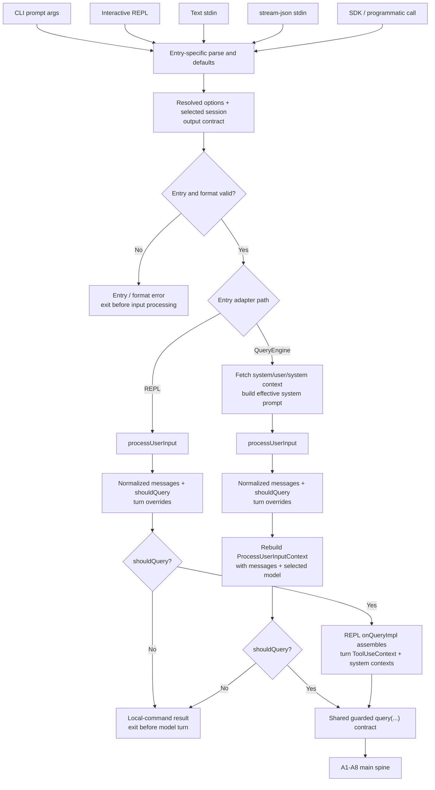

# Runtime Entry Adapters：CLI、REPL、stdin 与 SDK 如何抵达 A1

> CLI、REPL、SDK 和 stdin 等入口，如何把不同形态的输入归一化成主线 A1 的一次 turn 请求？

**[Architectural interpretation]** 它们不是几套 Agent runtime，而是同一条下游机制之前的多个 adapter：各入口负责接收输入、解释本入口的 defaults、选择 session 与输出合同，并按各自时序准备 context；只有输入处理决定请求 model turn 时，才进入共同的 `query()` 合同。

本文只解释 **A1 之前的归一化与交接**。它不拥有 Query Loop、Tool orchestration、Permission policy、Session recovery 或 child Agent lifecycle；这些机制一旦开始，分别交回 [Model Turn](../01-model-turn/README.md)、[Controlled Effects](../02-controlled-effects/README.md)、[Session Continuity](../03-session-continuity/README.md) 与 [Subagent Delegation](../04-subagent-delegation/README.md)。

## 1. 先固定边界：process start 不等于 A1

**[General principle]** 启动一个 CLI process、打开 TUI 或建立 SDK transport，只说明入口已经存在；只有某个 user/programmatic task 被解析成 turn messages，并且入口决定要调用模型时，才抵达 A1。

**[Source-confirmed]** 在源码快照 `712b24f22a63eb6d1a2f86697bf6dbbaa39ae3cf` 中，interactive 与 headless 都会经过 `processUserInput` 风格的输入处理。它返回 messages，同时独立返回 `shouldQuery`；local command、hook 阻止继续或其他本地结局可以产生 messages，却在 `shouldQuery=false` 时绕过 `query()`。因此，“有输入”与“发起 model turn”是两个不同事实。

## 2. 一个 adapter funnel，而不是多条 runtime

**[Architectural interpretation]** 下图是本文唯一流程图。上半部保留入口差异，下半部只认一个共享交接合同。



图中的“shared”不是“所有入口调用同一个 wrapper”，更不是全进程只有一个 singleton。REPL 先由 `processUserInput` 产生 messages 与 gate，true 分支才在 `onQueryImpl` 组装 turn context。`QueryEngine.submitMessage` 则先取得 system/user/system context 与 effective system prompt，再处理输入；随后用新 messages/model 重建 `ProcessUserInputContext`，最后才检查 false gate。稳定的共同点不是 context 的构造时点，而是：只有 `shouldQuery=true` 才把已准备的 messages 与 context 交给同一 `query()` 合同。

## 3. Canonical path：一次 REPL 提交怎样抵达交接点

**[Source-confirmed]** 先只走 interactive REPL，不把 print 与 SDK 写成另外两条端到端主线。

1. **UI 接收输入。** `PromptInput` 把文字、paste references、附件相关状态和当前 input mode 交给 REPL 的 submit handler。
2. **提交 adapter 取得执行权。** `handlePromptSubmit` 处理并发提交/排队，创建本次 abort controller，再逐个调用 `processUserInput`。输入可能在这里展开 paste、command、attachment、hook context 或 model/allowed-tools override。
3. **形成两项独立产物。** adapter 累积 `newMessages`，同时保留第一个 command 的 `shouldQuery`。本地 slash command 可以返回可显示的 messages，却仍令 `shouldQuery=false`。
4. **写入 interactive state。** REPL 的 `onQuery` 把 `newMessages` 纳入当前 conversation state；这一步仍不保证会调用模型。
5. **在 gate 后组装 turn context。** `onQueryImpl` 先处理 `shouldQuery=false` 的本地出口；只有 true 分支才读取 fresh tools/MCP clients，构造 `ToolUseContext`、system prompt、user context 与 system context。
6. **交给共同合同。** `onQueryImpl` 调用 `query({ messages, systemPrompt, userContext, systemContext, canUseTool, toolUseContext, ... })`，并把事件投影回 TUI/session state。本文在这个调用边界停止；A2 之后的 stream 与循环由 [Model Turn](../01-model-turn/README.md) 负责。

这条路径给出一个重要反例：`/theme` 一类只改变本地状态的命令也经过 submit adapter，但它不因此成为 A1 的 user task，更不会凭空触发 A2/A3。

## 4. 把 print、stdin 与 SDK 变体挂回 funnel

### 4.1 CLI print + direct prompt / text stdin

**[Source-confirmed]** `main.run` 先解析 CLI options，再由 `getInputPrompt` 读取 prompt source。text stdin 不是独立 runtime：当 stdin 非 TTY 且当前不是 MCP 命令时，源码等待第一批数据最多 3 秒；超时会 warning，然后以换行把 CLI prompt 放在 stdin text 之前。所得 string 再交给 `runHeadless`。

`runHeadless` 选择或加载 session state、建立 `StructuredIO` 与非 UI permission adapter；`runHeadlessStreaming` 的 command queue 最终通过 `ask` 创建 `QueryEngine`。也就是说，print 与 SDK 共享大量 headless engine 实现，但 print 还拥有外层 CLI 参数、stdin 和 text/json serialization 责任。

### 4.2 CLI print + stream-json stdin

**[Source-confirmed]** 当 `inputFormat='stream-json'` 时，`getInputPrompt` 直接返回 stdin 这个 `AsyncIterable`，不会把它与 CLI prompt 当成普通字符串连接。`getStructuredIO` 再把结构化 user/control messages 交给 headless queue；output 也可使用 newline-delimited SDK message contract。

因此 `stream-json stdin` 是结构化 transport。`loadInitialMessages` 已经先根据 continue/resume/fork/restored-worker inputs 选择当前 session，之后 incoming messages 只在这个既定 session 内工作；user envelope 的 `session_id` 没有进入 enqueue 的 session selection，SDK initialize 也没有 session selector。它可以连续提交 programmatic messages、处理 control request/response，并把 Permission 请求交给 SDK consumer；把它叫作“从 stdin 读一段 prompt”会丢失错误合同与双向控制能力。

**[Source-confirmed]** `(712b24f22a63eb6d1a2f86697bf6dbbaa39ae3cf, src/cli/print.ts, runHeadless / loadInitialMessages / runHeadlessStreaming user-message enqueue)`：[session load precedes streaming loop](https://github.com/buoylee/Claude-Code-true/blob/712b24f22a63eb6d1a2f86697bf6dbbaa39ae3cf/src/cli/print.ts#L680-L710) · [session selection](https://github.com/buoylee/Claude-Code-true/blob/712b24f22a63eb6d1a2f86697bf6dbbaa39ae3cf/src/cli/print.ts#L4893-L5198) · [user envelope enqueue](https://github.com/buoylee/Claude-Code-true/blob/712b24f22a63eb6d1a2f86697bf6dbbaa39ae3cf/src/cli/print.ts#L4050-L4110)。

### 4.3 SDK / programmatic `QueryEngine`

**[Source-confirmed]** `QueryEngine` 明确以“一实例对应一段 conversation”保存 messages、file cache 与 usage；每次 `submitMessage(prompt)` 开启该 conversation 的一个新 turn。它接受 string 或 content blocks，先取得 system/user/system context 并形成 effective system prompt，再调用 `processUserInput`；输入处理后会按新 messages/model 重建 `ProcessUserInputContext`，然后在 `shouldQuery=false` 时产出 local result，否则进入 `query()`。输出通过 `AsyncGenerator<SDKMessage>` 暴露。

SDK caller 可以注入 `canUseTool`、custom system prompt、append system prompt、initial messages 与输出选项。这些是 adapter/config 差异，不会把 Tool 或 Query Loop 的所有权搬到 SDK surface。

## 5. 只比较会改变行为的差异

| entry | input source | system-prompt/context semantics | session selection | Permission interaction | streaming/output contract | shared downstream boundary |
| --- | --- | --- | --- | --- | --- | --- |
| Interactive REPL | TUI prompt、paste/attachment、queued command | `onQueryImpl` 在 gate 后读取 fresh tools/MCP，并按当前 interactive config 构造 system/user/system context | CLI continue/resume/picker 先决定 initial state；后续 turn 复用 live REPL state | 可以在 TUI 呈现 ask/deny/allow 交互 | `query()` events 被消费成 TUI stream、messages 与 session state | `REPL.onQueryImpl -> query()` |
| CLI print：direct prompt / text stdin | CLI prompt；非 TTY text stdin 按 `prompt + "\n" + stdin` 归一化，首批数据最多等待 3 秒 | headless `QueryEngine` 在输入处理前形成 default/custom replacement + append system prompt，之后重建 `ProcessUserInputContext`；无 React context | `loadInitialMessages` 按 `--continue` / `--resume` / fork/restored-worker inputs 选择 durable source | 没有 TUI dialog；依赖预设 policy、stdio 或指定 permission-prompt tool | 最终适配为 text、json 或 stream-json；普通 validation/missing-input error 写 plain stderr，选中的 load error 才可能结构化 | `ask -> QueryEngine.submitMessage -> query()` |
| CLI print：stream-json stdin | stdin 上的 structured user/control stream；不是 text concat | initialize/control data 可补充 SDK config；`QueryEngine` 在输入处理前准备 system contexts，之后重建 `ProcessUserInputContext` | `loadInitialMessages` 先按 continue/resume/fork/restored-worker 选择 session；incoming envelope 只在已选 session 内工作，`session_id` 不是 selector | Permission 可经 stdio `control_request` 交给 consumer，不能假设本地 TUI 提问 | 输入/输出为结构化 stream；partial events 与 replay 受 options 控制 | `ask -> QueryEngine.submitMessage -> query()` |
| SDK / programmatic `QueryEngine` | 每次 `submitMessage` 的 string 或 content blocks | constructor config 提供 tools、custom/append prompt；system/user/system context 先准备，输入处理后重建 `ProcessUserInputContext` | 一实例是一段 conversation；`initialMessages` 定义起点，实例内多个 submit 保留 state | caller 提供 `canUseTool` callback；denial 被映射进 SDK result | `AsyncGenerator<SDKMessage>`，可选择 replay/partial messages | `QueryEngine.submitMessage -> query()` |

只在行为边界上拆行：如果 print 与 SDK 只是共享同一个 `QueryEngine` 实现，却由外层 adapter 序列化成不同格式，就应当写成“同一 engine，不同 I/O projection”，而不是发明不同 Query Loop。

Session flags 如何找到 durable source、补配 Tool result 并重建下一 turn，不属于本表；继续读 [Session Continuity](../03-session-continuity/README.md)。Permission precedence 与 sandbox containment 也不在这里重讲；继续读 [Controlled Effects](../02-controlled-effects/README.md)。

## 6. 三个最小 source lens

本附录 RA claims 的 claim-oriented 证据表见 [Source Evidence Index](source-evidence-index.md#6-runtime-entry-adapter-boundary)。

以下都固定在快照 `712b24f22a63eb6d1a2f86697bf6dbbaa39ae3cf`；省略号只移除与当前 adapter 问题无关的参数和分支。

### Lens 1：top-level 输入形态决定 string 还是 structured stream

**[Source-confirmed]** `(712b24f22a63eb6d1a2f86697bf6dbbaa39ae3cf, src/main.tsx, getInputPrompt / run)`：

```ts
if (!process.stdin.isTTY && !process.argv.includes('mcp')) {
  if (inputFormat === 'stream-json') return process.stdin
  // collect text stdin, with a bounded first-data wait
  return [prompt, data].filter(Boolean).join('\n')
}
return prompt
```

源码定位：[getInputPrompt / run](https://github.com/buoylee/Claude-Code-true/blob/712b24f22a63eb6d1a2f86697bf6dbbaa39ae3cf/src/main.tsx#L857-L883)。这证明 text 与 stream-json 在入口就有不同数据合同；它不证明二者拥有不同 agent loop。

### Lens 2：interactive normalization 保留 local bypass

**[Source-confirmed]** `(712b24f22a63eb6d1a2f86697bf6dbbaa39ae3cf, src/utils/handlePromptSubmit.ts, handlePromptSubmit / executeUserInput)`；同一快照 `(src/screens/REPL.tsx, REPL 内 onQueryImpl)`：

```ts
const result = await processUserInput({ input: cmd.value, context: makeContext(), ... })
newMessages.push(...result.messages)
if (isFirst) {
  shouldQuery = result.shouldQuery
}
await onQuery(newMessages, abortController, shouldQuery, ...)

if (!shouldQuery) return
for await (const event of query({ messages, systemPrompt, toolUseContext, ... })) {
  onQueryEvent(event)
}
```

源码定位：[handlePromptSubmit](https://github.com/buoylee/Claude-Code-true/blob/712b24f22a63eb6d1a2f86697bf6dbbaa39ae3cf/src/utils/handlePromptSubmit.ts#L426-L570) · [REPL onQueryImpl](https://github.com/buoylee/Claude-Code-true/blob/712b24f22a63eb6d1a2f86697bf6dbbaa39ae3cf/src/screens/REPL.tsx#L2661-L2810)。决定性事实是 gate 位于 `query()` 之前。

### Lens 3：programmatic submit 的 context 时序与 guarded `query()`

**[Source-confirmed]** `(712b24f22a63eb6d1a2f86697bf6dbbaa39ae3cf, src/QueryEngine.ts, QueryEngine.submitMessage)`：

```ts
const {
  defaultSystemPrompt,
  userContext: baseUserContext,
  systemContext,
} = await fetchSystemPromptParts(...)
const userContext = { ...baseUserContext, ... }
const systemPrompt = asSystemPrompt(...)
const {
  messages: messagesFromUserInput,
  shouldQuery,
} = await processUserInput({
  input: prompt,
  querySource: 'sdk',
  ...
})
this.mutableMessages.push(...messagesFromUserInput)
processUserInputContext = { messages, /* selected model + current options */ ... }
if (!shouldQuery) return
for await (const message of query({ messages, toolUseContext, querySource: 'sdk', ... })) {
  // map the shared events to SDKMessage
}
```

源码定位：[QueryEngine.submitMessage](https://github.com/buoylee/Claude-Code-true/blob/712b24f22a63eb6d1a2f86697bf6dbbaa39ae3cf/src/QueryEngine.ts#L209-L1156)。SDK 的差异在 config、Permission callback 与 event mapping；进入 `query()` 后仍是主线机制。

## 7. Success、local bypass 与 entry error

**[Architectural interpretation]** adapter 的成功边界不是“process 正常启动”。必须先区分 input-processing 之前的 entry validation，和 input-processing 之后的 `shouldQuery` gate：

- **pre-gate entry / format error：** CLI 的非法 input/output flag 组合在 `getInputPrompt` 前直接写 plain stderr 并 exit；缺少 print input 也写 stderr；malformed stream-json line 由 `StructuredIO.processLine` 写 plain stderr 并 exit。这些路径没有进入 `processUserInput`，更不属于 `shouldQuery=false`。
- **post-processing local bypass：** command、hook 或本地操作已经产生 messages/result，但 `shouldQuery=false`；入口正常结束，却没有 model request。
- **model-turn handoff：** normalized messages、当前入口所需 context 与 output consumer 已就绪，guard 通过后调用 `query()`；这时才抵达 A1–A8 的共同执行合同。

只有 `loadInitialMessages` 选中的 resume/load failures 会经 `emitLoadError` 在 stream-json mode 下变成 structured result；不能把这个局部 mapper 扩大成“所有 entry errors 都按 output format 结构化”。text stdin 的 3 秒 first-data wait 属于 entry latency policy，而不是 Query Loop timeout。类似地，print 的 text/json/stream-json 输出只是对下游 events/result 的不同 projection，不改变 A3–A8 的因果边。

**[Source-confirmed]** `(712b24f22a63eb6d1a2f86697bf6dbbaa39ae3cf, src/main.tsx, run validation)`；同一快照 `(src/cli/print.ts, runHeadless / emitLoadError / loadInitialMessages)` 与 `(src/cli/structuredIO.ts, StructuredIO.processLine)`：[CLI format validation](https://github.com/buoylee/Claude-Code-true/blob/712b24f22a63eb6d1a2f86697bf6dbbaa39ae3cf/src/main.tsx#L1818-L1861) · [missing print input](https://github.com/buoylee/Claude-Code-true/blob/712b24f22a63eb6d1a2f86697bf6dbbaa39ae3cf/src/cli/print.ts#L770-L795) · [selected structured load error](https://github.com/buoylee/Claude-Code-true/blob/712b24f22a63eb6d1a2f86697bf6dbbaa39ae3cf/src/cli/print.ts#L4838-L4867) · [malformed streaming input](https://github.com/buoylee/Claude-Code-true/blob/712b24f22a63eb6d1a2f86697bf6dbbaa39ae3cf/src/cli/structuredIO.ts#L333-L462)。

## 8. Trade-offs 与常见误解

| 误解 | 正确边界 |
| --- | --- |
| `stdin` 是一种 Agent mode | stdin 只是输入 transport；text 与 structured stream 由 adapter 赋予不同合同。 |
| 每个 surface 都有自己的 Query Loop | surface 分别解析、组装 context 和映射输出；共同交接点是 `query()`。 |
| 所有 submitted string 都会发给模型 | entry validation 可在输入处理前失败；`processUserInput` 也可产出 local result，并以 `shouldQuery=false` 截断。 |
| shared runtime 等于全局 singleton | 一个 process/conversation 可以有独立 `QueryEngine` 与 state；共享的是机制合同，不是对象 identity。 |
| 非交互模式永远不能请求 Permission | 它不能依赖本地 TUI，但可以使用 policy、permission-prompt tool 或 SDK stdio callback。 |
| custom system prompt 只是 UI 文案 | 它会改变 A2 context composition；replacement 与 append semantics 必须由 adapter config 明确。 |

adapter 分层的代价是：每个入口都必须维护输入验证、session/options mapping、Permission capability 与输出序列化，容易产生边缘差异。收益是：Query Loop、Tool contract 和 recovery 不需要为每种 product surface 复制一套核心实现。

## 9. 面试压缩回答

**问：为什么 CLI、REPL、stdin 和 SDK 这些产品面不代表多套 Agent runtime？**

因为 surface 只拥有 **adapter 责任**：先校验输入来源与 flags，解析 defaults，选择 session、Permission 能力和输出格式，再让输入处理产生 messages 与 `shouldQuery`。REPL 在 true gate 后组装 turn context；QueryEngine 则先准备 system contexts，输入处理后重建 `ProcessUserInputContext`。两者最终都只在 gate 通过时进入 `query(messages, systemPrompt, userContext, systemContext, canUseTool, toolUseContext, ...)`。所以它们可以有不同 I/O、不同 session 起点和不同 context 时序，但下游仍复用同一条 A1–A8 agent mechanism；共享的是合同，不是一个全局对象。

[← 回到 00：一次完整的 Agent Turn](../00-one-agent-turn.md) · [A2 之后：Model Turn](../01-model-turn/README.md)
