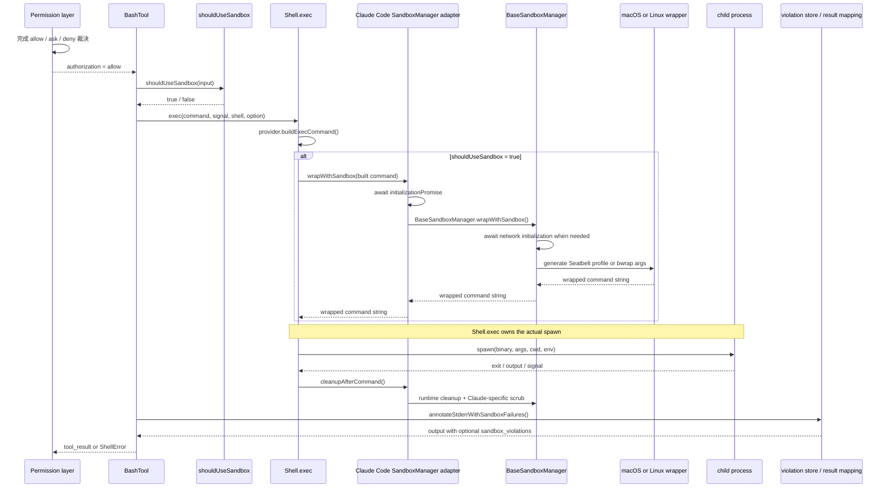

# 06c - Sandbox Runtime：允許後的 command 如何被限制

> Source snapshots and package boundary
>
> - Claude Code commit：`712b24f22a63eb6d1a2f86697bf6dbbaa39ae3cf`
> - sandbox-runtime tag / commit：`v0.0.56` / `12a3cc172cf343c33a0af6b3e0e98426f9b16139`
> - inspection date：`2026-06-19`
>
> Claude Code snapshot 只留下 `@anthropic-ai/sandbox-runtime` 的 import 與 adapter，沒有可用 lockfile 證明實際 npm package revision。本文因此把兩層分開 pin：Claude Code adapter 行為綁定前述 Claude Code commit；OS-level containment 行為綁定另行檢查的官方 sandbox-runtime commit。本文比較兩邊 API shape，但**不主張兩個 revision 是精確 package match**。
>
> **版本限制**：官方 runtime `v0.0.56` 已包含 Windows implementation，但 Claude Code snapshot 的 `Shell.ts` 與 sandbox UI 仍把實際路徑描述為 macOS、Linux、WSL2，且 native Windows 不走本文的 Bash containment path。本文只深入 Claude Code snapshot 能建立的 macOS 與 Linux / WSL 邊界。

## Permission 與 Sandbox 的最後分界

Permission 回答的是「這個 tool input 可不可以執行」；sandbox 回答的是「已允許執行後，child process 能碰哪些 OS resources」。順序不能顛倒：

```text
tool permission allow
→ BashTool.call()
→ shouldUseSandbox(input)
→ Shell.exec(..., { shouldUseSandbox })
→ runtime wrapper
→ spawn
```

Sandbox 不是 authorization owner。它會影響 permission fast path：當 `sandbox.autoAllowBashIfSandboxed` 開啟，而且 `shouldUseSandbox(input)` 為 true，Bash command 可在尊重 explicit deny / ask 後走 sandbox-backed auto-allow；但 permission pipeline 仍先處理 whole-tool deny、explicit ask、安全檢查與 command rules。`dangerouslyDisableSandbox`、`excludedCommands` 或 sandbox 不可用時，這個 auto-allow 條件消失，並不等於 command 自動獲准。

換句話說：

- authorization 完成後，containment 才開始；
- sandbox 成功不會把 deny 改成 allow；
- sandbox 失敗也不會撤銷已完成的 permission decision，而是讓本次 execution 失敗或由另一個新 tool use 走 unsandboxed override；
- unsandboxed execution 仍受一般 permission layer 約束。

## 端到端執行鏈



對應 source control flow：

```text
permission approval
→ BashTool.runShellCommand
→ shouldUseSandbox
→ Shell.exec
→ Claude Code SandboxManager.wrapWithSandbox
→ BaseSandboxManager.wrapWithSandbox
→ wrapCommandWithSandboxMacOS / wrapCommandWithSandboxLinux
→ wrapped command string
→ Shell.exec spawn
→ ShellCommand result
→ cleanupAfterCommand
→ annotateStderrWithSandboxFailures
→ Bash tool_result / ShellError
```

精確 package-boundary crossing 位於 `src/utils/sandbox/sandbox-adapter.ts`：

```ts
// abridged real source
import {
  SandboxManager as BaseSandboxManager,
  SandboxViolationStore,
} from '@anthropic-ai/sandbox-runtime'
```

Claude Code 不直接組 Seatbelt profile 或 `bwrap` argv；它把設定轉成 `SandboxRuntimeConfig`，再呼叫 external package。

## Claude Code adapter 與 sandbox-runtime 的責任分工

| 責任 | Claude Code | sandbox-runtime |
|---|---|---|
| tool permission | whole-tool / Bash rules、mode、prompt、auto-allow gate | 不負責 |
| 是否 sandbox | `shouldUseSandbox()`、platform/settings/dependency gate | 提供 platform/dependency capability |
| config 來源 | 合併 settings、permission rules、cwd、temp、worktree、managed policy | 接收 runtime config |
| path convention | 解析 Claude Code 的 `//`、settings-relative `/` 與 sandbox filesystem path semantics | `~`、relative path、symlink、glob normalization |
| network prompt | REPL / SDK callback、持久化 `WebFetch(domain:...)` | proxy 對 unknown host 呼叫 callback |
| OS wrapper | 呼叫 `BaseSandboxManager.wrapWithSandbox()` | 產生 `sandbox-exec` 或 `bwrap` command string |
| actual process spawn | `Shell.exec()` | 不 spawn workload；只 spawn proxy、log monitor、Linux host bridge |
| abort / timeout | `ShellCommandImpl` tree-kill；abort signal 也傳給 Linux pre-wrap scan | Linux mandatory-deny `ripgrep` scan可接 abort signal |
| result mapping | cwd、output、exit、`ShellError`、tool result | violation store 與 annotation helper |
| per-command cleanup | 呼叫 runtime cleanup，再 scrub Claude-specific bare-repo paths | Linux bwrap mount-point cleanup |

外部 runtime 自己會 spawn host-side infrastructure：

- HTTP proxy server；
- SOCKS proxy server；
- Linux host-side `socat` bridges；
- macOS `log stream` monitor（只有 runtime initialization 明確啟用時）。

但 workload 本身仍由 Claude Code `Shell.exec()` spawn。這個 ownership 是理解 abort、cwd 與 output 的關鍵。

## settings 如何變成 SandboxRuntimeConfig

`convertToSandboxRuntimeConfig(settings)` 是 Claude Code 的 translation boundary。它不是單純搬欄位；它會把 permission rules、managed policy、cwd 與安全預設一起組成 runtime config。

### A. Claude Code settings / rules → runtime config

| Claude Code 輸入 | runtime 欄位 | 轉換 |
|---|---|---|
| `sandbox.network.allowedDomains` | `network.allowedDomains` | 一般情況使用 merged settings |
| `permissions.allow: WebFetch(domain:x)` | `network.allowedDomains` | 擷取 `domain:` 後內容 |
| `permissions.deny: WebFetch(domain:x)` | `network.deniedDomains` | deny 從 merged permissions 收集 |
| policy `allowManagedDomainsOnly` | allowed-domain source + callback policy | allowed 只取 policy settings；unknown host callback被 adapter 拒絕 |
| `Edit(path)` allow rules | `filesystem.allowWrite` | 依 rule source 解 Claude Code path convention |
| `Edit(path)` deny rules | `filesystem.denyWrite` | 同上 |
| `Read(path)` deny rules | `filesystem.denyRead` | 同上 |
| `sandbox.filesystem.allowWrite` | `filesystem.allowWrite` | `/x` 保持 absolute；relative path 對 settings root 解決 |
| `sandbox.filesystem.denyWrite` | `filesystem.denyWrite` | 同上 |
| `sandbox.filesystem.denyRead` | `filesystem.denyRead` | 同上 |
| `sandbox.filesystem.allowRead` | `filesystem.allowRead` | managed-only 時只接 policy source |
| cwd `.`、Claude temp dir | `filesystem.allowWrite` | 永遠加入 |
| `permissions.additionalDirectories`、session add-dir | `filesystem.allowWrite` | 讓 Bash containment 與 file-tool working path 一致 |
| worktree main repo path | `filesystem.allowWrite` | 初始化時偵測並快取，使 worktree git lock 可寫 |
| settings files、managed drop-in、`.claude/skills` | `filesystem.denyWrite` | 防止 sandboxed command 改寫高權限設定 |
| `ignoreViolations` | `ignoreViolations` | 交給 violation monitor filtering |
| weaker modes | 同名 runtime fields | `enableWeakerNestedSandbox`、`enableWeakerNetworkIsolation` |
| bundled ripgrep | `ripgrep` | 預設傳 Claude Code 自己的 `rgPath` / args / `argv0` |

Claude permission rule 的 path convention 與 `sandbox.filesystem.*` 不同：

| 寫法 | permission rule | `sandbox.filesystem.*` |
|---|---|---|
| `//foo` | filesystem root `/foo` | legacy compatibility，亦為 `/foo` |
| `/foo` | 相對該 settings file root | absolute `/foo` |
| `~/foo` | 留給 runtime 展開 | adapter 先展開 |
| `foo` / `./foo` | 留給 runtime 依 cwd 展開 | 相對該 settings file root |

### B. Filesystem precedence

| 類型 | 初始模型 | 例外 | 最終 precedence |
|---|---|---|---|
| read | 預設可讀 | `denyRead` 遮蔽區域 | `allowRead` 可在 deny region 內 re-allow；runtime 另重發 nested literal deny，避免較廣 allow 意外蓋掉明確 file deny |
| write | 預設只允許 `allowWrite` 與 runtime default paths | `denyWrite`、mandatory deny | deny 在 allowed path 內仍優先 |

可記成：

```text
read:  allow all → deny regions → re-allow inside denied regions
write: deny by default → allow listed paths → deny exceptions inside allowed paths
```

`allowRead` 不是一般 read allowlist；它只負責在 `denyRead` 中挖洞。相反地，write 本身就是 allow-only。

### C. Network precedence

| 步驟 | 結果 |
|---|---|
| malformed host | deny |
| `deniedDomains` 命中 | deny，早於 allow |
| `allowedDomains` 命中 | allow |
| unknown + `strictAllowlist` | deny，不問 callback |
| unknown + 無 callback | deny |
| unknown + callback | callback allow / deny；callback error 亦 deny |
| Claude managed-only policy | adapter 只載入 managed allow，且 wrapped callback 對 unknown 一律 false |

Claude adapter 沒有把 `strictAllowlist` 放進它產生的 config；managed-only 是透過「managed allow source + callback hard deny」達到相近的 unknown-host closed behavior。這是兩層 API shape 的差異，不應混稱同一欄位。

### D. Required vs optional failure behavior

| 狀況 | optional（`failIfUnavailable=false`） | startup-required（`true` 且 enabled） |
|---|---|---|
| unsupported platform | startup warning；sandbox disabled；command 可走一般 unsandboxed path | startup exit，拒絕開始 session |
| missing required dependency | 同上 | 同上 |
| platform 不在 `enabledPlatforms` | 同上 | 同上 |
| seccomp missing | Linux dependency warning；sandbox仍可用但 Unix socket blocking 降級 | `failIfUnavailable` 不會因 warning 自動 exit |
| runtime initialize 在 dependency gate 後失敗 | adapter 清空 promise並記 debug log；之後 wrap因 promise缺席而失敗，不自動 unsandboxed spawn | `failIfUnavailable` 沒有額外 per-command branch；本次同樣不自動 fallback |
| wrapper generation 失敗 | 本次不 spawn；新的 tool use 可依 `allowUnsandboxedCommands` 請求 unsandboxed retry | 同左；`failIfUnavailable` 不禁止已啟動 session 中的 explicit override |
| working sandbox + later `dangerouslyDisableSandbox` | `allowUnsandboxedCommands=true` 時可跳過 containment | 行為相同；startup-required 不等於 strict sandbox mode |

### E. Platform dependencies

| 平台 | required | optional / degraded |
|---|---|---|
| macOS | built-in `/usr/bin/sandbox-exec` 與可用 shell；runtime dependency check 不要求 `rg` | log monitor 需要 `log stream` 能工作 |
| Linux / WSL2 | `bubblewrap (bwrap)`、`socat`、`ripgrep` | `apply-seccomp` 缺失是 warning：Unix socket creation 不受 seccomp 阻擋 |
| WSL1 | 不支援 | 無 fallback containment |

## sandbox 是否啟用：平台、設定、依賴與 policy

Claude Code `isSandboxingEnabled()` 的順序是：

```text
BaseSandboxManager.isSupportedPlatform()
→ dependency errors must be empty
→ current platform must be in enabledPlatforms
→ sandbox.enabled must be true
```

`enabledPlatforms` 未設定時允許所有 supported platforms；空陣列代表全部停用。它讀 initial settings，因此定位是 rollout gate，不是每次 command 的動態 selector。

`getSandboxUnavailableReason()` 只在使用者明確 `sandbox.enabled: true` 時產生訊息，分辨：

- WSL1；
- unsupported platform；
- current platform 不在 `enabledPlatforms`；
- dependencies missing。

`isSandboxRequired()` 必須同時滿足：

```text
sandbox.enabled === true
&& sandbox.failIfUnavailable === true
```

REPL 與 print entrypoint 都先讀 unavailable reason。若 required，直接輸出錯誤並 shutdown；若 optional，顯示「commands will run WITHOUT sandboxing」警告。這才是 dependency / unsupported branch 的 fail-open 或 fail-closed 依據，不能只看 adapter `initialize()` 的 catch。

Unsandboxed-command policy 是另一條軸：

- `allowUnsandboxedCommands` 預設 true；
- false 時，`dangerouslyDisableSandbox` 在 `shouldUseSandbox()` 中被忽略，command 繼續 sandbox；
- `failIfUnavailable` 只阻止 application 在「設定要求 sandbox、但 sandbox unavailable」的狀態下啟動；application 已以 working sandbox 啟動後，later per-command override 是否可用仍只看 `allowUnsandboxedCommands`；
- flag/policy source 若設定 `enabled`、`autoAllowBashIfSandboxed` 或 `allowUnsandboxedCommands`，local sandbox override UI 被鎖；
- `excludedCommands` 仍是獨立例外，source 註解明說它是 convenience feature，不是 security boundary。

## shouldUseSandbox 的逐項判斷

真實 early-return 順序：

```ts
// abridged real source
if (!SandboxManager.isSandboxingEnabled()) return false
if (
  input.dangerouslyDisableSandbox &&
  SandboxManager.areUnsandboxedCommandsAllowed()
) return false
if (!input.command) return false
if (containsExcludedCommand(input.command)) return false
return true
```

逐項效果：

1. **global disabled**：unsupported、dependency error、platform gate 或 setting disabled 都回 false。
2. **dangerous override + policy**：只有 override=true 且 policy 允許 unsandboxed 才回 false；policy=false 時 override 被忽略。
3. **no command**：回 false。
4. **excluded command**：compound command 會拆成 subcommands；任一段匹配 user excluded pattern 即回 false。
5. **default true**：其餘已啟用情況 sandbox。

`containsExcludedCommand()` 會嘗試：

- compound split；
- safe wrapper stripping；
- leading env stripping，但保留 binary-hijack variables 作 heuristic；
- exact / prefix / wildcard matching。

這些只決定 containment，不產生 permission allow。當 `shouldUseSandbox()` 為 false，whole-tool ask 不會被 sandbox-backed fast path 跳過，Bash command 仍回普通 permission flow。

## 初始化生命週期與競態防護

Claude adapter 與 Base manager 都維護 module-level initialization state，但責任不同：

- adapter promise：保證 Claude settings 已轉換、worktree 已偵測、Base initialize 已完成；
- Base promise：保證 HTTP/SOCKS proxy 與 Linux bridge ready。

Adapter 先同步賦值 promise，再進 async body：

```ts
// abridged real source
initializationPromise = (async () => {
  try {
    if (worktreeMainRepoPath === undefined) {
      worktreeMainRepoPath =
        await detectWorktreeMainRepoPath(getCwdState())
    }
    const runtimeConfig = convertToSandboxRuntimeConfig(settings)
    await BaseSandboxManager.initialize(runtimeConfig, wrappedCallback)
    settingsSubscriptionCleanup =
      settingsChangeDetector.subscribe(() => {
        BaseSandboxManager.updateConfig(
          convertToSandboxRuntimeConfig(getSettings_DEPRECATED()),
        )
      })
  } catch (error) {
    initializationPromise = undefined
    logForDebugging(...)
  }
})()
```

同步 assignment 防止兩個 command 同時進來時，第二個在第一個 `await detectWorktree...` 期間看見 `undefined` 而重複初始化。

Worktree detection 只做一次：

- 讀 cwd 的 `.git` file；
- 找最後一個 `/.git/worktrees/` marker；
- 快取 main repo root；
- 後續 config refresh 把 main repo 加入 write allow，使 worktree 中的 git operation 能碰 main repo metadata。

`wrapWithSandbox()` 明確等待 adapter promise：

```ts
// abridged real source
if (isSandboxingEnabled()) {
  if (initializationPromise) {
    await initializationPromise
  } else {
    throw new Error('Sandbox failed to initialize. ')
  }
}
return BaseSandboxManager.wrapWithSandbox(...)
```

因此「initialize fire-and-forget」不代表 command 可搶先 wrap；wrap 會 await。若初始化 catch 已把 promise 清掉，wrap 不是自動 unsandboxed，而是 throw。

Base manager 初始化則：

```text
store config
→ resolve parent proxy / optional CA
→ dependency check
→ optional macOS log monitor
→ assign Base initializationPromise
→ start HTTP proxy
→ start SOCKS proxy
→ on Linux start host-side socat bridges
→ publish managerContext
```

Pinned runtime 確實匯出 `SandboxRuntimeConfigSchema`，CLI / consumer 可用它驗證設定；但 `sandbox-manager.ts` 的 `initialize(runtimeConfig)` 本身沒有呼叫 `SandboxRuntimeConfigSchema.parse()`。Claude adapter也只是建立 typed object並 re-export schema，沒有在此路徑顯式 parse。因此這條 integration path能確認的是「config conversion後交給 manager，manager再做 dependency與互斥條件檢查」，不能額外宣稱 manager entry會執行完整 Zod validation。若 exact npm package在 Claude snapshot另有 wrapper，該 wrapper不在目前 source evidence內。

### Official standalone CLI 的另一條 caller chain

Pinned runtime package另有自己的 `srt` CLI；這是 package behavior的直接證據，但**不是 Claude Code 的呼叫路徑**：

```text
src/cli.ts
→ loadConfig(path) / default config
→ SandboxRuntimeConfigSchema.safeParse
→ SandboxManager.initialize(runtimeConfig)
→ optional control-fd lines
   → loadConfigFromString(line)
   → safeParse
   → SandboxManager.updateConfig(newConfig)
→ wrapWithSandbox(command)
   or Windows wrapWithSandboxArgv(command)
→ CLI-owned spawn
→ child exit
→ SandboxManager.cleanupAfterCommand()
```

`src/utils/config-loader.ts` 的 `loadConfig()` 與 `loadConfigFromString()` 都以 `SandboxRuntimeConfigSchema.safeParse()` 驗證 JSON。明確指定 `--settings` 但檔案 missing、unreadable或invalid時，CLI拒絕執行；只有未指定 settings且 default path沒有有效 config時，才使用 minimal default config。

`src/cli.ts` 在 macOS/Linux取得 wrapper string後以 `spawn(sandboxedCommand, { shell: true })`啟動；Windows則呼叫 `wrapWithSandboxArgv()`，再以 `shell: false` spawn argv。CLI也擁有 SIGINT/SIGTERM forwarding、child exit code與 per-command cleanup。這與 Claude Code形成兩條平行 integration：

| integration | config validation / conversion | workload spawn owner |
|---|---|---|
| Claude Code | `convertToSandboxRuntimeConfig()`；此 adapter path沒有顯式 Zod parse | Claude Code `Shell.exec()` |
| official `srt` CLI | `loadConfig*()` + `SandboxRuntimeConfigSchema.safeParse()` | runtime package `src/cli.ts` |

Base promise 失敗時會清 state、呼叫 `reset()` 並 rethrow，所以 Base API 本身可 retry。Claude adapter catch 也把自己的 promise清掉；但 retry 需要 caller 再呼叫 `initialize()`，`wrapWithSandbox()` 本身不會代為重試。

`refreshConfig()` 是同步的：

```ts
function refreshConfig(): void {
  if (!isSandboxingEnabled()) return
  BaseSandboxManager.updateConfig(
    convertToSandboxRuntimeConfig(getSettings_DEPRECATED()),
  )
}
```

用途是批准 host 或 `/add-dir` 後，立即更新 in-memory config，避免等待 settings subscription 時，平行 request 用到舊規則。Subscription 則負責一般 settings file change。

**版本限制**：Claude adapter 註解稱 macOS log monitor「automatically enabled」，但它呼叫 Base `initialize(runtimeConfig, callback)`；官方 runtime `v0.0.56` 的第三參數 `enableLogMonitor` 預設是 false。沒有 exact npm match 前，只能確認 runtime 具有 monitor 能力與 Claude 會做 violation annotation，不能確認這個 Claude snapshot 搭配 `v0.0.56` 時會自動啟用 monitor。

## 檔案系統限制如何組合

Claude Code 先組 raw path lists：

```text
allowWrite =
  "." + Claude temp dir
  + worktree main repo
  + additional directories
  + Edit allow rules
  + sandbox.filesystem.allowWrite

denyWrite =
  settings files + managed drop-in + .claude/skills
  + Edit deny rules
  + sandbox.filesystem.denyWrite

denyRead =
  Read deny rules
  + sandbox.filesystem.denyRead

allowRead =
  sandbox.filesystem.allowRead
  （managed-only 時只取 policy source）
```

runtime 再加入 default write paths，例如 `/dev/null`、`/dev/stdout`、`/tmp/claude`、`~/.npm/_logs`、`~/.claude/debug`。這些偏向 compatibility，runtime source 自己警告它們在高安全需求下可能過寬。

兩平台都再套 mandatory deny：

- dangerous files：`.bashrc`、`.zshrc`、`.gitconfig`、`.mcp.json` 等；
- dangerous directories：`.vscode`、`.idea`、`.claude/commands`、`.claude/agents`；
- `.git/hooks` 永遠 deny；
- `.git/config` 預設 deny；
- Claude adapter 額外 deny `.claude/skills` 與各 settings files。

Path normalization 會：

- 展開 `~`；
- relative path 依 process cwd absolute 化；
- non-glob 嘗試 `realpathSync`；
- glob 只解 static prefix；
- 若 symlink resolution 會把 scope 擴到 `/`、ancestor 或 unrelated tree，保留原 path，不採較寬 resolved path；
- 接受 macOS `/tmp` → `/private/tmp` 等 canonical symlink。

Tests 建立的證據包括：

- `allow-read.test.ts`：read deny region 內的 allow carve-out 可讀，其餘仍不可讀；
- `mandatory-deny-paths.test.ts`：allowed workspace 內仍不可改 dangerous files / git hooks，安全檔案可寫；
- `symlink-boundary.test.ts`：`/tmp/claude -> /` 不會把整個 root 變成 writable；
- `macos-seatbelt.test.ts`：rename / move 不能繞過 read/write deny；
- Linux non-existent deny path 會建立 bind mount-point，完成後清除 ghost file，且 concurrent sandbox 會延後 cleanup。

Linux 的 glob 能力較弱：

- trailing `/**` 可轉成 subtree path；
- `denyRead` glob 可用 ripgrep / filesystem expansion 展開成 concrete paths；
- `allowWrite` / `denyWrite` 剩餘 glob 會被跳過並產生 warning；
- macOS 可把 glob 轉成 profile regex。

因此同一條 glob rule 在兩平台不保證有完全相同 coverage。

## 網路限制與 proxy 架構

runtime network path 不是「允許 child 直接上網再由環境變數提醒它自律」。OS boundary 先把 child 限制到 proxy channel，再由 host proxy 做 host filtering。

```text
sandboxed client
→ HTTP_PROXY / HTTPS_PROXY or SOCKS / Git ProxyCommand
→ platform-controlled channel
→ host HTTP/SOCKS proxy
→ denied first
→ allowed second
→ unknown callback or deny
→ upstream destination
```

HTTP proxy處理：

- plain HTTP absolute URI；
- HTTPS `CONNECT`；
- 先驗證 per-session proxy auth token；
- 先 parse/canonicalize host，再跑 filter；
- blocked request 回 403；
- 可選 parent proxy、MITM Unix socket、TLS termination 與 per-request filter。

SOCKS proxy處理 opaque TCP tunnel：

- 驗證 SOCKS username/password token；
- 拒絕 control characters；
- 用相同 host filter；
- 可經 parent HTTP proxy或 direct dial。

Proxy只綁 host loopback。per-session token只注入 sandbox child env，避免一般 host process 直接連 `127.0.0.1:<proxyPort>` 取得 ask callback 能力。

| network capability | macOS pinned wrapper | Linux pinned wrapper |
|---|---|---|
| direct egress isolation | Seatbelt profile只放行 proxy loopback channel | `bwrap --unshare-net`移除一般 network interface |
| proxy reachability | localhost HTTP / SOCKS ports | bind-mounted Unix sockets + inner `socat` listeners |
| `allowLocalBinding` | 有消費；加入 Seatbelt local bind/inbound/outbound rules | 沒有傳入或消費此欄位 |
| path-specific Unix socket allow | `allowUnixSockets` | 不支援；seccomp看不到 pathname |
| all Unix sockets | `allowAllUnixSockets` | `allowAllUnixSockets`停用 AF_UNIX seccomp blocking |

### Claude Code 的 dynamic ask

Unknown host 到 runtime callback 後：

1. REPL enqueue `SandboxPermissionRequest`；SDK 則送 synthetic `SandboxNetworkAccess` `can_use_tool` request。
2. 使用者可 one-time allow、persist allow 或 deny。
3. persist allow 會新增 `WebFetch(domain:<host>)` 到 local settings。
4. `SandboxManager.refreshConfig()` 同步更新 runtime。
5. 同 host 的 pending requests 一次 resolve。

Managed-only policy 會：

- 隱藏「don't ask again」；
- adapter wrapped callback直接回 false；
- 防止 local approval擴充 managed allowlist。

Network config 即使 `allowedDomains: []` 仍代表「已配置、block/ask all」，不是 unrestricted。runtime 仍建立 proxy，讓未來 `updateConfig()` 可讓已在跑的 child 的下一條 connection 立刻看到新 domain policy。

Unix sockets 與 local binding 要分開：

- `allowLocalBinding`：在 pinned revision只由 `SandboxManager.wrapWithSandbox()`傳給 macOS wrapper，讓 Seatbelt profile允許 local TCP bind/inbound/outbound；它不等於允許 direct internet；
- Linux wrapper不接收 `allowLocalBinding`；Linux local networking由 `--unshare-net` 與 proxy bridge架構決定，不能把 macOS欄位語意外推到 Linux；
- macOS `allowUnixSockets`：可列 path；
- `allowAllUnixSockets`：兩平台都關閉 Unix socket blocking；
- Linux seccomp 不能看 pathname，只能阻擋 `socket(AF_UNIX, ...)`，所以無法提供 macOS 式 path allowlist；
- Linux proxy bridge 自己需要 Unix sockets，因此 seccomp 必須在 inner `socat` 建立後才套到 user workload。

## macOS：Seatbelt profile 如何限制 process tree

`wrapCommandWithSandboxMacOS()` 產生：

```text
env [unset credential vars] [proxy vars]
/usr/bin/sandbox-exec -p <dynamic profile>
<resolved shell> -c <Claude-built command>
```

Profile 以 `(deny default)` 開始，再逐項 allow：

- `process-exec`、`process-fork`；
- process info / signal 只對 `same-sandbox`；
- 必要 Mach services、device IO、sysctl；
- read rules；
- write rules；
- network proxy channel；
- optional PTY、Mach lookup、Unix sockets、local bind。

`sandbox-exec` policy 套在被啟動 process 及其 descendants；profile 中 `process-fork` / `process-exec` 允許 child 建立，但 child 不會因此脫離同一 sandbox。Test 的 move/rename bypass cases也證明限制不是只檢查 initial executable。

### Read / write rule ordering

Seatbelt 後規則可覆蓋前規則，因此 runtime刻意排序：

```text
read:
  allow file-read*
  deny denyOnly
  allow allowWithinDeny
  re-deny nested literal deny when necessary

write:
  allow allowOnly
  deny denyWithinAllow + mandatory deny
  deny move/unlink/create bypass paths and ancestors
```

Read deny還會加入 move blocking，防止先把 secret 搬到 readable location；write deny也阻擋 rename、ancestor move與 symlink replacement。

### Network

若沒有 network restriction，profile允許 `network*`。有 restriction 時：

- 預設 deny direct network；
- 只 allow localhost 到 HTTP / SOCKS proxy port；
- optional local bind；
- optional specific/all Unix sockets。

`enableWeakerNetworkIsolation` 會開 `com.apple.trustd.agent`，source明確標示可能形成 data-exfiltration path。`allowAppleEvents` 更強：它可讓 `open` / `osascript` 叫起不受同一 sandbox限制的 app；官方 runtime schema直接警告這會移除 code-execution isolation。Claude adapter snapshot沒有轉送 `allowAppleEvents` 欄位，因此不能把 runtime option 當成 Claude setting已支援。

### Violation log

Runtime monitor用：

```text
log stream
→ filter eventMessage suffix with per-session tag
→ decode command tag
→ filter known noise / ignoreViolations
→ SandboxViolationStore.addViolation()
```

Store依 command保存 events；annotation helper在輸出後附：

```xml
<sandbox_violations>
...
</sandbox_violations>
```

如前述，monitor capability有 source；Claude snapshot實際是否以其 package revision自動開啟，尚未確認。

## Linux / WSL：bubblewrap、namespace、mount 與 seccomp

Linux wrapper最終是 shell-quoted：

```text
bwrap
  --new-session
  --die-with-parent
  [env operations]
  [--unshare-net + proxy socket binds]
  [filesystem mounts]
  --dev /dev
  --unshare-pid
  --proc /proc
  --
  <shell> -c <sandbox command>
```

### Mount construction

Write restriction存在時：

```text
--ro-bind / /
→ --bind each allowWrite path onto itself
→ late --ro-bind denyWrite paths
```

Read deny：

- directory：`--tmpfs <denied-dir>` 隱藏 host contents；
- file：`--ro-bind /dev/null <file>`；
- allowRead：在 tmpfs 上把 specific path `--ro-bind` 回來；
- 若 deny/write mount互相覆蓋，source會重排或重套 mask，避免後一個 bind重新暴露內容。

對 non-existent deny path，runtime在 allowed write ancestor內建立 mount destination，以 `/dev/null` 或 empty directory 阻止建立；`cleanupBwrapMountPoints()` 之後清掉 host artifact。Claude `Shell.exec` 在 result microtask 一開始同步呼叫 cleanup，讓 await result 的 caller看見乾淨 working tree。

Symlink write allow會先 realpath；如果 resolution擴大 boundary就跳過，避免 `--bind` 跟著 symlink把額外 host tree變 writable。Read-denied symlink file則把 `/dev/null` bind到 resolved target，因 bwrap不能把 file bind destination直接設成 symlink。

### Namespace

`--unshare-net` 移除一般 network interface。`--unshare-pid` 與 fresh `/proc` 隱藏 host process。`--die-with-parent` 讓 outer bwrap死掉時 child tree跟著結束。Tests確認：

- sandbox內看不到 host PID；
- background process不會成 orphan；
- outer SIGTERM傳遞後 workload終止；
- privilege escalation與 symlink escape被阻擋。

`enableWeakerNestedSandbox` 是 container compatibility分支：仍 `--unshare-pid`，但用 `--unshare-user --bind /proc /proc`，不建立一般 secure-mode fresh proc mount。這是明示 weaker mode，不應描述成等價隔離。

### HTTP / SOCKS Unix-socket bridge

Host side：

```text
socat UNIX-LISTEN:<http.sock>  TCP:localhost:<httpProxyPort>
socat UNIX-LISTEN:<socks.sock> TCP:localhost:<socksProxyPort>
```

Sandbox side：

```text
bind <http.sock> and <socks.sock> into namespace
socat TCP-LISTEN:3128 UNIX-CONNECT:<http.sock>
socat TCP-LISTEN:1080 UNIX-CONNECT:<socks.sock>
```

Child只看見 isolated namespace裡的 localhost listener；真正 egress在 host proxy後面。Linux domain filtering因此依賴 host proxy，而不是 kernel直接理解 domain。

### seccomp

Optional `apply-seccomp` 在 inner `socat` 啟動後套用：

```text
outer bwrap
→ helper shell starts socat
→ apply-seccomp creates nested user/PID/mount namespace
→ sets no-new-privs and BPF filter
→ exec user command
```

Filter阻擋 `socket(AF_UNIX, ...)`，並在 pinned tests中阻擋 `io_uring_setup` / `io_uring_enter` bypass；AF_INET仍可建立，因 network namespace與 proxy channel處理 TCP。限制是：

- 無法依 Unix socket pathname過濾；
- 不阻擋 inherited Unix socket fd上的操作；
- 不阻擋 SCM_RIGHTS傳入既有 fd；
- bundled apply binary只明確支援 x64 / ARM64。

Seccomp缺失不是 required dependency error，而是 warning；sandbox仍有 bwrap filesystem/network/PID isolation，但 Unix socket blocking降級。

## command 如何被 wrap 並交給 Shell.exec spawn

Claude Code不是把 model原始 command直接交給 runtime。Shell provider先建立一個包含 shell snapshot、session env、extglob hardening、`eval`、cwd tracking的 command string。

Bash provider概念上產生：

```text
source snapshot
&& session env
&& disable extglob
&& eval '<model command>'
&& pwd -P >| <cwd tracking file>
```

若 sandbox：

1. cwd tracking file放 Claude sandbox temp dir；
2. adapter await initialization；
3. runtime把整個 built command包進 platform wrapper；
4. `Shell.exec` 再決定 spawn binary與 args。

這個 temp dir 是 `${CLAUDE_CODE_TMPDIR || "/tmp"}/<per-user Claude temp name>`。`Shell.exec` 在 wrap 後、spawn 前以 mode `0700` 建立；provider同時把 `TMPDIR` / `CLAUDE_CODE_TMPDIR` 指向它，避免 sandboxed process嘗試寫一般 `/tmp` 中未被允許的位置。

一般 Bash：

```text
spawn(binShell, provider.getSpawnArgs(commandString), ...)
```

Sandboxed PowerShell（Linux/macOS）有額外 quoting nuance：

- provider先把 PowerShell script變成 UTF-16LE Base64；
- built command是 `pwsh -NoProfile -NonInteractive -EncodedCommand ...`；
- runtime inner shell改用 `/bin/sh`；
- outer spawn也是 `/bin/sh -c <wrapped string>`。

這避免 runtime 的 POSIX shell quoting破壞 PowerShell內容。Native Windows path不屬於此 Claude snapshot的本文 containment flow。

## abort、cleanup 與 cwd/output 處理

Abort有兩個時點：

- spawn前 signal已 aborted：`Shell.exec` 回 `createAbortedCommand()`，完全不 spawn；
- spawn後：`ShellCommandImpl`註冊 abort listener，通常用 `tree-kill` 對 wrapper PID送 `SIGKILL`，連同 wrapper child tree終止。

特殊情況是 abort reason=`interrupt`：`ShellCommandImpl`不立即 kill，讓 caller有機會把 command background並保留 partial output。這不是 sandbox特例。

Runtime也收到同一 abort signal，但 pinned Linux source只把它用於 wrap前的 mandatory-deny ripgrep scan；workload spawn後的主 termination owner仍是 Claude Code。

Output path：

- Bash stdout/stderr寫同一 output file fd，保留交錯順序；
- `O_NOFOLLOW` 防 output file symlink-following；
- completion後讀 cwd tracking file並更新 global cwd；
- background command有 size watchdog；
- spawn error映射成 code 126；
- timeout / kill由 `ShellCommandImpl`轉成 result。

Cleanup順序：

```text
child result
→ SandboxManager.cleanupAfterCommand()
   → Base cleanupBwrapMountPoints()
   → Claude scrubBareGitRepoFiles()
→ cwd update
→ delete cwd tracking file
```

Claude-specific scrub處理 sandbox command在 cwd種下 `HEAD`、`objects`、`refs`、`hooks`、`config`，企圖讓後續 unsandboxed git把 cwd視為 bare repo的情況。

## violation 如何回到 stderr 與 tool_result

BashTool目前把 Bash stdout/stderr合併在 `result.stdout`。Command結束後：

```ts
// abridged real source
const outputWithSbFailures =
  SandboxManager.annotateStderrWithSandboxFailures(
    input.command,
    result.stdout || '',
  )
```

若 semantic interpretation認定 command失敗，BashTool丟 `ShellError('', outputWithSbFailures, code, interrupted)`；上層再映射為 tool error result。成功時一般 stdout沿 accumulator回傳，而 violation annotation主要服務 error diagnosis。

OS denial本身也會出現在 process output：

- macOS常見 `Operation not permitted`；
- Linux write常見 `Read-only file system`；
- proxy block回 403 / `blocked by network allowlist`；
- seccomp socket failure常見 `Operation not permitted`。

macOS monitor若已啟用，會再附精確 kernel deny event。Linux沒有同等的 Seatbelt log stream store；診斷主要來自 command output、wrapper error與 debug log。

## 初始化或依賴失敗時如何處理

以下逐 branch回答「是否 unsandboxed繼續、permission、retry、diagnostic、required」：

| branch | unsandboxed繼續？ | permission仍適用？ | retry？ | diagnostic | `failIfUnavailable` effect |
|---|---|---|---|---|---|
| unsupported platform | optional startup會使 `shouldUseSandbox=false`，之後可 unsandboxed | 是 | 換平台/重啟 | unavailable reason + warning | startup exit |
| missing bwrap/socat/rg | optional同上 | 是 | 安裝後新 process；adapter reset亦會清 dependency cache | errors + `/sandbox` / `/doctor` 提示 | startup exit |
| seccomp missing | sandbox繼續，但 Unix socket blocking降級 | 是 | 安裝 package / 指定 binary後重建 session | dependency warning | 不因 warning自動 exit |
| Base initialize failure | 不會由本次自動 unsandboxed | 已完成的 tool permission不變 | Base與adapter state可 reset/reinitialize；wrap不自動 retry init | debug log；後續 wrap error | 無獨立 per-command fallback branch |
| adapter promise absent | 不 spawn | 是 | 需重新 initialize | `Sandbox failed to initialize` | 無額外作用 |
| wrap failure | 不 spawn | 是 | 新 tool use可重試；`allowUnsandboxedCommands=true` 時可另請求 dangerous override | thrown wrapper / shell error | 不禁止 later explicit override |
| explicit dangerous override allowed | 本次 unsandboxed | 是，而且 sandbox auto-allow不適用 | 每個 command重新決定 | tool input/result帶 override標記 | 已啟動 session中不影響此 branch |
| explicit override disallowed | 仍 sandbox | 是 | 調整 `allowUnsandboxedCommands` policy才可改 | prompt說明 MUST sandbox | 禁止來源是 unsandboxed-command policy，不是 startup-required |

一個容易誤讀的點：adapter `initialize()` catch「log but don't throw」不等於 command會 unsandboxed執行。因 `isSandboxingEnabled()`仍可能為 true，而 promise被清成 undefined；下一次 `wrapWithSandbox()`會 throw，spawn根本尚未發生。

## 動態設定何時生效

| 變更 | 生效時點 |
|---|---|
| allowed / denied domain | `updateConfig()`後下一條 proxy request；已在跑的 child也可看到 |
| local host persist approval | `refreshConfig()`同步後立即生效 |
| allowWrite / denyWrite / denyRead / allowRead | 下一次 `wrapWithSandbox()`產生新 profile / mounts時生效；不改寫已在跑 process的既有 OS sandbox |
| `/add-dir` | permission context更新後呼叫 `refreshConfig()`；下一 command wrap納入 |
| worktree main repo | initialize時偵測一次，session內不重算 |
| `enabledPlatforms` | initial settings gate；不是 per-command hot switch |
| proxy port / parent proxy infrastructure | runtime source明說部分變更需 reset + initialize；`updateConfig()`不重新 bind listener |

Base `updateConfig()` 對 network allow/deny是 live swap，因 proxy每次 request讀 module-level `config`。Filesystem則在 wrapper generation時 baked into Seatbelt profile或 bwrap mounts，所以只能影響後續 command。

## 走一遍具體案例

### 1. Allowed workspace write

Command：`echo ok > build/out.txt`

1. Claude Code permission允許 Bash。
2. `shouldUseSandbox()`為 true。
3. adapter config的 `allowWrite`含 cwd `.`。
4. macOS profile發出 cwd subtree write allow；Linux把 root ro-bind，再 bind cwd writable。
5. `Shell.exec` spawn wrapper。
6. write成功，cwd/output正常回傳。

Claude Code-owned：authorization、cwd加入 config、spawn/result。runtime-owned：OS write rule / mount。

### 2. Denied write outside allowed paths

Command：`echo secret > ~/.ssh/config`

1. permission可能已允許 command執行，但不代表 path可寫。
2. runtime write model是 allow-only；home的 `.ssh`不在 allow path。
3. macOS回 `Operation not permitted`；Linux root ro-bind通常回 read-only error。
4. BashTool建立 failure tool result；若 monitor有事件則附 annotation。

不會自動在同一次 execution改成 unsandboxed。

### 3. Allowed host through proxy

Command：`curl https://api.example.com`

1. domain命中 `allowedDomains`。
2. macOS child只能連 localhost proxy port；Linux child經內部 3128 listener、Unix socket bridge到 host proxy。
3. proxy auth token通過。
4. runtime filter allow並建立 upstream connection。

Authorization owner仍是原 Bash permission；domain filtering與 channel containment是 runtime。

### 4. Denied or unknown host

Denied host：

```text
deniedDomains match → immediate deny → proxy 403 / SOCKS reject
```

Unknown host：

```text
managed-only / no callback / strict allowlist → deny
interactive callback → one-time allow, persist allow, or deny
```

Persist allow由 Claude Code更新 `WebFetch(domain:host)`並同步 refresh；runtime下一 request讀新 config。

### 5. dangerouslyDisableSandbox allowed / disallowed

Allowed：

- `shouldUseSandbox=false`；
- command不使用 sandbox-backed auto-allow；
- ordinary permission仍可能 ask；
- 獲准後 `Shell.exec`直接 spawn provider command；
- 即使 `failIfUnavailable=true`，只要 application先前已以 working sandbox成功啟動，而且 `allowUnsandboxedCommands=true`，這個 later per-command override仍可用。

Disallowed：

- flag被忽略；
- `shouldUseSandbox=true`；
- command仍走 containment；
- 直接控制它的是 `allowUnsandboxedCommands=false`，不是 `failIfUnavailable`。

### 6. Dependency missing optional / required

Linux缺 `bwrap`：

- optional：startup警告 sandbox disabled；之後 command可在普通 permission後 unsandboxed；
- required：entrypoint在接受 command前 shutdown；
- permission不是 dependency fallback的替代品。

只缺 seccomp：

- sandbox仍啟用；
- UI / dependency check顯示 Unix socket protection warning；
- filesystem、network namespace、PID namespace仍可存在。

### 7. Abort during sandboxed process

1. `Shell.exec` spawn的是 `sandbox-exec` / `bwrap` wrapper。
2. abort listener通常對 wrapper PID tree-kill。
3. macOS same-sandbox descendants或 Linux namespace process tree跟著結束；`--die-with-parent`再提供 Linux wrapper死亡保障。
4. result標記 interrupted。
5. result microtask執行 Linux mount cleanup與 cwd file cleanup。

若 reason是 `interrupt`，ShellCommand先不 kill，caller可轉 background；這項行為由 Claude Code擁有。

### 8. Settings change then next command

使用者把 `/extra`加入 writable paths：

1. Claude Code持久化 / 更新 permission state。
2. 呼叫 `refreshConfig()`，Base config同步替換。
3. 下一個 command進 `wrapWithSandbox()`時重新讀 filesystem config。
4. macOS產生新 profile；Linux產生含 `/extra` bind的新 args。
5. 已在跑的前一個 process不會因此擴權。

Domain change更即時：已在跑 process的下一條 proxy connection即可看到新 allow/deny。

## 證據邊界、限制與設計取捨

1. **版本限制：package identity**
   Claude Code snapshot沒有可恢復的 exact npm dependency revision。本文不把 adapter commit與 runtime `v0.0.56`宣稱為 exact match。

2. **版本限制：macOS violation monitor**
   Adapter註解與 pinned runtime default parameter不一致；monitor integration status尚未確認。Store、monitor與annotation各自有 source evidence，但「Claude snapshot一定自動啟用」沒有。

3. **尚未確認：release feature gates**
   `autoAllowBashIfSandboxed`、platform rollout、PowerShell與內部 ant-only excluded commands可能受 build/runtime gate影響。本文描述 source branch，不保證每個發行通道都啟用。

4. **推論：process-tree containment**
   macOS profile允許 `process-fork` / `process-exec`但限制 target same-sandbox，加上 Seatbelt的inheritance model，可推得 descendants仍受 profile；本文沒有在此 inspection host上執行 macOS experiment，主要依 profile source與官方 tests。

5. **Linux domain policy取捨**
   Kernel boundary只做到 network namespace；domain semantics由 host proxy執行。這比 child直接 egress強，但 proxy-bypass resistance依賴 namespace、socket bridge與seccomp組合。

6. **Compatibility paths取捨**
   Runtime default write paths、optional Unix sockets、local binding、weaker nested mode、weaker network isolation都在 usability與containment間取捨；它們不是純功能開關。

7. **Initialization error語意**
   Unsupported/dependency failure的 optional/required startup行為由 entrypoint明確處理；dependency gate之後的 initialize failure則不會讓同一次 execution自動 unsandboxed。`failIfUnavailable` 不等於禁用 later explicit override；後者由 `allowUnsandboxedCommands` 獨立控制。

8. **CodeGraph inspection限制**
   本次環境中的 repository有 `.codegraph/` index，但會話未暴露 `codegraph_*` MCP tools，且本機沒有 `codegraph` CLI；Claude Code flow因此以 pinned source的指定檔案與 focused literal search重建。這是 inspection tooling限制，不是對 source behavior的推測。

整體設計的核心是把三件事分離：

```text
permission decides whether
adapter decides configuration and whether to contain
runtime decides how the OS enforces containment
```

這使 Claude Code能保留自己的 settings、UI、permission與process lifecycle，同時把平台專屬 containment封裝在 external runtime。但代價是兩層 revision、初始化 state、dynamic config與failure policy都必須精確對齊；只讀其中一層很容易錯判。

## 源碼入口

### Claude Code：commit `712b24f22a63eb6d1a2f86697bf6dbbaa39ae3cf`

- `src/utils/sandbox/sandbox-adapter.ts`
  - `convertToSandboxRuntimeConfig`
  - `isSandboxingEnabled`
  - `getSandboxUnavailableReason`
  - `initialize`
  - `refreshConfig`
  - `wrapWithSandbox`
- `src/tools/BashTool/shouldUseSandbox.ts`
  - `shouldUseSandbox`
  - `containsExcludedCommand`
- `src/utils/Shell.ts`
  - `exec`
- `src/utils/ShellCommand.ts`
  - `ShellCommandImpl`
  - `wrapSpawn`
- `src/utils/shell/bashProvider.ts`
  - `createBashShellProvider`
- `src/utils/shell/powershellProvider.ts`
  - `createPowerShellProvider`
- `src/tools/BashTool/BashTool.tsx`
  - `runShellCommand`
  - result / violation mapping
- `src/utils/permissions/permissions.ts`
  - sandbox-backed ask-rule exception
- `src/screens/REPL.tsx`
  - sandbox startup policy
  - dynamic network ask / persist / refresh
- `src/cli/print.ts`
  - headless required / optional behavior
- `src/cli/structuredIO.ts`
  - SDK network ask callback
- `src/entrypoints/sandboxTypes.ts`
  - Claude sandbox settings schema
- `src/components/sandbox/SandboxConfigTab.tsx`
- `src/components/sandbox/SandboxDependenciesTab.tsx`
- `src/components/sandbox/SandboxDoctorSection.tsx`
- `src/components/sandbox/SandboxSettings.tsx`
- `src/components/sandbox/SandboxOverridesTab.tsx`

### Official sandbox-runtime：tag `v0.0.56`, commit `12a3cc172cf343c33a0af6b3e0e98426f9b16139`

- [`src/sandbox/sandbox-manager.ts`](https://github.com/anthropic-experimental/sandbox-runtime/blob/12a3cc172cf343c33a0af6b3e0e98426f9b16139/src/sandbox/sandbox-manager.ts)
  - `initialize`
  - `filterNetworkRequest`
  - `wrapWithSandbox`
  - `updateConfig`
  - `cleanupAfterCommand`
  - `annotateStderrWithSandboxFailures`
- [`src/sandbox/macos-sandbox-utils.ts`](https://github.com/anthropic-experimental/sandbox-runtime/blob/12a3cc172cf343c33a0af6b3e0e98426f9b16139/src/sandbox/macos-sandbox-utils.ts)
  - `generateSandboxProfile`
  - `wrapCommandWithSandboxMacOS`
  - `startMacOSSandboxLogMonitor`
- [`src/sandbox/linux-sandbox-utils.ts`](https://github.com/anthropic-experimental/sandbox-runtime/blob/12a3cc172cf343c33a0af6b3e0e98426f9b16139/src/sandbox/linux-sandbox-utils.ts)
  - `initializeLinuxNetworkBridge`
  - `generateFilesystemArgs`
  - `wrapCommandWithSandboxLinux`
  - `cleanupBwrapMountPoints`
- [`src/sandbox/http-proxy.ts`](https://github.com/anthropic-experimental/sandbox-runtime/blob/12a3cc172cf343c33a0af6b3e0e98426f9b16139/src/sandbox/http-proxy.ts)
- [`src/sandbox/socks-proxy.ts`](https://github.com/anthropic-experimental/sandbox-runtime/blob/12a3cc172cf343c33a0af6b3e0e98426f9b16139/src/sandbox/socks-proxy.ts)
- [`src/sandbox/sandbox-violation-store.ts`](https://github.com/anthropic-experimental/sandbox-runtime/blob/12a3cc172cf343c33a0af6b3e0e98426f9b16139/src/sandbox/sandbox-violation-store.ts)
- [`src/sandbox/sandbox-config.ts`](https://github.com/anthropic-experimental/sandbox-runtime/blob/12a3cc172cf343c33a0af6b3e0e98426f9b16139/src/sandbox/sandbox-config.ts)
- [`src/sandbox/sandbox-schemas.ts`](https://github.com/anthropic-experimental/sandbox-runtime/blob/12a3cc172cf343c33a0af6b3e0e98426f9b16139/src/sandbox/sandbox-schemas.ts)
- [`src/utils/config-loader.ts`](https://github.com/anthropic-experimental/sandbox-runtime/blob/12a3cc172cf343c33a0af6b3e0e98426f9b16139/src/utils/config-loader.ts)
  - `loadConfig`
  - `loadConfigFromString`
  - `SandboxRuntimeConfigSchema.safeParse`
- [`src/cli.ts`](https://github.com/anthropic-experimental/sandbox-runtime/blob/12a3cc172cf343c33a0af6b3e0e98426f9b16139/src/cli.ts)
  - `main`
  - standalone config / control-fd lifecycle
  - `wrapWithSandbox` / `wrapWithSandboxArgv`
  - CLI-owned `spawn` and cleanup
- [`vendor/seccomp-src/`](https://github.com/anthropic-experimental/sandbox-runtime/tree/12a3cc172cf343c33a0af6b3e0e98426f9b16139/vendor/seccomp-src)

主要 test evidence：

- `test/sandbox/allow-read.test.ts`
- `test/sandbox/check-dependencies.test.ts`
- `test/sandbox/integration.test.ts`
- `test/sandbox/linux-dependency-error.test.ts`
- `test/sandbox/macos-seatbelt.test.ts`
- `test/sandbox/mandatory-deny-paths.test.ts`
- `test/sandbox/pid-namespace-isolation.test.ts`
- `test/sandbox/proxy-env-vars.test.ts`
- `test/sandbox/request-filter.test.ts`
- `test/sandbox/seccomp-filter.test.ts`
- `test/sandbox/symlink-boundary.test.ts`
- `test/sandbox/update-config.test.ts`
- `test/sandbox/wrap-with-sandbox.test.ts`
