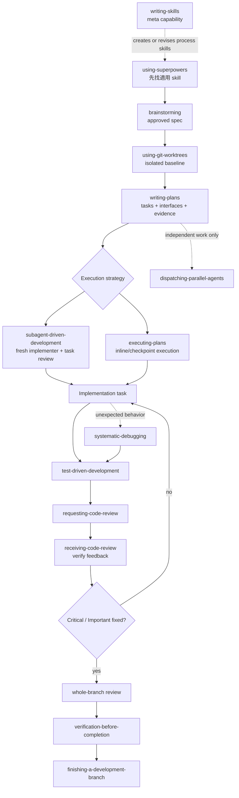
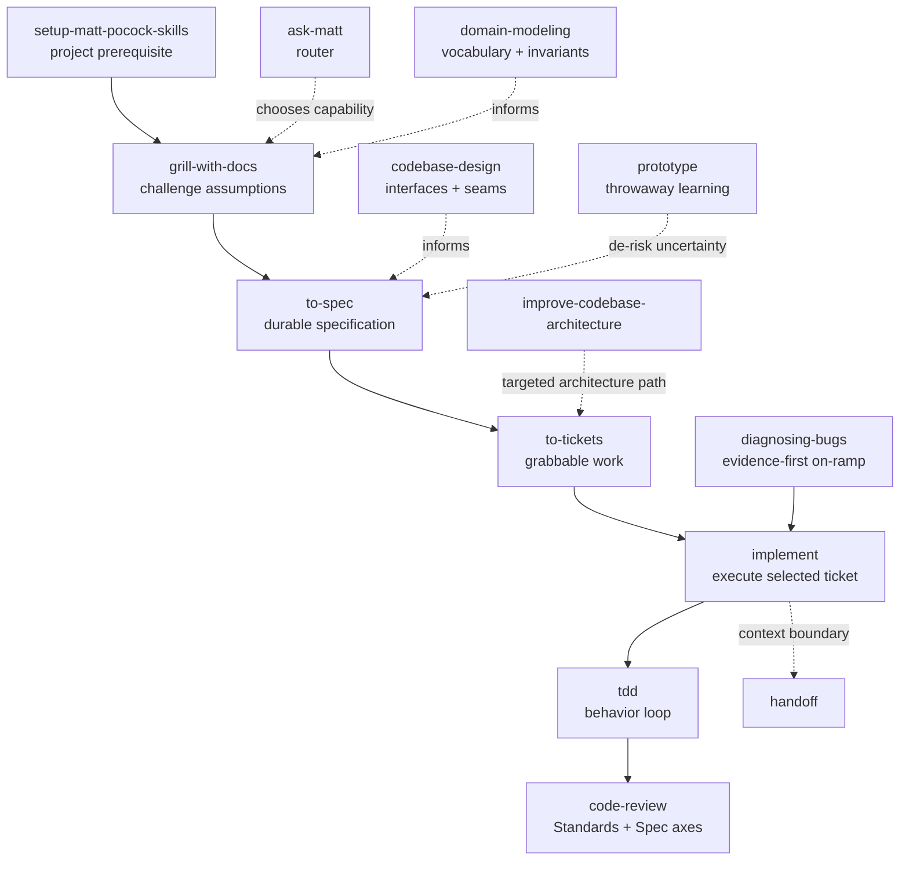

# 01 - 兩個 Skill 庫的 Workflow 全景

## 先給結論

Superpowers 與 Matt Pocock Skills 不是兩份不同措辭的相同工具箱：

- **Superpowers** 更接近 complete development methodology，用強 trigger、hard gate、固定 artifact transition 和 completion discipline 串起完整生命週期。
- **Matt Pocock Skills** 更接近 composable engineering toolset，強調使用者控制、文件驅動的需求澄清、artifact transformation、domain/design vocabulary 和按需組合。

> **本專題判斷**：先選 primary lifecycle，再補缺少的能力，比同時疊加兩套完整流程更穩定。

選擇時先決定 primary lifecycle，再補缺少的能力；不要把兩套所有 gate 疊成一條巨型流程。

本頁的版本敏感事實固定在：

- Superpowers `d884ae04edebef577e82ff7c4e143debd0bbec99`（`v6.1.1`）
- Matt Pocock Skills `ed37663cc5fbef691ddfecd080dff42f7e7e350d`（`v1.1.0-40-ged37663`）

## Superpowers 主流程



這張圖把 feature path 畫成一條主線，但真正控制流有三個重要分支：

- `subagent-driven-development` 與 `executing-plans` 是 execution strategy 的替代選擇，不是前後都跑。
- `dispatching-parallel-agents` 只適合沒有 shared state、沒有順序依賴的工作。
- `systematic-debugging` 在 bug、test failure 或 unexpected behavior 出現時插入，不是每個 happy-path task 都要完整走四階段。

## Superpowers 的分支與 Meta Skills

| 類型 | Skills | 在流程中的角色 |
|---|---|---|
| Discovery/design | `using-superpowers`, `brainstorming` | 先決定應遵循什麼流程，再形成 approved spec |
| Isolation/planning | `using-git-worktrees`, `writing-plans` | 固定 workspace、tasks、interfaces、commands 和 evidence |
| Execution | `subagent-driven-development`, `executing-plans`, `dispatching-parallel-agents` | 選擇 fresh-context、inline 或真正獨立的並行策略 |
| Quality loop | `test-driven-development`, `systematic-debugging`, `requesting-code-review`, `receiving-code-review` | 防止未證明實作、猜測式修 bug、盲目接受 feedback |
| Completion | `verification-before-completion`, `finishing-a-development-branch` | 把完成主張連到 fresh evidence 和明確 Git 決策 |
| Meta | `writing-skills` | 用類 TDD 方法建立/修改 skill，本身不在每個 feature 主線 |

Superpowers `v6.1.1` 的 SDD task review 要特別讀準：一位 fresh task reviewer 讀 task brief、implementer report 和固定 base/head 的 review package，依序輸出 Spec Compliance 與 Code Quality 兩個 logical verdict；所有 tasks 結束後，再做 broad whole-branch review。它不是兩位 task reviewer agent 的串接。

## Matt Pocock 主流程



這裡的 `setup-matt-pocock-skills` 是把 repository prerequisites 與文件入口放好，不代表每個 task 都重新執行。`ask-matt` 是能力 router，也不是交付 stage。

## Matt Pocock 的品質基礎與條件式能力

Matt 的主線可以理解為 artifact transformation：

```text
existing docs + conversation
  -> challenged decisions
  -> spec
  -> tickets
  -> implementation + tests
  -> review findings
  -> handoff when context changes
```

`domain-modeling` 和 `codebase-design` 位於這條線下方：它們提供 vocabulary、invariant、module、interface、seam、dependency direction 等品質語言，但不一定由每次 task 的使用者直接點名。

`prototype` 適用於「先學會問題再承諾設計」；產物應被明確視為 throwaway 或 learning artifact。`improve-codebase-architecture` 適合已有 domain context、希望找出可深化邊界的情況，不應變成與當前需求無關的全面 refactor。

## 相同名稱不代表相同責任

| 表面相似能力 | Superpowers | Matt Pocock | 關鍵差異 |
|---|---|---|---|
| 需求釐清 | `brainstorming` | `grill-with-docs` / `to-spec` | 前者是一條有 approval gate 的 design workflow；後者拆成 challenge 與 artifact conversion |
| 實作規劃 | `writing-plans` | `to-tickets` | 前者要求 task 內 exact steps/interfaces/evidence；後者偏向可獨立抓取的 issue/ticket graph |
| 執行 | `subagent-driven-development` / `executing-plans` | `implement` | 前者把 execution topology 和 review loop寫進 methodology；後者是可組合 orchestrator |
| TDD | `test-driven-development` | `tdd` | 都重視 behavior-first，但 trigger、host integration 和周邊 workflow 不同 |
| Debug | `systematic-debugging` | `diagnosing-bugs` | 都以 evidence/hypothesis 反對猜測；artifact 與停止規則的表達不同 |
| Review | task reviewer + `requesting-code-review` | `code-review` | 前者嵌在 execution lifecycle，另有 whole-branch review；後者突出 fixed base 與 Standards/Spec 分軸 |
| Context transfer | task brief/report/review package | `handoff` | 前者服務當前 task isolation；後者服務跨 session/person 的續接 |

因此 composition 應按 responsibility 補洞，而不是看到同名就重複執行兩次。

## 從任務類型選入口

| 任務 | 建議入口 | 原因 |
|---|---|---|
| 新 feature、需求仍模糊 | Superpowers `brainstorming`，或 Matt `grill-with-docs` | 先找未知決策和 acceptance boundary |
| 已有 spec，要拆工作 | `writing-plans` 或 `to-tickets` | 選擇 step-level plan 或 ticket-level graph |
| 小而明確的 behavior change | primary lifecycle + 對應 TDD | 不需要把所有 optional skills 都載入 |
| test failure / production bug | `systematic-debugging` 或 `diagnosing-bugs` | 先重現、定位 evidence 和單一 hypothesis |
| 只做 review | Matt `code-review` 或 Superpowers `requesting-code-review` | 先固定 review base、requirements 和 standards |
| domain 邊界模糊 | `domain-modeling` | 先統一 vocabulary、state 和 invariant |
| coupling/testability 惡化 | `codebase-design` / `improve-codebase-architecture` | 先找 interface seam 和 dependency direction |
| context 即將切換 | `handoff` | 固定 current state、decisions、evidence 和 next action |
| 建立自己的可重用流程 | Superpowers `writing-skills` | 用 pressure scenario 驗證 skill 是否真的改變行為 |

## 讀圖限制

箭頭表示固定 source 中明示的 transition、artifact dependency，或本專題為了理解而給出的 composition 建議；不是所有 harness 都會 runtime-enforce 每條邊。

尤其要注意：

- 安裝/載入方式由 host 決定，不能從 skill 正文單獨推導。
- 一個 skill 出現在流程圖，不代表所有 task 都適用。
- workflow 完整不代表 project facts 完整。
- fresh reviewer 降低 confirmation bias，不代表它能看到不存在的 invariant。
- 版本更新可能改變 prompt、agent topology、platform support 和 artifact contract，必須回到 pinned source refresh。

## 一句話總結

Superpowers 提供較完整且強 gate 的 delivery lifecycle；Matt Pocock Skills 提供更可組合的工程思考與 artifact 工具——先選主流程，再按缺口補能力，最後用專案規範和 evidence 補上 production boundary。
