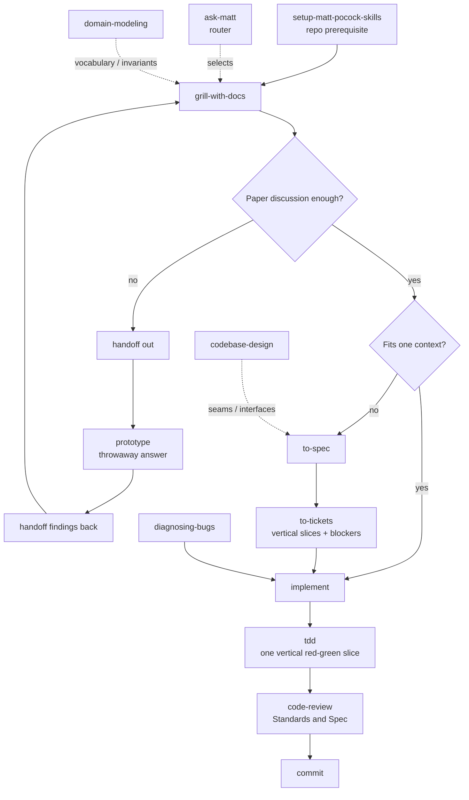

# Matt Pocock Skills 主流程

| Source field | Value |
|---|---|
| Library | `mattpocock/skills` |
| Local path | `/Users/buoy/Development/gitrepo/skills` |
| Snapshot | `ed37663cc5fbef691ddfecd080dff42f7e7e350d` (`v1.1.0-40-ged37663`) |
| Verified | `2026-07-21` |
| Primary sources | `README.md`, `skills/engineering/ask-matt/SKILL.md`, selected core/foundation skills |

## 先給結論

Matt 的 main flow 是「保留使用者控制的 artifact pipeline」，不是一鍵接管 SDLC：先用conversation澄清，再依工作大小決定同 session implementation，或先轉 spec/tickets後讓每個 ticket在fresh context實作。`implement`內部使用 `tdd`，完成前做 `code-review`。

> **本專題判斷**：這套 flow的可組合性很高，但 production assurance取決於 conversation/spec/ticket是否攜帶完整 project invariants和evidence requirement。

## Setup and Routing

`setup-matt-pocock-skills` 每 repo執行一次，建立其他engineering skills依賴的 issue tracker、triage labels和domain docs consumer rules。`ask-matt`在使用者不記得所有skills時提供route，不寫code也不創造delivery artifact。

安裝方式與 invocation是 snapshot-sensitive：skills.sh可把可編輯skills複製到不同Agent-Skills harness，Claude Code plugin則是managed bundle。這是distribution選擇，不改變skill正文的工程責任。

## Grill -> Spec -> Tickets



`grill-with-docs` 本身很薄：它要求執行底層 `grilling`，同時使用 `domain-modeling`。因此 interview不只產生對話結論，也會在term crystallize時更新 `CONTEXT.md`，在hard-to-reverse/surprising/real-trade-off同時成立時才記ADR。

`to-spec` 不再訪談；它合成已經討論過的內容。它會先探索codebase和domain docs、提出最高可用test seam並與使用者確認，然後形成Problem、Solution、extensive User Stories、Implementation Decisions、Testing Decisions、Out of Scope和Further Notes。它刻意不寫容易漂移的file path/code snippet，prototype decision-rich片段例外。

`to-tickets` 把spec拆成可demo/verifiable、單一fresh context可完成的tracer-bullet vertical slices，並明確寫blocking edges。Wide mechanical refactor不是硬切vertical slice，而採expand → migration batches → contract，必要時用integration branch和final integrate/verify ticket保持可交付邊界。

## Implement -> TDD -> Code Review

`implement` 很短，代表作者偏好composition：根據spec/tickets實作，在pre-agreed seams盡量使用 `tdd`，過程定期跑typecheck和single tests，最後跑full suite，再做 `code-review`，最後commit。

Matt `tdd` 有兩個值得特別注意的選擇：

- tests只從public interface/seam觀察behavior，test seam必須先與使用者確認；
- red → green採one seam/one test/one minimal implementation的vertical slice；refactoring被放到review stage，不在每輪red-green裡展開。

`code-review` 固定使用者提供的commit/branch/tag/merge-base，以三點diff對merge-base。它平行 dispatch兩個subagents：Standards軸讀repo standards加Fowler smell baseline，Spec軸讀originating issue/PRD。最後side-by-side呈現，不把兩軸findings合併rerank成總分。

## Bug On-Ramp

`diagnosing-bugs` 從「建立一個已經能對此bug變紅的tight feedback loop」開始，而不是先讀code猜root cause。完整路徑：

```text
red-capable command
  -> reproduce and minimise
  -> 3–5 ranked falsifiable hypotheses
  -> one-prediction instrumentation
  -> regression test at the correct seam + fix
  -> original-loop verification + cleanup + post-mortem
```

如果沒有correct seam能鎖住bug，這本身是architecture finding；先修bug，再把具體資訊交給 `improve-codebase-architecture`，不要在證據不足時先做大refactor。

## Handoff Across Context Boundaries

`handoff` 將conversation壓成OS temporary directory中的Markdown，建議next-session skills，引用已存在的spec/plan/ADR/issue/commit/diff而不重複，並redact secrets/PII。正確使用方式是fresh session reference該檔案，不是在原context假裝已清空。

`ask-matt` 也區分：

- `handoff`：fork/跨session，保留特定任務上下文；
- built-in compact：繼續同一conversation、接受早期turn被摘要。

Main flow建議grill → spec → tickets保持同一unbroken context；每個implement ticket再fresh context。接近model smart zone時用handoff，而不是讓reasoning quality無聲下降。

## Quality Foundations

`domain-modeling` 管domain words和decisions：澄清fuzzy/overloaded terms、用concrete scenarios壓boundary、對照code、即時更新純glossary的 `CONTEXT.md`，必要時才ADR。

`codebase-design` 管code shape vocabulary：Module、Interface、Depth、Seam、Adapter、Leverage、Locality。Interface不只是type signature，還包含caller必須知道的invariants、ordering、errors、configuration和performance。深度用leverage衡量，不用implementation/interface行數比。

這兩個foundation能提高可讀性、interface quality和testability，不能自己決定業務transaction、timeout budget或authorization policy。

## Conditional Prototype and Architecture Paths

`prototype` 只回答一個paper上難決定的問題：logic/state model走interactive terminal app，UI問題走同route多個radically different variations。它從第一天就標記throwaway，預設無persistence、無tests、無production error handling；保留的是decision和throwaway branch primary source，不是把prototype code直接merge。

`improve-codebase-architecture` 先按使用者scope或recent hot spots探索shallow modules/locality/coupling/test friction，產生OS temp中的visual HTML candidate report；使用者選candidate後才grill interface，並用domain-modeling同步terms/ADR。它是survey，不是自動大改code。

## Artifact Flow

| Stage | Artifact | Consumer |
|---|---|---|
| Setup | `docs/agents/*.md` + instructions block | tracker/domain-aware engineering skills |
| Grill/domain modeling | `CONTEXT.md`, occasional ADR, resolved conversation | `to-spec` or direct `implement` |
| Prototype detour | throwaway branch + captured verdict | original design thread/spec |
| Spec | issue/PRD | `to-tickets`, `code-review` Spec axis |
| Tickets | tracker issues/local files + blocking edges | fresh `implement` sessions |
| Implementation | code/tests/typecheck/full suite | `code-review` |
| Review | separate Standards/Spec reports | human/implementer fixes and decision |
| Handoff | temporary redacted summary + references | fresh context |

## Where Human Control Remains

使用者仍決定：

- grilling何時達到shared understanding；
- test seams是否真的是critical public interfaces；
- ticket granularity和blocking edges；
- prototype問題/分支是否選對；
- fixed review point和spec source；
- code smell judgment是否符合repo標準；
- architecture candidate是否值得進main flow；
- project risk和production acceptance。

這正是「不奪走控制」的代價：skills提供discipline和vocabulary，人仍要提供真實約束並批准不可逆決策。

## 一句話總結

Matt flow把alignment、domain language、spec、tickets、TDD、two-axis review和handoff做成可拆換工具；它的production上限由你放進這些artifacts的project facts決定。
