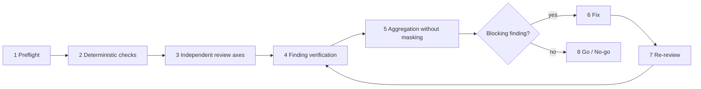

# 01 - AI Code Review 心智模型

## 先給結論

Code Review應被設計成 decision system，而不是「第二雙眼睛」。Reviewer對固定candidate使用明確rules和independent lenses提出claims；controller驗證claims、安排修復和re-review；delivery authority最後根據未解決finding與fresh evidence做go/no-go。

這裡有三個不可混淆的boundary：

- **candidate truth**：固定base/head、diff、repository state與requirements packet所描述的待審事實。
- **review claim**：reviewer對candidate提出、帶有rule、impact與evidence的可證偽主張。
- **delivery decision**：claims經verified、fixed、disputed或explicitly accepted後，對交付作出的go/no-go。

Reviewer不是candidate truth的作者，也不能只因自己很有信心就把claim變成delivery decision。

## Review Is a Decision System

一個完整review system包含五種責任：

| 責任 | 問題 | 典型owner |
|---|---|---|
| Candidate construction | 到底review哪個變更與哪個repository state？ | Controller / CI |
| Rule provision | 哪些spec、project standards、invariants和risk policies適用？ | Project owner / artifact owner |
| Semantic judgment | Diff是否違反某條要求，可能造成什麼impact？ | Independent reviewer(s) |
| Claim verification | Evidence是否成立，需不需要focused test、trace或source inspection？ | Controller / verifier |
| Delivery authority | 未解決風險是否阻擋merge/deploy，誰可接受exception？ | Human/project gate |

把這些責任全塞給一句「review這段code」會產生三種假確定：candidate range不明、reviewer憑generic常識補policy、最後以沒有authority的總結宣告ready。

## The Eight-Stage Loop

本專題定義的exact loop是：



1. **Preflight**：固定base/head、確認diff非空、收集spec、Project Overlay、standards、tool outputs和review scope。
2. **Deterministic checks**：先跑compiler、tests、typecheck、lint、schema/contract check等機械證據，避免semantic reviewer浪費在工具已能確定的事項。
3. **Independent review axes**：Spec、domain correctness、architecture、tests等concerns分開判斷；高風險lens按applicability加入。
4. **Finding verification**：檢查location、rule、execution path與impact；需要runtime evidence的claim進focused verification。
5. **Aggregation without masking**：去重和建立dependency可以，但不以總分把一個Critical defect平均掉，也不讓一軸pass抵消另一軸fail。
6. **Fix**：按verified severity與dependency修復，保留每項status和covering evidence。
7. **Re-review**：review修復後的新candidate，確認原問題解決且沒有回歸；不是只相信implementer說「fixed」。
8. **Go / No-go**：blocking findings清零、exceptions有authority與expiry、required evidence fresh後才能放行。

若finding被駁回或接受風險，它仍需要留下reason與owner；「不修」不是從ledger刪除。

## Deterministic Evidence vs Semantic Judgment

Deterministic check與semantic review是互補關係：

| 類型 | 擅長 | 不擅長 |
|---|---|---|
| Compiler/typecheck/linter | syntax、type、已編碼style、部分static rule | business invariant、scope correctness、fallback semantics |
| Unit/integration/contract tests | 已寫下scenario的可重現behavior | 證明scenario集合完整、判斷測試oracle是否正確 |
| Migration/security/performance tools | 特定mechanical or empirical property | 決定project可接受的risk與trade-off |
| Semantic reviewer | 對照spec、domain與architecture發現missing/extra/wrong behavior | 從不存在的policy推導真實需求；取代runtime evidence |

Review packet應附上deterministic outputs，但reviewer不能把「tests pass」當成correctness proof。它要問：測試是否在正確seam、expected value是否獨立、failure/concurrency/replay scenario是否適用、未測行為是否正是高風險路徑。

## Context Isolation and Confirmation Bias

Implementer self-review有價值：它能在交付前找漏檔、debug noise、scope creep、弱命名與缺測試，並產生implementation rationale和test evidence。它應是preflight的一部分。

但self-review不能成為唯一approval gate：

- implementer已投入某個解法，容易把spec解讀成支持現況；
- 它知道自己的intent，可能看不見code實際傳達的錯誤；
- 自己產生的tests與實作可能共享同一錯誤假設；
- rationale可能無意間替脆弱設計降級severity；
- separation of duties要求candidate author不能單獨批准candidate。

Fresh reviewer應接收bounded packet，而不是整段implementation conversation。隔離的目的不是讓它「什麼都不知道」，而是只知道判斷所需的candidate、requirements、policy和evidence，不繼承implementer的結論。

## Review Packet as an Interface

Review packet是controller與reviewer之間的typed interface，至少包含：

| Field | Purpose | 缺少時的failure |
|---|---|---|
| Base / head identity | 固定candidate range | review錯diff、漏掉多commit變更 |
| Commit list + diff/stat | 顯示change shape與完整內容 | scope與cross-file relationship不可見 |
| Spec / task brief | 定義requested behavior與out-of-scope | reviewer只能做generic code critique |
| Project standards / Overlay | 提供invariants、compatibility、risk與commands | Agent憑空猜production policy |
| Implementer report | 提供claims、concerns、tests與known limitations | reviewer重做探索或漏掉explicit concern |
| Deterministic evidence | 區分已證明與待判斷事項 | 重複跑昂貴checks或誤信口頭pass |
| Review axis / lens contract | 限定責任與finding format | 多reviewers重複掃同一表面問題 |

Packet內容本身也要驗證：bad ref、empty diff、stale generated diff、缺spec或test output不是「交給reviewer自己想辦法」，而是preflight failure或明確降級狀態。

## Independent Axes and Risk Lenses

**Axis** 是每次production review都應明確考慮的核心責任，例如：

- Spec Compliance；
- Correctness and Domain Invariants；
- Architecture and Maintainability；
- Test Quality。

**Risk lens** 是按change applicability加入的專門視角，例如Security、Reliability/Fallback、Performance/Capacity、Observability/Operability、Data Migration/Compatibility。

獨立不是指必須一軸一個Agent，而是concerns、inputs和verdict不能互相掩蓋。一位fresh reviewer可以依序輸出多個logical verdict；多位reviewers也可能因共享不完整packet而一起漏錯。

不要用average score聚合：Spec 10/10與Correctness 2/10不是平均6/10後「勉強可過」。任一applicable blocking finding都保留自己的gate effect。

## Findings Are Claims to Verify

Finding不是命令，而是一個可證偽工程claim：

```text
在 location L，candidate違反 rule R；
沿 execution path P會造成 impact I；
目前 evidence E支持此判斷；
可用 verification V證實或駁回。
```

因此reviewer應區分：

- **verified from candidate**：diff與給定source已足以證明；
- **needs-verification**：風險合理，但需查unchanged call site、跑focused test或取得runtime fact；
- **disputed**：implementer/controller提供反證，等待裁決；
- **false positive**：claim被evidence駁回，保留原因以校準review；
- **accepted risk**：finding成立但由有權者限時接受，附owner與follow-up。

沒有evidence不代表風險不存在，但不能把猜測包裝成已證實Critical。正確狀態是needs-verification，並指出最小驗證方法。

## Re-review and Decision State

Fix會創造新的candidate truth。原review只對舊BASE..HEAD成立，因此「已改code」不等於finding已closed。

Re-review至少確認：

1. 原rule violation是否真的消失；
2. covering test/evidence是否能在新HEAD重現；
3. fix是否引入scope creep、compatibility或新的failure mode；
4. 相關findings的status是否同步更新；
5. broad branch interaction是否仍需final review。

Decision state可簡化為：

```text
OPEN -> VERIFYING -> VERIFIED -> FIXED -> RE_REVIEWED -> CLOSED
                    \-> DISPUTED / ACCEPTED_RISK
```

只有closed或有authority的accepted-risk findings不再阻擋；needs-verification、verified blocking與未re-review的fixed finding仍不是pass。

## Human Responsibility

AI不能代替人或project governance決定：

- 真正的business invariant和acceptable inconsistency window；
- security/data classification與legal obligation；
- SLO、capacity、RPO/RTO和blast radius；
- 是否接受compatibility break、migration risk或manual recovery；
- exception owner、expiry與release timing；
- 哪些risk需要human approval或specialist sign-off。

Human也不應只回覆「看起來可以」。它的責任是提供缺失fact、裁決policy conflict、接受或拒絕具名risk。AI則負責把candidate、claims和evidence整理成可做決策的形式。

## 一句話總結

AI Code Review把固定candidate轉成可驗證claims，再把claims經fix、re-review和explicit authority轉成delivery decision；任何一段被省略，都只剩「另一個模型的看法」。
