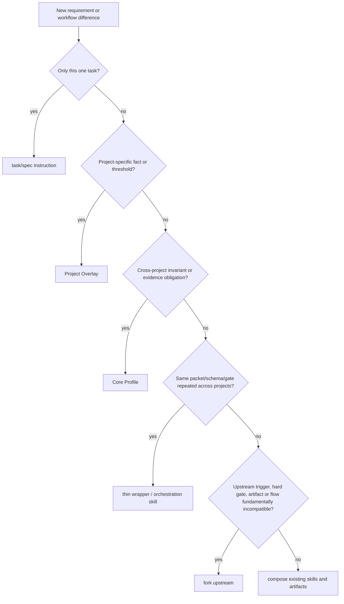

# 04 - 把 Production Profile 接進 Agent Skills

## Policy Status

本頁是Normative composition policy。它不改寫兩個upstream libraries，而是規定Core Profile、Project Overlay與evidence artifacts如何進入既有workflow transitions。

## 先給結論

優先composition，不要先fork。Workflow skill負責「按什麼順序工作」，Profile負責「本project什麼不能錯」，review/evidence負責「如何證明」。只要controller能把Profile artifacts放進spec、task brief、review packet和gate，就不需要修改upstream prompt。

固定flow：

```text
brainstorm / grill
  -> identify applicable rules and invariants
spec
  -> turn them into acceptance criteria
plan / tickets
  -> map each criterion to implementation and evidence
TDD / implementation
  -> prove behavior at agreed seams
AI Code Review
  -> review against spec, Core, and Overlay
verification
  -> collect fresh command and runtime evidence
merge gate
  -> block unresolved Critical and unauthorized Important findings
```

## Integration Principle

每個transition都要有四件事：

1. **Inputs consumed**：applicable Core IDs與確切Overlay facts；
2. **Artifact produced/updated**：下一stage可讀的canonical output；
3. **Evidence before transition**：足以證明上一stage claim的資料；
4. **Unavailable claims**：facts/evidence缺失時不得宣告什麼。

Profile不是在code review前才突然加入的checklist。若data invariant到review才第一次出現，spec、plan和tests早已沿錯誤acceptance boundary實作。

## Brainstorm / Grill

| Contract | Required content |
|---|---|
| Inputs consumed | System purpose/risk classification、domain glossary、existing Overlay、Core applicability triggers、ADRs/incidents |
| Artifact produced/updated | Resolved design branches、candidate invariant/state list、applicability draft、missing-fact questions與owner |
| Evidence before transition | Product/domain/data/security/operations owners確認applicable facts或明確deferred date |
| Unavailable claims | 缺criticality、source of truth、failure impact時，不能聲稱scope/risk已收斂 |

此stage的目標不是把30條rules逐題背完，而是根據change surface找出真正applicable boundaries。Paper上無法決定的UI/state問題可用throwaway prototype，但prototype不能替代production facts。

## Spec

| Contract | Required content |
|---|---|
| Inputs consumed | Approved design、applicable Core IDs、Overlay invariants/budgets/compatibility/security/recovery facts |
| Artifact produced/updated | 每個rule轉成observable acceptance criteria、failure/forbidden states、out-of-scope與test seam decisions |
| Evidence before transition | Traceability從Core/Overlay到每條criterion；domain owner確認business semantics |
| Unavailable claims | 缺invariant不能聲稱Spec Compliance可判；缺budget/fallback不能承諾resilience |

Spec引用rule ID但不能只寫「遵循`DAT-001`」。它要填本change的transaction boundary、allowed failure state和expected result。

## Plan and Tickets

| Contract | Required content |
|---|---|
| Inputs consumed | Spec criteria、Core/Overlay、canonical commands、migration/deploy constraints |
| Artifact produced/updated | 每criterion到implementation seam、task/ticket、test/failure injection、runtime/migration/rollback evidence的mapping |
| Evidence before transition | Dependencies/ordering可落地；每task有bounded interface與verification；global constraints固定exact values |
| Unavailable claims | 沒有evidence owner/command的task不能聲稱delivery-ready；horizontal half-state不能聲稱vertical value |

Multi-session tickets要攜帶rule IDs和acceptance/evidence，不把「production hardening」留成最後一張無邊界ticket。

## TDD and Implementation

| Contract | Required content |
|---|---|
| Inputs consumed | Agreed public seams、acceptance scenarios、Overlay failure/concurrency/replay facts、module/interface conventions |
| Artifact produced/updated | Code、independent-oracle tests、failure evidence、implementer report、concerns與traceability links |
| Evidence before transition | 正確原因的RED、minimal GREEN、applicable focused/full commands；critical paths含failure injection |
| Unavailable claims | GREEN只證明已寫scenario；未測concurrency/migration/runtime path不能聲稱完整production correctness |

`MOD-003`不要求每次抽interface或framework。先保持cohesion/locality；只有真實consumer、variation或policy duplication才提取reuse。

## AI Code Review

| Contract | Required content |
|---|---|
| Inputs consumed | Fixed BASE/HEAD diff、spec、Core rule mapping、Overlay facts、ADRs、implementer report、fresh deterministic outputs |
| Artifact produced/updated | 四軸/applicable lenses verdicts、11-field findings、coverage limitations與finding ledger |
| Evidence before transition | 每finding有rule/location/impact/evidence/verification；needs-verification被查證或保持阻擋相關claim |
| Unavailable claims | 缺spec不能判Spec pass；缺invariant不能判consistency pass；reviewer不能發明policy或批准delivery |

Aggregation不平均severity。Core rule提供通用obligation，Overlay提供本project threshold/semantic，spec提供本change scope。

## Verification

| Contract | Required content |
|---|---|
| Inputs consumed | Required Evidence fields、Project commands/environments、finding verification與fix mapping |
| Artifact produced/updated | 當前HEAD的command/output、failure/runtime/migration/rollback proof、re-review status |
| Evidence before transition | 所有applicable checks fresh passing；fixed findings已re-review；warnings/skips/limitations可見 |
| Unavailable claims | 歷史CI、implementer摘要或stale output不能證明current candidate；無restore drill不能聲稱backup可恢復 |

## Merge / Delivery Gate

| Contract | Required content |
|---|---|
| Inputs consumed | Candidate identity、applicability matrix、verification packet、findings、exceptions、rollout/recovery readiness |
| Artifact produced/updated | Go/No-Go/Pending record、authority、open-risk inventory、exact deploy boundary與follow-ups |
| Evidence before transition | Zero unresolved Critical；Important verified或authorized accepted-risk；candidate未在evidence後改動 |
| Unavailable claims | 不可用總分/多數pass掩蓋Critical；無authority/expiry的exception不成立；merge不自動等於deploy-ready |

## Superpowers Integration Map

| Superpowers stage/artifact | Profile injection | Controller action |
|---|---|---|
| `brainstorming` | Risk classification、applicable Core questions、Overlay invariants | 在design approval前暴露missing facts和owners |
| `writing-plans` Global Constraints | Exact rule IDs、budgets、formats、state relationships、forbidden outcomes | Verbatim固定跨tasks都成立的values |
| `writing-plans` Interfaces/tasks | Public seams、task inputs/outputs、required commands/evidence | 每task能獨立驗證且不遺失production criterion |
| Implementer task brief | Bounded requirements + relevant Core/Overlay subset | 不把整份Profile灌入；只給task applicable facts |
| Implementer report | Files、tests、failure evidence、concerns、rule mapping | Report是claim，保留exact commands/output paths |
| SDD task review packet | Brief/report/fixed diff + binding constraints | Fresh reviewer依序判Spec/Quality並可引用rules |
| Whole-branch review | Merge-base package、full spec/Profile mapping、Minor ledger | 找跨task/mixed-version/architecture interaction |
| `verification-before-completion` | Required evidence checklist | 對current HEAD重跑，不以舊output聲稱完成 |
| `finishing-a-development-branch` | Go/no-go與rollout/recovery record | Git integration choice不替代production delivery decision |

Editing upstream prompts不是必要條件。Controller可把Core/Overlay作為Global Constraints、task brief和review packet inputs；這保留upstream updates並讓project facts有canonical owner。

## Matt Pocock Integration Map

| Matt skill | Profile integration | Avoided duplication |
|---|---|---|
| `grill-with-docs` | 用Core triggers追問Overlay missing facts，更新domain glossary/必要ADR | 若Superpowers已brainstorm，只補未決domain/risk branches |
| `domain-modeling` | 精確terms、scenarios、ownership/invariants | 不把完整spec塞進`CONTEXT.md` |
| `codebase-design` | 用Module/Interface/Seam等語言回答`MOD-*` | 不因Profile就抽象所有implementation |
| `to-spec` | 把已確認Core/Overlay decisions轉acceptance/testing decisions | 已有approved spec時不重做interview |
| `to-tickets` | 每vertical ticket帶rule IDs、evidence和blocking edges | 不與Superpowers writing-plans產生雙truth source |
| `implement` | 以agreed seams執行TDD、final suite與review | Primary lifecycle已有execution controller時只用所需discipline |
| `tdd` | Tests對應`TST-*`與Overlay scenarios | TDD不自行發明unprovided failure cases |
| `code-review` | Standards軸消費Core/repo rules；Spec軸消費approved criteria；固定three-dot base | 可將findings送入primary fix/re-review gate，不重跑同責任review |
| `handoff` | 保存applicability、open decisions、evidence/findings與next gate | 不複製secrets或已存在完整artifacts |

Matt helpers可以豐富Superpowers primary lifecycle，尤其domain modeling、codebase design、fixed-base review與handoff；不需要把Matt整條grill→spec→tickets→implement再疊一遍。

## Overlay vs Core vs Wrapper vs Fork



Terminal rules：

- **project-specific fact or threshold → Project Overlay**；
- **cross-project invariant or evidence obligation → Core Profile**；
- **same packet/schema/gate repeated across projects → thin wrapper/orchestration skill**；
- **upstream trigger/hard gate/artifact/flow fundamentally incompatible → fork upstream**；
- **one-off task difference → task/spec instruction, not a new skill**。

Fork的持續成本包括source drift monitoring、merge/rebase burden、skill behavior testing、distribution/versioning，以及使用者不知道該選upstream還是fork的confusion。沒有具體structural conflict時，default是composition。

## Conflict Resolution

優先序：system/safety/tool boundary與user authority → repository instructions/approved spec/ADR → Project Overlay/Core policy → primary lifecycle → optional helper。

處理方法：

- Profile與approved spec衝突：列出rule和spec文字，由有authority的人修改其中一個；reviewer不靜默選邊。
- Helper與primary gate重疊：保留primary transition，只消費helper新增artifact/finding。
- Core與Overlay衝突：Overlay可提供更嚴格/具體值；不能在不走exception/version process下取消Core obligation。
- Upstream更新改artifact/topology：先refresh Descriptive docs，再驗證wrapper，不把舊假設當current behavior。

## Minimal Examples

### Project threshold

「risk API total budget 400 ms、2 × 150 ms」只進Overlay；Core保留`RES-002`的bounded-work義務。

### Cross-project rule

「retry前必須分析idempotency與unknown outcome」跨project成立，保留為`RES-002`/`DAT-002`，不複製到每個skill prompt。

### Thin wrapper

多個repositories都需要將Core/Overlay、fixed diff與deterministic outputs組成相同11-field review packet，可寫薄wrapper生成packet並呼叫既有review skill；wrapper不重新定義TDD或branch lifecycle。

### Fork threshold

若upstream review硬性把所有findings平均成一個score，且無法由controller保留per-axis blocking state，這是artifact/gate結構衝突，才有fork證據。單純想多加一個security lens不需要fork。

## 一句話總結

讓skills控制可靠工作順序，讓Core/Overlay提供不可猜的工程事實，讓evidence/review gate控制交付；只有workflow結構真正不相容時才fork。
