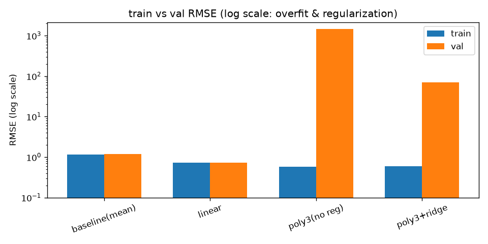
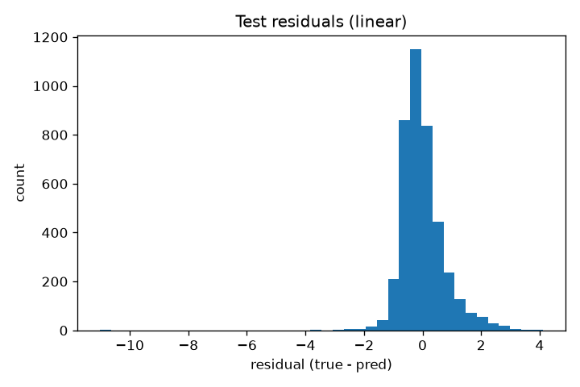

# A3 房价预测 · 结果

> 由 `train.py` 生成,固定 seed,可复现。

## train vs val RMSE

| 模型 | train RMSE | val RMSE | gap(val-train) |
|---|---|---|---|
| baseline(mean) | 1.1509 | 1.1719 | +0.0210 |
| linear | 0.7172 | 0.7278 | +0.0106 |
| poly3(no reg) | 0.5826 | 1449.9160 | +1449.3335 |
| poly3+ridge | 0.5865 | 69.7686 | +69.1821 |

怎么读这张表:

- **baseline**:永远预测均值,train≈val,是任何模型要赢过的地板。
- **linear**:train/val 都最低且接近 —— 复杂度刚好,**它才是这题的最优解**。
- **poly3(no reg)**:3 次多项式把 8 个特征炸成 165 个高度共线的特征,无正则的线性回归系数失控,val RMSE 数值爆炸到 ~10^3(外推灾难)。train 不算差但 val 崩 = 教科书级过拟合。
- **poly3+ridge**:同样的多项式加 L2 正则,把 val 从 ~1449 压回 ~70 —— 正则**缓解**了过度复杂,但仍远差于 linear。**资深结论:正则不能替代「选对模型复杂度」**;先把复杂度配对问题,再谈调正则。

## 最终模型(linear)在 test 上

- RMSE = 0.7495
- MAE  = 0.5333

RMSE 比 MAE 大,因为平方放大了少数大误差(高价房尾部)。关心典型误差选 MAE,想重罚大错选 RMSE。

## 数据泄漏演示(target leakage)

- 诚实管线 val RMSE = 0.7278
- 泄漏管线 val RMSE = 0.0100(混入了从 y 派生的特征)

泄漏管线分数好得不真实 —— 上线即翻车。面试要能一眼认出这种坑:任何「上线时拿不到、却由目标推导出来」的特征都是泄漏。

