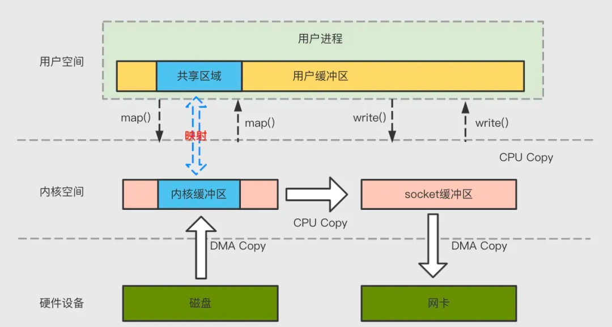
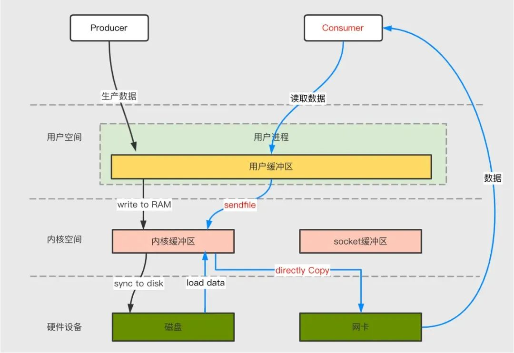
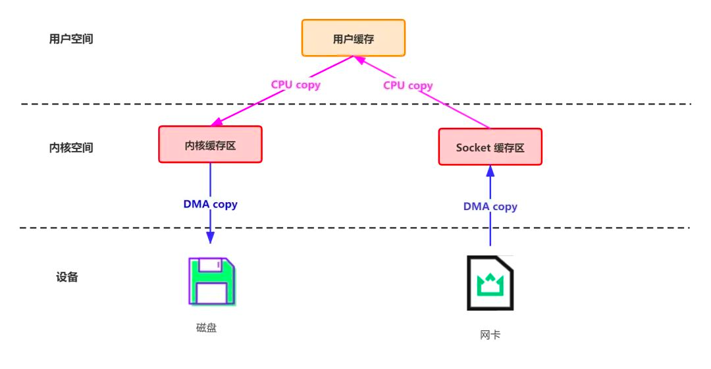

## 概述

mmap 和 sendfile 都是0拷贝技术, 
mmap 用户态可以取到具体buff, mmap可以实现的功能更多,
sendfile取不到具体buff, 但是性能更高, 
参考: https://mp.weixin.qq.com/s/4ZTqvsLzg6-kJFJez4Zkqw

## mmap

### 简述

网络数据持久化磁盘主要用 mmap 技术，

mmap 将**内核中读缓冲区（read buffer）的地址与用户空间的缓冲区（user buffer）进行映射**，从而实现内核缓冲区与应用程序内存的共享，省去了将数据从内核读缓冲区（read buffer）拷贝到用户缓冲区（user buffer）的过程，整个拷贝过程会发生4次上下文切换，1次CPU 拷贝和2次 DMA拷贝。

## sendfile

网络数据传输环节主要使用 sendfile 技术。 **直接从内核readbuffer copy到网卡.**

具体在这里采用的方案是通过 NIO 的 transferTo/transferFrom 调用操作系统的 sendfile 实现零拷贝。总共发生2 次内核数据拷贝、2次上下文切换和一次系统调用，**消除了 CPU 数据拷贝(用户空间的2次copy(进/出))**，如下：

## 传统模式

数据从网络传输到文件需要4 次数据拷贝、4次上下文切换和两次系统调用。

