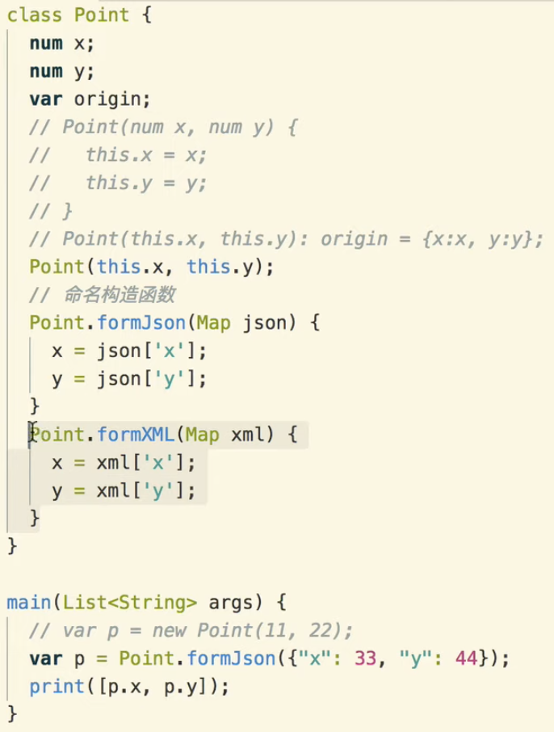
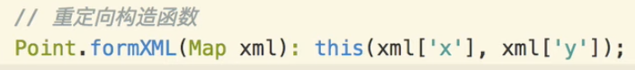

[toc]

## 概述

和 java 很像

1. 在构造函数后跟`:`, **初始化变量列表**
2. 构造函数还可以**从json/xml构建**.



重定向到默认构造函数




**class内的final**变量, 在**构造函数时必须初始化**. 如果是从json/xml构建, 需要重定向才能编译通过


**私有变量: _开头**. 例: _name


**static 静态成员:** 变量. 方法.


## abstract 抽象


**可以不包含未实现**的方法.

可以通过 **extends/implement 2种方式实现**. 
通过**implement**, function**必须全实现**, 这种方式其实**就是接口**. **dart 没有 interface** 关键字.


## implement

可以 implement abstract/class;

一个**class**可以 **implement 多个 abstract/class**;


## extends

有super;

可以extends abstract;

可以 `@override` 父函数.


## with (mixin)

可以多继承

```
class Xiaomi extends AndroidPhone with AndroidSystem, Weixin {} //AndroidPhone, AndroidSystem, Weixin 都是class
```

如果函数名冲突, 取最后一个with装载进来的 class的function实现.

