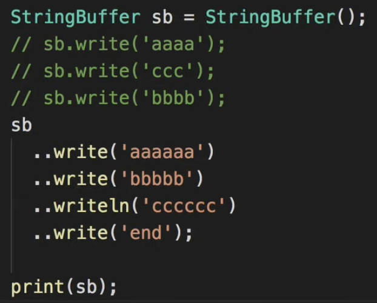
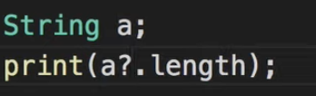
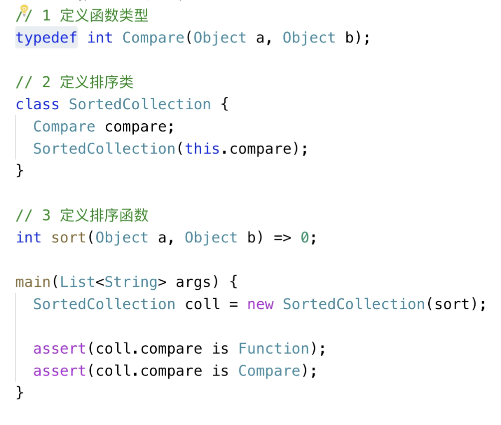

[toc]

## as/is/is!

类型**转换**

```
String b = a as String；
```


类型**判断**

```
print(a is! String)；
```


## 2元操作符

和java一样


## ??

**用于设置默认值**, 如果变量为 null, 取`??`后边的值, 非null则不变.

```
isFinish == true //有这行, isFinish 就是 true, 无则 false;
isFinish = isFinish ?? false
print(isFinish); 
```

```
isFinish ??= false // 简写
```


## ..

链式调用.




## ?.

**null判断, 防null异常**




## if/for/switch/while

和java一样


## 泛型 

同java


## typedef 定义函数类型




