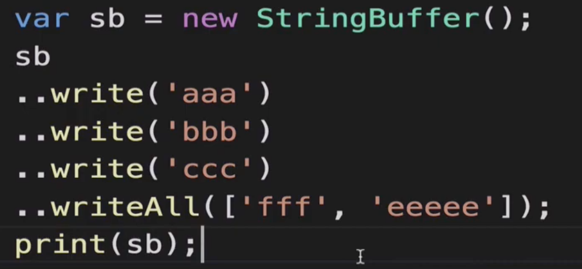
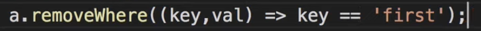
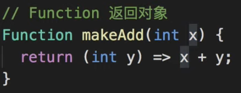

[toc]


## 综合

**一切對象(强/弱)默認是null**


## 弱類型

var

object

ide/編譯階段檢查類型


dynamic

執行是才發現沒有xxx()方法


## 強類型

### string, stringbuffer, runes

" 原始方式

' 拼接很灵活,  可转义 `\n`

```
a = 'hello'    ' '    'word'；// hello word
```

''' 保留格式(换行)

```
'''
asd
asd
'''
```


#### stringbuffer




#### runes (操作32unicode编码)

表情符号 占用多字节, 用 runes 可以取出正确分隔的对应的表情符号,


### bool, 

### num, int, double, 

int 支持 10/16进制, 16可以表示颜色

转换: int.parse（'123'） ; 123.tostring();

### list, set, map

#### list

List l = new List() 长度不限

List l = List(3) 限长度

List l = [1, 2, 3]


#### map

类似 list

lambda写法


#### set

按插入顺序?




### symbol

用来反射


### enum

就枚举


### function




## 常量

final, 不能和 var 共用


const, 


### 区别

final, 可以运行时才决定(通过函数返回值定义), 
const, 在编译阶段已确定.


## 对象比较

identical（Ls1, Ls2）

final, 相同value, 不同对象; const 如果相同就是同一对象.


### 位运行

完全一样


