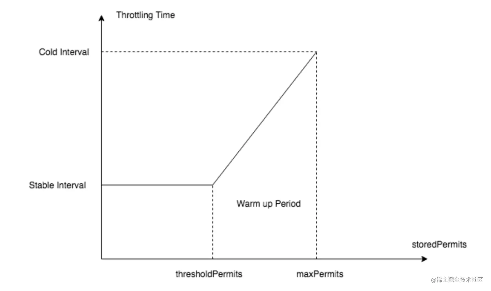

[toc]

## 概述

### 固定窗口

当前时间对比的是上次记录的**窗口开始**的timestamp,
且粒度较大, 可以导致,在**本次窗口的结尾**和**下次窗口的开头**的时间段内超过设定的qps.

#### 缺点

窗口切换之间, 可能导致2倍限制的qps.
可以因为窗口内前期消耗完次数, 导致后半段**服务不可用**的表现, 不够均衡.

优点, 实现简单.

#### 滑动窗口

array: array<requestObj<timestamp(超出窗口则update), count(超出窗口则归零)>> 最后统计所有子窗口内的request总数,
整体思路是, 

### 滑动日志

思路与滑动窗口大致相同,
linklist: 改为记录request的timestamp, 清除窗口外的request, 每次都用**当前timestamp作为窗口结尾**统计在**窗口内的request总数**来判断是否达到阈值.

#### 优点

解决固定窗口算法的流量突刺问题.

### 漏桶算法

每次request, 都与上次request timestamp比较时间差, 并计算可以漏水量(这次柯通过的request数),
先减去可以漏的水, 
查看当前的桶是否满, 不满, 水量+1(当前request); 满, 触发限流策略.

#### 优点

漏桶的漏出速率是固定的，可以起到整流的作用。

#### 缺点

不能解决流量突发的问题。

### 令牌桶算法

与漏桶算法想法, 而是想象成**以恒定的速度放token入桶**, 当request到来, 如果取得token, 则进行处理.

- 突发流量第一个周期放过的请求数。如存量桶系数等于 0.6，第一个周期最多放过 1.6 倍限流值的请求数。
- 存量桶系数越大，越能容忍流量不均衡问题。误杀率越低. (误杀率: 当做整体限流时, 会对未满足单台qps的实例限流. 可以通过, 拉长限流周期。令牌桶算法, 调出较好的存量桶系数。

guava 有2种实现方式, SmoothWarmingUp/SmoothBursty

#### SmoothBursty

优点: 因为桶中有预留的permit, 可以在一定程度处理流量突发的情况.

#### SmoothWarmingUp

`SmoothWarmingUp` 适用于`资源需要预热的场景`, 比如需要使用到数据库连接，如果我们的系统长时间处于低负载或零负载状态(应用刚启动也是一样的), 连接池中的连接慢慢释放掉了, 此时我们认为连接池是冷的. 这这种情况就需要缓慢提高qps(也就是获取令牌的速度要缓慢提升).

X 轴代表 `storedPermits` 的数量，Y 轴代表获取一个 `permits` 需要的时间

## 对比

当单机 QPS＜100时，建议使用令牌桶算法。
当单机 QPS>100时，可以选择时间窗口限流算法和令牌桶算法。
若您不能容忍单个周期放过的请求数超过限流值时，请选择时间窗口限流算法。

因为 小的QPS,  突发流量也小, 不会造成过大的影响.

#### Guava与Resilience4j对比

https://blog.csdn.net/weixin_44626980/article/details/141928953

### 业界方案

Google Guava 限流工具类 RateLimiter，基于令牌桶实现，并且扩展了算法，支持预热功能。
阿里开源的限流框架 Sentinel中的匀速排队限流策略，采用了漏桶算法。
Nginx 中的限流模块 limit_req_zone，采用了漏桶算法，还有 OpenResty 中的 resty.limit.req 库等等。

[常用 4 种限流算法介绍及比较](https://cloud.tencent.com/developer/article/2042810)

[掌握四种常用限流算法，面试包过](https://www.51cto.com/article/773434.html)

[限流算法选择](https://help.aliyun.com/document_detail/149952.html)

[限流算法如何选择？时间敏感，QPS，集群](https://blog.csdn.net/fly910905/article/details/123120451)

## 参考

[5种限流算法，7种限流方式，挡住突发流量？ ](https://www.cnblogs.com/niumoo/p/16007224.html)

[使用漏桶算法实现一秒钟50个限流](https://www.51cto.com/article/772532.html)

[常见限流算法介绍（漏桶算法、令牌桶算法）及实现--待整理 ](https://www.cnblogs.com/duanxz/p/4123068.html) **现实场景实现**

[Sentinel7-限流算法和RateLimiter 源码分析(Guava和Sentinel实现)](https://juejin.cn/post/7149395023585345566) 这个讲的很好理解.

